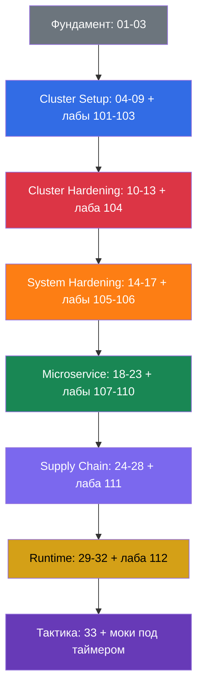

[Eng version](CKS.md) · [Versión en español](CKS_ES.md) · [Version française](CKS_FR.md) · [Deutsche Version](CKS_DE.md) · [ქართული ვერსია](CKS_GE.md) · [繁體中文版](CKS_TW.md) · [日本語版](CKS_JP.md)

# Путеводитель по подготовке к CKS

[← Оглавление курса](README_RU.md) · [Глоссарий](GLOSSARY_RU.md)

Этот маршрут собирает главы и практику для **CKS (Certified Kubernetes Security Specialist)**. Он рассчитан на инженера с уровнем CKA и организован по официальным доменам экзамена.

> **Формат экзамена.** CKS - практический, performance-based экзамен: 2 часа, проходной балл 67%, Kubernetes `v1.36`. Нужно быстро работать с несколькими контекстами, конфигурацией control plane и нодами по SSH. Тактика, разрешённая документация и финальный чеклист - в [главе 33](33/ru.md).

## С чего начать

CKS не повторяет CKA. До начала уверенно освежите следующие темы:

- [RBAC](../../cka/course/38/ru.md): Role, ClusterRole, binding и `kubectl auth can-i`.
- [NetworkPolicy](../../cka/course/34/ru.md): селекторы, default deny, DNS и CNI.
- [SecurityContext и capabilities](../../cka/course/20/ru.md), [ServiceAccount и admission](../../cka/course/21/ru.md).
- [Secret](../../cka/course/19/ru.md), [образы и Dockerfile](../../cka/course/23/ru.md).
- [kubeadm](../../cka/course/35/ru.md), [обновление](../../cka/course/36/ru.md), [TLS, kubeconfig и CSR](../../cka/course/39/ru.md).

После этого пройдите [главы 01-03](01/ru.md): они дают словарь модели угроз и связывают Linux-механизмы с последующим hardening.

## Домены CKS и главы

### 🟦 Cluster Setup - 15%

- [04. NetworkPolicy для безопасности](04/ru.md)
- [05. Защита node metadata и endpoints](05/ru.md)
- [06. Cilium NetworkPolicy](06/ru.md)
- [07. CIS Benchmark и kube-bench](07/ru.md)
- [08. Secure Ingress с TLS](08/ru.md)
- [09. Небезопасные аргументы компонентов и проверка бинарников](09/ru.md)

### 🟥 Cluster Hardening - 15%

- [10. RBAC для минимизации доступа](10/ru.md)
- [11. ServiceAccounts: минимизация и токены](11/ru.md)
- [12. Ограничение доступа к Kubernetes API](12/ru.md)
- [13. Обновление Kubernetes для устранения уязвимостей](13/ru.md)

### 🟧 System Hardening - 10%

- [14. Минимизация footprint хостовой ОС и безопасность runtime-демона](14/ru.md)
- [15. Least-privilege на хосте и минимизация внешнего доступа](15/ru.md)
- [16. AppArmor](16/ru.md)
- [17. seccomp](17/ru.md)

### 🟩 Minimize Microservice Vulnerabilities - 20%

- [18. SecurityContext углублённо](18/ru.md)
- [19. Pod Security Standards и Pod Security Admission](19/ru.md)
- [20. Admission-контроллеры и policy-движки](20/ru.md)
- [21. Управление секретами](21/ru.md)
- [22. Sandboxed containers](22/ru.md)
- [23. Pod-to-Pod шифрование и mTLS](23/ru.md)

### 🟪 Supply Chain Security - 20%

- [24. Минимизация базового образа](24/ru.md)
- [25. SBOM, CI/CD и artifact repositories](25/ru.md)
- [26. Реестры, подпись и валидация артефактов](26/ru.md)
- [27. Статический анализ нагрузок и образов](27/ru.md)
- [28. Сканирование образов](28/ru.md)

### 🟨 Monitoring, Logging & Runtime Security - 20%

- [29. Falco](29/ru.md)
- [30. Обнаружение угроз и расследование](30/ru.md)
- [31. Иммутабельность контейнеров](31/ru.md)
- [32. Audit-логи Kubernetes](32/ru.md)

## Компетенция → глава

| Домен | Компетенция | Главы |
|-------|-------------|-------|
| Cluster Setup | Network security policies для ограничения доступа на уровне кластера | [04](04/ru.md), [05](05/ru.md), [06](06/ru.md) |
| Cluster Setup | CIS Benchmark для компонентов etcd, kubelet, kube-dns и kube-apiserver | [07](07/ru.md) |
| Cluster Setup | Правильная настройка Ingress с TLS | [08](08/ru.md) |
| Cluster Setup | Защита node metadata и endpoints | [05](05/ru.md), [09](09/ru.md) |
| Cluster Setup | Проверка бинарников платформы перед деплоем | [09](09/ru.md) |
| Cluster Hardening | RBAC для минимизации доступа | [10](10/ru.md) |
| Cluster Hardening | Осторожная работа с ServiceAccount: отключение default и минимальные права | [11](11/ru.md) |
| Cluster Hardening | Ограничение доступа к Kubernetes API | [12](12/ru.md), [09](09/ru.md) |
| Cluster Hardening | Обновление Kubernetes для устранения уязвимостей | [13](13/ru.md) |
| System Hardening | Минимизация footprint хостовой ОС | [14](14/ru.md) |
| System Hardening | Least-privilege identity and access management | [15](15/ru.md) |
| System Hardening | Минимизация внешнего доступа к сети | [14](14/ru.md), [15](15/ru.md) |
| System Hardening | Hardening ядра: AppArmor | [16](16/ru.md), [03](03/ru.md) |
| System Hardening | Hardening ядра: seccomp | [17](17/ru.md), [03](03/ru.md) |
| Microservice | Pod Security Standards | [18](18/ru.md), [19](19/ru.md) |
| Microservice | Управление Secret Kubernetes | [21](21/ru.md) |
| Microservice | Изоляция: multi-tenancy и sandboxed containers | [22](22/ru.md) |
| Microservice | Pod-to-Pod шифрование с Cilium | [23](23/ru.md) |
| Supply Chain | Минимизация footprint базового образа | [24](24/ru.md) |
| Supply Chain | Supply chain: SBOM, CI/CD, artifact repositories | [25](25/ru.md) |
| Supply Chain | Разрешённые реестры, подпись и валидация артефактов | [26](26/ru.md) |
| Supply Chain | Статический анализ нагрузок и образов: kubesec, kube-linter, hadolint | [27](27/ru.md) |
| Supply Chain | Сканирование известных уязвимостей и SBOM | [28](28/ru.md), [25](25/ru.md) |
| Runtime | Поведенческий анализ вредоносной активности | [29](29/ru.md) |
| Runtime | Детект угроз в инфраструктуре, приложениях, сети, данных, пользователях и нагрузках | [30](30/ru.md), [29](29/ru.md) |
| Runtime | Расследование и определение фаз атаки и злоумышленников | [02](02/ru.md), [30](30/ru.md) |
| Runtime | Иммутабельность контейнеров во время выполнения | [31](31/ru.md), [18](18/ru.md) |
| Runtime | Audit-логи Kubernetes для мониторинга доступа | [32](32/ru.md) |

## Домен → лабы

| Домен | Лабы |
|-------|------|
| 🟦 Cluster Setup | [101](../labs/101/README_RU.MD) NetworkPolicy и metadata, [102](../labs/102/README_RU.MD) Cilium L3/L4/L7, [103](../labs/103/README_RU.MD) CIS, TLS и binary verification |
| 🟥 Cluster Hardening | [104](../labs/104/README_RU.MD) RBAC, ServiceAccount и API access |
| 🟧 System Hardening | [105](../labs/105/README_RU.MD) ОС, сеть и Docker daemon, [106](../labs/106/README_RU.MD) AppArmor и seccomp |
| 🟩 Minimize Microservice Vulnerabilities | [107](../labs/107/README_RU.MD) PSA и SecurityContext, [108](../labs/108/README_RU.MD) admission policies, [109](../labs/109/README_RU.MD) encryption at rest, [110](../labs/110/README_RU.MD) gVisor, Cilium и Istio |
| 🟪 Supply Chain Security | [108](../labs/108/README_RU.MD) allowlist, [111](../labs/111/README_RU.MD) images, SBOM, scan и signing |
| 🟨 Monitoring, Logging & Runtime Security | [112](../labs/112/README_RU.MD) Falco, audit-логи и иммутабельность |

## Рекомендуемый порядок подготовки

Не откладывайте лабы: в CKS ценятся не определения, а безопасные изменения, проверенные на реальном кластере. После каждого домена фиксируйте команды и пути конфигураций в личном чеклисте, затем отрабатывайте их под таймером в [главе 33](33/ru.md).
