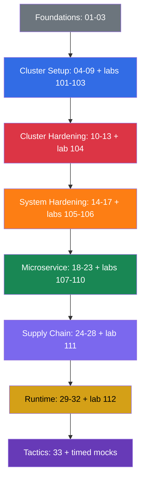

[Русская версия](README_RU.md) · [Versión en español](README_ES.md) · [Version française](README_FR.md) · [Deutsche Version](README_DE.md) · [ქართული ვერსია](README_GE.md) · [繁體中文版](README_TW.md) · [日本語版](README_JP.md)

# CKS: A Practical Self-Study Guide to Kubernetes Security

A practical course for preparing for **CKS (Certified Kubernetes Security Specialist)**, the CNCF and Linux Foundation certification in Kubernetes security. It is a continuation of the [CKA + CKAD course](../../cka/course/README.md): it assumes you can already administer a cluster and work with `kubectl`, RBAC, NetworkPolicy, SecurityContext, kubeadm, and TLS. CKS does not repeat that foundation; it applies it to threat models, hardening, and incident investigation.

## About the project and its maintenance

The course is maintained by **Viktar Mikalayeu, CNCF Kubestronaut**, and a community of contributors. Kubestronaut status confirms that the holder has earned and keeps current all five CNCF Kubernetes certifications: CKA, CKAD, CKS, KCNA, and KCSA.

The materials evolve as an independent open-source project: technical statements are checked against primary sources from Kubernetes, CNCF/Linux Foundation, and the official documentation of the projects used; changes go through technical review and automated checks, and the currency of the exam environment, Kubernetes, and security tooling is tracked separately.

For more on the maintainers, technical review, and the principles of maintaining the course, see [MAINTAINERS.md](../MAINTAINERS.md). The list of Kubestronauts is published by CNCF: [CNCF Kubestronaut Program](https://www.cncf.io/training/kubestronaut/). CNCF Kubestronaut list: [Viktar Mikalayeu](https://www.cncf.io/training/kubestronaut/?_sft_lf-country=ge&p=viktar-mikalayeu&_sf_s=viktar+mikalayeu).

> **Independent project.** Kubestronaut status refers to the maintainer's qualification. This course is not an official CNCF or Linux Foundation course and does not imply endorsement, certification, or official approval of its content by either organization.

> **Kubernetes version and the exam.** The main comprehensive labs `101-112` and `114` were verified on Kubernetes `v1.36`, which is the **training version** for the core labs. Lab `113` is an exception by design: the cluster starts on `v1.35.x` and the task's target version is a real upgrade to `v1.36.x` (the topic of the lab is the minor-upgrade process itself, so the final version matches the baseline of the other core labs). As of the verification date 2026-09-06, the official LF pages (the main CKS page, "Important Instructions: CKS", and the FAQ) consistently state Kubernetes `v1.35` for the CKS exam environment; the current CNCF curriculum is still named `CKS Curriculum v1.34` by its file name, since curriculum version and exam environment version are maintained independently. Before the exam, re-check the main CKS page, Important Instructions, and the FAQ, as well as the version shown in ExamUI. The detailed release process is described in the [version policy](../VERSION_POLICY.md); the Russian style guide is [STYLE_RU.md (RU)](../STYLE_RU.md).

## How the course is organized

Each topic is a numbered directory with one file per language: the Russian source `ru.md` and the translations `README.md` (English), `es.md`, `fr.md`, `de.md`, `ge.md`, `tw.md`, and `jp.md`. The chapters are grouped by CKS domain and marked with a color:

- 🟦 Cluster Setup - 15%
- 🟥 Cluster Hardening - 15%
- 🟧 System Hardening - 10%
- 🟩 Minimize Microservice Vulnerabilities - 20%
- 🟪 Supply Chain Security - 20%
- 🟨 Monitoring, Logging & Runtime Security - 20%
- ⬜ foundations and exam preparation

Inside the chapters you will meet four visual markers that separate the material by type, not by importance:

- 🎯 **CKS Core** - what you must be able to do and verify on the exam.
- 🧠 **Why it works** - a model of the mechanism; explains the reasoning.
- 🔬 **Deep Dive** - a deeper look, an edge case, an alternative, or legacy context.
- 🏭 **Production** - how this is applied in real operations.

Terms will be collected in the [glossary (RU)](GLOSSARY_RU.md). Ready-made YAML/CLI snippets without theory are in the [cheat sheet (RU)](CHEATSHEET_RU.md), and common causes of `[FAIL]` in the labs are in the [error reference (RU)](TROUBLESHOOTING_INDEX_RU.md). Production-current security changes that do not belong to a single CKS domain are placed in version-specific appendices: [Kubernetes v1.36 Security Delta (RU)](APPENDIX_K8S_136_SECURITY_DELTA_RU.md) - the training baseline; [Kubernetes v1.37 Security Delta (RU)](APPENDIX_K8S_137_SECURITY_DELTA_RU.md) - current upstream, not automatically CKS Core.

## Exam format

CKS is a hands-on, performance-based exam: 2 hours, a passing score of 67%. You need to work quickly across several contexts, the control plane configuration, and nodes over SSH. Tactics, the permitted documentation, and the final checklist are in [chapter 33](33/README.md).

## Where to start

CKS does not repeat CKA. Before you begin, confidently refresh the following topics:

- [RBAC](../../cka/course/38/README.md): Role, ClusterRole, bindings, and `kubectl auth can-i`.
- [NetworkPolicy](../../cka/course/34/README.md): selectors, default deny, DNS, and CNI.
- [SecurityContext and capabilities](../../cka/course/20/README.md), [ServiceAccount and admission](../../cka/course/21/README.md).
- [Secret](../../cka/course/19/README.md), [images and Dockerfile](../../cka/course/23/README.md).
- [kubeadm](../../cka/course/35/README.md), [upgrades](../../cka/course/36/README.md), [TLS, kubeconfig, and CSR](../../cka/course/39/README.md).

After that, work through chapters 01-03: they give you the threat-model vocabulary and connect Linux mechanisms to the hardening that follows.

## Official exam curriculum

| Domain | Weight |
|-------|-----|
| Cluster Setup | 15% |
| Cluster Hardening | 15% |
| System Hardening | 10% |
| Minimize Microservice Vulnerabilities | 20% |
| Supply Chain Security | 20% |
| Monitoring, Logging and Runtime Security | 20% |

## Contents

### Part 0. Security foundations (optional) ⬜

1. [Introduction: the CKS exam, how it differs from CKA, and course structure](01/README.md)
2. [Kubernetes security model: 4C, attack surface, and attack phases](02/README.md)
3. [Linux security mechanisms under the hood](03/README.md)

### Part 1. Cluster Setup - 15% 🟦

4. [NetworkPolicy for security: default deny, ingress/egress, and pod-to-pod isolation](04/README.md)
5. [Protecting node metadata and endpoints with network policies](05/README.md)
6. [Cilium NetworkPolicy: L3/L4/L7, DNS, and Hubble](06/README.md)
7. [CIS Benchmark and kube-bench](07/README.md)
8. [Secure Ingress with TLS](08/README.md)
9. [Insecure component arguments, TLS hardening, and binary verification](09/README.md)

### Part 2. Cluster Hardening - 15% 🟥

10. [RBAC for minimizing access](10/README.md)
11. [ServiceAccounts: minimization and tokens](11/README.md)
12. [Restricting access to the Kubernetes API](12/README.md)
13. [Upgrading Kubernetes to remediate vulnerabilities](13/README.md)

### Part 3. System Hardening - 10% 🟧

14. [Minimizing host OS footprint and runtime daemon security](14/README.md)
15. [Host least privilege and minimizing external network access](15/README.md)
16. [AppArmor](16/README.md)
17. [seccomp](17/README.md)

### Part 4. Minimize Microservice Vulnerabilities - 20% 🟩

18. [SecurityContext in depth](18/README.md)
19. [Pod Security Standards and Pod Security Admission](19/README.md)
20. [Admission controllers and policy engines: OPA/Gatekeeper and Kyverno](20/README.md)
21. [Kubernetes Secret management](21/README.md)
22. [Isolation and sandboxed containers: gVisor and Kata](22/README.md)
23. [Pod-to-Pod encryption and mTLS: Cilium and Istio](23/README.md)

### Part 5. Supply Chain Security - 20% 🟪

24. [Minimizing the base image](24/README.md)
25. [Understanding the supply chain: SBOM, CI/CD, artifact repositories](25/README.md)
26. [Supply-chain security: registries, signing, and artifact validation](26/README.md)
27. [Static analysis of workloads and images](27/README.md)
28. [Scanning images for known vulnerabilities](28/README.md)

### Part 6. Monitoring, Logging & Runtime Security - 20% 🟨

29. [Runtime behavioral analysis: Falco](29/README.md)
30. [Threat detection and investigation of attack phases](30/README.md)
31. [Container immutability at runtime](31/README.md)
32. [Kubernetes audit logs](32/README.md)

### Part 7. Exam preparation ⬜

33. [The CKS exam: format, time management, permitted documentation, checklist](33/README.md)

## Competency → chapter

| Domain        | Competency                                                                                                                                    | Chapters                                  |
| ----------------- | --------------------------------------------------------------------------------------------------------------------------------------------------------- | ------------------------------------------- |
| Cluster Setup     | Network security policies to restrict cluster-level access                                                 | [04](04/README.md), [05](05/README.md), [06](06/README.md) |
| Cluster Setup     | CIS Benchmark for the etcd, kubelet, kube-dns, and kube-apiserver components                                                                     | [07](07/README.md)                               |
| Cluster Setup     | Properly configuring Ingress with TLS                                                                                                    | [08](08/README.md)                               |
| Cluster Setup     | Protecting node metadata and endpoints                                                                                                                   | [05](05/README.md), [09](09/README.md)                |
| Cluster Setup     | Verifying platform binaries before deployment                                                                        | [09](09/README.md)                               |
| Cluster Hardening | RBAC for minimizing access                                                                                                         | [10](10/README.md)                               |
| Cluster Hardening | Careful ServiceAccount handling: disabling the default one and granting minimal rights                                    | [11](11/README.md)                               |
| Cluster Hardening | Restricting access to the Kubernetes API                                                                                                   | [12](12/README.md), [09](09/README.md)                |
| Cluster Hardening | Upgrading Kubernetes to remediate vulnerabilities                                                                        | [13](13/README.md)                               |
| System Hardening  | Minimizing host OS footprint                                                                                                    | [14](14/README.md)                               |
| System Hardening  | Least-privilege identity and access management                                                                                                            | [15](15/README.md)                               |
| System Hardening  | Minimizing external network access                                                                                        | [14](14/README.md), [15](15/README.md)                |
| System Hardening  | Kernel hardening: AppArmor                                                                                                                              | [16](16/README.md), [03](03/README.md)                |
| System Hardening  | Kernel hardening: seccomp                                                                                                                               | [17](17/README.md), [03](03/README.md)                |
| Microservice      | Pod Security Standards                                                                                                                                    | [18](18/README.md), [19](19/README.md)                |
| Microservice      | Managing Kubernetes Secrets                                                                                                                    | [21](21/README.md)                               |
| Microservice      | Isolation: multi-tenancy and sandboxed containers                                                                                                   | [22](22/README.md)                               |
| Microservice      | Pod-to-Pod encryption with Cilium                                                                                                                 | [23](23/README.md)                               |
| Supply Chain      | Minimizing the base image footprint                                                                                            | [24](24/README.md)                               |
| Supply Chain      | Supply chain: SBOM, CI/CD, artifact repositories                                                                                                          | [25](25/README.md)                               |
| Supply Chain      | Allowed registries, signing, and artifact validation                                                          | [26](26/README.md)                               |
| Supply Chain      | Static analysis of workloads and images: kubesec, kube-linter, hadolint                                                    | [27](27/README.md)                               |
| Supply Chain      | Scanning for known vulnerabilities and SBOM                                                                                | [28](28/README.md), [25](25/README.md)                |
| Runtime           | Behavioral analysis of malicious activity                                                                       | [29](29/README.md)                               |
| Runtime           | Threat detection across infrastructure, applications, network, data, users, and workloads | [30](30/README.md), [29](29/README.md)                |
| Runtime           | Investigating and identifying attack phases and attackers                                                  | [02](02/README.md), [30](30/README.md)                |
| Runtime           | Container immutability at runtime                                                                | [31](31/README.md), [18](18/README.md)                |
| Runtime           | Kubernetes audit logs for access monitoring                                                                                    | [32](32/README.md)                               |

## Domain → labs

The lab descriptions are available in Russian only.

| Domain                                | Labs                                                                                                                                                                                                            |
| ----------------------------------------- | ------------------------------------------------------------------------------------------------------------------------------------------------------------------------------------------------------------------- |
| 🟦 Cluster Setup                          | [101 (RU)](../labs/101/README_RU.MD) NetworkPolicy and metadata, [102 (RU)](../labs/102/README_RU.MD) Cilium L3/L4/L7, [103 (RU)](../labs/103/README_RU.MD) CIS, TLS, and binary verification, [115 (RU)](../labs/115/README_RU.MD) Cilium bootstrap and kube-proxy replacement (advanced/production, not CKS Core)                                            |
| 🟥 Cluster Hardening                      | [104 (RU)](../labs/104/README_RU.MD) RBAC, ServiceAccount, and API access, [113 (RU)](../labs/113/README_RU.MD) kubeadm upgrade, [114 (RU)](../labs/114/README_RU.MD) kubeconfig contexts, client certificate, and Service exposure                                                                                                 |
| 🟧 System Hardening                       | [105 (RU)](../labs/105/README_RU.MD) OS, network, and Docker daemon, [106 (RU)](../labs/106/README_RU.MD) AppArmor and seccomp                                                                                                  |
| 🟩 Minimize Microservice Vulnerabilities  | [107 (RU)](../labs/107/README_RU.MD) PSA and SecurityContext, [108 (RU)](../labs/108/README_RU.MD) admission policies, [109 (RU)](../labs/109/README_RU.MD) encryption at rest, [110 (RU)](../labs/110/README_RU.MD) gVisor, Cilium, and Istio, [115 (RU)](../labs/115/README_RU.MD) WireGuard and Cilium Mutual Authentication on SPIRE (advanced/production, not CKS Core) |
| 🟪 Supply Chain Security                  | [108 (RU)](../labs/108/README_RU.MD) allowlist, [111 (RU)](../labs/111/README_RU.MD) images, SBOM, scanning, signing, and multi-image CVE triage                                                                                                              |
| 🟨 Monitoring, Logging & Runtime Security | [112 (RU)](../labs/112/README_RU.MD) Falco, audit logs, and immutability                                                                                                                              |

## Practice

The course has four levels of practice, and they do not replace one another - each checks its own skill, from a quick check of a single fact (Level 1) to independent validation before the exam (Level 4):

Inside most chapters you will find Level 1 (🌐/🎮 Killercoda links) and Level 2 (🧪 lab) side by side -
this is not duplication. A 10-minute Killercoda scenario on RBAC does not replace
lab 104, where the same RBAC boundary develops over several tasks, breaks, and is
restored, and its result has to be proven with an evidence artifact. A Killercoda link
currently appears in 23 of the 33 chapters - wherever a suitable ready-made scenario exists for the topic;
a few chapters (for example, the introductory chapters 1-2 and the exam-format overview in 33) have no direct
counterpart in the Killercoda catalog and rely on Level 2/3 only. Level 3 (mocks)
and Level 4 (Killer.sh) are not tied to individual chapters - they combine the material of all domains
at once, under time pressure.

- ⚡ **Level 1** (5-15 minutes). Killercoda scenarios in most chapters (for example, `rbac-serviceaccount-permissions`) - a quick check of a single fact or command right after the theory.
- 🔬 **Level 2** (30-120+ minutes). 🧪 [CKS labs](../labs) - a plan of 15 labs with automatic `check_result` verification, from NetworkPolicy to Falco, audit logs, and kubeadm upgrade. This is where the full workflow is built: hardening → break → verify → evidence.

> **Why the reference solutions are short.** A single lab task can have several technically correct solutions. The course's reference solutions do not claim to be the only correct way: they deliberately choose a short, repeatable, and easily verifiable path that helps minimize time and the number of actions when performing similar tasks on the exam. The goal of a solution is to build exam muscle memory: make the required change quickly and immediately confirm that the result is actually correct. More general or production-oriented variants can be useful in real operations, but they are not the goal of an exam-oriented solution.
- 🎯 **Level 3** (120 minutes). 🧪 [CKS mock exams](../mock) - timed rehearsals that mix all domains at once; in English, like the tasks of the real exam (LF also offers CKS in Japanese and Simplified Chinese through a separate registration, but not in Russian) - get used to reading task wording in English beforehand.
- 🧭 **Level 4** (independent environment). [Killer.sh](https://killer.sh/cks) (included with the standard LF exam registration) - two simulated runs of 17 tasks each, in a separate 36-hour window per run. Use it at the end of your preparation, not instead of Level 2-3: it is a final stress test, not the main source of knowledge. **Important:** access to the simulator is not included in the `CKS-SINGLE` registration (an exam without a retake) - if you registered under that plan, you will need to buy Killer.sh separately on the Killer.sh site, or rely on Level 2-3 only.

Start with chapters 01-03, then go through the domains together with the corresponding labs. The final rehearsal and checklist are collected in [chapter 33](33/README.md).

## Recommended preparation order

Do not put the labs off: CKS rewards not definitions but safe changes verified on a real cluster. After each domain, record the commands and configuration paths in a personal checklist, then rehearse them against the clock using [chapter 33](33/README.md).

## Further reading

- B. Muschko, **Certified Kubernetes Security Specialist (CKS) Study Guide**, O'Reilly, 1st edition, 2023. Useful as a compact overview of the exam structure, but check its technical recommendations against the current documentation and the Security Delta appendices of this course.
- [Official Kubernetes documentation](https://kubernetes.io/docs/) - the primary source for the API and hardening.
- [Falco](https://falco.org/docs/), [Trivy](https://trivy.dev/latest/docs/), [Cilium](https://docs.cilium.io/), [Kyverno](https://kyverno.io/docs/) - documentation of the course's practical tools.
- [CIS Kubernetes Benchmark](https://www.cisecurity.org/benchmark/kubernetes) - recommendations for secure component configuration.
