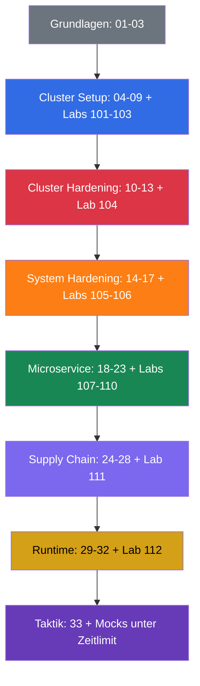

[Русская версия](README_RU.md) · [Eng version](README.md) · [Versión en español](README_ES.md) · [Version française](README_FR.md) · [ქართული ვერსია](README_GE.md) · [繁體中文版](README_TW.md) · [日本語版](README_JP.md)

# CKS: praktisches Selbstlernbuch zur Kubernetes-Sicherheit

Ein praktischer Kurs zur Vorbereitung auf die **CKS (Certified Kubernetes Security Specialist)** - die Zertifizierung von CNCF und Linux Foundation für die Absicherung von Kubernetes. Er ist die Fortsetzung des [CKA + CKAD-Kurses](../../cka/course/README_DE.md): Es wird vorausgesetzt, dass Sie bereits einen Cluster administrieren und mit `kubectl`, RBAC, NetworkPolicy, SecurityContext, kubeadm und TLS arbeiten können. Die CKS wiederholt diese Grundlagen nicht, sondern wendet sie auf Bedrohungsmodelle, Hardening und Incident-Untersuchungen an.

## Über das Projekt und seine Pflege

Der Kurs wird von **Viktar Mikalayeu, CNCF Kubestronaut**, und einer Community von Contributors gepflegt. Der Kubestronaut-Status bestätigt, dass die fünf Kubernetes-Zertifizierungen der CNCF - CKA, CKAD, CKS, KCNA und KCSA - vorliegen und gültig gehalten werden.

Die Materialien entwickeln sich als unabhängiges Open-Source-Projekt weiter: Technische Aussagen werden mit Primärquellen von Kubernetes, CNCF/Linux Foundation und der offiziellen Dokumentation der eingesetzten Projekte abgeglichen; Änderungen durchlaufen ein technisches Review und automatische Prüfungen, und die Aktualität der Prüfungsumgebung, von Kubernetes und des Security-Tooling wird separat verfolgt.

Mehr zu Maintainers, technischem Review und den Prinzipien der Kurspflege: [MAINTAINERS.md](../MAINTAINERS.md). Die Liste der Kubestronauts veröffentlicht die CNCF: [CNCF Kubestronaut Program](https://www.cncf.io/training/kubestronaut/). CNCF Kubestronaut list: [Viktar Mikalayeu](https://www.cncf.io/training/kubestronaut/?_sft_lf-country=ge&p=viktar-mikalayeu&_sf_s=viktar+mikalayeu).

> **Unabhängiges Projekt.** Der Kubestronaut-Status bezieht sich auf die Qualifikation des Maintainers. Dieser Kurs ist kein offizieller Kurs der CNCF oder der Linux Foundation und impliziert weder Endorsement noch Zertifizierung oder eine offizielle Billigung des Projektinhalts durch diese.

> **Kubernetes-Version und Prüfung.** Die wichtigsten umfassenden Labs `101-112` und `114` wurden auf Kubernetes `v1.36` geprüft - das ist die **Lernversion** für die Core Labs. Lab `113` ist konstruktionsbedingt eine Ausnahme: Der Cluster startet mit `v1.35.x`, und das Ziel der Aufgabe ist ein echtes Upgrade auf `v1.36.x` (Thema des Labs ist der Minor-Upgrade-Prozess selbst, daher entspricht die Endversion der Baseline der übrigen Core Labs). Zum Prüfdatum 2026-09-06 nennen die offiziellen LF-Seiten (die Hauptseite der CKS, „Important Instructions: CKS" und die FAQ) übereinstimmend Kubernetes `v1.35` für die CKS-Prüfungsumgebung; das aktuelle CNCF-Curriculum trägt dem Dateinamen nach weiterhin `CKS Curriculum v1.34` - Curriculum-Version und Version der Prüfungsumgebung werden unabhängig voneinander gepflegt. Prüfen Sie vor der Prüfung die Hauptseite der CKS, Important Instructions und die FAQ sowie die im ExamUI angezeigte Version erneut. Der ausführliche Release-Prozess steht in der [Versionsrichtlinie](../VERSION_POLICY.md), der russische Stil in [STYLE_RU.md (RU)](../STYLE_RU.md).

## Aufbau des Kurses

Jedes Thema ist ein nummeriertes Verzeichnis mit Dateien je Sprache: die russische Quelle `ru.md` und die Übersetzungen `README.md` (English), `es.md`, `fr.md`, `de.md`, `ge.md`, `tw.md`, `jp.md`. Die Kapitel sind nach den CKS-Domänen gruppiert und farblich markiert:

- 🟦 Cluster Setup - 15 %
- 🟥 Cluster Hardening - 15 %
- 🟧 System Hardening - 10 %
- 🟩 Minimize Microservice Vulnerabilities - 20 %
- 🟪 Supply Chain Security - 20 %
- 🟨 Monitoring, Logging & Runtime Security - 20 %
- ⬜ Grundlagen und Prüfungsvorbereitung

In den Kapiteln begegnen Ihnen vier visuelle Markierungen, die das Material nach Art und nicht nach Wichtigkeit unterteilen:

- 🎯 **CKS Core** - das müssen Sie in der Prüfung ausführen und prüfen können.
- 🧠 **Warum das funktioniert** - das Modell des Mechanismus, erklärt die Begründung.
- 🔬 **Deep Dive** - Vertiefung, Edge Case, Alternative oder Legacy-Kontext.
- 🏭 **Production** - wie es im realen Betrieb eingesetzt wird.

Begriffe werden im [Glossar (RU)](GLOSSARY_RU.md) gesammelt. Fertige YAML/CLI-Snippets ohne Theorie stehen im [Spickzettel (RU)](CHEATSHEET_RU.md), häufige Ursachen für `[FAIL]` in den Labs im [Fehlerverzeichnis (RU)](TROUBLESHOOTING_INDEX_RU.md). Production-aktuelle Security-Änderungen, die keiner einzelnen CKS-Domäne zugeordnet sind, sind in versionsspezifische Anhänge ausgelagert: [Kubernetes v1.36 Security Delta (RU)](APPENDIX_K8S_136_SECURITY_DELTA_RU.md) - Training Baseline; [Kubernetes v1.37 Security Delta (RU)](APPENDIX_K8S_137_SECURITY_DELTA_RU.md) - aktueller Upstream, nicht automatisch CKS Core.

## Prüfungsformat

Die CKS ist eine praktische, Performance-based Prüfung: 2 Stunden, Bestehensgrenze 67 %. Sie müssen schnell mit mehreren Kontexten, der Control-Plane-Konfiguration und den Nodes per SSH arbeiten. Taktik, erlaubte Dokumentation und die finale Checkliste stehen in [Kapitel 33](33/de.md).

## Wo Sie anfangen

Die CKS wiederholt die CKA nicht. Frischen Sie vor dem Start die folgenden Themen sicher auf:

- [RBAC](../../cka/course/38/de.md): Role, ClusterRole, Binding und `kubectl auth can-i`.
- [NetworkPolicy](../../cka/course/34/de.md): Selektoren, Default Deny, DNS und CNI.
- [SecurityContext und Capabilities](../../cka/course/20/de.md), [ServiceAccount und Admission](../../cka/course/21/de.md).
- [Secret](../../cka/course/19/de.md), [Images und Dockerfile](../../cka/course/23/de.md).
- [kubeadm](../../cka/course/35/de.md), [Upgrade](../../cka/course/36/de.md), [TLS, kubeconfig und CSR](../../cka/course/39/de.md).

Arbeiten Sie danach die Kapitel 01-03 durch: Sie liefern das Vokabular des Bedrohungsmodells und verbinden die Linux-Mechanismen mit dem späteren Hardening.

## Offizielles Prüfungscurriculum

| Domäne | Gewicht |
|-------|-----|
| Cluster Setup | 15 % |
| Cluster Hardening | 15 % |
| System Hardening | 10 % |
| Minimize Microservice Vulnerabilities | 20 % |
| Supply Chain Security | 20 % |
| Monitoring, Logging and Runtime Security | 20 % |

## Inhalt

### Teil 0. Sicherheitsgrundlagen (optional) ⬜

1. [Einführung: die CKS-Prüfung, Unterschiede zur CKA, Aufbau des Kurses](01/de.md)
2. [Kubernetes-Sicherheitsmodell: 4C, Angriffsfläche, Angriffsphasen](02/de.md)
3. [Linux-Sicherheitsmechanismen unter der Haube](03/de.md)

### Teil 1. Cluster Setup - 15 % 🟦

4. [NetworkPolicy für Sicherheit: Default Deny, Ingress/Egress, Pod-to-Pod-Isolation](04/de.md)
5. [Schutz von Node Metadata und Endpoints durch Netzwerkrichtlinien](05/de.md)
6. [Cilium NetworkPolicy: L3/L4/L7, DNS und Hubble](06/de.md)
7. [CIS Benchmark und kube-bench](07/de.md)
8. [Sicherer Ingress mit TLS](08/de.md)
9. [Unsichere Komponentenargumente, TLS-Hardening und Prüfung von Binaries](09/de.md)

### Teil 2. Cluster Hardening - 15 % 🟥

10. [RBAC zur Minimierung von Zugriffen](10/de.md)
11. [ServiceAccounts: Minimierung und Tokens](11/de.md)
12. [Einschränkung des Zugriffs auf die Kubernetes API](12/de.md)
13. [Kubernetes-Upgrade zur Behebung von Schwachstellen](13/de.md)

### Teil 3. System Hardening - 10 % 🟧

14. [Minimierung des Footprints des Host-Betriebssystems und Sicherheit des Runtime-Daemons](14/de.md)
15. [Least Privilege auf dem Host und Minimierung des externen Netzwerkzugriffs](15/de.md)
16. [AppArmor](16/de.md)
17. [seccomp](17/de.md)

### Teil 4. Minimize Microservice Vulnerabilities - 20 % 🟩

18. [SecurityContext im Detail](18/de.md)
19. [Pod Security Standards und Pod Security Admission](19/de.md)
20. [Admission Controller und Policy Engines: OPA/Gatekeeper und Kyverno](20/de.md)
21. [Verwaltung von Kubernetes Secrets](21/de.md)
22. [Isolation und Sandboxed Containers: gVisor und Kata](22/de.md)
23. [Pod-to-Pod-Verschlüsselung und mTLS: Cilium und Istio](23/de.md)

### Teil 5. Supply Chain Security - 20 % 🟪

24. [Minimierung des Base Image](24/de.md)
25. [Supply Chain verstehen: SBOM, CI/CD, Artifact Repositories](25/de.md)
26. [Supply Chain absichern: Registries, Signatur und Validierung von Artefakten](26/de.md)
27. [Statische Analyse von Workloads und Images](27/de.md)
28. [Scannen von Images auf bekannte Schwachstellen](28/de.md)

### Teil 6. Monitoring, Logging & Runtime Security - 20 % 🟨

29. [Verhaltensanalyse zur Laufzeit: Falco](29/de.md)
30. [Erkennung von Bedrohungen und Untersuchung von Angriffsphasen](30/de.md)
31. [Immutability von Containern zur Laufzeit](31/de.md)
32. [Kubernetes Audit Logs](32/de.md)

### Teil 7. Prüfungsvorbereitung ⬜

33. [Die CKS-Prüfung: Format, Zeitmanagement, erlaubte Dokumentation, Checkliste](33/de.md)

## Kompetenz → Kapitel

| Domäne        | Kompetenz                                                                                                                                    | Kapitel                                  |
| ----------------- | --------------------------------------------------------------------------------------------------------------------------------------------------------- | ------------------------------------------- |
| Cluster Setup     | Network Security Policies zur Zugriffsbeschränkung auf Clusterebene                                                 | [04](04/de.md), [05](05/de.md), [06](06/de.md) |
| Cluster Setup     | CIS Benchmark für die Komponenten etcd, kubelet, kube-dns und kube-apiserver                                                                     | [07](07/de.md)                               |
| Cluster Setup     | Korrekte Konfiguration von Ingress mit TLS                                                                                                    | [08](08/de.md)                               |
| Cluster Setup     | Schutz von Node Metadata und Endpoints                                                                                                                   | [05](05/de.md), [09](09/de.md)                |
| Cluster Setup     | Prüfung der Plattform-Binaries vor dem Deployment                                                                        | [09](09/de.md)                               |
| Cluster Hardening | RBAC zur Minimierung von Zugriffen                                                                                                         | [10](10/de.md)                               |
| Cluster Hardening | Sorgfältiger Umgang mit ServiceAccounts: Default deaktivieren und minimale Rechte                                    | [11](11/de.md)                               |
| Cluster Hardening | Einschränkung des Zugriffs auf die Kubernetes API                                                                                                   | [12](12/de.md), [09](09/de.md)                |
| Cluster Hardening | Kubernetes-Upgrade zur Behebung von Schwachstellen                                                                        | [13](13/de.md)                               |
| System Hardening  | Minimierung des Footprints des Host-Betriebssystems                                                                                                    | [14](14/de.md)                               |
| System Hardening  | Least-Privilege Identity and Access Management                                                                                                            | [15](15/de.md)                               |
| System Hardening  | Minimierung des externen Netzwerkzugriffs                                                                                        | [14](14/de.md), [15](15/de.md)                |
| System Hardening  | Kernel-Hardening: AppArmor                                                                                                                              | [16](16/de.md), [03](03/de.md)                |
| System Hardening  | Kernel-Hardening: seccomp                                                                                                                               | [17](17/de.md), [03](03/de.md)                |
| Microservice      | Pod Security Standards                                                                                                                                    | [18](18/de.md), [19](19/de.md)                |
| Microservice      | Verwaltung von Kubernetes Secrets                                                                                                                    | [21](21/de.md)                               |
| Microservice      | Isolation: Multi-Tenancy und Sandboxed Containers                                                                                                   | [22](22/de.md)                               |
| Microservice      | Pod-to-Pod-Verschlüsselung mit Cilium                                                                                                                 | [23](23/de.md)                               |
| Supply Chain      | Minimierung des Footprints des Base Image                                                                                            | [24](24/de.md)                               |
| Supply Chain      | Supply Chain: SBOM, CI/CD, Artifact Repositories                                                                                                          | [25](25/de.md)                               |
| Supply Chain      | Erlaubte Registries, Signatur und Validierung von Artefakten                                                          | [26](26/de.md)                               |
| Supply Chain      | Statische Analyse von Workloads und Images: kubesec, kube-linter, hadolint                                                    | [27](27/de.md)                               |
| Supply Chain      | Scannen auf bekannte Schwachstellen und SBOM                                                                                | [28](28/de.md), [25](25/de.md)                |
| Runtime           | Verhaltensanalyse schädlicher Aktivität                                                                       | [29](29/de.md)                               |
| Runtime           | Erkennung von Bedrohungen in Infrastruktur, Anwendungen, Netzwerk, Daten, Benutzern und Workloads | [30](30/de.md), [29](29/de.md)                |
| Runtime           | Untersuchung und Bestimmung von Angriffsphasen und Angreifern                                                  | [02](02/de.md), [30](30/de.md)                |
| Runtime           | Immutability von Containern zur Laufzeit                                                                | [31](31/de.md), [18](18/de.md)                |
| Runtime           | Kubernetes Audit Logs zur Überwachung von Zugriffen                                                                                    | [32](32/de.md)                               |

## Domäne → Labs

Die Beschreibungen der Labs sind auf Russisch verfügbar.

| Domäne                                | Labs                                                                                                                                                                                                            |
| ----------------------------------------- | ------------------------------------------------------------------------------------------------------------------------------------------------------------------------------------------------------------------- |
| 🟦 Cluster Setup                          | [101](../labs/101/README_RU.MD) NetworkPolicy und Metadata, [102](../labs/102/README_RU.MD) Cilium L3/L4/L7, [103](../labs/103/README_RU.MD) CIS, TLS und Binary Verification, [115](../labs/115/README_RU.MD) Cilium-Bootstrap und kube-proxy Replacement (advanced/production, nicht CKS Core)                                            |
| 🟥 Cluster Hardening                      | [104](../labs/104/README_RU.MD) RBAC, ServiceAccount und API Access, [113](../labs/113/README_RU.MD) kubeadm Upgrade, [114](../labs/114/README_RU.MD) kubeconfig Contexts, Client Certificate und Service Exposure                                                                                                 |
| 🟧 System Hardening                       | [105](../labs/105/README_RU.MD) OS, Netzwerk und Docker Daemon, [106](../labs/106/README_RU.MD) AppArmor und seccomp                                                                                                  |
| 🟩 Minimize Microservice Vulnerabilities  | [107](../labs/107/README_RU.MD) PSA und SecurityContext, [108](../labs/108/README_RU.MD) Admission Policies, [109](../labs/109/README_RU.MD) Encryption at Rest, [110](../labs/110/README_RU.MD) gVisor, Cilium und Istio, [115](../labs/115/README_RU.MD) WireGuard und Cilium Mutual Authentication auf SPIRE (advanced/production, nicht CKS Core) |
| 🟪 Supply Chain Security                  | [108](../labs/108/README_RU.MD) Allowlist, [111](../labs/111/README_RU.MD) Images, SBOM, Scan, Signing und Multi-Image-CVE-Triage                                                                                                              |
| 🟨 Monitoring, Logging & Runtime Security | [112](../labs/112/README_RU.MD) Falco, Audit Logs und Immutability                                                                                                                              |

## Praxis

Der Kurs bietet vier Praxisebenen, die einander nicht ersetzen - jede prüft eine eigene Fähigkeit, von der schnellen Prüfung eines einzelnen Fakts (Level 1) bis zur unabhängigen Validierung vor der Prüfung (Level 4):

In den meisten Kapiteln finden Sie Level 1 (🌐/🎮 Killercoda-Links) und Level 2 (🧪 Lab) direkt nebeneinander - das ist keine Dopplung. Ein Killercoda-Szenario zu RBAC in 10 Minuten ersetzt nicht Lab 104, in dem dieselbe RBAC-Grenze über mehrere Aufgaben hinweg entwickelt, gebrochen und wiederhergestellt wird und deren Ergebnis mit einem Evidence-Artefakt nachgewiesen werden muss. Einen Killercoda-Link gibt es derzeit in 23 von 33 Kapiteln - dort, wo es für das Thema ein passendes fertiges Szenario gibt; einige Kapitel (etwa die einführenden Kapitel 1-2 und der Überblick über das Prüfungsformat in Kapitel 33) haben im Killercoda-Katalog kein direktes Gegenstück und stützen sich nur auf Level 2/3. Level 3 (Mocks) und Level 4 (Killer.sh) sind nicht an einzelne Kapitel gebunden - sie fassen den Stoff aller Domänen auf einmal unter Zeitdruck zusammen.

- ⚡ **Level 1** (5-15 Minuten). Killercoda-Szenarien in den meisten Kapiteln (zum Beispiel `rbac-serviceaccount-permissions`) - schnelle Prüfung eines einzelnen Fakts oder Befehls direkt nach der Theorie.
- 🔬 **Level 2** (30-120+ Minuten). 🧪 [CKS-Labs](../labs) - ein Plan aus 15 Labs mit automatischer Prüfung über `check_result`, von NetworkPolicy bis Falco, Audit Logs und kubeadm Upgrade. Hier entsteht der vollständige Workflow: Hardening → Break → Verify → Evidence.

> **Warum die Referenzlösungen kurz sind.** Eine Lab-Aufgabe kann mehrere technisch korrekte Lösungen haben. Die Referenz-Solutions des Kurses erheben nicht den Anspruch, der einzig richtige Weg zu sein: Sie wählen bewusst einen kurzen, wiederholbaren und leicht überprüfbaren Weg, der hilft, bei ähnlichen Aufgaben in der Prüfung Zeit und Anzahl der Schritte zu minimieren. Ziel einer Solution ist es, prüfungstaugliches Muskelgedächtnis aufzubauen: die geforderte Änderung schnell umzusetzen und sofort zu bestätigen, dass das Ergebnis tatsächlich korrekt ist. Universellere oder production-orientierte Varianten können im realen Betrieb nützlich sein, sind aber nicht das Ziel einer prüfungsorientierten Solution.
- 🎯 **Level 3** (120 Minuten). 🧪 [CKS-Mock-Prüfungen](../mock) - Proben unter Zeitlimit, die alle Domänen auf einmal mischen; auf Englisch, wie auch die Aufgaben der echten Prüfung (die LF bietet die CKS auch auf Japanisch und in vereinfachtem Chinesisch über eine separate Registrierung an, nicht aber auf Russisch) - gewöhnen Sie sich frühzeitig daran, die Aufgabenstellungen auf Englisch zu lesen.
- 🧭 **Level 4** (unabhängige Umgebung). [Killer.sh](https://killer.sh/cks) (in der Standardregistrierung für die LF-Prüfung enthalten) - zwei simulierte Durchläufe mit je 17 Aufgaben in einem eigenen 36-Stunden-Fenster. Nutzen Sie es am Ende der Vorbereitung und nicht anstelle von Level 2-3: Es ist der finale Stresstest, keine Hauptquelle des Wissens. **Wichtig:** Der Zugang zum Simulator ist in der Registrierung `CKS-SINGLE` (Prüfung ohne Retake) nicht enthalten - wenn Sie sich mit diesem Tarif registriert haben, müssen Sie Killer.sh separat auf der Killer.sh-Website kaufen oder sich nur auf Level 2-3 stützen.

Beginnen Sie mit den Kapiteln 01-03 und arbeiten Sie dann die Domänen gemeinsam mit den zugehörigen Labs durch. Die finale Probe und die Checkliste bietet [Kapitel 33](33/de.md).

## Empfohlene Vorbereitungsreihenfolge

Schieben Sie die Labs nicht auf: In der CKS zählen nicht Definitionen, sondern sichere Änderungen, die auf einem echten Cluster geprüft wurden. Halten Sie nach jeder Domäne Befehle und Konfigurationspfade in einer persönlichen Checkliste fest und üben Sie sie anschließend unter Zeitlimit gemäß [Kapitel 33](33/de.md).

## Weiterführende Literatur

- B. Muschko, **Certified Kubernetes Security Specialist (CKS) Study Guide**, O'Reilly, 1. Auflage, 2023. Nützlich als kompakter Überblick über die Prüfungsstruktur, aber gleichen Sie technische Empfehlungen mit der aktuellen Dokumentation und den Security-Delta-Anhängen dieses Kurses ab.
- [Offizielle Kubernetes-Dokumentation](https://kubernetes.io/docs/) - Primärquelle zu API und Hardening.
- [Falco](https://falco.org/docs/), [Trivy](https://trivy.dev/latest/docs/), [Cilium](https://docs.cilium.io/), [Kyverno](https://kyverno.io/docs/) - Dokumentation der praktischen Tools des Kurses.
- [CIS Kubernetes Benchmark](https://www.cisecurity.org/benchmark/kubernetes) - Empfehlungen zur sicheren Konfiguration der Komponenten.
