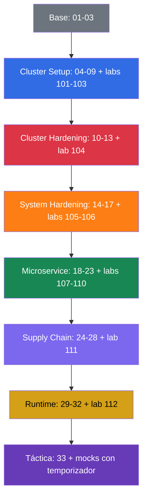

[Русская версия](README_RU.md) · [Eng version](README.md) · [Version française](README_FR.md) · [Deutsche Version](README_DE.md) · [ქართული ვერსია](README_GE.md) · [繁體中文版](README_TW.md) · [日本語版](README_JP.md)

# CKS: curso práctico autodidacta de seguridad de Kubernetes

Curso práctico de preparación para **CKS (Certified Kubernetes Security Specialist)**, la certificación de CNCF y Linux Foundation sobre la protección de Kubernetes. Es la continuación del [curso CKA + CKAD](../../cka/course/README_ES.md): se da por hecho que ya sabe administrar un clúster y trabajar con `kubectl`, RBAC, NetworkPolicy, SecurityContext, kubeadm y TLS. CKS no repite esa base, sino que la aplica a modelos de amenazas, hardening e investigación de incidentes.

## Sobre el proyecto y su mantenimiento

El curso lo mantienen **Viktar Mikalayeu, CNCF Kubestronaut**, y una comunidad de contribuidores. El estatus de Kubestronaut confirma que se poseen y se mantienen vigentes las cinco certificaciones de Kubernetes de CNCF: CKA, CKAD, CKS, KCNA y KCSA.

Los materiales evolucionan como un proyecto open source independiente: las afirmaciones técnicas se contrastan con fuentes primarias de Kubernetes, CNCF/Linux Foundation y la documentación oficial de los proyectos utilizados; los cambios pasan por revisión técnica y comprobaciones automáticas, y la vigencia del entorno del examen, de Kubernetes y de las herramientas de seguridad se sigue por separado.

Más información sobre los maintainers, la revisión técnica y los principios de mantenimiento del curso: [MAINTAINERS.md](../MAINTAINERS.md). CNCF publica la lista de Kubestronauts: [CNCF Kubestronaut Program](https://www.cncf.io/training/kubestronaut/). CNCF Kubestronaut list: [Viktar Mikalayeu](https://www.cncf.io/training/kubestronaut/?_sft_lf-country=ge&p=viktar-mikalayeu&_sf_s=viktar+mikalayeu).

> **Proyecto independiente.** El estatus de Kubestronaut se refiere a la cualificación del maintainer. Este curso no es un curso oficial de CNCF ni de Linux Foundation y no implica endorsement, certificación ni aprobación oficial de su contenido por parte de ellas.

> **Versión de Kubernetes y examen.** Los laboratorios integrales principales `101-112` y `114` se han verificado en Kubernetes `v1.36`: es la **versión de aprendizaje** de los core labs. El laboratorio `113` es una excepción por diseño: el clúster arranca en `v1.35.x` y la versión objetivo de la tarea es un upgrade real a `v1.36.x` (el tema del laboratorio es el propio proceso de minor upgrade, por eso la versión final coincide con el baseline del resto de core labs). En la fecha de verificación, 2026-09-06, las páginas oficiales de LF (la página principal de CKS, «Important Instructions: CKS» y el FAQ) indican de forma coherente Kubernetes `v1.35` para el entorno del examen CKS; el programa vigente de CNCF, por el nombre del archivo, sigue siendo `CKS Curriculum v1.34`: la versión del curriculum y la versión del entorno del examen se mantienen de forma independiente. Antes del examen vuelva a comprobar la página principal de CKS, Important Instructions y el FAQ, así como la versión que muestre ExamUI. El proceso de release se describe en detalle en la [política de versiones](../VERSION_POLICY.md); el estilo ruso, en [STYLE_RU.md (RU)](../STYLE_RU.md).

## Cómo está organizado el curso

Cada tema es un directorio con número y archivos por idioma: el original en ruso `ru.md` y las traducciones `README.md` (English), `es.md`, `fr.md`, `de.md`, `ge.md`, `tw.md` y `jp.md`. Los capítulos se agrupan por dominios de CKS y se marcan con un color:

- 🟦 Cluster Setup - 15 %
- 🟥 Cluster Hardening - 15 %
- 🟧 System Hardening - 10 %
- 🟩 Minimize Microservice Vulnerabilities - 20 %
- 🟪 Supply Chain Security - 20 %
- 🟨 Monitoring, Logging & Runtime Security - 20 %
- ⬜ base y preparación para el examen

Dentro de los capítulos aparecen cuatro marcadores visuales que separan el material por tipo, no por importancia:

- 🎯 **CKS Core**: hay que saber hacerlo y comprobarlo en el examen.
- 🧠 **Por qué funciona**: modelo del mecanismo, explica el razonamiento.
- 🔬 **Deep Dive**: profundización, edge case, alternativa o contexto legacy.
- 🏭 **Production**: cómo se aplica en la operación real.

Los términos se recogerán en el [glosario (RU)](GLOSSARY_RU.md). Los snippets de YAML/CLI listos para usar, sin teoría, están en la [chuleta (RU)](CHEATSHEET_RU.md), y las causas frecuentes de `[FAIL]` en los laboratorios, en la [guía de errores (RU)](TROUBLESHOOTING_INDEX_RU.md). Los cambios de seguridad vigentes en production que no están ligados a un único dominio de CKS se han reunido en apéndices específicos de cada versión: [Kubernetes v1.36 Security Delta (RU)](APPENDIX_K8S_136_SECURITY_DELTA_RU.md): training baseline; [Kubernetes v1.37 Security Delta (RU)](APPENDIX_K8S_137_SECURITY_DELTA_RU.md): current upstream, no es automáticamente CKS Core.

## Formato del examen

CKS es un examen práctico, performance-based: 2 horas, nota de corte del 67 %. Hay que trabajar con rapidez con varios contextos, la configuración del control plane y los nodos por SSH. La táctica, la documentación permitida y el checklist final están en el [capítulo 33](33/es.md).

## Por dónde empezar

CKS no repite CKA. Antes de empezar, repase con soltura los temas siguientes:

- [RBAC](../../cka/course/38/es.md): Role, ClusterRole, binding y `kubectl auth can-i`.
- [NetworkPolicy](../../cka/course/34/es.md): selectores, default deny, DNS y CNI.
- [SecurityContext y capabilities](../../cka/course/20/es.md), [ServiceAccount y admission](../../cka/course/21/es.md).
- [Secret](../../cka/course/19/es.md), [imágenes y Dockerfile](../../cka/course/23/es.md).
- [kubeadm](../../cka/course/35/es.md), [actualización](../../cka/course/36/es.md), [TLS, kubeconfig y CSR](../../cka/course/39/es.md).

Después, estudie los capítulos 01-03: aportan el vocabulario del modelo de amenazas y conectan los mecanismos de Linux con el hardening posterior.

## Programa oficial del examen

| Dominio | Peso |
|---------|------|
| Cluster Setup | 15 % |
| Cluster Hardening | 15 % |
| System Hardening | 10 % |
| Minimize Microservice Vulnerabilities | 20 % |
| Supply Chain Security | 20 % |
| Monitoring, Logging and Runtime Security | 20 % |

## Contenido

### Parte 0. Base de seguridad (opcional) ⬜

1. [Introducción: el examen CKS, diferencias con CKA, estructura del curso](01/es.md)
2. [Modelo de seguridad de Kubernetes: 4C, superficie de ataque, fases del ataque](02/es.md)
3. [Mecanismos de seguridad de Linux bajo el capó](03/es.md)

### Parte 1. Cluster Setup - 15 % 🟦

4. [NetworkPolicy para seguridad: default deny, ingress/egress, aislamiento pod-to-pod](04/es.md)
5. [Protección de node metadata y endpoints con políticas de red](05/es.md)
6. [Cilium NetworkPolicy: L3/L4/L7, DNS y Hubble](06/es.md)
7. [CIS Benchmark y kube-bench](07/es.md)
8. [Secure Ingress con TLS](08/es.md)
9. [Argumentos inseguros de los componentes, hardening de TLS y verificación de binarios](09/es.md)

### Parte 2. Cluster Hardening - 15 % 🟥

10. [RBAC para minimizar el acceso](10/es.md)
11. [ServiceAccounts: minimización y tokens](11/es.md)
12. [Restricción del acceso a la API de Kubernetes](12/es.md)
13. [Actualización de Kubernetes para corregir vulnerabilidades](13/es.md)

### Parte 3. System Hardening - 10 % 🟧

14. [Minimización del footprint del SO del host y seguridad del daemon de runtime](14/es.md)
15. [Least-privilege en el host y minimización del acceso externo a la red](15/es.md)
16. [AppArmor](16/es.md)
17. [seccomp](17/es.md)

### Parte 4. Minimize Microservice Vulnerabilities - 20 % 🟩

18. [SecurityContext en profundidad](18/es.md)
19. [Pod Security Standards y Pod Security Admission](19/es.md)
20. [Admission controllers y motores de policy: OPA/Gatekeeper y Kyverno](20/es.md)
21. [Gestión de Secrets de Kubernetes](21/es.md)
22. [Aislamiento y sandboxed containers: gVisor y Kata](22/es.md)
23. [Cifrado Pod-to-Pod y mTLS: Cilium e Istio](23/es.md)

### Parte 5. Supply Chain Security - 20 % 🟪

24. [Minimización de la imagen base](24/es.md)
25. [Comprender la supply chain: SBOM, CI/CD, artifact repositories](25/es.md)
26. [Protección de la supply chain: registries, firma y validación de artefactos](26/es.md)
27. [Análisis estático de cargas de trabajo e imágenes](27/es.md)
28. [Escaneo de imágenes en busca de vulnerabilidades conocidas](28/es.md)

### Parte 6. Monitoring, Logging & Runtime Security - 20 % 🟨

29. [Análisis de comportamiento en tiempo de ejecución: Falco](29/es.md)
30. [Detección de amenazas e investigación de las fases del ataque](30/es.md)
31. [Inmutabilidad de los contenedores en runtime](31/es.md)
32. [Audit logs de Kubernetes](32/es.md)

### Parte 7. Preparación del examen ⬜

33. [Examen CKS: formato, gestión del tiempo, documentación permitida, checklist](33/es.md)

## Competencia → capítulo

| Dominio | Competencia | Capítulos |
| ----------------- | --------------------------------------------------------------------------------------------------------------------------------------------------------- | ------------------------------------------- |
| Cluster Setup     | Network security policies para restringir el acceso a nivel de clúster                                                 | [04](04/es.md), [05](05/es.md), [06](06/es.md) |
| Cluster Setup     | CIS Benchmark para los componentes etcd, kubelet, kube-dns y kube-apiserver                                                                     | [07](07/es.md)                               |
| Cluster Setup     | Configuración correcta de Ingress con TLS                                                                                                    | [08](08/es.md)                               |
| Cluster Setup     | Protección de node metadata y endpoints                                                                                                                   | [05](05/es.md), [09](09/es.md)                |
| Cluster Setup     | Verificación de los binarios de la plataforma antes del despliegue                                                                        | [09](09/es.md)                               |
| Cluster Hardening | RBAC para minimizar el acceso                                                                                                         | [10](10/es.md)                               |
| Cluster Hardening | Uso prudente de ServiceAccount: desactivar default y permisos mínimos                                    | [11](11/es.md)                               |
| Cluster Hardening | Restricción del acceso a la API de Kubernetes                                                                                                   | [12](12/es.md), [09](09/es.md)                |
| Cluster Hardening | Actualización de Kubernetes para corregir vulnerabilidades                                                                        | [13](13/es.md)                               |
| System Hardening  | Minimización del footprint del SO del host                                                                                                    | [14](14/es.md)                               |
| System Hardening  | Least-privilege identity and access management                                                                                                            | [15](15/es.md)                               |
| System Hardening  | Minimización del acceso externo a la red                                                                                        | [14](14/es.md), [15](15/es.md)                |
| System Hardening  | Hardening del kernel: AppArmor                                                                                                                              | [16](16/es.md), [03](03/es.md)                |
| System Hardening  | Hardening del kernel: seccomp                                                                                                                               | [17](17/es.md), [03](03/es.md)                |
| Microservice      | Pod Security Standards                                                                                                                                    | [18](18/es.md), [19](19/es.md)                |
| Microservice      | Gestión de Secrets de Kubernetes                                                                                                                    | [21](21/es.md)                               |
| Microservice      | Aislamiento: multi-tenancy y sandboxed containers                                                                                                   | [22](22/es.md)                               |
| Microservice      | Cifrado Pod-to-Pod con Cilium                                                                                                                 | [23](23/es.md)                               |
| Supply Chain      | Minimización del footprint de la imagen base                                                                                            | [24](24/es.md)                               |
| Supply Chain      | Supply chain: SBOM, CI/CD, artifact repositories                                                                                                          | [25](25/es.md)                               |
| Supply Chain      | Registries permitidos, firma y validación de artefactos                                                          | [26](26/es.md)                               |
| Supply Chain      | Análisis estático de cargas de trabajo e imágenes: kubesec, kube-linter, hadolint                                                    | [27](27/es.md)                               |
| Supply Chain      | Escaneo de vulnerabilidades conocidas y SBOM                                                                                | [28](28/es.md), [25](25/es.md)                |
| Runtime           | Análisis de comportamiento de la actividad maliciosa                                                                       | [29](29/es.md)                               |
| Runtime           | Detección de amenazas en infraestructura, aplicaciones, red, datos, usuarios y cargas de trabajo | [30](30/es.md), [29](29/es.md)                |
| Runtime           | Investigación y determinación de las fases del ataque y de los atacantes                                                  | [02](02/es.md), [30](30/es.md)                |
| Runtime           | Inmutabilidad de los contenedores durante la ejecución                                                                | [31](31/es.md), [18](18/es.md)                |
| Runtime           | Audit logs de Kubernetes para monitorizar el acceso                                                                                    | [32](32/es.md)                               |

## Dominio → laboratorios

Las descripciones de los laboratorios están disponibles en ruso (RU).

| Dominio                                | Laboratorios                                                                                                                                                                                                            |
| ----------------------------------------- | ------------------------------------------------------------------------------------------------------------------------------------------------------------------------------------------------------------------- |
| 🟦 Cluster Setup                          | [101](../labs/101/README_RU.MD) NetworkPolicy y metadata, [102](../labs/102/README_RU.MD) Cilium L3/L4/L7, [103](../labs/103/README_RU.MD) CIS, TLS y binary verification, [115](../labs/115/README_RU.MD) Cilium bootstrap y kube-proxy replacement (advanced/production, no es CKS Core)                                            |
| 🟥 Cluster Hardening                      | [104](../labs/104/README_RU.MD) RBAC, ServiceAccount y API access, [113](../labs/113/README_RU.MD) kubeadm upgrade, [114](../labs/114/README_RU.MD) kubeconfig contexts, client certificate y Service exposure                                                                                                 |
| 🟧 System Hardening                       | [105](../labs/105/README_RU.MD) SO, red y Docker daemon, [106](../labs/106/README_RU.MD) AppArmor y seccomp                                                                                                  |
| 🟩 Minimize Microservice Vulnerabilities  | [107](../labs/107/README_RU.MD) PSA y SecurityContext, [108](../labs/108/README_RU.MD) admission policies, [109](../labs/109/README_RU.MD) encryption at rest, [110](../labs/110/README_RU.MD) gVisor, Cilium e Istio, [115](../labs/115/README_RU.MD) WireGuard y Cilium Mutual Authentication sobre SPIRE (advanced/production, no es CKS Core) |
| 🟪 Supply Chain Security                  | [108](../labs/108/README_RU.MD) allowlist, [111](../labs/111/README_RU.MD) images, SBOM, scan, signing y multi-image CVE triage                                                                                                              |
| 🟨 Monitoring, Logging & Runtime Security | [112](../labs/112/README_RU.MD) Falco, audit logs e inmutabilidad                                                                                                                              |

## Práctica

El curso tiene cuatro niveles de práctica y no se sustituyen entre sí: cada uno comprueba una habilidad distinta, desde la verificación rápida de un solo hecho (Level 1) hasta la validación independiente antes del examen (Level 4):

Dentro de la mayoría de los capítulos verá Level 1 (enlaces de 🌐/🎮 Killercoda) y Level 2 (🧪 laboratorio) uno junto a otro: no es una duplicación. Un escenario de Killercoda sobre RBAC de 10 minutos no sustituye al laboratorio 104, donde esa misma frontera de RBAC se desarrolla a lo largo de varias tareas, se rompe y se restablece, y cuyo resultado hay que demostrar con un artefacto de evidencia. Por ahora hay un enlace de Killercoda en 23 de los 33 capítulos: allí donde existe un escenario ya preparado adecuado para el tema; varios capítulos (por ejemplo, los introductorios 1-2 y la visión general del formato del examen en el 33) no tienen un equivalente directo en el catálogo de Killercoda y se apoyan solo en Level 2/3. Level 3 (mocks) y Level 4 (Killer.sh) no están ligados a capítulos concretos: reúnen material de todos los dominios a la vez, bajo presión de tiempo.

- ⚡ **Level 1** (5-15 minutos). Escenarios de Killercoda en la mayoría de los capítulos (por ejemplo, `rbac-serviceaccount-permissions`): comprobación rápida de un hecho o de un comando justo después de la teoría.
- 🔬 **Level 2** (30-120+ minutos). 🧪 [Laboratorios de CKS](../labs): un plan de 15 laboratorios con comprobación automática `check_result`, desde NetworkPolicy hasta Falco, audit logs y kubeadm upgrade. Aquí se forja el workflow completo: hardening → break → verify → evidence.

> **Por qué las soluciones de referencia son cortas.** Una misma tarea de laboratorio puede tener varias soluciones técnicamente correctas. Las solutions de referencia del curso no pretenden ser la única forma correcta: eligen a propósito un camino corto, repetible y fácil de comprobar, que ayuda a minimizar el tiempo y el número de acciones al resolver tareas similares en el examen. El objetivo de la solution es crear memoria muscular de examen: aplicar rápidamente el cambio requerido y comprobar de inmediato que el resultado es realmente correcto. Las variantes más universales o orientadas a production pueden ser útiles en la operación real, pero no son el objetivo de una exam-oriented solution.
- 🎯 **Level 3** (120 minutos). 🧪 [Exámenes de prueba de CKS](../mock): ensayos con temporizador que mezclan todos los dominios a la vez; en inglés, igual que las tareas del examen real (LF ofrece CKS también en japonés y en chino simplificado mediante un registro aparte, pero no en ruso): acostúmbrese a leer los enunciados de las tareas en inglés con antelación.
- 🧭 **Level 4** (entorno independiente). [Killer.sh](https://killer.sh/cks) (incluido en el registro estándar del examen de LF): dos ejecuciones simuladas de 17 tareas, cada una en una ventana propia de 36 horas. Úselo al final de la preparación, no en lugar de Level 2-3: es una prueba de estrés final, no la fuente principal de conocimiento. **Importante:** el acceso al simulador no está incluido en el registro `CKS-SINGLE` (examen sin retake): si se registró con esa tarifa, tendrá que comprar Killer.sh por separado en su sitio web o guiarse solo por Level 2-3.

Empiece por los capítulos 01-03 y luego avance por los dominios junto con los laboratorios correspondientes. El ensayo final y el checklist los reúne el [capítulo 33](33/es.md).

## Orden de preparación recomendado

No deje los laboratorios para después: en CKS no se valoran las definiciones, sino los cambios seguros comprobados en un clúster real. Tras cada dominio, anote en su checklist personal los comandos y las rutas de configuración, y luego practíquelos con temporizador en el [capítulo 33](33/es.md).

## Qué leer a continuación

- B. Muschko, **Certified Kubernetes Security Specialist (CKS) Study Guide**, O'Reilly, 1.ª edición, 2023. Es útil como resumen compacto de la estructura del examen, pero contraste las recomendaciones técnicas con la documentación vigente y con los apéndices Security Delta de este curso.
- [Documentación oficial de Kubernetes](https://kubernetes.io/docs/): fuente primaria sobre la API y el hardening.
- [Falco](https://falco.org/docs/), [Trivy](https://trivy.dev/latest/docs/), [Cilium](https://docs.cilium.io/), [Kyverno](https://kyverno.io/docs/): documentación de las herramientas prácticas del curso.
- [CIS Kubernetes Benchmark](https://www.cisecurity.org/benchmark/kubernetes): recomendaciones para la configuración segura de los componentes.
