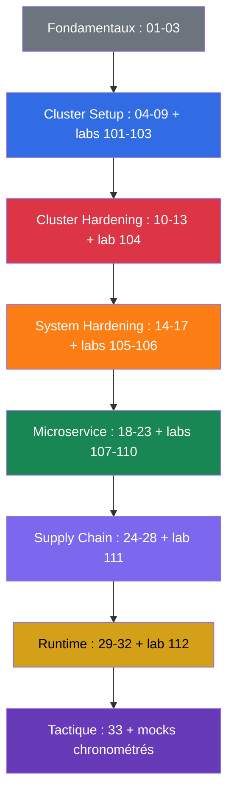

[Русская версия](README_RU.md) · [Eng version](README.md) · [Versión en español](README_ES.md) · [Deutsche Version](README_DE.md) · [ქართული ვერსია](README_GE.md) · [繁體中文版](README_TW.md) · [日本語版](README_JP.md)

# CKS : manuel pratique d'auto-formation à la sécurité de Kubernetes

Cours pratique de préparation à **CKS (Certified Kubernetes Security Specialist)**, la certification de la CNCF et de la Linux Foundation consacrée à la sécurisation de Kubernetes. Il fait suite au [cours CKA + CKAD](../../cka/course/README_FR.md) : on suppose que vous savez déjà administrer un cluster, travailler avec `kubectl`, RBAC, NetworkPolicy, SecurityContext, kubeadm et TLS. CKS ne répète pas ces bases, il les applique aux modèles de menace, au hardening et à l'investigation d'incidents.

## À propos du projet et de sa maintenance

Le cours est maintenu par **Viktar Mikalayeu, CNCF Kubestronaut**, et par une communauté de contributeurs. Le statut de Kubestronaut atteste que les cinq certifications Kubernetes de la CNCF (CKA, CKAD, CKS, KCNA et KCSA) sont obtenues et restent valides.

Les contenus évoluent comme un projet open source indépendant : les affirmations techniques sont vérifiées par rapport aux sources primaires de Kubernetes, de la CNCF/Linux Foundation et à la documentation officielle des projets utilisés ; les modifications passent par une revue technique et des contrôles automatiques, et l'actualité de l'environnement d'examen, de Kubernetes et des outils de sécurité est suivie séparément.

Pour en savoir plus sur les maintainers, la revue technique et les principes de maintenance du cours : [MAINTAINERS.md](../MAINTAINERS.md). La liste des Kubestronauts est publiée par la CNCF : [CNCF Kubestronaut Program](https://www.cncf.io/training/kubestronaut/). CNCF Kubestronaut list : [Viktar Mikalayeu](https://www.cncf.io/training/kubestronaut/?_sft_lf-country=ge&p=viktar-mikalayeu&_sf_s=viktar+mikalayeu).

> **Projet indépendant.** Le statut de Kubestronaut concerne la qualification du maintainer. Ce cours n'est pas un cours officiel de la CNCF ni de la Linux Foundation et n'implique aucun endorsement, aucune certification ni aucune approbation officielle du contenu du projet par ces organisations.

> **Version de Kubernetes et examen.** Les principaux labs complets `101-112` et `114` sont validés sur Kubernetes `v1.36` : c'est la **version d'apprentissage** des core labs. Le lab `113` fait exception par construction : le cluster démarre en `v1.35.x` et la version cible de l'exercice est un véritable upgrade vers `v1.36.x` (le sujet du lab est le processus d'upgrade mineur lui-même, donc la version finale coïncide avec la baseline des autres core labs). À la date de vérification, le 2026-09-06, les pages officielles de la LF (la page principale de CKS, « Important Instructions: CKS » et la FAQ) indiquent de façon concordante Kubernetes `v1.35` pour l'environnement d'examen CKS ; le programme actuel de la CNCF porte toujours dans son nom de fichier `CKS Curriculum v1.34` : la version du curriculum et la version de l'environnement d'examen sont maintenues indépendamment. Avant l'examen, revérifiez la page principale de CKS, Important Instructions et la FAQ, ainsi que la version affichée dans ExamUI. Le processus de release détaillé est décrit dans la [politique de versions](../VERSION_POLICY.md), le style russe dans [STYLE_RU.md (RU)](../STYLE_RU.md).

## Organisation du cours

Chaque thème est un répertoire avec un numéro et des fichiers par langue : la source russe `ru.md` et les traductions `README.md` (English), `es.md`, `fr.md`, `de.md`, `ge.md`, `tw.md`, `jp.md`. Les chapitres sont regroupés par domaines CKS et signalés par une couleur :

- 🟦 Cluster Setup - 15%
- 🟥 Cluster Hardening - 15%
- 🟧 System Hardening - 10%
- 🟩 Minimize Microservice Vulnerabilities - 20%
- 🟪 Supply Chain Security - 20%
- 🟨 Monitoring, Logging & Runtime Security - 20%
- ⬜ fondamentaux et préparation à l'examen

Dans les chapitres, quatre marqueurs visuels répartissent la matière selon son type, et non selon son importance :

- 🎯 **CKS Core** - ce qu'il faut savoir faire et vérifier à l'examen.
- 🧠 **Pourquoi ça fonctionne** - le modèle du mécanisme, qui explique le raisonnement.
- 🔬 **Deep Dive** - approfondissement, cas limite, alternative ou contexte legacy.
- 🏭 **Production** - comment cela s'applique en exploitation réelle.

Les termes seront regroupés dans le [glossaire (RU)](GLOSSARY_RU.md). Les extraits YAML/CLI prêts à l'emploi, sans théorie, se trouvent dans l'[aide-mémoire (RU)](CHEATSHEET_RU.md), et les causes fréquentes de `[FAIL]` dans les labs dans l'[index de dépannage (RU)](TROUBLESHOOTING_INDEX_RU.md). Les changements de sécurité actuels en production, qui ne se rattachent pas à un seul domaine CKS, sont regroupés dans des annexes propres à une version : [Kubernetes v1.36 Security Delta (RU)](APPENDIX_K8S_136_SECURITY_DELTA_RU.md) - training baseline ; [Kubernetes v1.37 Security Delta (RU)](APPENDIX_K8S_137_SECURITY_DELTA_RU.md) - current upstream, pas automatiquement du CKS Core.

## Format de l'examen

CKS est un examen pratique, performance-based : 2 heures, note de passage 67 %. Il faut travailler vite avec plusieurs contextes, la configuration du control plane et des nodes en SSH. La tactique, la documentation autorisée et la checklist finale sont dans le [chapitre 33](33/fr.md).

## Par où commencer

CKS ne répète pas CKA. Avant de commencer, rafraîchissez solidement les sujets suivants :

- [RBAC](../../cka/course/38/fr.md) : Role, ClusterRole, binding et `kubectl auth can-i`.
- [NetworkPolicy](../../cka/course/34/fr.md) : sélecteurs, default deny, DNS et CNI.
- [SecurityContext et capabilities](../../cka/course/20/fr.md), [ServiceAccount et admission](../../cka/course/21/fr.md).
- [Secret](../../cka/course/19/fr.md), [images et Dockerfile](../../cka/course/23/fr.md).
- [kubeadm](../../cka/course/35/fr.md), [mise à jour](../../cka/course/36/fr.md), [TLS, kubeconfig et CSR](../../cka/course/39/fr.md).

Passez ensuite aux chapitres 01-03 : ils donnent le vocabulaire du modèle de menace et relient les mécanismes Linux au hardening qui suit.

## Programme officiel de l'examen

| Domaine | Poids |
|---------|-------|
| Cluster Setup | 15% |
| Cluster Hardening | 15% |
| System Hardening | 10% |
| Minimize Microservice Vulnerabilities | 20% |
| Supply Chain Security | 20% |
| Monitoring, Logging and Runtime Security | 20% |

## Table des matières

### Partie 0. Fondamentaux de la sécurité (facultative) ⬜

1. [Introduction : l'examen CKS, ses différences avec CKA, l'organisation du cours](01/fr.md)
2. [Modèle de sécurité de Kubernetes : 4C, surface d'attaque, phases d'une attaque](02/fr.md)
3. [Mécanismes de sécurité Linux sous le capot](03/fr.md)

### Partie 1. Cluster Setup - 15% 🟦

4. [NetworkPolicy pour la sécurité : default deny, ingress/egress, isolation pod-to-pod](04/fr.md)
5. [Protéger les node metadata et les endpoints par des network policies](05/fr.md)
6. [Cilium NetworkPolicy : L3/L4/L7, DNS et Hubble](06/fr.md)
7. [CIS Benchmark et kube-bench](07/fr.md)
8. [Ingress sécurisé avec TLS](08/fr.md)
9. [Arguments de composants non sûrs, durcissement TLS et vérification des binaires](09/fr.md)

### Partie 2. Cluster Hardening - 15% 🟥

10. [RBAC pour minimiser les accès](10/fr.md)
11. [ServiceAccounts : minimisation et tokens](11/fr.md)
12. [Restreindre l'accès à l'API Kubernetes](12/fr.md)
13. [Mettre à jour Kubernetes pour corriger les vulnérabilités](13/fr.md)

### Partie 3. System Hardening - 10% 🟧

14. [Minimiser l'empreinte de l'OS hôte et sécuriser le démon runtime](14/fr.md)
15. [Least privilege sur l'hôte et minimisation de l'accès réseau externe](15/fr.md)
16. [AppArmor](16/fr.md)
17. [seccomp](17/fr.md)

### Partie 4. Minimize Microservice Vulnerabilities - 20% 🟩

18. [SecurityContext en profondeur](18/fr.md)
19. [Pod Security Standards et Pod Security Admission](19/fr.md)
20. [Admission controllers et moteurs de policies : OPA/Gatekeeper et Kyverno](20/fr.md)
21. [Gestion des secrets Kubernetes](21/fr.md)
22. [Isolation et sandboxed containers : gVisor et Kata](22/fr.md)
23. [Chiffrement Pod-to-Pod et mTLS : Cilium et Istio](23/fr.md)

### Partie 5. Supply Chain Security - 20% 🟪

24. [Minimiser l'image de base](24/fr.md)
25. [Comprendre la supply chain : SBOM, CI/CD, artifact repositories](25/fr.md)
26. [Sécuriser la supply chain : registries, signature et validation des artefacts](26/fr.md)
27. [Analyse statique des workloads et des images](27/fr.md)
28. [Scan des images à la recherche de vulnérabilités connues](28/fr.md)

### Partie 6. Monitoring, Logging & Runtime Security - 20% 🟨

29. [Analyse comportementale à l'exécution : Falco](29/fr.md)
30. [Détection des menaces et investigation des phases d'attaque](30/fr.md)
31. [Immutabilité des containers au runtime](31/fr.md)
32. [Audit logs Kubernetes](32/fr.md)

### Partie 7. Préparation à l'examen ⬜

33. [Examen CKS : format, gestion du temps, documentation autorisée, checklist](33/fr.md)

## Compétence → chapitre

| Domaine           | Compétence                                                                                                                                    | Chapitres                              |
| ----------------- | --------------------------------------------------------------------------------------------------------------------------------------------------------- | ------------------------------------------- |
| Cluster Setup     | Network security policies pour restreindre l'accès au niveau du cluster                                                 | [04](04/fr.md), [05](05/fr.md), [06](06/fr.md) |
| Cluster Setup     | CIS Benchmark pour les composants etcd, kubelet, kube-dns et kube-apiserver                                                                     | [07](07/fr.md)                               |
| Cluster Setup     | Configuration correcte d'un Ingress avec TLS                                                                                                    | [08](08/fr.md)                               |
| Cluster Setup     | Protection des node metadata et des endpoints                                                                                                                   | [05](05/fr.md), [09](09/fr.md)                |
| Cluster Setup     | Vérification des binaires de la plateforme avant le déploiement                                                                        | [09](09/fr.md)                               |
| Cluster Hardening | RBAC pour minimiser les accès                                                                                                         | [10](10/fr.md)                               |
| Cluster Hardening | Usage prudent des ServiceAccount : désactivation du default et droits minimaux                                    | [11](11/fr.md)                               |
| Cluster Hardening | Restriction de l'accès à l'API Kubernetes                                                                                                   | [12](12/fr.md), [09](09/fr.md)                |
| Cluster Hardening | Mise à jour de Kubernetes pour corriger les vulnérabilités                                                                        | [13](13/fr.md)                               |
| System Hardening  | Minimisation de l'empreinte de l'OS hôte                                                                                                    | [14](14/fr.md)                               |
| System Hardening  | Least-privilege identity and access management                                                                                                            | [15](15/fr.md)                               |
| System Hardening  | Minimisation de l'accès réseau externe                                                                                        | [14](14/fr.md), [15](15/fr.md)                |
| System Hardening  | Hardening du noyau : AppArmor                                                                                                                              | [16](16/fr.md), [03](03/fr.md)                |
| System Hardening  | Hardening du noyau : seccomp                                                                                                                               | [17](17/fr.md), [03](03/fr.md)                |
| Microservice      | Pod Security Standards                                                                                                                                    | [18](18/fr.md), [19](19/fr.md)                |
| Microservice      | Gestion des Secret Kubernetes                                                                                                                    | [21](21/fr.md)                               |
| Microservice      | Isolation : multi-tenancy et sandboxed containers                                                                                                   | [22](22/fr.md)                               |
| Microservice      | Chiffrement Pod-to-Pod avec Cilium                                                                                                                 | [23](23/fr.md)                               |
| Supply Chain      | Minimisation de l'empreinte de l'image de base                                                                                            | [24](24/fr.md)                               |
| Supply Chain      | Supply chain : SBOM, CI/CD, artifact repositories                                                                                                          | [25](25/fr.md)                               |
| Supply Chain      | Registries autorisés, signature et validation des artefacts                                                          | [26](26/fr.md)                               |
| Supply Chain      | Analyse statique des workloads et des images : kubesec, kube-linter, hadolint                                                    | [27](27/fr.md)                               |
| Supply Chain      | Scan des vulnérabilités connues et SBOM                                                                                | [28](28/fr.md), [25](25/fr.md)                |
| Runtime           | Analyse comportementale des activités malveillantes                                                                       | [29](29/fr.md)                               |
| Runtime           | Détection des menaces dans l'infrastructure, les applications, le réseau, les données, les utilisateurs et les workloads | [30](30/fr.md), [29](29/fr.md)                |
| Runtime           | Investigation et identification des phases d'attaque et des attaquants                                                  | [02](02/fr.md), [30](30/fr.md)                |
| Runtime           | Immutabilité des containers à l'exécution                                                                | [31](31/fr.md), [18](18/fr.md)                |
| Runtime           | Audit logs Kubernetes pour surveiller les accès                                                                                    | [32](32/fr.md)                               |

## Domaine → labs

Les descriptions des labs sont disponibles en russe.

| Domaine                                | Labs                                                                                                                                                                                                            |
| ----------------------------------------- | ------------------------------------------------------------------------------------------------------------------------------------------------------------------------------------------------------------------- |
| 🟦 Cluster Setup                          | [101 (RU)](../labs/101/README_RU.MD) NetworkPolicy et metadata, [102 (RU)](../labs/102/README_RU.MD) Cilium L3/L4/L7, [103 (RU)](../labs/103/README_RU.MD) CIS, TLS et binary verification, [115 (RU)](../labs/115/README_RU.MD) Cilium bootstrap et kube-proxy replacement (advanced/production, pas du CKS Core)                                            |
| 🟥 Cluster Hardening                      | [104 (RU)](../labs/104/README_RU.MD) RBAC, ServiceAccount et accès à l'API, [113 (RU)](../labs/113/README_RU.MD) kubeadm upgrade, [114 (RU)](../labs/114/README_RU.MD) kubeconfig contexts, client certificate et exposition de Service                                                                                                 |
| 🟧 System Hardening                       | [105 (RU)](../labs/105/README_RU.MD) OS, réseau et démon Docker, [106 (RU)](../labs/106/README_RU.MD) AppArmor et seccomp                                                                                                  |
| 🟩 Minimize Microservice Vulnerabilities  | [107 (RU)](../labs/107/README_RU.MD) PSA et SecurityContext, [108 (RU)](../labs/108/README_RU.MD) admission policies, [109 (RU)](../labs/109/README_RU.MD) encryption at rest, [110 (RU)](../labs/110/README_RU.MD) gVisor, Cilium et Istio, [115 (RU)](../labs/115/README_RU.MD) WireGuard et Cilium Mutual Authentication sur SPIRE (advanced/production, pas du CKS Core) |
| 🟪 Supply Chain Security                  | [108 (RU)](../labs/108/README_RU.MD) allowlist, [111 (RU)](../labs/111/README_RU.MD) images, SBOM, scan, signing et multi-image CVE triage                                                                                                              |
| 🟨 Monitoring, Logging & Runtime Security | [112 (RU)](../labs/112/README_RU.MD) Falco, audit logs et immutabilité                                                                                                                              |

## Pratique

Le cours propose quatre niveaux de pratique, qui ne se remplacent pas : chacun vérifie une compétence différente, de la vérification rapide d'un fait (Level 1) à la validation indépendante avant l'examen (Level 4) :

Dans la plupart des chapitres, vous trouverez côte à côte Level 1 (liens 🌐/🎮 Killercoda) et Level 2 (🧪 lab) - ce n'est pas un doublon. Un scénario Killercoda sur RBAC en 10 minutes ne remplace pas le
lab 104, où la même frontière RBAC évolue au fil de plusieurs exercices, se casse puis est
rétablie, et dont le résultat doit être prouvé par un artefact de preuve. Un lien Killercoda
existe actuellement dans 23 chapitres sur 33 - là où il existe un scénario prêt à l'emploi adapté au sujet ;
quelques chapitres (par exemple les chapitres d'introduction 1-2 et l'aperçu du format d'examen au 33) n'ont pas
d'équivalent direct dans le catalogue Killercoda et s'appuient uniquement sur Level 2/3. Level 3 (mocks)
et Level 4 (Killer.sh) ne sont pas rattachés à des chapitres précis : ils rassemblent la matière de tous les domaines
à la fois, sous pression de temps.

- ⚡ **Level 1** (5-15 minutes). Scénarios Killercoda dans la plupart des chapitres (par exemple `rbac-serviceaccount-permissions`) - vérification rapide d'un fait ou d'une commande juste après la théorie.
- 🔬 **Level 2** (30-120+ minutes). 🧪 [Labs CKS](../labs) - un plan de 15 labs avec vérification automatique `check_result`, de NetworkPolicy à Falco, aux audit logs et au kubeadm upgrade. C'est ici que se construit le workflow complet : hardening → break → verify → evidence.

> **Pourquoi les solutions de référence sont courtes.** Un même exercice de lab peut avoir plusieurs solutions techniquement correctes. Les solutions de référence du cours ne prétendent pas être la seule bonne méthode : elles choisissent volontairement un chemin court, reproductible et facile à vérifier, qui aide à minimiser le temps et le nombre d'actions pour des tâches similaires à l'examen. Le but d'une solution est de construire la mémoire musculaire d'examen : effectuer rapidement le changement demandé et s'assurer tout de suite que le résultat est bien correct. Des variantes plus universelles ou orientées production peuvent être utiles en exploitation réelle, mais ne sont pas l'objectif d'une solution orientée examen.
- 🎯 **Level 3** (120 minutes). 🧪 [Mock exams CKS](../mock) - répétitions chronométrées qui mélangent tous les domaines à la fois ; en anglais, comme les énoncés de l'examen réel (la LF propose aussi CKS en japonais et en chinois simplifié via une inscription distincte, mais pas en russe) - habituez-vous à l'avance à lire les énoncés en anglais.
- 🧭 **Level 4** (environnement indépendant). [Killer.sh](https://killer.sh/cks) (inclus dans l'inscription standard à l'examen LF) - deux sessions simulées de 17 exercices chacune, dans une fenêtre distincte de 36 heures. Utilisez-le en fin de préparation, et non à la place de Level 2-3 : c'est le test de stress final, pas la source principale de connaissances. **Important :** l'accès au simulateur n'est pas inclus dans l'inscription `CKS-SINGLE` (examen sans retake) - si vous vous êtes inscrit avec ce tarif, il faudra acheter Killer.sh séparément sur le site de Killer.sh, ou vous limiter à Level 2-3.

Commencez par les chapitres 01-03, puis parcourez les domaines avec les labs correspondants. La répétition finale et la checklist sont rassemblées dans le [chapitre 33](33/fr.md).

## Ordre de préparation recommandé

Ne repoussez pas les labs : dans CKS, ce ne sont pas les définitions qui comptent, mais les changements sûrs, vérifiés sur un vrai cluster. Après chaque domaine, notez les commandes et les chemins de configuration dans votre checklist personnelle, puis entraînez-vous à les appliquer sous chronomètre dans le [chapitre 33](33/fr.md).

## Pour aller plus loin

- B. Muschko, **Certified Kubernetes Security Specialist (CKS) Study Guide**, O'Reilly, 1re édition, 2023. Utile comme aperçu compact de la structure de l'examen, mais confrontez les recommandations techniques à la documentation actuelle et aux annexes Security Delta de ce cours.
- [Documentation officielle de Kubernetes](https://kubernetes.io/docs/) - source primaire pour l'API et le hardening.
- [Falco](https://falco.org/docs/), [Trivy](https://trivy.dev/latest/docs/), [Cilium](https://docs.cilium.io/), [Kyverno](https://kyverno.io/docs/) - documentation des outils pratiques du cours.
- [CIS Kubernetes Benchmark](https://www.cisecurity.org/benchmark/kubernetes) - recommandations pour la configuration sécurisée des composants.
