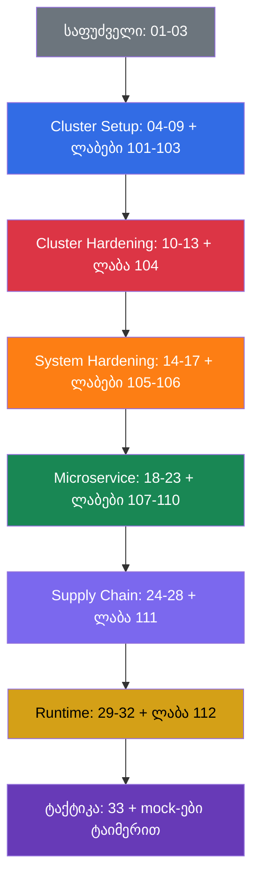

[Русская версия](README_RU.md) · [Eng version](README.md) · [Versión en español](README_ES.md) · [Version française](README_FR.md) · [Deutsche Version](README_DE.md) · [繁體中文版](README_TW.md) · [日本語版](README_JP.md)

# CKS: პრაქტიკული თვითმასწავლებელი Kubernetes-ის უსაფრთხოებაზე

პრაქტიკული კურსი **CKS (Certified Kubernetes Security Specialist)** სერტიფიკაციისთვის მოსამზადებლად - CNCF-ისა და Linux Foundation-ის სერტიფიკაცია Kubernetes-ის დაცვაზე. ეს არის [CKA + CKAD კურსის](../../cka/course/README_GE.md) გაგრძელება: ვარაუდობთ, რომ უკვე იცით კლასტერის ადმინისტრირება, მუშაობა `kubectl`-თან, RBAC-თან, NetworkPolicy-სთან, SecurityContext-თან, kubeadm-თან და TLS-თან. CKS ამ საფუძველს არ იმეორებს, არამედ მას იყენებს საფრთხეების მოდელებზე, hardening-სა და ინციდენტების გამოძიებაზე.

## პროექტისა და მისი მხარდაჭერის შესახებ

კურსს უჭერს მხარს **Viktar Mikalayeu, CNCF Kubestronaut**, და კონტრიბუტორთა საზოგადოება. Kubestronaut-ის სტატუსი ადასტურებს, რომ CNCF-ის ხუთივე Kubernetes-სერტიფიკაცია - CKA, CKAD, CKS, KCNA და KCSA - ფლობილია და მოქმედია.

მასალები ვითარდება როგორც დამოუკიდებელი open-source პროექტი: ტექნიკური დებულებები მოწმდება Kubernetes-ის, CNCF/Linux Foundation-ისა და გამოყენებული პროექტების ოფიციალური დოკუმენტაციის პირველწყაროებთან; ცვლილებები გადის ტექნიკურ რევიუსა და ავტომატურ შემოწმებებს, ხოლო საგამოცდო გარემოს, Kubernetes-სა და security tooling-ის აქტუალურობას ცალკე აკონტროლებენ.

maintainers-ის, ტექნიკური რევიუსა და კურსის მხარდაჭერის პრინციპების შესახებ დაწვრილებით: [MAINTAINERS.md](../MAINTAINERS.md). Kubestronaut-ების სიას აქვეყნებს CNCF: [CNCF Kubestronaut Program](https://www.cncf.io/training/kubestronaut/). CNCF Kubestronaut list: [Viktar Mikalayeu](https://www.cncf.io/training/kubestronaut/?_sft_lf-country=ge&p=viktar-mikalayeu&_sf_s=viktar+mikalayeu).

> **დამოუკიდებელი პროექტი.** Kubestronaut-ის სტატუსი ეხება maintainer-ის კვალიფიკაციას. ეს კურსი არ არის CNCF-ის ან Linux Foundation-ის ოფიციალური კურსი და არ გულისხმობს მათ მიერ პროექტის შინაარსის endorsement-ს, სერტიფიცირებას ან ოფიციალურ დამტკიცებას.

> **Kubernetes-ის ვერსია და გამოცდა.** ძირითადი კომპლექსური ლაბორატორიული სამუშაოები `101-112` და `114` შემოწმებულია Kubernetes `v1.36`-ზე - ეს არის core labs-ის **სასწავლო ვერსია**. ლაბა `113` კონსტრუქციით გამონაკლისია: კლასტერი იწყება `v1.35.x`-ზე და დავალების სამიზნე ვერსია არის რეალური upgrade `v1.36.x`-მდე (ლაბის თემა თავად minor upgrade-ის პროცესია, ამიტომ საბოლოო ვერსია ემთხვევა დანარჩენი core labs-ის baseline-ს). შემოწმების თარიღისთვის, 2026-09-06, LF-ის ოფიციალური გვერდები (CKS-ის მთავარი გვერდი, „Important Instructions: CKS“ და FAQ) თანმიმდევრულად მიუთითებენ CKS-ის საგამოცდო გარემოსთვის Kubernetes `v1.35`-ს; CNCF-ის აქტუალური პროგრამა ფაილის სახელით კვლავ `CKS Curriculum v1.34`-ია - curriculum version და exam environment version ერთმანეთისგან დამოუკიდებლად მოიცავება. გამოცდამდე კიდევ ერთხელ გადაამოწმეთ CKS-ის მთავარი გვერდი, Important Instructions და FAQ, ასევე ExamUI-ში ნაჩვენები ვერსია. release-პროცესის დეტალები აღწერილია [ვერსიების პოლიტიკაში](../VERSION_POLICY.md), რუსული სტილი - [STYLE_RU.md (RU)](../STYLE_RU.md)-ში.

## როგორ არის აგებული კურსი

თითოეული თემა - საქაღალდე ნომრით და ენების მიხედვით ფაილებით: რუსული პირველწყარო `ru.md` და თარგმანები `README.md` (English), `es.md`, `fr.md`, `de.md`, `ge.md`, `tw.md`, `jp.md`. თავები დაჯგუფებულია CKS-ის დომენების მიხედვით და აღნიშნულია ფერით:

- 🟦 Cluster Setup - 15%
- 🟥 Cluster Hardening - 15%
- 🟧 System Hardening - 10%
- 🟩 Minimize Microservice Vulnerabilities - 20%
- 🟪 Supply Chain Security - 20%
- 🟨 Monitoring, Logging & Runtime Security - 20%
- ⬜ საფუძველი და გამოცდისთვის მომზადება

თავებში გვხვდება ოთხი ვიზუალური მარკერი, რომლებიც მასალას ყოფენ ტიპის, და არა მნიშვნელობის მიხედვით:

- 🎯 **CKS Core** - გამოცდაზე უნდა შეგეძლოთ შესრულება და გადამოწმება.
- 🧠 **რატომ მუშაობს ეს** - მექანიზმის მოდელი, განმარტავს reasoning-ს.
- 🔬 **Deep Dive** - გაღრმავება, edge case, ალტერნატივა ან legacy-კონტექსტი.
- 🏭 **Production** - როგორ გამოიყენება რეალურ ექსპლუატაციაში.

ტერმინები შეგროვდება [გლოსარიუმში (RU)](GLOSSARY_RU.md). თეორიის გარეშე მზა YAML/CLI-სნიპეტები - [ცხრილ-მინიშნებაში (RU)](CHEATSHEET_RU.md), ხოლო ლაბებში `[FAIL]`-ის ხშირი მიზეზები - [შეცდომების ცნობარში (RU)](TROUBLESHOOTING_INDEX_RU.md). Production-current security changes, რომლებიც ერთ CKS domain-ს არ ეკუთვნის, გატანილია version-specific დანართებში: [Kubernetes v1.36 Security Delta (RU)](APPENDIX_K8S_136_SECURITY_DELTA_RU.md) - training baseline; [Kubernetes v1.37 Security Delta (RU)](APPENDIX_K8S_137_SECURITY_DELTA_RU.md) - current upstream, ავტომატურად CKS Core არ არის.

## გამოცდის ფორმატი

CKS - პრაქტიკული, performance-based გამოცდაა: 2 საათი, გამსვლელი ქულა 67%. საჭიროა სწრაფი მუშაობა რამდენიმე კონტექსტთან, control plane-ის კონფიგურაციასა და ნოდებთან SSH-ით. ტაქტიკა, დაშვებული დოკუმენტაცია და საბოლოო checklist - [33-ე თავში](33/ge.md).

## საიდან დავიწყოთ

CKS არ იმეორებს CKA-ს. დაწყებამდე დარწმუნებით გაიხსენეთ შემდეგი თემები:

- [RBAC](../../cka/course/38/ge.md): Role, ClusterRole, binding და `kubectl auth can-i`.
- [NetworkPolicy](../../cka/course/34/ge.md): selector-ები, default deny, DNS და CNI.
- [SecurityContext და capabilities](../../cka/course/20/ge.md), [ServiceAccount და admission](../../cka/course/21/ge.md).
- [Secret](../../cka/course/19/ge.md), [image-ები და Dockerfile](../../cka/course/23/ge.md).
- [kubeadm](../../cka/course/35/ge.md), [განახლება](../../cka/course/36/ge.md), [TLS, kubeconfig და CSR](../../cka/course/39/ge.md).

ამის შემდეგ გაიარეთ 01-03 თავები: ისინი იძლევა საფრთხეების მოდელის ლექსიკას და აკავშირებს Linux-ის მექანიზმებს შემდგომ hardening-თან.

## გამოცდის ოფიციალური პროგრამა

| დომენი | წონა |
|-------|-----|
| Cluster Setup | 15% |
| Cluster Hardening | 15% |
| System Hardening | 10% |
| Minimize Microservice Vulnerabilities | 20% |
| Supply Chain Security | 20% |
| Monitoring, Logging and Runtime Security | 20% |

## სარჩევი

### ნაწილი 0. უსაფრთხოების საფუძველი (არასავალდებულო) ⬜

1. [შესავალი: CKS გამოცდა, განსხვავებები CKA-სგან, კურსის აგებულება](01/ge.md)
2. [Kubernetes-ის უსაფრთხოების მოდელი: 4C, შეტევის ზედაპირი, შეტევის ფაზები](02/ge.md)
3. [Linux-ის უსაფრთხოების მექანიზმები ქუდქვეშ](03/ge.md)

### ნაწილი 1. Cluster Setup - 15% 🟦

4. [NetworkPolicy უსაფრთხოებისთვის: default deny, ingress/egress, pod-to-pod იზოლაცია](04/ge.md)
5. [Node metadata-სა და endpoint-ების დაცვა ქსელური პოლიტიკებით](05/ge.md)
6. [Cilium NetworkPolicy: L3/L4/L7, DNS და Hubble](06/ge.md)
7. [CIS Benchmark და kube-bench](07/ge.md)
8. [Secure Ingress TLS-ით](08/ge.md)
9. [კომპონენტების დაუცველი არგუმენტები, TLS-hardening და ბინარების შემოწმება](09/ge.md)

### ნაწილი 2. Cluster Hardening - 15% 🟥

10. [RBAC წვდომის მინიმიზაციისთვის](10/ge.md)
11. [ServiceAccounts: მინიმიზაცია და ტოკენები](11/ge.md)
12. [Kubernetes API-ზე წვდომის შეზღუდვა](12/ge.md)
13. [Kubernetes-ის განახლება დაუცველობების აღმოსაფხვრელად](13/ge.md)

### ნაწილი 3. System Hardening - 10% 🟧

14. [ჰოსტის ოპერაციული სისტემის footprint-ის მინიმიზაცია და runtime-დემონის უსაფრთხოება](14/ge.md)
15. [Least-privilege ჰოსტზე და გარე ქსელური წვდომის მინიმიზაცია](15/ge.md)
16. [AppArmor](16/ge.md)
17. [seccomp](17/ge.md)

### ნაწილი 4. Minimize Microservice Vulnerabilities - 20% 🟩

18. [SecurityContext სიღრმისეულად](18/ge.md)
19. [Pod Security Standards და Pod Security Admission](19/ge.md)
20. [Admission-კონტროლერები და policy engines: OPA/Gatekeeper და Kyverno](20/ge.md)
21. [Kubernetes-ის Secret-ების მართვა](21/ge.md)
22. [იზოლაცია და sandboxed containers: gVisor და Kata](22/ge.md)
23. [Pod-to-Pod დაშიფვრა და mTLS: Cilium და Istio](23/ge.md)

### ნაწილი 5. Supply Chain Security - 20% 🟪

24. [Base image-ის მინიმიზაცია](24/ge.md)
25. [Supply chain-ის გაგება: SBOM, CI/CD, artifact repositories](25/ge.md)
26. [Supply chain-ის დაცვა: რეესტრები, ხელმოწერა და არტეფაქტების ვალიდაცია](26/ge.md)
27. [Workload-ებისა და image-ების სტატიკური ანალიზი](27/ge.md)
28. [Image-ების სკანირება ცნობილ vulnerabilities-ზე](28/ge.md)

### ნაწილი 6. Monitoring, Logging & Runtime Security - 20% 🟨

29. [ქცევის ანალიზი გაშვების დროს: Falco](29/ge.md)
30. [საფრთხის დეტექცია და შეტევის ფაზების გამოძიება](30/ge.md)
31. [კონტეინერების იმუტაბელურობა runtime-ში](31/ge.md)
32. [Kubernetes-ის Audit-ლოგები](32/ge.md)

### ნაწილი 7. გამოცდისთვის მომზადება ⬜

33. [CKS გამოცდა: ფორმატი, დროის მენეჯმენტი, დაშვებული დოკუმენტაცია, checklist](33/ge.md)

## კომპეტენცია → თავი

| დომენი        | კომპეტენცია                                                                                                                                    | თავები                                  |
| ----------------- | --------------------------------------------------------------------------------------------------------------------------------------------------------- | ------------------------------------------- |
| Cluster Setup     | Network security policies კლასტერის დონეზე წვდომის შესაზღუდად                                                 | [04](04/ge.md), [05](05/ge.md), [06](06/ge.md) |
| Cluster Setup     | CIS Benchmark etcd-ის, kubelet-ის, kube-dns-ისა და kube-apiserver-ის კომპონენტებისთვის                                                                     | [07](07/ge.md)                               |
| Cluster Setup     | Ingress-ის სწორი გამართვა TLS-ით                                                                                                    | [08](08/ge.md)                               |
| Cluster Setup     | Node metadata-სა და endpoint-ების დაცვა                                                                                                                   | [05](05/ge.md), [09](09/ge.md)                |
| Cluster Setup     | პლატფორმის ბინარების შემოწმება დეპლოიმდე                                                                        | [09](09/ge.md)                               |
| Cluster Hardening | RBAC წვდომის მინიმიზაციისთვის                                                                                                         | [10](10/ge.md)                               |
| Cluster Hardening | ServiceAccount-თან ფრთხილი მუშაობა: default-ის გამორთვა და მინიმალური უფლებები                                    | [11](11/ge.md)                               |
| Cluster Hardening | Kubernetes API-ზე წვდომის შეზღუდვა                                                                                                   | [12](12/ge.md), [09](09/ge.md)                |
| Cluster Hardening | Kubernetes-ის განახლება დაუცველობების აღმოსაფხვრელად                                                                        | [13](13/ge.md)                               |
| System Hardening  | ჰოსტის ოპერაციული სისტემის footprint-ის მინიმიზაცია                                                                                                    | [14](14/ge.md)                               |
| System Hardening  | Least-privilege identity and access management                                                                                                            | [15](15/ge.md)                               |
| System Hardening  | გარე ქსელური წვდომის მინიმიზაცია                                                                                        | [14](14/ge.md), [15](15/ge.md)                |
| System Hardening  | ბირთვის hardening: AppArmor                                                                                                                              | [16](16/ge.md), [03](03/ge.md)                |
| System Hardening  | ბირთვის hardening: seccomp                                                                                                                               | [17](17/ge.md), [03](03/ge.md)                |
| Microservice      | Pod Security Standards                                                                                                                                    | [18](18/ge.md), [19](19/ge.md)                |
| Microservice      | Kubernetes Secret-ების მართვა                                                                                                                    | [21](21/ge.md)                               |
| Microservice      | იზოლაცია: multi-tenancy და sandboxed containers                                                                                                   | [22](22/ge.md)                               |
| Microservice      | Pod-to-Pod დაშიფვრა Cilium-ით                                                                                                                 | [23](23/ge.md)                               |
| Supply Chain      | Base image-ის footprint-ის მინიმიზაცია                                                                                            | [24](24/ge.md)                               |
| Supply Chain      | Supply chain: SBOM, CI/CD, artifact repositories                                                                                                          | [25](25/ge.md)                               |
| Supply Chain      | დაშვებული რეესტრები, ხელმოწერა და არტეფაქტების ვალიდაცია                                                          | [26](26/ge.md)                               |
| Supply Chain      | Workload-ებისა და image-ების სტატიკური ანალიზი: kubesec, kube-linter, hadolint                                                    | [27](27/ge.md)                               |
| Supply Chain      | ცნობილი vulnerabilities-ის სკანირება და SBOM                                                                                | [28](28/ge.md), [25](25/ge.md)                |
| Runtime           | მავნე აქტივობის ქცევითი ანალიზი                                                                       | [29](29/ge.md)                               |
| Runtime           | საფრთხეების დეტექცია ინფრასტრუქტურაში, აპლიკაციებში, ქსელში, მონაცემებში, მომხმარებლებსა და workload-ებში | [30](30/ge.md), [29](29/ge.md)                |
| Runtime           | შეტევის ფაზებისა და თავდამსხმელების გამოძიება და განსაზღვრა                                                  | [02](02/ge.md), [30](30/ge.md)                |
| Runtime           | კონტეინერების იმუტაბელურობა გაშვების დროს                                                                | [31](31/ge.md), [18](18/ge.md)                |
| Runtime           | Kubernetes-ის Audit-ლოგები წვდომის მონიტორინგისთვის                                                                                    | [32](32/ge.md)                               |

## დომენი → ლაბები

ლაბების აღწერები ხელმისაწვდომია რუსულ ენაზე.

| დომენი                                | ლაბები                                                                                                                                                                                                            |
| ----------------------------------------- | ------------------------------------------------------------------------------------------------------------------------------------------------------------------------------------------------------------------- |
| 🟦 Cluster Setup                          | [101](../labs/101/README_RU.MD) NetworkPolicy და metadata, [102](../labs/102/README_RU.MD) Cilium L3/L4/L7, [103](../labs/103/README_RU.MD) CIS, TLS და binary verification, [115](../labs/115/README_RU.MD) Cilium bootstrap და kube-proxy replacement (advanced/production, არა CKS Core)                                            |
| 🟥 Cluster Hardening                      | [104](../labs/104/README_RU.MD) RBAC, ServiceAccount და API access, [113](../labs/113/README_RU.MD) kubeadm upgrade, [114](../labs/114/README_RU.MD) kubeconfig contexts, client certificate და Service exposure                                                                                                 |
| 🟧 System Hardening                       | [105](../labs/105/README_RU.MD) OS, ქსელი და Docker daemon, [106](../labs/106/README_RU.MD) AppArmor და seccomp                                                                                                  |
| 🟩 Minimize Microservice Vulnerabilities  | [107](../labs/107/README_RU.MD) PSA და SecurityContext, [108](../labs/108/README_RU.MD) admission policies, [109](../labs/109/README_RU.MD) encryption at rest, [110](../labs/110/README_RU.MD) gVisor, Cilium და Istio, [115](../labs/115/README_RU.MD) WireGuard და Cilium Mutual Authentication SPIRE-ზე (advanced/production, არა CKS Core) |
| 🟪 Supply Chain Security                  | [108](../labs/108/README_RU.MD) allowlist, [111](../labs/111/README_RU.MD) images, SBOM, scan, signing და multi-image CVE triage                                                                                                              |
| 🟨 Monitoring, Logging & Runtime Security | [112](../labs/112/README_RU.MD) Falco, audit-ლოგები და იმუტაბელურობა                                                                                                                              |

## პრაქტიკა

კურსს აქვს პრაქტიკის ოთხი დონე, და ისინი ერთმანეთს არ ანაცვლებს - თითოეული თავის უნარს ამოწმებს, ერთი ფაქტის სწრაფი შემოწმებიდან (Level 1) გამოცდამდე დამოუკიდებელ ვალიდაციამდე (Level 4):

უმეტეს თავში Level 1-ს (🌐/🎮 Killercoda-ბმულები) და Level 2-ს (🧪 ლაბა) გვერდიგვერდ შეხვდებით -
ეს დუბლირება არ არის. RBAC-ის Killercoda-სცენარი 10 წუთში ვერ ჩაანაცვლებს
104-ე ლაბას, სადაც იგივე RBAC-საზღვარი რამდენიმე დავალების განმავლობაში ვითარდება, ტყდება და
აღდგება, და მისი შედეგი evidence-არტეფაქტით უნდა დაამტკიცოთ. Killercoda-ბმული
ამჟამად 33 თავიდან 23-ში არის - იქ, სადაც თემისთვის არსებობს შესაფერისი მზა სცენარი;
რამდენიმე თავს (მაგალითად, შესავალი 1-2 და გამოცდის ფორმატის მიმოხილვა 33-ში) Killercoda-ს
კატალოგში პირდაპირი ანალოგი არ აქვს და მხოლოდ Level 2/3-ს ეყრდნობა. Level 3 (mock-ები)
და Level 4 (Killer.sh) ცალკეულ თავებზე არ არის მიბმული - ისინი ყველა დომენის მასალას
ერთდროულად აგროვებს, დროის წნეხის პირობებში.

- ⚡ **Level 1** (5-15 წუთი). Killercoda-სცენარები უმეტეს თავში (მაგალითად, `rbac-serviceaccount-permissions`) - ერთი ფაქტის ან ბრძანების სწრაფი შემოწმება თეორიის შემდეგ მაშინვე.
- 🔬 **Level 2** (30-120+ წუთი). 🧪 [CKS-ის ლაბორატორიული სამუშაოები](../labs) - 15 ლაბორატორიული სამუშაოს გეგმა `check_result`-ით ავტომატური შემოწმებით, NetworkPolicy-დან Falco-მდე, audit-ლოგებამდე და kubeadm upgrade-მდე. აქ მუშავდება სრული workflow: hardening → break → verify → evidence.

> **რატომ არის საცნობარო ამონახსნები მოკლე.** ერთ ლაბორატორიულ ამოცანას შეიძლება რამდენიმე ტექნიკურად სწორი ამონახსნი ჰქონდეს. კურსის საცნობარო solutions არ აცხადებს ერთადერთ სწორ გზას: ისინი ჩანაფიქრით ირჩევს მოკლე, განმეორებად და ადვილად გადასამოწმებელ გზას, რომელიც გამოცდაზე მსგავსი დავალებების შესრულებისას დროისა და მოქმედებების რაოდენობის მინიმიზაციას ეხმარება. solution-ის მიზანია გამოცდისთვის საჭირო „კუნთოვანი მეხსიერების“ გამომუშავება: სწრაფად შეასრულო საჭირო ცვლილება და მაშინვე დარწმუნდე, რომ შედეგი ნამდვილად სწორია. უფრო უნივერსალური ან production-oriented ვარიანტები შეიძლება სასარგებლო იყოს რეალურ ექსპლუატაციაში, მაგრამ exam-oriented solution-ის მიზანი არ არის.
- 🎯 **Level 3** (120 წუთი). 🧪 [CKS-ის mock-გამოცდები](../mock) - ვარჯიში ტაიმერით, რომელიც ერთდროულად ყველა დომენს ურევს; ინგლისურ ენაზე, როგორც რეალური გამოცდის დავალებები (LF გთავაზობთ CKS-ს ასევე იაპონურ და გამარტივებულ ჩინურ ენაზე ცალკე რეგისტრაციით, მაგრამ არა რუსულად) - დავალებების ფორმულირებების ინგლისურად კითხვას წინასწარ შეეჩვიეთ.
- 🧭 **Level 4** (დამოუკიდებელი გარემო). [Killer.sh](https://killer.sh/cks) (შედის LF-ის გამოცდაზე სტანდარტულ რეგისტრაციაში) - ორი სიმულირებული გავლა 17-17 დავალებით, თითოეული ცალკე 36-საათიან ფანჯარაში. გამოიყენეთ იგი მომზადების ბოლოს, და არა Level 2-3-ის ნაცვლად: ეს არის საბოლოო stress-ტესტი და არა ცოდნის ძირითადი წყარო. **მნიშვნელოვანია:** სიმულატორზე წვდომა არ შედის `CKS-SINGLE` რეგისტრაციაში (გამოცდა ხელახალი მცდელობის გარეშე) - თუ ამ ტარიფით დარეგისტრირდით, Killer.sh ცალკე უნდა შეიძინოთ Killer.sh-ის საიტზე, ან ორიენტირი აიღოთ მხოლოდ Level 2-3-ზე.

დაიწყეთ 01-03 თავებით, შემდეგ გაიარეთ დომენები შესაბამის ლაბებთან ერთად. საბოლოო რეპეტიციასა და checklist-ს შეგროვებს [33-ე თავი](33/ge.md).

## მომზადების რეკომენდებული თანმიმდევრობა

ლაბებს ნუ გადადებთ: CKS-ში ფასობს არა განმარტებები, არამედ უსაფრთხო ცვლილებები, რეალურ კლასტერზე გადამოწმებული. ყოველი დომენის შემდეგ ჩაიწერეთ ბრძანებები და კონფიგურაციის გზები პირად checklist-ში, შემდეგ კი ივარჯიშეთ მათზე ტაიმერით [33-ე თავში](33/ge.md).

## რა წავიკითხოთ შემდეგ

- B. Muschko, **Certified Kubernetes Security Specialist (CKS) Study Guide**, O'Reilly, 1-ლი გამოცემა, 2023. სასარგებლოა როგორც გამოცდის სტრუქტურის კომპაქტური მიმოხილვა, მაგრამ ტექნიკური რეკომენდაციები შეადარეთ აქტუალურ დოკუმენტაციას და ამ კურსის Security Delta დანართებს.
- [Kubernetes-ის ოფიციალური დოკუმენტაცია](https://kubernetes.io/docs/) - პირველწყარო API-სა და hardening-ზე.
- [Falco](https://falco.org/docs/), [Trivy](https://trivy.dev/latest/docs/), [Cilium](https://docs.cilium.io/), [Kyverno](https://kyverno.io/docs/) - კურსის პრაქტიკული ინსტრუმენტების დოკუმენტაცია.
- [CIS Kubernetes Benchmark](https://www.cisecurity.org/benchmark/kubernetes) - კომპონენტების უსაფრთხო კონფიგურაციის რეკომენდაციები.
