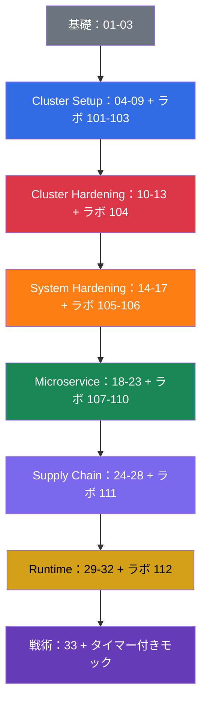

[Русская версия](README_RU.md) · [Eng version](README.md) · [Versión en español](README_ES.md) · [Version française](README_FR.md) · [Deutsche Version](README_DE.md) · [ქართული ვერსია](README_GE.md) · [繁體中文版](README_TW.md)

# CKS：Kubernetes セキュリティの実践自習ガイド

**CKS (Certified Kubernetes Security Specialist)** の準備のための実践コースです。CKS は CNCF と Linux Foundation による Kubernetes セキュリティの認定資格です。本コースは [CKA + CKAD コース](../../cka/course/README_JP.md)の続編です。クラスタの管理、`kubectl`、RBAC、NetworkPolicy、SecurityContext、kubeadm、TLS をすでに扱えることを前提にしています。CKS はこの基礎を繰り返すのではなく、脅威モデル、hardening、インシデント調査に適用します。

## プロジェクトとそのメンテナンスについて

本コースは **Viktar Mikalayeu（CNCF Kubestronaut）** とコントリビューターのコミュニティによってメンテナンスされています。Kubestronaut のステータスは、CNCF の 5 つの Kubernetes 認定（CKA、CKAD、CKS、KCNA、KCSA）を取得し、有効な状態で維持していることを示します。

教材は独立したオープンソースプロジェクトとして発展しています。技術的な記述は Kubernetes、CNCF/Linux Foundation の一次情報と、使用するプロジェクトの公式ドキュメントで確認しています。変更は技術レビューと自動チェックを通過し、試験環境、Kubernetes、セキュリティツールの最新性は別途追跡しています。

メンテナー、技術レビュー、コースの運営方針の詳細は [MAINTAINERS.md](../MAINTAINERS.md) を参照してください。Kubestronaut の一覧は CNCF が公開しています：[CNCF Kubestronaut Program](https://www.cncf.io/training/kubestronaut/)。CNCF Kubestronaut list：[Viktar Mikalayeu](https://www.cncf.io/training/kubestronaut/?_sft_lf-country=ge&p=viktar-mikalayeu&_sf_s=viktar+mikalayeu)。

> **独立したプロジェクトです。** Kubestronaut のステータスはメンテナーの資格に関するものです。本コースは CNCF や Linux Foundation の公式コースではなく、プロジェクトの内容についての endorsement、認定、公式な承認を意味するものではありません。

> **Kubernetes のバージョンと試験。** 主要な総合ラボ `101-112` と `114` は Kubernetes `v1.36` で検証されています。これが core labs の**学習用バージョン**です。ラボ `113` は設計上の例外です。クラスタは `v1.35.x` で起動し、タスクの目標バージョンは `v1.36.x` への実際の upgrade です（このラボのテーマは minor upgrade のプロセス自体であるため、最終バージョンは他の core labs の baseline と一致します）。確認日 2026-09-06 時点で、LF の公式ページ（CKS のメインページ、「Important Instructions: CKS」、FAQ）は、CKS の試験環境について一貫して Kubernetes `v1.35` を示しています。CNCF の最新の試験範囲（curriculum）はファイル名上 `CKS Curriculum v1.34` のままで、curriculum のバージョンと試験環境のバージョンは独立して管理されています。試験の前に、CKS のメインページ、Important Instructions、FAQ、そして ExamUI に表示されるバージョンを再確認してください。詳細なリリースプロセスは[バージョンポリシー](../VERSION_POLICY.md)、ロシア語のスタイルは [STYLE_RU.md (RU)](../STYLE_RU.md) を参照してください。

## コースの構成

各トピックは、番号付きのディレクトリで、言語別のファイルを含みます。ロシア語の原文 `ru.md` と、翻訳の `README.md`（English）、`es.md`、`fr.md`、`de.md`、`ge.md`、`tw.md`、`jp.md` です。章は CKS のドメインごとにグループ化され、色で示されています：

- 🟦 Cluster Setup - 15%
- 🟥 Cluster Hardening - 15%
- 🟧 System Hardening - 10%
- 🟩 Minimize Microservice Vulnerabilities - 20%
- 🟪 Supply Chain Security - 20%
- 🟨 Monitoring, Logging & Runtime Security - 20%
- ⬜ 基礎と試験準備

章の中には、重要度ではなく内容の種類で素材を分ける 4 種類の視覚的マーカーがあります：

- 🎯 **CKS Core** - 試験で実行・確認できる必要があります。
- 🧠 **なぜ動作するのか** - 仕組みのモデルで、reasoning を説明します。
- 🔬 **Deep Dive** - 掘り下げ、edge case、代替手段、legacy のコンテキストです。
- 🏭 **Production** - 実際の運用での使われ方です。

用語は[用語集 (RU)](GLOSSARY_RU.md)にまとめる予定です。理論なしの YAML/CLI スニペットは[チートシート (RU)](CHEATSHEET_RU.md)に、ラボでよくある `[FAIL]` の原因は[エラー索引 (RU)](TROUBLESHOOTING_INDEX_RU.md)にあります。単一の CKS ドメインに属さない production の最新セキュリティ変更は、バージョン別の付録にまとめています：[Kubernetes v1.36 Security Delta (RU)](APPENDIX_K8S_136_SECURITY_DELTA_RU.md) は training baseline、[Kubernetes v1.37 Security Delta (RU)](APPENDIX_K8S_137_SECURITY_DELTA_RU.md) は current upstream で、自動的に CKS Core になるわけではありません。

## 試験の形式

CKS は実践的な performance-based 試験です。時間は 2 時間、合格点は 67% です。複数のコンテキスト、control plane の設定、SSH 経由のノードを素早く扱う必要があります。戦術、使用が許可されるドキュメント、最終チェックリストは[第 33 章](33/jp.md)にあります。

## どこから始めるか

CKS は CKA を繰り返しません。始める前に、次のトピックを確実に復習してください：

- [RBAC](../../cka/course/38/jp.md)：Role、ClusterRole、binding、`kubectl auth can-i`。
- [NetworkPolicy](../../cka/course/34/jp.md)：セレクター、default deny、DNS、CNI。
- [SecurityContext と capabilities](../../cka/course/20/jp.md)、[ServiceAccount と admission](../../cka/course/21/jp.md)。
- [Secret](../../cka/course/19/jp.md)、[イメージと Dockerfile](../../cka/course/23/jp.md)。
- [kubeadm](../../cka/course/35/jp.md)、[アップグレード](../../cka/course/36/jp.md)、[TLS、kubeconfig、CSR](../../cka/course/39/jp.md)。

その後、第 01-03 章に進んでください。ここで脅威モデルの語彙を身につけ、Linux のメカニズムを以降の hardening と結び付けます。

## 公式の試験範囲

| ドメイン | 配点 |
|-------|-----|
| Cluster Setup | 15% |
| Cluster Hardening | 15% |
| System Hardening | 10% |
| Minimize Microservice Vulnerabilities | 20% |
| Supply Chain Security | 20% |
| Monitoring, Logging and Runtime Security | 20% |

## 目次

### パート 0. セキュリティの基礎（任意）⬜

1. [はじめに：CKS 試験、CKA との違い、コースの構成](01/jp.md)
2. [Kubernetes のセキュリティモデル：4C、攻撃対象領域、攻撃のフェーズ](02/jp.md)
3. [Linux のセキュリティメカニズムの内部](03/jp.md)

### パート 1. Cluster Setup - 15% 🟦

4. [セキュリティのための NetworkPolicy：default deny、ingress/egress、pod 間の分離](04/jp.md)
5. [ネットワークポリシーによる node metadata と endpoints の保護](05/jp.md)
6. [Cilium NetworkPolicy：L3/L4/L7、DNS、Hubble](06/jp.md)
7. [CIS Benchmark と kube-bench](07/jp.md)
8. [TLS による Secure Ingress](08/jp.md)
9. [安全でないコンポーネント引数、TLS hardening、バイナリの検証](09/jp.md)

### パート 2. Cluster Hardening - 15% 🟥

10. [アクセスを最小化する RBAC](10/jp.md)
11. [ServiceAccount：最小化とトークン](11/jp.md)
12. [Kubernetes API へのアクセス制限](12/jp.md)
13. [脆弱性の解消のための Kubernetes のアップグレード](13/jp.md)

### パート 3. System Hardening - 10% 🟧

14. [ホスト OS の footprint の最小化と runtime デーモンのセキュリティ](14/jp.md)
15. [ホストでの least-privilege と外部ネットワークアクセスの最小化](15/jp.md)
16. [AppArmor](16/jp.md)
17. [seccomp](17/jp.md)

### パート 4. Minimize Microservice Vulnerabilities - 20% 🟩

18. [SecurityContext の詳細](18/jp.md)
19. [Pod Security Standards と Pod Security Admission](19/jp.md)
20. [Admission コントローラーと policy エンジン：OPA/Gatekeeper と Kyverno](20/jp.md)
21. [Kubernetes Secret の管理](21/jp.md)
22. [分離と sandboxed containers：gVisor と Kata](22/jp.md)
23. [Pod-to-Pod の暗号化と mTLS：Cilium と Istio](23/jp.md)

### パート 5. Supply Chain Security - 20% 🟪

24. [ベースイメージの最小化](24/jp.md)
25. [supply chain を理解する：SBOM、CI/CD、artifact repositories](25/jp.md)
26. [supply chain の保護：レジストリ、署名、アーティファクトの検証](26/jp.md)
27. [ワークロードとイメージの静的解析](27/jp.md)
28. [既知の脆弱性に対するイメージスキャン](28/jp.md)

### パート 6. Monitoring, Logging & Runtime Security - 20% 🟨

29. [実行時の振る舞い分析：Falco](29/jp.md)
30. [脅威の検知と攻撃フェーズの調査](30/jp.md)
31. [runtime でのコンテナの immutability](31/jp.md)
32. [Kubernetes の audit ログ](32/jp.md)

### パート 7. 試験準備 ⬜

33. [CKS 試験：形式、タイムマネジメント、使用可能なドキュメント、チェックリスト](33/jp.md)

## コンピテンシー → 章

| ドメイン        | コンピテンシー                                                                                                                                    | 章                                  |
| ----------------- | --------------------------------------------------------------------------------------------------------------------------------------------------------- | ------------------------------------------- |
| Cluster Setup     | クラスタレベルでアクセスを制限する Network security policies                                                 | [04](04/jp.md), [05](05/jp.md), [06](06/jp.md) |
| Cluster Setup     | etcd、kubelet、kube-dns、kube-apiserver コンポーネントのための CIS Benchmark                                                                     | [07](07/jp.md)                               |
| Cluster Setup     | TLS を使った Ingress の正しい設定                                                                                                    | [08](08/jp.md)                               |
| Cluster Setup     | node metadata と endpoints の保護                                                                                                                   | [05](05/jp.md), [09](09/jp.md)                |
| Cluster Setup     | デプロイ前のプラットフォームバイナリの検証                                                                        | [09](09/jp.md)                               |
| Cluster Hardening | アクセスを最小化する RBAC                                                                                                         | [10](10/jp.md)                               |
| Cluster Hardening | ServiceAccount の慎重な扱い：default の無効化と最小権限                                    | [11](11/jp.md)                               |
| Cluster Hardening | Kubernetes API へのアクセス制限                                                                                                   | [12](12/jp.md), [09](09/jp.md)                |
| Cluster Hardening | 脆弱性の解消のための Kubernetes のアップグレード                                                                        | [13](13/jp.md)                               |
| System Hardening  | ホスト OS の footprint の最小化                                                                                                    | [14](14/jp.md)                               |
| System Hardening  | Least-privilege identity and access management                                                                                                            | [15](15/jp.md)                               |
| System Hardening  | 外部ネットワークアクセスの最小化                                                                                        | [14](14/jp.md), [15](15/jp.md)                |
| System Hardening  | カーネルの hardening：AppArmor                                                                                                                              | [16](16/jp.md), [03](03/jp.md)                |
| System Hardening  | カーネルの hardening：seccomp                                                                                                                               | [17](17/jp.md), [03](03/jp.md)                |
| Microservice      | Pod Security Standards                                                                                                                                    | [18](18/jp.md), [19](19/jp.md)                |
| Microservice      | Kubernetes Secret の管理                                                                                                                    | [21](21/jp.md)                               |
| Microservice      | 分離：multi-tenancy と sandboxed containers                                                                                                   | [22](22/jp.md)                               |
| Microservice      | Cilium による Pod-to-Pod の暗号化                                                                                                                 | [23](23/jp.md)                               |
| Supply Chain      | ベースイメージの footprint の最小化                                                                                            | [24](24/jp.md)                               |
| Supply Chain      | Supply chain：SBOM、CI/CD、artifact repositories                                                                                                          | [25](25/jp.md)                               |
| Supply Chain      | 許可されたレジストリ、署名、アーティファクトの検証                                                          | [26](26/jp.md)                               |
| Supply Chain      | ワークロードとイメージの静的解析：kubesec、kube-linter、hadolint                                                    | [27](27/jp.md)                               |
| Supply Chain      | 既知の脆弱性と SBOM のスキャン                                                                                | [28](28/jp.md), [25](25/jp.md)                |
| Runtime           | 悪意のある活動の振る舞い分析                                                                       | [29](29/jp.md)                               |
| Runtime           | インフラ、アプリケーション、ネットワーク、データ、ユーザー、ワークロードにおける脅威の検知 | [30](30/jp.md), [29](29/jp.md)                |
| Runtime           | 攻撃フェーズと攻撃者の調査と特定                                                  | [02](02/jp.md), [30](30/jp.md)                |
| Runtime           | 実行時のコンテナの immutability                                                                | [31](31/jp.md), [18](18/jp.md)                |
| Runtime           | アクセス監視のための Kubernetes audit ログ                                                                                    | [32](32/jp.md)                               |

## ドメイン → ラボ

ラボの説明はロシア語でのみ提供されています。

| ドメイン                                | ラボ                                                                                                                                                                                                            |
| ----------------------------------------- | ------------------------------------------------------------------------------------------------------------------------------------------------------------------------------------------------------------------- |
| 🟦 Cluster Setup                          | [101 (RU)](../labs/101/README_RU.MD) NetworkPolicy と metadata、[102 (RU)](../labs/102/README_RU.MD) Cilium L3/L4/L7、[103 (RU)](../labs/103/README_RU.MD) CIS、TLS、binary verification、[115 (RU)](../labs/115/README_RU.MD) Cilium bootstrap と kube-proxy replacement（advanced/production、CKS Core ではない）                                            |
| 🟥 Cluster Hardening                      | [104 (RU)](../labs/104/README_RU.MD) RBAC、ServiceAccount、API access、[113 (RU)](../labs/113/README_RU.MD) kubeadm upgrade、[114 (RU)](../labs/114/README_RU.MD) kubeconfig contexts、client certificate、Service exposure                                                                                                 |
| 🟧 System Hardening                       | [105 (RU)](../labs/105/README_RU.MD) OS、ネットワーク、Docker daemon、[106 (RU)](../labs/106/README_RU.MD) AppArmor と seccomp                                                                                                  |
| 🟩 Minimize Microservice Vulnerabilities  | [107 (RU)](../labs/107/README_RU.MD) PSA と SecurityContext、[108 (RU)](../labs/108/README_RU.MD) admission policies、[109 (RU)](../labs/109/README_RU.MD) encryption at rest、[110 (RU)](../labs/110/README_RU.MD) gVisor、Cilium、Istio、[115 (RU)](../labs/115/README_RU.MD) WireGuard と SPIRE 上の Cilium Mutual Authentication（advanced/production、CKS Core ではない） |
| 🟪 Supply Chain Security                  | [108 (RU)](../labs/108/README_RU.MD) allowlist、[111 (RU)](../labs/111/README_RU.MD) images、SBOM、scan、signing、multi-image CVE triage                                                                                                              |
| 🟨 Monitoring, Logging & Runtime Security | [112 (RU)](../labs/112/README_RU.MD) Falco、audit ログ、immutability                                                                                                                              |

## 実践

コースの実践には 4 つのレベルがあり、互いを置き換えるものではありません。それぞれが別のスキルを確認します。1 つの事実の素早い確認（Level 1）から、試験前の独立した検証（Level 4）までです：

ほとんどの章では、Level 1（🌐/🎮 Killercoda のリンク）と Level 2（🧪 ラボ）が並んでいますが、これは重複ではありません。RBAC の Killercoda シナリオを 10 分行っても、ラボ 104 の代わりにはなりません。ラボ 104 では同じ RBAC の境界が複数のタスクを通じて発展し、壊れ、復旧され、その結果を evidence のアーティファクトで証明する必要があります。Killercoda のリンクは現在、33 章中 23 章にあります。トピックに合う既製のシナリオがある箇所です。いくつかの章（たとえば導入の 1-2 章や、試験形式の概要である 33 章）には Killercoda カタログに直接対応するものがなく、Level 2/3 のみに頼ります。Level 3（モック）と Level 4（Killer.sh）は個別の章に紐付かず、時間的プレッシャーの下で全ドメインの素材を一度にまとめて扱います。

- ⚡ **Level 1**（5-15 分）。ほとんどの章にある Killercoda のシナリオ（例：`rbac-serviceaccount-permissions`）- 理論の直後に、1 つの事実やコマンドを素早く確認します。
- 🔬 **Level 2**（30-120 分以上）。🧪 [CKS ラボ](../labs) - NetworkPolicy から Falco、audit ログ、kubeadm upgrade までの 15 個のラボの計画で、`check_result` による自動チェックがあります。ここで hardening → break → verify → evidence の完全なワークフローを身につけます。

> **リファレンス解答が短い理由。** 1 つのラボタスクに対して、技術的に正しい解き方は複数ありえます。コースのリファレンス solutions は唯一の正しい方法を主張するものではありません。試験での同様のタスクにかかる時間と操作数を最小化するのに役立つ、短く、再現しやすく、確認しやすい道筋をあえて選んでいます。solution の目的は、試験向けの筋肉記憶を作ることです。必要な変更を素早く行い、結果が本当に正しいことをすぐに確認します。より汎用的、あるいは production 志向の方法は実運用では役立つかもしれませんが、試験向け solution の目的ではありません。
- 🎯 **Level 3**（120 分）。🧪 [CKS モック試験](../mock) - すべてのドメインを一度に混ぜた、タイマー付きのリハーサルです。実際の試験のタスクと同様に英語です（LF は CKS を日本語と Simplified Chinese でも別の登録で提供していますが、ロシア語では提供していません）。タスクの文言を英語で読むことに、事前に慣れておいてください。
- 🧭 **Level 4**（独立した環境）。[Killer.sh](https://killer.sh/cks)（LF の試験の標準登録に含まれます）- 17 タスクのシミュレーションを 2 回、それぞれ別の 36 時間のウィンドウで実行します。準備の最後に使い、Level 2-3 の代わりにしないでください。これは最終的なストレステストであり、知識の主要な源ではありません。**重要：** シミュレーターへのアクセスは `CKS-SINGLE` 登録（再受験なしの試験）には含まれません。このプランで登録した場合は、Killer.sh のサイトで別途購入するか、Level 2-3 のみを頼りにする必要があります。

まず第 01-03 章から始め、その後、対応するラボとともにドメインを進めてください。最終リハーサルとチェックリストは[第 33 章](33/jp.md)にまとめられます。

## 推奨される準備の順序

ラボを後回しにしないでください。CKS で評価されるのは定義ではなく、実際のクラスタで確認された安全な変更です。各ドメインの後に、コマンドと設定パスを個人用のチェックリストに記録し、その後[第 33 章](33/jp.md)でタイマーを使って練習してください。

## さらに読むもの

- B. Muschko, **Certified Kubernetes Security Specialist (CKS) Study Guide**, O'Reilly, 第 1 版, 2023。試験構成のコンパクトな概観として有用ですが、技術的な推奨事項は最新のドキュメントと、本コースの Security Delta 付録で確認してください。
- [Kubernetes 公式ドキュメント](https://kubernetes.io/docs/) - API と hardening の一次情報です。
- [Falco](https://falco.org/docs/)、[Trivy](https://trivy.dev/latest/docs/)、[Cilium](https://docs.cilium.io/)、[Kyverno](https://kyverno.io/docs/) - コースの実践ツールのドキュメントです。
- [CIS Kubernetes Benchmark](https://www.cisecurity.org/benchmark/kubernetes) - コンポーネントの安全な設定に関する推奨事項です。
