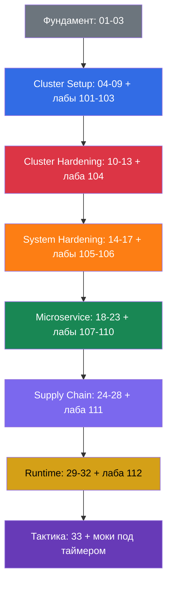

[Eng version](README.md) · [Versión en español](README_ES.md) · [Version française](README_FR.md) · [Deutsche Version](README_DE.md) · [ქართული ვერსია](README_GE.md) · [繁體中文版](README_TW.md) · [日本語版](README_JP.md)

# CKS: практический самоучитель по безопасности Kubernetes

Практический курс подготовки к **CKS (Certified Kubernetes Security Specialist)** - сертификации CNCF и Linux Foundation по защите Kubernetes. Это продолжение [курса CKA + CKAD](../../cka/course/README_RU.md): предполагается, что вы уже умеете администрировать кластер, работать с `kubectl`, RBAC, NetworkPolicy, SecurityContext, kubeadm и TLS. CKS не повторяет эту базу, а применяет её к моделям угроз, hardening и расследованию инцидентов.

> **О ссылках на CKA и KCSA.** Самостоятельный архив CKS не включает каталоги `cka` и `kcsa`. Поэтому в standalone-distribution ссылки внутри самого CKS остаются кликабельными, а cross-course references на CKA/KCSA публикуются как обычный текст без относительных URL. В monorepo-build их можно генерировать как рабочие ссылки на соседние курсы или как стабильные absolute URLs. Ссылки вида `../../cka/...` и `../../kcsa/...` в исходниках рассчитаны на полный monorepo и намеренно сохраняются: пререквизиты CKA и вводный материал KCSA - реальная часть учебного маршрута, и терять указание на них в тексте не следует.

> **Версия Kubernetes и экзамен.** Основные комплексные лабораторные `101-112` проверены на Kubernetes `v1.36` - это **версия обучения** для core labs. Лаба `113` - исключение по конструкции: кластер стартует на `v1.35.x` и целевая версия задания - реальный upgrade до `v1.36.x` (тема лабы - сам процесс minor upgrade, поэтому финальная версия совпадает с baseline остальных core labs). На дату проверки 2026-09-06 официальные страницы LF (основная страница CKS, «Important Instructions: CKS» и FAQ) согласованно указывают Kubernetes `v1.35` для экзаменационной среды CKS; актуальная программа CNCF по имени файла остаётся `CKS Curriculum v1.34` - curriculum version и exam environment version поддерживаются независимо. Перед экзаменом перепроверьте основную страницу CKS, Important Instructions и FAQ, а также версию, показанную в ExamUI. Подробный release-процесс описан в [политике версий](../VERSION_POLICY.md), русский стиль - в [STYLE_RU.md](../STYLE_RU.md).

## Как устроен курс

Каждая тема - каталог с номером и русским исходником `ru.md`. Переводы появятся в `README.md`, `es.md`, `fr.md`, `de.md`, `ge.md`, `tw.md` и `jp.md`; переключатель языков расположен в первой строке файлов. Главы сгруппированы по доменам CKS и помечены цветом:

- 🟦 Cluster Setup - 15%
- 🟥 Cluster Hardening - 15%
- 🟧 System Hardening - 10%
- 🟩 Minimize Microservice Vulnerabilities - 20%
- 🟪 Supply Chain Security - 20%
- 🟨 Monitoring, Logging & Runtime Security - 20%
- ⬜ фундамент и подготовка к экзамену

Термины будут собраны в [глоссарии](GLOSSARY_RU.md). Готовые YAML/CLI-сниппеты без теории - в [шпаргалке](CHEATSHEET_RU.md), а частые причины `[FAIL]` в лабах - в [справочнике ошибок](TROUBLESHOOTING_INDEX_RU.md). Production-current изменения Kubernetes v1.36, которые не привязаны к одному домену, собраны в [приложении Security Delta](APPENDIX_K8S_136_SECURITY_DELTA_RU.md).

## Формат экзамена

CKS - практический, performance-based экзамен: 2 часа, проходной балл 67%. Нужно быстро работать с несколькими контекстами, конфигурацией control plane и нодами по SSH. Тактика, разрешённая документация и финальный чеклист - в [главе 33](33/ru.md).

## С чего начать

CKS не повторяет CKA. До начала уверенно освежите следующие темы:

- [RBAC](../../cka/course/38/ru.md): Role, ClusterRole, binding и `kubectl auth can-i`.
- [NetworkPolicy](../../cka/course/34/ru.md): селекторы, default deny, DNS и CNI.
- [SecurityContext и capabilities](../../cka/course/20/ru.md), [ServiceAccount и admission](../../cka/course/21/ru.md).
- [Secret](../../cka/course/19/ru.md), [образы и Dockerfile](../../cka/course/23/ru.md).
- [kubeadm](../../cka/course/35/ru.md), [обновление](../../cka/course/36/ru.md), [TLS, kubeconfig и CSR](../../cka/course/39/ru.md).

После этого пройдите главы 01-03: они дают словарь модели угроз и связывают Linux-механизмы с последующим hardening.

## Официальная программа экзамена

| Домен | Вес |
|-------|-----|
| Cluster Setup | 15% |
| Cluster Hardening | 15% |
| System Hardening | 10% |
| Minimize Microservice Vulnerabilities | 20% |
| Supply Chain Security | 20% |
| Monitoring, Logging and Runtime Security | 20% |

## Содержание

### Часть 0. Фундамент безопасности (необязательная) ⬜

1. [Введение: экзамен CKS, отличия от CKA, устройство курса](01/ru.md)
2. [Модель безопасности Kubernetes: 4C, поверхность атаки, фазы атаки](02/ru.md)
3. [Linux-механизмы безопасности под капотом](03/ru.md)

### Часть 1. Cluster Setup - 15% 🟦

4. [NetworkPolicy для безопасности: default deny, ingress/egress, изоляция pod-to-pod](04/ru.md)
5. [Защита node metadata и endpoints сетевыми политиками](05/ru.md)
6. [Cilium NetworkPolicy: L3/L4/L7, DNS и Hubble](06/ru.md)
7. [CIS Benchmark и kube-bench](07/ru.md)
8. [Secure Ingress с TLS](08/ru.md)
9. [Небезопасные аргументы компонентов, TLS-хардненинг и проверка бинарников](09/ru.md)

### Часть 2. Cluster Hardening - 15% 🟥

10. [RBAC для минимизации доступа](10/ru.md)
11. [ServiceAccounts: минимизация и токены](11/ru.md)
12. [Ограничение доступа к Kubernetes API](12/ru.md)
13. [Обновление Kubernetes для устранения уязвимостей](13/ru.md)

### Часть 3. System Hardening - 10% 🟧

14. [Минимизация footprint хостовой ОС и безопасность runtime-демона](14/ru.md)
15. [Least-privilege на хосте и минимизация внешнего доступа к сети](15/ru.md)
16. [AppArmor](16/ru.md)
17. [seccomp](17/ru.md)

### Часть 4. Minimize Microservice Vulnerabilities - 20% 🟩

18. [SecurityContext углублённо](18/ru.md)
19. [Pod Security Standards и Pod Security Admission](19/ru.md)
20. [Admission-контроллеры и policy-движки: OPA/Gatekeeper и Kyverno](20/ru.md)
21. [Управление секретами Kubernetes](21/ru.md)
22. [Изоляция и sandboxed containers: gVisor и Kata](22/ru.md)
23. [Pod-to-Pod шифрование и mTLS: Cilium и Istio](23/ru.md)

### Часть 5. Supply Chain Security - 20% 🟪

24. [Минимизация базового образа](24/ru.md)
25. [Понимание supply chain: SBOM, CI/CD, artifact repositories](25/ru.md)
26. [Защита supply chain: реестры, подпись и валидация артефактов](26/ru.md)
27. [Статический анализ нагрузок и образов](27/ru.md)
28. [Сканирование образов на известные уязвимости](28/ru.md)

### Часть 6. Monitoring, Logging & Runtime Security - 20% 🟨

29. [Поведенческий анализ во время выполнения: Falco](29/ru.md)
30. [Обнаружение угроз и расследование фаз атаки](30/ru.md)
31. [Иммутабельность контейнеров в runtime](31/ru.md)
32. [Audit-логи Kubernetes](32/ru.md)

### Часть 7. Подготовка к экзамену ⬜

33. [Экзамен CKS: формат, тайм-менеджмент, разрешённая документация, чеклист](33/ru.md)

## Компетенция → глава

| Домен        | Компетенция                                                                                                                                    | Главы                                  |
| ----------------- | --------------------------------------------------------------------------------------------------------------------------------------------------------- | ------------------------------------------- |
| Cluster Setup     | Network security policies для ограничения доступа на уровне кластера                                                 | [04](04/ru.md), [05](05/ru.md), [06](06/ru.md) |
| Cluster Setup     | CIS Benchmark для компонентов etcd, kubelet, kube-dns и kube-apiserver                                                                     | [07](07/ru.md)                               |
| Cluster Setup     | Правильная настройка Ingress с TLS                                                                                                    | [08](08/ru.md)                               |
| Cluster Setup     | Защита node metadata и endpoints                                                                                                                   | [05](05/ru.md), [09](09/ru.md)                |
| Cluster Setup     | Проверка бинарников платформы перед деплоем                                                                        | [09](09/ru.md)                               |
| Cluster Hardening | RBAC для минимизации доступа                                                                                                         | [10](10/ru.md)                               |
| Cluster Hardening | Осторожная работа с ServiceAccount: отключение default и минимальные права                                    | [11](11/ru.md)                               |
| Cluster Hardening | Ограничение доступа к Kubernetes API                                                                                                   | [12](12/ru.md), [09](09/ru.md)                |
| Cluster Hardening | Обновление Kubernetes для устранения уязвимостей                                                                        | [13](13/ru.md)                               |
| System Hardening  | Минимизация footprint хостовой ОС                                                                                                    | [14](14/ru.md)                               |
| System Hardening  | Least-privilege identity and access management                                                                                                            | [15](15/ru.md)                               |
| System Hardening  | Минимизация внешнего доступа к сети                                                                                        | [14](14/ru.md), [15](15/ru.md)                |
| System Hardening  | Hardening ядра: AppArmor                                                                                                                              | [16](16/ru.md), [03](03/ru.md)                |
| System Hardening  | Hardening ядра: seccomp                                                                                                                               | [17](17/ru.md), [03](03/ru.md)                |
| Microservice      | Pod Security Standards                                                                                                                                    | [18](18/ru.md), [19](19/ru.md)                |
| Microservice      | Управление Secret Kubernetes                                                                                                                    | [21](21/ru.md)                               |
| Microservice      | Изоляция: multi-tenancy и sandboxed containers                                                                                                   | [22](22/ru.md)                               |
| Microservice      | Pod-to-Pod шифрование с Cilium                                                                                                                 | [23](23/ru.md)                               |
| Supply Chain      | Минимизация footprint базового образа                                                                                            | [24](24/ru.md)                               |
| Supply Chain      | Supply chain: SBOM, CI/CD, artifact repositories                                                                                                          | [25](25/ru.md)                               |
| Supply Chain      | Разрешённые реестры, подпись и валидация артефактов                                                          | [26](26/ru.md)                               |
| Supply Chain      | Статический анализ нагрузок и образов: kubesec, kube-linter, hadolint                                                    | [27](27/ru.md)                               |
| Supply Chain      | Сканирование известных уязвимостей и SBOM                                                                                | [28](28/ru.md), [25](25/ru.md)                |
| Runtime           | Поведенческий анализ вредоносной активности                                                                       | [29](29/ru.md)                               |
| Runtime           | Детект угроз в инфраструктуре, приложениях, сети, данных, пользователях и нагрузках | [30](30/ru.md), [29](29/ru.md)                |
| Runtime           | Расследование и определение фаз атаки и злоумышленников                                                  | [02](02/ru.md), [30](30/ru.md)                |
| Runtime           | Иммутабельность контейнеров во время выполнения                                                                | [31](31/ru.md), [18](18/ru.md)                |
| Runtime           | Audit-логи Kubernetes для мониторинга доступа                                                                                    | [32](32/ru.md)                               |

## Домен → лабы

| Домен                                | Лабы                                                                                                                                                                                                            |
| ----------------------------------------- | ------------------------------------------------------------------------------------------------------------------------------------------------------------------------------------------------------------------- |
| 🟦 Cluster Setup                          | [101](../labs/101/README_RU.MD) NetworkPolicy и metadata, [102](../labs/102/README_RU.MD) Cilium L3/L4/L7, [103](../labs/103/README_RU.MD) CIS, TLS и binary verification                                            |
| 🟥 Cluster Hardening                      | [104](../labs/104/README_RU.MD) RBAC, ServiceAccount и API access, [113](../labs/113/README_RU.MD) kubeadm upgrade                                                                                                 |
| 🟧 System Hardening                       | [105](../labs/105/README_RU.MD) ОС, сеть и Docker daemon, [106](../labs/106/README_RU.MD) AppArmor и seccomp                                                                                                  |
| 🟩 Minimize Microservice Vulnerabilities  | [107](../labs/107/README_RU.MD) PSA и SecurityContext, [108](../labs/108/README_RU.MD) admission policies, [109](../labs/109/README_RU.MD) encryption at rest, [110](../labs/110/README_RU.MD) gVisor, Cilium и Istio |
| 🟪 Supply Chain Security                  | [108](../labs/108/README_RU.MD) allowlist, [111](../labs/111/README_RU.MD) images, SBOM, scan и signing                                                                                                              |
| 🟨 Monitoring, Logging & Runtime Security | [112](../labs/112/README_RU.MD) Falco, audit-логи и иммутабельность                                                                                                                              |

## Практика

У курса четыре уровня практики, и они не заменяют друг друга - каждый проверяет свой навык:

```
LEVEL 1 — ⚡ Быстрая практика (Killercoda)          5-15 минут
          Попробовать один конкретный навык изолированно, без polish и без риска для лабы
              ↓
LEVEL 2 — 🔬 Глубокая лаборатория (Лабы 101-113)     30-120+ минут
          Понять механизм, failure modes, effective state и security evidence целиком
              ↓
LEVEL 3 — 🎯 Экзаменационная практика (Мок 01-04)     120 минут
          Скорость, task recognition, context switching и exam workflow под таймером
              ↓
LEVEL 4 — 🧭 Внешняя валидация (Killer.sh)            независимая среда
          Timer, stress, непривычное окружение - финальная проверка перед экзаменом
```

Внутри большинства глав вы встретите Level 1 (🌐/🎮 Killercoda-ссылки) и Level 2 (🧪 лаба) рядом
друг с другом - это не дублирование. Killercoda-сценарий по RBAC за 10 минут не заменяет
лабу 104, где та же RBAC-граница развивается через несколько заданий, ломается и
восстанавливается, и её результат нужно доказать evidence-артефактом. Killercoda-ссылка
сейчас есть в 23 из 33 глав - там, где для темы существует подходящий готовый сценарий;
несколько глав (например, вводные 1-2 и обзор формата экзамена в 33) не имеют прямого
аналога в каталоге Killercoda и полагаются только на Level 2/3. Level 3 (моки)
и Level 4 (Killer.sh) не привязаны к отдельным главам - они собирают материал всех доменов
сразу, под давлением времени.

- ⚡ **Level 1.** Killercoda-сценарии в большинстве глав (например, `rbac-serviceaccount-permissions`) - быстрая проверка одного факта или команды сразу после теории.
- 🔬 **Level 2.** 🧪 [Лабораторные работы CKS](../labs) - план из 13 лабораторных работ с автоматической проверкой `check_result`, от NetworkPolicy до Falco, audit-логов и kubeadm upgrade. Здесь вырабатывается полный workflow: hardening → break → verify → evidence.
- 🎯 **Level 3.** 🧪 [Мок-экзамены CKS](../mock) - репетиции под таймером на 120 минут, смешивающие все домены сразу; новые русские материалы будут добавлены отдельно.
- 🧭 **Level 4.** [Killer.sh](https://killer.sh/cks) (входит в стандартную регистрацию на экзамен LF) - независимая среда, два симулированных прогона по 17 заданий в отдельном 36-часовом окне каждый. Используйте его в конце подготовки, а не вместо Level 2-3: это финальный стресс-тест, а не основной источник знаний. **Важно:** доступ к симулятору не включён в регистрацию `CKS-SINGLE` (экзамен без ретейка) - если вы регистрировались по этому тарифу, Killer.sh нужно будет купить отдельно на сайте Killer.sh, либо ориентироваться только на Level 2-3.

Начинайте с глав 01-03, затем проходите домены вместе с соответствующими лабами. Финальную репетицию и чеклист соберёт [глава 33](33/ru.md).

## Рекомендуемый порядок подготовки



Не откладывайте лабы: в CKS ценятся не определения, а безопасные изменения, проверенные на реальном кластере. После каждого домена фиксируйте команды и пути конфигураций в личном чеклисте, затем отрабатывайте их под таймером в [главе 33](33/ru.md).

## Что читать дальше

- B. Muschko, **Certified Kubernetes Security Specialist (CKS) Study Guide**, O'Reilly.
- [Официальная документация Kubernetes](https://kubernetes.io/docs/) - первоисточник по API и hardening.
- [Falco](https://falco.org/docs/), [Trivy](https://trivy.dev/latest/docs/), [Cilium](https://docs.cilium.io/), [Kyverno](https://kyverno.io/docs/) - документация практических инструментов курса.
- [CIS Kubernetes Benchmark](https://www.cisecurity.org/benchmark/kubernetes) - рекомендации по безопасной конфигурации компонентов.
