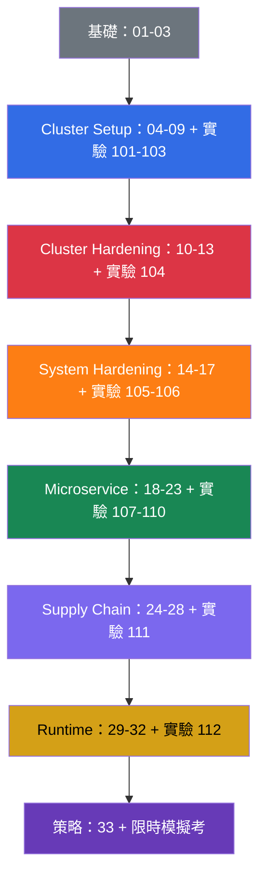

[Русская версия](README_RU.md) · [Eng version](README.md) · [Versión en español](README_ES.md) · [Version française](README_FR.md) · [Deutsche Version](README_DE.md) · [ქართული ვერსია](README_GE.md) · [日本語版](README_JP.md)

# CKS：Kubernetes 安全實作自學教材

準備 **CKS（Certified Kubernetes Security Specialist）** 的實作課程。CKS 是 CNCF 與 Linux Foundation 推出的 Kubernetes 安全認證。本課程是 [CKA + CKAD 課程](../../cka/course/README_TW.md)的延續：預設你已經會管理叢集，並能使用 `kubectl`、RBAC、NetworkPolicy、SecurityContext、kubeadm 與 TLS。CKS 不重複這些基礎，而是把它們應用在威脅模型、hardening 與事件調查上。

## 關於專案與維護

本課程由 **Viktar Mikalayeu（CNCF Kubestronaut）** 與貢獻者社群共同維護。Kubestronaut 身分表示持有並維持有效的五項 CNCF Kubernetes 認證：CKA、CKAD、CKS、KCNA 與 KCSA。

教材以獨立的 open-source 專案形式持續發展：技術論述會對照 Kubernetes、CNCF/Linux Foundation 的第一手來源，以及所用專案的官方文件；變更須經過技術審查與自動化檢查，考試環境、Kubernetes 與 security tooling 的時效性則另行追蹤。

關於 maintainers、技術審查與課程維護原則的詳細說明：[MAINTAINERS.md](../MAINTAINERS.md)。Kubestronaut 名單由 CNCF 公布：[CNCF Kubestronaut Program](https://www.cncf.io/training/kubestronaut/)。CNCF Kubestronaut list：[Viktar Mikalayeu](https://www.cncf.io/training/kubestronaut/?_sft_lf-country=ge&p=viktar-mikalayeu&_sf_s=viktar+mikalayeu)。

> **獨立專案。** Kubestronaut 身分僅指 maintainer 的資格。本課程不是 CNCF 或 Linux Foundation 的官方課程，也不代表它們對專案內容的 endorsement、認證或官方認可。

> **Kubernetes 版本與考試。** 主要的綜合實驗 `101-112` 與 `114` 已在 Kubernetes `v1.36` 上驗證，這是 core labs 的**學習版本**。實驗 `113` 在設計上是例外：叢集從 `v1.35.x` 啟動，任務目標是實際升級到 `v1.36.x`（該實驗的主題就是 minor upgrade 本身，因此最終版本與其他 core labs 的 baseline 一致）。截至查核日 2026-09-06，LF 官方頁面（CKS 主頁面、「Important Instructions: CKS」與 FAQ）一致指出 CKS 考試環境使用 Kubernetes `v1.35`；CNCF 現行大綱依檔名仍為 `CKS Curriculum v1.34`，curriculum version 與 exam environment version 是各自獨立維護的。考前請再次核對 CKS 主頁面、Important Instructions 與 FAQ，以及 ExamUI 中顯示的版本。完整的 release 流程請見[版本政策](../VERSION_POLICY.md)，俄文風格規範見 [STYLE_RU.md (RU)](../STYLE_RU.md)。

## 課程架構

每個主題都是一個編號目錄，內含各語言檔案：俄文原始檔 `ru.md`，以及翻譯版本 `README.md`（English）、`es.md`、`fr.md`、`de.md`、`ge.md`、`tw.md`、`jp.md`。章節依 CKS 領域分組，並以顏色標示：

- 🟦 Cluster Setup - 15%
- 🟥 Cluster Hardening - 15%
- 🟧 System Hardening - 10%
- 🟩 Minimize Microservice Vulnerabilities - 20%
- 🟪 Supply Chain Security - 20%
- 🟨 Monitoring, Logging & Runtime Security - 20%
- ⬜ 基礎與考試準備

各章節中有四種視覺標記，用來區分內容類型，而非重要程度：

- 🎯 **CKS Core** - 考試中必須會做並驗證的內容。
- 🧠 **為什麼有效** - 機制的模型，說明其推理。
- 🔬 **Deep Dive** - 深入內容、edge case、替代方案或 legacy 背景。
- 🏭 **Production** - 真實營運環境中如何應用。

術語將彙整於[詞彙表 (RU)](GLOSSARY_RU.md)。不含理論的現成 YAML/CLI 片段見[速查表 (RU)](CHEATSHEET_RU.md)，實驗中常見的 `[FAIL]` 原因見[錯誤索引 (RU)](TROUBLESHOOTING_INDEX_RU.md)。不屬於單一 CKS domain 的 production-current 安全變更，放在依版本劃分的附錄中：[Kubernetes v1.36 Security Delta (RU)](APPENDIX_K8S_136_SECURITY_DELTA_RU.md) - training baseline；[Kubernetes v1.37 Security Delta (RU)](APPENDIX_K8S_137_SECURITY_DELTA_RU.md) - current upstream，不會自動成為 CKS Core。

## 考試格式

CKS 是實作型（performance-based）考試：2 小時，及格分數 67%。你需要在多個 context、control plane 設定與透過 SSH 連線的節點之間快速作業。策略、允許使用的文件與最終檢查清單請見[第 33 章](33/tw.md)。

## 從哪裡開始

CKS 不會重複 CKA。開始前，請先穩固複習以下主題：

- [RBAC](../../cka/course/38/tw.md)：Role、ClusterRole、binding 與 `kubectl auth can-i`。
- [NetworkPolicy](../../cka/course/34/tw.md)：selector、default deny、DNS 與 CNI。
- [SecurityContext 與 capabilities](../../cka/course/20/tw.md)、[ServiceAccount 與 admission](../../cka/course/21/tw.md)。
- [Secret](../../cka/course/19/tw.md)、[映像與 Dockerfile](../../cka/course/23/tw.md)。
- [kubeadm](../../cka/course/35/tw.md)、[升級](../../cka/course/36/tw.md)、[TLS、kubeconfig 與 CSR](../../cka/course/39/tw.md)。

之後請讀完第 01-03 章：它們提供威脅模型的詞彙，並把 Linux 機制與後續的 hardening 連結起來。

## 官方考試大綱

| Domain | 權重 |
|--------|------|
| Cluster Setup | 15% |
| Cluster Hardening | 15% |
| System Hardening | 10% |
| Minimize Microservice Vulnerabilities | 20% |
| Supply Chain Security | 20% |
| Monitoring, Logging and Runtime Security | 20% |

## 目錄

### 第 0 部分。安全基礎（選讀）⬜

1. [導論：CKS 考試、與 CKA 的差異、課程結構](01/tw.md)
2. [Kubernetes 安全模型：4C、攻擊面、攻擊階段](02/tw.md)
3. [Linux 安全機制的底層運作](03/tw.md)

### 第 1 部分。Cluster Setup - 15% 🟦

4. [安全用途的 NetworkPolicy：default deny、ingress/egress、pod-to-pod 隔離](04/tw.md)
5. [以網路政策保護 node metadata 與 endpoints](05/tw.md)
6. [Cilium NetworkPolicy：L3/L4/L7、DNS 與 Hubble](06/tw.md)
7. [CIS Benchmark 與 kube-bench](07/tw.md)
8. [使用 TLS 的 Secure Ingress](08/tw.md)
9. [不安全的元件參數、TLS hardening 與二進位檔驗證](09/tw.md)

### 第 2 部分。Cluster Hardening - 15% 🟥

10. [以 RBAC 最小化存取權限](10/tw.md)
11. [ServiceAccount：最小化與 token](11/tw.md)
12. [限制對 Kubernetes API 的存取](12/tw.md)
13. [升級 Kubernetes 以修補漏洞](13/tw.md)

### 第 3 部分。System Hardening - 10% 🟧

14. [最小化主機 OS footprint 與 runtime daemon 安全](14/tw.md)
15. [主機上的 Least-privilege 與最小化對外網路存取](15/tw.md)
16. [AppArmor](16/tw.md)
17. [seccomp](17/tw.md)

### 第 4 部分。Minimize Microservice Vulnerabilities - 20% 🟩

18. [SecurityContext 深入解析](18/tw.md)
19. [Pod Security Standards 與 Pod Security Admission](19/tw.md)
20. [Admission controller 與 policy engine：OPA/Gatekeeper 和 Kyverno](20/tw.md)
21. [Kubernetes Secret 管理](21/tw.md)
22. [隔離與 sandboxed containers：gVisor 和 Kata](22/tw.md)
23. [Pod-to-Pod 加密與 mTLS：Cilium 和 Istio](23/tw.md)

### 第 5 部分。Supply Chain Security - 20% 🟪

24. [最小化 base image](24/tw.md)
25. [理解 supply chain：SBOM、CI/CD、artifact repositories](25/tw.md)
26. [保護 supply chain：registry、簽章與 artifact 驗證](26/tw.md)
27. [工作負載與映像的靜態分析](27/tw.md)
28. [掃描映像的已知漏洞](28/tw.md)

### 第 6 部分。Monitoring, Logging & Runtime Security - 20% 🟨

29. [執行期行為分析：Falco](29/tw.md)
30. [威脅偵測與攻擊階段調查](30/tw.md)
31. [Runtime 中的容器不可變性](31/tw.md)
32. [Kubernetes audit log](32/tw.md)

### 第 7 部分。考試準備 ⬜

33. [CKS 考試：格式、時間管理、允許使用的文件、檢查清單](33/tw.md)

## 能力 → 章節

| Domain            | 能力                                                                                   | 章節                                   |
| ----------------- | -------------------------------------------------------------------------------------- | -------------------------------------- |
| Cluster Setup     | 以 network security policies 限制叢集層級的存取                                        | [04](04/tw.md), [05](05/tw.md), [06](06/tw.md) |
| Cluster Setup     | 針對 etcd、kubelet、kube-dns 與 kube-apiserver 元件套用 CIS Benchmark                  | [07](07/tw.md)                         |
| Cluster Setup     | 正確設定使用 TLS 的 Ingress                                                            | [08](08/tw.md)                         |
| Cluster Setup     | 保護 node metadata 與 endpoints                                                        | [05](05/tw.md), [09](09/tw.md)         |
| Cluster Setup     | 部署前驗證平台二進位檔                                                                 | [09](09/tw.md)                         |
| Cluster Hardening | 以 RBAC 最小化存取權限                                                                 | [10](10/tw.md)                         |
| Cluster Hardening | 謹慎使用 ServiceAccount：停用 default 並給予最小權限                                   | [11](11/tw.md)                         |
| Cluster Hardening | 限制對 Kubernetes API 的存取                                                           | [12](12/tw.md), [09](09/tw.md)         |
| Cluster Hardening | 升級 Kubernetes 以修補漏洞                                                             | [13](13/tw.md)                         |
| System Hardening  | 最小化主機 OS footprint                                                                | [14](14/tw.md)                         |
| System Hardening  | Least-privilege identity and access management                                         | [15](15/tw.md)                         |
| System Hardening  | 最小化對外網路存取                                                                     | [14](14/tw.md), [15](15/tw.md)         |
| System Hardening  | 核心 hardening：AppArmor                                                               | [16](16/tw.md), [03](03/tw.md)         |
| System Hardening  | 核心 hardening：seccomp                                                                | [17](17/tw.md), [03](03/tw.md)         |
| Microservice      | Pod Security Standards                                                                 | [18](18/tw.md), [19](19/tw.md)         |
| Microservice      | Kubernetes Secret 管理                                                                 | [21](21/tw.md)                         |
| Microservice      | 隔離：multi-tenancy 與 sandboxed containers                                            | [22](22/tw.md)                         |
| Microservice      | 以 Cilium 進行 Pod-to-Pod 加密                                                         | [23](23/tw.md)                         |
| Supply Chain      | 最小化 base image 的 footprint                                                         | [24](24/tw.md)                         |
| Supply Chain      | Supply chain：SBOM、CI/CD、artifact repositories                                       | [25](25/tw.md)                         |
| Supply Chain      | 允許的 registry、簽章與 artifact 驗證                                                  | [26](26/tw.md)                         |
| Supply Chain      | 工作負載與映像的靜態分析：kubesec、kube-linter、hadolint                               | [27](27/tw.md)                         |
| Supply Chain      | 掃描已知漏洞與 SBOM                                                                    | [28](28/tw.md), [25](25/tw.md)         |
| Runtime           | 惡意活動的行為分析                                                                     | [29](29/tw.md)                         |
| Runtime           | 偵測基礎設施、應用程式、網路、資料、使用者與工作負載中的威脅                           | [30](30/tw.md), [29](29/tw.md)         |
| Runtime           | 調查並判定攻擊階段與攻擊者                                                             | [02](02/tw.md), [30](30/tw.md)         |
| Runtime           | 執行期的容器不可變性                                                                   | [31](31/tw.md), [18](18/tw.md)         |
| Runtime           | 以 Kubernetes audit log 監控存取                                                       | [32](32/tw.md)                         |

## Domain → 實驗

實驗說明目前僅提供俄文版本。

| Domain                                    | 實驗                                                                                                                                                                                                              |
| ----------------------------------------- | ----------------------------------------------------------------------------------------------------------------------------------------------------------------------------------------------------------------- |
| 🟦 Cluster Setup                          | [101 (RU)](../labs/101/README_RU.MD) NetworkPolicy 與 metadata、[102 (RU)](../labs/102/README_RU.MD) Cilium L3/L4/L7、[103 (RU)](../labs/103/README_RU.MD) CIS、TLS 與 binary verification、[115 (RU)](../labs/115/README_RU.MD) Cilium bootstrap 與 kube-proxy replacement（advanced/production，非 CKS Core） |
| 🟥 Cluster Hardening                      | [104 (RU)](../labs/104/README_RU.MD) RBAC、ServiceAccount 與 API access、[113 (RU)](../labs/113/README_RU.MD) kubeadm upgrade、[114 (RU)](../labs/114/README_RU.MD) kubeconfig contexts、client certificate 與 Service exposure |
| 🟧 System Hardening                       | [105 (RU)](../labs/105/README_RU.MD) OS、網路與 Docker daemon、[106 (RU)](../labs/106/README_RU.MD) AppArmor 與 seccomp                                                                                          |
| 🟩 Minimize Microservice Vulnerabilities  | [107 (RU)](../labs/107/README_RU.MD) PSA 與 SecurityContext、[108 (RU)](../labs/108/README_RU.MD) admission policies、[109 (RU)](../labs/109/README_RU.MD) encryption at rest、[110 (RU)](../labs/110/README_RU.MD) gVisor、Cilium 與 Istio、[115 (RU)](../labs/115/README_RU.MD) WireGuard 與基於 SPIRE 的 Cilium Mutual Authentication（advanced/production，非 CKS Core） |
| 🟪 Supply Chain Security                  | [108 (RU)](../labs/108/README_RU.MD) allowlist、[111 (RU)](../labs/111/README_RU.MD) images、SBOM、scan、signing 與 multi-image CVE triage                                                                       |
| 🟨 Monitoring, Logging & Runtime Security | [112 (RU)](../labs/112/README_RU.MD) Falco、audit log 與不可變性                                                                                                                                                  |

## 實作

本課程有四個實作層級，它們彼此不能取代，各自驗證不同的技能，從快速確認單一事實（Level 1）到考前的獨立驗證（Level 4）：

在大多數章節中，你會看到 Level 1（🌐/🎮 Killercoda 連結）與 Level 2（🧪 實驗）並列出現，這不是重複。十分鐘的 RBAC Killercoda 情境，無法取代實驗 104：同一條 RBAC 邊界在該實驗中會透過多個任務逐步發展、被破壞再恢復，且結果必須以 evidence artifact 證明。目前 33 章中有 23 章附有 Killercoda 連結 - 即該主題存在合適現成情境的章節；少數章節（例如導論的第 1-2 章與考試格式總覽的第 33 章）在 Killercoda 目錄中沒有直接對應，只依賴 Level 2/3。Level 3（模擬考）與 Level 4（Killer.sh）不綁定個別章節 - 它們在時間壓力下一次整合所有 domain 的內容。

- ⚡ **Level 1**（5-15 分鐘）。大多數章節中的 Killercoda 情境（例如 `rbac-serviceaccount-permissions`）- 讀完理論後立即快速確認單一事實或指令。
- 🔬 **Level 2**（30-120+ 分鐘）。🧪 [CKS 實驗](../labs) - 由 15 個實驗組成的計畫，以 `check_result` 自動檢查，範圍從 NetworkPolicy 到 Falco、audit log 與 kubeadm upgrade。在這裡養成完整的 workflow：hardening → break → verify → evidence。

> **為什麼參考解答很簡短。** 一道實驗題可能有多種技術上正確的解法。課程的參考 solutions 並不主張唯一正確的做法：它們刻意選擇簡短、可重複且易於驗證的路徑，幫助你在考試中遇到類似任務時，縮短時間與操作步驟。solution 的目標是養成考試用的肌肉記憶：快速完成所需變更，並立刻確認結果確實正確。更通用或偏 production 的做法在真實營運中可能有用，但不是以考試為導向之 solution 的目標。
- 🎯 **Level 3**（120 分鐘）。🧪 [CKS 模擬考](../mock) - 限時演練，一次混合所有 domain；以英文提供，與真實考試的題目一致（LF 也提供日文與簡體中文的 CKS，需另行報名，但沒有俄文）- 請提早習慣閱讀英文題目。
- 🧭 **Level 4**（獨立環境）。[Killer.sh](https://killer.sh/cks)（包含在 LF 標準考試報名中）- 兩次模擬，每次 17 題，各自有獨立的 36 小時視窗。請在準備的最後階段使用，而不是取代 Level 2-3：它是最終的壓力測試，不是主要的知識來源。**重要：**模擬器的存取權不包含在 `CKS-SINGLE`（無 retake 的考試）報名中 - 若你以此方案報名，需要另外在 Killer.sh 網站購買，或僅依靠 Level 2-3。

請從第 01-03 章開始，再依各 domain 搭配對應的實驗逐一學習。最後的演練與檢查清單請見[第 33 章](33/tw.md)。

## 建議的準備順序

不要拖延實驗：CKS 看重的不是定義，而是在真實叢集上驗證過的安全變更。每完成一個 domain，就把指令與設定檔路徑記錄到個人檢查清單中，然後在[第 33 章](33/tw.md)中限時演練。

## 延伸閱讀

- B. Muschko, **Certified Kubernetes Security Specialist (CKS) Study Guide**, O'Reilly, 第 1 版, 2023。適合作為考試結構的精簡概覽，但請將技術建議與最新文件及本課程的 Security Delta 附錄對照。
- [Kubernetes 官方文件](https://kubernetes.io/docs/) - API 與 hardening 的第一手來源。
- [Falco](https://falco.org/docs/)、[Trivy](https://trivy.dev/latest/docs/)、[Cilium](https://docs.cilium.io/)、[Kyverno](https://kyverno.io/docs/) - 課程所用實務工具的文件。
- [CIS Kubernetes Benchmark](https://www.cisecurity.org/benchmark/kubernetes) - 元件安全設定的建議。
