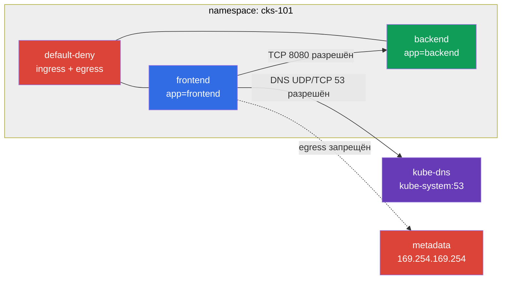

[Eng version](README.MD) · [Versión en español](README_ES.MD) · [Version française](README_FR.MD) · [Deutsche Version](README_DE.MD) · [ქართული ვერსია](README_GE.MD) · [繁體中文版](README_TW.MD) · [日本語版](README_JP.MD)

# Лаба 101 - NetworkPolicy: default-deny, изоляция и защита metadata

## Описание

В лабе строится небольшое приложение из `frontend` и `backend` в отдельном namespace и
последовательно ограничивается его сетью. Цель - применять native Kubernetes `NetworkPolicy`
как allow-list: сначала закрыть весь ingress и egress, затем открыть только необходимый
поток к backend и DNS. В результате Pod не должен получить доступ к cloud metadata endpoint
`169.254.169.254`.

> **Что нужно знать из CKA.** Базовый синтаксис `NetworkPolicy`, selectors, Services и
> namespaces разобран в [главе CKA 34](../../../cka/course/34/ru.md).

## Цель

- Отработать default-deny для ingress и egress из [главы 04](../../course/04/ru.md).
- Изолировать frontend/backend и разрешать только минимальный Pod-to-Pod трафик.
- Не сломать DNS при egress default-deny согласно [главе 05](../../course/05/ru.md).
- Ограничить доступ скомпрометированного Pod к node/cloud metadata.

## Что мы создаём и зачем

| Объект | Назначение |
|---|---|
| Namespace `cks-101` | Граница ресурсов и действия политик лабы. |
| Deployments `frontend` и `backend` | Учебные приложения `viktoruj/ping_pong` с метками `app=frontend` и `app=backend`. |
| Service `backend` | Стабильная точка доступа к backend на TCP `8080`. |
| default-deny NetworkPolicy | Закрывает ingress и egress всем Pod namespace. |
| allow policy для backend | Открывает TCP `8080` только от Pod с `app=frontend`. |
| DNS egress policy | Открывает UDP/TCP `53` только к `kube-dns` в `kube-system`. |



## Инфраструктура

| Компонент | Значение |
|---|---|
| Kubernetes | `1.36.0`, одноузловой kubeadm cluster |
| CNI | Calico с поддержкой Kubernetes `NetworkPolicy` |
| VPC | `10.101.0.0/16`, две публичные подсети |
| Worker | `kubectl`, контекст `cluster1-admin@cluster1`, `check_result` |

## Развёртывание

```bash
TASK=101 make run_cks_task
```

Подключитесь к worker. Контекст уже настроен:

```bash
kubectl config current-context
# cluster1-admin@cluster1
```

## Задания

---
| **1** | **Приложение в отдельном namespace** |
| :---: | :--- |
| Что делаем | Создайте namespace `cks-101`. В нём создайте Deployments `frontend` и `backend` с образом `viktoruj/ping_pong:latest`, метками `app=frontend` и `app=backend` соответственно. Создайте Service `backend`, выбирающий `app=backend` и направляющий TCP `8080` на `8080`. |
| Критерии приёмки | Namespace и Pod обоих приложений существуют; Service `backend` имеет endpoint. |
---
| **2** | **Default-deny ingress и egress** |
| :---: | :--- |
| Что делаем | В `cks-101` создайте `NetworkPolicy` с пустым `podSelector`, которая включает одновременно `Ingress` и `Egress` в `policyTypes`. Не добавляйте разрешающих правил в эту policy. |
| Критерии приёмки | Policy охватывает все Pod namespace и содержит `policyTypes: [Ingress, Egress]`. |
---
| **3** | **Изоляция frontend/backend** |
| :---: | :--- |
| Что делаем | Отдельной allow policy разрешите Pod с `app=frontend` обращаться к Pod с `app=backend` только по TCP `8080`. Любой Pod без метки `app=frontend` не должен получить этот доступ. Сохраните результат проверок разрешённого и запрещённого запросов в `/var/work/tests/artifacts/3/`. |
| Критерии приёмки | Запрос с frontend identity к backend успешен; запрос с другой identity блокируется; артефакт существует. |
---
| **4** | **DNS после egress default-deny** |
| :---: | :--- |
| Что делаем | Разрешите egress из Pod приложения к `kube-dns` в namespace `kube-system` на UDP и TCP `53`. Сохраните успешный DNS lookup `kubernetes.default.svc.cluster.local` в `/var/work/tests/artifacts/4/dns.txt`. |
| Критерии приёмки | DNS name резолвится из Pod с `app=frontend`; DNS policy не открывает произвольный egress. |
---
| **5** | **Защита metadata endpoint** |
| :---: | :--- |
| Что делаем | Убедитесь, что политики не разрешают egress к `169.254.169.254`. Проверьте из Pod с `app=frontend`, что `curl --max-time 3 http://169.254.169.254/` завершается ошибкой или timeout, и сохраните код команды в `/var/work/tests/artifacts/5/metadata.exit-code`. |
| Критерии приёмки | Запрос к metadata endpoint не проходит; артефакт содержит ненулевой код. |
---

Для проверки из временного client Pod используйте `curlimages/curl` или `busybox` и назначьте
ему `--labels=app=frontend`: policy сопоставляет именно identity Pod, а образ
`viktoruj/ping_pong:latest` является минимальным и не содержит shell/curl.

## Проверка результата

```bash
check_result
```

Скрипт запускает пять тестов и показывает число выполненных заданий.

## Решение

Эталонное решение: [worker/files/solutions/1_RU.MD](worker/files/solutions/1_RU.MD).

## Удаление

```bash
TASK=101 make delete_cks_task
```
