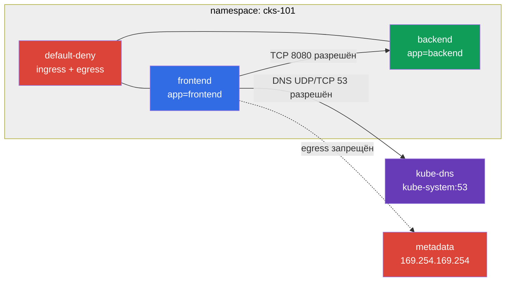

[Eng version](README.MD) · [Versión en español](README_ES.MD) · [Version française](README_FR.MD) · [Deutsche Version](README_DE.MD) · [ქართული ვერსია](README_GE.MD) · [繁體中文版](README_TW.MD) · [日本語版](README_JP.MD)

# Лаба 101 - NetworkPolicy: default-deny, изоляция и защита metadata

## Описание

В лабе строится небольшое приложение из `frontend` и `backend` в отдельном namespace и
последовательно ограничивается его сетью. Цель - применять native Kubernetes `NetworkPolicy`
как allow-list: сначала закрыть весь ingress и egress, затем открыть только необходимый
поток к backend и DNS. В результате Pod не должен получить доступ к cloud metadata endpoint
`169.254.169.254`.

> **Граница ответственности.** API Kubernetes задаёт `NetworkPolicy`, но фактически её
> реализует CNI. Поведение трафика host/node и cloud metadata зависит от CNI и cloud provider.
> В production одних policy недостаточно: применяйте дополнительные механизмы IMDS hardening,
> предоставляемые провайдером и инфраструктурой.

> **Что нужно знать из CKA.** Базовый синтаксис `NetworkPolicy`, selectors, Services и
> namespaces разобран в [главе CKA 34](../../../cka/course/34/ru.md).

## Цель

- Отработать default-deny для ingress и egress из [главы 04](../../course/04/ru.md).
- Изолировать frontend/backend и разрешать только минимальный Pod-to-Pod трафик.
- Не сломать DNS при egress default-deny согласно [главе 05](../../course/05/ru.md).
- Ограничить доступ скомпрометированного Pod к node/cloud metadata.

## Проверьте себя перед стартом

<details>
<summary>1. Что происходит с трафиком, если в namespace есть NetworkPolicy с podSelector={} и policyTypes: [Ingress, Egress], но без единого allow-правила?</summary>

Весь ingress и весь egress запрещён для всех Pod этого namespace. Пустой `podSelector` означает "все Pod", а `policyTypes` без соответствующих массивов `ingress`/`egress` означает "ноль разрешённых правил" - то есть default-deny. Это не оставляет исключений даже для DNS - его нужно разрешить отдельной policy.
</details>

<details>
<summary>2. Почему curl -f не годится как доказательство того, что NetworkPolicy заблокировал запрос?</summary>

`curl -f` возвращает ненулевой exit code и для СЕТЕВОГО отказа (connection refused/timeout), и для успешного HTTP-ответа с кодом `4xx`/`5xx` (например, `401 Unauthorized` от metadata endpoint). Оба случая выглядят одинаково "curl вернул ошибку", но означают разное: первое доказывает network-level deny, второе доказывает, что endpoint СЕТЕВО ДОСТУПЕН, просто отверг запрос на HTTP-уровне. Нужно смотреть на `%{http_code}` (пустой/`000` означает, что HTTP-ответа не было вообще) без флага `-f`.
</details>

<details>
<summary>3. Если policy имеет два элемента в массиве `from: [{namespaceSelector: A}, {podSelector: B}]`, что это значит - AND или OR?</summary>

OR. Каждый элемент массива `from` - самостоятельное условие; трафик разрешается, если совпадает **хотя бы одно**. Чтобы получить AND ("этот namespace И эта метка одновременно"), оба селектора должны быть в ОДНОМ элементе массива: `from: [{namespaceSelector: A, podSelector: B}]`.
</details>

## Что мы создаём и зачем

| Объект | Назначение |
|---|---|
| Namespace `cks-101` | Граница ресурсов и действия политик лабы. |
| Deployments `frontend` и `backend` | Учебные приложения `viktoruj/ping_pong@sha256:${PING_PONG_DIGEST}` с метками `app=frontend` и `app=backend`. |
| Service `backend` | Стабильная точка доступа к backend на TCP `8080`. |
| default-deny NetworkPolicy | Закрывает ingress и egress всем Pod namespace. |
| allow policy для backend | Открывает TCP `8080` только от Pod с `app=frontend`. |
| DNS egress policy | Открывает UDP/TCP `53` только к `kube-dns` в `kube-system`. |



## Инфраструктура

| Компонент | Значение |
|---|---|
| Kubernetes | `1.36.0`, одноузловой kubeadm cluster |
| CNI | Calico с поддержкой Kubernetes `NetworkPolicy` |
| VPC | `10.101.0.0/16`, две публичные подсети |
| Worker | `kubectl`, контекст `cluster1-admin@cluster1`, `check_result` |

## Развёртывание

```bash
TASK=101 make run_cks_task
```

Подключитесь к worker. Контекст уже настроен:

```bash
kubectl config current-context
# cluster1-admin@cluster1
```

## Задания

---
| **1** | **Приложение в отдельном namespace** |
| :---: | :--- |
| Что делаем | Создайте namespace `cks-101`. В нём создайте Deployments `frontend` и `backend` с образом `viktoruj/ping_pong@sha256:${PING_PONG_DIGEST}`, заменив `${PING_PONG_DIGEST}` на **реальный** digest образа перед применением, и метками `app=frontend` и `app=backend` соответственно. Создайте Service `backend`, выбирающий `app=backend` и направляющий TCP `8080` на `8080`. `:latest` и прочие tags mutable: тот же tag может указывать на другой образ; digest фиксирует неизменяемый content-addressed образ. |
| Критерии приёмки | Namespace и Pod обоих приложений существуют; Service `backend` имеет endpoint. |

<details>
<summary>💡 Подсказка к заданию 1</summary>

Не забудьте подставить реальный digest вместо `${PING_PONG_DIGEST}` - если оставить переменную буквально в манифесте, `kubectl apply` создаст Pod с невалидным image reference, и он никогда не станет Running. Проверьте себя: `kubectl get pods -n cks-101 -o jsonpath='{.items[*].spec.containers[0].image}'` должен показать полный `viktoruj/ping_pong@sha256:<64 hex символа>`, без буквальных `${...}`.
</details>
---
| **2** | **Default-deny ingress и egress** |
| :---: | :--- |
| Что делаем | В `cks-101` создайте `NetworkPolicy` с пустым `podSelector`, которая включает одновременно `Ingress` и `Egress` в `policyTypes`. Не добавляйте разрешающих правил в эту policy. |
| Критерии приёмки | Policy охватывает все Pod namespace и содержит `policyTypes: [Ingress, Egress]`. |

<details>
<summary>💡 Подсказка к заданию 2</summary>

`podSelector: {}` (пустые скобки) - это не "нет селектора", а "выбрать ВСЕ Pod". Если вы напишете просто `podSelector:` без значения или вообще уберёте это поле, YAML может интерпретировать это иначе, чем вы ожидаете. Также не добавляйте пустые массивы `ingress: []`/`egress: []` явно - для default-deny достаточно указать `policyTypes`, не имея вообще никакого `ingress`/`egress` поля в spec.
</details>
---
| **3** | **Изоляция frontend/backend** |
| :---: | :--- |
| Что делаем | Отдельной allow policy разрешите Pod с `app=frontend` обращаться к Pod с `app=backend` только по TCP `8080`. Любой Pod без метки `app=frontend` не должен получить этот доступ. Сохраните результат проверок разрешённого и запрещённого запросов в `/var/work/tests/artifacts/3/`. |
| Критерии приёмки | Запрос с frontend identity к backend успешен; запрос с другой identity блокируется; артефакт существует. |

<details>
<summary>💡 Подсказка к заданию 3</summary>

Тестовый Pod для проверки нужно создавать с `--labels=app=frontend` (или `app=<другое>` для отрицательного теста) - именно эта метка, а не имя Pod, определяет, разрешит ли policy трафик. `viktoruj/ping_pong` не содержит shell/curl - используйте отдельный `curlimages/curl` Pod для проверки.
</details>
---
| **4** | **DNS после egress default-deny** |
| :---: | :--- |
| Что делаем | Разрешите egress из Pod приложения к `kube-dns` в namespace `kube-system` на UDP и TCP `53`. Сохраните успешный DNS lookup `kubernetes.default.svc.cluster.local` в `/var/work/tests/artifacts/4/dns.txt`. |
| Критерии приёмки | DNS name резолвится из Pod с `app=frontend`; DNS policy не открывает произвольный egress. |

<details>
<summary>💡 Подсказка к заданию 4</summary>

Легко забыть про UDP - DNS обычно использует UDP/53, но может переключаться на TCP/53 для больших ответов. Разрешите оба протокола. Селектор для kube-dns обычно `k8s-app: kube-dns` в namespace `kube-system` - проверьте актуальный label через `kubectl get pods -n kube-system --show-labels | grep dns`.
</details>
---
| **5** | **Защита metadata endpoint** |
| :---: | :--- |
| Что делаем | Убедитесь, что политики не разрешают egress к `169.254.169.254`. Запускайте `curl` **без `-f`**, сохраняйте одновременно exit code, `%{http_code}` и stderr в `/var/work/tests/artifacts/5/metadata.output`. Классифицируйте результат: DNS failure, TCP refusal, connect/timeout либо HTTP response. HTTP `401/403` означает, что endpoint сетево доступен, и не доказывает действие `NetworkPolicy`. |
| Критерии приёмки | Metadata не возвращает HTTP-ответ (`http_code=000`), а `curl` завершается сетевым timeout/connect failure; артефакт явно указывает уровень отказа. Контрольный HTTP `401/403` распознаётся как HTTP-level response, а не как network deny. |

<details>
<summary>💡 Подсказка к заданию 5</summary>

Если вы уже прошли задания 2-4 корректно, metadata endpoint должен блокироваться "бесплатно" - default-deny egress не делает исключения для `169.254.169.254`, если вы не создали для неё явное allow-правило. Если запрос всё же проходит - проверьте, не разрешили ли вы случайно широкий egress (например, `0.0.0.0/0` без `except`) в задании 3 или 4.
</details>
---
| **6** | **Ловушка AND vs OR и `ipBlock.except` для legacy egress** |
| :---: | :--- |
| Что делаем | Создайте отдельный namespace `cks-101-legacy` и в нём Deployment `legacy-client` (образ `curlimages/curl:8.11.1`, `command: ["sleep", "3600"]`, метка `app=legacy-client`); **не применяйте к этому namespace default-deny**. В `cks-101` создайте `NetworkPolicy` `allow-backend-ingress-from-legacy` типа `Ingress` на Pod с `app=backend`, которая разрешает вход **только** от Pod с `app=legacy-client`, находящегося именно в `cks-101-legacy` (AND: `namespaceSelector` и `podSelector` заданы в одном элементе массива `from`, не в двух отдельных - иначе получится OR, разрешающий весь namespace `cks-101-legacy` или любой Pod с такой меткой в любом namespace). Отдельно в `cks-101-legacy` создайте `NetworkPolicy` `allow-legacy-egress`, которая разрешает `legacy-client` широкий egress на `ipBlock: 0.0.0.0/0`, но с явным `except: ["169.254.169.254/32"]`. |
| Критерии приёмки | `allow-backend-ingress-from-legacy` содержит элемент `from`, где `namespaceSelector` и `podSelector` заданы **в одном и том же элементе массива** (AND); Pod с `app=legacy-client` из `cks-101-legacy` достигает `backend:8080`, а такой же Pod, временно созданный в `default` с той же меткой, - не достигает. `allow-legacy-egress` содержит `ipBlock.cidr: 0.0.0.0/0` и `except` с `169.254.169.254/32`; из `legacy-client` внешний адрес (например `1.1.1.1`) достижим, а metadata - нет. |

<details>
<summary>💡 Подсказка к заданию 6</summary>

Это задание специально названо "ловушкой", потому что YAML-структура AND и OR отличается на один уровень отступа, и легко ошибиться неявно. AND (то, что нужно): `from: [{namespaceSelector: {...}, podSelector: {...}}]` - один элемент массива с двумя полями. OR (частая ошибка): `from: [{namespaceSelector: {...}}, {podSelector: {...}}]` - два отдельных элемента массива. Проверьте себя, создав тестовый Pod с той же меткой `app=legacy-client`, но в другом namespace (например `default`) - если он получает доступ, у вас OR вместо AND.
</details>
---
| **7** | **`hostNetwork` и границы portability `NetworkPolicy`** |
| :---: | :--- |
| Что делаем | Официальная документация Kubernetes прямо называет поведение `NetworkPolicy` для `hostNetwork` Pod **undefined** и допускает только два варианта реализации CNI: (1) плагин различает трафик `hostNetwork` Pod и применяет к нему `NetworkPolicy` так же, как к обычному Pod, либо (2) плагин не различает такой трафик и обрабатывает его как трафик самой ноды — на практике это самая распространённая реализация, включая Calico в этой лабе. Создайте отдельный Pod `hostnetwork-probe` в `cks-101` с `hostNetwork: true`, образом `curlimages/curl:8.11.1` и той же меткой `app=frontend`, что использована в default-deny/allow policies задания 5. Из этого Pod выполните тот же запрос к `169.254.169.254`, что в задании 5, и сохраните полный вывод (`exit code`, `%{http_code}`) в `/var/work/tests/artifacts/7/hostnetwork-metadata.output`. Сравните итог с задание 5 в отдельном файле `/var/work/tests/artifacts/7/comparison.txt`: зафиксируйте фактический наблюдаемый результат **именно в этой Calico/AWS lab-конфигурации**, не формулируя его как универсальное свойство Kubernetes или гарантию для любого CNI. |
| Критерии приёмки | `hostnetwork-probe` имеет `hostNetwork: true` и метку `app=frontend`; запрос к metadata из этого Pod возвращает HTTP-ответ (`http_code` не `000`) — это наблюдаемый результат конкретно для Calico в данной инфраструктуре, а не гарантированное поведение NetworkPolicy API; `comparison.txt` явно показывает разницу между результатом задания 5 (network deny для обычного Pod) и задания 7 (HTTP response для `hostNetwork` Pod) и явно указывает, что это environment-specific наблюдение. |

<details>
<summary>💡 Подсказка к заданию 7</summary>

Не пытайтесь "исправить" это поведение или считать, что задание провалено, если metadata оказывается достижима - это ожидаемый результат для Calico: трафик `hostNetwork` Pod обрабатывается как трафик самой ноды, а не как трафик Pod, и NetworkPolicy к нему просто не применяется. Задание проверяет, что вы это ЗАФИКСИРОВАЛИ и объяснили как environment-specific наблюдение, а не как гарантию.
</details>

## Проверка результата

Для проверки из временного client Pod используйте `curlimages/curl` или `busybox` и назначьте
ему `--labels=app=frontend`: policy сопоставляет именно identity Pod, а закреплённый по digest образ
`viktoruj/ping_pong@sha256:${PING_PONG_DIGEST}` не содержит shell/curl.

Не используйте один только ненулевой exit code `curl -f` как доказательство сетевого
запрета: `-f` возвращает ошибку и для доступного HTTP endpoint с ответом `401`, `403` или
другим `4xx`. Для `NetworkPolicy` важно отсутствие HTTP response и сетевой тип ошибки.

```bash
check_result
```

Скрипт запускает семь тестов и показывает число выполненных заданий.

## Решение

Эталонное решение: [worker/files/solutions/1_RU.MD](worker/files/solutions/1_RU.MD).

## Удаление

```bash
TASK=101 make delete_cks_task
```
