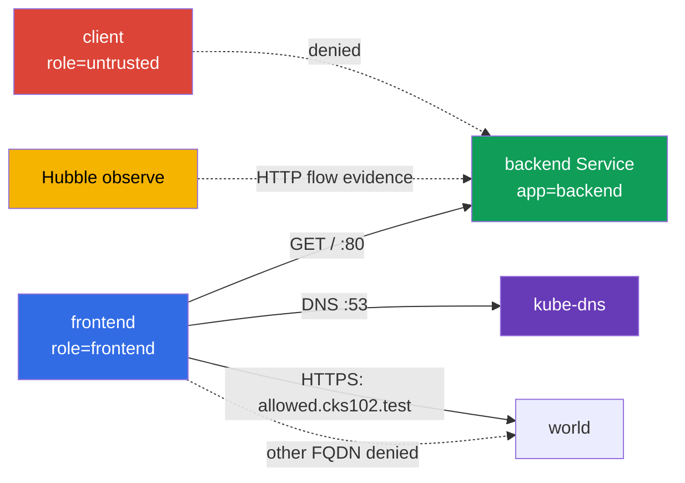

[Eng version](README.MD) · [Versión en español](README_ES.MD) · [Version française](README_FR.MD) · [Deutsche Version](README_DE.MD) · [ქართული ვერსია](README_GE.MD) · [繁體中文版](README_TW.MD) · [日本語版](README_JP.MD)

# Лаба 102 - CiliumNetworkPolicy: L3/L4/L7, DNS-aware egress и Hubble

## Описание

В этой лабораторной работе вы настраиваете CiliumNetworkPolicy для маленького сервиса и
доказываете фактическое поведение сети. Задача не в том, чтобы написать похожий YAML, а в
том, чтобы по labels сузить L3/L4-доступ, затем добавить L7-фильтр HTTP, ограничить egress
по FQDN и сохранить evidence из Hubble. Базовые объекты Kubernetes здесь служат только
учебным стендом; предмет работы - возможности Cilium.

## Цель

Закрепить материал [главы 06. Cilium NetworkPolicy](../../course/06/ru.md):

- `CiliumNetworkPolicy`, `endpointSelector` и identity по labels;
- L3/L4-ограничение source и TCP-порта;
- L7 HTTP-правила для метода и path;
- DNS-aware egress через `toFQDNs` с отдельным правилом DNS;
- проверку разрешённых и запрещённых потоков через Hubble;
- составную L7 policy с двумя разными path-scope для разных namespace source.

## Проверьте себя перед стартом

<details>
<summary>1. Чем L3/L4 policy в Cilium принципиально отличается от L7 policy на одном и том же правиле?</summary>

L3/L4 разрешает или запрещает соединение целиком по source/destination identity и порту - Cilium не смотрит внутрь трафика. L7-правило (`rules.http`) добавляется на тот же TCP-порт, но проверяет содержимое запроса (метод, path) - соединение может быть разрешено на L4, но конкретный HTTP-запрос всё равно получит `403`, если не совпадёт с L7-правилом. Если оставить отдельное широкое L4-правило без L7, оно "выключит" фильтрацию L7 для этого порта.

</details>

<details>
<summary>2. Почему `toFQDNs` egress-правило не работает без отдельного правила на DNS?</summary>

`toFQDNs` строится на том, что Cilium **видит DNS-ответ** и запоминает, каким IP соответствует разрешённое имя (`allowed.cks102.test`). Если DNS-запрос к `kube-dns` заблокирован, Cilium никогда не узнает актуальный IP для FQDN и не сможет построить allow-правило для egress к нему - весь трафик к этому FQDN будет заблокирован, даже если сама FQDN-политика написана верно.

</details>

<details>
<summary>3. Почему для доказательства L7-denial через Hubble важно captur'ить трафик именно во время теста, а не после?</summary>

`hubble observe --follow`, запущенный до запроса, — удобный режим для controlled capture: он снижает риск, что нужный flow выйдет из retention buffer до сохранения. Это не единственный способ получить валидное evidence: обычный `hubble observe` может прочитать уже сохранённые события в пределах retention window (например, с корректным `--since`), а вывод можно экспортировать в файл. В любом варианте evidence должно однозначно связывать временное окно, source/destination, HTTP method/path и verdict с конкретными GET/POST test case.

</details>

## Что мы создаём и зачем

| Объект                          | Назначение                         | Зачем нужен                                                                                 |
| ------------------------------------- | -------------------------------------------- | ----------------------------------------------------------------------------------------------------- |
| Namespace`cks-102`                  | изолирует учебный стенд | политика и результаты не смешиваются с системными workload |
| Pod`backend` + Service `backend`  | HTTP endpoint на TCP/80                    | target для L3/L4 и L7 ingress policy                                                              |
| Pod`frontend`                       | доверенный клиент            | единственный source, которому разрешён backend и внешний FQDN     |
| Pod`client`                         | недоверенный клиент        | доказывает, что allow по label не равен доступу для всех          |
| CiliumNetworkPolicy`backend-policy` | ingress policy                               | сначала L3/L4, затем тот же объект уточняется до L7                |
| CiliumNetworkPolicy`frontend-fqdn`  | egress policy                                | разрешает DNS и только`allowed.cks102.test`                                         |
| Hubble Relay + CLI                    | наблюдаемость                   | показывает allowed/denied HTTP-flow в реальном времени                      |
| Namespace`production` + Pod/Service `portal` | второй, независимый backend с двумя path-scope | цель для составной L7 policy задания 6 |
| Namespace`finance` + Pod `finance-client` | доверенный источник для`/private/*` | доказывает namespace-aware L7 allow |
| CiliumNetworkPolicy`portal-policy` | составная ingress policy с двумя path-scope | `/public/*` - любой cluster endpoint, `/private/*` - только`finance` |



## Инфраструктура

| Компонент | Описание                                                                                                              |
| ------------------ | ----------------------------------------------------------------------------------------------------------------------------- |
| `vpc`            | отдельная VPC`10.102.0.0/16` с двумя публичными подсетями                                 |
| `ssh-keys`       | ключи для доступа к виртуальным машинам                                                     |
| `k8s-1`          | одноузловой kubeadm-кластер Kubernetes`1.36.0`, containerd и Cilium с kube-proxy replacement            |
| `worker`         | рабочая машина с`kubectl`, Cilium CLI, Hubble CLI и `check_result`                                         |
| Hubble Relay       | включается стартовым`worker.sh`; для CLI нужен локальный `cilium hubble port-forward` |

## Развёртывание

```bash
TASK=102 make run_cks_task
```

Подключитесь по SSH к рабочей машине. Контекст `cluster1-admin@cluster1` уже настроен.

```bash
kubectl config current-context
cilium status --wait
```

## Задания

---

|           **1**           | **Учебный namespace и endpoints**                                                                                                                                                                                                                                                                                                                                                                                                                                                                                                                                   |
| :-----------------------------: | :-------------------------------------------------------------------------------------------------------------------------------------------------------------------------------------------------------------------------------------------------------------------------------------------------------------------------------------------------------------------------------------------------------------------------------------------------------------------------------------------------------------------------------------------------------------------------------- |
|       Что делаем       | Создайте namespace`cks-102`. В нём создайте: Pod `backend` с label `app=backend` и образом `nginx:1.27-alpine`; Service `backend`, выбирающий этот Pod на порту `80`; Pod `frontend` с label `role=frontend` и образом `curlimages/curl:8.10.1`; Pod `client` с label `role=untrusted` и тем же образом. У client-подов команда должна удерживать контейнер запущенным, например `sleep 3600`. Дождитесь Ready. |
| Критерии приёмки | - существует namespace`cks-102`;- существуют Pods `backend`, `frontend`, `client` с указанными labels;- Service `backend` имеет порт `80`.                                                                                                                                                                                                                                                                                                                                                                                    |

<details>
<summary>💡 Подсказка к заданию 1</summary>

Обратите внимание, что метки разные по стилю: `backend` использует `app=backend`, а `frontend`/`client` используют `role=frontend`/`role=untrusted` - это сделано намеренно, чтобы последующие CiliumNetworkPolicy явно указывали, по какому именно label они матчат identity. Перепутать `app`/`role` для одного из Pod - частая причина, почему policy "не работает".

</details>

---

|           **2**           | **Cilium L3/L4: только frontend к backend:80**                                                                                                                                                                                                                                                                                                                                                                                                                                                                                                                                                                                                                                                                        |
| :-----------------------------: | :--------------------------------------------------------------------------------------------------------------------------------------------------------------------------------------------------------------------------------------------------------------------------------------------------------------------------------------------------------------------------------------------------------------------------------------------------------------------------------------------------------------------------------------------------------------------------------------------------------------------------------------------------------------------------------------------------------------------------------- |
|       Что делаем       | В`cks-102` создайте `CiliumNetworkPolicy` с именем `backend-policy`. Она должна выбирать `app=backend` и разрешать ingress только от endpoint с `role=frontend` на TCP-порт `80`. Не добавляйте широкого разрешения для всех endpoint.Перед тем как применять policy, самостоятельно убедитесь `curl`'ом, что и `frontend`, и `client` реально достигают `http://backend/` - иначе deny после policy ничего не докажет. После применения `backend-policy` проверьте оба Pod снова. |
| Критерии приёмки | -`backend-policy` выбирает `app=backend`, source `role=frontend`, TCP `80`;- после policy: `frontend` получает `200`;- после policy: `client` получает именно transport-level deny - `HTTPCODE:000` и curl network/timeout exit code (`7`/`28`), а не просто «не 200».                                                                                                                                                                                                                                                                                                                                                                                   |

<details>
<summary>💡 Подсказка к заданию 2</summary>

`endpointSelector.matchLabels` в самой policy должен матчить `backend` (`app: backend`), а `fromEndpoints[].matchLabels` внутри `ingress` должен матчить `frontend` (`role: frontend`) - это два РАЗНЫХ селектора в одном объекте, легко перепутать местами. Проверьте себя через `kubectl exec` в `client`: после policy запрос должен получить именно `HTTPCODE:000` и exit `7`/`28` - реальный HTTP-ответ с любым кодом (`403`, `404`...) означает, что сетевой путь всё ещё существует и L3/L4 deny не доказан.

</details>

---

|           **3**           | **Cilium L7 HTTP: только GET /**                                                                                                                                                                                                                                                                                                                                                                                                                                                                                                                                                                                                                                                                                     |
| :-----------------------------: | :------------------------------------------------------------------------------------------------------------------------------------------------------------------------------------------------------------------------------------------------------------------------------------------------------------------------------------------------------------------------------------------------------------------------------------------------------------------------------------------------------------------------------------------------------------------------------------------------------------------------------------------------------------------------------------------------------------------------------- |
|       Что делаем       | Измените**тот же** `backend-policy`: для TCP/80 разрешите от `frontend` только HTTP `GET` с path `/`. Не оставляйте отдельное широкое L4 allow-правило, иначе L7-фильтр не будет ограничивать POST.Перед изменением проверьте `curl`'ом (при ещё действующей L3/L4-only policy из задания 2), что и `GET /`, и `POST /` от `frontend` реально доходят до backend - L4-only policy не смотрит внутрь HTTP. После замены правила на L7 проверьте оба запроса снова. |
| Критерии приёмки | - у правила TCP/80 есть`rules.http` с `method: GET` и `path: /`;- после L7: `GET http://backend/` из `frontend` возвращает `200`;- после L7: `POST http://backend/` из `frontend` возвращает `403`.                                                                                                                                                                                                                                                                                                                                                                                                                                                            |

<details>
<summary>💡 Подсказка к заданию 3</summary>

Самая частая ошибка этого задания - оставить исходное L4-only правило из задания 2 РЯДОМ с новым L7-правилом, вместо того чтобы заменить его. Если в policy одновременно есть "разрешить TCP/80 без L7-фильтра" и "разрешить TCP/80 с L7 GET /", Cilium применит более широкое разрешение, и `POST` пройдёт, а должен получить `403`. Убедитесь, что `toPorts.rules.http` находится ВНУТРИ того же правила, что и `toPorts.ports` с портом 80, а не в отдельном дублирующем правиле. Baseline с L4-only policy до этого задания существует именно для того, чтобы доказать: до L7 POST реально проходил на backend, а после L7 его отклоняет именно L7-фильтр (`403`), а не какая-то посторонняя сетевая проблема.

</details>

---

|           **4**           | **DNS-aware egress: разрешён только один FQDN**                                                                                                                                                                                                                                                                                                                                                                                                                                                                                                                                                                                                                                                                                                                                                                                                                                                                                                                                                                                                                                                                                                                                                                                                                                                                                                                                                                                                                                                                                                                                                                                                                                                                                                                                                                                                                                              |
| :-----------------------------: | :------------------------------------------------------------------------------------------------------------------------------------------------------------------------------------------------------------------------------------------------------------------------------------------------------------------------------------------------------------------------------------------------------------------------------------------------------------------------------------------------------------------------------------------------------------------------------------------------------------------------------------------------------------------------------------------------------------------------------------------------------------------------------------------------------------------------------------------------------------------------------------------------------------------------------------------------------------------------------------------------------------------------------------------------------------------------------------------------------------------------------------------------------------------------------------------------------------------------------------------------------------------------------------------------------------------------------------------------------------------------------------------------------------------------------------------------------------------------------------------------------------------------------------------------------------------------------------------------------------------------------------------------------------------------------------------------------------------------------------------------------------------------------------------------------------------------------------------------------------------------------------------------------------------- |
|       Что делаем       | Создайте`CiliumNetworkPolicy` `frontend-fqdn`, выбирающую `role=frontend`. Разрешите ей DNS к `kube-dns` на порту `53` **через L7 DNS proxy rule** `toPorts.rules.dns` (например, `matchPattern: "*"`): Cilium по этому DNS-трафику формирует FQDN-to-IP mapping для `toFQDNs`. Разрешите egress через `toFQDNs` только к `allowed.cks102.test` (lab-owned fixture вне Kubernetes address space - отдельный network namespace на control-plane узле с синтетическим IP, wired через CoreDNS в bootstrap; это намеренно, `toFQDNs` в Cilium не применяет allow-правило к IP внутри кластера) и только на TCP `443`. **Также сохраните обязательный внутренний поток из заданий 2-3**: добавьте отдельное правило egress к `backend` (`app=backend`) только на TCP `80` - без него `frontend-fqdn` включает egress default-deny для `frontend`, и уже разрешённый `frontend -> backend:80` из задания 2-3 будет заблокирован.Перед применением проверьте `curl`'ом, что DNS resolution и `https://allowed.cks102.test/`, `http://allowed.cks102.test:80/`, `https://blocked.cks102.test/` (с `-k`, самоподписанный сертификат fixture) реально доступны. После применения `frontend-fqdn` проверьте те же адреса снова, плюс `frontend -> backend GET /` (`200`) и `POST /` (`403`) из заданий 2-3 - убедитесь, что они не регрессировали. |
| Критерии приёмки | - политика содержит`toFQDNs.matchName: allowed.cks102.test` и `toPorts` с TCP `443`;- DNS к `kube-dns` разрешён отдельным правилом с `rules.dns`;- внутренний egress к `backend` разрешён отдельным правилом только на TCP `80`, без чего задание 3 регрессирует;- внешний egress разрешён только к `allowed.cks102.test:443`; `allowed.cks102.test:80` и `blocked.cks102.test:443` не разрешаются;- после применения `frontend-fqdn` `frontend -> backend GET /` всё ещё возвращает `200`, а `POST /` - `403`.- `allowed.cks102.test`/`blocked.cks102.test` - lab-owned fixture, поднятый bootstrap-ом; их недоступность до policy считается инфраструктурной ошибкой, а не поводом для inconclusive результата.                                                                                                                                                                                                                                                                                                                                                                                                                                                                                                                                                                                                                                                                                                                                                                                                                                                                                         |

<details>
<summary>💡 Подсказка к заданию 4</summary>

Три egress-правила нужны в одном объекте policy: (1) DNS к kube-dns с `rules.dns.matchPattern: "*"`, БЕЗ этого Cilium не сможет отследить, какой IP соответствует `allowed.cks102.test`; (2) внутренний `backend` (`app=backend`) на TCP/80 - без этого правила egress default-deny для `frontend` заблокирует уже разрешённый поток из заданий 2-3, и Hubble evidence в задании 5 станет невозможным; (3) `toFQDNs` с `matchName: allowed.cks102.test` и `toPorts` строго на 443. Если после apply первый запрос к `allowed.cks102.test` не проходит - подождите несколько секунд, DNS resolution и FQDN mapping в Cilium не мгновенные.

</details>

---

|           **5**           | **Hubble: наблюдение HTTP-потоков**                                                                                                                                                                                                                                                                                                                                                                                                                                                        |
| :-----------------------------: | :---------------------------------------------------------------------------------------------------------------------------------------------------------------------------------------------------------------------------------------------------------------------------------------------------------------------------------------------------------------------------------------------------------------------------------------------------------------------------------------------------------------- |
|       Что делаем       | На worker запустите`cilium hubble port-forward`, затем в отдельном окне/фоне - `hubble observe --from-pod cks-102/frontend --to-pod cks-102/backend --protocol http --follow`. Пока наблюдение идёт, выполните из `frontend` разрешённый `GET /` и запрещённый `POST /` к backend и убедитесь, что видите оба flow: `GET /` с verdict `FORWARDED`, `POST /` с verdict `DROPPED`. |
| Критерии приёмки | -`check_result` сам генерирует GET/POST и сам проверяет, что оба verdict видны в Hubble - убедитесь, что итоговая policy из заданий 2-3 реально даёт `FORWARDED` для GET и `DROPPED` для POST.                                                                                                                                                                                                                         |

<details>
<summary>💡 Подсказка к заданию 5</summary>

Для controlled capture рекомендуется запустить `hubble observe --follow` В ФОНЕ (`&`) ДО `GET`/`POST`: так меньше риск потерять flow до наблюдения. `--follow` не является единственным валидным вариантом: если события ещё в retention buffer, их можно прочитать обычным `hubble observe` с корректным временным фильтром. В любом случае самостоятельно убедитесь, что evidence однозначно показывает `frontend -> backend`, `GET / -> FORWARDED` и `POST / -> DROPPED` - никаких файлов-артефактов от студента не требуется.

</details>

---

|           **6**           | **Составная L7 policy: `/public/*` для всех, `/private/*` только для `finance`**                                                                                                                                                                                                                                                                                                                                                                                                                                                                                                                                                                                                                                     |
| :-----------------------------: | :------------------------------------------------------------------------------------------------------------------------------------------------------------------------------------------------------------------------------------------------------------------------------------------------------------------------------------------------------------------------------------------------------------------------------------------------------------------------------------------------------------------------------------------------------------------------------------------------------------------------------------------------------------------------------------------------------------------------------------------------------------------------------------------------------------------------------------------------------------------------------------------------------------------------------------------------------------------------------------------------------------------------------------------------------------------------------------------------------------------------------------------------------------------------------------------------------------------------------------------------------------------------------------------------------------------------------------------------------------------------------------------------------------------------------------------------------------------------------------------------------------------------------------------------------------------------------------------------------------------------------------------------------------------------------------------------------------------------------------------------------------------------------------------------------------------------------------------------------------------------------------------------------------------------------------- |
|       Что делаем       | Задания 2-3 тренируют один source (`frontend`) и один path-контракт. Здесь - независимый второй backend с ДВУМЯ path-scope сразу. Создайте namespace`production` и `finance`. В `production` создайте Pod `portal` (label `app=portal`, образ `nginx:1.27-alpine`) и ConfigMap, дающий nginx минимальный server block: `location /public/` возвращает `200` (например, `return 200 "public ok\n";`), `location /private/` возвращает `200` аналогично, любой другой path - `404`. Смонтируйте ConfigMap как `/etc/nginx/conf.d/default.conf`. Создайте Service `portal` на порту `80`. В `finance` создайте Pod `finance-client` (`curlimages/curl:8.10.1`, `sleep 3600`). Существующий Pod `client` из namespace `cks-102` (задание 1) используется как источник "любой другой/внешний" namespace - не создавайте для этого отдельный Pod.Создайте `CiliumNetworkPolicy` `portal-policy` в `production`, выбирающую `app=portal`, с ДВУМЯ ingress-правилами на TCP/80: (1) `fromEndpoints: [{}]` (любой cluster endpoint, без ограничения по identity) + `rules.http` `GET` на path, соответствующий `/public/*`; (2) `fromEndpoints` с `matchLabels` по namespace `finance` + `rules.http` `GET` на path, соответствующий `/private/*`. Перед применением policy проверьте `curl`'ом, что и `finance-client`, и `cks-102/client` реально получают `200` на ОБА path - иначе deny ничего не докажет. После применения проверьте оба path из обоих namespace снова. |
| Критерии приёмки | -`portal-policy` содержит ровно два ingress-правила на TCP/80 с описанным выше разделением;- baseline (до policy): оба path с обоих namespace возвращают`200`;- после policy: `finance-client` получает `200` и на `/public/*`, и на `/private/*`;- после policy: `cks-102/client` получает `200` на `/public/*`, но получает именно L7-отказ (`403`) на `/private/*` - TCP-соединение по-прежнему разрешено первым правилом (`fromEndpoints: [{}]`), поэтому это не transport-level deny, а Envoy L7 `403`. |

<details>
<summary>💡 Подсказка к заданию 6</summary>

Path в `rules.http` - это regex (Envoy-совместимый), а не точная строка: `/public/.*`,
а не `/public/`. Два ingress-правила с РАЗНЫМИ `fromEndpoints` для одного и того же
`endpointSelector`+порта комбинируются аддитивно per-identity: правило, разрешающее
АБСОЛЮТНО любую identity (включая `finance`), даёт `finance-client` объединение обоих
L7-allow-списков (и `/public/*`, и `/private/*`), а `cks-102/client` (не matches правило 2)
получает только `/public/*`. Именно поэтому итоговый deny для внешнего client на
`/private/*` - это `403` от Envoy, а не `HTTPCODE:000`: "любое" правило уже разрешило сам
TCP-коннект для всех, L4 здесь не ограничен одним source.

**Ловушка**: `fromEndpoints: [{}]` (пустой selector) - это НЕ способ матчить любую identity
из любого namespace. Cilium неявно scoping'ует `fromEndpoints`-селектор без явного
namespace-label к namespace САМОЙ policy, и это применяется даже к пустому `{}` - в
результате такое правило матчит только `production`, а не `finance`/`cks-102`, и оба
внешних namespace получат transport-level deny вместо ожидаемого поведения. Чтобы реально
разрешить любую identity независимо от namespace, используйте `matchExpressions` с
`operator: Exists` по reserved-label `k8s:io.kubernetes.pod.namespace` - сам факт наличия
этого label истинен для любого Pod.

Не путайте `location /public/` (точный путь) в nginx-конфиге с regex-path в CNP - они
живут в разных местах и разных синтаксисах.

</details>

---

## Проверка результата

На worker запустите:

```bash
check_result
```

Проверка выполняет шесть независимых заданий. `check_result` сам проверяет поведение
live-кластера (временно снимает и накатывает обратно уже применённые вами policy, сам
генерирует GET/POST для Hubble) - никаких файлов-артефактов от студента не требуется.
Собственные диагностические runtime-проверки checker сохраняет в `/var/work/tests/checker-artifacts/`.

## Решение

Эталонное решение: [worker/files/solutions/1_RU.MD](worker/files/solutions/1_RU.MD).

## Удаление

```bash
TASK=102 make delete_cks_task
```
