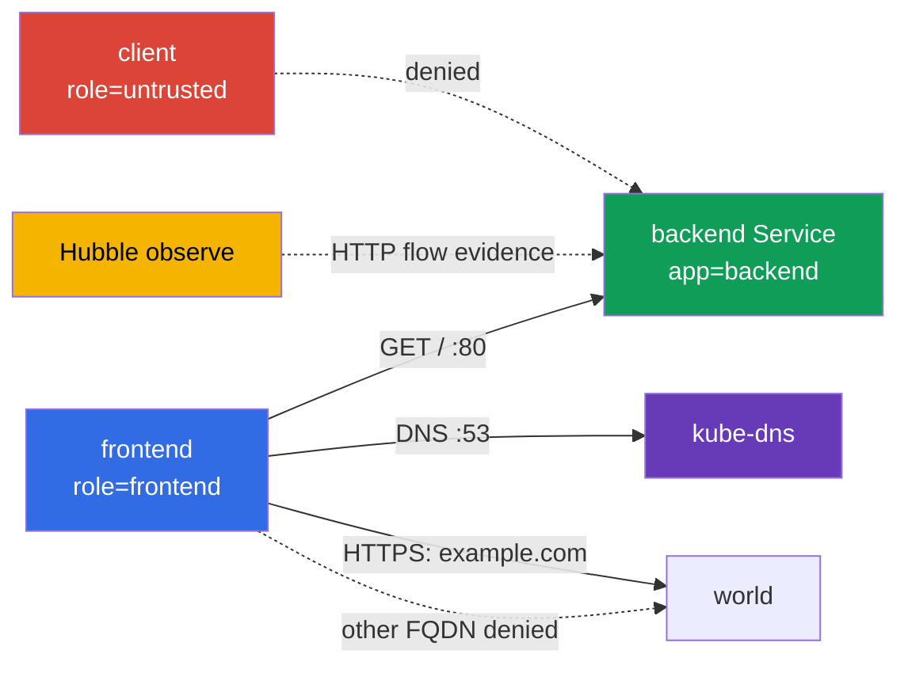

[Eng version](README.MD) · [Versión en español](README_ES.MD) · [Version française](README_FR.MD) · [Deutsche Version](README_DE.MD) · [ქართული ვერსია](README_GE.MD) · [繁體中文版](README_TW.MD) · [日本語版](README_JP.MD)

# Лаба 102 - CiliumNetworkPolicy: L3/L4/L7, DNS-aware egress и Hubble

## Описание

В этой лабораторной работе вы настраиваете CiliumNetworkPolicy для маленького сервиса и
доказываете фактическое поведение сети. Задача не в том, чтобы написать похожий YAML, а в
том, чтобы по labels сузить L3/L4-доступ, затем добавить L7-фильтр HTTP, ограничить egress
по FQDN и сохранить evidence из Hubble. Базовые объекты Kubernetes здесь служат только
учебным стендом; предмет работы - возможности Cilium.

## Цель

Закрепить материал [главы 06. Cilium NetworkPolicy](../../course/06/ru.md):

- `CiliumNetworkPolicy`, `endpointSelector` и identity по labels;
- L3/L4-ограничение source и TCP-порта;
- L7 HTTP-правила для метода и path;
- DNS-aware egress через `toFQDNs` с отдельным правилом DNS;
- проверку разрешённых и запрещённых потоков через Hubble.

## Что мы создаём и зачем

| Объект | Назначение | Зачем нужен |
|---|---|---|
| Namespace `cks-102` | изолирует учебный стенд | политика и результаты не смешиваются с системными workload |
| Pod `backend` + Service `backend` | HTTP endpoint на TCP/80 | target для L3/L4 и L7 ingress policy |
| Pod `frontend` | доверенный клиент | единственный source, которому разрешён backend и внешний FQDN |
| Pod `client` | недоверенный клиент | доказывает, что allow по label не равен доступу для всех |
| CiliumNetworkPolicy `backend-policy` | ingress policy | сначала L3/L4, затем тот же объект уточняется до L7 |
| CiliumNetworkPolicy `frontend-fqdn` | egress policy | разрешает DNS и только `example.com` |
| Hubble Relay + CLI | наблюдаемость | сохраняет наблюдаемый HTTP-flow в артефакт |



## Инфраструктура

| Компонент | Описание |
|---|---|
| `vpc` | отдельная VPC `10.102.0.0/16` с двумя публичными подсетями |
| `ssh-keys` | ключи для доступа к виртуальным машинам |
| `k8s-1` | одноузловой kubeadm-кластер Kubernetes `1.36.0`, containerd и Cilium с kube-proxy replacement |
| `worker` | рабочая машина с `kubectl`, Cilium CLI, Hubble CLI и `check_result` |
| Hubble Relay | включается стартовым `worker.sh`; для CLI нужен локальный `cilium hubble port-forward` |

## Развёртывание

```bash
TASK=102 make run_cks_task
```

Подключитесь по SSH к рабочей машине. Контекст `cluster1-admin@cluster1` уже настроен.

```bash
kubectl config current-context
cilium status --wait
```

## Задания

---
| **1** | **Учебный namespace и endpoints** |
| :---: | :--- |
| Что делаем | Создайте namespace `cks-102`. В нём создайте: Pod `backend` с label `app=backend` и образом `nginx:1.27-alpine`; Service `backend`, выбирающий этот Pod на порту `80`; Pod `frontend` с label `role=frontend` и образом `curlimages/curl:8.10.1`; Pod `client` с label `role=untrusted` и тем же образом. У client-подов команда должна удерживать контейнер запущенным, например `sleep 3600`. Дождитесь Ready. |
| Критерии приёмки | - существует namespace `cks-102`;<br>- существуют Pods `backend`, `frontend`, `client` с указанными labels;<br>- Service `backend` имеет порт `80`. |
---
| **2** | **Cilium L3/L4: только frontend к backend:80** |
| :---: | :--- |
| Что делаем | В `cks-102` создайте `CiliumNetworkPolicy` с именем `backend-policy`. Она должна выбирать `app=backend` и разрешать ingress только от endpoint с `role=frontend` на TCP-порт `80`. Не добавляйте широкого разрешения для всех endpoint. Проверьте `curl` из `frontend` к `http://backend/` и из `client` к тому же адресу; сохраните результаты в `/var/work/tests/artifacts/2/l3-l4.txt`. |
| Критерии приёмки | - `backend-policy` выбирает `app=backend`, source `role=frontend`, TCP `80`;<br>- запрос из `frontend` получает `200`;<br>- запрос из `client` не получает `200`;<br>- артефакт существует. |
---
| **3** | **Cilium L7 HTTP: только GET /** |
| :---: | :--- |
| Что делаем | Измените **тот же** `backend-policy`: для TCP/80 разрешите от `frontend` только HTTP `GET` с path `/`. Не оставляйте отдельное широкое L4 allow-правило, иначе L7-фильтр не будет ограничивать POST. Запишите HTTP-коды GET и POST в `/var/work/tests/artifacts/3/l7-http.txt`. |
| Критерии приёмки | - у правила TCP/80 есть `rules.http` с `method: GET` и `path: /`;<br>- `GET http://backend/` из `frontend` возвращает `200`;<br>- `POST http://backend/` из `frontend` возвращает `403`;<br>- артефакт существует. |
---
| **4** | **DNS-aware egress: разрешён только один FQDN** |
| :---: | :--- |
| Что делаем | Создайте `CiliumNetworkPolicy` `frontend-fqdn`, выбирающую `role=frontend`. Разрешите ей DNS к `kube-dns` на порту `53` и egress только через `toFQDNs` к `example.com`. Проверьте HTTPS-запрос к `https://example.com/` и к `https://www.google.com/`; сохраните результаты в `/var/work/tests/artifacts/4/fqdn.txt`. |
| Критерии приёмки | - политика содержит `toFQDNs.matchName: example.com`;<br>- DNS к `kube-dns` разрешён отдельным правилом;<br>- `example.com` возвращает 2xx/3xx;<br>- `www.google.com` не возвращает 2xx/3xx;<br>- артефакт существует. |
---
| **5** | **Hubble: evidence HTTP-потоков** |
| :---: | :--- |
| Что делаем | На worker запустите `cilium hubble port-forward` в фоне, затем `hubble observe --namespace cks-102 --protocol http --output json --follow` и перенаправьте его в `/var/work/tests/artifacts/5/hubble-observe.json`. Пока наблюдение активно, выполните разрешённый GET и запрещённый POST из `frontend`, после чего корректно остановите процессы. |
| Критерии приёмки | - файл `/var/work/tests/artifacts/5/hubble-observe.json` не пуст;<br>- в нём есть как минимум один Hubble flow. |
---

## Проверка результата

На worker запустите:

```bash
check_result
```

Проверка выполняет пять независимых заданий, записывает собственные сетевые проверки в
`/var/work/tests/artifacts/2/` - `/var/work/tests/artifacts/4/` и проверяет Hubble evidence
из задания 5.

## Решение

Эталонное решение: [worker/files/solutions/1_RU.MD](worker/files/solutions/1_RU.MD).

## Удаление

```bash
TASK=102 make delete_cks_task
```
