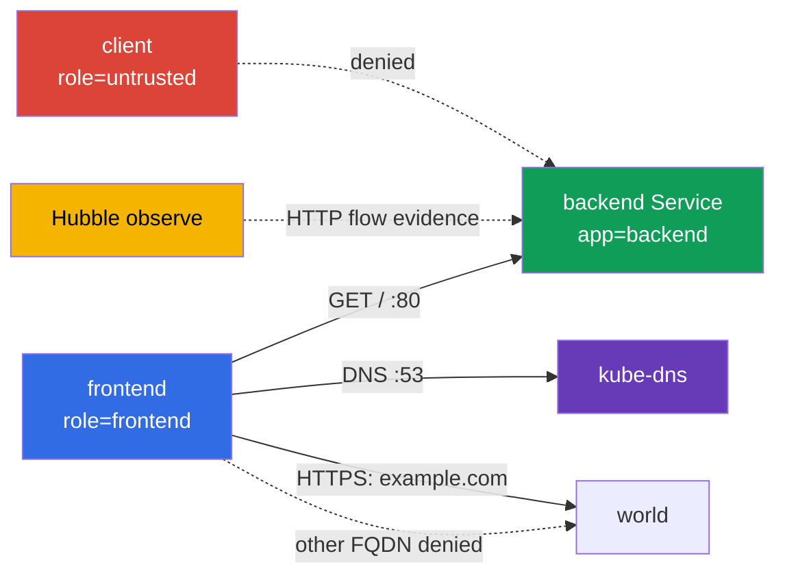

[Eng version](README.MD) · [Versión en español](README_ES.MD) · [Version française](README_FR.MD) · [Deutsche Version](README_DE.MD) · [ქართული ვერსია](README_GE.MD) · [繁體中文版](README_TW.MD) · [日本語版](README_JP.MD)

# Лаба 102 - CiliumNetworkPolicy: L3/L4/L7, DNS-aware egress и Hubble

## Описание

В этой лабораторной работе вы настраиваете CiliumNetworkPolicy для маленького сервиса и
доказываете фактическое поведение сети. Задача не в том, чтобы написать похожий YAML, а в
том, чтобы по labels сузить L3/L4-доступ, затем добавить L7-фильтр HTTP, ограничить egress
по FQDN и сохранить evidence из Hubble. Базовые объекты Kubernetes здесь служат только
учебным стендом; предмет работы - возможности Cilium.

## Цель

Закрепить материал [главы 06. Cilium NetworkPolicy](../../course/06/ru.md):

- `CiliumNetworkPolicy`, `endpointSelector` и identity по labels;
- L3/L4-ограничение source и TCP-порта;
- L7 HTTP-правила для метода и path;
- DNS-aware egress через `toFQDNs` с отдельным правилом DNS;
- проверку разрешённых и запрещённых потоков через Hubble.

## Проверьте себя перед стартом

<details>
<summary>1. Чем L3/L4 policy в Cilium принципиально отличается от L7 policy на одном и том же правиле?</summary>

L3/L4 разрешает или запрещает соединение целиком по source/destination identity и порту - Cilium не смотрит внутрь трафика. L7-правило (`rules.http`) добавляется на тот же TCP-порт, но проверяет содержимое запроса (метод, path) - соединение может быть разрешено на L4, но конкретный HTTP-запрос всё равно получит `403`, если не совпадёт с L7-правилом. Если оставить отдельное широкое L4-правило без L7, оно "выключит" фильтрацию L7 для этого порта.
</details>

<details>
<summary>2. Почему `toFQDNs` egress-правило не работает без отдельного правила на DNS?</summary>

`toFQDNs` строится на том, что Cilium **видит DNS-ответ** и запоминает, каким IP соответствует разрешённое имя (`example.com`). Если DNS-запрос к `kube-dns` заблокирован, Cilium никогда не узнает актуальный IP для FQDN и не сможет построить allow-правило для egress к нему - весь трафик к этому FQDN будет заблокирован, даже если сама FQDN-политика написана верно.
</details>

<details>
<summary>3. Почему для доказательства L7-denial через Hubble важно captur'ить трафик именно во время теста, а не после?</summary>

`hubble observe --follow`, запущенный до запроса, — удобный режим для controlled capture: он снижает риск, что нужный flow выйдет из retention buffer до сохранения. Это не единственный способ получить валидное evidence: обычный `hubble observe` может прочитать уже сохранённые события в пределах retention window (например, с корректным `--since`), а вывод можно экспортировать в файл. В любом варианте evidence должно однозначно связывать временное окно, source/destination, HTTP method/path и verdict с конкретными GET/POST test case.
</details>

## Что мы создаём и зачем

| Объект | Назначение | Зачем нужен |
|---|---|---|
| Namespace `cks-102` | изолирует учебный стенд | политика и результаты не смешиваются с системными workload |
| Pod `backend` + Service `backend` | HTTP endpoint на TCP/80 | target для L3/L4 и L7 ingress policy |
| Pod `frontend` | доверенный клиент | единственный source, которому разрешён backend и внешний FQDN |
| Pod `client` | недоверенный клиент | доказывает, что allow по label не равен доступу для всех |
| CiliumNetworkPolicy `backend-policy` | ingress policy | сначала L3/L4, затем тот же объект уточняется до L7 |
| CiliumNetworkPolicy `frontend-fqdn` | egress policy | разрешает DNS и только `example.com` |
| Hubble Relay + CLI | наблюдаемость | сохраняет наблюдаемый HTTP-flow в артефакт |



## Инфраструктура

| Компонент | Описание |
|---|---|
| `vpc` | отдельная VPC `10.102.0.0/16` с двумя публичными подсетями |
| `ssh-keys` | ключи для доступа к виртуальным машинам |
| `k8s-1` | одноузловой kubeadm-кластер Kubernetes `1.36.0`, containerd и Cilium с kube-proxy replacement |
| `worker` | рабочая машина с `kubectl`, Cilium CLI, Hubble CLI и `check_result` |
| Hubble Relay | включается стартовым `worker.sh`; для CLI нужен локальный `cilium hubble port-forward` |

## Развёртывание

```bash
TASK=102 make run_cks_task
```

Подключитесь по SSH к рабочей машине. Контекст `cluster1-admin@cluster1` уже настроен.

```bash
kubectl config current-context
cilium status --wait
```

## Задания

---
| **1** | **Учебный namespace и endpoints** |
| :---: | :--- |
| Что делаем | Создайте namespace `cks-102`. В нём создайте: Pod `backend` с label `app=backend` и образом `nginx:1.27-alpine`; Service `backend`, выбирающий этот Pod на порту `80`; Pod `frontend` с label `role=frontend` и образом `curlimages/curl:8.10.1`; Pod `client` с label `role=untrusted` и тем же образом. У client-подов команда должна удерживать контейнер запущенным, например `sleep 3600`. Дождитесь Ready. |
| Критерии приёмки | - существует namespace `cks-102`;<br/>- существуют Pods `backend`, `frontend`, `client` с указанными labels;<br/>- Service `backend` имеет порт `80`. |

<details>
<summary>💡 Подсказка к заданию 1</summary>

Обратите внимание, что метки разные по стилю: `backend` использует `app=backend`, а `frontend`/`client` используют `role=frontend`/`role=untrusted` - это сделано намеренно, чтобы последующие CiliumNetworkPolicy явно указывали, по какому именно label они матчат identity. Перепутать `app`/`role` для одного из Pod - частая причина, почему policy "не работает".
</details>
---
| **2** | **Cilium L3/L4: только frontend к backend:80** |
| :---: | :--- |
| Что делаем | В `cks-102` создайте `CiliumNetworkPolicy` с именем `backend-policy`. Она должна выбирать `app=backend` и разрешать ingress только от endpoint с `role=frontend` на TCP-порт `80`. Не добавляйте широкого разрешения для всех endpoint.<br/><br/>**Обязательный baseline до policy:**<br/>1. До применения `backend-policy` убедитесь, что и `frontend`, и `client` реально достигают `http://backend/`: зафиксируйте отдельно `CURL_EXIT` и `HTTPCODE` для каждого.<br/>2. Baseline считается доказанным только при `CURL_EXIT:0` и реальном HTTP status `1xx–5xx` для обоих Pod.<br/><br/>**После этого** примените `backend-policy` и повторите те же probes из `frontend` и `client`; сохраните все результаты (baseline и после policy, оба Pod, оба CURL_EXIT/HTTPCODE) в `/var/work/tests/artifacts/2/l3-l4.txt`. |
| Критерии приёмки | - `backend-policy` выбирает `app=backend`, source `role=frontend`, TCP `80`;<br/>- до policy: `frontend` и `client` оба реально достигают backend (`CURL_EXIT:0` + HTTP `1xx-5xx`);<br/>- после policy: `frontend` получает `200`;<br/>- после policy: `client` получает именно transport-level deny - `HTTPCODE:000` и curl network/timeout exit code (`7`/`28`), а не просто «не 200»;<br/>- артефакт содержит baseline и after-policy результаты для обоих Pod. |

<details>
<summary>💡 Подсказка к заданию 2</summary>

`endpointSelector.matchLabels` в самой policy должен матчить `backend` (`app: backend`), а `fromEndpoints[].matchLabels` внутри `ingress` должен матчить `frontend` (`role: frontend`) - это два РАЗНЫХ селектора в одном объекте, легко перепутать местами. Проверьте себя через `kubectl exec` в `client`: после policy запрос должен получить именно `HTTPCODE:000` и exit `7`/`28` - реальный HTTP-ответ с любым кодом (`403`, `404`...) означает, что сетевой путь всё ещё существует и L3/L4 deny не доказан.
</details>
---
| **3** | **Cilium L7 HTTP: только GET /** |
| :---: | :--- |
| Что делаем | Измените **тот же** `backend-policy`: для TCP/80 разрешите от `frontend` только HTTP `GET` с path `/`. Не оставляйте отдельное широкое L4 allow-правило, иначе L7-фильтр не будет ограничивать POST.<br/><br/>**Обязательный baseline до L7-правила:** при ещё действующей L3/L4-only policy из задания 2 убедитесь, что `frontend -> backend GET /` получает HTTP response, и `frontend -> backend POST /` также достигает backend и получает какой-либо реальный HTTP status (`1xx-5xx`; конкретный nginx status не фиксируется как универсальное условие).<br/><br/>После замены правила на L7 повторите оба запроса. Запишите baseline и after-policy HTTP-коды GET и POST в `/var/work/tests/artifacts/3/l7-http.txt`. |
| Критерии приёмки | - у правила TCP/80 есть `rules.http` с `method: GET` и `path: /`;<br/>- baseline (L4-only): `GET /` и `POST /` оба реально достигают backend;<br/>- после L7: `GET http://backend/` из `frontend` возвращает `200`;<br/>- после L7: `POST http://backend/` из `frontend` возвращает `403`;<br/>- артефакт содержит baseline и after-policy evidence. |

<details>
<summary>💡 Подсказка к заданию 3</summary>

Самая частая ошибка этого задания - оставить исходное L4-only правило из задания 2 РЯДОМ с новым L7-правилом, вместо того чтобы заменить его. Если в policy одновременно есть "разрешить TCP/80 без L7-фильтра" и "разрешить TCP/80 с L7 GET /", Cilium применит более широкое разрешение, и `POST` пройдёт, а должен получить `403`. Убедитесь, что `toPorts.rules.http` находится ВНУТРИ того же правила, что и `toPorts.ports` с портом 80, а не в отдельном дублирующем правиле. Baseline с L4-only policy до этого задания существует именно для того, чтобы доказать: до L7 POST реально проходил на backend, а после L7 его отклоняет именно L7-фильтр (`403`), а не какая-то посторонняя сетевая проблема.
</details>
---
| **4** | **DNS-aware egress: разрешён только один FQDN** |
| :---: | :--- |
| Что делаем | Создайте `CiliumNetworkPolicy` `frontend-fqdn`, выбирающую `role=frontend`. Разрешите ей DNS к `kube-dns` на порту `53` **через L7 DNS proxy rule** `toPorts.rules.dns` (например, `matchPattern: "*"`): Cilium по этому DNS-трафику формирует FQDN-to-IP mapping для `toFQDNs`. Разрешите egress через `toFQDNs` только к `example.com` и только на TCP `443`. **Также сохраните обязательный внутренний поток из заданий 2-3**: добавьте отдельное правило egress к `backend` (`app=backend`) только на TCP `80` - без него `frontend-fqdn` включает egress default-deny для `frontend`, и уже разрешённый `frontend -> backend:80` из задания 2-3 будет заблокирован.<br/><br/>**Обязательный preflight до `frontend-fqdn`:** до применения policy подтвердите, что DNS resolution из `frontend` работает, и попытайтесь обратиться к `https://example.com/`, `http://example.com:80/` и `https://www.google.com/`; сохраните эти baseline-результаты.<br/><br/>После применения `frontend-fqdn` повторите те же три проверки; сохраните все baseline и after-policy результаты в `/var/work/tests/artifacts/4/fqdn.txt`. Если конкретный внешний endpoint был недоступен уже на baseline, его after-policy результат считается `inconclusive`, а не доказательством policy deny - структурная проверка policy при этом остаётся обязательной. Дополнительно подтвердите regression-check: `frontend -> backend GET /` должен вернуть `200`, `frontend -> backend POST /` должен вернуть `403` (L7-policy из задания 3 должна продолжать работать). |
| Критерии приёмки | - preflight выполнен до policy и сохранён;<br/>- политика содержит `toFQDNs.matchName: example.com` и `toPorts` с TCP `443`;<br/>- DNS к `kube-dns` разрешён отдельным правилом с `rules.dns`;<br/>- внутренний egress к `backend` разрешён отдельным правилом только на TCP `80`, без чего задание 3 регрессирует;<br/>- внешний egress разрешён только к `example.com:443`; другие внешние destinations/ports не разрешаются;<br/>- после применения `frontend-fqdn` `frontend -> backend GET /` всё ещё возвращает `200`, а `POST /` - `403`;<br/>- артефакт `fqdn.txt` содержит baseline и after-policy результаты.<br/>- Сетевые проверки к `example.com`/`www.google.com` сохраняются в артефакт как diagnostic evidence, но **не являются** обязательным условием PASS: IANA прямо указывает, что HTTP-сервис example-доменов предоставляется best-effort и не предназначен как testing endpoint для software, поэтому их временная недоступность не должна засчитываться как ошибка policy - однако именно baseline позволяет отличить «endpoint был недоступен изначально» от «policy заблокировала доступный endpoint». |

<details>
<summary>💡 Подсказка к заданию 4</summary>

Три egress-правила нужны в одном объекте policy: (1) DNS к kube-dns с `rules.dns.matchPattern: "*"`, БЕЗ этого Cilium не сможет отследить, какой IP соответствует `example.com`; (2) внутренний `backend` (`app=backend`) на TCP/80 - без этого правила egress default-deny для `frontend` заблокирует уже разрешённый поток из заданий 2-3, и Hubble evidence в задании 5 станет невозможным; (3) `toFQDNs` с `matchName: example.com` и `toPorts` строго на 443. Если после apply первый запрос к `example.com` не проходит - подождите несколько секунд, DNS resolution и FQDN mapping в Cilium не мгновенные.
</details>
---
| **5** | **Hubble: evidence HTTP-потоков** |
| :---: | :--- |
| Что делаем | Зафиксируйте UTC-время начала контролируемого теста. На worker запустите `cilium hubble port-forward`, затем соберите Hubble evidence с фильтрами `--from-pod cks-102/frontend`, `--to-pod cks-102/backend`, `--protocol http`, `--since <время-начала>` и `--output json` в `/var/work/tests/artifacts/5/hubble-observe.json`. Рекомендуемый для controlled capture вариант — добавить `--follow` и начать наблюдение до запросов; альтернативно можно после теста выгрузить уже сохранённые события из retention buffer с тем же точным временным окном. В обоих случаях evidence должно содержать ровно два test case: разрешённый `GET /` и запрещённый `POST /` из `frontend`; сохраните также время и описание test case в `test-window.txt`. |
| Критерии приёмки | - оба артефакта непусты;<br/>- JSON содержит flow именно `cks-102/frontend` → `cks-102/backend` для `GET /` с verdict `FORWARDED`;<br/>- тот же source/destination содержит `POST /` с verdict `DROPPED`;<br/>- generic flow другого Pod или без соответствующего метода не засчитывается. |

<details>
<summary>💡 Подсказка к заданию 5</summary>

Для controlled capture рекомендуется запустить `hubble observe --follow` В ФОНЕ (`&`) ДО `GET`/`POST`: так меньше риск потерять flow до сохранения. Но `--follow` не является единственным валидным вариантом: если события ещё в retention buffer, их можно после запросов выгрузить обычным `hubble observe` с тем же точным `--since`. Формат `test-window.txt` важен для проверки: запишите `source=cks-102/frontend destination=cks-102/backend` и `allowed=GET / denied=POST /` именно в этом виде.
</details>
---

## Проверка результата

На worker запустите:

```bash
check_result
```

Проверка выполняет пять независимых заданий. Артефакты заданий 2-5 создаёт сам студент.
`check_result` не перезаписывает student artifacts: собственные диагностические runtime-
проверки checker сохраняет отдельно в `/var/work/tests/checker-artifacts/`.

## Решение

Эталонное решение: [worker/files/solutions/1_RU.MD](worker/files/solutions/1_RU.MD).

## Удаление

```bash
TASK=102 make delete_cks_task
```
