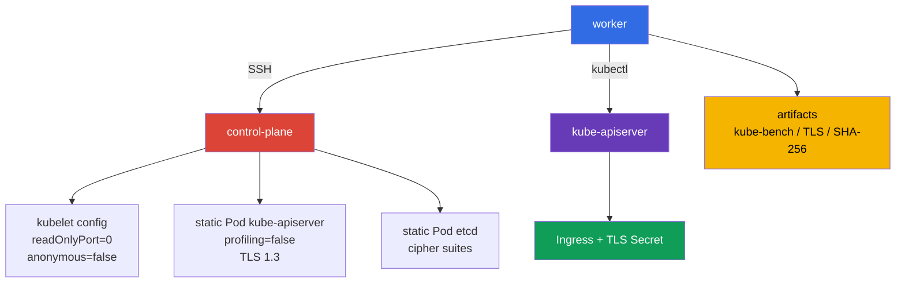

[Eng version](README.MD) · [Versión en español](README_ES.MD) · [Version française](README_FR.MD) · [Deutsche Version](README_DE.MD) · [ქართული ვერსია](README_GE.MD) · [繁體中文版](README_TW.MD) · [日本語版](README_JP.MD)

# Лаба 103 - CIS/kube-bench, Secure Ingress TLS и проверка бинарников

## Описание

В этой лабораторной работе вы настраиваете одноузловой Kubernetes-кластер как инженер
по безопасности: фиксируете исходную картину CIS Benchmark, исправляете небезопасные
параметры kubelet и kube-apiserver, публикуете Ingress только по TLS, ограничиваете TLS
control plane и подтверждаете целостность установленных Kubernetes-бинарников.

Это не повторение базовой настройки Kubernetes из CKA. Здесь важны места применения
настроек: `KubeletConfiguration`, static Pod manifests control plane, TLS-параметры etcd
и проверяемые артефакты работы. Работайте с узлом control plane через SSH-имя
`control-plane`, подготовленное на worker.

## Цель

Закрепить материал глав курса:

- [Глава 07. CIS Benchmark и kube-bench](../../course/07/ru.md)
- [Глава 08. Secure Ingress с TLS](../../course/08/ru.md)
- [Глава 09. Небезопасные аргументы компонентов и проверка бинарников](../../course/09/ru.md)

## Проверьте себя перед стартом

<details>
<summary>1. Почему запуск kube-bench профилем `cis-1.12` на Kubernetes 1.36 нельзя называть authoritative CIS compliance?</summary>

Пиннутая в этой лабе версия `kube-bench 0.16.0` не содержит профиля для 1.36 вообще - её встроенный version mapping доходит только до `"1.34": "cis-1.12"` (самый новый доступный профиль). Явно указывая `--benchmark cis-1.12` на кластере 1.36, мы принудительно используем ближайший существующий профиль как approximation: часть проверок может быть неактуальна для более новой версии, а новые security-relevant параметры именно для 1.36 этот профиль ещё не покрывает. Это ценный практический сигнал, но не formal compliance statement для версии 1.36.
</details>

<details>
<summary>2. Почему `--tls-cipher-suites` на kube-apiserver не настраивает шифры именно для TLS 1.3?</summary>

В Go (на котором написан kube-apiserver) флаг `--tls-cipher-suites` управляет только cipher suites для TLS версий ≤ 1.2. Для TLS 1.3 Go сам выбирает набор шифров из fixed, hardcoded списка - конфигурировать их через этот флаг нельзя. Поэтому реальную защиту здесь даёт `--tls-min-version=VersionTLS13` (запрещает более старые протоколы целиком), а `--tls-cipher-suites` актуален там, где TLS 1.2 всё ещё допускается (например, etcd в этой лабе).
</details>

<details>
<summary>3. Почему нельзя использовать хеш, вычисленный из самого проверяемого файла, как эталон для SHA-256 verification?</summary>

Если вычислить SHA-256 файла и сравнить с самим собой, проверка всегда пройдёт - даже если файл был подменён на что-то вредоносное. Эталонная checksum должна быть получена из независимого, доверенного источника - официальной страницы релиза Kubernetes, а не из локального файла, который вы проверяете.
</details>

## Что мы создаём и зачем

| Объект или артефакт | Что это | Зачем в этой лабе |
|---|---|---|
| Отчёт `kube-bench` | снимок CIS-проверок control-plane | фиксирует исходные рекомендации и служит основанием для hardening |
| Kubelet configuration | настройки kubelet на ноде | отключает read-only endpoint и anonymous access |
| Static Pod manifest apiserver | декларация kube-apiserver | отключает profiling и задаёт строгий TLS |
| TLS Secret и Ingress | TLS termination для приложения | исключает передачу HTTP-трафика к Ingress без сертификата |
| Static Pod manifest etcd | декларация локального etcd | ограничивает допустимые TLS cipher suites |
| SHA-256 артефакт | результат сверки `kubelet` и `kubectl` | подтверждает целостность бинарников относительно хешей релиза |



## Инфраструктура

Окружение разворачивается в AWS (`eu-central-1`) через Terragrunt.

| Компонент | Описание |
|---|---|
| `vpc` | VPC `10.103.0.0/16` с публичными подсетями |
| `ssh-keys` | SSH-ключи для доступа к нодам |
| `k8s-1` | Одноузловой Kubernetes `1.36.0` (kubeadm), containerd и Calico |
| `worker` | Рабочая машина с `kubectl`, `kube-bench`, SSH-доступом и `check_result` |

> **Версия и экзамен.** На 2026-09-06 официальный CKS exam исходит из Kubernetes `v1.35`. Эта лаба использует `1.36.0`, поэтому всё, что относится к этой версии, является forward-looking учебным сценарием, а не заявлением о текущей экзаменационной версии.

Control-plane разтаинчен, поэтому при необходимости на нём можно запустить учебный Pod.
Для заданий 2, 3 и 5 static Pods автоматически пересоздаются kubelet после сохранения
изменённого манифеста или конфигурации. Не удаляйте control-plane Pods вручную.

## Развёртывание

```bash
TASK=103 make run_cks_task
```

Подключитесь к worker по SSH. Контекст уже настроен:

```bash
kubectl config use-context cluster1-admin@cluster1
time_left
check_result
```

Адрес control-plane можно получить и проверить так:

```bash
kubectl get nodes -o wide
ssh control-plane sudo hostname
```

## Задания

---
| **1** | **Отчёт CIS Benchmark** |
| :---: | :--- |
| Что делаем | На узле `control-plane` прогоните `kube-bench` для Kubernetes `1.36.0`. Сохраните полный evidence в `/var/work/tests/artifacts/1/kube-bench.txt`: `kubernetes_version`, `kube_bench_version`, выбранный `benchmark`, `mapping_status`, затем сам отчёт. Установленный на worker `kube-bench` можно скопировать на узел; проверяться должен именно узел. Встроенный в пиннутый `kube-bench 0.16.0` version mapping заканчивается записью `"1.34": "cis-1.12"` - более новых профилей (включая какой-либо профиль под 1.35/1.36) в этой версии нет вовсе. Поэтому запускайте `--benchmark cis-1.12` явно и помечайте результат на `1.36` как `forced-approximate`, а не authoritative compliance. |
| Критерии приёмки | - evidence содержит все четыре version/mapping поля;<br/>- `mapping_status=forced-approximate` явно объясняет отсутствие официального покрытия `1.36`;<br/>- в отчёте есть `[PASS]`, `[WARN]` или `[FAIL]`;<br/>- текст не выдаёт результат за authoritative CIS compliance для Kubernetes `1.36`. |

<details>
<summary>💡 Подсказка к заданию 1</summary>

Проверка ожидает четыре конкретных строки-маркера в начале файла: `kubernetes_version=v1.36.x`, `kube_bench_version=v0.16.0`, `benchmark=cis-1.12`, `mapping_status=forced-approximate` - это не декоративный текст, а формат, который тест ищет буквально. Запускайте `kube-bench` на самом control-plane node, а не удалённо с worker - у kube-bench нет режима "проверить чужую ноду по SSH".
</details>
---
| **2** | **Hardening kubelet: read-only port и anonymous auth** |
| :---: | :--- |
| Что делаем | На control-plane исправьте kubelet configuration: установите `readOnlyPort: 0` и `authentication.anonymous.enabled: false` в `/var/lib/kubelet/config.yaml`. Перезапустите kubelet и дождитесь готовности ноды. Не подменяйте проверку текстовым артефактом: настройки должны быть применены на ноде. |
| Критерии приёмки | - в действующей kubelet configuration есть `readOnlyPort: 0`;<br/>- anonymous authentication kubelet отключён;<br/>- нода `Ready` после перезапуска. |

<details>
<summary>💡 Подсказка к заданию 2</summary>

`authentication.anonymous.enabled: false` находится ВЛОЖЕННО, под ключом `authentication.anonymous`, а не как отдельное top-level поле `anonymous: false` - проверьте отступы YAML внимательно. После правки config.yaml нужно перезапустить сам сервис kubelet (`systemctl restart kubelet`), редактирование файла само по себе не применяет изменения к работающему процессу.
</details>
---
| **3** | **Hardening kube-apiserver: отключить profiling** |
| :---: | :--- |
| Что делаем | В static Pod manifest `/etc/kubernetes/manifests/kube-apiserver.yaml` добавьте `--profiling=false`. Дождитесь пересоздания kube-apiserver и убедитесь, что API готов. |
| Критерии приёмки | - в manifest kube-apiserver есть `--profiling=false`;<br/>- `kubectl get --raw='/readyz'` возвращает успешный результат;<br/>- static Pod kube-apiserver запущен. |

<details>
<summary>💡 Подсказка к заданию 3</summary>

Не редактируйте Pod через `kubectl edit` - это static Pod, kubelet управляет им напрямую из файла манифеста на диске и перезапишет любое изменение через API обратно. Добавьте флаг прямо в YAML-файл на ноде и подождите: kubelet заметит изменение файла не мгновенно.
</details>
---
| **4** | **Secure Ingress с TLS** |
| :---: | :--- |
| Что делаем | Создайте namespace `cks-103` и TLS-Secret `secure-ingress-tls` типа `kubernetes.io/tls` для хоста `secure.cks.local`. Создайте Service `secure-app` и Ingress `secure-ingress` с `ingressClassName: nginx`, TLS-секцией для этого хоста и ссылкой на Secret. Включите аннотацию `nginx.ingress.kubernetes.io/ssl-redirect: "true"`. Для проверки сертификата допустим самоподписанный сертификат. NGINX Ingress Controller здесь - экзаменационный fixture; сам проект retired (см. [главу 08](../../course/08/ru.md)), навык же `spec.tls` + TLS Secret универсален. |
| Критерии приёмки | - Secret `secure-ingress-tls` в `cks-103` имеет тип `kubernetes.io/tls` и поля `tls.crt`, `tls.key`;<br/>- Ingress `secure-ingress` содержит `spec.tls`, хост `secure.cks.local` и ссылку на `secure-ingress-tls`;<br/>- Ingress направляет `HTTPS`-хост на Service `secure-app`. |

<details>
<summary>💡 Подсказка к заданию 4</summary>

Создавайте TLS Secret через `kubectl create secret tls secure-ingress-tls --cert=... --key=...` - это автоматически задаёт правильный `type: kubernetes.io/tls` и корректно кодирует данные в base64. Если создать Secret вручную с типом `Opaque` и ключами `tls.crt`/`tls.key`, тест на `type` не пройдёт, даже если данные технически валидны.
</details>
---
| **5** | **TLS hardening control plane** |
| :---: | :--- |
| Что делаем | В `/etc/kubernetes/manifests/kube-apiserver.yaml` задайте `--tls-min-version=VersionTLS13` и `--tls-cipher-suites=TLS_ECDHE_RSA_WITH_AES_128_GCM_SHA256,TLS_ECDHE_RSA_WITH_AES_256_GCM_SHA384`. В `/etc/kubernetes/manifests/etcd.yaml` задайте `--cipher-suites` с тем же набором. После пересоздания компонентов подтвердите, что согласуется `TLSv1.3` (`openssl s_client -tls1_3`) и что `TLSv1.2` отклоняется (`openssl s_client -tls1_2` завершается ошибкой handshake), и сохраните вывод в `/var/work/tests/artifacts/5/tls13.txt`. Важно понимать семантику: в Go флаг `--tls-cipher-suites` действует только для TLS ≤ 1.2, а при `--tls-min-version=VersionTLS13` конкретные TLS 1.3 cipher suites этим флагом не настраиваются (Go выбирает их сам). Поэтому для kube-apiserver фактическую защиту здесь даёт именно min-version 1.3; cipher-suites значимы там, где допускается TLS 1.2 (например, для etcd). |
| Критерии приёмки | - оба требуемых TLS-флага есть в manifest kube-apiserver;<br/>- cipher suites есть в manifest etcd;<br/>- kube-apiserver и etcd здоровы;<br/>- артефакт TLS содержит подтверждение `TLSv1.3` и зафиксированный отказ TLS 1.2 (non-zero exit/handshake failure). |

<details>
<summary>💡 Подсказка к заданию 5</summary>

Флаг на etcd называется `--cipher-suites` (без `tls-` в начале) - это ДРУГОЕ имя флага по сравнению с `--tls-cipher-suites` на kube-apiserver. Перепутать имена флагов - частая ошибка. Проверьте себя двумя отдельными командами `openssl s_client -connect <host>:6443 -tls1_3` (должен успешно соединиться) и `-tls1_2` (должен завершиться ошибкой handshake) - обе на порт kube-apiserver, а не etcd.
</details>
---
| **6** | **Проверка целостности kubelet и kubectl** |
| :---: | :--- |
| Что делаем | Сверьте SHA-256 установленных `kubelet` на control-plane и `kubectl` на worker с опубликованными checksum Kubernetes `v1.36.0`. Сохраните команды и итог `sha256sum -c` в `/var/work/tests/artifacts/6/binaries.sha256.txt`. Не используйте хеши, вычисленные из проверяемого файла, как эталон. |
| Критерии приёмки | - артефакт существует;<br/>- в нём есть отдельные успешные результаты для `kubelet` и `kubectl` (`OK`);<br/>- эталонные суммы получены из официального release `v1.36.0`. |

<details>
<summary>💡 Подсказка к заданию 6</summary>

Скачайте официальный файл `kubelet.sha256`/`kubectl.sha256` с `https://dl.k8s.io/v1.36.0/bin/linux/amd64/` (или соответствующей платформы) и используйте `sha256sum -c` с этим файлом против реального установленного бинарника - именно вывод этой команды (`kubelet: OK`, `kubectl: OK`) и нужен в артефакте, а не просто сам хеш.
</details>
---
| **7** | **Remediation cycle: от конкретного kube-bench FAIL до PASS** |
| :---: | :--- |
| Что делаем | Отчёт задания 1 - снимок текущего состояния; здесь нужно связать один конкретный проваленный тест с его исправлением. На control-plane запустите `kube-bench` именно с `--check 1.1.1` (права static Pod manifest kube-apiserver; лабораторная инфраструктура намеренно выставляет mode `0644`, `cis-1.12` требует `600` или строже) и сохраните вывод **до** исправления в `/var/work/tests/artifacts/7/before.txt` - он должен содержать `[FAIL]` для этого теста. Исправьте право доступа файла `/etc/kubernetes/manifests/kube-apiserver.yaml` (`chmod 600`), затем повторно запустите тот же `--check 1.1.1` и сохраните вывод в `/var/work/tests/artifacts/7/after.txt` - он должен содержать `[PASS]` без единого `[FAIL]` для этого check. |
| Критерии приёмки | `before.txt` содержит строку `[FAIL]` для check `1.1.1`; фактические права файла на ноде после исправления - ровно `600`; `after.txt` содержит `[PASS]` для check `1.1.1` и не содержит `[FAIL]` для него; kube-apiserver остаётся здоров после изменения (fs-only правка, компонент не пересоздаётся). |

<details>
<summary>💡 Подсказка к заданию 7</summary>

Это задание про порядок действий, а не только про итоговое состояние: сначала зафиксируйте `[FAIL]` (before.txt), только потом делайте `chmod 600`, потом снова прогоните проверку (after.txt). Если сделать `chmod` до сохранения before.txt, вы не получите нужный `[FAIL]` в первом артефакте. Изменение прав файла - это fs-only операция, kubelet не пересоздаёт static Pod из-за смены прав самого файла манифеста (в отличие от изменения его содержимого).
</details>
---

## Проверка результата

На worker запустите:

```bash
check_result
```

Проверка содержит Init и семь независимых заданий. Системные задания проверяются по
состоянию узла control plane через SSH и по артефактам, а не только по объектам API.

## Решение

Эталонное решение: [worker/files/solutions/1_RU.MD](worker/files/solutions/1_RU.MD).

## Удаление кластера и ресурсов

```bash
TASK=103 make delete_cks_task
```
