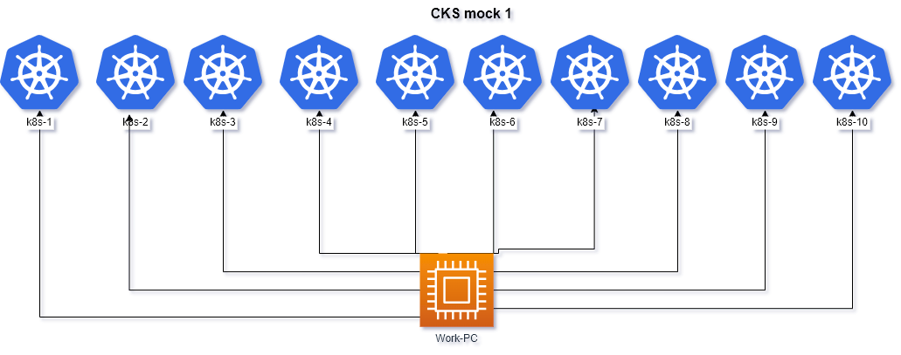

# Allowed resources
**Kubernetes Documentation:**

https://kubernetes.io/docs/ and their subdomains

https://kubernetes.io/blog/ and their subdomains

This includes all available language translations of these pages (e.g. https://kubernetes.io/zh/docs/)

**Tools:**

**Trivy** documentation https://aquasecurity.github.io/trivy/

**Falco** documentation https://falco.org/docs/
This includes all available language translations of these pages (e.g. https://falco.org/zh/docs/)

**App Armor**:
Documentation https://gitlab.com/apparmor/apparmor/-/wikis/Documentation

**Cilium** 
Documentation  https://docs.cilium.io/en/stable

**Istio**
Documentation https://istio.io/latest/docs/

**NGINX Ingress Controller**
Documentation  https://kubernetes.github.io/ingress-nginx/user-guide/nginx-configuration/

**Bom**
Documentation  https://kubernetes-sigs.github.io/bom/cli-reference/

**Etcd** 
documentation https://etcd.io/docs/

- run ``time_left`` on work pc to **check time**
- run ``check_result`` on work pc to **check result**

# Questions

|        **1**        | **Container Runtime Sandbox gVisor**                                                                                                                                                                                                                                                                                                                                                                                      |
| :-----------------: | :------------------------------------------------------------------------------------------------------------------------------------------------------------------------------------------------------------------------------------------------------------------------------------------------------------------------------------------------------------------------------------------------------------------------ |
|     Task weight     | 4%                                                                                                                                                                                                                                                                                                                                                                                                                        |
|       Cluster       | cluster1 (`kubectl config use-context cluster1-admin@cluster1`)                                                                                                                                                                                                                                                                                                                                                           |
| Acceptance criteria | - `runsc` was installed on `node2` (label `node_name=node_2`) - create `RuntimeClass` `gvisor` with handler `runsc` - add label `RuntimeClass=runsc` to `node2` - update pods in Namespace `team-purple` to use `RuntimeClass gvisor` - Make sure the Pod runs on node with `gvisor` - Write the `dmesg` output of the successfully started one of Pod into `/var/work/tests/artifacts/1/gvisor-dmesg`|
---
|       **2**         | **Image Vulnerability Scanning**                                                                                                                                                                                                                                                                                                                                                                                                                                                                                                                                                                                                                            |
|:-------------------:|:------------------------------------------------------------------------------------------------------------------------------------------------------------------------------------------------------------------------------------------------------------------------------------------------------------------------------------------------------------------------------------------------------------------------------------------------------------------------------------------------------------------------------------------------------------------------------------------------------------------------------------------------------------|
|     Task weight     | 3%                                                                                                                                                                                                                                                                                                                                                                                                                                                                                                                                                                                                                                                          |
|       Cluster       | cluster1 (`kubectl config use-context cluster1-admin@cluster1`)                                                                                                                                                                                                                                                                                                                                                                                                                                                                                                                                                                                             |
| Acceptance criteria | - Find the image with the highest number of `critical` vulnerabilities in the `team-xxx` namespace using the `trivy` utility.   - Generate a CycloneDX SBOM for it and store to `/var/work/02/critical_image.json` using the `trivy` utility    -  Generate a SPDX-Json SBOM of image for `registry.k8s.io/kube-scheduler:v1.32.0` and store to `/var/work/02/kube_scheduler_sbom.json` using the `bom` utility.  - Scan the existing SPDX-Json SBOM at `/var/work/02/check_sbom.json` for known vulnerabilities and store to `/var/work/02/result_sbom.json`   using the `trivy` utility    test for the question can take about 2 minutes |
---
|        **3**        | **Enable audit log**                                                                                                                                                                                                                          |
| :-----------------: | :-------------------------------------------------------------------------------------------------------------------------------------------------------------------------------------------------------------------------------------------- |
|     Task weight     | 7%                                                                                                                                                                                                                                            |
|       Cluster       | cluster2 (`kubectl config use-context cluster2-admin@cluster2`)                                                                                                                                                                               |
| Acceptance criteria | - **logs** `/var/logs/kubernetes-api.log` - **policy** `/etc/kubernetes/policy/log-policy.yaml` - From `Secret` resources, level `Metadata`, namespace `prod`. - From `configmaps`, level `RequestResponse`, namespace `billing`. |
---
|        **4**        | **CIS Benchmark**                                                                                                                                                                                                                                                                                                                                                                                                                                                                          |
| :-----------------: |:-------------------------------------------------------------------------------------------------------------------------------------------------------------------------------------------------------------------------------------------------------------------------------------------------------------------------------------------------------------------------------------------------------------------------------------------------------------------------------------------|
|     Task weight     | 3%                                                                                                                                                                                                                                                                                                                                                                                                                                                                                         |
|       Cluster       | cluster3 (`kubectl config use-context cluster3-admin@cluster3`)                                                                                                                                                                                                                                                                                                                                                                                                                            |
| Acceptance criteria | - CIS Benchmark is installed on nodes - fix on `control-plane`: &nbsp;&nbsp;- `1.2.15` Ensure that the `--profiling` argument is set to false &nbsp;&nbsp;- `1.3.2` Ensure that the `--profiling` argument is set to false (Automated) &nbsp;&nbsp;- `1.4.1` Ensure that the `--profiling` argument is set to false (Automated)  - fix on `worker node`: &nbsp;&nbsp;- `4.2.6` Ensure that the `--protect-kernel-defaults` argument is set to true (Automated) |
---
|        **5**        | **Secrets**                                                                                                                                                                                                                                                                                                                                                                                                             |
| :-----------------: | :---------------------------------------------------------------------------------------------------------------------------------------------------------------------------------------------------------------------------------------------------------------------------------------------------------------------------------------------------------------------------------------------------------------------- |
|     Task weight     | 2%                                                                                                                                                                                                                                                                                                                                                                                                                      |
|       Cluster       | cluster6 (`kubectl config use-context cluster6-admin@cluster6`)                                                                                                                                                                                                                                                                                                                                                         |
| Acceptance criteria | from secret `db` in `team-5` ns save : &nbsp;&nbsp;- user context to `/var/work/tests/artifacts/5/user` &nbsp;&nbsp;- password context to `/var/work/tests/artifacts/5/password` &nbsp;&nbsp;- create new secret `db-admin { user=xxx, password=yyyy }` &nbsp;&nbsp;- create pod `db-admin NS=team-5` image = `viktoruj/cks-lab`, command = `sleep 60000`, and mount secret `db-admin` to `/mnt/secret` |
---
|        **6**        | **Set tls version and allowed ciphers for etcd, kube-api**                                                                                                                                                                                                                                                                                                                                                                                                       |
|:-------------------:|:-----------------------------------------------------------------------------------------------------------------------------------------------------------------------------------------------------------------------------------------------------------------------------------------------------------------------------------------------------------------------------------------------------------------------------------------------------------------|
|     Task weight     | 6%                                                                                                                                                                                                                                                                                                                                                                                                                                                               |
|       Cluster       | cluster4 (`kubectl config use-context cluster4-admin@cluster4`)                                                                                                                                                                                                                                                                                                                                                                                                  |
| Acceptance criteria | **kube-api**: &nbsp;&nbsp;- tls cipher=`TLS_ECDHE_RSA_WITH_AES_128_GCM_SHA256,TLS_ECDHE_RSA_WITH_AES_256_GCM_SHA384` &nbsp;&nbsp;- tls min version 1.3  **etcd**: &nbsp;&nbsp;- tls cipher = `TLS_ECDHE_RSA_WITH_AES_128_GCM_SHA256,TLS_ECDHE_RSA_WITH_AES_256_GCM_SHA384`                                                                                                                                                           |
---
|        **7**        | **Encrypt secrets in ETCD**                                                                                                                                                                                                                                                                                           |
| :-----------------: | :-------------------------------------------------------------------------------------------------------------------------------------------------------------------------------------------------------------------------------------------------------------------------------------------------------------------- |
|     Task weight     | 6%                                                                                                                                                                                                                                                                                                                    |
|       Cluster       | cluster5 (`kubectl config use-context cluster5-admin@cluster5`)                                                                                                                                                                                                                                                       |
| Acceptance criteria | 1. create encrypt config (`/etc/kubernetes/enc/enc.yaml`): &nbsp;&nbsp;- `aescbc` &nbsp;&nbsp;- key1: `MTIzNDU2Nzg5MDEyMzQ1Ng==` &nbsp;&nbsp;- resources: `secret` 2. Create a new secret `test-secret NS = prod, password=strongPassword` 3. encrypt all `secrets` in `stage` ns with new config |
---
|     **8**    | **Network policy**                                                                                                                                                                                                                                                                                                                                   |
|:-------------------:|:-----------------------------------------------------------------------------------------------------------------------------------------------------------------------------------------------------------------------------------------------------------------------------------------------------------------------------------------------------|
|     Task weight     | 6%                                                                                                                                                                                                                                                                                                                                                   |
|       Cluster       | cluster6 (`kubectl config use-context cluster6-admin@cluster6`)                                                                                                                                                                                                                                                                                      |
| Acceptance criteria | - create default deny ingress policy in `prod-db` NS - create policy with allow connections from `prod` Namespaces to `prod-db` - create policy with allow connections from `stage` Namespaces and have label: `role=db-connect` - create policy with allow connections from `any` Namespaces and have label: `role=db-external-connect` |
---
|        **9**        | **AppArmor**                                                                                                                                                                                                                                                                                                                                                                                                                                                        |
| :-----------------: | :------------------------------------------------------------------------------------------------------------------------------------------------------------------------------------------------------------------------------------------------------------------------------------------------------------------------------------------------------------------------------------------------------------------------------------------------------------------ |
|     Task weight     | 3%                                                                                                                                                                                                                                                                                                                                                                                                                                                                  |
|       Cluster       | cluster6 (`kubectl config use-context cluster6-admin@cluster6`)                                                                                                                                                                                                                                                                                                                                                                                                     |
| Acceptance criteria | - install appArmor profile from `/opt/course/9/profile` (work pc) to `worker node` on cluster - Add label `security=apparmor` to the Node - Create a `Deployment` named `apparmor` in `apparmor` Namespace with: &nbsp;&nbsp;- image: `nginx:1.19.2` &nbsp;&nbsp;- container named `c1` &nbsp;&nbsp;- AppArmor profile enabled &nbsp;&nbsp;- nodeSelector to `workerNode` - save logs of the Pod into `/var/work/tests/artifacts/9/log` |
---
|       **10**        | **Deployment security**                                                                                                                                                                        |
| :-----------------: | :--------------------------------------------------------------------------------------------------------------------------------------------------------------------------------------------- |
|     Task weight     | 6%                                                                                                                                                                                             |
|       Cluster       | cluster6 (`kubectl config use-context cluster6-admin@cluster6`)                                                                                                                                |
| Acceptance criteria | Modify deployment `secure` in `secure` Namespace: - prevent escalation - Read only root file system - user id 3000 - group id 3000 - allow wread to `/tmp/` container `c1` |
---
|       **11**        | **RBAC**                                                                                                                                                                                                                                                                                                                                                                                                                                                                          |
| :-----------------: |:----------------------------------------------------------------------------------------------------------------------------------------------------------------------------------------------------------------------------------------------------------------------------------------------------------------------------------------------------------------------------------------------------------------------------------------------------------------------------------|
|     Task weight     | 6%                                                                                                                                                                                                                                                                                                                                                                                                                                                                                |
|       Cluster       | cluster6 (`kubectl config use-context cluster6-admin@cluster6`)                                                                                                                                                                                                                                                                                                                                                                                                                   |
| Acceptance criteria | - update existing permissions for SA `dev` in Namespaces `rbac-1`: &nbsp;&nbsp;- delete verb `delete` for pods &nbsp;&nbsp;- add verb `watch` for pods - create new role `dev` in `rbac-2` Namespaces: &nbsp;&nbsp;- resource configmaps, verbs = `get,list` - create rolebinding `dev` in `rbac-2`, sa = `dev` in `rbac-1` Namespace , role = `dev`   - create pod `dev-rbac NS=rbac-1` image = `viktoruj/cks-lab`, command = `sleep 60000`, SA=`dev`  ,`automountServiceAccountToken: true` |
---
|         **12**           | **falco**  Detect and Stop Unauthorized Memory Access                                                                                                                                                                                                   |
|:------------------------:|:--------------------------------------------------------------------------------------------------------------------------------------------------------------------------------------------------------------------------------------------------------|
|       Task weight        | 2%                                                                                                                                                                                                                                                      |
|         Cluster          | cluster7 (`kubectl config use-context cluster7-admin@cluster7`)                                                                                                                                                                                         |
|   Acceptance criteria    | There are different pods in k8s cluster with  managed by different deployments. One pod  is attempting to access `/dev/mem`, which is a potential security risk. Your task is to identify the pod using falco and scale down the associated deployment. |
---
|     **13**          | **Image policy webhook**                                                                                                                                                                                                                                                                                                                                                                                                                                                                                                                                                  |
|:-------------------:| :------------------------------------------------------------------------------------------------------------------------------------------------------------------------------------------------------------------------------------------------------------------------------------------------------------------------------------------------------------------------------------------------------------------------------------------------------------------------------------------------------------------------------------------------------------------------ |
|     Task weight     | 6%                                                                                                                                                                                                                                                                                                                                                                                                                                                                                                                                                                        |
|       Cluster       | cluster8 (`kubectl config use-context cluster8-admin@cluster8`)                                                                                                                                                                                                                                                                                                                                                                                                                                                                                                           |
| Acceptance criteria | **configure image policy webhook**: &nbsp;&nbsp;- `/etc/kubernetes/pki/admission_config.json` &nbsp;&nbsp;- `/etc/kubernetes/pki/webhook/admission_kube_config.yaml` &nbsp;&nbsp;- `https://image-bouncer-webhook:30020/image_policy` **create pod**  - `test-lasted` in `default` ns with image `nginx`  **result:** `Error from server (Forbidden): pods test is forbidden: image policy webhook .... latest tag are not allowed`  **create pod**  - `test-tag` in `default` ns with image `nginx:alpine3.17`  **result:** `ok` |
|                     |
---
|       **14**        | **Fix Dockerfile**                                                                                                                                                                                               |
| :-----------------: | :--------------------------------------------------------------------------------------------------------------------------------------------------------------------------------------------------------------- |
|     Task weight     | 4%                                                                                                                                                                                                               |
|       Cluster       | any                                                                                                                                                                                                              |
| Acceptance criteria | fix Dockerfile `/var/work/14/Dockerfile`: &nbsp;&nbsp;- use FROM image `20.04` version &nbsp;&nbsp;- use `myuser` for running app &nbsp;&nbsp;- build image `cks:14` (podman installed on worker pc) |
---
|       **15**        | **Pod Security Standard**                                                                                                                                                                                                                                                                                                                                                                                                                                                                                                                                                                                        |
| :-----------------: | :--------------------------------------------------------------------------------------------------------------------------------------------------------------------------------------------------------------------------------------------------------------------------------------------------------------------------------------------------------------------------------------------------------------------------------------------------------------------------------------------------------------------------------------------------------------------------------------------------------------- |
|     Task weight     | 6%                                                                                                                                                                                                                                                                                                                                                                                                                                                                                                                                                                                                               |
|       Cluster       | cluster6 (   `kubectl config use-context    cluster6-admin@cluster6`   )                                                                                                                                                                                                                                                                                                                                                                                                                                                                                                                                         |
| Acceptance criteria | There is Deployment `container-host-hacker` in Namespace `team-red` which mounts `/run/containerd` as a hostPath volume on the Node where its running. This means that the Pod can access various data about other containers running on the same Node.  To prevent this configure Namespace `team-red` to `enforce` the `baseline` Pod Security Standard.  Once completed, delete the Pod of the Deployment mentioned above.  Check the ReplicaSet events and write the event/log lines containing the reason why the Pod isn't recreated into `/var/work/tests/artifacts/15/logs`. |
---
|       **16**        | You need to create  [Cilium NetworkPolicy](https://editor.networkpolicy.io/) **api-access** provide these requirements                                                                                                                                                                                                                                                                                                                                                                                                                                                                                                                                                                                                                             |
|:-------------------:|:---------------------------------------------------------------------------------------------------------------------------------------------------------------------------------------------------------------------------------------------------------------------------------------------------------------------------------------------------------------------------------------------------------------------------------------------------------------------------------------------------------------------------------------------------------------------------------------------------------------------------------------------------------------------------------------------------------------------------------------------------|
|     Task weight     | 4%                                                                                                                                                                                                                                                                                                                                                                                                                                                                                                                                                                                                                                                                                                                                                 |
|       Cluster       | cluster11 (`kubectl config use-context cluster11-admin@cluster11`)                                                                                                                                                                                                                                                                                                                                                                                                                                                                                                                                                                                                                                                                                 |
| Acceptance criteria | the portal  **APIs**:  - /public/*  - open all **method**  from  all cluster    -  /private/* - open all **method** from all in  **finance** namespace    **for checking access** you can use curl from pod in  the **finance** namespace or **external**  namespace  - **private** api from **finance** namespace `k exec  -n finance finance  --  curl -s http://portal.production/private/api123 --connect-timeout 1`  - **public** api from **finance** namespace `k exec  -n finance finance  --  curl -s http://portal.production/public/api123  --connect-timeout 1 `  - **private** api from **external** namespace `k exec  -n external external  --  curl -s http://portal.production/private/api123 --connect-timeout 1` |
---
|       **17**       | **Open Policy Agent - Blacklist Images from very-bad-registry.com**                                                                                                                                                                                                                         |
| :--------------------------: | :------------------------------------------------------------------------------------------------------------------------------------------------------------------------------------------------------------------------------ |
|     Task weight        | 6%                                                                                                                                                                                                                           |
|       Cluster           | cluster9 (`kubectl config use-context cluster9-admin@cluster9`)                                                                                                                                                             |
| Acceptance criteria      | - Cannot run a pod with an image from **very-bad-registry.com**                                                                                                                                                               |
---
|       **18**       | **Create Pod with Seccomp Profile. profile is located on work node   /var/work/profile-nginx.json**                                                                              |
| :-----------------: |:-------------------------------------------------------------------------------------------------------------------|
|     **Task weight**     | 6%                                                                                                                 |
|       **Cluster**       | cluster10 (`kubectl config use-context cluster10-admin@cluster10`)                                                 |
| **Acceptance criteria** | - Pod status is Running - Pod name is seccomp - Image is nginx - Seccomp profile is profile-nginx.json |
---

---
|         **19**          | Update the existing **Ingress** using the provided **certificate**.                                                                                              |
|:-----------------------:|:-----------------------------------------------------------------------------------------------------------------------------------------------------------------|
|     **Task weight**     | 3%                                                                                                                                                               |
|       **Cluster**       | cluster6 (`kubectl config use-context cluster6-admin@cluster6`)                                                                                                  |
| **Acceptance criteria** | - cert located `/var/work/19`  - ns `team-19`   -ingress `team19`   - check `curl https://cks.local:31139  -kv`   - certificate CN=**cks.local** |
---
---
|         **20**          | disable sa secret auto-mount.  mount it to specific path.                                                                                                                                               |
|:-----------------------:|:--------------------------------------------------------------------------------------------------------------------------------------------------------------------------------------------------------|
|     **Task weight**     | 3%                                                                                                                                                                                                      |
|       **Cluster**       | cluster6 (`kubectl config use-context cluster6-admin@cluster6`)                                                                                                                                         |
| **Acceptance criteria** | - ns  team-20  , deployment `team20`     -  create sa `team20`  - update deployment `team20` to use sa `team20`   disable automount sa secret   mount sa secret to `/var/team20/secret` |
---
---
|         **21**          | Configure **istio**  policies  .     **istio cli** is installed on **control-plane** node                                                                                                                                                                                                                                                                                                                                                                                                                                                                                                                                                                                                |
|:-----------------------:|:---------------------------------------------------------------------------------------------------------------------------------------------------------------------------------------------------------------------------------------------------------------------------------------------------------------------------------------------------------------------------------------------------------------------------------------------------------------------------------------------------------------------------------------------------------------------------------------------------------------------------------------------------------------------------------------------|
|     **Task weight**     | 2%                                                                                                                                                                                                                                                                                                                                                                                                                                                                                                                                                                                                                                                                                           |
|       **Cluster**       | cluster6 (`kubectl config use-context cluster12-admin@cluster12`)                                                                                                                                                                                                                                                                                                                                                                                                                                                                                                                                                                                                                            |
| **Acceptance criteria** | You have to develop Istio mTLS policy in `market` namespace:  1. You have to configure istio mTLS in `market` namespace.  2. Enforce Mutual Authentication between pods in `market` namespace.  3. To check that policy is working, you can run: `kubectl exec -it tester -- curl app.market.svc.cluster.local:8080 --head`    # Curl from default namespace   curl: (56) Recv failure: Connection reset by peer  `kubectl exec -n market -it db -- curl app.market.svc.cluster.local:8080 --head`   # From db pod  HTTP/1.1 200 OK  `kubectl exec -n market -it app -- curl app.market.svc.cluster.local:8080 --head`   # From app pod  HTTP/1.1 200 OK |
---
---
|         **22**          | **Perform Docker security configuration**                                                                                                                                                                                                                                                                                                                                                                                                                                                                                                                                                                                                                                                                                                                                           |
|:-----------------------:|:------------------------------------------------------------------------------------------------------------------------------------------------------------------------------------------------------------------------------------------------------------------------------------------------------------------------------------------------------------------------------------------------------------------------------------------------------------------------------------------------------------------------------------------------------------------------------------------------------------------------------------------------------------------------------------------------------------------------------------------------------------------------------------|
|     **Task weight**     | 3%                                                                                                                                                                                                                                                                                                                                                                                                                                                                                                                                                                                                                                                                                                                                                                                  |
|        **host**         | ` ssh docker-worker`                                                                                                                                                                                                                                                                                                                                                                                                                                                                                                                                                                                                                                                                                                                                                                |
| **Acceptance criteria** | In the host docker as a container engine. We need to perform the following tasks to enhance Docker security: &nbsp;&nbsp;- remove access to docker daemon for user `user`. Docker is being exposed through the TCP socket. This is considered as a high security risk. We need to stop exposing it and perform some security enhancements. &nbsp;&nbsp;- Docker socket `/var/run/docker.sock` is configured to be used for users that are in docker group. Change docker socket permissions to make it available only for `root` user and `root` group. Acceptance criteria: &nbsp;&nbsp;- `developer` user is not able to use docker anymore. &nbsp;&nbsp;- docker is NOT being exposed using TCP. &nbsp;&nbsp;- `docker.sock` has proper permissions. |
---
