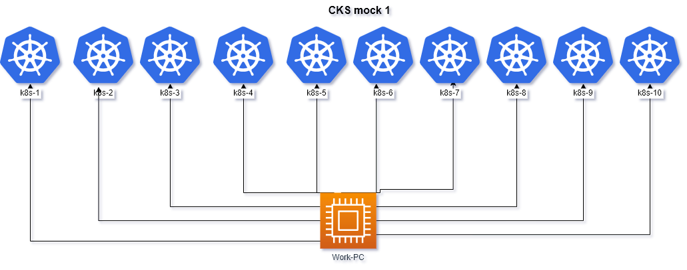

# Allowed resources
**Kubernetes Documentation:**

https://kubernetes.io/docs/ and their subdomains

https://kubernetes.io/blog/ and their subdomains

This includes all available language translations of these pages (e.g. https://kubernetes.io/zh/docs/)

**Tools:**

**Trivy** documentation https://aquasecurity.github.io/trivy/

**Falco** documentation https://falco.org/docs/
This includes all available language translations of these pages (e.g. https://falco.org/zh/docs/)

**App Armor**:
Documentation https://gitlab.com/apparmor/apparmor/-/wikis/Documentation

**Cilium** 
Documentation  https://docs.cilium.io/en/stable

**Istio**
Documentation https://istio.io/latest/docs/

**NGINX Ingress Controller**
Documentation  https://kubernetes.github.io/ingress-nginx/user-guide/nginx-configuration/

**Bom**
Documentation  https://kubernetes-sigs.github.io/bom/cli-reference/

**Etcd** 
documentation https://etcd.io/docs/

**NGINX Ingress Controller**
Documentation  https://kubernetes.github.io/ingress-nginx/user-guide/nginx-configuration/

- run ``time_left`` on work pc to **check time**
- run ``check_result`` on work pc to **check result**

# Questions

---
|        **1**        | **Perform Docker security configuration**                                                                                                                                                                                                                                                                                                                                                                                                                                                                                                                                                                                                                                                                                                                                           |
|:-------------------:|:------------------------------------------------------------------------------------------------------------------------------------------------------------------------------------------------------------------------------------------------------------------------------------------------------------------------------------------------------------------------------------------------------------------------------------------------------------------------------------------------------------------------------------------------------------------------------------------------------------------------------------------------------------------------------------------------------------------------------------------------------------------------------------|
|        host         | ` ssh docker-worker`                                                                                                                                                                                                                                                                                                                                                                                                                                                                                                                                                                                                                                                                                                                                                                |
| Acceptance criteria | In the host docker as a container engine. We need to perform the following tasks to enhance Docker security: &nbsp;&nbsp;- remove access to docker daemon for user `user`. Docker is being exposed through the TCP socket. This is considered as a high security risk. We need to stop exposing it and perform some security enhancements. &nbsp;&nbsp;- Docker socket `/var/run/docker.sock` is configured to be used for users that are in docker group. Change docker socket permissions to make it available only for `root` user and `root` group. Acceptance criteria: &nbsp;&nbsp;- `developer` user is not able to use docker anymore. &nbsp;&nbsp;- docker is NOT being exposed using TCP. &nbsp;&nbsp;- `docker.sock` has proper permissions. |
---

|        **2**        | Configure **istio**  policies  .     **istio cli** is installed on **control-plane** node                                                                                                                                                                                                                                                                                                                                                                                                                                                                                                                                                                                                |
|:-------------------:|:---------------------------------------------------------------------------------------------------------------------------------------------------------------------------------------------------------------------------------------------------------------------------------------------------------------------------------------------------------------------------------------------------------------------------------------------------------------------------------------------------------------------------------------------------------------------------------------------------------------------------------------------------------------------------------------------|
|       Cluster       | cluster12 (`kubectl config use-context cluster12-admin@cluster12`)                                                                                                                                                                                                                                                                                                                                                                                                                                                                                                                                                                                                                           |
| Acceptance criteria | You have to develop Istio mTLS policy in `market` namespace:  1. You have to configure istio mTLS in `market` namespace.  2. Enforce Mutual Authentication between pods in `market` namespace.  3. To check that policy is working, you can run: `kubectl exec -it tester -- curl app.market.svc.cluster.local:8080 --head`    # Curl from default namespace   curl: (56) Recv failure: Connection reset by peer  `kubectl exec -n market -it db -- curl app.market.svc.cluster.local:8080 --head`   # From db pod  HTTP/1.1 200 OK  `kubectl exec -n market -it app -- curl app.market.svc.cluster.local:8080 --head`   # From app pod  HTTP/1.1 200 OK |
---

|     **3**  надо     | **falco**  Detect and Stop Unauthorized Memory Access   . в фалко не видны k8 тэги .                                                                                                                                                                    |
|:-------------------:|:--------------------------------------------------------------------------------------------------------------------------------------------------------------------------------------------------------------------------------------------------------|
|       Cluster       | cluster8 (`kubectl config use-context cluster8-admin@cluster8`)                                                                                                                                                                                         |
| Acceptance criteria | There are different pods in k8s cluster with  managed by different deployments. One pod  is attempting to access `/dev/mem`, which is a potential security risk. Your task is to identify the pod using falco and scale down the associated deployment. |
---

|        **4**        | Create an **Ingress** with a redirect from **HTTP** to **HTTPS**                                                                                                                                                                                                                     |
|:-------------------:|:-------------------------------------------------------------------------------------------------------------------------------------------------------------------------------------------------------------------------------------------------------------------------------------|
|       Cluster       | cluster6 (`kubectl config use-context cluster6-admin@cluster6`)                                                                                                                                                                                                                      |
| Acceptance criteria | - cert located `/var/work/19`  - ns `team-19`    - Service  `team19`   -ingress `team19`   -ingressclasses `nginx`     - check https  `curl https://cks.local:31139  -kvL`   - certificate CN=**cks.local**   -   check redirect  `curl http://cks.local:30102` |
---

|         **5**       | **Network policy**                                                                                                                                                                                                                                                                                                                                                                                                                                           |
|:-------------------:|:-------------------------------------------------------------------------------------------------------------------------------------------------------------------------------------------------------------------------------------------------------------------------------------------------------------------------------------------------------------------------------------------------------------------------------------------------------------|
|       Cluster       | cluster6 (`kubectl config use-context cluster6-admin@cluster6`)                                                                                                                                                                                                                                                                                                                                                                                              |
| Acceptance criteria | - create default deny ingress policy in `prod-db` NS - create policy with allow connections from `prod` Namespaces to `prod-db` - create policy with allow connections from `stage` Namespaces and have label: `role=db-connect` - create policy with allow connections from `any` Namespaces and have label: `role=db-external-connect`  - for test connections use **svc** in `prod-db` NS and pods in `stage` ,  `prod` and `default ` NS |
---

|         **6**       | **Deployment security**                                                                                                                         |
|:-------------------:|:-----------------------------------------------------------------------------------------------------------------------------------------------------------------------------------------------|
|       Cluster       | cluster6 (`kubectl config use-context cluster6-admin@cluster6`)                                                                                                                                |
| Acceptance criteria | Modify deployment `secure` in `secure` Namespace: - prevent escalation - Read only root file system - user id 3000 - group id 3000 - allow wread to `/tmp/` container `c1` |
---

|        **7**        | disable sa secret auto-mount.  mount it to specific path.                                                                                                                                               |
|:-------------------:|:--------------------------------------------------------------------------------------------------------------------------------------------------------------------------------------------------------|
|     **Cluster**     | cluster6 (`kubectl config use-context cluster6-admin@cluster6`)                                                                                                                                         |
| Acceptance criteria | - ns  team-20  , deployment `team20`     -  create sa `team20`  - update deployment `team20` to use sa `team20`   disable automount sa secret   mount sa secret to `/var/team20/secret` |
---

|        **8**        | **Image Vulnerability Scanning**  bom |
|:-------------------:|:---------------------------------------------------------------------------------------------------------------------------------------------------------------------------------------------------------------------------------------------------------------------------------------------------------------------------------|
|       Cluster       | cluster6 (`kubectl config use-context cluster6-admin@cluster6`)                                                                                                                                                                                                                                                                  |
| Acceptance criteria | - delete all containers with `ca-certificates-bundle` version `20230506-r0` in deployment `deployment1` NS `team-xxx` using the `bom` utility.    -  Generate a SPDX-Json SBOM of image for `registry.k8s.io/kube-scheduler:v1.32.0` and store to `/var/work/02/kube_scheduler_sbom.json` using the `bom` utility. |
---

|        **9**        | **Pod Security Standard**   is enabled  in restricted mode on NS `team-red` . fix deployment |
|:-------------------:|:-----------------------------------------------------------------------------------|
|        Cluster      | cluster6 (   `kubectl config use-context    cluster6-admin@cluster6`   )           |
| Acceptance criteria | pod from  Deployment `container-host-hacker` in Namespace `team-red` is running .  |
---

|       **10**        | Create a TLS secret from local files. There is a Deployment with the appropriate volume mounts configured. Verify that the secret has appeared correctly inside the Pod.                            |
|:-------------------:|:-------------------------------------------------------------------------------------------------------------------------------------|
|       Cluster       | cluster6 (`kubectl config use-context cluster6-admin@cluster6`)                                                                      |
| Acceptance criteria | **NS** `team-black10`  , create  tls secret `tls` from  `/var/work/19` . pod from deployment `app` has mounted secret in file system |
---

|       **11**        | **update cluster**    In the cluster, the control plane node has been upgraded to the new version. It is necessary to upgrade the worker node |
|:-------------------:|:--------------------------------------------------------------------------------------------------------------------------------------------------|
|       Cluster       | cluster7 (`kubectl config use-context cluster7-admin@cluster7`)                                                                                   |
| Acceptance criteria | node is **ready** and **version** is the same with control-plane                                                                                  |
---

|       **12**        | **Enable audit log**                                                                                                                                                                               |
|:-------------------:|:----------------------------------------------------------------------------------------------------------------------------------------------------------------------------------------------------------------------------------------------|
|       Cluster       | cluster2 (`kubectl config use-context cluster2-admin@cluster2`)                                                                                                                                                                               |
| Acceptance criteria | - **logs** `/var/logs/kubernetes-api.log` - **policy** `/etc/kubernetes/policy/log-policy.yaml` - From `Secret` resources, level `Metadata`, namespace `prod`. - From `configmaps`, level `RequestResponse`, namespace `billing`. |
---

|        **13**       | **CIS Benchmark**                                                                                                                                                                                                                                                                                                                                                                                                 |
|:-------------------:|:-------------------------------------------------------------------------------------------------------------------------------------------------------------------------------------------------------------------------------------------------------------------------------------------------------------------------------------------------------------------------------------------------------------------------------------------------------------------------------------------|
|       Cluster       | cluster3 (`kubectl config use-context cluster3-admin@cluster3`)                                                                                                                                                                                                                                                                                                                                                                                                                            |
| Acceptance criteria | - CIS Benchmark is installed on nodes - fix on `control-plane`: &nbsp;&nbsp;- `kube-apiserver` Ensure that the `--profiling` argument is set to false &nbsp;&nbsp;- `controller-manager` Ensure that the `--profiling` argument is set to false (Automated) &nbsp;&nbsp;- `kube-scheduler` Ensure that the `--profiling` argument is set to false (Automated)  - fix on `worker node`: &nbsp;&nbsp;- Ensure that the `--protect-kernel-defaults` argument is set to true (Automated) |
---

|       **14**        | **Configure cilium network policies with**                                                                                                                                                                                                                                                                                                                                                                                                                                                                                                                                             |
|:-------------------:|:---------------------------------------------------------------------------------------------------------------------------------------------------------------------------------------------------------------------------------------------------------------------------------------------------------------------------------------------------------------------------------------------------------------------------------------------------------------------------------------------------------------------------------------------------------------------------------------|
|       Cluster       | cluster3 (`kubectl config use-context cluster4-admin@cluster4`)        
| Acceptance criteria | **cilium cli** is installed on **control-plane** node   You have to develop Cilium network policy in `myapp` namespace: &nbsp;&nbsp;1. You have to configure cilium network policy to allow access from pods in `ingress-nginx` namespace to our app deployed in `myapp` namespace. &nbsp;&nbsp;2. Enforce Mutual Authentication between pods in `ingress-nginx` and our app in `myapp` namespace. &nbsp;&nbsp; To check that policy is working, you can run `curl --connect-timeout 1 --max-time 1 -s http://myapp.local:30800 -v ` should work without any problems. |
---

|       **15**        | **kubeadm anonymous**.The cluster was configured using kubeadm with anonymous access enabled. It is necessary to disable anonymous access                                                                                                  |
|:-------------------:|:-------------------------------------------------------------------------------------------------------------------------------------------------------------------------------------------------------------------------------------------|
|       Cluster       | cluster1 (`kubectl config use-context cluster1-admin@cluster1`)                                                                                                                                                                            |
| Acceptance criteria | `curl -k https://{control-plane}:6443/api/v1/namespaces` not allow    `anonymous-auth` is  disable   `authorization-mode`  is `Node,RBAC`   don't have any **clusterrole** and **cluster role binding** for `system:anonymous` | |
---

|        **16**       | **Fix Dockerfile**  in /var/work/16/                                                                                                             |
|:-------------------:|:-------------------------------------------------------------------------------------------------------------------------------------------------|
|       Cluster       | any                                                                                                                                              |
| Acceptance criteria | fix 2 problem in  Dockerfile `/var/work/16/Dockerfile`     All changes must be made on the **same line**. Do not delete or create new lines. |
---
