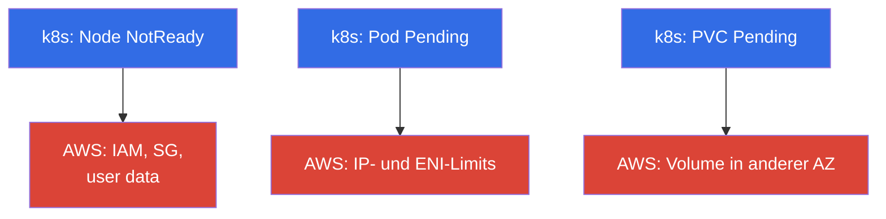
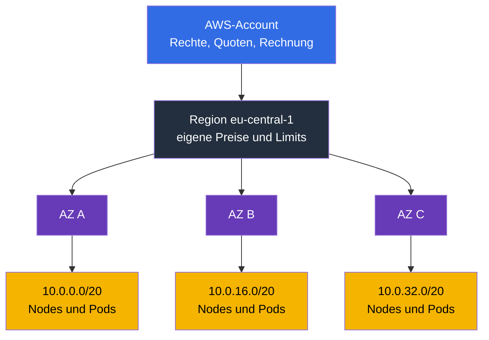
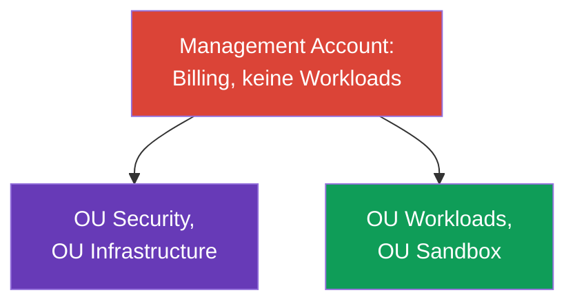
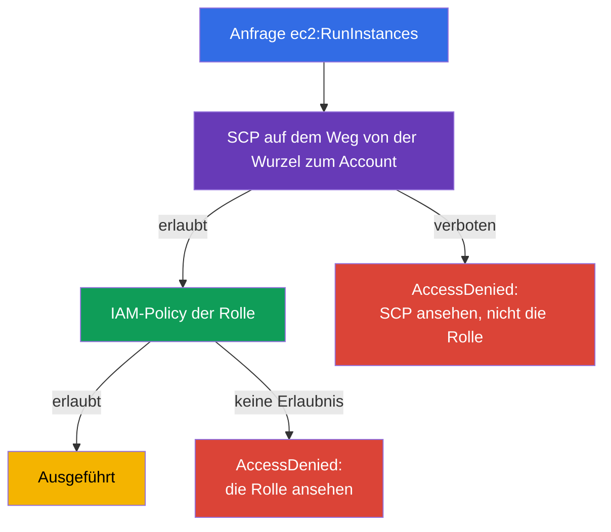
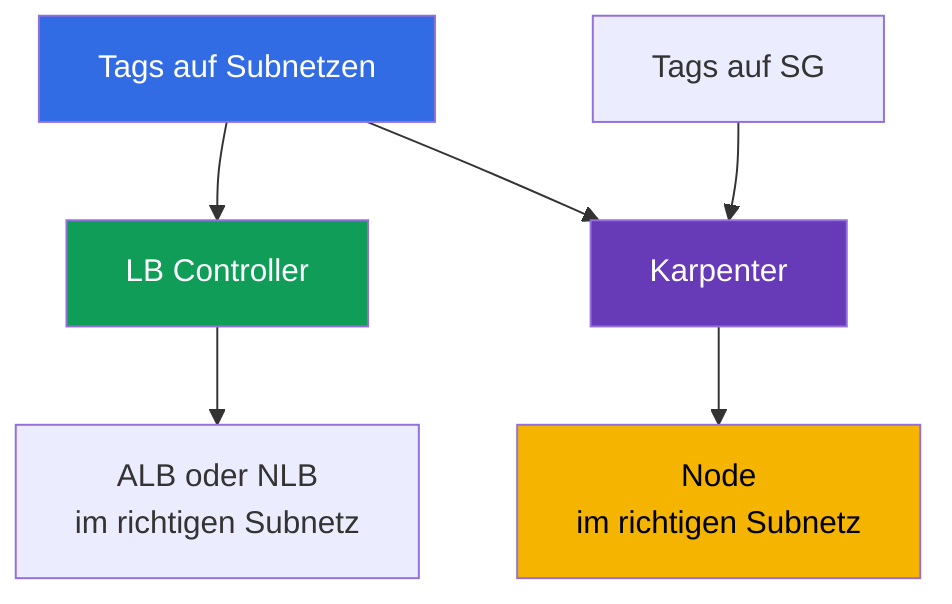

[Русская версия](ru.md) · [Eng version](en.md) · [Versión en español](es.md) · [Version française](fr.md) · [ქართული ვერსია](ge.md) · [繁體中文版](tw.md) · [日本語版](jp.md)

# Kapitel 0.1. AWS für Kubernetes-Ingenieure: Accounts, Regionen, AZ, Quoten, Tags, Billing

> **Was kommt als Nächstes.** Sie kommen von CKA: kubectl, Pods, Deployment, RBAC und PV - das
> sind vertraute Werkzeuge. In EKS ändern sie sich nicht, aber unter dem Cluster taucht eine
> zweite Schicht auf, die es in kubeadm nicht gab: Account, Region, Availability Zones,
> Service-Limits, Tags und die Rechnung am Ende des Monats. Dieses Kapitel liefert das
> minimale AWS-Vokabular, ohne das sich die Kapitel über Netzwerk, Nodes und Kosten wie eine
> Übersetzung lesen. Darauf bauen als Nächstes IAM (Kapitel 0.2) und VPC (0.3) auf.

## Voraussetzungen

Der Kurs beginnt nicht bei null in Sachen AWS. Es wird vorausgesetzt, dass Ihnen das
grundlegende Cloud-Gerüst bereits bekannt ist - zumindest auf dem Niveau "ich verstehe,
worum es geht, und finde es in der Konsole":

- **Was eine Public Cloud ist und das Pay-as-you-go-Modell**: Ressourcen werden per API auf
  Anfrage erstellt, bezahlt wird für Zeit und Umfang, nicht für Hardware.
- **Die globale Infrastruktur von AWS**: Regionen, Availability Zones, Edge-Standorte und CDN,
  sowie die Tatsache, dass Services regional oder global sein können.
- **Grundlegende Services und ihr Zweck**: EC2 (virtuelle Maschinen), EBS (Festplatten), S3
  (Objektspeicher), VPC (Netzwerk), IAM (Zugriff), Route 53 (DNS), CloudWatch (Metriken und
  Logs), KMS (Verschlüsselungsschlüssel), ELB (Load Balancer). Tiefes Wissen ist nicht nötig,
  aber ein Verständnis dafür, was jeder davon tut.
- **Verwaltungsmethoden**: AWS-Konsole, aws cli, API und SDK, das Prinzip Infrastructure as
  Code.
- **Die allgemeine Idee der geteilten Verantwortung** zwischen Anbieter und Kunde.

Wenn etwas aus dieser Liste neu ist, ist das kein Grund anzuhalten: Teil 0 holt genau dieses
Fehlende nach, aber im Kontext von EKS, nicht als vollständiger AWS-Kurs. Begriffe, die für
den Betrieb eines Clusters nötig sind, werden hier ausführlich behandelt; der Rest der Cloud
bleibt außerhalb des Kurses und lässt sich bequem mit Material auf dem Niveau des AWS Cloud
Practitioner sowie der offiziellen Service-Dokumentation abdecken.

Auf der Kubernetes-Seite wird das Niveau CKA vorausgesetzt: kubectl, Workloads, Service und
Ingress, RBAC, PV und PVC, Probes, Pod-Debugging. Diese Themen werden im Kurs nicht
wiederholt.

## 0.1.1. Warum ein Kubernetes-Ingenieur den Aufbau von AWS verstehen muss

In einem kubeadm-Cluster besaßen Sie alles: Maschinen, Netzwerk, Festplatte, Upgrade. In EKS
bedient AWS die Control Plane, alles andere bleibt weiterhin Ihre Sache, und fast jedes
Betriebsproblem führt nicht auf Kubernetes zurück, sondern auf das AWS darunter. Eine Node
startet nicht - falsche IAM-Rolle oder Security Group. Ein Pod hängt in `Pending` - keine IPs
mehr im Subnetz. Der Autoscaler fügt keine Nodes hinzu - Quote für vCPU erreicht. Ein PVC
bindet nicht - das EBS-Volume liegt in einer anderen AZ. Die Rechnung hat sich verdoppelt -
Traffic über NAT.

Formal ist das das **Modell der geteilten Verantwortung** (shared responsibility): AWS ist
verantwortlich für die Sicherheit **der Cloud selbst** (Hardware, Hypervisor, Control Plane
und ihre Patches), Sie sind verantwortlich für die Sicherheit **in der Cloud** (IAM, VPC und
Security Groups, AMI- und Node-Versionen, RBAC, Secrets, Images). Die Grenze wird in Kapitel 1
behandelt; ein Managed Service bedeutet nicht "man macht alles für mich".

Bildlich sieht das wie zwei Schichten aus. Oben das gewohnte Kubernetes, darunter die
AWS-Schicht, in der die eigentlichen Ursachen der meisten Symptome liegen:



Drei typische Symptome in kubectl verbergen drei Kategorien von Ursachen in AWS. Die übrigen
Fälle (keine neuen Nodes, LB ohne Adresse) lassen sich auf dieselben Kategorien zurückführen:
der erste auf IAM und SG, der zweite auf Netzwerklimits.

Die Hierarchie, in die sich das alles einordnet, lohnt sich ebenfalls, ab dem ersten Kapitel
im Kopf zu behalten: der Account legt Rechte, Quoten und die Rechnung fest, die Region die
Geografie, die Availability Zones die Ausfallgrenze, die Subnetze die Adressen für Nodes und
Pods.



## 0.1.2. Account: die Grenze für Isolation, Zugriff und Rechnung

Der **AWS-Account** ist gleichzeitig ein Namensraum für Ressourcen, eine Rechtegrenze und eine
Billing-Einheit: Ressourcen eines Accounts sehen standardmäßig die Ressourcen eines anderen
nicht. Der Account hat eine 12-stellige Nummer, die Sie ständig sehen werden: in ARNs, in der
Trust Policy für IRSA (Kapitel 16), in der Adresse der ECR-Registry (Kapitel 20).

```bash
# Wer ich gerade bin: Account-Nummer, ARN der aktuellen Identity, userId
aws sts get-caller-identity
```

Der **Root-Benutzer** ist der Besitzer des Accounts, Anmeldung per E-Mail und Passwort. Er
kann alles, einschließlich der Schließung des Accounts und der Änderung der
Zahlungsinformationen, und er lässt sich nicht durch Policies innerhalb des Accounts
einschränken. Die Regel ist einfach: Root wird einmal bei der Erstellung des Accounts
verwendet (MFA aktivieren, einen Arbeitszugang anlegen) und danach nie wieder, die tägliche
Arbeit läuft über IAM-Rollen und temporäre Keys (Kapitel 0.2).

Wenn ein Unternehmen wächst, wird ein einzelner Account eng, und es kommt **AWS
Organizations** ins Spiel - der nächste Abschnitt dreht sich vollständig darum.

| Grenze | Was isoliert wird | Wie sieht das in EKS aus |
|---------|---------------|--------------------|
| **Account** | Rechte, Quoten, Rechnung, Blast Radius | `prod` getrennt von `dev` |
| **Region** | Geografie, Preise, Regionsausfall | der Cluster lebt in einer Region |
| **AZ** | Ausfall eines Rechenzentrums | Subnetze und Nodes in 3 AZ |

## 0.1.3. AWS Organizations: wie Multi-Account in der Produktion aufgebaut ist

Beginnen wir mit dem Problem, nicht mit der Definition. Stellen Sie sich ein Unternehmen vor,
das in **einem** Account lebt: dort der Prod-EKS-Cluster, ein Test-Cluster, CI, eine
Datenbank, das ML-Experiment eines Kollegen und ein Bucket mit Backups. Solange das Team klein
ist, funktioniert das. Danach beginnen ganz konkrete Dinge zu passieren:

- **Ein Lasttest in `dev` stoppt die Skalierung von Prod.** Quoten werden pro Account und
  Region gezählt (Abschnitt 0.1.6): der Test hat die vCPU-Quote aufgefressen, und der
  Prod-Cluster fügt keine Nodes hinzu. Technisch ist alles in Ordnung, aber es gibt keine
  Nodes.
- **Ein Tippfehler in Terraform reicht bis zu Prod.** Alle Ressourcen liegen in einem
  Namensraum, daher trägt ein falsches `-target`, ein fremder Workspace oder ein
  Aufräum-Skript für "alles Unnötige" mitunter auch das weg, was nicht angefasst werden
  sollte. Der Blast Radius entspricht dem ganzen Geschäft.
- **Rechte lassen sich nicht ehrlich trennen.** Ein Entwickler braucht Zugriff auf den
  Test-Cluster, landet aber im selben IAM wie der Prod-Cluster. Policies wachsen mit
  Bedingungen zu Tags und Namen, niemand kann sie vollständig prüfen, und am Ende hat die
  Hälfte des Teams `AdministratorAccess`.
- **Das Leck eines einzigen Keys kompromittiert alles.** Ein Account - eine Zugriffsgrenze:
  ein Key aus der Test-Pipeline öffnet dieselben APIs wie Prod.
- **Die Rechnung lässt sich nicht nach Teams aufteilen.** Alle Ausgaben stehen in einer Zeile,
  und den Cluster von Team A vom Cluster von Team B zu trennen gelingt nur über Tags, deren
  Disziplin niemand einhält.
- **Audit-Logs liegen zusammen mit den Workloads.** Ein Administrator, der etwas kaputt
  gemacht oder verschleiert hat, hat Zugriff auf CloudTrail und kann Spuren beseitigen. Für
  ein Audit ist das inakzeptabel.
- **Es gibt keine Möglichkeit, etwas dauerhaft zu verbieten.** Man möchte eine Regel wie "in
  dieser Umgebung dürfen keine Ressourcen in fremden Regionen erstellt und Logging nicht
  deaktiviert werden" - aber innerhalb eines Accounts hebt jeder Administrator eine solche
  Einschränkung wieder auf, weil er Administrator ist.

Die naheliegende Antwort ist, **Accounts zu trennen**: Prod separat, Test separat, Experimente
separat. Aber ein naives "einfach mehrere Accounts anlegen" schafft eine neue Reihe von
Problemen: mehrere Rechnungen statt einer (und verlorene Mengenrabatte), separate Logins für
jeden Account, keine gemeinsame Policy, Copy-Paste von Grundeinstellungen bei jedem neuen
Account und völlige Abwesenheit einer Antwort auf die Frage "wie viele Accounts haben wir
insgesamt und was steckt darin".

**AWS Organizations** ist genau die Antwort auf diese Reihe von Problemen: ein Baum von
Accounts mit gemeinsamer Rechnung, gemeinsamen Einschränkungen und zentralisierter
Verwaltung. Der Account bleibt eine feste Grenze für Rechte, Quoten und Blast Radius, hört
aber auf, eine Insel zu sein. Für den EKS-Ingenieur ist das aus zwei Gründen wichtig: Er muss
verstehen, in welchem Account sein Cluster lebt, und warum ein Teil der Einstellungen für ihn
nicht verfügbar ist, selbst wenn er im Account Administrator ist.

Die Elemente der Konstruktion:

- **Management Account** (auch Payer genannt) - die Wurzel der Organisation. Dort werden
  keine Workloads gehalten: nur Billing und Verwaltung der Organisation. Die Kompromittierung
  dieses Accounts bedeutet die Kompromittierung der gesamten Organisation.
- **Member Accounts** - Arbeits-Accounts: `prod`, `stage`, `dev`, Netzwerk-Account,
  gemeinsame Services.
- **OU (Organizational Unit)** - ein Ordner im Baum, auf den Policies angewendet werden.
  Accounts werden nach OU gruppiert, nicht nach Namen.
- **SCP (Service Control Policy)** - eine einschränkende Policy auf OU- oder
  Account-Ebene. Wichtiges Detail: SCP **erlaubt nichts**, sie legt das Maximum der
  möglichen Rechte fest. Nicht einmal ein Account-Administrator kommt über ihren Rahmen
  hinaus, und `AdministratorAccess` innerhalb des Accounts hebt ein Verbot aus einer SCP
  nicht auf.
- **IAM Identity Center** - ein einheitlicher Login-Punkt: Benutzer und Gruppen sind
  einheitlich, der Zugriff auf einen konkreten Account wird über ein Permission Set für eine
  begrenzte Zeit vergeben (Kapitel 0.2).
- **AWS Control Tower** - eine fertige Umsetzung all dessen, dazu gleich nach dem Diagramm.

Eine typische Organisationsstruktur sieht so aus:



Was in jeder OU liegt und warum das separate Accounts sind:

| OU | Accounts | Was darin steckt | Warum getrennt |
|----|----------|-----------|-----------------|
| Security | `log-archive`, `audit` | CloudTrail der gesamten Organisation, GuardDuty, Config, Security Hub | der Administrator eines Arbeits-Accounts darf nicht die Logs über sich selbst löschen können |
| Infrastructure | `network`, `shared-services` | VPC und Transit Gateway, Route 53, gemeinsames ECR, CI, Backup-Kopien | Netzwerk und Images sind für alle Umgebungen gemeinsam, aber es gibt einen einzigen Besitzer |
| Workloads | `prod`, `stage`, `dev` | ein EKS-Cluster in jedem | eigene Quoten, eigene Rechte, Blast Radius auf die Umgebung begrenzt |
| Sandbox | `sandbox-*` | persönliche Accounts der Ingenieure | Budget mit Auto-Cleanup, kein Zugriff auf das gemeinsame Netzwerk |

Der Cluster im Account `prod` ist dabei nicht isoliert: Subnetze bekommt er von `network` über
RAM, Images zieht er aus `shared-services`, Logs gehen nach `log-archive`, Backup-Kopien
zurück nach `shared-services`. Diese Verbindungen werden in Kapitel 20, 31, 32 und 41
behandelt.

Es lohnt sich, separat zu verstehen, wie Rechte in einer solchen Konstruktion berechnet
werden. SCP vergibt keine Berechtigungen: die endgültigen Rechte sind der **Schnitt** aus
dem, was die SCP auf dem Weg von der Wurzel bis zum Account erlaubt, und dem, was die
IAM-Policy innerhalb des Accounts gibt. Daher das typische Rätsel "die Policy ist korrekt,
aber kein Zugriff":



Daraus folgt eine Regel, die Stunden spart: **ein expliziter Deny gewinnt gegen jeden
Allow**. Wenn ein Verbot auf irgendeiner Ebene des Wegs von der Wurzel zum Account in einer
SCP gegriffen hat, ist es sinnlos, die IAM-Rolle zu erweitern - weder `AdministratorAccess`,
noch eine neue Policy, noch eine Ergänzung der Trust Policy bringen den Zugriff zurück, weil
ein Allow einen Deny nicht aufhebt. Dasselbe gilt innerhalb eines Accounts: ein expliziter
Deny in einer IAM-Policy ist stärker als jeder Allow. Praktische Reihenfolge bei der Analyse
von `AccessDenied`: zuerst die SCP auf der OU, dann die Permissions Boundary der Rolle, dann
die Policy selbst, und erst danach RBAC innerhalb des Clusters (Kapitel 47). EKS-Ingenieure
verlieren am häufigsten Zeit, indem sie es umgekehrt machen und mit der Rolle anfangen.

### Landing Zone und Control Tower

Das Diagramm oben ist keine Fantasie, sondern eine typische **Landing Zone**: ein im Voraus
vorbereitetes Gerüst der Organisation, in das später Workloads einziehen. Dazu gehören der
OU-Baum und Service-Accounts, ein einheitlicher Login und Rollen, obligatorische Guardrails,
zentralisierte Logs und Audit, ein grundlegendes Netzwerkschema, eine Tagging-Policy und eine
Methode, um neue Accounts einheitlich auszurollen. Der Sinn ist einfach: ein Account soll
bereits sicher und einheitlich geboren werden, statt jedes Mal per Hand konfiguriert zu
werden.

**AWS Control Tower** ist eine fertige Landing Zone von AWS. Sie rollt die beschriebene
Struktur aus, erstellt Accounts für Logs und Audit, aktiviert eine Reihe von **Controls**
(auch Guardrails genannt) und liefert eine **Account Factory** - die Ausgabe eines neuen
Accounts nach Vorlage, sofort mit Policies, Logging und Zugriff. Controls unterteilen sich in
drei Typen: **preventive** (verbieten eine Aktion, technisch ist das eine SCP),
**detective** (finden Abweichungen über AWS Config) und **proactive** (prüfen
CloudFormation-Templates vor der Erstellung von Ressourcen). Separat überwacht Control Tower
den **Drift**: wenn jemand per Hand die OU, eine Policy oder die Einstellung eines
Service-Accounts geändert hat, ist das in der Konsole sichtbar.

Control Tower ist nicht der einzige Weg. Eine Landing Zone lässt sich auch selbst
zusammenstellen: mit Terraform auf Organizations aufgesetzt, über **Account Factory for
Terraform (AFT)** oder über den Landing Zone Accelerator. Die Wahl beeinflusst, wer die
Grundeinstellungen besitzt, aber nicht das Prinzip: das Gerüst ist als Code beschrieben und
wird auf alle Accounts gleich angewendet.

### Was das kostet und was man am Anfang abschalten sollte

Die Falle besteht darin, dass Control Tower selbst kein Geld von AWS kostet: Sie zahlen für
die Services, die es aktiviert. Deshalb entsteht die Rechnung, bevor im Cluster der erste Pod
läuft, und sie ist konstant: sie hängt weder von der Last noch vom Wochenende ab. Für eine
kleine Organisation ist das eine unangenehme Überraschung, keine Katastrophe, aber die
Struktur muss man im Voraus kennen.

| Posten | Wofür Sie zahlen | Wovon es wächst |
|--------|----------------|----------------|
| **AWS Config** | Aufzeichnung eines Configuration Items bei jeder Ressourcenänderung plus Auswertungen der Detective-Control-Regeln | Accounts x governed Regionen x Änderungshäufigkeit der Ressourcen. Haupttreiber |
| S3 in `log-archive` | Speicherung der Config- und CloudTrail-Logs | Umfang und Aufbewahrungsdauer |
| CloudTrail | die erste Kopie der Management-Events in der Region ist kostenlos; kostenpflichtig sind Data Events und ein zweiter Trail | doppelte Trails, Aktivierung von Data Events |
| Service Catalog | Provisionierung von Accounts über die Account Factory | Anzahl der Account-Ausgaben |
| Klebstoff (Lambda, EventBridge, SNS, KMS) | Service-Aufrufe und Keys | gering und ändert sich kaum |
| AFT, falls gewählt | standardmäßig VPC Endpoints plus NAT Gateway für CodeBuild | stündliche Gebühr für die reine Existenz |
| Security Hub, GuardDuty, Conformance Packs | separate Services, nicht Teil der Basis-Landing-Zone | Anzahl der Prüfungen, Umfang der Events |
| Organizations, SCP, IAM Identity Center | ohne zusätzliche Gebühr | - |

Man muss nicht bewerten "wie viel Control Tower kostet", sondern wie viele Configuration
Items entstehen. Berechnet wird das so: Anzahl der governed Regionen multipliziert mit der
Anzahl der Accounts multipliziert mit der Häufigkeit, mit der sich Ihre Ressourcen ändern.
Danach wird der Config-Preis in Ihrer Region angewendet. Genau deshalb unterscheiden sich
eine Landing Zone mit fünf Accounts in einer Region und dieselbe Landing Zone in vier
Regionen bei gleicher Last um ein Vielfaches.

Für EKS gibt es hier eine separate Falle: **Karpenter erstellt und löscht ständig Instanzen,
ENIs, Volumes und Security-Group-Rules**, und jede solche Änderung ist ein Configuration
Item. Ein dynamischer Cluster erzeugt einen Datenstrom, den es bei einer statischen Node
Group nicht gab. Die Dokumentation von Control Tower warnt ausdrücklich vor steigenden
Config-Kosten bei ephemeren Workloads.

Behandelt wird das mit drei Methoden, von sanft bis hart:

- **daily recording statt continuous** für laute Ressourcentypen: Config speichert einen
  Eintrag pro Tag, und nur wenn sich der Zustand geändert hat. Die Chronologie innerhalb des
  Tages geht verloren, dafür sinkt der CI-Datenstrom. Für einige Service-Typen von Config
  (zum Beispiel `AWS::Config::ResourceCompliance`) wird daily recording nicht unterstützt,
  sie werden immer kontinuierlich geschrieben.
- **Ausschluss von Typen aus dem Bereich des Recorders**: die Strategie "alles schreiben
  außer dem Aufgelisteten" (`EXCLUSION_BY_RESOURCE_TYPES`). Kandidaten in dev und sandbox
  sind genau das, was Karpenter durchmahlt: EC2-Instanzen, Netzwerkinterfaces, Volumes,
  Security-Group-Rules.
- **den Recorder in einem lauten Account komplett abschalten**: der Weg für Non-Prod, den
  die Control-Tower-Dokumentation selbst offiziell vorschlägt. Der Preis ist ehrlich: in
  diesem Account funktionieren die Detective Controls nicht mehr und das Änderungsprotokoll
  verschwindet, deshalb macht man das nicht mit `prod`.

Ab Landing-Zone-Version 3.0 schreibt Control Tower globale Ressourcen (IAM-Rollen, Benutzer,
Policies) bereits nur noch in der Home-Region statt in jeder einzelnen - das reduziert einen
Teil der Duplizierung von selbst.

Was ein Startup nicht sofort aktivieren muss, sondern hinzufügen kann, wenn ein Grund
auftaucht:

| Was man verschieben kann | Warum es möglich ist | Wann aktivieren |
|--------------|--------------|----------------|
| Control Tower selbst | Organizations, SCP und Identity Center sind kostenlos: ein OU-Baum, ein Org-Trail und das Verbot überflüssiger Regionen bringen 80 % des Nutzens gratis | wenn Accounts regelmäßig ausgegeben werden und das per Hand schon teuer wird |
| Überflüssige governed Regionen | der Config-Recorder wird in jeder aktiviert, die Rechnung multipliziert sich | wenn eine DR-Region entsteht (Kapitel 42) |
| Enrollment lauter dev- und sandbox-Accounts | Config schreibt dort am meisten Müll | wenn in dev Audit-Anforderungen entstehen |
| Kontinuierliche Aufzeichnung aller Typen in Config | für laute Typen gibt es daily recording und den Ausschluss von Typen | wenn eine genaue Chronologie der Änderungen benötigt wird |
| Security Hub Service-Managed Standard | das ist ein separater, tarifierter Service, der über ein verwaltendes Control aktiviert wird | bei den ersten Compliance-Anforderungen (Kapitel 21) |
| GuardDuty | nicht Teil der Landing Zone, wird separat aktiviert | beim Übergang in Prod mit echten Kundendaten |
| AFT oder CfCT | AFT fügt permanente Infrastruktur hinzu: Endpoints und NAT | wenn es Dutzende Accounts gibt und eine Pipeline nötig ist |
| Data Events von CloudTrail und lange Retention | der teuerste Teil des Audits | bei einer regulatorischen Anforderung, mit Lifecycle in Kaltspeicher |

Zwei Punkte, bei denen Sparen sich gegen Sie wendet. Erstens: **ein zweiter CloudTrail-Trail
zusätzlich zum Org-Trail** ist keine Ersparnis, sondern eine Duplizierung tarifierter Events,
einen eigenen Trail legt man nur für eine konkrete Anforderung an. Zweitens: **proactive
Controls prüfen CloudFormation-Templates**, und wenn Ihr Cluster mit Terraform beschrieben
ist (Kapitel 4), sind sie kein Schutz - man darf sich nicht auf sie verlassen, und den Platz
der Verbote nehmen preventive Controls ein, also SCP.

Die Reihenfolge der Aktivierung für ein Startup, das im Laufe der Zeit PCI DSS erreichen
möchte, wird in Kapitel 48 als separates Einführungsszenario behandelt: zuerst das kostenlose
Gerüst, dann die Erkennung, dann die Account-Pipeline. Die Aufschlüsselung der Ausgaben nach
Services und Tags - in Kapitel 43.

Was davon für den EKS-Ingenieur in der Praxis wichtig ist:

- **Den Account für einen neuen Cluster konfigurieren Sie nicht von null.** Er kommt bereits
  aus der Account Factory mit Logs, Rollen, Guardrails und in der Regel mit einem
  Basis-Netzwerk. Ihre Aufgabe ist der Cluster, nicht das Drumherum des Accounts.
- **Ein Teil der Einstellungen ist für Sie nicht verfügbar, und das ist normal.** Es wird
  nicht gelingen, CloudTrail abzuschalten, eine Ressource in einer nicht erlaubten Region zu
  erstellen oder die Verschlüsselung zu entfernen - das verhindert ein preventive Control.
- **Abweichungen werden bemerkt.** Eine Ressource, die per Hand außerhalb von IaC erstellt
  wurde, taucht als Abweichung in Config oder als Drift der Landing Zone auf. Deshalb
  beschreibt man den Cluster und sein Umfeld als Code (Kapitel 4).

Was das dem EKS-Cluster bringt:

| Eigenschaft der Organisation | Praktischer Effekt für EKS |
|----------------------|------------------------------|
| Quoten werden pro Account und Region gezählt | die Limits von `dev` fressen nicht die Kapazität von `prod` (Abschnitt 0.1.6) |
| Blast Radius auf den Account begrenzt | ein Fehler in IAM oder Terraform erreicht nicht den Prod-Cluster |
| Consolidated Billing | Savings Plans und Mengenrabatte gelten für alle Accounts (0.1.8) |
| SCP als Guardrails | man kann keine Logs abschalten, keine Ressource in einer fremden Region erstellen, keine Verschlüsselung entfernen |
| Zentralisiertes Netzwerk | Subnetze oder Transit vergibt der Netzwerk-Account (Kapitel 31 und 32) |
| Zentralisierte Services | gemeinsames ECR, Backup-Kopien in einem separaten Account (Kapitel 20 und 41) |

Typische SCPs, denen Sie als Ingenieur begegnen werden: Verbot aller Regionen außer den
Arbeitsregionen; Verbot, CloudTrail, Config und GuardDuty abzuschalten; Verbot, Logs und
Snapshots zu löschen; Pflicht zur Verschlüsselung von Volumes. Kaputt geht das so: Terraform
scheitert mit `AccessDenied` bei durchaus korrekten IAM-Rechten. Zuerst schaut man nicht auf
die Rolle, sondern auf die SCP der OU.

```bash
# Gibt es eine Organisation und wer ist darin der Payer
aws organizations describe-organization

# Alle Accounts und OUs (wird im Management- oder Delegated-Admin-Account ausgeführt)
aws organizations list-accounts --query 'Accounts[].[Id,Name,Status]' --output table
aws organizations list-organizational-units-for-parent --parent-id r-abcd

# Welche SCPs auf einem konkreten Account oder einer OU hängen
aws organizations list-policies-for-target --target-id 123456789012 \
  --filter SERVICE_CONTROL_POLICY
```

Weiter beginnt die Spezifik von EKS im Multi-Account-Umfeld, die man im Voraus kennen sollte:

- **Der Cluster lebt in einem Account**, aber die Ressourcen um ihn herum liegen in anderen.
  Das Netzwerk kann gemeinsam sein: der Netzwerk-Account teilt Subnetze über **AWS RAM**, und
  der Cluster wird in fremden (shared) Subnetzen hochgezogen. Dann setzt die Tags auf den
  Subnetzen (Abschnitt 0.1.7) der Besitzer des Netzwerks, nicht Sie, und die Abstimmung der
  Tags wird Teil des Prozesses.
- **Der Zugriff auf den Cluster wird an Rollen aus anderen Accounts vergeben.** Ein Access
  Entry kann für eine Rolle erstellt werden, die aus dem CI-Account oder aus Identity Center
  kommt (Kapitel 5). Das ist gängige Praxis: die Deployment-Pipeline lebt im Account der
  gemeinsamen Services.
- **Images werden aus einem gemeinsamen ECR** eines anderen Accounts gezogen, also braucht
  man eine Repository-Policy für Cross-Account-Pull (Kapitel 20).
- **Backups werden in einen separaten Account kopiert**, damit die Kompromittierung des
  Arbeits-Accounts nicht zusammen mit dem Cluster auch dessen Wiederherstellungspunkte
  mitnimmt (Kapitel 41).
- **Sicherheit wird aus dem Audit-Account betrachtet.** GuardDuty, Config und Security Hub
  werden für die gesamte Organisation über einen Delegated Administrator aktiviert, nicht
  per Hand in jedem Account (Kapitel 21).

Wie viele Accounts man für Cluster braucht, ist eine Frage ohne eine einzige Antwort. Das
Minimum, das fast immer funktioniert: `prod` getrennt von allem anderen, weil der
Prod-Cluster eigene Quoten, eigene Rechte und ein eigenes Wartungsfenster hat. Danach steht
die Wahl zwischen "ein Account pro Umgebung" (einfacher zu verwalten, günstiger in der
Administration) und "ein Account pro Team oder Produkt" (bessere Isolation und
Kostenzuordnung, aber mehr Netzwerk-Drumherum und mehr Cluster im Bestand - Kapitel 44).

## 0.1.4. Region und Availability Zone

Die **Region** (`eu-central-1`, `us-east-1`) ist ein geografischer Standort mit eigenem
Set von Services und eigenen Preisen. Ressourcen sind an eine Region gebunden: ein Subnetz aus
`eu-central-1` lässt sich nicht an einen Cluster in `us-east-1` anschließen, und ein
EKS-Cluster lebt vollständig innerhalb einer Region.

Eine **Availability Zone (AZ)** ist ein oder mehrere physisch isolierte Rechenzentren
innerhalb einer Region: eigene Stromversorgung, Kühlung, Netzwerk. Die Latenz zwischen den
AZ einer Region ist gering (einige Millisekunden), aber der Ausfall einer Zone betrifft die
übrigen nicht. Daraus folgt die wichtigste Regel der Ausfallsicherheit: **Subnetze mindestens
in drei AZ, Nodes über die AZ verteilt, Workloads über Topology Spread Constraints verteilt**
(Kapitel 40). Die Control Plane von AWS wird ohnehin in mehreren Zonen gehalten, für die
Nodes sind Sie verantwortlich: ein Cluster mit einer Node Group in einer AZ fällt mit ihr
zusammen aus.

Eine Feinheit, über die alle stolpern: **der AZ-Name der Form `eu-central-1a` zeigt in
verschiedenen Accounts auf unterschiedliche physische Zonen.** AWS mischt die Namen, damit
Kunden nicht alle in die "erste" Zone fallen. Ein stabiler Bezeichner ist die `ZoneId`
(`euc1-az1`), sie ist in allen Accounts gleich, und in Multi-Account-Szenarien muss man genau
sie vergleichen.

```bash
# Alle AZ der Region: Name (in jedem Account eigen) und stabile ZoneId
aws ec2 describe-availability-zones \
  --region eu-central-1 \
  --query 'AvailabilityZones[].[ZoneName,ZoneId,State]' \
  --output table
```

Eine weitere Folge des AZ-Aufbaus, die Sie in Kapitel 23 treffen wird: **ein EBS-Volume lebt
in einer AZ und wird nur an eine Instanz aus derselben Zone gemountet**. Ein Pod mit einem
PVC auf `gp3` ist an seine Zone gebunden: wenn Karpenter eine Node in einer anderen AZ
hochzieht, bleibt der Pod in `Pending`. Daraus ergeben sich `WaitForFirstConsumer` in der
StorageClass und Shared Storage über EFS (Kapitel 24).

## 0.1.5. ARN: wie jede AWS-Ressource adressiert wird

Der **ARN (Amazon Resource Name)** ist ein eindeutiger Bezeichner einer Ressource. Er taucht
in IAM-Policies, ServiceAccount-Annotationen, Controller-Manifesten, Logs und Fehlern auf,
deshalb muss man ihn auf den ersten Blick lesen können. Die allgemeine Form sind sechs Felder,
getrennt durch Doppelpunkte: `arn:partition:service:region:account-id:resource`. Beispiele
aus dem Kurs:

- `arn:aws:iam::123456789012:role/eks-node-role` - eine IAM-Rolle, IAM hat keine Region.
- `arn:aws:eks:eu-central-1:123456789012:cluster/demo` - ein EKS-Cluster.
- `arn:aws:s3:::my-bucket/path/*` - Objekte im Bucket, ohne Region und Account.

`partition` ist fast immer `aws`, aber es gibt auch `aws-cn` und `aws-us-gov`: kopiert man
eine Policy in eine solche Partition, muss man `partition` anpassen.

Der ARN einer Rolle ist das, womit ein Workload im Cluster Rechte in AWS erhält, und in zwei
Mechanismen wird er unterschiedlich angegeben:

- **IRSA** (Kapitel 16): der ARN der Rolle steht in der Annotation des ServiceAccount
  `eks.amazonaws.com/role-arn`, und die Rolle selbst vertraut dem OIDC-Provider des Clusters.
  Ein Fehler im ARN oder im `sub` innerhalb der Trust Policy sieht wie eine Rechteverweigerung
  beim Pod aus, nicht bei der Node.
- **EKS Pod Identity** (Kapitel 17): es gibt keine Annotation, statt ihr wird eine
  Association in der API von EKS selbst erstellt, wo der ARN der Rolle explizit übergeben
  wird:

```bash
# Rolle mit einem ServiceAccount ohne OIDC-Annotationen verknüpfen
aws eks create-pod-identity-association \
  --cluster-name demo --namespace default \
  --service-account my-sa \
  --role-arn arn:aws:iam::123456789012:role/app-role
```

Praktisches Fazit: hat ein Pod keine Rechte erhalten, schaut man zuerst, mit welchem der
beiden Mechanismen die Rolle verknüpft ist, denn die Diagnose ist bei ihnen unterschiedlich -
bei IRSA prüft man die Annotation und die Trust Policy, bei Pod Identity die Association
selbst und den Agenten auf der Node.

## 0.1.6. Service Quotas: warum der Cluster aufhört zu skalieren

Jeder AWS-Service hat **Quoten (Service Quotas)** - Limits pro Account und Region. Das ist
keine Billing-Einschränkung, sondern eine Schutzobergrenze, und ein neuer Account bekommt sie
niedrig gesetzt.

| Service | Quote | Wie sie den Cluster trifft |
|--------|-------|----------------------|
| `ec2` | Running On-Demand Standard instances (vCPU) | Nodes werden bei der Skalierung nicht erstellt |
| `ec2` | All Standard Spot Instance Requests (vCPU) | Spot-Nodes starten nicht (Kapitel 13) |
| `vpc` | Network interfaces per Region | keine ENI, Pods bekommen keine IP (Kapitel 6) |
| `ec2` | EC2-VPC Elastic IPs | kein NAT Gateway oder öffentliche Adresse erstellbar |
| `elasticloadbalancing` | Load Balancers per Region | Service oder Ingress bekommt keinen LB |
| `eks` | Clusters per Region | kein weiterer Cluster erstellbar |

Typisches Szenario: die Last ist gestiegen, Karpenter oder Cluster Autoscaler versucht Nodes
hinzuzufügen, im Cluster erscheint nichts, und in den Events von Karpenter oder der Auto
Scaling Group sieht man `VcpuLimitExceeded` oder `MaxSpotInstanceCountExceeded`. Die
Obergrenze steht in AWS.

Eine separate Klasse von Limits sind **API Rate Limits** (Throttling): die Häufigkeit von
Aufrufen an die API eines Services, nicht die Anzahl der Ressourcen. Bei einem großen
Node-Bestand rufen Controller und Autoscaler häufig EC2 und Auto Scaling auf, und als
Antwort kommt `RequestLimitExceeded` oder `Throttling`. Das wächst ebenfalls mit EKS, wird
aber nicht durch eine höhere Quote behoben, sondern durch seltenere Abfragen und Retries mit
Backoff.

```bash
# Alle EC2-Quoten mit aktuellen Werten; Service-Codes - aws service-quotas list-services
aws service-quotas list-service-quotas \
  --service-code ec2 \
  --query 'Quotas[].[QuotaCode,QuotaName,Value]' \
  --output table

# Konkrete Quote On-Demand Standard Instances (Limit in vCPU) und Erhöhungsanfrage
aws service-quotas get-service-quota --service-code ec2 --quota-code L-1216C47A
aws service-quotas request-service-quota-increase \
  --service-code ec2 --quota-code L-1216C47A --desired-value 256
```

Praxis: vor einem Lasttest oder dem Start eines Prod-Clusters werden Quoten geprüft und im
Voraus erhöht. Die Bearbeitung dauert von Minuten bis Tagen, benötigt wird sie aber meist
genau dann, wenn man nicht warten kann.

## 0.1.7. Tags: in EKS ist das keine Kosmetik

Ein **Tag** ist ein Schlüssel/Wert-Paar an einer AWS-Ressource. Normalerweise dienen Tags der
Ordnung, aber in EKS ist ein Teil der Tags funktional: über sie **finden** Controller
Ressourcen, und entfernt man das Tag, geht die Mechanik kaputt, nicht nur der Report.



Tags, die unbedingt korrekt sein müssen:

- `kubernetes.io/role/elb` = `1` auf öffentlichen Subnetzen - wo internet-facing Load
  Balancer platziert werden (Kapitel 26).
- `kubernetes.io/role/internal-elb` = `1` auf privaten Subnetzen - für interne.
- `karpenter.sh/discovery` = Name des Clusters auf Subnetzen und Security Groups - wie
  Karpenter auswählt, wo und mit welcher SG Nodes hochgezogen werden (Kapitel 12).
- `kubernetes.io/cluster/<Cluster-Name>` - eine historische Markierung der Zugehörigkeit
  einer Ressource zum Cluster, kommt in alten Konfigurationen vor.

```bash
# Ein Subnetz als öffentlich für internet-facing Load Balancer markieren
aws ec2 create-tags --resources subnet-0a1b2c3d4e5f6a7b8 \
  --tags Key=kubernetes.io/role/elb,Value=1

# Prüfen, ob Karpenter die richtigen Subnetze findet
aws ec2 describe-subnets \
  --filters "Name=tag:karpenter.sh/discovery,Values=demo" \
  --query 'Subnets[].[SubnetId,AvailabilityZone]' --output table
```

Die zweite Rolle von Tags ist die Kostenzuordnung. Das Pflicht-Minimum `CostCenter`, `Owner`,
`Environment` ist die Grundlage der Kostenzuordnung: darüber wird die Rechnung in AWS Cost
Explorer und in Kubecost aufgeschlüsselt (Kapitel 43). Eine vollständigere Policy ergänzt
`Team`, `Cluster`, `ManagedBy` und hilft, vergessene Ressourcen zu finden. Tags werden in
Terraform als `default_tags` gesetzt, in der Organisation über Tag Policies festgeschrieben
und von AWS Config geprüft.

## 0.1.8. Billing: aus was sich die Rechnung für einen EKS-Cluster zusammensetzt

Die Zeile "EKS" in der Rechnung ist klein: der Service selbst nimmt eine stündliche Gebühr
für die Control Plane, das eigentliche Geld fließt in die benachbarten Services.

| Posten | Wofür Sie zahlen | Anmerkung |
|--------|----------------|-----------|
| EKS Control Plane | Stunde Cluster-Betrieb | gleich für kleinen und großen Cluster |
| Extended Support | erhöhter Stundentarif für einen Cluster auf einer Version außerhalb des Standard-Supports | wird automatisch aktiviert, ein Versionsrückstand kostet Geld (Kapitel 3) |
| EC2 oder Fargate | vCPU und Speicher der Nodes oder Pods | in der Regel der größte Anteil (Kapitel 0.4, 15) |
| EBS, EFS, S3, ECR | Volumes, Snapshots, Images | vergessene Snapshots sammeln sich über Jahre an |
| NAT Gateway | Betriebsstunde plus jedes Gigabyte | die klassische Überraschung (Kapitel 31) |
| Load Balancers | Betriebsstunde plus Traffic | einer pro Service oder Ingress |
| Data Transfer | Traffic zwischen AZ und nach außen | zwischen Zonen zahlt man in beide Richtungen |
| CloudWatch | Ingestion und Speicherung von Logs und Metriken | kann teurer werden als die Nodes (Kapitel 34) |

Separat zur Zeile **Extended Support**. Solange die Cluster-Version im Standard-Support ist,
kostet die Stunde Control Plane für alle gleich. Wenn der Standard-Zeitraum der Version
endet, wechselt der Cluster in den Extended Support und dieselbe stündliche Gebühr wird höher
- bei völlig unveränderter Last. Gesteuert wird das über das Feld `supportType` in der
Update-Policy des Clusters (`STANDARD` oder `EXTENDED`), die Versionsfristen und das
Support-Modell werden in Kapitel 3 behandelt. Zwei Details, die in der Praxis auffallen: mit
`supportType: STANDARD` wird der Cluster nach Ablauf der Frist zwangsweise aktualisiert, und
bei einem **Rollback** einer Version von Standard auf eine, die bereits außerhalb des
Standard-Supports liegt, beginnt die Gebühr für Extended Support wieder zu laufen (Kapitel
39). Ein Versionsrückstand ist also nicht nur ein Sicherheitsrisiko, sondern auch eine Zeile
in der Rechnung.

```bash
# In welcher Support-Periode der Cluster ist und welche Update-Policy gewählt wurde
aws eks describe-cluster --name demo \
  --query 'cluster.[version,upgradePolicy.supportType]' --output table
```

Überraschungen tauchen fast immer an zwei Stellen auf. Erstens beim **NAT Gateway**: ein
Cluster, der Images zieht und über NAT zu S3 oder ECR geht, zahlt für Traffic, den man über
VPC Endpoints vermeiden kann (Kapitel 31). Zweitens beim **Traffic zwischen AZ**: gesprächige
Services in drei Zonen erzeugen eine dauerhafte Rechnung, und das ist der bewusste Preis der
Ausfallsicherheit.

```bash
# Aufschlüsselung der Monatsausgaben nach Services; nach Tag - --group-by Type=TAG,Key=Cluster
aws ce get-cost-and-usage \
  --time-period Start=2025-01-01,End=2025-02-01 \
  --granularity MONTHLY --metrics "UnblendedCost" \
  --group-by Type=DIMENSION,Key=SERVICE
```

Wichtiges Detail: **Cost Allocation Tags werden manuell** im Bereich Billing aktiviert, und
Daten erscheinen erst ab dem Moment der Aktivierung, nachträglich lassen sie sich nicht
beschaffen. Deshalb aktiviert man Tags für die Kostenzuordnung schon am ersten Tag.
OpenCost, Kubecost und Right-Sizing - in Kapitel 43.

## 0.1.9. Wie man günstig und risikofrei übt

- **Ein separater Account fürs Lernen.** Ein eigener Account oder eine Sandbox isoliert
  Experimente von Arbeitsressourcen und liefert ein ehrliches Bild der Kurskosten.
- **Budget und Alarme von Tag eins.** AWS Budgets mit Benachrichtigung bei Überschreitung
  eines Schwellwerts und bei Prognose ist günstiger, als von einem vergessenen NAT Gateway
  erst nach einem Monat zu erfahren.
- **Alles nach der Übung löschen.** Cluster, NAT Gateway, Load Balancer und EIP kosten für
  die Existenzdauer, nicht für die Nutzung. Nehmen Sie die nächstgelegene **Region**.

```bash
# Aktuelle Budgets des Accounts: Schwellwert und Benachrichtigungen werden einmal eingerichtet
aws budgets describe-budgets --account-id 123456789012
```

Die Labs des Kurses sind so aufgebaut, dass die Umgebung mit einem einzigen Befehl über
Terragrunt aufgebaut und gelöscht wird: `apply` erstellt alles Nötige, `destroy` lässt keine
kostenpflichtigen Reste übrig (Kapitel 0.5).

## 0.1.10. Wie das in der Produktion angewendet wird

Organisation und Accounts:

- **Multi-Account per Default.** `prod`, `stage` und `dev` in separaten Accounts: isolierte
  Rechte, unabhängige Quoten, eine klare Rechnung pro Umgebung. Der Prod-Cluster teilt sich
  seinen Account mit nichts.
- **Management Account leer.** Darin liegen nur Billing und Organizations, keine Workloads
  und keine Cluster. Zugriff darauf haben nur wenige, mit MFA.
- **Landing Zone aus Code.** Der OU-Baum, Log- und Audit-Accounts, grundlegende Guardrails
  werden von Control Tower oder eigenem Code ausgerollt, nicht per Hand aus der Konsole. Ein
  neuer Account wird nach Vorlage ausgegeben: dieselben SCPs, dieselben Tags, dasselbe Set
  von Rollen.
- **SCP als Versicherung gegen den Menschen.** Erlaubte Regionen, Verbot, CloudTrail, Config
  und GuardDuty abzuschalten, Verbot, Logs und Snapshots zu löschen, Pflicht zur
  Verschlüsselung. Bei `AccessDenied` in Terraform wird die SCP vor den IAM-Policies
  geprüft.
- **Einheitlicher Login über Identity Center.** Kein einziger IAM-Benutzer mit
  langlebigen Keys: Rollen auf Zeit, Permission Sets für Gruppen, eine separate
  Break-Glass-Rolle mit Alert bei Nutzung (Kapitel 0.2).
- **Zentralisiert sind Netzwerk, Images, Logs und Backups.** Subnetze vergibt der
  Netzwerk-Account über RAM, oder die Verbindung läuft über Transit Gateway, Images liegen
  in einem gemeinsamen ECR, Backup-Kopien gehen in einen separaten Account, Sicherheit wird
  aus dem Audit-Account über einen Delegated Administrator betrachtet (Kapitel 20, 21, 31,
  32, 41).

Cluster und Geld:

- **Drei AZ als Norm.** Subnetze und Node Groups mindestens in drei Zonen, kritische
  Workloads über Topology Spread und PDB verteilt (Kapitel 40).
- **Quoten in der Startup-Checkliste.** Vor dem Go-Live in Prod und vor einem Lasttest
  werden die Limits für vCPU, ENI, EIP und Load Balancer geprüft. Quoten werden für jeden
  Account separat beantragt: eine Erhöhung in `dev` wirkt nicht in `prod`.
- **Tags setzt der Code.** `default_tags` in Terraform, Pflichtschlüssel werden über Tag
  Policies festgeschrieben, die Einhaltung prüft AWS Config. Manuelles Tagging überlebt
  nicht.
- **FinOps als Prozess.** Cost Explorer mit Aufschlüsselung nach Accounts und Tags, Budgets
  mit Alarmen pro Account, Analyse von Traffic- und NAT-Wachstum. Kosten sind eine Metrik
  wie Latenz und Verfügbarkeit.

## 0.1.11. Mini-Glossar

- **Account** - ein isolierter Ressourcenraum und eine Billing-Einheit; die 12-stellige
  Nummer taucht in ARN und Trust Policy auf.
- **Root-Benutzer** - der Besitzer des Accounts mit uneingeschränkten Rechten, wird nur bei
  der Erstkonfiguration benötigt.
- **AWS Organizations** - ein Baum von Accounts mit gemeinsamem Billing und gemeinsamen
  Einschränkungen. **Management Account** - der Wurzel-Payer-Account, darin werden keine
  Workloads gehalten. **OU** - eine Gruppe von Accounts, auf die Policies angewendet werden.
- **SCP (Service Control Policy)** - eine einschränkende Policy auf OU- oder Account-Ebene:
  legt ein Maximum an Rechten fest und erlaubt selbst nichts.
- **Landing Zone** - ein im Voraus vorbereitetes Gerüst der Organisation: OU,
  Service-Accounts, Guardrails, Logs, Zugriff und eine Methode, einheitliche Accounts
  auszurollen. **AWS Control Tower** - eine fertige Landing Zone von AWS: Controls
  (preventive, detective, proactive), Drift-Erkennung und Account Factory. **IAM Identity
  Center** - einheitlicher Login und Zugriffsvergabe über Permission Sets.
- **AWS RAM** - gemeinsame Nutzung von Ressourcen zwischen Accounts, zum Beispiel
  shared-Subnetze für einen Cluster. **Delegated Administrator** - der Account, dem die
  Organisation die Verwaltung eines Services delegiert (GuardDuty, Config, Security Hub,
  Backup).
- **Consolidated Billing** - eine gemeinsame Rechnung der Organisation; Mengenrabatte und
  Savings Plans gelten für alle Accounts.
- **Region** - ein geografischer Standort (`eu-central-1`), an den Ressourcen gebunden sind.
- **Availability Zone (AZ)** - ein isoliertes Rechenzentrum innerhalb einer Region, die
  Grundlage der Zuverlässigkeit. **ZoneId** (`euc1-az1`) - ihr stabiler Name in allen
  Accounts.
- **ARN** - `arn:partition:service:region:account-id:resource`, die Adresse einer Ressource.
- **Service Quotas** - Limits von Services pro Account und Region, werden auf Anfrage
  erhöht.
- **Tag** - ein Schlüssel/Wert-Paar; über Tags finden EKS-Controller Ressourcen, und ein
  aktiviertes **Cost Allocation Tag** wird im Billing zur Aufschlüsselung der Rechnung
  genutzt.
- **Shared Responsibility** - AWS ist verantwortlich für die Sicherheit der Cloud, Sie für
  die Sicherheit in der Cloud.

## 0.1.12. Zusammenfassung des Kapitels

- Der Account ist die Grenze für Rechte, Quoten und Rechnung; Root wird nicht verwendet, der
  Zugriff läuft über IAM-Rollen und temporäre Keys (Kapitel 0.2).
- In Prod gibt es viele Accounts: der Management Account ist leer, Service-Accounts für Logs
  und Audit, für Netzwerk und gemeinsame Services, Arbeits-Accounts pro Umgebung. Der
  Prod-Cluster lebt in seinem eigenen Account.
- Die SCP auf der OU legt ein Maximum an Rechten fest und vergibt sie nicht: ein
  unerwartetes `AccessDenied` bei korrekter IAM-Policy ist fast immer eine SCP. Landing Zone
  und neue Accounts werden aus Code ausgegeben.
- Multi-Account verändert das Drumherum des Clusters: Subnetze kommen über RAM aus dem
  Netzwerk-Account, Zugriff wird an Rollen aus anderen Accounts vergeben, Images werden aus
  einem gemeinsamen ECR gezogen, Backups werden in einen separaten Account kopiert (Kapitel
  5, 20, 31, 32, 41).
- Die Region legt Geografie und Preise fest, die AZ die Ausfallisolation. Multi-AZ ist
  Pflicht, und die Namen der AZ stimmen bei verschiedenen Accounts nicht überein: vergleichen
  Sie die `ZoneId`. Ein EBS-Volume lebt in einer AZ, daher ist ein Pod mit PVC an die Zone
  gebunden (Kapitel 23).
- Der ARN wird nach sechs Feldern gelesen; Quoten für vCPU, ENI und EIP sind die Ursache für
  "keine neuen Nodes".
- Die Tags `kubernetes.io/role/elb` und `karpenter.sh/discovery` sind funktional: Controller
  finden darüber Ressourcen. Die übrigen Tags dienen der Kostenzuordnung.
- Die Rechnung setzt sich aus Control Plane, EC2/Fargate, Storage, Load Balancern, NAT,
  Traffic und Logs zusammen. Überraschungen liegen fast immer bei Traffic und NAT (Kapitel
  31 und 43).

## 0.1.13. Wie sich das in der realen Arbeit auszahlt

Die Analyse eines Incidents beginnt mit den Fragen "welcher Account, welche Region, welche
AZ", und ein Teil der Probleme löst sich bereits bei diesem Schritt. Die Planung eines
Clusters beginnt mit Quoten und dem Adressplan, nicht mit Manifesten. Ein Gespräch mit dem
Business über Kosten ist erst möglich, wenn Tags gesetzt sind und Cost Explorer eine
Aufschlüsselung nach Teams zeigt. Und am häufigsten: wenn keine Nodes auftauchen, schauen
Sie nicht nur in `kubectl describe`, sondern auch in die Quoten von AWS.

## 0.1.14. Fragen zur Selbstkontrolle

1. Was isoliert ein AWS-Account und warum nimmt man für `prod` einen separaten Account?
2. Wozu braucht man den Root-Benutzer und warum arbeitet man mit ihm nicht täglich?
3. Was sind OU und SCP? Warum kann eine SCP nichts erlauben?
4. Terraform scheitert mit `AccessDenied`, und die IAM-Policy der Rolle sieht korrekt aus.
   Wo schaut man nach?
5. Warum platziert man im Management Account keine Cluster und Workloads?
6. Wie kann ein EKS-Cluster Subnetze aus einem anderen Account nutzen, und wer ist für deren
   Tags verantwortlich?
7. Worin unterscheidet sich eine Region von einer AZ, und warum platziert man einen Cluster
   in mindestens drei AZ?
8. Warum kann `eu-central-1a` in zwei Accounts unterschiedliche Zonen sein, und was
   vergleicht man stattdessen?
9. Lesen Sie `arn:aws:eks:eu-central-1:123456789012:cluster/demo` Feld für Feld.
10. Der Autoscaler fügt keine Nodes hinzu, in Kubernetes gibt es keine Fehler. Wo schaut man
    in AWS nach?
11. Welche Tags auf Subnetzen braucht der AWS Load Balancer Controller und Karpenter?
12. Aus was setzt sich die Rechnung für einen Cluster zusammen, und warum aktiviert man Cost
    Allocation Tags im Voraus?

## Praxis

Teil 0 hat keine eigenen Labs: das ist das Fundament, auf dem die übrigen Kapitel stehen. Die
Praxis beginnt in Teil 1, wenn Sie über Terragrunt einen EKS-Cluster hochziehen. Danach folgt
IAM: Policies, Rollen und temporäre Keys, ohne die in EKS weder der Zugriff auf den Cluster
noch der Zugriff der Pods funktioniert.

---
[Inhaltsverzeichnis](../README_DE.md) · [Kapitel 0.2](../00-2-iam/de.md)
