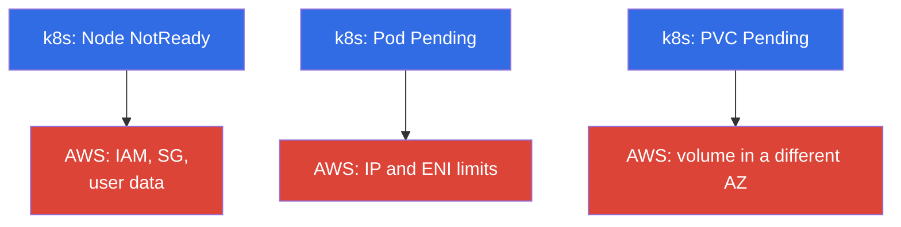
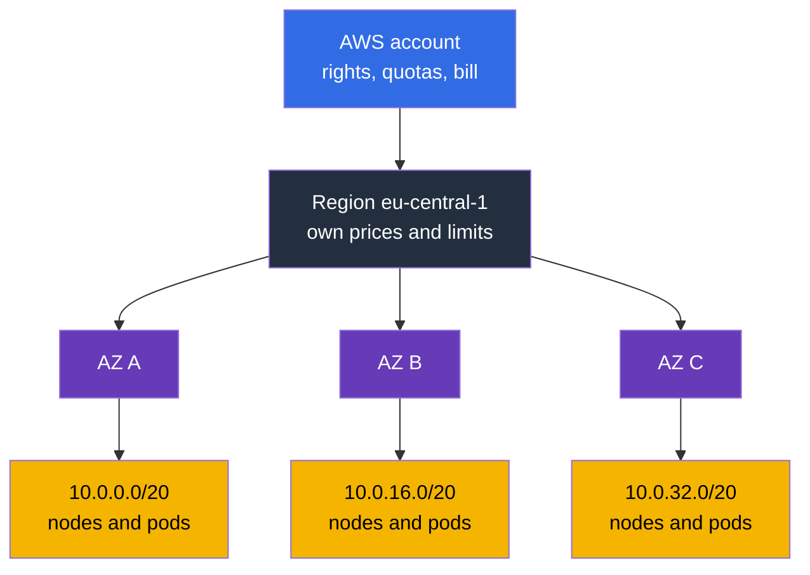
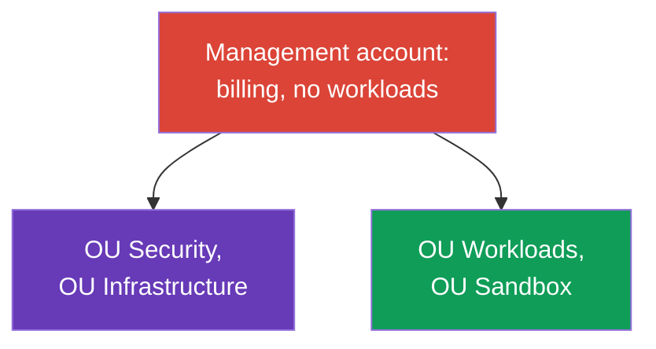
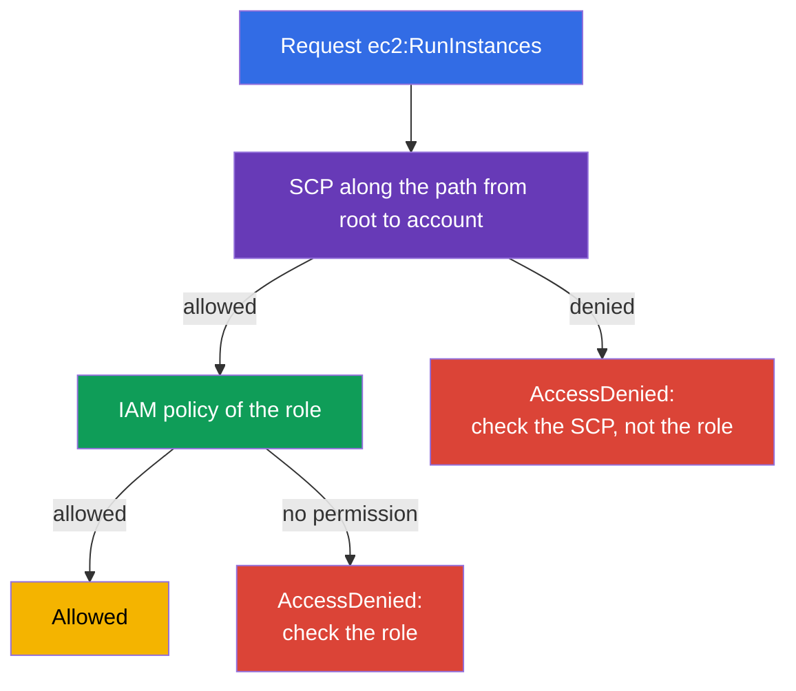
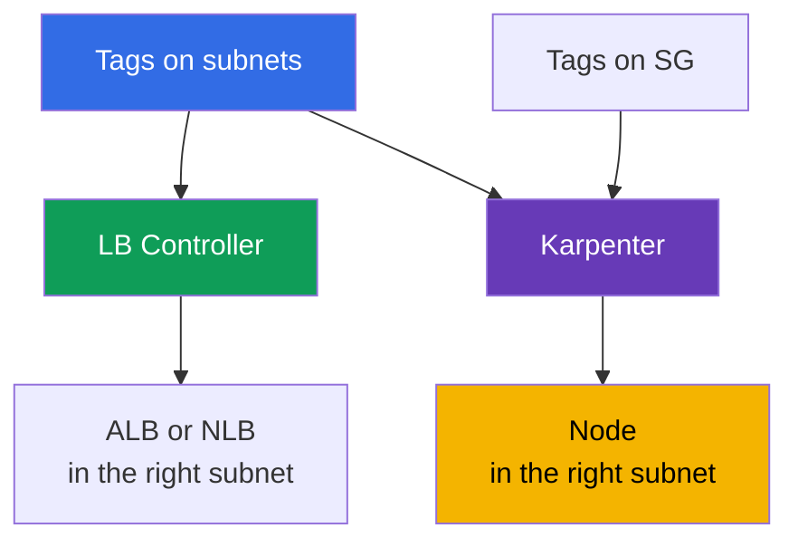

[Русская версия](ru.md) · [Versión en español](es.md) · [Version française](fr.md) · [Deutsche Version](de.md) · [ქართული ვერსია](ge.md) · [繁體中文版](tw.md) · [日本語版](jp.md)
# Chapter 0.1. AWS for a Kubernetes Engineer: Accounts, Regions, AZs, Quotas, Tags, Billing

> **What's next.** You came from CKA: kubectl, pods, Deployment, RBAC, and PV - familiar
> tools. In EKS they don't change, but underneath the cluster a second layer appears that
> didn't exist in kubeadm: account, region, availability zones, service limits, tags, and a
> bill at the end of the month. This chapter gives you the minimal AWS vocabulary, without
> which the chapters on networking, nodes, and cost read like a translation. IAM (chapter 0.2)
> and VPC (0.3) build on top of it next.

## Prerequisites

The course doesn't start from zero on AWS. It assumes you're already familiar with the basic
cloud framework, at least at the level of "I understand what this is about and can find it in
the console":

- **What a public cloud is and the pay-as-you-go model**: resources are created on demand
  through an API, and you pay for time and volume, not for hardware.
- **AWS global infrastructure**: regions, availability zones, edge locations and CDN, and the
  fact that services can be regional or global.
- **Basic services and their purpose**: EC2 (virtual machines), EBS (disks), S3 (object
  storage), VPC (networking), IAM (access), Route 53 (DNS), CloudWatch (metrics and logs), KMS
  (encryption keys), ELB (load balancers). Deep knowledge isn't required, just an understanding
  of what each one does.
- **Ways to manage resources**: the AWS console, aws cli, API and SDKs, the idea of
  infrastructure as code.
- **The general idea of shared responsibility** between the provider and the customer.

If something on this list is new, that's not a reason to stop: Part 0 fills in exactly what's
missing, but through the lens of EKS rather than as a full AWS course. The terms needed to
operate a cluster are covered here in detail; the rest of the cloud stays out of scope for this
course, and is best covered with AWS Cloud Practitioner-level material and the official service
documentation.

On the Kubernetes side, a CKA level is assumed: kubectl, workloads, Service and Ingress, RBAC,
PV and PVC, probes, debugging pods. These topics are not repeated in this course.

## 0.1.1. Why a Kubernetes engineer needs to understand how AWS is built

In a kubeadm cluster you owned everything: machines, network, disk, upgrades. In EKS the
control plane is managed by AWS, everything else remains yours, and almost every operational
problem traces back not to Kubernetes but to the AWS layer underneath it. A node doesn't come
up - wrong IAM role or security group. A pod is stuck in `Pending` - the subnet ran out of IPs.
The autoscaler isn't adding nodes - a vCPU quota. A PVC won't bind - the EBS volume is in a
different AZ. The bill doubled - traffic through NAT.

Formally this is the **shared responsibility model**: AWS is responsible for the security **of
the cloud** (hardware, hypervisor, the control plane and its patches), you're responsible for
security **in the cloud** (IAM, VPC and security groups, AMI and node versions, RBAC, secrets,
images). We break down this boundary in chapter 1; a managed service doesn't mean "everything
is done for you."

Visually this looks like two layers. On top the familiar Kubernetes, underneath the AWS layer,
where the real causes of most symptoms actually live:



Three typical symptoms in kubectl hide three categories of causes in AWS. The remaining cases
(no new nodes, LB without an address) reduce to the same categories: the first to IAM and SG,
the second to network limits.

The hierarchy that all of this fits into is also worth keeping in mind from the very first
chapter: the account sets rights, quotas, and the bill; the region sets geography; the
availability zones set the failure boundary; the subnets provide addresses for nodes and pods.



## 0.1.2. Account: the boundary of isolation, access, and billing

An **AWS account** is simultaneously a resource namespace, a rights boundary, and a billing
unit: resources in one account, by default, don't see resources in another. Every account has
a 12-digit number that you'll see constantly: in ARNs, in the trust policy for IRSA (chapter
16), in the ECR registry address (chapter 20).

```bash
# Who am I right now: account number, ARN of the current identity, userId
aws sts get-caller-identity
```

The **root user** is the account owner, logging in with an email and password. It can do
anything, including closing the account and changing billing details, and it cannot be
restricted by policies inside the account. The rule is simple: root is used once when the
account is created (enable MFA, set up working access) and never used again, while day-to-day
work goes through IAM roles and temporary keys (chapter 0.2).

As a company grows, a single account becomes cramped, and that's where **AWS Organizations**
comes in - the entire next section is about it.

| Boundary | What it isolates | What it looks like in EKS |
|---------|---------------|--------------------|
| **Account** | rights, quotas, bill, blast radius | `prod` separate from `dev` |
| **Region** | geography, prices, regional outage | the cluster lives in a single region |
| **AZ** | data center outage | subnets and nodes across 3 AZs |

## 0.1.3. AWS Organizations: how multi-account works in production

Let's start with the problem, not the definition. Imagine a company that lives in **one**
account: it has a prod EKS cluster, a test cluster, CI, a database, someone's machine learning
experiment, and a backup bucket. While the team is small, this works. Then some very concrete
things start to happen:

- **A load test in `dev` stops prod from scaling.** Quotas are counted per account and region
  (section 0.1.6): the test ate up the vCPU limit, and the prod cluster can't add nodes.
  Technically everything is fine, but there are no nodes.
- **One typo in Terraform reaches prod.** All resources share one space, so a wrong `-target`,
  someone else's workspace, or a "clean up everything unneeded" script takes out something it
  shouldn't have touched. The blast radius equals the entire business.
- **Rights can't be split honestly.** A developer needs access to the test cluster, and it
  turns out to be in the same IAM as the prod cluster. Policies grow conditions based on tags
  and names that nobody can fully verify, and eventually half the team ends up with
  `AdministratorAccess`.
- **A single leaked key compromises everything.** One account means one access boundary: a key
  from a test pipeline opens the same APIs as prod.
- **The bill can't be split by team.** All costs sit in one line, and separating team A's
  cluster from team B's cluster only works through tags that nobody enforces.
- **Audit logs live next to the workloads.** An administrator who broke or hid something has
  access to CloudTrail and can clean up the trail. That's unacceptable for audit purposes.
- **There's no way to forbid something permanently.** You want a rule like "in this
  environment you cannot create resources in other regions and cannot disable logging" - but
  inside an account, any administrator can lift that restriction, because they're an
  administrator.

The obvious answer is to **split accounts**: prod separate, test separate, experiments
separate. But naively "just create several accounts" creates a new set of problems: several
bills instead of one (and lost volume discounts), separate logins for each account, no shared
policy, copy-pasting basic settings for every new account, and no way to answer "how many
accounts do we even have and what's in them."

**AWS Organizations** is the answer to exactly this set of problems: a tree of accounts with a
shared bill, shared restrictions, and centralized management. The account remains a hard
boundary for rights, quotas, and blast radius, but it stops being an island. This matters to
an EKS engineer for two reasons: you need to understand which account your cluster lives in,
and why some settings aren't available to you even if you're an administrator in that account.

Building blocks:

- **Management account** (aka the payer) - the root of the organization. No workloads live
  here: only billing and organization management. Compromising this account means compromising
  the entire organization.
- **Member accounts** - working accounts: `prod`, `stage`, `dev`, network, shared services.
- **OU (Organizational Unit)** - a folder in the tree that policies are applied to. Accounts
  are grouped by OU, not by name.
- **SCP (Service Control Policy)** - a restricting policy on an OU or account. Important
  detail: an SCP **grants nothing**, it sets the maximum possible rights. Even an account
  administrator can't go beyond it, and `AdministratorAccess` inside an account doesn't
  override a denial from an SCP.
- **IAM Identity Center** - a single entry point: users and groups are the same, and access to
  a specific account is granted by a permission set for a limited time (chapter 0.2).
- **AWS Control Tower** - a ready-made implementation of everything listed above, covered right
  after the diagram.

A typical organization structure looks like this:



What's inside each OU and why these are separate accounts:

| OU | Accounts | What's in them | Why separate |
|----|----------|-----------|-----------------|
| Security | `log-archive`, `audit` | CloudTrail for the whole organization, GuardDuty, Config, Security Hub | an admin of a working account shouldn't be able to clean up logs about themselves |
| Infrastructure | `network`, `shared-services` | VPC and Transit Gateway, Route 53, shared ECR, CI, backup copies | networking and images are shared across all environments, with a single owner |
| Workloads | `prod`, `stage`, `dev` | one EKS cluster in each | own quotas, own rights, blast radius limited to the environment |
| Sandbox | `sandbox-*` | engineers' personal accounts | budget with auto-cleanup, no access to the shared network |

The cluster in the `prod` account isn't isolated even so: `network` hands it subnets through
RAM, it pulls images from `shared-services`, logs go to `log-archive`, backup copies go back to
`shared-services`. We cover these connections in chapters 20, 31, 32, and 41.

It's worth understanding separately how rights are computed in such a setup. An SCP doesn't
grant permissions: the resulting rights are the **intersection** of what the SCP allows along
the path from the root to the account, and what the IAM policy inside the account grants.
That's where the classic puzzle "the policy is correct, but there's no access" comes from:



This gives us a rule that saves hours: **an explicit Deny beats any Allow**. If a denial fired
in an SCP at any level along the path from root to account, expanding the IAM role is pointless
- neither `AdministratorAccess`, nor a new policy, nor extending the trust policy will restore
access, because Allow doesn't override Deny. The same is true inside the account: an explicit
Deny in an IAM policy beats any Allow. The practical order for debugging an `AccessDenied`:
first the SCP on the OU, then the role's permissions boundary, then the policy itself, and only
then RBAC inside the cluster (chapter 47). EKS engineers most often lose time doing it in the
opposite order, starting with the role.

### Landing zone and Control Tower

The diagram above isn't anyone's fantasy, it's a typical **landing zone**: a pre-built
organizational framework that workloads move into afterward. It includes the OU tree and
service accounts, a single sign-on and roles, mandatory guardrails, centralized logs and audit,
a baseline network layout, a tagging policy, and a way to produce new accounts that are all
identical. The point is simple: an account should be born already secure and uniform, not
configured by hand every time.

**AWS Control Tower** is a ready-made landing zone from AWS. It rolls out the structure
described above, creates accounts for logs and audit, turns on a set of **controls** (aka
guardrails), and provides an **account factory** - issuing a new account from a template,
complete with policies, logging, and access from day one. Controls come in three types:
**preventive** (forbid an action, technically an SCP), **detective** (find deviations through
AWS Config), and **proactive** (check CloudFormation templates before resources are created).
Separately, Control Tower watches for **drift**: if someone manually changed an OU, a policy,
or a service account setting, it's visible in the console.

Control Tower isn't the only path. Landing zones are also assembled by hand: with Terraform on
top of Organizations, through **Account Factory for Terraform (AFT)**, or through the Landing
Zone Accelerator. The choice affects who owns the baseline settings, but not the essence: the
framework is described as code and applied identically to every account.

### How much this costs and what to turn off at the start

The trap is that AWS doesn't charge for Control Tower itself: you pay for the services it
turns on. So the bill appears before the first pod runs in the cluster, and it's constant: it
doesn't depend on load or on weekends. For a small organization this is an unpleasant surprise
rather than a disaster, but you need to know the structure in advance.

| Line item | What you pay for | What drives growth |
|--------|----------------|----------------|
| **AWS Config** | recording a configuration item on every resource change, plus rule evaluations for detective controls | accounts x governed regions x resource churn. The main driver |
| S3 in `log-archive` | storing Config and CloudTrail logs | volume and retention period |
| CloudTrail | the first copy of management events in a region is free; data events and a second trail are paid | duplicate trails, enabling data events |
| Service Catalog | provisioning accounts through Account Factory | number of accounts issued |
| Supporting glue (Lambda, EventBridge, SNS, KMS) | service calls and keys | small and barely changes |
| AFT, if chosen | VPC endpoints by default plus a NAT Gateway for CodeBuild | hourly charge just for existing |
| Security Hub, GuardDuty, conformance packs | separate services, not part of the baseline landing zone | number of checks, event volume |
| Organizations, SCP, IAM Identity Center | no extra charge | - |

What you should estimate isn't "how much does Control Tower cost" but how many configuration
items there will be. It's calculated like this: the number of governed regions multiplied by
the number of accounts multiplied by how often your resources change. Then you apply the Config
price in your region. That's exactly why a landing zone with five accounts in one region and
the same landing zone across four regions differ by multiples at the same load.

For EKS there's a separate trap here: **Karpenter constantly creates and deletes instances,
ENIs, volumes, and security group rules**, and every such change is a configuration item. A
dynamic cluster generates a stream of records that a static node group never had. The Control
Tower documentation explicitly warns about Config cost growth on ephemeral workloads.

This is fixed in three ways, from gentle to drastic:

- **Daily recording instead of continuous** for noisy types: Config saves one record per day,
  and only if the state changed. You lose the intra-day timeline, but the flow of items drops.
  For a few Config service types (for example `AWS::Config::ResourceCompliance`), daily
  recording isn't supported, they're always recorded continuously.
- **Excluding types from the recorder's scope**: a "record everything except the listed types"
  strategy (`EXCLUSION_BY_RESOURCE_TYPES`). The candidates in dev and sandbox are exactly what
  Karpenter churns through: EC2 instances, network interfaces, volumes, security group rules.
- **Turning off the recorder entirely in a noisy account**: the path for non-prod that the
  Control Tower documentation itself officially suggests. The price is fair: detective controls
  stop working in that account and the change log disappears, so this isn't done for `prod`.

Starting with landing zone version 3.0, Control Tower already records global resources (IAM
roles, users, policies) only in the home region rather than in every region - that removes part
of the duplication on its own.

What a startup can skip at first and add later once there's a reason:

| What to postpone | Why it's okay | When to turn it on |
|--------------|--------------|----------------|
| Control Tower itself | Organizations, SCP, and Identity Center are free: an OU tree, a single org trail, and blocking extra regions give you 80% of the benefit for free | when accounts start being issued regularly and doing it by hand gets expensive |
| Extra governed regions | a Config recorder is installed in each one, multiplying the bill | when a DR region shows up (chapter 42) |
| Enrolling noisy dev and sandbox accounts | Config in them writes the most junk | when audit requirements appear for dev |
| Continuous recording of all types in Config | noisy types have daily recording and type exclusion | when you need an exact change timeline |
| Security Hub Service-Managed Standard | this is a separate billed service, turned on via a managed control | at the first compliance requirements (chapter 21) |
| GuardDuty | not part of the landing zone, turned on separately | when going to prod with real customer data |
| AFT or CfCT | AFT adds permanent infrastructure: endpoints and NAT | when there are dozens of accounts and you need a pipeline |
| CloudTrail data events and long retention | the most expensive part of audit | under a regulatory requirement, with lifecycle rules into cold storage |

Two points where saving money backfires. First: **a second CloudTrail trail on top of the org
trail** isn't savings, it's a duplicate of billed events, a separate trail is only set up for a
specific requirement. Second: **proactive controls check CloudFormation templates**, and if
your cluster is described with Terraform (chapter 4), they're not a defense - you can't rely on
them, and preventive controls, i.e. SCPs, take the place of restrictions.

The rollout order for a startup planning to eventually pass PCI DSS is covered in chapter 48 as
a separate adoption scenario: first the free framework, then detection, then the account
pipeline. The cost breakdown by service and tag is in chapter 43.

What matters here for an EKS engineer in practice:

- **You don't configure the account for a new cluster from scratch.** It arrives from the
  account factory already with logs, roles, guardrails, and usually a baseline network. Your
  job is the cluster, not the account plumbing.
- **Some settings aren't available to you, and that's normal.** You won't be able to disable
  CloudTrail, create a resource in a disallowed region, or remove encryption - a preventive
  control forbids it.
- **Deviations get noticed.** A resource created by hand, bypassing IaC, will surface as a
  non-compliance in Config or as landing zone drift. That's why the cluster and its plumbing
  are described as code (chapter 4).

What this gives an EKS cluster:

| Organizational property | Practical effect for EKS |
|----------------------|------------------------------|
| Quotas are counted per account and region | `dev` limits don't eat into `prod` capacity (section 0.1.6) |
| Blast radius is limited to the account | a mistake in IAM or Terraform doesn't reach the prod cluster |
| Consolidated billing | Savings Plans and volume discounts apply across all accounts (0.1.8) |
| SCP as guardrails | you can't disable logs, create a resource in a foreign region, or remove encryption |
| Centralized networking | the network account hands out subnets or transit (chapters 31 and 32) |
| Centralized services | shared ECR, backup copies in a separate account (chapters 20 and 41) |

Typical SCPs you'll run into as an engineer: forbidding all regions except the working ones;
forbidding disabling CloudTrail, Config, and GuardDuty; forbidding deleting logs and snapshots;
requiring volume encryption. It breaks like this: Terraform fails with `AccessDenied` with
perfectly correct IAM rights. The first thing to check isn't the role, it's the SCP on the OU.

```bash
# Is there an organization and who is the payer
aws organizations describe-organization

# All accounts and OUs (run from the management or delegated admin account)
aws organizations list-accounts --query 'Accounts[].[Id,Name,Status]' --output table
aws organizations list-organizational-units-for-parent --parent-id r-abcd

# Which SCPs are attached to a specific account or OU
aws organizations list-policies-for-target --target-id 123456789012 \
  --filter SERVICE_CONTROL_POLICY
```

Next comes EKS-specific multi-account behavior worth knowing in advance:

- **The cluster lives in one account**, but the resources around it live in others. The
  network can be shared: the network account shares subnets through **AWS RAM**, and the
  cluster comes up in someone else's (shared) subnets. In that case the tags on the subnets
  (section 0.1.7) are set by the network owner, not you, and tag alignment becomes part of the
  process.
- **Access to the cluster is granted to roles from other accounts.** An access entry can be
  created for a role that comes from the CI account or from Identity Center (chapter 5). This
  is normal practice: the deployment pipeline lives in the shared services account.
- **Images are pulled from a shared ECR** in another account, so you need a repository policy
  for cross-account pull (chapter 20).
- **Backups are copied to a separate account**, so that a compromise of the working account
  doesn't take the cluster's recovery points down along with it (chapter 41).
- **Security is monitored from the audit account.** GuardDuty, Config, and Security Hub are
  turned on for the entire organization through a delegated administrator, not by hand in every
  account (chapter 21).

How many accounts you need for clusters has no single answer. The minimum that almost always
works: keep `prod` separate from everything else, because the prod cluster has its own quotas,
its own rights, and its own maintenance window. Beyond that it's a choice between "one account
per environment" (simpler to manage, cheaper to administer) and "one account per team or
product" (better isolation and cost tracking, but more network plumbing and more clusters in
the fleet - chapter 44).

## 0.1.4. Region and Availability Zone

A **region** (`eu-central-1`, `us-east-1`) is a geographic location with its own set of
services and its own prices. Resources are tied to a region: a subnet from `eu-central-1`
can't be attached to a cluster in `us-east-1`, and an EKS cluster lives entirely within a
single region.

An **Availability Zone (AZ)** is one or more physically isolated data centers within a region:
its own power, cooling, network. Latency between AZs in the same region is low (a few
milliseconds), but the failure of one zone doesn't affect the others. Hence the main rule of
fault tolerance: **subnets in at least three AZs, nodes spread across AZs, workloads spread out
via topology spread constraints** (chapter 40). The AWS control plane already spans several
zones on its own, and you're responsible for the nodes: a cluster with a single node group in a
single AZ goes down with it.

A subtlety that trips everyone up: **an AZ name like `eu-central-1a` points to a different
physical zone in different accounts**. AWS shuffles the names so that customers don't all pile
into "the first" zone. The stable identifier is `ZoneId` (`euc1-az1`), which is the same across
all accounts, and in multi-account setups it's the one you should compare.

```bash
# All AZs in a region: name (unique per account) and stable ZoneId
aws ec2 describe-availability-zones \
  --region eu-central-1 \
  --query 'AvailabilityZones[].[ZoneName,ZoneId,State]' \
  --output table
```

Another consequence of how AZs work, which will hit you in chapter 23: **an EBS volume lives
in one AZ and only mounts to an instance in that same zone**. A pod with a PVC on `gp3` is tied
to its zone: if Karpenter brings up a node in a different AZ, the pod stays `Pending`. Hence
`WaitForFirstConsumer` in the StorageClass and shared storage through EFS (chapter 24).

## 0.1.5. ARN: how every AWS resource is addressed

An **ARN (Amazon Resource Name)** is a resource's unique identifier. It shows up in IAM
policies, ServiceAccount annotations, controller manifests, logs, and errors, so you need to be
able to read it at a glance. The general form is six fields separated by colons:
`arn:partition:service:region:account-id:resource`. Examples from this course:

- `arn:aws:iam::123456789012:role/eks-node-role` - an IAM role, IAM has no region.
- `arn:aws:eks:eu-central-1:123456789012:cluster/demo` - an EKS cluster.
- `arn:aws:s3:::my-bucket/path/*` - objects in a bucket, no region and no account.

`partition` is almost always `aws`, but there's also `aws-cn` and `aws-us-gov`: if you copy a
policy into one of those partitions, you'll need to change it.

A role's ARN is how a workload in the cluster gets rights in AWS, and it's specified
differently in the two mechanisms:

- **IRSA** (chapter 16): the role's ARN lives in the ServiceAccount annotation
  `eks.amazonaws.com/role-arn`, and the role itself trusts the cluster's OIDC provider. A
  mistake in the ARN or in the `sub` inside the trust policy looks like a permissions failure
  for the pod, not the node.
- **EKS Pod Identity** (chapter 17): there's no annotation, instead an association is created
  in the EKS API itself, where the role's ARN is passed explicitly:

```bash
# Link a role to a ServiceAccount without OIDC annotations
aws eks create-pod-identity-association \
  --cluster-name demo --namespace default \
  --service-account my-sa \
  --role-arn arn:aws:iam::123456789012:role/app-role
```

Practical takeaway: if a pod didn't get its permissions, first check which of the two
mechanisms grants the role, because the diagnostics differ - for IRSA you check the annotation
and the trust policy, for Pod Identity you check the association itself and the node agent.

## 0.1.6. Service quotas: why a cluster stops scaling

Every AWS service has **quotas (Service Quotas)** - limits per account and region. This isn't
a billing restriction, it's a protective ceiling, and a new account gets a low one.

| Service | Quota | How it hits the cluster |
|--------|-------|----------------------|
| `ec2` | Running On-Demand Standard instances (vCPU) | nodes aren't created when scaling |
| `ec2` | All Standard Spot Instance Requests (vCPU) | spot nodes don't come up (chapter 13) |
| `vpc` | Network interfaces per Region | no ENI, pods don't get an IP (chapter 6) |
| `ec2` | EC2-VPC Elastic IPs | can't create a NAT Gateway or a public address |
| `elasticloadbalancing` | Load Balancers per Region | a Service or Ingress doesn't get an LB |
| `eks` | Clusters per Region | can't create another cluster |

A typical scenario: load has grown, Karpenter or the Cluster Autoscaler tries to add nodes,
nothing appears in the cluster, and the Karpenter or Auto Scaling group events show
`VcpuLimitExceeded` or `MaxSpotInstanceCountExceeded`. The ceiling sits in AWS.

A separate class of limits is **API rate limits** (throttling): the call frequency to a
service's API, not the number of resources. With a large node fleet, controllers and the
autoscaler often hammer EC2 and Auto Scaling, and the response comes back as
`RequestLimitExceeded` or `Throttling`. This also grows along with EKS, but it's fixed not by
raising a quota but by polling less often and retrying with backoff.

```bash
# All EC2 quotas with current values; service codes - aws service-quotas list-services
aws service-quotas list-service-quotas \
  --service-code ec2 \
  --query 'Quotas[].[QuotaCode,QuotaName,Value]' \
  --output table

# Specific on-demand standard instances quota (limit in vCPUs) and requesting an increase
aws service-quotas get-service-quota --service-code ec2 --quota-code L-1216C47A
aws service-quotas request-service-quota-increase \
  --service-code ec2 --quota-code L-1216C47A --desired-value 256
```

In practice: before a load test or launching a prod cluster, quotas are checked and raised in
advance. Processing takes anywhere from minutes to days, and you usually need it exactly when
you can't afford to wait.

## 0.1.7. Tags: in EKS this isn't cosmetic

A **tag** is a key/value pair on an AWS resource. Tags are usually there for organization, but
in EKS part of the tagging is functional: controllers **find** resources by them, and removing
a tag breaks the mechanism, not just a report.



Tags that must be correct:

- `kubernetes.io/role/elb` = `1` on public subnets - where to place internet-facing load
  balancers (chapter 26).
- `kubernetes.io/role/internal-elb` = `1` on private subnets - for internal ones.
- `karpenter.sh/discovery` = cluster name on subnets and security groups - how Karpenter
  chooses where and with which SG to bring up nodes (chapter 12).
- `kubernetes.io/cluster/<cluster-name>` - a legacy marker of a resource belonging to a
  cluster, found in older configurations.

```bash
# Mark a subnet as public for internet-facing load balancers
aws ec2 create-tags --resources subnet-0a1b2c3d4e5f6a7b8 \
  --tags Key=kubernetes.io/role/elb,Value=1

# Check that Karpenter will find the right subnets
aws ec2 describe-subnets \
  --filters "Name=tag:karpenter.sh/discovery,Values=demo" \
  --query 'Subnets[].[SubnetId,AvailabilityZone]' --output table
```

The second role of tags is cost tracking. The mandatory minimum of `CostCenter`, `Owner`,
`Environment` is the foundation of cost allocation: this is how the bill breaks down in AWS
Cost Explorer and in Kubecost (chapter 43). A more complete policy adds `Team`, `Cluster`,
`ManagedBy` and helps find forgotten resources. Tags are set in Terraform as `default_tags`,
and across the organization they're enforced with Tag Policies and checked by AWS Config.

## 0.1.8. Billing: what an EKS cluster bill is made of

The "EKS" line in the bill is small: the service itself charges an hourly rate for the control
plane, while the real money goes to neighboring services.

| Line item | What you pay for | Note |
|--------|----------------|-----------|
| EKS control plane | hours the cluster runs | the same for a small and a large cluster |
| Extended support | a higher hourly rate for a cluster on a version outside standard support | turns on automatically, falling behind on versions costs money (chapter 3) |
| EC2 or Fargate | vCPU and memory for nodes or pods | usually the largest share (chapters 0.4, 15) |
| EBS, EFS, S3, ECR | volumes, snapshots, images | forgotten snapshots pile up for years |
| NAT Gateway | hourly rate plus every gigabyte | a classic surprise (chapter 31) |
| Load Balancers | hourly rate plus traffic | one per Service or Ingress |
| Data transfer | traffic between AZs and outbound | cross-zone traffic is billed both ways |
| CloudWatch | ingestion and storage of logs and metrics | can end up costing more than the nodes (chapter 34) |

A word on the **extended support** line separately. While the cluster version is within
standard support, the control plane's hourly rate is the same for everyone. Once the version's
standard support period ends, the cluster moves into extended support and that same hourly rate
goes up - with completely unchanged load. This is controlled by the `supportType` field in the
cluster's update policy (`STANDARD` or `EXTENDED`), and version timelines and the support model
are covered in chapter 3. Two details that catch people in practice: with `supportType:
STANDARD` the cluster gets force-upgraded once the period ends, and if you **roll back** a
version from standard to one that's already outside standard support, extended support charges
start accruing again (chapter 39). In other words, falling behind on versions is not just a
security risk, it's also a line on the bill.

```bash
# What support period the cluster is in and which update policy is selected
aws eks describe-cluster --name demo \
  --query 'cluster.[version,upgradePolicy.supportType]' --output table
```

Surprises almost always show up in two places. First - **NAT Gateway**: a cluster that pulls
images and reaches S3 or ECR through NAT pays for traffic that can be avoided with VPC
endpoints (chapter 31). Second - **cross-AZ traffic**: chatty services across three zones
produce a constant bill, and that's the deliberate cost of fault tolerance.

```bash
# Monthly cost breakdown by service; by tag - --group-by Type=TAG,Key=Cluster
aws ce get-cost-and-usage \
  --time-period Start=2025-01-01,End=2025-02-01 \
  --granularity MONTHLY --metrics "UnblendedCost" \
  --group-by Type=DIMENSION,Key=SERVICE
```

An important detail: **cost allocation tags are turned on manually** in the Billing section,
and data only appears from the moment of activation, you can't get it retroactively. That's
why cost tracking tags are turned on from day one. OpenCost, Kubecost, and right-sizing are
covered in chapter 43.

## 0.1.9. How to practice cheaply and without risk

- **A separate account for learning.** Your own account or sandbox isolates experiments from
  working resources and gives you an honest picture of what the course costs.
- **A budget and alarms from day one.** AWS Budgets with a notification on threshold and
  forecast is cheaper than finding out about a forgotten NAT Gateway a month later.
- **Delete everything after each session.** A cluster, NAT Gateway, load balancers, and EIPs
  are billed for existing, not for being used. Pick the **region** closest to you.

```bash
# Current account budgets: the threshold and notifications are set up once
aws budgets describe-budgets --account-id 123456789012
```

The course labs are built so that the environment spins up and tears down with a single
command through Terragrunt: `apply` creates everything needed, `destroy` leaves no billed
leftovers (chapter 0.5).

## 0.1.10. How this is applied in production

Organization and accounts:

- **Multi-account by default.** `prod`, `stage`, and `dev` in separate accounts: isolated
  rights, independent quotas, a clear per-environment bill. The prod cluster doesn't share an
  account with anything else.
- **An empty management account.** It holds only billing and Organizations, no workloads and
  no clusters. Access to it belongs to a handful of people, with MFA.
- **A landing zone built from code.** The OU tree, log and audit accounts, and baseline
  guardrails are rolled out by Control Tower or in-house code, not by hand from the console. A
  new account is issued from a template: the same SCPs, the same tags, the same set of roles.
- **SCP as insurance against human error.** Allowed regions, a ban on disabling CloudTrail,
  Config, and GuardDuty, a ban on deleting logs and snapshots, mandatory encryption. On
  `AccessDenied` in Terraform, SCPs are checked before IAM policies.
- **Single sign-on through Identity Center.** Not a single IAM user with long-lived keys:
  time-limited roles, permission sets for groups, a separate break-glass role with an alert on
  use (chapter 0.2).
- **Networking, images, logs, and backups are centralized.** The network account hands out
  subnets through RAM or connectivity goes through Transit Gateway, images live in a shared
  ECR, backup copies go to a separate account, security is monitored from the audit account
  through a delegated administrator (chapters 20, 21, 31, 32, 41).

The cluster and money:

- **Three AZs as the norm.** Subnets and node groups span at least three zones, critical
  workloads are spread out via topology spread and PDBs (chapter 40).
- **Quotas on the launch checklist.** Before going to prod and before a load test, limits on
  vCPU, ENI, EIP, and load balancers are checked. Quotas are requested per account separately:
  an increase in `dev` doesn't apply in `prod`.
- **Tags are applied by code.** `default_tags` in Terraform, mandatory keys enforced by Tag
  Policies, compliance checked by AWS Config. Manual tagging doesn't survive.
- **FinOps as a process.** Cost Explorer broken down by account and tag, budgets with alarms
  per account, reviewing traffic and NAT growth. Cost is a metric just like latency and
  availability.

## 0.1.11. Mini glossary

- **Account** - an isolated space of resources and a billing unit; the 12-digit number appears
  in ARNs and trust policies.
- **Root user** - the account owner with unrestricted rights, needed only for initial setup.
- **AWS Organizations** - a tree of accounts with shared billing and shared restrictions.
  **Management account** - the root payer account, no workloads are kept there.
  **OU** - a group of accounts that policies are applied to.
- **SCP (Service Control Policy)** - a restricting policy on an OU or account: it sets a
  maximum on rights and grants nothing itself.
- **Landing zone** - a pre-built organizational framework: OUs, service accounts, guardrails,
  logs, access, and a way to issue uniform accounts. **AWS Control Tower** - a ready-made
  landing zone from AWS: controls (preventive, detective, proactive), drift detection, and an
  account factory. **IAM Identity Center** - single sign-on and access issued via permission
  sets.
- **AWS RAM** - sharing resources between accounts, for example shared subnets for a cluster.
  **Delegated administrator** - an account that the organization delegates management of a
  service to (GuardDuty, Config, Security Hub, Backup).
- **Consolidated billing** - a shared organization bill; volume discounts and Savings Plans
  apply across all accounts.
- **Region** - a geographic location (`eu-central-1`) that resources are tied to.
- **Availability Zone (AZ)** - an isolated data center within a region, the foundation of
  reliability. **ZoneId** (`euc1-az1`) - its stable name across all accounts.
- **ARN** - `arn:partition:service:region:account-id:resource`, a resource's address.
- **Service Quotas** - service limits per account and region, raised on request.
- **Tag** - a key/value pair; EKS controllers find resources by tags, and an activated **cost
  allocation tag** is used in billing to break down the bill.
- **Shared responsibility** - AWS is responsible for the security of the cloud, you're
  responsible for security in the cloud.

## 0.1.12. Chapter summary

- The account is the boundary of rights, quotas, and the bill; root isn't used day to day,
  access goes through IAM roles and temporary keys (chapter 0.2).
- In production there are many accounts: an empty management account, service accounts for
  logs and audit, network and shared services, and working accounts per environment. The prod
  cluster lives in its own account.
- An SCP on an OU sets a maximum on rights and doesn't grant them: an unexpected `AccessDenied`
  with a correct IAM policy is almost always an SCP. Landing zones and new accounts are issued
  from code.
- Multi-account changes the cluster's plumbing: subnets arrive through RAM from the network
  account, access is granted to roles from other accounts, images are pulled from a shared
  ECR, backups are copied to a separate account (chapters 5, 20, 31, 32, 41).
- The region sets geography and prices, the AZ sets failure isolation. Multi-AZ is mandatory,
  and AZ names don't match across accounts: compare `ZoneId`. An EBS volume lives in one AZ, so
  a pod with a PVC is tied to a zone (chapter 23).
- An ARN reads as six fields; vCPU, ENI, and EIP quotas are the reason behind "no new nodes."
- The `kubernetes.io/role/elb` and `karpenter.sh/discovery` tags are functional: controllers
  find resources by them. The other tags are for cost tracking.
- The bill is made up of the control plane, EC2/Fargate, storage, load balancers, NAT, traffic,
  and logs. Surprises are almost always in traffic and NAT (chapters 31 and 43).

## 0.1.13. How this comes in handy in real work

An incident review starts with the questions "which account, which region, which AZ," and part
of the problem is often already solved at that step. Cluster planning starts with quotas and
an address plan, not with manifests. A conversation with the business about cost is only
possible once tags are in place and Cost Explorer shows a breakdown by team. And the most
common one: when nodes don't show up, you check not just `kubectl describe` but also the AWS
quotas.

## 0.1.14. Self-check questions

1. What does an AWS account isolate, and why is `prod` given a separate account?
2. What is the root user for, and why isn't it used for everyday work?
3. What are an OU and an SCP? Why can't an SCP grant anything?
4. Terraform fails with `AccessDenied`, and the role's IAM policy looks correct. Where do you
   look?
5. Why aren't clusters and workloads placed in the management account?
6. How can an EKS cluster use subnets from another account, and who is responsible for their
   tags?
7. How does a region differ from an AZ, and why is a cluster placed across at least three AZs?
8. Why can `eu-central-1a` be different zones in two accounts, and what should you compare
   instead?
9. Read `arn:aws:eks:eu-central-1:123456789012:cluster/demo` field by field.
10. The autoscaler isn't adding nodes, and there are no errors in Kubernetes. Where do you look
    in AWS?
11. Which tags on subnets does the AWS Load Balancer Controller and Karpenter need?
12. What is a cluster's bill made up of, and why are cost allocation tags turned on in advance?

## Practice

Part 0 has no labs of its own: it's the foundation the rest of the chapters stand on. Practice
starts in Part 1, when you bring up an EKS cluster with Terragrunt. Next comes IAM: policies,
roles, and temporary keys, without which neither cluster access nor pod access works in EKS.

---
[Table of Contents](../README.md) · [Chapter 0.2](../00-2-iam/en.md)
