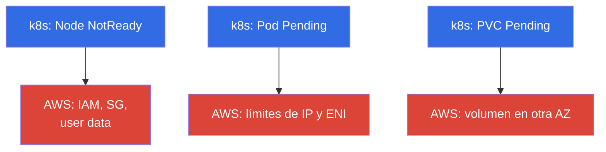
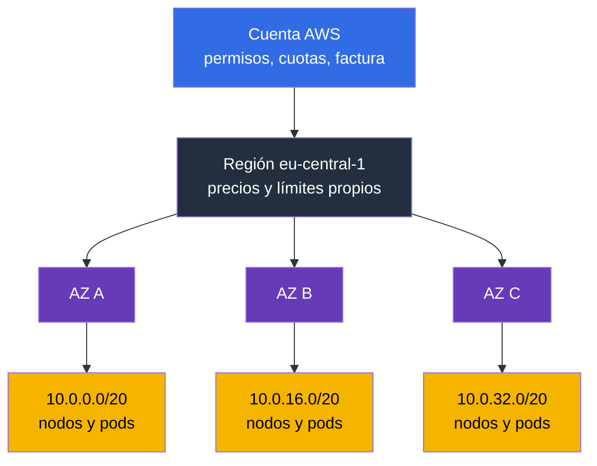
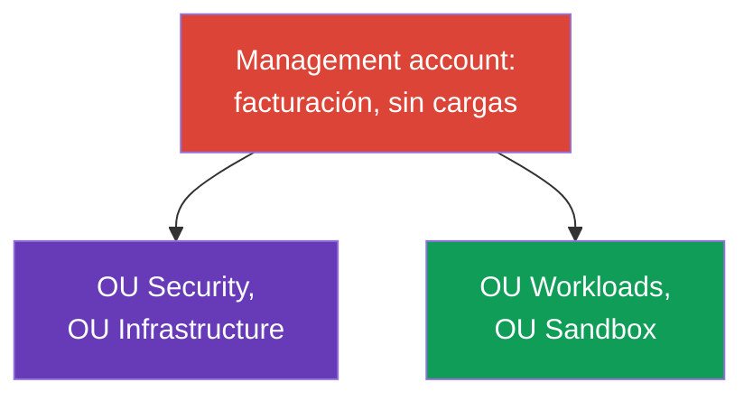
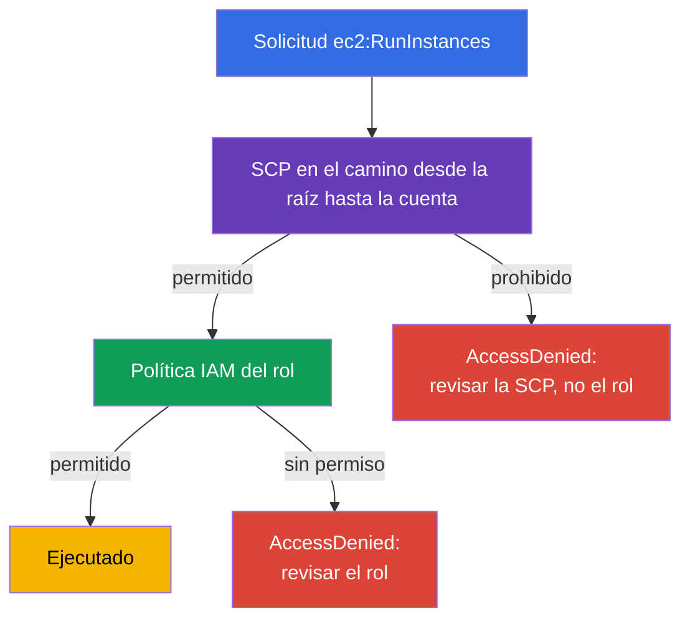
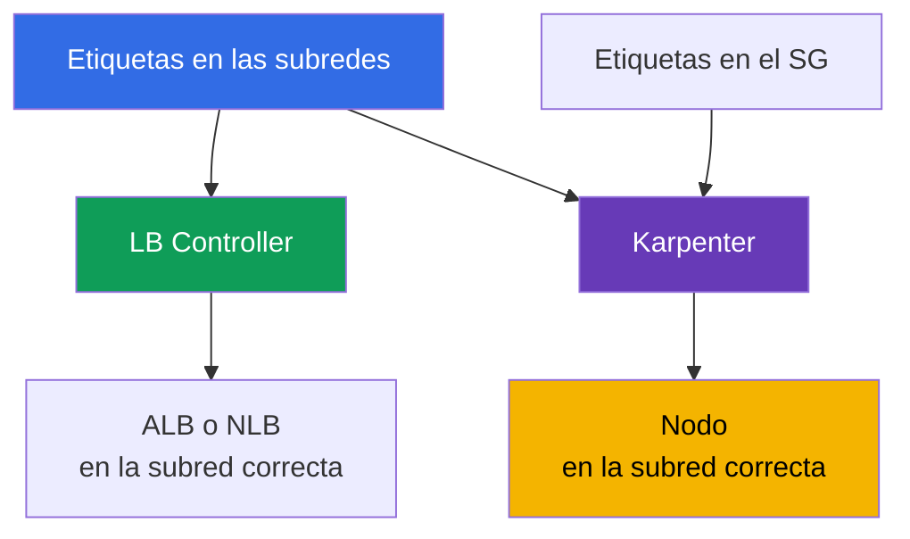

[Русская версия](ru.md) · [Eng version](en.md) · [Version française](fr.md) · [Deutsche Version](de.md) · [ქართული ვერსია](ge.md) · [繁體中文版](tw.md) · [日本語版](jp.md)
# Capítulo 0.1. AWS para el ingeniero de Kubernetes: cuentas, regiones, AZ, cuotas, etiquetas, facturación

> **Qué sigue.** Vienes de CKA: kubectl, pods, Deployment, RBAC y PV son herramientas
> familiares. En EKS no cambian, pero debajo del clúster aparece una segunda capa que no
> existía en kubeadm: cuenta, región, zonas de disponibilidad, límites de servicio, etiquetas
> y una factura a fin de mes. Este capítulo da el vocabulario mínimo de AWS, sin el cual los
> capítulos sobre red, nodos y costo se leen como una traducción. Sobre él se apoyan luego
> IAM (capítulo 0.2) y VPC (0.3).

## Prerrequisitos

El curso no empieza desde cero en AWS. Se asume que el andamiaje básico de la nube ya te es
familiar, al menos al nivel de «entiendo de qué se trata y lo encuentro en la consola»:

- **Qué es la nube pública y el modelo de pago por consumo**: los recursos se crean a demanda
  a través de una API, pagas por tiempo y volumen, no por hardware.
- **Infraestructura global de AWS**: regiones, zonas de disponibilidad, ubicaciones edge y
  CDN, y el hecho de que los servicios pueden ser regionales o globales.
- **Servicios básicos y su propósito**: EC2 (máquinas virtuales), EBS (discos), S3
  (almacenamiento de objetos), VPC (red), IAM (acceso), Route 53 (DNS), CloudWatch (métricas y
  logs), KMS (claves de cifrado), ELB (balanceadores). No se necesita conocimiento profundo,
  basta con entender qué hace cada uno.
- **Formas de gestión**: consola de AWS, aws cli, API y SDK, la idea de infraestructura como
  código.
- **La idea general del reparto de responsabilidades** entre el proveedor y el cliente.

Si algo de la lista es nuevo, no es motivo para detenerse: precisamente la Parte 0 completa lo
que falta, pero en el contexto de EKS, no como un curso completo de AWS. Los términos
necesarios para operar el clúster se explican aquí en detalle; el resto de la nube queda fuera
del alcance del curso, y conviene cubrirlo con materiales del nivel AWS Cloud Practitioner y la
documentación oficial de los servicios.

Del lado de Kubernetes se asume el nivel de CKA: kubectl, cargas de trabajo, Service e
Ingress, RBAC, PV y PVC, probes, depuración de pods. Estos temas no se repiten en el curso.

## 0.1.1. Por qué el ingeniero de Kubernetes necesita entender la estructura de AWS

En un clúster kubeadm eras dueño de todo: máquinas, red, disco, actualizaciones. En EKS el
control plane lo atiende AWS, todo lo demás sigue siendo tuyo, y casi todos los problemas
operativos no están en Kubernetes sino en el AWS que hay debajo. Un nodo no arranca: no es el
rol IAM correcto o el security group. Un pod queda en `Pending`: se acabaron las IP en la
subred. El Autoscaler no agrega nodos: cuota de vCPU. Un PVC no se enlaza: el volumen EBS está
en otra AZ. La factura se duplicó: tráfico por NAT.

Formalmente esto es el **modelo de responsabilidad compartida** (shared responsibility): AWS
responde por la seguridad **de la nube en sí** (hardware, hipervisor, control plane y sus
parches), tú respondes por la seguridad **en la nube** (IAM, VPC y security groups, versiones
de AMI y de nodos, RBAC, secretos, imágenes). La frontera se analiza en el capítulo 1; que sea
un servicio administrado no significa que «hagan todo por ti».

Visualmente esto se ve como dos capas. Arriba el Kubernetes habitual, abajo la capa de AWS, en
la que están las verdaderas causas de la mayoría de los síntomas:



Tres síntomas típicos en kubectl esconden tres categorías de causas en AWS. Los demás casos
(no hay nodos nuevos, el LB sin dirección) se reducen a las mismas categorías: el primero a IAM
y SG, el segundo a límites de red.

La jerarquía en la que encaja todo esto también vale la pena tenerla presente desde el primer
capítulo: la cuenta define los permisos, las cuotas y la factura; la región, la geografía; las
zonas de disponibilidad, el límite de fallo; las subredes, las direcciones para nodos y pods.



## 0.1.2. Cuenta: frontera de aislamiento, acceso y factura

La **cuenta de AWS** es a la vez un espacio de nombres de recursos, una frontera de permisos y
una unidad de facturación: los recursos de una cuenta, por defecto, no ven los recursos de
otra. La cuenta tiene un número de 12 dígitos que verás constantemente: en el ARN, en la trust
policy para IRSA (capítulo 16), en la dirección del registro ECR (capítulo 20).

```bash
# Quién soy ahora: número de cuenta, ARN de la identidad actual, userId
aws sts get-caller-identity
```

El **usuario root** es el propietario de la cuenta, con acceso por email y contraseña. Puede
hacerlo todo, incluido cerrar la cuenta y cambiar los datos de pago, y no se puede restringir
con políticas dentro de la cuenta. La regla es simple: root se usa una sola vez al crear la
cuenta (activar MFA, crear un acceso de trabajo) y nunca más, mientras que el trabajo diario
pasa por roles IAM y claves temporales (capítulo 0.2).

Cuando la empresa crece, una sola cuenta se queda estrecha y aparece **AWS Organizations**: la
siguiente sección trata enteramente sobre esto.

| Frontera | Qué aísla | Cómo se ve en EKS |
|---------|---------------|--------------------|
| **Cuenta** | permisos, cuotas, factura, radio de explosión | `prod` separado de `dev` |
| **Región** | geografía, precios, fallo de región | el clúster vive en una sola región |
| **AZ** | fallo de datacenter | subredes y nodos en 3 AZ |

## 0.1.3. AWS Organizations: cómo se estructura la multicuenta en producción

Empecemos por el problema, no por la definición. Imagina una empresa que vive en **una sola**
cuenta: ahí está el clúster EKS de producción, el clúster de pruebas, el CI, la base de datos,
el experimento de machine learning de alguien y un bucket con backups. Mientras el equipo es
pequeño, esto funciona. Después empiezan a pasar cosas muy concretas:

- **Una prueba de carga en `dev` detiene el escalado de producción.** Las cuotas se cuentan
  por cuenta y región (sección 0.1.6): la prueba consumió el límite de vCPU, y el clúster de
  producción no agrega nodos. Técnicamente todo está en orden, pero no hay nodos.
- **Un solo error de tipeo en Terraform alcanza a producción.** Todos los recursos están en un
  solo espacio, así que un `-target` incorrecto, un workspace ajeno o un script de limpieza de
  «todo lo que no se necesita» se lleva algo que no debía tocarse. El radio de explosión es
  igual a todo el negocio.
- **Los permisos no se pueden separar honestamente.** El desarrollador necesita acceso al
  clúster de pruebas, y resulta que está en el mismo IAM que el clúster de producción. Las
  políticas se cargan de condiciones por etiquetas y nombres, nadie puede verificarlas por
  completo, y al final la mitad del equipo tiene `AdministratorAccess`.
- **La filtración de una sola clave compromete todo.** Una cuenta, una frontera de acceso: una
  clave del pipeline de pruebas abre las mismas API que producción.
- **La factura no se puede repartir por equipos.** Todos los gastos están en una sola línea, y
  separar el clúster del equipo A del clúster del equipo B solo se logra con etiquetas cuya
  disciplina nadie mantiene.
- **Los logs de auditoría están junto a las cargas.** Un administrador que rompió o escondió
  algo tiene acceso a CloudTrail y puede borrar el rastro. Para una auditoría esto es
  inaceptable.
- **No hay manera de prohibir algo para siempre.** Quieres una regla del tipo «en este entorno
  no se pueden crear recursos en regiones ajenas ni desactivar el registro de logs», pero
  dentro de la cuenta cualquier administrador puede quitar esa restricción, porque es
  administrador.

La respuesta obvia es **separar las cuentas**: producción por su lado, pruebas por su lado,
experimentos por su lado. Pero el ingenuo «simplemente crear varias cuentas» genera un nuevo
conjunto de problemas: varias facturas en lugar de una (y descuentos por volumen perdidos),
logins separados en cada cuenta, ninguna política común, copiar y pegar la configuración base
en cada cuenta nueva, y ninguna respuesta a la pregunta «cuántas cuentas tenemos en total y qué
hay en ellas».

**AWS Organizations** es la respuesta exacta a este conjunto de problemas: un árbol de cuentas
con una factura común, restricciones comunes y gestión centralizada. La cuenta sigue siendo una
frontera rígida de permisos, cuotas y radio de explosión, pero deja de ser una isla. Para el
ingeniero de EKS esto es importante por dos razones: debe entender en qué cuenta vive su
clúster, y por qué parte de la configuración no está a su alcance, aunque sea administrador de
la cuenta.

Elementos de la construcción:

- **Management account** (también llamada payer) - la raíz de la organización. En ella no se
  alojan cargas: solo facturación y gestión de la organización. Comprometer esta cuenta
  significa comprometer toda la organización.
- **Member accounts** - cuentas de trabajo: `prod`, `stage`, `dev`, la de red, la de servicios
  comunes.
- **OU (Organizational Unit)** - carpeta en el árbol a la que se aplican políticas. Las cuentas
  se agrupan por OU, no por nombre.
- **SCP (Service Control Policy)** - política restrictiva sobre una OU o cuenta. Detalle
  importante: la SCP **no permite nada**, define el máximo de permisos posibles. Ni siquiera el
  administrador de la cuenta puede salirse de ese marco, y `AdministratorAccess` dentro de la
  cuenta no anula una prohibición de la SCP.
- **IAM Identity Center** - un punto único de entrada: los usuarios y grupos son los mismos, y
  el acceso a una cuenta concreta se otorga con un permission set temporal (capítulo 0.2).
- **AWS Control Tower** - una implementación lista de todo lo anterior, de la que se habla justo
  después del esquema.

La estructura típica de una organización se ve así:



Qué hay dentro de cada OU y por qué son cuentas separadas:

| OU | Cuentas | Qué contienen | Por qué separado |
|----|----------|-----------|-----------------|
| Security | `log-archive`, `audit` | CloudTrail de toda la organización, GuardDuty, Config, Security Hub | el administrador de una cuenta de trabajo no debe poder limpiar los logs sobre sí mismo |
| Infrastructure | `network`, `shared-services` | VPC y Transit Gateway, Route 53, ECR común, CI, copias de backups | la red y las imágenes son comunes a todos los entornos, y tienen un solo propietario |
| Workloads | `prod`, `stage`, `dev` | un clúster EKS en cada una | cuotas propias, permisos propios, radio de explosión limitado al entorno |
| Sandbox | `sandbox-*` | cuentas personales de los ingenieros | presupuesto con autolimpieza, sin acceso a la red común |

El clúster en la cuenta `prod`, sin embargo, no está aislado: las subredes se las entrega
`network` vía RAM, las imágenes las obtiene de `shared-services`, los logs van a
`log-archive`, las copias de backups van de vuelta a `shared-services`. Estas relaciones se
analizan en los capítulos 20, 31, 32 y 41.

Aparte, conviene entender cómo se calculan los permisos en esta construcción. La SCP no otorga
permisos: los permisos finales son la **intersección** entre lo que permite la SCP en el
camino desde la raíz hasta la cuenta, y lo que da la política IAM dentro de la cuenta. De ahí
el típico misterio de «la política es correcta pero no hay acceso»:



De esto se deriva una regla que ahorra horas: **un Deny explícito vence a cualquier Allow**. Si
la prohibición actuó en la SCP en cualquier nivel del camino desde la raíz hasta la cuenta,
ampliar el rol IAM no sirve de nada: ni `AdministratorAccess`, ni una política nueva, ni un
añadido a la trust policy devolverán el acceso, porque Allow no anula Deny. Lo mismo vale
dentro de la cuenta: un Deny explícito en una política IAM es más fuerte que cualquier Allow.
Orden práctico para analizar un `AccessDenied`: primero la SCP en la OU, luego el permissions
boundary del rol, luego la política misma, y solo después el RBAC dentro del clúster (capítulo
47). Los ingenieros de EKS con más frecuencia pierden tiempo al revés, empezando por el rol.

### Landing zone y Control Tower

El esquema anterior no es fantasía de nadie, sino una **landing zone** típica: un andamiaje de
organización preparado de antemano, en el que luego se instalan las cargas. Incluye el árbol
de OU y las cuentas de servicio, un inicio de sesión y roles únicos, guardrails obligatorios,
logs y auditoría centralizados, un esquema de red básico, una política de etiquetado y una
forma de emitir cuentas nuevas idénticas entre sí. La idea es simple: la cuenta debe nacer ya
segura y homogénea, no configurarse a mano cada vez.

**AWS Control Tower** es una landing zone lista de AWS. Despliega la estructura descrita, crea
las cuentas de logs y auditoría, activa un conjunto de **controls** (también llamados
guardrails) y ofrece un **account factory**: la emisión de una cuenta nueva a partir de una
plantilla, ya con políticas, registro de logs y acceso. Los controls se dividen en tres tipos:
**preventive** (prohíben una acción, técnicamente es una SCP), **detective** (detectan
desviaciones mediante AWS Config) y **proactive** (verifican plantillas de CloudFormation antes
de crear los recursos). Aparte, Control Tower vigila el **drift**: si alguien cambió a mano una
OU, una política o la configuración de una cuenta de servicio, esto se ve en la consola.

Control Tower no es el único camino. Las landing zone también se construyen a mano: con
Terraform sobre Organizations, mediante **Account Factory for Terraform (AFT)** o mediante
Landing Zone Accelerator. La elección influye en quién es dueño de la configuración base, pero
no en la esencia: el andamiaje está descrito como código y se aplica igual a todas las
cuentas.

### Cuánto cuesta esto y qué desactivar al inicio

La trampa está en que AWS no cobra por Control Tower en sí: pagas por los servicios que
activa. Por eso la factura aparece antes de que se levante el primer pod en el clúster, y es
constante: no depende ni de la carga ni de los fines de semana. Para una organización pequeña
esto es una sorpresa desagradable, no una catástrofe, pero conviene conocer la estructura de
antemano.

| Partida | Por qué pagas | De qué depende su crecimiento |
|--------|----------------|----------------|
| **AWS Config** | registro de un configuration item en cada cambio de recurso, más evaluaciones de reglas de detective controls | cuentas x regiones governed x volatilidad de recursos. El principal factor |
| S3 en `log-archive` | almacenamiento de logs de Config y CloudTrail | volumen y tiempo de retención |
| CloudTrail | la primera copia de eventos de management en la región es gratis; se paga por data events y un segundo trail | trails duplicados, activación de data events |
| Service Catalog | aprovisionamiento de cuentas vía Account Factory | número de emisiones de cuentas |
| Componentes auxiliares (Lambda, EventBridge, SNS, KMS) | llamadas y claves de servicio | poco y casi no cambia |
| AFT, si se elige | por defecto VPC endpoints más NAT Gateway para CodeBuild | pago por hora por su existencia |
| Security Hub, GuardDuty, conformance packs | servicios aparte, no forman parte de la landing zone base | número de verificaciones, volumen de eventos |
| Organizations, SCP, IAM Identity Center | sin costo adicional | - |

Hay que evaluar no «cuánto cuesta Control Tower», sino cuántos configuration item habrá. Se
calcula así: número de regiones governed, multiplicado por el número de cuentas, multiplicado
por la frecuencia con la que cambian tus recursos. Luego se aplica el precio de Config en tu
región. Por eso una landing zone de cinco cuentas en una región y esa misma landing zone en
cuatro regiones difieren en múltiplos con la misma carga.

Para EKS aquí hay una trampa aparte: **Karpenter crea y elimina instancias, ENI, volúmenes y
reglas de security group constantemente**, y cada uno de esos cambios es un configuration
item. Un clúster dinámico genera un flujo de registros que no existía con un node group
estático. La documentación de Control Tower advierte directamente sobre el crecimiento del
costo de Config en cargas efímeras.

Esto se trata de tres maneras, de la más suave a la más dura:

- **daily recording en lugar de continuous** para los tipos ruidosos: Config guarda un
  registro por día, y solo si el estado cambió. Se pierde la cronología dentro del día, pero
  el flujo de CI cae. Para varios tipos de servicio de Config (por ejemplo
  `AWS::Config::ResourceCompliance`) el daily recording no está soportado, siempre se
  registran de forma continua.
- **exclusión de tipos del alcance del recorder**: la estrategia «registrar todo excepto lo
  enumerado» (`EXCLUSION_BY_RESOURCE_TYPES`). Los candidatos en dev y sandbox son justo lo que
  Karpenter tritura: instancias EC2, interfaces de red, volúmenes, reglas de security group.
- **apagar el recorder por completo en la cuenta ruidosa**: la vía para non-prod que la propia
  documentación de Control Tower recomienda de forma oficial. El precio es honesto: en esa
  cuenta dejan de funcionar los detective controls y desaparece el registro de cambios, por lo
  que en `prod` no se hace así.

A partir de la versión 3.0 de la landing zone, Control Tower ya registra los recursos globales
(roles IAM, usuarios, políticas) solo en la región home, no en cada una; esto elimina parte de
la duplicación por sí solo.

Lo que una startup puede no activar de inmediato, y agregar cuando aparezca una razón:

| Qué posponer | Por qué se puede | Cuándo activarlo |
|--------------|--------------|-----------------|
| Control Tower en sí | Organizations, SCP e Identity Center son gratis: el árbol de OU, un org-trail y la prohibición de regiones innecesarias dan el 80% del beneficio sin costo | cuando las cuentas empiezan a emitirse regularmente y hacerlo a mano ya es costoso |
| Regiones governed de más | el recorder de Config se instala en cada una, la factura se multiplica | al aparecer una región DR (capítulo 42) |
| Enrollment de cuentas dev y sandbox ruidosas | Config en ellas escribe la mayor cantidad de ruido | cuando en dev aparezcan requisitos de auditoría |
| Registro continuo de todos los tipos en Config | para los tipos ruidosos existen daily recording y exclusión de tipos | cuando se necesita una cronología exacta de cambios |
| Security Hub Service-Managed Standard | es un servicio tarificado aparte, se activa mediante un control de gestión | ante los primeros requisitos de compliance (capítulo 21) |
| GuardDuty | no forma parte de la landing zone, se activa por separado | al salir a producción con datos reales de clientes |
| AFT o CfCT | AFT agrega infraestructura permanente: endpoints y NAT | cuando hay decenas de cuentas y se necesita un pipeline |
| Data events de CloudTrail y retención larga | la parte más cara de la auditoría | bajo un requisito regulatorio, con lifecycle hacia almacenamiento frío |

Dos puntos donde el ahorro se vuelve en tu contra. Primero: **un segundo trail de CloudTrail
sobre el org-trail** no es un ahorro, sino una duplicación de eventos tarificados, un trail
propio se crea solo bajo un requisito concreto. Segundo: **los proactive controls verifican
plantillas de CloudFormation**, y si tu clúster está descrito con Terraform (capítulo 4), no
son una protección real, no se puede confiar en ellos, y el lugar de las prohibiciones lo
ocupan los preventive controls, es decir la SCP.

El orden de activación para una startup que planea con el tiempo pasar por PCI DSS se analiza
en el capítulo 48 como un escenario de implementación aparte: primero el andamiaje gratuito,
luego la detección, luego el pipeline de cuentas. El desglose de gastos por servicios y
etiquetas está en el capítulo 43.

Qué es importante de todo esto para el ingeniero de EKS en la práctica:

- **No configuras la cuenta para un nuevo clúster desde cero.** Llega desde el account
  factory ya con logs, roles, guardrails y, por lo general, con una red base. Tu tarea es el
  clúster, no los componentes auxiliares de la cuenta.
- **Parte de la configuración no está a tu alcance, y eso es normal.** No podrás desactivar
  CloudTrail, crear un recurso en una región no permitida o quitar el cifrado: lo prohíbe un
  preventive control.
- **Las desviaciones se notan.** Un recurso creado a mano fuera de IaC aparecerá como una
  no conformidad en Config o como drift de la landing zone. Por eso el clúster y sus
  componentes auxiliares se describen con código (capítulo 4).

Qué le da esto al clúster EKS:

| Propiedad de la organización | Efecto práctico para EKS |
|----------------------|------------------------------|
| Las cuotas se cuentan por cuenta y región | los límites de `dev` no consumen la capacidad de `prod` (sección 0.1.6) |
| El radio de explosión está limitado a la cuenta | un error en IAM o Terraform no alcanza al clúster de producción |
| Consolidated billing | los Savings Plans y descuentos por volumen aplican a todas las cuentas (0.1.8) |
| SCP como guardrails | no se puede desactivar los logs, crear un recurso en una región ajena, quitar el cifrado |
| Red centralizada | las subredes o el tránsito los entrega la cuenta de red (capítulos 31 y 32) |
| Servicios centralizados | ECR común, copias de backups en una cuenta aparte (capítulos 20 y 41) |

SCP típicas con las que te encontrarás como ingeniero: prohibición de todas las regiones
excepto las de trabajo; prohibición de desactivar CloudTrail, Config y GuardDuty; prohibición
de eliminar logs y snapshots; cifrado obligatorio de volúmenes. Esto se rompe así: Terraform
falla con `AccessDenied` con permisos IAM perfectamente correctos. Lo primero que se revisa no
es el rol, sino la SCP en la OU.

```bash
# Existe una organización y quién es el payer en ella
aws organizations describe-organization

# Todas las cuentas y OU (se ejecuta en la cuenta management o delegated admin)
aws organizations list-accounts --query 'Accounts[].[Id,Name,Status]' --output table
aws organizations list-organizational-units-for-parent --parent-id r-abcd

# Qué SCP están adjuntas a una cuenta u OU concreta
aws organizations list-policies-for-target --target-id 123456789012 \
  --filter SERVICE_CONTROL_POLICY
```

A continuación empieza la especificidad de EKS en multicuenta, y conviene conocerla de
antemano:

- **El clúster vive en una sola cuenta**, pero los recursos alrededor están en otras. La red
  puede ser compartida: la cuenta de red comparte subredes mediante **AWS RAM**, y el clúster
  se levanta en subredes ajenas (shared). En ese caso las etiquetas en las subredes (sección
  0.1.7) las pone el propietario de la red, no tú, y coordinar las etiquetas se vuelve parte
  del proceso.
- **El acceso al clúster se otorga a roles de otras cuentas.** Se puede crear una access entry
  para un rol que viene de la cuenta de CI o de Identity Center (capítulo 5). Es una práctica
  normal: el pipeline de despliegue vive en la cuenta de servicios comunes.
- **Las imágenes se obtienen de un ECR común** de otra cuenta, por lo que se necesita una
  política de repositorio para cross-account pull (capítulo 20).
- **Los backups se copian a una cuenta aparte**, para que comprometer la cuenta de trabajo no
  se lleve también, junto con el clúster, sus puntos de recuperación (capítulo 41).
- **La seguridad se observa desde la cuenta de auditoría.** GuardDuty, Config y Security Hub
  se activan para toda la organización a través de un delegated administrator, no a mano en
  cada cuenta (capítulo 21).

Cuántas cuentas se necesitan para los clústeres es una pregunta sin una única respuesta. El
mínimo que funciona casi siempre: `prod` separado de todo lo demás, porque el clúster de
producción tiene sus propias cuotas, sus propios permisos y su propia ventana de
mantenimiento. Después viene la elección entre «una cuenta por entorno» (más simple de
gestionar, más económico de administrar) y «una cuenta por equipo o producto» (mejor
aislamiento y control de gastos, pero más componentes de red y más clústeres en el parque -
capítulo 44).

## 0.1.4. Región y Availability Zone

La **región** (`eu-central-1`, `us-east-1`) es una plaza geográfica con su propio conjunto de
servicios y sus propios precios. Los recursos están ligados a la región: una subred de
`eu-central-1` no se puede conectar a un clúster en `us-east-1`, y el clúster EKS entero vive
dentro de una sola región.

La **Availability Zone (AZ)** es uno o varios datacenters físicamente aislados dentro de una
región: energía, refrigeración y red propias. La latencia entre AZ de una misma región es
pequeña (unos pocos milisegundos), pero el fallo de una zona no afecta a las demás. De ahí la
regla principal de tolerancia a fallos: **subredes en al menos tres AZ, nodos repartidos entre
AZ, cargas distribuidas mediante topology spread constraints** (capítulo 40). El control plane
de AWS ya se mantiene en varias zonas, y de los nodos respondes tú: un clúster con un solo node
group en una sola AZ cae junto con ella.

Un detalle en el que todos tropiezan: **el nombre de una AZ como `eu-central-1a` en distintas
cuentas apunta a zonas físicas diferentes**. AWS mezcla los nombres para que los clientes no
caigan todos en la «primera» zona. El identificador estable es el `ZoneId` (`euc1-az1`), es
igual en todas las cuentas, y en esquemas multicuenta hay que comparar precisamente ese.

```bash
# Todas las AZ de la región: nombre (propio de cada cuenta) y ZoneId estable
aws ec2 describe-availability-zones \
  --region eu-central-1 \
  --query 'AvailabilityZones[].[ZoneName,ZoneId,State]' \
  --output table
```

Otra consecuencia de la estructura de las AZ que te golpeará en el capítulo 23: **un volumen
EBS vive en una sola AZ y solo se monta en una instancia de esa misma zona**. Un pod con un
PVC en `gp3` está ligado a su zona: si Karpenter levanta un nodo en otra AZ, el pod se quedará
en `Pending`. De ahí `WaitForFirstConsumer` en el StorageClass y el shared storage mediante
EFS (capítulo 24).

## 0.1.5. ARN: cómo se direcciona cualquier recurso de AWS

El **ARN (Amazon Resource Name)** es el identificador único de un recurso. Aparece en
políticas IAM, anotaciones de ServiceAccount, manifiestos de controladores, logs y errores,
por lo que hay que saber leerlo a primera vista. La forma general es seis campos separados por
dos puntos: `arn:partition:service:region:account-id:resource`. Ejemplos del curso:

- `arn:aws:iam::123456789012:role/eks-node-role` - un rol IAM, IAM no tiene región.
- `arn:aws:eks:eu-central-1:123456789012:cluster/demo` - un clúster EKS.
- `arn:aws:s3:::my-bucket/path/*` - objetos en el bucket, sin región ni cuenta.

`partition` es casi siempre `aws`, pero existen `aws-cn` y `aws-us-gov`: al copiar una política
a esa partición, habrá que cambiar el partition.

El ARN de un rol es lo que le da a una carga en el clúster permisos en AWS, y en dos
mecanismos se indica de forma distinta:

- **IRSA** (capítulo 16): el ARN del rol vive en la anotación del ServiceAccount
  `eks.amazonaws.com/role-arn`, y el propio rol confía en el proveedor OIDC del clúster. Un
  error en el ARN o en el `sub` dentro de la trust policy se ve como un rechazo de permisos en
  el pod, no en el nodo.
- **EKS Pod Identity** (capítulo 17): no hay anotación, en su lugar se crea una association en
  la API del propio EKS, donde el ARN del rol se pasa de forma explícita:

```bash
# Vincular un rol a un ServiceAccount sin anotaciones OIDC
aws eks create-pod-identity-association \
  --cluster-name demo --namespace default \
  --service-account my-sa \
  --role-arn arn:aws:iam::123456789012:role/app-role
```

Conclusión práctica: si un pod no obtuvo permisos, primero se revisa con cuál de los dos
mecanismos está vinculado el rol, porque el diagnóstico es distinto: en IRSA se revisan la
anotación y la trust policy, en Pod Identity la association misma y el agente en el nodo.

## 0.1.6. Cuotas de servicio: por qué el clúster deja de escalar

Cada servicio de AWS tiene **cuotas (Service Quotas)**: límites por cuenta y región. No es una
restricción de facturación, sino un techo de protección, y una cuenta nueva lo recibe bajo.

| Servicio | Cuota | Cómo golpea al clúster |
|--------|-------|----------------------|
| `ec2` | Running On-Demand Standard instances (vCPU) | los nodos no se crean al escalar |
| `ec2` | All Standard Spot Instance Requests (vCPU) | los nodos spot no se levantan (capítulo 13) |
| `vpc` | Network interfaces per Region | no hay ENI, los pods no obtienen IP (capítulo 6) |
| `ec2` | EC2-VPC Elastic IPs | no se puede crear un NAT Gateway ni una dirección pública |
| `elasticloadbalancing` | Load Balancers per Region | el Service o Ingress no obtiene LB |
| `eks` | Clusters per Region | no se puede crear otro clúster |

Escenario típico: la carga creció, Karpenter o Cluster Autoscaler intenta agregar nodos, en el
clúster no aparece nada, y en los eventos de Karpenter o del Auto Scaling group se ve
`VcpuLimitExceeded` o `MaxSpotInstanceCountExceeded`. El techo está en AWS.

Una clase de límites aparte son los **API rate limits** (throttling): la frecuencia de
llamadas a la API de un servicio, no el número de recursos. Con un parque grande de nodos, los
controladores y el autoscaler llaman con frecuencia a EC2 y Auto Scaling, y en respuesta llega
`RequestLimitExceeded` o `Throttling`. Esto también crece junto con EKS, pero se trata no
subiendo la cuota, sino con sondeos menos frecuentes y reintentos con backoff.

```bash
# Todas las cuotas de EC2 con sus valores actuales; los códigos de servicio en aws service-quotas list-services
aws service-quotas list-service-quotas \
  --service-code ec2 \
  --query 'Quotas[].[QuotaCode,QuotaName,Value]' \
  --output table

# Cuota concreta de on-demand standard instances (límite en vCPU) y solicitud de aumento
aws service-quotas get-service-quota --service-code ec2 --quota-code L-1216C47A
aws service-quotas request-service-quota-increase \
  --service-code ec2 --quota-code L-1216C47A --desired-value 256
```

En la práctica: antes de una prueba de carga o del lanzamiento de un clúster de producción, las
cuotas se revisan y se suben de antemano. El trámite tarda de minutos a días, y suele
necesitarse justo cuando no se puede esperar.

## 0.1.7. Etiquetas: en EKS no son cosmética

La **etiqueta** es un par clave/valor en un recurso de AWS. Normalmente las etiquetas son para
tener orden, pero en EKS parte de las etiquetas son funcionales: por ellas los controladores
**encuentran** recursos, y si quitas la etiqueta se rompe el mecanismo, no un informe.



Etiquetas que deben ser correctas obligatoriamente:

- `kubernetes.io/role/elb` = `1` en las subredes públicas - dónde colocar los balanceadores
  internet-facing (capítulo 26).
- `kubernetes.io/role/internal-elb` = `1` en las subredes privadas - para los internos.
- `karpenter.sh/discovery` = nombre del clúster en subredes y security groups - cómo elige
  Karpenter dónde y con qué SG levantar los nodos (capítulo 12).
- `kubernetes.io/cluster/<nombre-del-clúster>` - etiqueta histórica de pertenencia del recurso
  al clúster, aparece en configuraciones antiguas.

```bash
# Marcar una subred como pública para balanceadores internet-facing
aws ec2 create-tags --resources subnet-0a1b2c3d4e5f6a7b8 \
  --tags Key=kubernetes.io/role/elb,Value=1

# Comprobar que Karpenter encontrará las subredes correctas
aws ec2 describe-subnets \
  --filters "Name=tag:karpenter.sh/discovery,Values=demo" \
  --query 'Subnets[].[SubnetId,AvailabilityZone]' --output table
```

El segundo papel de las etiquetas es el control de gastos. El mínimo obligatorio `CostCenter`,
`Owner`, `Environment` es la base de la asignación de costos: por ellos se desglosa la factura
en AWS Cost Explorer y en Kubecost (capítulo 43). Una política más completa agrega `Team`,
`Cluster`, `ManagedBy` y ayuda a encontrar recursos olvidados. Las etiquetas se definen en
Terraform como `default_tags`, y en la organización se refuerzan mediante Tag Policies y se
verifican con AWS Config.

## 0.1.8. Facturación: de qué se compone la factura del clúster EKS

La línea «EKS» en la factura es pequeña: el propio servicio cobra una tarifa por hora por el
control plane, y el dinero principal va a los servicios vecinos.

| Partida | Por qué pagas | Observación |
|--------|----------------|-----------|
| EKS control plane | hora de funcionamiento del clúster | igual para un clúster pequeño y uno grande |
| Extended support | tarifa por hora elevada para un clúster en una versión fuera del soporte estándar | se activa automáticamente, quedarse atrás en versión cuesta dinero (capítulo 3) |
| EC2 o Fargate | vCPU y memoria de nodos o pods | normalmente la porción más grande (capítulos 0.4, 15) |
| EBS, EFS, S3, ECR | volúmenes, snapshots, imágenes | los snapshots olvidados se acumulan por años |
| NAT Gateway | hora de funcionamiento más cada gigabyte | la sorpresa clásica (capítulo 31) |
| Load Balancers | hora de funcionamiento más tráfico | uno por cada Service o Ingress |
| Data transfer | tráfico entre AZ y hacia afuera | entre zonas se paga en ambos sentidos |
| CloudWatch | ingestion y almacenamiento de logs y métricas | puede costar más que los nodos (capítulo 34) |

Aparte, sobre la línea de **extended support**. Mientras la versión del clúster está en
soporte estándar, la hora de control plane cuesta lo mismo para todos. Cuando termina el plazo
estándar de la versión, el clúster pasa a extended support y esa misma tarifa por hora sube,
con la carga completamente sin cambios. Esto se gestiona con el campo `supportType` en la
política de actualización del clúster (`STANDARD` o `EXTENDED`), y los plazos de versiones y
el modelo de soporte se analizan en el capítulo 3. Dos detalles que se descubren en la
práctica: con `supportType: STANDARD` el clúster se actualiza de forma forzada al vencer el
plazo, y al **revertir** una versión de la estándar a una que ya está fuera del soporte
estándar, el cobro por extended support empieza a aplicarse de nuevo (capítulo 39). Es decir,
quedarse atrás en versiones no es solo un riesgo de seguridad, sino también una línea en la
factura.

```bash
# En qué período de soporte está el clúster y qué política de actualización se eligió
aws eks describe-cluster --name demo \
  --query 'cluster.[version,upgradePolicy.supportType]' --output table
```

Las sorpresas casi siempre están en dos lugares. Primero, **NAT Gateway**: un clúster que
descarga imágenes y accede a S3 o ECR a través de NAT paga por un tráfico que se puede evitar
con VPC endpoints (capítulo 31). Segundo, **el tráfico entre AZ**: servicios conversadores en
tres zonas generan una factura constante, y es el precio consciente de la tolerancia a fallos.

```bash
# Desglose de gastos del mes por servicios; por etiqueta - --group-by Type=TAG,Key=Cluster
aws ce get-cost-and-usage \
  --time-period Start=2025-01-01,End=2025-02-01 \
  --granularity MONTHLY --metrics "UnblendedCost" \
  --group-by Type=DIMENSION,Key=SERVICE
```

Detalle importante: las **cost allocation tags se activan manualmente** en la sección Billing,
y los datos aparecen solo a partir del momento de la activación, no se pueden obtener
retroactivamente. Por eso las etiquetas para el control de gastos se activan desde el primer
día. OpenCost, Kubecost y el right-sizing se tratan en el capítulo 43.

## 0.1.9. Cómo practicar de forma económica y sin riesgo

- **Una cuenta aparte para estudiar.** Una cuenta propia o sandbox aísla los experimentos de
  los recursos de trabajo y da una imagen honesta del gasto del curso.
- **Presupuesto y alarmas desde el primer día.** AWS Budgets con notificación al superar un
  umbral y por pronóstico es más económico que descubrir un NAT Gateway olvidado un mes
  después.
- **Eliminar todo después de cada sesión.** El clúster, el NAT Gateway, los balanceadores y
  las EIP se cobran por el tiempo que existen, no por el uso. Elige la **región** más cercana.

```bash
# Presupuestos actuales de la cuenta: el umbral y las notificaciones se configuran una sola vez
aws budgets describe-budgets --account-id 123456789012
```

Los laboratorios del curso están armados para que el entorno se levante y se elimine con un
solo comando mediante Terragrunt: `apply` crea todo lo necesario, `destroy` no deja restos que
se sigan cobrando (capítulo 0.5).

## 0.1.10. Cómo se aplica esto en producción

Organización y cuentas:

- **Multicuenta por defecto.** `prod`, `stage` y `dev` en cuentas separadas: aislamiento de
  permisos, cuotas independientes, factura clara por entorno. El clúster de producción no
  comparte cuenta con nada.
- **La management account vacía.** En ella solo hay facturación y Organizations, ninguna carga
  ni ningún clúster. El acceso ahí lo tienen muy pocos, con MFA.
- **Landing zone desde código.** El árbol de OU, las cuentas de logs y auditoría, los
  guardrails básicos los despliega Control Tower o código propio, no a mano desde la consola.
  Una cuenta nueva se emite a partir de una plantilla: las mismas SCP, las mismas etiquetas, el
  mismo conjunto de roles.
- **SCP como seguro contra el humano.** Regiones permitidas, prohibición de desactivar
  CloudTrail, Config y GuardDuty, prohibición de eliminar logs y snapshots, cifrado
  obligatorio. Ante un `AccessDenied` en Terraform, la SCP se revisa antes que las políticas
  IAM.
- **Inicio de sesión único mediante Identity Center.** Ningún usuario IAM con claves de larga
  duración: roles temporales, permission set's por grupos, un rol de break-glass aparte con
  alerta al usarlo (capítulo 0.2).
- **Red, imágenes, logs y backups centralizados.** Las subredes las entrega la cuenta de red
  vía RAM o la conectividad va por Transit Gateway, las imágenes están en un ECR común, las
  copias de backups van a una cuenta aparte, la seguridad se observa desde la cuenta de
  auditoría mediante delegated administrator (capítulos 20, 21, 31, 32, 41).

Clúster y dinero:

- **Tres AZ como norma.** Subredes y node groups en al menos tres zonas, cargas críticas
  distribuidas mediante topology spread y PDB (capítulo 40).
- **Cuotas en la lista de verificación de lanzamiento.** Antes de pasar a producción y antes de
  una prueba de carga se revisan los límites de vCPU, ENI, EIP y balanceadores. Las cuotas se
  solicitan para cada cuenta por separado: un aumento en `dev` no aplica en `prod`.
- **El código pone las etiquetas.** `default_tags` en Terraform, las claves obligatorias
  fijadas por Tag Policies, el cumplimiento lo verifica AWS Config. El etiquetado manual no
  sobrevive.
- **FinOps como proceso.** Cost Explorer con desglose por cuentas y etiquetas, presupuestos con
  alarmas en cada cuenta, análisis del crecimiento del tráfico y del NAT. El costo es una
  métrica igual que la latencia y la disponibilidad.

## 0.1.11. Mini-glosario

- **Cuenta** - espacio aislado de recursos y unidad de facturación; el número de 12 dígitos
  participa en el ARN y en la trust policy.
- **Usuario root** - propietario de la cuenta con permisos sin restricciones, se necesita solo
  en la configuración inicial.
- **AWS Organizations** - árbol de cuentas con facturación y restricciones comunes.
  **Management account** - la cuenta raíz pagadora, en ella no se alojan cargas.
  **OU** - grupo de cuentas al que se aplican políticas.
- **SCP (Service Control Policy)** - política restrictiva sobre una OU o cuenta: define el
  máximo de permisos y no permite nada por sí misma.
- **Landing zone** - andamiaje de organización preparado de antemano: OU, cuentas de servicio,
  guardrails, logs, acceso y una forma de emitir cuentas homogéneas. **AWS Control Tower** -
  una landing zone lista de AWS: controls (preventive, detective, proactive), detección de
  drift y account factory. **IAM Identity Center** - inicio de sesión único y otorgamiento de
  acceso mediante permission set's.
- **AWS RAM** - uso compartido de recursos entre cuentas, por ejemplo subredes shared para el
  clúster. **Delegated administrator** - cuenta a la que la organización delega la gestión de
  un servicio (GuardDuty, Config, Security Hub, Backup).
- **Consolidated billing** - factura común de la organización; los descuentos por volumen y
  los Savings Plans aplican a todas las cuentas.
- **Región** - plaza geográfica (`eu-central-1`) a la que están ligados los recursos.
- **Availability Zone (AZ)** - datacenter aislado dentro de una región, base de la fiabilidad.
  **ZoneId** (`euc1-az1`) - su nombre estable en todas las cuentas.
- **ARN** - `arn:partition:service:region:account-id:resource`, la dirección de un recurso.
- **Service Quotas** - límites de servicios por cuenta y región, se aumentan a solicitud.
- **Etiqueta** - un par clave/valor; por las etiquetas los controladores de EKS encuentran
  recursos, y una **cost allocation tag** activada se usa en la facturación para desglosar la
  factura.
- **Shared responsibility** - AWS responde por la seguridad de la nube, tú, por la seguridad
  en la nube.

## 0.1.12. Resumen del capítulo

- La cuenta es la frontera de permisos, cuotas y factura; root no se usa, el acceso pasa por
  roles IAM y claves temporales (capítulo 0.2).
- En producción hay muchas cuentas: la management account vacía, cuentas de servicio para
  logs y auditoría, de red y de servicios comunes, de trabajo por entorno. El clúster de
  producción vive en su propia cuenta.
- La SCP en la OU define el máximo de permisos y no los otorga: un `AccessDenied` inesperado
  con una política IAM correcta es casi siempre la SCP. La landing zone y las cuentas nuevas se
  emiten desde código.
- La multicuenta cambia los componentes auxiliares del clúster: las subredes llegan vía RAM
  desde la cuenta de red, el acceso se otorga a roles de otras cuentas, las imágenes se toman
  de un ECR común, los backups se copian a una cuenta aparte (capítulos 5, 20, 31, 32, 41).
- La región define la geografía y los precios, la AZ el aislamiento de fallos. Multi-AZ es
  obligatorio, y los nombres de AZ no coinciden entre distintas cuentas: compara el `ZoneId`.
  Un volumen EBS vive en una sola AZ, por eso un pod con PVC está ligado a la zona (capítulo
  23).
- El ARN se lee por sus seis campos; las cuotas de vCPU, ENI y EIP son la causa de «no hay
  nodos nuevos».
- Las etiquetas `kubernetes.io/role/elb` y `karpenter.sh/discovery` son funcionales: los
  controladores encuentran recursos por ellas. Las demás etiquetas son para el control de
  gastos.
- La factura se compone del control plane, EC2/Fargate, almacenamiento, balanceadores, NAT,
  tráfico y logs. Las sorpresas casi siempre están en el tráfico y el NAT (capítulos 31 y 43).

## 0.1.13. Cómo se aplica esto en el trabajo real

El análisis de un incidente empieza con las preguntas «qué cuenta, qué región, qué AZ», y
parte de los problemas se resuelve ya en ese paso. La planificación de un clúster empieza con
las cuotas y el plan de direcciones, no con los manifiestos. La conversación con el negocio
sobre el costo solo es posible cuando las etiquetas están puestas y Cost Explorer muestra el
desglose por equipos. Y lo más frecuente: cuando los nodos no aparecen, no solo miras
`kubectl describe`, sino también las cuotas de AWS.

## 0.1.14. Preguntas de autoevaluación

1. ¿Qué aísla una cuenta de AWS y por qué para `prod` se usa una cuenta aparte?
2. ¿Para qué se necesita el usuario root y por qué no se trabaja con él a diario?
3. ¿Qué son una OU y una SCP? ¿Por qué la SCP no puede permitir nada?
4. Terraform falla con `AccessDenied`, y la política IAM del rol parece correcta. ¿Dónde
   revisar?
5. ¿Por qué en la management account no se alojan clústeres ni cargas?
6. ¿Cómo puede un clúster EKS usar subredes de otra cuenta y quién responde por sus etiquetas?
7. ¿En qué se diferencia una región de una AZ y por qué el clúster se ubica en al menos tres
   AZ?
8. ¿Por qué `eu-central-1a` en dos cuentas puede ser zonas distintas y qué hay que comparar?
9. Lee `arn:aws:eks:eu-central-1:123456789012:cluster/demo` campo por campo.
10. El Autoscaler no agrega nodos, no hay errores en Kubernetes. ¿Dónde revisar en AWS?
11. ¿Qué etiquetas en las subredes necesitan el AWS Load Balancer Controller y Karpenter?
12. ¿De qué se compone la factura del clúster y por qué las cost allocation tags se activan de
    antemano?

## Práctica

Esta Parte 0 no tiene sus propios laboratorios: es el fundamento sobre el que se apoyan los
demás capítulos. La práctica comenzará en la Parte 1, cuando levantes un clúster EKS mediante
Terragrunt. Después viene IAM: políticas, roles y claves temporales, sin los cuales en EKS no
funciona ni el acceso al clúster ni el acceso de los pods.

---
[Índice](../README_ES.md) · [Capítulo 0.2](../00-2-iam/es.md)
