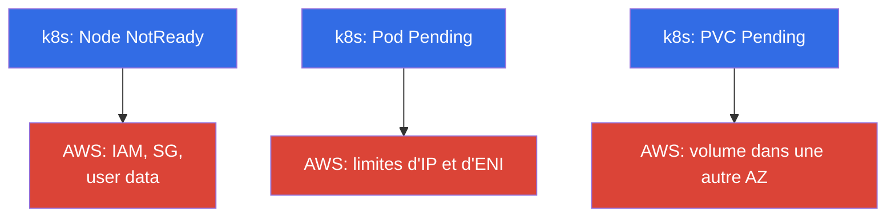
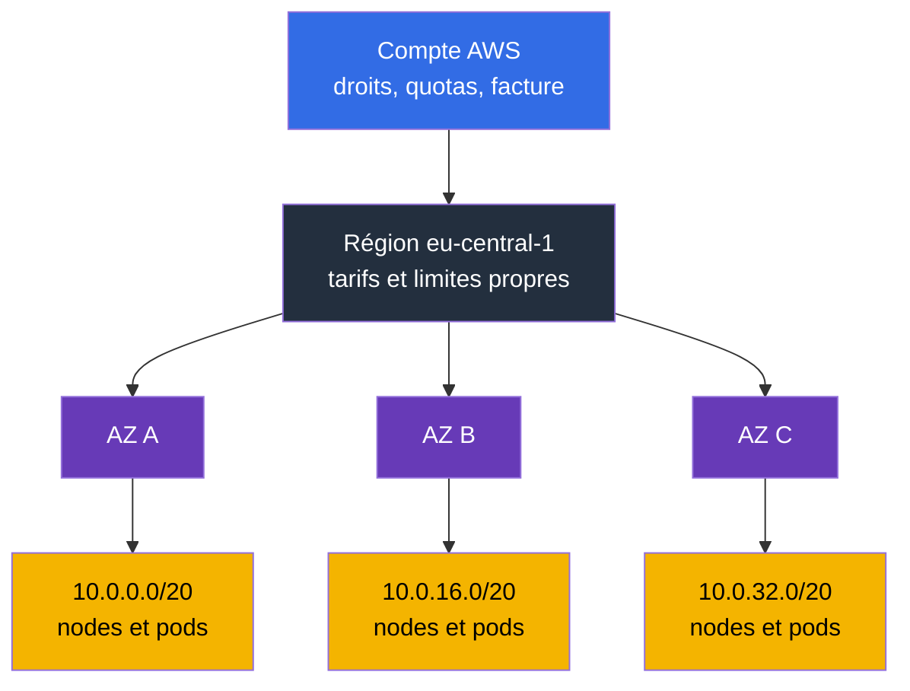
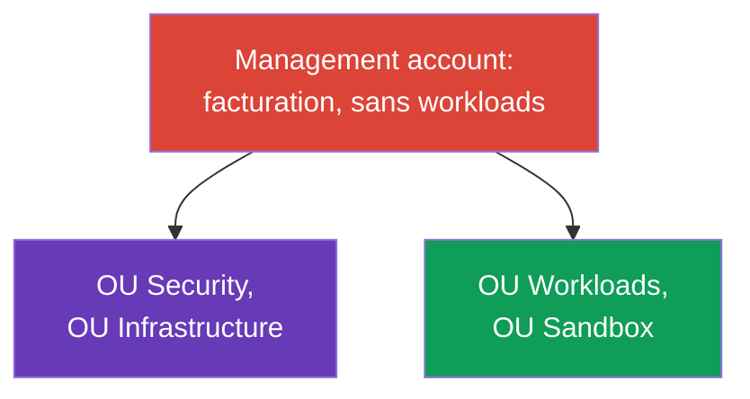
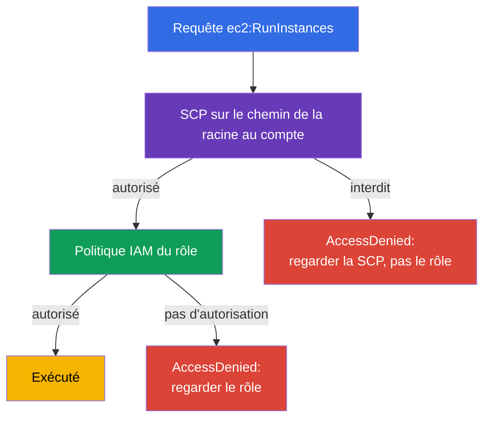
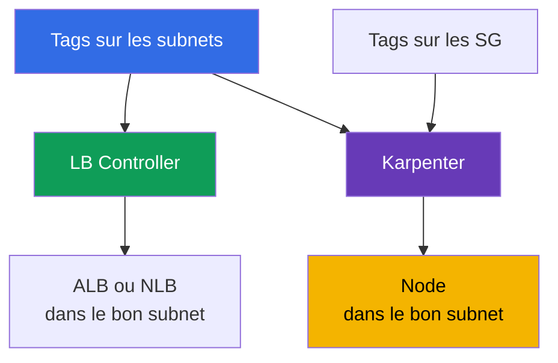

[Русская версия](ru.md) · [Eng version](en.md) · [Versión en español](es.md) · [Deutsche Version](de.md) · [ქართული ვერსია](ge.md) · [繁體中文版](tw.md) · [日本語版](jp.md)

# Chapitre 0.1. AWS pour l'ingénieur Kubernetes : comptes, régions, AZ, quotas, tags, facturation

> **Ce qui suit.** Vous arrivez de CKA : kubectl, pods, Deployment, RBAC et PV sont des
> outils familiers. Dans EKS ils ne changent pas, mais sous le cluster apparaît une seconde
> couche qui n'existait pas avec kubeadm : compte, région, zones de disponibilité, limites de
> service, tags et une facture à la fin du mois. Ce chapitre donne le vocabulaire minimal
> d'AWS, sans lequel les chapitres sur le réseau, les nodes et le coût se lisent comme une
> traduction. C'est sur cette base que s'appuient ensuite IAM (chapitre 0.2) et VPC (0.3).

## Prérequis

Le cours ne part pas de zéro sur AWS. On suppose que le socle de base du cloud vous est déjà
familier, au moins au niveau « je comprends de quoi il s'agit et je le retrouve dans la
console » :

- **Ce qu'est le cloud public et le modèle de paiement à la consommation** : les ressources
  sont créées à la demande via une API, vous payez pour la durée et le volume, pas pour le
  matériel.
- **Infrastructure globale d'AWS** : régions, zones de disponibilité, emplacements edge et
  CDN, et le fait que les services peuvent être régionaux ou globaux.
- **Services de base et leur rôle** : EC2 (machines virtuelles), EBS (disques), S3 (stockage
  d'objets), VPC (réseau), IAM (accès), Route 53 (DNS), CloudWatch (métriques et logs), KMS
  (clés de chiffrement), ELB (répartiteurs de charge). Une connaissance approfondie n'est pas
  nécessaire, il suffit de comprendre ce que fait chacun.
- **Moyens de gestion** : console AWS, aws cli, API et SDK, l'idée d'infrastructure as code.
- **L'idée générale du partage des responsabilités** entre le fournisseur et le client.

Si quelque chose de cette liste est nouveau, ce n'est pas une raison de s'arrêter : la Partie
0 comble justement ces lacunes, mais sous l'angle d'EKS, pas comme un cours complet sur AWS.
Les termes nécessaires à l'exploitation du cluster sont détaillés ici ; le reste du cloud
reste hors du champ du cours, et il est utile de le combler avec des ressources de niveau AWS
Cloud Practitioner et la documentation officielle des services.

Du côté Kubernetes, on suppose le niveau CKA : kubectl, workloads, Service et Ingress, RBAC,
PV et PVC, probes, débogage de pods. Ces sujets ne sont pas repris dans le cours.

## 0.1.1. Pourquoi l'ingénieur Kubernetes doit comprendre la structure d'AWS

Dans un cluster kubeadm, vous étiez propriétaire de tout : machines, réseau, disque, mises à
niveau. Dans EKS, le control plane est géré par AWS, tout le reste reste à votre charge, et
presque chaque problème opérationnel ne se situe pas dans Kubernetes mais dans l'AWS
sous-jacent. Un node ne démarre pas - mauvais rôle IAM ou security group. Un pod reste en
`Pending` - plus d'IP disponibles dans le subnet. L'Autoscaler n'ajoute pas de node - quota
de vCPU. Un PVC ne se lie pas - le volume EBS est dans une autre AZ. La facture a doublé -
trafic via NAT.

Formellement, c'est le **modèle de responsabilité partagée** (shared responsibility) : AWS
répond de la sécurité **du cloud lui-même** (matériel, hyperviseur, control plane et ses
correctifs), vous répondez de la sécurité **dans le cloud** (IAM, VPC et security groups,
versions d'AMI et de nodes, RBAC, secrets, images). La frontière est étudiée au chapitre 1 ;
un service managé ne signifie pas « tout est fait pour vous ».

Visuellement, cela se présente comme deux couches. En haut le Kubernetes habituel, en bas la
couche AWS, où se trouvent les véritables causes de la plupart des symptômes :



Trois symptômes typiques dans kubectl cachent trois catégories de causes côté AWS. Les autres
cas (pas de nouveaux nodes, LB sans adresse) se ramènent aux mêmes catégories : le premier à
IAM et SG, le second aux limites réseau.

La hiérarchie dans laquelle tout ceci s'inscrit vaut aussi la peine d'être gardée en tête dès
le premier chapitre : le compte définit les droits, les quotas et la facture, la région la
géographie, les zones de disponibilité la frontière de panne, les subnets les adresses pour
les nodes et les pods.



## 0.1.2. Compte : frontière d'isolation, d'accès et de facturation

Le **compte AWS** est à la fois un espace de noms de ressources, une frontière de droits et
une unité de facturation : les ressources d'un compte, par défaut, ne voient pas les
ressources d'un autre. Le compte possède un numéro à 12 chiffres que vous verrez en
permanence : dans l'ARN, dans la trust policy pour IRSA (chapitre 16), dans l'adresse du
registre ECR (chapitre 20).

```bash
# Qui suis-je actuellement : numéro de compte, ARN de l'identity courante, userId
aws sts get-caller-identity
```

L'**utilisateur root** est le propriétaire du compte, connexion par email et mot de passe. Il
peut tout faire, y compris fermer le compte et changer les données de paiement, et il ne peut
pas être restreint par des politiques à l'intérieur du compte. La règle est simple : root est
utilisé une seule fois à la création du compte (activer MFA, créer un accès de travail) et
plus jamais ensuite, tandis que le travail quotidien passe par des rôles IAM et des clés
temporaires (chapitre 0.2).

Quand l'entreprise grandit, un seul compte devient trop étroit, et **AWS Organizations**
apparaît - la section suivante lui est entièrement consacrée.

| Frontière | Ce qu'elle isole | À quoi cela ressemble dans EKS |
|---------|---------------|--------------------|
| **Compte** | droits, quotas, facture, rayon d'explosion | `prod` séparé de `dev` |
| **Région** | géographie, tarifs, panne de région | le cluster vit dans une seule région |
| **AZ** | panne de datacenter | subnets et nodes dans 3 AZ |

## 0.1.3. AWS Organizations : comment est structuré le multi-compte en production

Commençons par le problème, pas par la définition. Imaginez une entreprise qui vit dans
**un seul** compte : il y a le cluster EKS de prod, le cluster de test, le CI, la base de
données, l'expérience de machine learning de quelqu'un et un bucket de backups. Tant que
l'équipe est petite, ça fonctionne. Ensuite, des choses très concrètes commencent à se
produire :

- **Un test de charge en `dev` bloque le scaling de la prod.** Les quotas sont comptés par
  compte et région (section 0.1.6) : le test a consommé la limite de vCPU, et le cluster de
  prod n'ajoute plus de nodes. Techniquement tout est en ordre, mais il n'y a pas de nodes.
- **Une simple faute de frappe dans Terraform atteint la prod.** Toutes les ressources sont
  dans un seul espace, donc un `-target` erroné, un workspace d'un autre ou un script de
  nettoyage de « tout ce qui n'est pas nécessaire » emporte ce qu'il ne fallait pas toucher. Le
  rayon d'explosion est égal à toute l'entreprise.
- **Les droits ne peuvent pas être séparés honnêtement.** Un développeur a besoin d'accéder au
  cluster de test, et il se trouve dans le même IAM que le cluster de prod. Les politiques se
  chargent de conditions sur les tags et les noms, personne ne peut les vérifier
  intégralement, et au final la moitié de l'équipe a `AdministratorAccess`.
- **La fuite d'une seule clé compromet tout.** Un compte, une frontière d'accès : une clé du
  pipeline de test ouvre les mêmes API que la prod.
- **La facture ne peut pas être répartie par équipe.** Toutes les dépenses sont sur une seule
  ligne, et séparer le cluster de l'équipe A de celui de l'équipe B ne réussit que grâce à des
  tags dont personne ne maintient la discipline.
- **Les logs d'audit se trouvent au même endroit que les workloads.** Un administrateur qui a
  cassé ou caché quelque chose a accès à CloudTrail et peut effacer les traces. Pour un audit,
  c'est inacceptable.
- **Il n'y a aucun moyen d'interdire quelque chose définitivement.** On voudrait une règle du
  type « dans cet environnement, on ne peut pas créer de ressources dans des régions
  étrangères et on ne peut pas désactiver le logging » - mais à l'intérieur du compte, tout
  administrateur peut lever cette restriction, parce qu'il est administrateur.

La réponse évidente est de **séparer les comptes** : la prod à part, le test à part, les
expériences à part. Mais le naïf « il suffit de créer plusieurs comptes » crée un nouvel
ensemble de problèmes : plusieurs factures au lieu d'une (et des remises sur volume perdues),
des logins séparés pour chaque compte, aucune politique commune, du copier-coller des
réglages de base à chaque nouveau compte, et aucune réponse à la question « combien de comptes
avons-nous en tout et que contiennent-ils ».

**AWS Organizations** est la réponse exacte à cet ensemble de problèmes : un arbre de comptes
avec une facture commune, des restrictions communes et une gestion centralisée. Le compte
reste une frontière rigide de droits, de quotas et de rayon d'explosion, mais cesse d'être une
île. Pour l'ingénieur EKS, c'est important pour deux raisons : il doit comprendre dans quel
compte vit son cluster, et pourquoi une partie des réglages lui est inaccessible, même s'il
est administrateur du compte.

Éléments de la construction :

- **Management account** (aussi appelé payer) - la racine de l'organisation. On n'y héberge
  aucune workload : uniquement la facturation et la gestion de l'organisation. Compromettre ce
  compte signifie compromettre toute l'organisation.
- **Member accounts** - comptes de travail : `prod`, `stage`, `dev`, le compte réseau, celui
  des services communs.
- **OU (Organizational Unit)** - dossier dans l'arbre auquel s'appliquent des politiques. Les
  comptes sont regroupés par OU, pas par nom.
- **SCP (Service Control Policy)** - politique restrictive sur une OU ou un compte. Détail
  important : la SCP **n'autorise rien**, elle définit le maximum de droits possibles. Même
  l'administrateur du compte ne peut pas sortir de ce cadre, et `AdministratorAccess` à
  l'intérieur du compte n'annule pas une interdiction de la SCP.
- **IAM Identity Center** - un point d'entrée unique : les utilisateurs et les groupes sont
  les mêmes, et l'accès à un compte donné est accordé par un permission set temporaire
  (chapitre 0.2).
- **AWS Control Tower** - une implémentation clé en main de tout ce qui précède, dont il est
  question juste après le schéma.

La structure type d'une organisation ressemble à ceci :



Ce que contient chaque OU et pourquoi ce sont des comptes séparés :

| OU | Comptes | Ce qu'ils contiennent | Pourquoi séparé |
|----|----------|-----------|-----------------|
| Security | `log-archive`, `audit` | CloudTrail de toute l'organisation, GuardDuty, Config, Security Hub | l'admin d'un compte de travail ne doit pas pouvoir nettoyer les logs qui le concernent |
| Infrastructure | `network`, `shared-services` | VPC et Transit Gateway, Route 53, ECR commun, CI, copies de backups | le réseau et les images sont communs à tous les environnements, avec un seul propriétaire |
| Workloads | `prod`, `stage`, `dev` | un cluster EKS dans chacun | quotas propres, droits propres, rayon d'explosion limité à l'environnement |
| Sandbox | `sandbox-*` | comptes personnels des ingénieurs | budget avec nettoyage automatique, pas d'accès au réseau commun |

Le cluster dans le compte `prod` n'est pas isolé pour autant : les subnets lui sont fournis
par `network` via RAM, les images sont tirées de `shared-services`, les logs partent vers
`log-archive`, les copies de backups repartent vers `shared-services`. Ces liens sont étudiés
aux chapitres 20, 31, 32 et 41.

Il vaut aussi la peine de comprendre comment sont calculés les droits dans cette construction.
La SCP n'accorde pas de permissions : les droits finaux sont l'**intersection** de ce
qu'autorise la SCP sur le chemin allant de la racine jusqu'au compte, et de ce qu'accorde la
politique IAM à l'intérieur du compte. D'où l'énigme classique « la politique est correcte,
mais pas d'accès » :



Il en découle une règle qui économise des heures : **un Deny explicite l'emporte sur tout
Allow**. Si l'interdiction a joué dans la SCP à un niveau quelconque du chemin de la racine
jusqu'au compte, élargir le rôle IAM ne sert à rien - ni `AdministratorAccess`, ni une nouvelle
politique, ni un ajout à la trust policy ne rendront l'accès, parce qu'Allow n'annule pas
Deny. La même chose vaut à l'intérieur du compte : un Deny explicite dans une politique IAM
est plus fort que tout Allow. Ordre pratique pour analyser un `AccessDenied` : d'abord la SCP
sur l'OU, puis le permissions boundary du rôle, puis la politique elle-même, et seulement
ensuite le RBAC à l'intérieur du cluster (chapitre 47). Les ingénieurs EKS perdent le plus
souvent du temps dans l'ordre inverse, en commençant par le rôle.

### Landing zone et Control Tower

Le schéma ci-dessus n'est pas le fruit de l'imagination de quelqu'un, mais une **landing
zone** typique : un socle d'organisation préparé à l'avance, dans lequel s'installent ensuite
les workloads. Il comprend l'arbre d'OU et les comptes de service, un point d'entrée et des
rôles uniques, des guardrails obligatoires, des logs et un audit centralisés, un schéma réseau
de base, une politique de tagging et un moyen d'émettre des comptes nouveaux identiques entre
eux. L'idée est simple : le compte doit naître déjà sécurisé et homogène, sans être configuré
à la main chaque fois.

**AWS Control Tower** est une landing zone clé en main d'AWS. Elle déploie la structure
décrite, crée les comptes de logs et d'audit, active un ensemble de **controls** (aussi
appelés guardrails) et fournit un **account factory** - l'émission d'un nouveau compte à
partir d'un modèle, déjà avec les politiques, le logging et l'accès. Les controls se
répartissent en trois types : **preventive** (interdisent une action, techniquement une SCP),
**detective** (détectent des écarts via AWS Config) et **proactive** (vérifient les modèles
CloudFormation avant la création des ressources). Séparément, Control Tower surveille la
**dérive** : si quelqu'un a modifié à la main une OU, une politique ou le réglage d'un compte
de service, cela se voit dans la console.

Control Tower n'est pas le seul chemin. Les landing zones se construisent aussi soi-même : en
Terraform par-dessus Organizations, via **Account Factory for Terraform (AFT)** ou via Landing
Zone Accelerator. Le choix influence qui possède les réglages de base, mais pas le fond : le
socle est décrit en code et s'applique de la même façon à tous les comptes.

### Combien cela coûte et quoi désactiver au démarrage

Le piège est qu'AWS ne facture rien pour Control Tower lui-même : vous payez pour les services
qu'il active. Par conséquent, la facture apparaît avant même que le premier pod ne démarre
dans le cluster, et elle est constante : elle ne dépend ni de la charge ni des week-ends. Pour
une petite organisation, c'est une surprise désagréable, pas une catastrophe, mais il faut en
connaître la structure à l'avance.

| Poste | Ce que vous payez | Ce qui fait croître le coût |
|--------|----------------|----------------|
| **AWS Config** | enregistrement d'un configuration item à chaque changement de ressource, plus les évaluations des règles de detective controls | comptes x régions governed x volatilité des ressources. Le principal facteur |
| S3 dans `log-archive` | stockage des logs de Config et CloudTrail | volume et durée de rétention |
| CloudTrail | la première copie des events de management dans la région est gratuite ; payant - data events et un second trail | trails dupliqués, activation des data events |
| Service Catalog | provisioning des comptes via Account Factory | nombre d'émissions de comptes |
| Composants annexes (Lambda, EventBridge, SNS, KMS) | appels de service et clés | peu et presque invariable |
| AFT, si choisi | par défaut VPC endpoints plus NAT Gateway pour CodeBuild | facturation horaire pour son existence |
| Security Hub, GuardDuty, conformance packs | services séparés, ne font pas partie de la landing zone de base | nombre de vérifications, volume d'événements |
| Organizations, SCP, IAM Identity Center | sans coût supplémentaire | - |

Il faut évaluer non pas « combien coûte Control Tower », mais combien il y aura de
configuration item. Le calcul est le suivant : nombre de régions governed, multiplié par le
nombre de comptes, multiplié par la fréquence à laquelle vos ressources changent. On applique
ensuite le tarif Config de votre région. C'est pourquoi une landing zone de cinq comptes dans
une région et cette même landing zone dans quatre régions diffèrent d'un multiple à charge
égale.

Pour EKS, il y a ici un piège à part : **Karpenter crée et supprime des instances, des ENI,
des volumes et des règles de security group en permanence**, et chacun de ces changements est
un configuration item. Un cluster dynamique génère un flux d'enregistrements qui n'existait
pas avec un node group statique. La documentation de Control Tower avertit directement de la
croissance du coût de Config sur des workloads éphémères.

Cela se traite de trois façons, de la plus douce à la plus radicale :

- **daily recording au lieu de continuous** pour les types bruyants : Config enregistre une
  seule fois par jour, et seulement si l'état a changé. La chronologie intra-journalière se
  perd, mais le flux de CI baisse. Pour plusieurs types de service de Config (par exemple
  `AWS::Config::ResourceCompliance`), le daily recording n'est pas supporté, ils sont toujours
  enregistrés en continu.
- **exclusion de types du périmètre du recorder** : la stratégie « tout enregistrer sauf ce
  qui est listé » (`EXCLUSION_BY_RESOURCE_TYPES`). Les candidats en dev et sandbox sont
  exactement ce que Karpenter broie : instances EC2, interfaces réseau, volumes, règles de
  security group.
- **éteindre le recorder entièrement dans le compte bruyant** : la voie pour le non-prod que
  recommande officiellement la documentation de Control Tower elle-même. Le prix est honnête :
  dans ce compte, les detective controls cessent de fonctionner et le journal des changements
  disparaît, donc on ne fait pas ainsi pour `prod`.

À partir de la version 3.0 de la landing zone, Control Tower n'enregistre déjà les ressources
globales (rôles IAM, utilisateurs, politiques) que dans la région home, et non dans chacune -
cela supprime une partie de la duplication d'elle-même.

Ce qu'une startup peut ne pas activer tout de suite, et ajouter quand une raison apparaît :

| Quoi reporter | Pourquoi c'est possible | Quand l'activer |
|--------------|--------------|-----------------|
| Control Tower lui-même | Organizations, SCP et Identity Center sont gratuits : l'arbre d'OU, un org-trail unique et l'interdiction des régions superflues donnent 80% du bénéfice gratuitement | quand les comptes commencent à être émis régulièrement et que le faire à la main devient coûteux |
| Régions governed superflues | le recorder Config s'installe dans chacune, la facture se multiplie | à l'apparition d'une région DR (chapitre 42) |
| Enrollment des comptes dev et sandbox bruyants | Config y écrit le plus de bruit | quand des exigences d'audit apparaissent en dev |
| Enregistrement continu de tous les types dans Config | pour les types bruyants il existe le daily recording et l'exclusion de types | quand une chronologie exacte des changements est nécessaire |
| Security Hub Service-Managed Standard | c'est un service tarifé séparé, activé par un control de gestion | aux premières exigences de compliance (chapitre 21) |
| GuardDuty | ne fait pas partie de la landing zone, s'active séparément | au passage en prod avec de vraies données clients |
| AFT ou CfCT | AFT ajoute une infrastructure permanente : endpoints et NAT | quand il y a des dizaines de comptes et qu'un pipeline est nécessaire |
| Data events CloudTrail et rétention longue | la partie la plus coûteuse de l'audit | sous une exigence réglementaire, avec lifecycle vers un stockage froid |

Deux points où l'économie se retourne contre vous. Premièrement : **un second trail
CloudTrail par-dessus l'org-trail** n'est pas une économie mais une duplication d'événements
tarifés, un trail propre n'est créé que pour une exigence précise. Deuxièmement : **les
proactive controls vérifient des modèles CloudFormation**, et si votre cluster est décrit avec
Terraform (chapitre 4), ils ne constituent pas une protection - on ne peut pas s'appuyer sur
eux, et la place des interdictions est occupée par les preventive controls, c'est-à-dire la
SCP.

L'ordre d'activation pour une startup qui prévoit à terme de passer PCI DSS est étudié au
chapitre 48 comme scénario de déploiement séparé : d'abord le socle gratuit, puis la
détection, puis le pipeline de comptes. La répartition des dépenses par services et tags est
au chapitre 43.

Ce qui est important dans tout cela pour l'ingénieur EKS en pratique :

- **Vous ne configurez pas le compte d'un nouveau cluster à partir de zéro.** Il arrive de
  l'account factory déjà avec des logs, des rôles, des guardrails et, en général, un réseau de
  base. Votre tâche est le cluster, pas les composants annexes du compte.
- **Une partie des réglages vous est inaccessible, et c'est normal.** Vous ne pourrez pas
  désactiver CloudTrail, créer une ressource dans une région non autorisée ou retirer le
  chiffrement - un preventive control l'interdit.
- **Les écarts sont repérés.** Une ressource créée à la main hors IaC apparaîtra comme une
  non-conformité dans Config ou comme une dérive de la landing zone. C'est pourquoi le cluster
  et ses composants annexes sont décrits en code (chapitre 4).

Ce que cela apporte au cluster EKS :

| Propriété de l'organisation | Effet pratique pour EKS |
|----------------------|------------------------------|
| Les quotas sont comptés par compte et région | les limites de `dev` ne consomment pas la capacité de `prod` (section 0.1.6) |
| Le rayon d'explosion est limité au compte | une erreur dans IAM ou Terraform n'atteint pas le cluster de prod |
| Consolidated billing | les Savings Plans et remises sur volume s'appliquent à tous les comptes (0.1.8) |
| SCP comme guardrails | impossible de désactiver les logs, de créer une ressource dans une région étrangère, de retirer le chiffrement |
| Réseau centralisé | les subnets ou le transit sont fournis par le compte réseau (chapitres 31 et 32) |
| Services centralisés | ECR commun, copies de backups dans un compte séparé (chapitres 20 et 41) |

SCP typiques que vous rencontrerez en tant qu'ingénieur : interdiction de toutes les régions
sauf celles de travail ; interdiction de désactiver CloudTrail, Config et GuardDuty ;
interdiction de supprimer logs et snapshots ; chiffrement obligatoire des volumes. Cela se
casse ainsi : Terraform échoue avec `AccessDenied` alors que les droits IAM sont pourtant
corrects. On regarde d'abord non pas le rôle, mais la SCP sur l'OU.

```bash
# Y a-t-il une organisation et qui en est le payer
aws organizations describe-organization

# Tous les comptes et OU (s'exécute dans le compte management ou delegated admin)
aws organizations list-accounts --query 'Accounts[].[Id,Name,Status]' --output table
aws organizations list-organizational-units-for-parent --parent-id r-abcd

# Quelles SCP sont attachées à un compte ou une OU donnée
aws organizations list-policies-for-target --target-id 123456789012 \
  --filter SERVICE_CONTROL_POLICY
```

Ensuite commence la spécificité d'EKS en multi-compte, et il vaut mieux la connaître à
l'avance :

- **Le cluster vit dans un seul compte**, mais les ressources autour sont dans d'autres. Le
  réseau peut être partagé : le compte réseau partage des subnets via **AWS RAM**, et le
  cluster se lève dans des subnets étrangers (shared). Dans ce cas, les tags sur les subnets
  (section 0.1.7) sont posés par le propriétaire du réseau, pas par vous, et la coordination
  des tags devient partie du processus.
- **L'accès au cluster est accordé à des rôles d'autres comptes.** On peut créer une access
  entry pour un rôle qui provient du compte CI ou d'Identity Center (chapitre 5). C'est une
  pratique normale : le pipeline de déploiement vit dans le compte des services communs.
- **Les images sont tirées d'un ECR commun** d'un autre compte, il faut donc une politique de
  repository pour le cross-account pull (chapitre 20).
- **Les backups sont copiés dans un compte séparé**, pour que la compromission du compte de
  travail n'emporte pas aussi, avec le cluster, ses points de restauration (chapitre 41).
- **La sécurité est surveillée depuis le compte d'audit.** GuardDuty, Config et Security Hub
  sont activés pour toute l'organisation via un delegated administrator, pas à la main dans
  chaque compte (chapitre 21).

Combien de comptes faut-il pour les clusters est une question sans réponse unique. Le minimum
qui fonctionne presque toujours : `prod` séparé de tout le reste, parce que le cluster de prod
a ses propres quotas, ses propres droits et sa propre fenêtre de maintenance. Vient ensuite le
choix entre « un compte par environnement » (plus simple à gérer, moins coûteux à
administrer) et « un compte par équipe ou produit » (meilleure isolation et suivi des
dépenses, mais plus de composants réseau et plus de clusters dans le parc - chapitre 44).

## 0.1.4. Région et Availability Zone

La **région** (`eu-central-1`, `us-east-1`) est une zone géographique avec son propre
ensemble de services et ses propres tarifs. Les ressources sont liées à la région : un subnet
de `eu-central-1` ne peut pas se connecter à un cluster dans `us-east-1`, et le cluster EKS
vit entièrement dans une seule région.

L'**Availability Zone (AZ)** est un ou plusieurs datacenters physiquement isolés à l'intérieur
d'une région : alimentation, refroidissement, réseau propres. La latence entre AZ d'une même
région est faible (quelques millisecondes), mais la panne d'une zone n'affecte pas les
autres. D'où la règle principale de tolérance aux pannes : **subnets dans au moins trois AZ,
nodes répartis entre les AZ, workloads dispersées via des topology spread constraints**
(chapitre 40). Le control plane AWS est déjà maintenu dans plusieurs zones, et des nodes vous
êtes responsable : un cluster avec un seul node group dans une seule AZ tombe avec elle.

Un détail sur lequel tout le monde trébuche : **le nom d'une AZ comme `eu-central-1a` désigne
des zones physiques différentes selon les comptes**. AWS mélange les noms pour que les
clients ne tombent pas tous dans la « première » zone. L'identifiant stable est le `ZoneId`
(`euc1-az1`), identique dans tous les comptes, et dans les schémas multi-comptes c'est lui
qu'il faut comparer.

```bash
# Toutes les AZ de la région : nom (propre à chaque compte) et ZoneId stable
aws ec2 describe-availability-zones \
  --region eu-central-1 \
  --query 'AvailabilityZones[].[ZoneName,ZoneId,State]' \
  --output table
```

Une autre conséquence de la structure des AZ qui vous frappera au chapitre 23 : **un volume
EBS vit dans une seule AZ et ne se monte que sur une instance de cette même zone**. Un pod
avec un PVC sur `gp3` est lié à sa zone : si Karpenter lève un node dans une autre AZ, le pod
restera en `Pending`. D'où `WaitForFirstConsumer` dans le StorageClass et le shared storage
via EFS (chapitre 24).

## 0.1.5. ARN : comment est adressée toute ressource AWS

L'**ARN (Amazon Resource Name)** est l'identifiant unique d'une ressource. On le rencontre
dans les politiques IAM, les annotations de ServiceAccount, les manifests de contrôleurs, les
logs et les erreurs, il faut donc savoir le lire au premier coup d'œil. La forme générale
comporte six champs séparés par des deux-points :
`arn:partition:service:region:account-id:resource`. Exemples issus du cours :

- `arn:aws:iam::123456789012:role/eks-node-role` - un rôle IAM, IAM n'a pas de région.
- `arn:aws:eks:eu-central-1:123456789012:cluster/demo` - un cluster EKS.
- `arn:aws:s3:::my-bucket/path/*` - des objets dans le bucket, sans région ni compte.

`partition` est presque toujours `aws`, mais il existe `aws-cn` et `aws-us-gov` : en copiant
une politique vers une telle partition, il faudra changer le partition.

L'ARN d'un rôle est ce par quoi une workload dans le cluster obtient des droits sur AWS, et
dans deux mécanismes il est indiqué différemment :

- **IRSA** (chapitre 16) : l'ARN du rôle vit dans l'annotation du ServiceAccount
  `eks.amazonaws.com/role-arn`, et le rôle lui-même fait confiance au fournisseur OIDC du
  cluster. Une erreur dans l'ARN ou dans le `sub` à l'intérieur de la trust policy se présente
  comme un refus de droits sur le pod, pas sur le node.
- **EKS Pod Identity** (chapitre 17) : pas d'annotation, à la place une association est créée
  dans l'API d'EKS lui-même, où l'ARN du rôle est passé explicitement :

```bash
# Lier un rôle à un ServiceAccount sans annotations OIDC
aws eks create-pod-identity-association \
  --cluster-name demo --namespace default \
  --service-account my-sa \
  --role-arn arn:aws:iam::123456789012:role/app-role
```

Conclusion pratique : si un pod n'a pas obtenu de droits, on regarde d'abord par lequel des
deux mécanismes le rôle est lié, car le diagnostic diffère - pour IRSA on vérifie l'annotation
et la trust policy, pour Pod Identity l'association elle-même et l'agent sur le node.

## 0.1.6. Quotas de service : pourquoi le cluster arrête de scaler

Chaque service AWS a des **quotas (Service Quotas)** - des limites par compte et région. Ce
n'est pas une restriction de facturation mais un plafond de protection, et un nouveau compte
le reçoit bas.

| Service | Quota | Ce qu'il bloque dans le cluster |
|--------|-------|----------------------|
| `ec2` | Running On-Demand Standard instances (vCPU) | les nodes ne se créent plus lors du scaling |
| `ec2` | All Standard Spot Instance Requests (vCPU) | les nodes spot ne se lèvent pas (chapitre 13) |
| `vpc` | Network interfaces per Region | pas d'ENI, les pods n'obtiennent pas d'IP (chapitre 6) |
| `ec2` | EC2-VPC Elastic IPs | impossible de créer un NAT Gateway ou une adresse public |
| `elasticloadbalancing` | Load Balancers per Region | un Service ou Ingress n'obtient pas de LB |
| `eks` | Clusters per Region | impossible de créer un cluster supplémentaire |

Scénario typique : la charge a augmenté, Karpenter ou Cluster Autoscaler essaie d'ajouter des
nodes, rien n'apparaît dans le cluster, et dans les events de Karpenter ou de l'Auto Scaling
group on voit `VcpuLimitExceeded` ou `MaxSpotInstanceCountExceeded`. Le plafond se trouve côté
AWS.

Une classe de limites à part - les **API rate limits** (throttling) : la fréquence des appels
à l'API d'un service, pas le nombre de ressources. Avec un grand parc de nodes, les
contrôleurs et l'autoscaler sollicitent souvent EC2 et Auto Scaling, et en réponse arrive un
`RequestLimitExceeded` ou `Throttling`. Cela croît aussi avec EKS, mais se traite non pas en
augmentant le quota, mais en interrogeant moins souvent et avec des retries à backoff.

```bash
# Tous les quotas EC2 avec les valeurs actuelles ; codes de service - aws service-quotas list-services
aws service-quotas list-service-quotas \
  --service-code ec2 \
  --query 'Quotas[].[QuotaCode,QuotaName,Value]' \
  --output table

# Quota précis des on-demand standard instances (limite en vCPU) et demande d'augmentation
aws service-quotas get-service-quota --service-code ec2 --quota-code L-1216C47A
aws service-quotas request-service-quota-increase \
  --service-code ec2 --quota-code L-1216C47A --desired-value 256
```

En pratique : avant un test de charge ou le lancement d'un cluster de prod, on vérifie et on
augmente les quotas à l'avance. Le traitement prend de quelques minutes à quelques jours, et
on en a généralement besoin justement quand on ne peut pas attendre.

## 0.1.7. Tags : dans EKS ce n'est pas de la cosmétique

Un **tag** est une paire clé/valeur sur une ressource AWS. En général les tags servent à
l'ordre, mais dans EKS une partie des tags est fonctionnelle : c'est grâce à eux que les
contrôleurs **trouvent** les ressources, et retirer un tag casse le mécanisme, pas seulement
un rapport.



Tags qui doivent absolument être corrects :

- `kubernetes.io/role/elb` = `1` sur les subnets publics - où placer les répartiteurs
  internet-facing (chapitre 26).
- `kubernetes.io/role/internal-elb` = `1` sur les subnets privés - pour les internes.
- `karpenter.sh/discovery` = nom du cluster sur les subnets et security groups - comment
  Karpenter choisit où et avec quel SG lever les nodes (chapitre 12).
- `kubernetes.io/cluster/<nom-du-cluster>` - marqueur historique d'appartenance de la
  ressource au cluster, rencontré dans d'anciennes configurations.

```bash
# Marquer un subnet comme public pour les répartiteurs internet-facing
aws ec2 create-tags --resources subnet-0a1b2c3d4e5f6a7b8 \
  --tags Key=kubernetes.io/role/elb,Value=1

# Vérifier que Karpenter trouvera les bons subnets
aws ec2 describe-subnets \
  --filters "Name=tag:karpenter.sh/discovery,Values=demo" \
  --query 'Subnets[].[SubnetId,AvailabilityZone]' --output table
```

Le second rôle des tags est le suivi financier. Le minimum obligatoire `CostCenter`, `Owner`,
`Environment` - c'est la base de l'allocation des coûts : c'est grâce à eux que la facture est
répartie dans AWS Cost Explorer et dans Kubecost (chapitre 43). Une politique plus complète
ajoute `Team`, `Cluster`, `ManagedBy` et aide à retrouver des ressources oubliées. Les tags
sont définis dans Terraform via `default_tags`, et au niveau organisation ils sont fixés par
des Tag Policies et vérifiés par AWS Config.

## 0.1.8. Facturation : de quoi se compose la facture d'un cluster EKS

La ligne « EKS » de la facture est faible : le service lui-même prend un tarif horaire pour le
control plane, et l'essentiel de l'argent part dans les services voisins.

| Poste | Ce que vous payez | Remarque |
|--------|----------------|-----------|
| EKS control plane | heure de fonctionnement du cluster | identique pour un petit et un grand cluster |
| Extended support | tarif majoré par heure de cluster sur une version hors support standard | s'active automatiquement, le retard de version coûte de l'argent (chapitre 3) |
| EC2 ou Fargate | vCPU et mémoire des nodes ou des pods | généralement la plus grande part (chapitres 0.4, 15) |
| EBS, EFS, S3, ECR | volumes, snapshots, images | les snapshots oubliés s'accumulent pendant des années |
| NAT Gateway | heure de fonctionnement plus chaque gigaoctet | surprise classique (chapitre 31) |
| Load Balancers | heure de fonctionnement plus trafic | un par Service ou Ingress |
| Data transfer | trafic entre AZ et vers l'extérieur | entre zones, payé dans les deux sens |
| CloudWatch | ingestion et stockage des logs et métriques | peut coûter plus cher que les nodes (chapitre 34) |

À part, la ligne **extended support**. Tant que la version du cluster est en support
standard, l'heure de control plane coûte pareil pour tous. Quand la durée standard de la
version se termine, le cluster passe en extended support et le même tarif horaire devient plus
élevé - à charge totalement inchangée. Cela se gère via le champ `supportType` dans la
politique de mise à niveau du cluster (`STANDARD` ou `EXTENDED`), et les délais de version et
le modèle de support sont étudiés au chapitre 3. Deux détails piégeurs en pratique : avec
`supportType: STANDARD`, le cluster sera mis à niveau de force à l'échéance, et en cas de
**retour en arrière** de version depuis une version standard vers une version déjà hors
support standard, la facturation de l'extended support recommence à s'appliquer (chapitre 39).
Autrement dit, le retard de version n'est pas seulement un risque de sécurité, mais aussi une
ligne sur la facture.

```bash
# Dans quelle période de support est le cluster et quelle politique de mise à niveau est choisie
aws eks describe-cluster --name demo \
  --query 'cluster.[version,upgradePolicy.supportType]' --output table
```

Les surprises se trouvent presque toujours à deux endroits. D'abord le **NAT Gateway** : un
cluster qui tire des images et va vers S3 ou ECR via NAT paie du trafic qu'on peut éviter via
des VPC endpoints (chapitre 31). Ensuite le **trafic entre AZ** : des services bavards dans
trois zones donnent une facture constante, et c'est le prix conscient de la tolérance aux
pannes.

```bash
# Répartition des dépenses du mois par service ; par tag - --group-by Type=TAG,Key=Cluster
aws ce get-cost-and-usage \
  --time-period Start=2025-01-01,End=2025-02-01 \
  --granularity MONTHLY --metrics "UnblendedCost" \
  --group-by Type=DIMENSION,Key=SERVICE
```

Détail important : les **cost allocation tags s'activent manuellement** dans la section
Billing, et les données n'apparaissent qu'à partir du moment de l'activation, impossible de
les récupérer rétroactivement. Il faut donc activer les tags de suivi dès le premier jour.
OpenCost, Kubecost et le right-sizing - au chapitre 43.

## 0.1.9. Comment s'entraîner à moindre coût et sans risque

- **Un compte séparé pour l'apprentissage.** Votre propre compte ou sandbox isole les
  expériences des ressources de travail et donne une image honnête des dépenses du cours.
- **Budget et alarmes dès le premier jour.** AWS Budgets avec notification au franchissement
  d'un seuil et sur prévision coûte moins cher que découvrir un NAT Gateway oublié un mois
  plus tard.
- **Tout supprimer après la séance.** Cluster, NAT Gateway, répartiteurs et EIP sont facturés
  pour leur durée d'existence, pas pour leur usage. Prenez la **région** la plus proche.

```bash
# Budgets actuels du compte : le seuil et les notifications se configurent une seule fois
aws budgets describe-budgets --account-id 123456789012
```

Les labs du cours sont conçues pour que le stand se déploie et se supprime en une seule
commande via Terragrunt : `apply` crée tout le nécessaire, `destroy` ne laisse aucun résidu
payant (chapitre 0.5).

## 0.1.10. Comment cela s'applique en production

Organisation et comptes :

- **Multi-compte par défaut.** `prod`, `stage` et `dev` dans des comptes séparés : isolation
  des droits, quotas indépendants, facture claire par environnement. Le cluster de prod ne
  partage son compte avec rien.
- **Management account vide.** On n'y trouve que la facturation et Organizations, aucune
  workload et aucun cluster. L'accès y est réservé à quelques personnes, avec MFA.
- **Landing zone issue du code.** L'arbre d'OU, les comptes de logs et d'audit, les guardrails
  de base sont déployés par Control Tower ou du code propre, pas à la main depuis la console.
  Un nouveau compte est émis selon un modèle : mêmes SCP, mêmes tags, même ensemble de rôles.
- **SCP comme assurance contre l'erreur humaine.** Régions autorisées, interdiction de
  désactiver CloudTrail, Config et GuardDuty, interdiction de supprimer logs et snapshots,
  chiffrement obligatoire. Face à un `AccessDenied` dans Terraform, on vérifie la SCP avant
  les politiques IAM.
- **Point d'entrée unique via Identity Center.** Aucun utilisateur IAM avec des clés
  durables : des rôles temporaires, des permission sets sur des groupes, un rôle break-glass
  séparé avec alerte à l'usage (chapitre 0.2).
- **Réseau, images, logs et backups centralisés.** Les subnets sont fournis par le compte
  réseau via RAM ou la connectivité passe par Transit Gateway, les images se trouvent dans un
  ECR commun, les copies de backups partent vers un compte séparé, la sécurité est surveillée
  depuis le compte d'audit via delegated administrator (chapitres 20, 21, 31, 32, 41).

Cluster et argent :

- **Trois AZ comme norme.** Subnets et node groups dans au moins trois zones, workloads
  critiques dispersées via topology spread et PDB (chapitre 40).
- **Quotas dans la checklist de lancement.** Avant la mise en prod et avant un test de charge,
  on vérifie les limites de vCPU, ENI, EIP et répartiteurs. Les quotas sont demandés pour
  chaque compte séparément : une augmentation en `dev` n'a pas d'effet en `prod`.
- **Les tags sont posés par le code.** `default_tags` dans Terraform, les clés obligatoires
  sont fixées par des Tag Policies, la conformité est vérifiée par AWS Config. Le tagging
  manuel ne survit pas.
- **FinOps comme processus.** Cost Explorer avec répartition par compte et par tag, budgets
  avec alarmes pour chaque compte, analyse de la croissance du trafic et du NAT. Le coût est
  une métrique comme la latence et la disponibilité.

## 0.1.11. Mini-glossaire

- **Compte** - espace de ressources isolé et unité de facturation ; le numéro à 12 chiffres
  intervient dans l'ARN et la trust policy.
- **Utilisateur root** - propriétaire du compte avec des droits illimités, nécessaire
  uniquement lors de la configuration initiale.
- **AWS Organizations** - arbre de comptes avec facturation commune et restrictions communes.
  **Management account** - compte racine payeur, on n'y héberge pas de workloads. **OU** -
  groupe de comptes auquel s'appliquent des politiques.
- **SCP (Service Control Policy)** - politique restrictive sur une OU ou un compte : définit
  le maximum de droits et n'autorise rien elle-même.
- **Landing zone** - socle d'organisation préparé à l'avance : OU, comptes de service,
  guardrails, logs, accès et moyen d'émettre des comptes homogènes. **AWS Control Tower** -
  landing zone clé en main d'AWS : controls (preventive, detective, proactive), détection de
  dérive et account factory. **IAM Identity Center** - point d'entrée unique et distribution
  d'accès par permission sets.
- **AWS RAM** - partage de ressources entre comptes, par exemple des subnets partagés pour un
  cluster. **Delegated administrator** - compte auquel l'organisation délègue la gestion d'un
  service (GuardDuty, Config, Security Hub, Backup).
- **Consolidated billing** - facture commune de l'organisation ; les remises sur volume et
  Savings Plans s'appliquent à tous les comptes.
- **Région** - zone géographique (`eu-central-1`) à laquelle sont liées les ressources.
- **Availability Zone (AZ)** - datacenter isolé à l'intérieur d'une région, base de la
  fiabilité. **ZoneId** (`euc1-az1`) - son nom stable dans tous les comptes.
- **ARN** - `arn:partition:service:region:account-id:resource`, adresse d'une ressource.
- **Service Quotas** - limites de service par compte et région, augmentables sur demande.
- **Tag** - paire clé/valeur ; grâce aux tags, les contrôleurs EKS trouvent les ressources, et
  le **cost allocation tag** activé est utilisé dans la facturation pour répartir la facture.
- **Shared responsibility** - AWS répond de la sécurité du cloud, vous, de la sécurité dans le
  cloud.

## 0.1.12. Résumé du chapitre

- Le compte est la frontière des droits, des quotas et de la facture ; root n'est pas utilisé,
  l'accès passe par des rôles IAM et des clés temporaires (chapitre 0.2).
- En prod, les comptes sont nombreux : management account vide, comptes de service pour les
  logs et l'audit, comptes réseau et de services communs, comptes de travail par
  environnement. Le cluster de prod vit dans son propre compte.
- La SCP sur une OU définit le maximum de droits et ne les accorde pas : un `AccessDenied`
  inattendu avec une politique IAM correcte, c'est presque toujours la SCP. La landing zone et
  les nouveaux comptes sont émis depuis du code.
- Le multi-compte change les composants annexes du cluster : les subnets arrivent via RAM
  depuis le compte réseau, l'accès est accordé à des rôles d'autres comptes, les images sont
  tirées d'un ECR commun, les backups sont copiés dans un compte séparé (chapitres 5, 20, 31,
  32, 41).
- La région définit la géographie et les tarifs, l'AZ l'isolation des pannes. Le multi-AZ est
  obligatoire, et les noms d'AZ ne correspondent pas entre comptes différents : comparez le
  `ZoneId`. Un volume EBS vit dans une seule AZ, donc un pod avec un PVC est lié à sa zone
  (chapitre 23).
- L'ARN se lit selon six champs ; les quotas de vCPU, ENI et EIP sont la cause du « pas de
  nouveaux nodes ».
- Les tags `kubernetes.io/role/elb` et `karpenter.sh/discovery` sont fonctionnels : les
  contrôleurs trouvent les ressources grâce à eux. Les autres tags servent au suivi des
  dépenses.
- La facture se compose du control plane, d'EC2/Fargate, du stockage, des répartiteurs, du
  NAT, du trafic et des logs. Les surprises se trouvent presque toujours dans le trafic et le
  NAT (chapitres 31 et 43).

## 0.1.13. Comment cela s'utilise dans le travail réel

L'analyse d'un incident commence par les questions « quel compte, quelle région, quelle AZ »,
et une partie des problèmes se résout déjà à cette étape. La planification d'un cluster
commence par les quotas et le plan d'adressage, pas par les manifests. Une discussion avec le
business sur les coûts n'est possible que lorsque les tags sont posés et que Cost Explorer
montre une répartition par équipe. Et le plus fréquent : quand les nodes n'apparaissent pas,
on regarde non seulement `kubectl describe`, mais aussi les quotas AWS.

## 0.1.14. Questions de vérification

1. Qu'isole un compte AWS et pourquoi prend-on un compte séparé pour `prod` ?
2. Pourquoi l'utilisateur root est-il nécessaire et pourquoi ne travaille-t-on pas avec lui au
   quotidien ?
3. Qu'est-ce qu'une OU et une SCP ? Pourquoi une SCP ne peut-elle rien autoriser ?
4. Terraform échoue avec `AccessDenied`, et la politique IAM du rôle semble correcte. Où
   regarder ?
5. Pourquoi n'héberge-t-on pas de clusters et de workloads dans le management account ?
6. Comment un cluster EKS peut-il utiliser des subnets d'un autre compte et qui répond de
   leurs tags ?
7. En quoi une région diffère-t-elle d'une AZ et pourquoi place-t-on un cluster dans au moins
   trois AZ ?
8. Pourquoi `eu-central-1a` peut-il désigner des zones différentes dans deux comptes, et que
   faut-il comparer ?
9. Lisez `arn:aws:eks:eu-central-1:123456789012:cluster/demo` champ par champ.
10. L'Autoscaler n'ajoute pas de nodes, il n'y a pas d'erreurs dans Kubernetes. Où regarder
    côté AWS ?
11. Quels tags sur les subnets sont nécessaires à l'AWS Load Balancer Controller et à
    Karpenter ?
12. De quoi se compose la facture d'un cluster et pourquoi active-t-on les cost allocation
    tags à l'avance ?

## Pratique

La Partie 0 n'a pas de labs propres : c'est le socle sur lequel reposent les autres
chapitres. La pratique commencera dans la Partie 1, quand vous lèverez un cluster EKS via
Terragrunt. Ensuite vient IAM : politiques, rôles et clés temporaires, sans lesquels ni
l'accès au cluster ni l'accès des pods ne fonctionnent dans EKS.

---
[Table des matières](../README_FR.md) · [Chapitre 0.2](../00-2-iam/fr.md)
