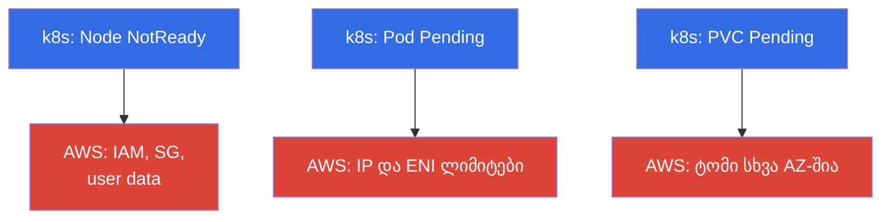
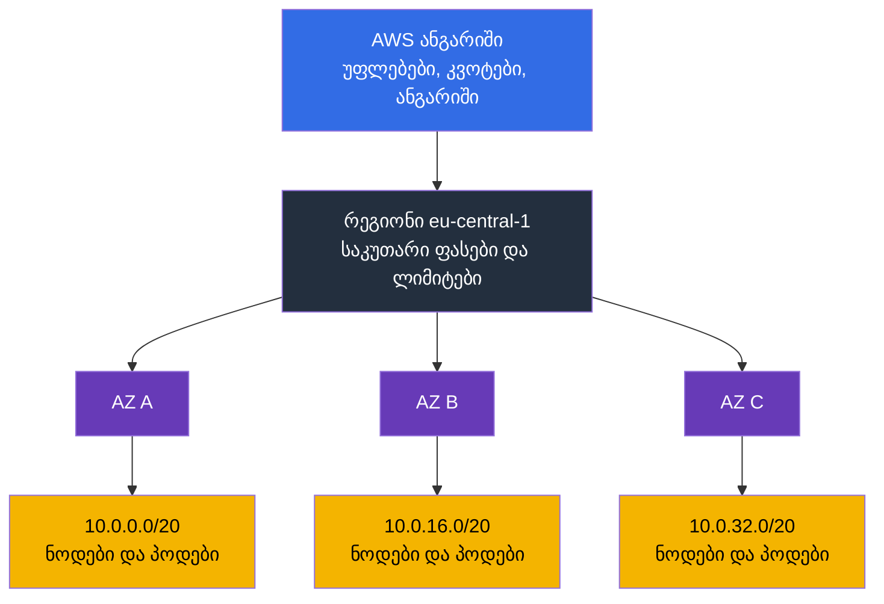
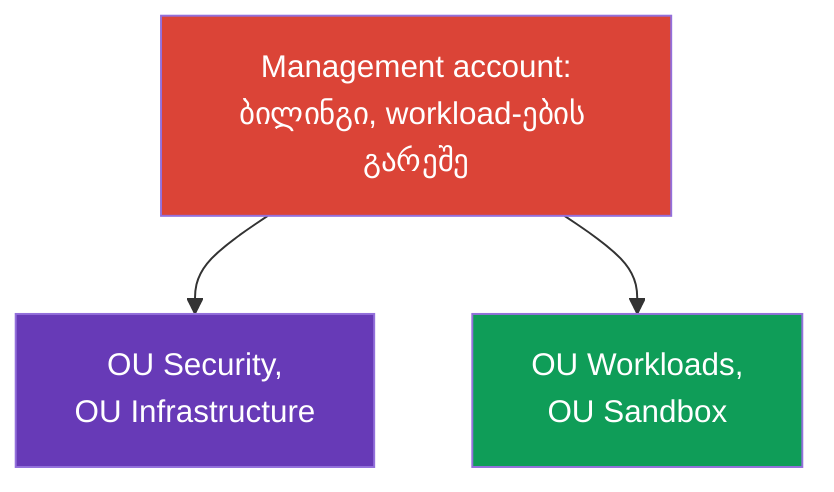
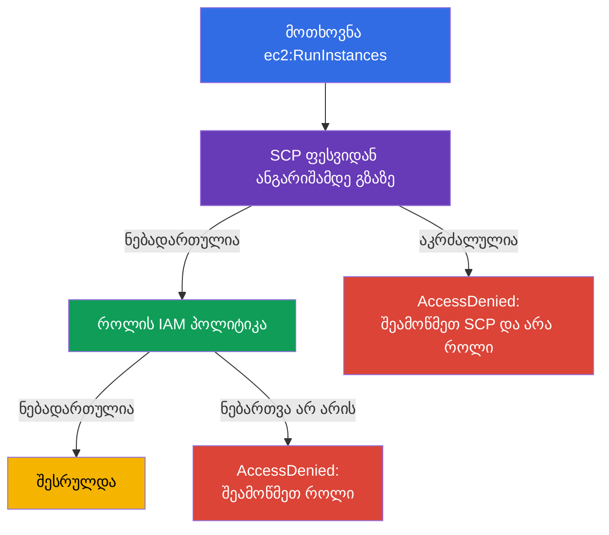
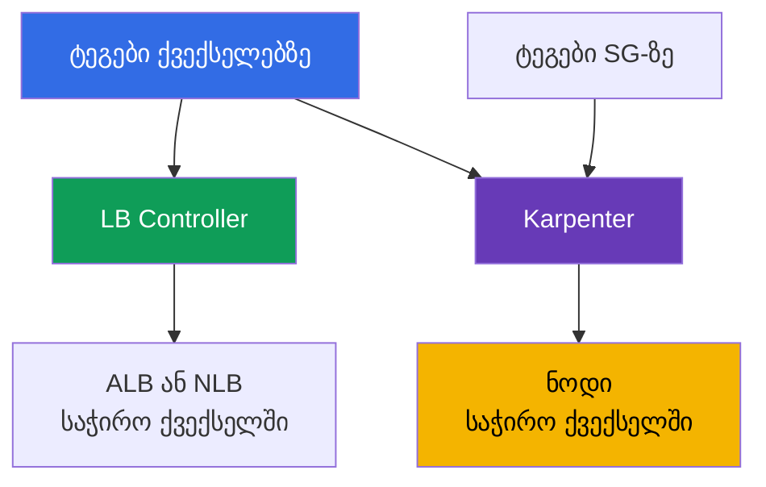

[Русская версия](ru.md) · [Eng version](en.md) · [Versión en español](es.md) · [Version française](fr.md) · [Deutsche Version](de.md) · [繁體中文版](tw.md) · [日本語版](jp.md)
# თავი 0.1. AWS Kubernetes ინჟინრისთვის: ანგარიშები, რეგიონები, AZ, კვოტები, ტეგები, ბილინგი

> **რა არის შემდეგ.** თქვენ CKA-დან მოხვედით: kubectl, პოდები, Deployment, RBAC და PV თქვენთვის ნაცნობი ინსტრუმენტებია. EKS-ში ისინი არ იცვლება, მაგრამ კლასტერის ქვეშ ჩნდება მეორე შრე, რომელიც kubeadm-ში არ არსებობდა: ანგარიში, რეგიონი, ხელმისაწვდომობის ზონები, სერვისების ლიმიტები, ტეგები და თვის ბოლოს ანგარიში. ეს თავი გაძლევთ AWS-ის მინიმალურ ლექსიკონს, რომლის გარეშეც ქსელის, ნოდებისა და ღირებულების თავები თარგმანს ჰგავს. შემდეგ მასზე დაეფუძნება IAM (თავი 0.2) და VPC (0.3).

## წინაპირობები

კურსი AWS-ის ნულიდან შესწავლით არ იწყება. ნავარაუდევია, რომ ღრუბლის საბაზისო ჩარჩო უკვე იცით, სულ მცირე იმ დონეზე, რომ „ვხვდები, რაზეა საუბარი და კონსოლში ვიპოვი“:

- **რა არის საჯარო ღრუბელი და მოხმარების მიხედვით გადახდის მოდელი**: რესურსები მოთხოვნით იქმნება API-ის მეშვეობით, იხდით დროისა და მოცულობისთვის, არა ფიზიკური მოწყობილობებისთვის.
- **AWS-ის გლობალური ინფრასტრუქტურა**: რეგიონები, ხელმისაწვდომობის ზონები, edge-ლოკაციები და CDN, აგრეთვე ის, რომ სერვისები შეიძლება რეგიონული ან გლობალური იყოს.
- **საბაზისო სერვისები და მათი დანიშნულება**: EC2 (ვირტუალური მანქანები), EBS (დისკები), S3 (ობიექტური საცავი), VPC (ქსელი), IAM (წვდომა), Route 53 (DNS), CloudWatch (მეტრიკები და ლოგები), KMS (დაშიფვრის გასაღებები), ELB (დამაბალანსებლები). ღრმა ცოდნა საჭირო არ არის, საჭიროა იმის გაგება, რას აკეთებს თითოეული.
- **მართვის გზები**: AWS კონსოლი, aws cli, API და SDK, infrastructure as code-ის იდეა.
- **პასუხისმგებლობის გაყოფის საერთო იდეა** პროვაიდერსა და მომხმარებელს შორის.

თუ სიიდან რამე ახალია, ეს გაჩერების მიზეზი არ არის: ნაწილი 0 სწორედ ნაკლულს ავსებს, მაგრამ EKS-ის ჭრილში და არა როგორც AWS-ის სრული კურსი. კლასტერის ოპერირებისთვის საჭირო ტერმინები აქ დეტალურად განიხილება; ღრუბლის დანარჩენი ნაწილი კურსის ფარგლებს გარეთ რჩება და მისი შევსება მოსახერხებელია AWS Cloud Practitioner-ის დონის მასალებითა და სერვისების ოფიციალური დოკუმენტაციით.

Kubernetes-ის მხრივ ნავარაუდევია CKA-ის დონე: kubectl, workload-ები, Service და Ingress, RBAC, PV და PVC, probes, პოდების გამართვა. ეს თემები კურსში აღარ მეორდება.

## 0.1.1. რატომ უნდა ერკვეოდეს Kubernetes ინჟინერი AWS-ის მოწყობაში

kubeadm-კლასტერში ყველაფერს თქვენ ფლობდით: მანქანებს, ქსელს, დისკს, განახლებას. EKS-ში control plane-ს AWS ემსახურება, დანარჩენი თქვენზე რჩება და ოპერაციული პრობლემების თითქმის ყველა მიზეზი არა Kubernetes-ში, არამედ მის ქვემოთ არსებულ AWS-შია. ნოდი ვერ აიწია - არასწორი IAM-როლი ან security group. პოდი `Pending`-შია - ქვექსელში IP-ები ამოიწურა. Autoscaler ნოდებს არ ამატებს - vCPU-ის კვოტაა. PVC არ ბაინდდება - EBS ტომი სხვა AZ-შია. ანგარიში გაორმაგდა - ტრაფიკი NAT-ით გადის.

ფორმალურად ეს არის **გაზიარებული პასუხისმგებლობის მოდელი** (shared responsibility): AWS პასუხს აგებს **თავად ღრუბლის** უსაფრთხოებაზე (აპარატურა, ჰიპერვაიზორი, control plane და მისი პატჩები), თქვენ კი **ღრუბელში** უსაფრთხოებაზე (IAM, VPC და security groups, AMI-სა და ნოდების ვერსიები, RBAC, სეკრეტები, იმიჯები). საზღვარს თავი 1 განიხილავს; მართული სერვისი არ ნიშნავს „ყველაფერს ჩემ ნაცვლად გააკეთებენ“.

ეს თვალსაჩინოდ ორ შრედ გამოიყურება. ზემოთ ნაცნობი Kubernetes-ია, ქვემოთ კი AWS-ის შრე, სადაც სიმპტომების უმეტესობის რეალური მიზეზებია:



kubectl-ში სამი ტიპური სიმპტომი AWS-ში მიზეზების სამ კატეგორიას მალავს. დანარჩენი შემთხვევებიც (ახალი ნოდები არ არის, LB-ს მისამართი არ აქვს) იმავე კატეგორიებამდე დადის: პირველი IAM-სა და SG-მდე, მეორე ქსელურ ლიმიტებამდე.

იერარქიაც, რომელშიც ეს ყველაფერი თავსდება, ღირს თავიდანვე გქონდეთ გონებაში: ანგარიში განსაზღვრავს უფლებებს, კვოტებსა და ანგარიშს, რეგიონი - გეოგრაფიას, ხელმისაწვდომობის ზონები - მტყუნების საზღვარს, ქვექსელები - ნოდებისა და პოდების მისამართებს.



## 0.1.2. ანგარიში: იზოლაციის, წვდომისა და ბილინგის საზღვარი

**AWS ანგარიში** ერთდროულად არის რესურსების სახელების სივრცე, უფლებების საზღვარი და ბილინგის ერთეული: ერთი ანგარიშის რესურსები ნაგულისხმევად ვერ ხედავს მეორის რესურსებს. ანგარიშს აქვს 12-ნიშნა ნომერი, რომელსაც მუდმივად დაინახავთ: ARN-ში, IRSA-ის trust policy-ში (თავი 16), ECR რეგისტრის მისამართში (თავი 20).

```bash
# ვინ ვარ ახლა: ანგარიშის ნომერი, მიმდინარე identity-ის ARN, userId
aws sts get-caller-identity
```

**Root მომხმარებელი** ანგარიშის მფლობელია, შესვლა email-ითა და პაროლით. მას ყველაფერი შეუძლია, მათ შორის ანგარიშის დახურვა და გადახდის მონაცემების შეცვლა, და ანგარიშის შიდა პოლიტიკებით მისი შეზღუდვა შეუძლებელია. წესი მარტივია: root გამოიყენება ერთხელ ანგარიშის შექმნისას (MFA-ის ჩართვა, სამუშაო წვდომის შექმნა) და შემდეგ არასოდეს, ყოველდღიური მუშაობა კი IAM-როლებითა და დროებითი გასაღებებით მიმდინარეობს (თავი 0.2).

როცა კომპანია იზრდება, ერთი ანგარიში ვიწრო ხდება და ჩნდება **AWS Organizations** - შემდეგი განყოფილება მთლიანად მას ეძღვნება.

| საზღვარი | რას იზოლირებს | როგორ გამოიყურება EKS-ში |
|---------|---------------|--------------------|
| **ანგარიში** | უფლებები, კვოტები, ანგარიში, აფეთქების რადიუსი | `prod` ცალკეა `dev`-ისგან |
| **რეგიონი** | გეოგრაფია, ფასები, რეგიონის მტყუნება | კლასტერი ერთ რეგიონში ცხოვრობს |
| **AZ** | მონაცემთა ცენტრის მტყუნება | ქვექსელები და ნოდები 3 AZ-ში |

## 0.1.3. AWS Organizations: როგორ არის მოწყობილი multi-account მიდგომა production-ში

დავიწყოთ პრობლემით და არა განსაზღვრებით. წარმოიდგინეთ კომპანია, რომელიც **ერთ** ანგარიშში ცხოვრობს: იქაა production EKS კლასტერი, სატესტო კლასტერი, CI, მონაცემთა ბაზა, ვიღაცის machine learning ექსპერიმენტი და backup-ების bucket. სანამ გუნდი პატარაა, ეს მუშაობს. შემდეგ სრულიად კონკრეტული რამეები იწყება:

- **დატვირთვის ტესტი `dev`-ში production-ის მასშტაბირებას აჩერებს.** კვოტები ანგარიშსა და რეგიონზე ითვლება (განყოფილება 0.1.6): ტესტმა vCPU-ის ლიმიტი მოიხმარა და production კლასტერი ნოდებს ვეღარ ამატებს. ტექნიკურად ყველაფერი გამართულია, მაგრამ ნოდები არ არის.
- **Terraform-ში ერთი ბეჭდვითი შეცდომა production-ს სწვდება.** ყველა რესურსი ერთ სივრცეშია, ამიტომ არასწორი `-target`, სხვისი workspace ან „ყველაფრის, რაც საჭირო არაა“ გამწმენდი სკრიპტი იმასაც შლის, რასაც შეხება არ შეიძლებოდა. აფეთქების რადიუსი მთელ ბიზნესს უდრის.
- **უფლებების სამართლიანად გაყოფა შეუძლებელია.** დეველოპერს სატესტო კლასტერზე წვდომა სჭირდება, მაგრამ ის production კლასტერთან ერთ IAM-შია. პოლიტიკებს ტეგებისა და სახელების პირობები ემატება, მთლიანად ვერავინ ამოწმებს, შედეგად კი გუნდის ნახევარს `AdministratorAccess` აქვს.
- **ერთი გასაღების გაჟონვა ყველაფერს კომპრომეტირებს.** ერთი ანგარიში ერთი წვდომის საზღვარია: სატესტო pipeline-ის გასაღები იმავე API-ებს ხსნის, რასაც production.
- **ხარჯის გუნდებზე განაწილება შეუძლებელია.** ყველა ხარჯი ერთ სტრიქონშია; A გუნდის კლასტრის B გუნდის კლასტრისგან გაყოფა მხოლოდ ტეგებით შეიძლება, რომელთა დისციპლინასაც ვერავინ იცავს.
- **აუდიტის ლოგები იქვეა, სადაც workload-ები.** ადმინისტრატორს, რომელმაც რამე დააზიანა ან დამალა, CloudTrail-ზე წვდომა აქვს და კვალის წაშლა შეუძლია. აუდიტისთვის ეს მიუღებელია.
- **რაღაცის სამუდამოდ აკრძალვის გზა არ არსებობს.** გინდათ წესი: „ამ გარემოში უცხო რეგიონებში რესურსების შექმნა და ლოგირების გამორთვა არ შეიძლება“, მაგრამ ანგარიშის შიგნით ნებისმიერი ადმინისტრატორი ასეთ შეზღუდვას მოხსნის, რადგან ადმინისტრატორია.

აშკარა პასუხია **ანგარიშების გაყოფა**: production ცალკე, ტესტი ცალკე, ექსპერიმენტები ცალკე. მაგრამ გულუბრყვილო „უბრალოდ რამდენიმე ანგარიშის შექმნა“ პრობლემების ახალ ნაკრებს ქმნის: ერთის ნაცვლად რამდენიმე ანგარიში (და დაკარგული მოცულობითი ფასდაკლებები), ცალკე შესვლები თითო ანგარიშში, საერთო პოლიტიკის არქონა, საბაზისო პარამეტრების კოპირება ყოველი ახალი ანგარიშისთვის და სრულად გაურკვეველი პასუხი კითხვაზე „რამდენი ანგარიში გვაქვს და რა არის მათში“.

**AWS Organizations** ზუსტად ამ პრობლემებზე პასუხია: ანგარიშების ხე საერთო ანგარიშით, საერთო შეზღუდვებითა და ცენტრალიზებული მმართველობით. ანგარიში უფლებების, კვოტებისა და აფეთქების რადიუსის მკაცრ საზღვრად რჩება, მაგრამ კუნძული აღარ არის. EKS ინჟინრისთვის ეს მნიშვნელოვანია ორი მიზეზით: უნდა იცოდეს, რომელ ანგარიშში ცხოვრობს მისი კლასტერი და რატომ მიუწვდომელია პარამეტრების ნაწილი, მაშინაც კი, თუ ამ ანგარიშში ადმინისტრატორია.

კონსტრუქციის ელემენტები:

- **Management account** (იგივე payer) ორგანიზაციის ფესვია. მასში workload-ები არ ინახება: მხოლოდ ბილინგი და ორგანიზაციის მართვა. ამ ანგარიშის კომპრომეტაცია მთელი ორგანიზაციის კომპრომეტაციას ნიშნავს.
- **Member accounts** სამუშაო ანგარიშებია: `prod`, `stage`, `dev`, ქსელისა და საერთო სერვისების.
- **OU (Organizational Unit)** ხის საქაღალდეა, რომელზეც პოლიტიკები ვრცელდება. ანგარიშები OU-ით ჯგუფდება და არა სახელით.
- **SCP (Service Control Policy)** OU-ს ან ანგარიშის შემზღუდავი პოლიტიკაა. მნიშვნელოვანი დეტალი: SCP **არაფერს რთავს**, ის შესაძლო უფლებების მაქსიმუმს ადგენს. ანგარიშის ადმინისტრატორიც ვერ გასცდება მის ჩარჩოს, ხოლო ანგარიშის შიგნით `AdministratorAccess` SCP-ის აკრძალვას ვერ აუქმებს.
- **IAM Identity Center** შესვლის ერთი წერტილია: მომხმარებლები და ჯგუფები ერთია, კონკრეტულ ანგარიშზე წვდომა კი დროებით permission set-ით გაიცემა (თავი 0.2).
- **AWS Control Tower** ჩამოთვლილის მზა რეალიზაციაა, მას სქემის შემდეგ განვიხილავთ.

ორგანიზაციის ტიპური სტრუქტურა ასე გამოიყურება:



რა დევს თითოეული OU-ს შიგნით და რატომ არის ეს ცალკე ანგარიშები:

| OU | ანგარიშები | რა არის მათში | რატომ ცალკე |
|----|----------|-------------|-------------|
| Security | `log-archive`, `audit` | მთელი ორგანიზაციის CloudTrail, GuardDuty, Config, Security Hub | სამუშაო ანგარიშის ადმინისტრატორმა საკუთარი თავის შესახებ ლოგების გაწმენდა არ უნდა შეძლოს |
| Infrastructure | `network`, `shared-services` | VPC და Transit Gateway, Route 53, საერთო ECR, CI, backup-ების ასლები | ქსელი და იმიჯები ყველა გარემოსთვის საერთოა, მაგრამ ერთი მფლობელი ჰყავს |
| Workloads | `prod`, `stage`, `dev` | თითოეულში EKS კლასტერი | საკუთარი კვოტები და უფლებები, აფეთქების რადიუსი გარემოთია შეზღუდული |
| Sandbox | `sandbox-*` | ინჟინრების პირადი ანგარიშები | ავტომატური გასუფთავების ბიუჯეტი, საერთო ქსელზე წვდომა არ არის |

ამავე დროს `prod` ანგარიშის კლასტერი იზოლირებული არაა: ქვექსელებს `network` RAM-ის მეშვეობით აძლევს, იმიჯებს `shared-services`-დან იღებს, ლოგები `log-archive`-ში მიდის, backup-ების ასლები კი უკან `shared-services`-ში. ეს კავშირები განხილულია თავებში 20, 31, 32 და 41.

ცალკე გასაგებია, როგორ ითვლება უფლებები ასეთ კონსტრუქციაში. SCP ნებართვებს არ გასცემს: საბოლოო უფლებები არის **კვეთა** იმისა, რასაც SCP იძლევა ფესვიდან ანგარიშამდე გზაზე, და იმისა, რასაც ანგარიშის შიგნით IAM პოლიტიკა იძლევა. აქედან მოდის ტიპური გამოცანა „პოლიტიკა სწორია, მაგრამ წვდომა არ არის“:



აქედან გამომდინარეობს საათების დამზოგავი წესი: **გამოკვეთილი Deny ნებისმიერ Allow-ს სჯობს**. თუ აკრძალვა SCP-ში ამოქმედდა ფესვიდან ანგარიშამდე გზის ნებისმიერ დონეზე, IAM-როლის გაფართოება უაზროა: ვერც `AdministratorAccess`, ვერც ახალი პოლიტიკა, ვერც trust policy-ის დამატება წვდომას ვერ დააბრუნებს, რადგან Allow Deny-ს ვერ აუქმებს. იგივე მართებულია ანგარიშის შიგნითაც: IAM პოლიტიკაში გამოკვეთილი Deny ნებისმიერ Allow-ზე ძლიერია. `AccessDenied`-ის დიაგნოსტიკის პრაქტიკული რიგი: ჯერ OU-ზე SCP, შემდეგ როლის permissions boundary, მერე თავად პოლიტიკა და მხოლოდ ამის შემდეგ კლასტერის შიგნით RBAC (თავი 47). EKS ინჟინრები ხშირად დროს საპირისპირო მიმართულებით, როლიდან დაწყებით კარგავენ.

### Landing zone და Control Tower

ზემოთ მოცემული სქემა ვიღაცის ფანტაზია კი არა, ტიპური **landing zone**-ია: წინასწარ მომზადებული ორგანიზაციის ჩარჩო, რომელშიც შემდეგ workload-ები შემოდის. მასში შედის OU-ს ხე და სერვისული ანგარიშები, ერთიანი შესვლა და როლები, სავალდებულო guardrails, ცენტრალიზებული ლოგები და აუდიტი, საბაზისო ქსელის სქემა, ტეგირების პოლიტიკა და ახალი ანგარიშების ერთნაირად გამოშვების მეთოდი. აზრი მარტივია: ანგარიში უნდა იბადებოდეს უსაფრთხო და ერთგვაროვანი, ნაცვლად იმისა, რომ ყოველ ჯერზე ხელით მოეწყოს.

**AWS Control Tower** AWS-ის მზა landing zone-ია. ის შლის აღწერილ სტრუქტურას, ქმნის ლოგებისა და აუდიტის ანგარიშებს, რთავს **controls**-ის ნაკრებს (იგივე guardrails) და იძლევა **account factory**-ს, ანუ ახალი ანგარიშის შაბლონიდან გამოშვებას პოლიტიკებით, ლოგირებითა და წვდომით. Controls სამ ტიპად იყოფა: **preventive** (ქმედებას კრძალავს, ტექნიკურად SCP), **detective** (გადახრებს AWS Config-ით პოულობს) და **proactive** (რესურსების შექმნამდე CloudFormation შაბლონებს ამოწმებს). Control Tower აგრეთვე **drift**-ს აკვირდება: თუ ვინმემ ხელით შეცვალა OU, პოლიტიკა ან სერვისული ანგარიშის პარამეტრი, ეს კონსოლში ჩანს.

Control Tower ერთადერთი გზა არაა. Landing zone-ს თავადაც აწყობენ: Terraform-ით Organizations-ის თავზე, **Account Factory for Terraform (AFT)**-ით ან Landing Zone Accelerator-ით. არჩევანი გავლენას ახდენს იმაზე, ვინ ფლობს საბაზისო პარამეტრებს, მაგრამ არა არსზე: ჩარჩო კოდითაა აღწერილი და ყველა ანგარიშზე ერთნაირად ვრცელდება.

### რამდენი ღირს და რა უნდა გამორთოთ დასაწყისში

ხაფანგი ისაა, რომ თავად Control Tower-ში AWS ფულს არ იღებს: იხდით მის მიერ ჩართულ სერვისებში. ამიტომ ხარჯი ჩნდება მანამდე, სანამ კლასტერის პირველი პოდი გაეშვება, და მუდმივია: არც დატვირთვაზეა დამოკიდებული, არც უქმეებზე. მცირე ორგანიზაციისთვის ეს უსიამოვნო სიურპრიზია და არა კატასტროფა, მაგრამ სტრუქტურა წინასწარ უნდა იცოდეთ.

| მუხლი | რაში იხდით | რისგან იზრდება |
|--------|-------------|----------------|
| **AWS Config** | ყველა რესურსის ცვლილებაზე configuration item-ის ჩანაწერი და detective controls-ის წესების შეფასებები | ანგარიშები x governed-რეგიონები x რესურსების ცვალებადობა. მთავარი ფაქტორი |
| S3 `log-archive`-ში | Config-ისა და CloudTrail-ის ლოგების შენახვა | მოცულობა და შენახვის ვადა |
| CloudTrail | რეგიონში management-მოვლენების პირველი ასლი უფასოა; ფასიანია data events და მეორე trail | trail-ების დუბლირება, data events-ის ჩართვა |
| Service Catalog | ანგარიშების პროვიჟენინგი Account Factory-ით | გამოშვებული ანგარიშების რაოდენობა |
| ინფრასტრუქტურული გარსი (Lambda, EventBridge, SNS, KMS) | სერვისული გამოძახებები და გასაღებები | მცირეა და თითქმის არ იცვლება |
| AFT, თუ არჩეულია | ნაგულისხმევად VPC endpoints და NAT Gateway CodeBuild-ისთვის | არსებობის საათობრივი ფასი |
| Security Hub, GuardDuty, conformance packs | ცალკე სერვისებია, საბაზისო landing zone-ში არ შედის | შემოწმებების რაოდენობა, მოვლენების მოცულობა |
| Organizations, SCP, IAM Identity Center | დამატებითი გადასახადის გარეშე | - |

შეფასება უნდა იყოს არა „რა ღირს Control Tower“, არამედ რამდენი configuration item იქნება. ის ასე ითვლება: governed-რეგიონების რაოდენობა გამრავლებული ანგარიშების რაოდენობაზე და იმაზე, რამდენად ხშირად იცვლება თქვენი რესურსები. შემდეგ იღებთ Config-ის ფასს თქვენს რეგიონში. ამიტომ ხუთ ანგარიშზე ერთ რეგიონში არსებული landing zone და იგივე landing zone ოთხ რეგიონში ერთნაირი დატვირთვისას მრავალჯერ განსხვავდება.

EKS-ს აქ ცალკე ხაფანგი აქვს: **Karpenter მუდმივად ქმნის და შლის instance-ებს, ENI-ებს, ტომებსა და security group rules-ს**, ხოლო ყოველი ასეთი ცვლილება configuration item-ია. დინამიკური კლასტერი ჩანაწერების ნაკადს წარმოქმნის, რომელიც სტატიკურ node group-ს არ ჰქონდა. Control Tower-ის დოკუმენტაცია პირდაპირ აფრთხილებს Config-ის ხარჯის ზრდაზე ephemeral workload-ებისთვის.

ამის მკურნალობის სამი გზა არსებობს, რბილიდან მკაცრისკენ:

- ხმაურიანი ტიპებისთვის **daily recording continuous-ის ნაცვლად**: Config დღეში ერთ ჩანაწერს ინახავს და მხოლოდ თუ მდგომარეობა შეიცვალა. დღის შიგნით ისტორია იკარგება, სამაგიეროდ CI-ის ნაკადი კლებულობს. Config-ის რამდენიმე სერვისული ტიპისთვის (მაგალითად `AWS::Config::ResourceCompliance`) daily recording მხარდაჭერილი არ არის და ისინი ყოველთვის უწყვეტად იწერება.
- **ტიპების გამორიცხვა recorder-ის მოცულობიდან**: სტრატეგია „ყველაფერი ჩაწერე ჩამოთვლილების გარდა“ (`EXCLUSION_BY_RESOURCE_TYPES`). dev-სა და sandbox-ში კანდიდატებია ზუსტად ის, რასაც Karpenter გადაამუშავებს: EC2 instance-ები, ქსელური ინტერფეისები, ტომები, security group წესები.
- **ხმაურიან ანგარიშში recorder-ის მთლიანად გამორთვა**: non-prod-ის გზა, რომელსაც თავად Control Tower დოკუმენტაცია ოფიციალურად გვთავაზობს. ფასი სამართლიანია: ამ ანგარიშში detective controls წყვეტს მუშაობას და ცვლილებების ჟურნალი იკარგება, ამიტომ `prod`-ისთვის ასე არ იქცევიან.

landing zone-ის 3.0 ვერსიიდან Control Tower გლობალურ რესურსებს (IAM როლებს, მომხმარებლებს, პოლიტიკებს) მხოლოდ home რეგიონში წერს და არა თითოეულში, რაც დუბლირების ნაწილს თავისით ხსნის.

რაც startup-ს შეუძლია თავიდან არ ჩართოს და მიზეზის გაჩენისას დაამატოს:

| რა გადაიდოს | რატომ შეიძლება | როდის ჩაირთოს |
|--------------|----------------|---------------|
| თავად Control Tower | Organizations, SCP და Identity Center უფასოა: OU-ის ხე, ერთი org-trail და ზედმეტი რეგიონების აკრძალვა 80% სარგებელს უფასოდ იძლევა | როცა ანგარიშები რეგულარულად იწყებს გამოშვებას და ხელით მართვა ძვირდება |
| ზედმეტი governed-რეგიონები | Config recorder თითოეულში დგას, ანგარიში მრავლდება | DR რეგიონის გამოჩენისას (თავი 42) |
| ხმაურიანი dev და sandbox ანგარიშების Enrollment | Config მათში ყველაზე მეტ ზედმეტ მონაცემს წერს | როცა dev-ზე აუდიტის მოთხოვნები გაჩნდება |
| Config-ში ყველა ტიპის უწყვეტი ჩაწერა | ხმაურიანი ტიპებისთვის არის daily recording და ტიპების გამორიცხვა | როცა ცვლილებების ზუსტი ქრონოლოგიაა საჭირო |
| Security Hub Service-Managed Standard | ცალკე გადასახდელი სერვისია, მმართველი control რთავს | პირველივე compliance მოთხოვნებისას (თავი 21) |
| GuardDuty | landing zone-ის ნაწილი არაა, ცალკე ირთვება | production-ში რეალური მომხმარებლის მონაცემებით გასვლისას |
| AFT ან CfCT | AFT მუდმივ ინფრასტრუქტურას ამატებს: endpoints და NAT | როცა ანგარიშები ათეულებია და pipeline გჭირდებათ |
| Data events CloudTrail და ხანგრძლივი retention | აუდიტის ყველაზე ძვირი ნაწილია | რეგულატორული მოთხოვნისას, ცივ საცავში lifecycle-ით |

ორი პუნქტია, სადაც ეკონომია თქვენ წინააღმდეგ ბრუნდება. პირველი: **org-trail-ის თავზე მეორე CloudTrail-trail** ეკონომია კი არა, ბილინგიანი მოვლენების დუბლია; საკუთარი trail მხოლოდ კონკრეტული მოთხოვნისთვის იქმნება. მეორე: **proactive controls CloudFormation შაბლონებს ამოწმებს**, ხოლო თუ კლასტერი Terraform-ითაა აღწერილი (თავი 4), ის დაცვა არ არის და მასზე დაყრდნობა არ შეიძლება; აკრძალვების ადგილს preventive controls, ანუ SCP იკავებს.

startup-ისთვის, რომელიც დროთა განმავლობაში PCI DSS-ის გავლას გეგმავს, ჩართვის რიგი თავში 48 ცალკე დანერგვის სცენარადაა განხილული: ჯერ უფასო ჩარჩო, შემდეგ დეტექცია, შემდეგ ანგარიშების pipeline. სერვისებისა და ტეგების მიხედვით ხარჯების განაწილება თავში 43-ა.

რა არის აქედან მნიშვნელოვანი EKS ინჟინრისთვის პრაქტიკაში:

- **ახალი კლასტერის ანგარიშს ნულიდან არ აწყობთ.** ის account factory-დან უკვე ლოგებით, როლებით, guardrails-ითა და, როგორც წესი, საბაზისო ქსელით მოდის. თქვენი ამოცანა კლასტერია და არა ანგარიშის გარსი.
- **პარამეტრების ნაწილი თქვენთვის მიუწვდომელია და ეს ნორმაა.** ვერ გამორთავთ CloudTrail-ს, ვერ შექმნით რესურსს დაუშვებელ რეგიონში და ვერ მოხსნით დაშიფვრას: preventive control კრძალავს.
- **გადახრები შეამჩნევენ.** IaC-ის გვერდის ავლით ხელით შექმნილი რესურსი Config-ში შეუსაბამობად ან landing zone-ის drift-ად გამოჩნდება. ამიტომ კლასტერი და მისი გარსი კოდით აღიწერება (თავი 4).

რას აძლევს ეს EKS კლასტერს:

| ორგანიზაციის თვისება | პრაქტიკული შედეგი EKS-ისთვის |
|----------------------|------------------------------|
| კვოტები ანგარიშსა და რეგიონზე ითვლება | `dev`-ის ლიმიტები `prod`-ის სიმძლავრეს არ ჭამს (განყოფილება 0.1.6) |
| აფეთქების რადიუსი ანგარიშითაა შეზღუდული | IAM-ის ან Terraform-ის შეცდომა production კლასტერამდე ვერ აღწევს |
| Consolidated billing | Savings Plans და მოცულობითი ფასდაკლებები ყველა ანგარიშზე მოქმედებს (0.1.8) |
| SCP როგორც guardrails | ლოგების გამორთვა, უცხო რეგიონში რესურსის შექმნა, დაშიფვრის მოხსნა შეუძლებელია |
| ცენტრალიზებული ქსელი | ქვექსელებს ან ტრანზიტს ქსელის ანგარიში გასცემს (თავები 31 და 32) |
| ცენტრალიზებული სერვისები | საერთო ECR, backup-ების ასლები ცალკე ანგარიშში (თავები 20 და 41) |

ტიპური SCP-ები, რომლებსაც ინჟინრად შეხვდებით: ყველა სამუშაოს გარდა რეგიონების აკრძალვა; CloudTrail, Config და GuardDuty-ის გამორთვის აკრძალვა; ლოგებისა და snapshot-ების წაშლის აკრძალვა; ტომების დაშიფვრის მოთხოვნა. ეს ასე ფუჭდება: Terraform `AccessDenied`-ით ეცემა სრულიად სწორი IAM უფლებებისას. პირველ რიგში როლს კი არა, OU-ზე SCP-ს ამოწმებენ.

```bash
# არსებობს თუ არა ორგანიზაცია და ვინ არის მასში payer
aws organizations describe-organization

# ყველა ანგარიში და OU (სრულდება management ან delegated admin ანგარიშში)
aws organizations list-accounts --query 'Accounts[].[Id,Name,Status]' --output table
aws organizations list-organizational-units-for-parent --parent-id r-abcd

# რომელი SCP-ებია მიბმული კონკრეტულ ანგარიშზე ან OU-ზე
aws organizations list-policies-for-target --target-id 123456789012 \
  --filter SERVICE_CONTROL_POLICY
```

შემდეგ იწყება multi-account-ში EKS-ის სპეციფიკა, რომლის წინასწარ ცოდნაც ღირს:

- **კლასტერი ერთ ანგარიშში ცხოვრობს**, მაგრამ მის გარშემო არსებული რესურსები სხვებშია. ქსელი შეიძლება საერთო იყოს: ქსელის ანგარიში ქვექსელებს **AWS RAM**-ით აზიარებს და კლასტერი უცხო (shared) ქვექსელებში აიწევა. ამ შემთხვევაში ქვექსელების ტეგებს (განყოფილება 0.1.7) ქსელის მფლობელი და არა თქვენ აყენებს, ხოლო ტეგების შეთანხმება პროცესის ნაწილი ხდება.
- **კლასტერზე წვდომა სხვა ანგარიშების როლებს ეძლევა.** Access entry შეიძლება შეიქმნას როლზე, რომელიც CI ანგარიშიდან ან Identity Center-იდან მოდის (თავი 5). ეს ნორმალური პრაქტიკაა: deployment pipeline საერთო სერვისების ანგარიშში ცხოვრობს.
- **იმიჯები სხვა ანგარიშის საერთო ECR-დან მოაქვთ**, ამიტომ cross-account pull-ისთვის repository policyა საჭირო (თავი 20).
- **Backup-ები ცალკე ანგარიშში კოპირდება**, რომ სამუშაო ანგარიშის კომპრომეტაციამ კლასტერთან ერთად აღდგენის წერტილებიც არ წაიღოს (თავი 41).
- **უსაფრთხოებას აუდიტის ანგარიშიდან ათვალიერებენ.** GuardDuty, Config და Security Hub მთელ ორგანიზაციაზე delegated administrator-ით ირთვება და არა ყოველ ანგარიშში ხელით (თავი 21).

კლასტერებისთვის რამდენი ანგარიშია საჭირო, ერთმნიშვნელოვანი პასუხის გარეშე კითხვაა. მინიმუმი, რომელიც თითქმის ყოველთვის მუშაობს: `prod` ცალკეა ყველაფრისგან, რადგან production კლასტერის კვოტები, უფლებები და მომსახურების ფანჯარა საკუთარი აქვს. შემდეგ არჩევანია „ანგარიში გარემოზე“ (მართვა უფრო მარტივი და ადმინისტრირება იაფია) და „ანგარიში გუნდზე ან პროდუქტზე“ (იზოლაცია და ხარჯების აღრიცხვა უკეთესია, მაგრამ მეტი ქსელური გარსი და პარკში მეტი კლასტერი - თავი 44).

## 0.1.4. რეგიონი და Availability Zone

**რეგიონი** (`eu-central-1`, `us-east-1`) საკუთარი სერვისებისა და ფასების მქონე გეოგრაფიული არეა. რესურსები რეგიონზეა მიბმული: `eu-central-1`-ის ქვექსელს `us-east-1`-ის კლასტერს ვერ შეუერთებთ და EKS კლასტერი მთლიანად ერთ რეგიონში ცხოვრობს.

**Availability Zone (AZ)** რეგიონის შიგნით ფიზიკურად იზოლირებული ერთი ან რამდენიმე მონაცემთა ცენტრია: საკუთარი ელექტრომომარაგება, გაგრილება, ქსელი. ერთი რეგიონის AZ-ებს შორის დაყოვნება მცირეა (რამდენიმე მილიწამი), მაგრამ ერთი ზონის მტყუნება სხვებს არ ეხება. აქედან გამოდის მდგრადობის მთავარი წესი: **ქვექსელები მინიმუმ სამ AZ-ში, ნოდები AZ-ებში განაწილებული, workload-ები topology spread constraints-ით გაშლილი** (თავი 40). AWS control plane-ს ისედაც რამდენიმე ზონაში ინახავს, ნოდებზე კი თქვენ აგებთ პასუხს: ერთი AZ-ის ერთ node group-ში მყოფი კლასტერი მასთან ერთად ეცემა.

სიფაქიზე, რომელზეც ყველა ფერხდება: **AZ-ის სახელი, მაგალითად `eu-central-1a`, სხვადასხვა ანგარიშში სხვადასხვა ფიზიკურ ზონას მიუთითებს**. AWS სახელებს არევს, რომ მომხმარებლები ყველა „პირველ“ ზონაში არ დაგროვდნენ. სტაბილური იდენტიფიკატორია `ZoneId` (`euc1-az1`), რომელიც ყველა ანგარიშში ერთნაირია და multi-account სქემებში სწორედ ის უნდა შეადაროთ.

```bash
# რეგიონის ყველა AZ: სახელი (თითოეულ ანგარიშს საკუთარი აქვს) და სტაბილური ZoneId
aws ec2 describe-availability-zones \
  --region eu-central-1 \
  --query 'AvailabilityZones[].[ZoneName,ZoneId,State]' \
  --output table
```

AZ-ის მოწყობიდან კიდევ ერთი შედეგი, რომელიც თავში 23 შეგხვდებათ: **EBS ტომი ერთ AZ-ში ცხოვრობს და მხოლოდ იმავე ზონის instance-ს ემაუნთება**. `gp3` PVC-იანი პოდი თავის ზონასაა მიბმული: თუ Karpenter ნოდს სხვა AZ-ში აიყვანს, პოდი `Pending`-ში დარჩება. აქედან `WaitForFirstConsumer` StorageClass-ში და shared storage EFS-ით (თავი 24).

## 0.1.5. ARN: როგორ მისამართდება AWS-ის ნებისმიერი რესურსი

**ARN (Amazon Resource Name)** რესურსის უნიკალური იდენტიფიკატორია. ის გვხვდება IAM პოლიტიკებში, ServiceAccount ანოტაციებში, კონტროლერების manifest-ებში, ლოგებსა და შეცდომებში, ამიტომ ერთი შეხედვით წაკითხვა უნდა შეგეძლოთ. საერთო ფორმაა ექვსი ველი ორწერტილით: `arn:partition:service:region:account-id:resource`. კურსის მაგალითები:

- `arn:aws:iam::123456789012:role/eks-node-role` - IAM როლი, IAM-ს რეგიონი არ აქვს.
- `arn:aws:eks:eu-central-1:123456789012:cluster/demo` - EKS კლასტერი.
- `arn:aws:s3:::my-bucket/path/*` - bucket-ში არსებული ობიექტები, რეგიონისა და ანგარიშის გარეშე.

`partition` თითქმის ყოველთვის `aws`-ია, მაგრამ არსებობს `aws-cn` და `aws-us-gov`: ასეთ partition-ში პოლიტიკის კოპირებისას `partition` უნდა შეცვალოთ.

როლის ARN არის ის, რითაც კლასტერის workload იღებს AWS უფლებებს, და ორ მექანიზმში ის სხვადასხვაგვარად არის მითითებული:

- **IRSA** (თავი 16): როლის ARN არის ServiceAccount-ის `eks.amazonaws.com/role-arn` ანოტაციაში, თავად როლი კი კლასტერის OIDC provider-ს ენდობა. ARN-ში ან trust policy-ის `sub` ველში შეცდომა პოდისთვის უფლებების უარყოფად ჩანს და არა ნოდისთვის.
- **EKS Pod Identity** (თავი 17): ანოტაცია არ არის; მის ნაცვლად თავად EKS API-ში იქმნება association, სადაც როლის ARN მკაფიოდ გადაეცემა:

```bash
# როლის ServiceAccount-თან დაკავშირება OIDC ანოტაციების გარეშე
aws eks create-pod-identity-association \
  --cluster-name demo --namespace default \
  --service-account my-sa \
  --role-arn arn:aws:iam::123456789012:role/app-role
```

პრაქტიკული დასკვნა: თუ პოდმა უფლებები ვერ მიიღო, ჯერ ამოწმებენ, ამ ორი მექანიზმიდან რომლითაა როლი მიბმული, რადგან დიაგნოსტიკა სხვადასხვაა: IRSA-ში ამოწმებენ ანოტაციასა და trust policy-ს, Pod Identity-ში კი თავად association-სა და ნოდზე მყოფ agent-ს.

## 0.1.6. სერვისის კვოტები: რატომ წყვეტს კლასტერი მასშტაბირებას

AWS-ის თითოეულ სერვისს აქვს **კვოტები (Service Quotas)**, ანუ ანგარიშისა და რეგიონის ლიმიტები. ეს ბილინგის შეზღუდვა კი არა, დამცავი ჭერია, რომელსაც ახალი ანგარიში დაბალი მნიშვნელობით იღებს.

| სერვისი | კვოტა | როგორ აზიანებს კლასტერს |
|--------|-------|----------------------|
| `ec2` | Running On-Demand Standard instances (vCPU) | მასშტაბირებისას ნოდები არ იქმნება |
| `ec2` | All Standard Spot Instance Requests (vCPU) | spot ნოდები არ იწევა (თავი 13) |
| `vpc` | Network interfaces per Region | ENI არ არის, პოდები IP-ს ვერ იღებს (თავი 6) |
| `ec2` | EC2-VPC Elastic IPs | NAT Gateway ან public მისამართი ვერ შეიქმნება |
| `elasticloadbalancing` | Load Balancers per Region | Service ან Ingress LB-ს ვერ იღებს |
| `eks` | Clusters per Region | კიდევ ერთი კლასტერი ვერ შეიქმნება |

ტიპური სცენარი: დატვირთვა გაიზარდა, Karpenter ან Cluster Autoscaler ნოდების დამატებას ცდილობს, კლასტერში არაფერი ჩნდება, Karpenter-ის ან Auto Scaling group-ის მოვლენებში კი `VcpuLimitExceeded` ან `MaxSpotInstanceCountExceeded` ჩანს. ჭერი AWS-შია.

ლიმიტების ცალკე კლასია **API rate limits** (throttling): სერვისის API-ზე გამოძახებათა სიხშირე და არა რესურსების რაოდენობა. ნოდების დიდ პარკში კონტროლერები და autoscaler ხშირად მიმართავენ EC2-სა და Auto Scaling-ს, პასუხად კი მოდის `RequestLimitExceeded` ან `Throttling`. ესეც EKS-თან ერთად იზრდება, მაგრამ კვოტის აწევით კი არა, უფრო იშვიათი polling-ითა და backoff-იანი retry-ებით მკურნალდება.

```bash
# ყველა EC2 კვოტა მიმდინარე მნიშვნელობებით; სერვისის კოდები: aws service-quotas list-services
aws service-quotas list-service-quotas \
  --service-code ec2 \
  --query 'Quotas[].[QuotaCode,QuotaName,Value]' \
  --output table

# კონკრეტული on-demand standard instances კვოტა (vCPU ლიმიტი) და გაზრდის მოთხოვნა
aws service-quotas get-service-quota --service-code ec2 --quota-code L-1216C47A
aws service-quotas request-service-quota-increase \
  --service-code ec2 --quota-code L-1216C47A --desired-value 256
```

პრაქტიკა: დატვირთვის ტესტამდე ან production კლასტერის გაშვებამდე კვოტებს წინასწარ ამოწმებენ და ზრდიან. დამუშავებას წუთებიდან დღეებამდე სჭირდება, ხოლო ჩვეულებრივ მაშინ გჭირდებათ, როცა ლოდინი არ შეიძლება.

## 0.1.7. ტეგები: EKS-ში ეს კოსმეტიკა არ არის

**ტეგი** AWS რესურსზე გასაღები/მნიშვნელობის წყვილია. ჩვეულებრივ, ტეგები წესრიგისთვისაა, მაგრამ EKS-ში ტეგების ნაწილი ფუნქციურია: კონტროლერები მათით რესურსებს **პოულობენ**, და ტეგის მოხსნისას მექანიკა გაფუჭდება, არა ანგარიში.



ტეგები, რომლებიც სწორად უნდა იყოს:

- `kubernetes.io/role/elb` = `1` public ქვექსელებზე - სად განთავსდეს internet-facing დამაბალანსებლები (თავი 26).
- `kubernetes.io/role/internal-elb` = `1` private ქვექსელებზე - შიდა დამაბალანსებლებისთვის.
- `karpenter.sh/discovery` = კლასტერის სახელი ქვექსელებსა და security groups-ზე - როგორ არჩევს Karpenter, სად და რომელი SG-ით აიწიოს ნოდები (თავი 12).
- `kubernetes.io/cluster/<კლასტერის-სახელი>` - რესურსის კლასტერთან კუთვნილების ისტორიული ნიშანი, ძველ კონფიგურაციებში გვხვდება.

```bash
# ქვექსელის მონიშვნა public-ად internet-facing დამაბალანსებლებისთვის
aws ec2 create-tags --resources subnet-0a1b2c3d4e5f6a7b8 \
  --tags Key=kubernetes.io/role/elb,Value=1

# შემოწმება, რომ Karpenter საჭირო ქვექსელებს იპოვის
aws ec2 describe-subnets \
  --filters "Name=tag:karpenter.sh/discovery,Values=demo" \
  --query 'Subnets[].[SubnetId,AvailabilityZone]' --output table
```

ტეგების მეორე როლი ფულის აღრიცხვაა. აუცილებელი მინიმუმი `CostCenter`, `Owner`, `Environment` ხარჯის განაწილების საფუძველია: მათით ანგარიში იშლება AWS Cost Explorer-სა და Kubecost-ში (თავი 43). უფრო სრული პოლიტიკა ამატებს `Team`, `Cluster`, `ManagedBy`-ს და მივიწყებული რესურსების პოვნაში ეხმარება. ტეგები Terraform-ში `default_tags`-ად განისაზღვრება, ორგანიზაციაში კი Tag Policies-ით ფიქსირდება და AWS Config ამოწმებს.

## 0.1.8. ბილინგი: რისგან შედგება EKS კლასტერის ანგარიში

ანგარიშში „EKS“ სტრიქონი მცირეა: თავად სერვისი control plane-ისთვის საათობრივ საფასურს იღებს, ძირითადი ფული კი მეზობელ სერვისებში მიდის.


| მუხლი | რაში იხდით | შენიშვნა |
|--------|-------------|----------|
| EKS control plane | კლასტერის მუშაობის საათი | პატარა და დიდი კლასტერისთვის ერთნაირია |
| Extended support | კლასტერის საათზე გაზრდილი ფასი standard მხარდაჭერის მიღმა მყოფ ვერსიაზე | ავტომატურად ირთვება, ვერსიის ჩამორჩენა ფული ღირს (თავი 3) |
| EC2 ან Fargate | ნოდების ან პოდების vCPU და მეხსიერება | ჩვეულებრივ ყველაზე დიდი წილია (თავები 0.4, 15) |
| EBS, EFS, S3, ECR | ტომები, snapshot-ები, იმიჯები | მივიწყებული snapshot-ები წლობით გროვდება |
| NAT Gateway | მუშაობის საათი და თითოეული გიგაბაიტი | კლასიკური სიურპრიზი (თავი 31) |
| Load Balancers | მუშაობის საათი და ტრაფიკი | თითო Service-ზე ან Ingress-ზე ერთი |
| Data transfer | ტრაფიკი AZ-ებს შორის და გარეთ | ზონებს შორის ორივე მიმართულებით იხდიან |
| CloudWatch | ლოგებისა და მეტრიკების ingestion და შენახვა | შეიძლება ნოდებზე ძვირი დაჯდეს (თავი 34) |

ცალკე **extended support** სტრიქონის შესახებ. სანამ კლასტერის ვერსია standard მხარდაჭერაშია, control plane-ის საათი ყველასთვის ერთნაირია. როცა ვერსიის standard ვადა სრულდება, კლასტერი extended support-ში გადადის და ზუსტად იგივე საათობრივი საფასური იზრდება, მაშინაც კი თუ დატვირთვა სრულიად უცვლელია. ამას კლასტერის განახლების პოლიტიკის `supportType` ველი მართავს (`STANDARD` ან `EXTENDED`); ვერსიების ვადები და მხარდაჭერის მოდელი თავში 3 განიხილება. ორი დეტალი, რომლებიც პრაქტიკაში გხვდებათ: `supportType: STANDARD`-ით ვადის გასვლისას კლასტერი იძულებით განახლდება, ხოლო standard ვერსიიდან უკვე standard მხარდაჭერის მიღმა მყოფ ვერსიაზე **დაბრუნებისას** extended support-ის საფასური ისევ იწყებს დარიცხვას (თავი 39). ანუ ვერსიებით ჩამორჩენა უსაფრთხოების რისკთან ერთად ანგარიშის სტრიქონიცაა.

```bash
# მხარდაჭერის რომელ პერიოდშია კლასტერი და რომელი განახლების პოლიტიკაა არჩეული
aws eks describe-cluster --name demo \
  --query 'cluster.[version,upgradePolicy.supportType]' --output table
```

სიურპრიზები თითქმის ყოველთვის ორ ადგილზეა. პირველი **NAT Gateway**-ია: კლასტერი, რომელიც იმიჯებს იღებს და S3-ს ან ECR-ს NAT-ით უკავშირდება, იმ ტრაფიკში იხდის, რომლის თავიდან აცილებაც VPC endpoints-ით შეიძლება (თავი 31). მეორეა **ტრაფიკი AZ-ებს შორის**: სამ ზონაში ხმაურიანი სერვისები მუდმივ ხარჯს იძლევა და ეს მდგრადობის შეგნებული ფასია.

```bash
# თვის ხარჯის გაყოფა სერვისების მიხედვით; ტეგით: --group-by Type=TAG,Key=Cluster
aws ce get-cost-and-usage \
  --time-period Start=2025-01-01,End=2025-02-01 \
  --granularity MONTHLY --metrics "UnblendedCost" \
  --group-by Type=DIMENSION,Key=SERVICE
```

მნიშვნელოვანი დეტალი: **cost allocation tags ხელით ირთვება** Billing განყოფილებაში და მონაცემები მხოლოდ აქტივაციის მომენტიდან ჩნდება, უკან დაბრუნებით მათი მიღება შეუძლებელია. ამიტომ აღრიცხვის ტეგები პირველივე დღეს უნდა ჩართოთ. OpenCost, Kubecost და right-sizing თავში 43-ა.

## 0.1.9. როგორ ივარჯიშოთ იაფად და რისკის გარეშე

- **ცალკე ანგარიში სწავლისთვის.** საკუთარი ანგარიში ან sandbox ექსპერიმენტებს სამუშაო რესურსებისგან იზოლირებს და კურსის ხარჯების სამართლიან სურათს გაძლევთ.
- **ბიუჯეტი და ალარმები პირველივე დღიდან.** AWS Budgets ზღურბლის გადაჭარბებისა და პროგნოზისთვის შეტყობინებით იაფია, ვიდრე ერთი თვის შემდეგ მივიწყებული NAT Gateway-ის შესახებ გაგება.
- **ყველაფრის წაშლა გაკვეთილის შემდეგ.** კლასტერი, NAT Gateway, დამაბალანსებლები და EIP არსებობის დროსაა ფასიანი და არა გამოყენებისას. **რეგიონი** ახლო აირჩიეთ.

```bash
# ანგარიშის მიმდინარე ბიუჯეტები: ზღურბლი და შეტყობინებები ერთხელ კონფიგურდება
aws budgets describe-budgets --account-id 123456789012
```

კურსის ლაბები ისეა აწყობილი, რომ სტენდი Terragrunt-ით ერთი ბრძანებით იშლებოდეს და იშლებოდეს: `apply` ყველაფერს ქმნის, რაც საჭიროა, `destroy` კი ფასიან ნარჩენებს არ ტოვებს (თავი 0.5).

## 0.1.10. როგორ გამოიყენება ეს production-ში

ორგანიზაცია და ანგარიშები:

- **Multi-account ნაგულისხმევად.** `prod`, `stage` და `dev` ცალკე ანგარიშებშია: უფლებების იზოლაცია, დამოუკიდებელი კვოტები, გარემოების მიხედვით გასაგები ხარჯი. production კლასტერი ანგარიშს არაფერს არ იზიარებს.
- **Management account ცარიელია.** მასში მხოლოდ ბილინგი და Organizations-ია, არც workload-ები და არც კლასტერები. მასზე წვდომა რამდენიმე ადამიანს აქვს, MFA-ით.
- **Landing zone კოდიდან.** OU-ს ხეს, ლოგებისა და აუდიტის ანგარიშებს, საბაზისო guardrails-ს Control Tower ან საკუთარი კოდი შლის და არა კონსოლიდან ხელით. ახალი ანგარიში შაბლონიდან გამოდის: იგივე SCP-ები, იგივე ტეგები, იგივე როლების ნაკრები.
- **SCP როგორც დაზღვევა ადამიანის შეცდომისგან.** დაშვებული რეგიონები, CloudTrail, Config და GuardDuty-ის გამორთვის აკრძალვა, ლოგებისა და snapshot-ების წაშლის აკრძალვა, სავალდებულო დაშიფვრა. Terraform-ში `AccessDenied`-ისას SCP IAM პოლიტიკებამდე მოწმდება.
- **ერთიანი შესვლა Identity Center-ით.** არც ერთი IAM მომხმარებელი გრძელვადიანი გასაღებებით: დროებითი როლები, ჯგუფებზე permission set-ები, გამოყენებაზე alert-იანი ცალკე break-glass როლი (თავი 0.2).
- **ცენტრალიზებულია ქსელი, იმიჯები, ლოგები და backup-ები.** ქვექსელებს ქსელის ანგარიში RAM-ით გასცემს ან კავშირი Transit Gateway-ით მიდის, იმიჯები საერთო ECR-შია, backup-ების ასლები ცალკე ანგარიშში მიდის, უსაფრთხოებას კი აუდიტის ანგარიშიდან delegated administrator-ით ამოწმებენ (თავები 20, 21, 31, 32, 41).

კლასტერი და ფული:

- **სამი AZ ნორმაა.** ქვექსელები და node groups მინიმუმ სამ ზონაშია, კრიტიკული workload-ები topology spread-ითა და PDB-ითაა გაშლილი (თავი 40).
- **კვოტები გაშვების checklist-შია.** production-მდე და დატვირთვის ტესტამდე ამოწმებენ vCPU, ENI, EIP და დამაბალანსებლების ლიმიტებს. კვოტები თითო ანგარიშზე ცალ-ცალკე მოითხოვება: `dev`-ში გაზრდა `prod`-ზე არ მოქმედებს.
- **ტეგებს კოდი აყენებს.** Terraform-ში `default_tags`, სავალდებულო გასაღებები Tag Policies-ითაა დაფიქსირებული, დაცვას AWS Config ამოწმებს. ხელით ტეგირება ვერ ძლებს.
- **FinOps როგორც პროცესი.** Cost Explorer ანგარიშებისა და ტეგების მიხედვით გაშლით, თითო ანგარიშზე budget-ები alarm-ებით, ტრაფიკისა და NAT-ის ზრდის ანალიზი. ღირებულება ისეთივე მეტრიკაა, როგორც დაყოვნება და ხელმისაწვდომობა.

## 0.1.11. მინი-გლოსარიუმი

- **ანგარიში** იზოლირებული რესურსების სივრცე და ბილინგის ერთეულია; 12-ნიშნა ნომერი ARN-სა და trust policy-ში მონაწილეობს.
- **Root მომხმარებელი** შეუზღუდავი უფლებების მქონე ანგარიშის მფლობელია, საჭიროა მხოლოდ საწყისი კონფიგურაციისას.
- **AWS Organizations** საერთო ბილინგისა და შეზღუდვების მქონე ანგარიშების ხეა. **Management account** ძირითადი გადამხდელი ანგარიშია, მასში workload-ები არ ინახება. **OU** ანგარიშების ჯგუფია, რომელზეც პოლიტიკები ვრცელდება.
- **SCP (Service Control Policy)** OU-ს ან ანგარიშის შემზღუდავი პოლიტიკაა: ის უფლებების მაქსიმუმს ადგენს და თავად არაფერს რთავს.
- **Landing zone** წინასწარ მომზადებული ორგანიზაციის ჩარჩოა: OU, სერვისული ანგარიშები, guardrails, ლოგები, წვდომა და ერთგვაროვანი ანგარიშების გამოშვების მეთოდი. **AWS Control Tower** AWS-ის მზა landing zone-ია: controls (preventive, detective, proactive), drift-ის აღმოჩენა და account factory. **IAM Identity Center** ერთიანი შესვლა და permission set-ებით წვდომის გაცემაა.
- **AWS RAM** ანგარიშებს შორის რესურსების, მაგალითად კლასტერისთვის shared ქვექსელების, გაზიარებაა. **Delegated administrator** ანგარიშია, რომელსაც ორგანიზაცია სერვისის (GuardDuty, Config, Security Hub, Backup) მართვას უდელეგირებს.
- **Consolidated billing** ორგანიზაციის საერთო ანგარიშია; მოცულობითი ფასდაკლებები და Savings Plans ყველა ანგარიშზე მოქმედებს.
- **რეგიონი** გეოგრაფიული არეა (`eu-central-1`), რომელზეც რესურსებია მიბმული.
- **Availability Zone (AZ)** რეგიონის შიგნით იზოლირებული მონაცემთა ცენტრია, მდგრადობის საფუძველი. **ZoneId** (`euc1-az1`) მისი სტაბილური სახელია ყველა ანგარიშში.
- **ARN** არის `arn:partition:service:region:account-id:resource`, რესურსის მისამართი.
- **Service Quotas** ანგარიშსა და რეგიონზე არსებული სერვისის ლიმიტებია, რომლებიც მოთხოვნით იზრდება.
- **ტეგი** გასაღები/მნიშვნელობის წყვილია; ტეგებით EKS კონტროლერები რესურსებს პოულობენ, ხოლო აქტივირებული **cost allocation tag** ბილინგში ანგარიშის გასაშლელად გამოიყენება.
- **Shared responsibility**: AWS პასუხს აგებს ღრუბლის უსაფრთხოებაზე, თქვენ კი ღრუბელში უსაფრთხოებაზე.

## 0.1.12. თავის შეჯამება

- ანგარიში უფლებების, კვოტებისა და ანგარიშის საზღვარია; root არ გამოიყენება, წვდომა IAM როლებითა და დროებითი გასაღებებით მიდის (თავი 0.2).
- production-ში ანგარიშები ბევრია: management account ცარიელია, სერვისული ანგარიშები ლოგებისა და აუდიტისთვის, ქსელისა და საერთო სერვისებისთვის, სამუშაო ანგარიშები კი გარემოების მიხედვით. production კლასტერი თავის ანგარიშში ცხოვრობს.
- OU-ზე SCP უფლებების მაქსიმუმს ადგენს და მათ არ გასცემს: სწორი IAM პოლიტიკისას მოულოდნელი `AccessDenied` თითქმის ყოველთვის SCP-ია. Landing zone და ახალი ანგარიშები კოდიდან გამოიცემა.
- Multi-account კლასტრის გარსს ცვლის: ქვექსელები ქსელის ანგარიშიდან RAM-ით მოდის, წვდომა სხვა ანგარიშების როლებს ეძლევა, იმიჯები საერთო ECR-დან მოაქვს, backup-ები კი ცალკე ანგარიშში კოპირდება (თავები 5, 20, 31, 32, 41).
- რეგიონი გეოგრაფიასა და ფასებს განსაზღვრავს, AZ კი მტყუნების იზოლაციას. Multi-AZ აუცილებელია, ხოლო სხვადასხვა ანგარიშის AZ სახელები არ ემთხვევა: შეადარეთ `ZoneId`. EBS ტომი ერთ AZ-ში ცხოვრობს, ამიტომ PVC-იანი პოდი ზონაზეა მიბმული (თავი 23).
- ARN ექვსი ველით იკითხება; vCPU, ENI და EIP კვოტები „ახალი ნოდები არ არის“ მიზეზია.
- `kubernetes.io/role/elb` და `karpenter.sh/discovery` ტეგები ფუნქციურია: კონტროლერები მათით პოულობენ რესურსებს. სხვა ტეგები ხარჯების აღრიცხვისთვისაა.
- ანგარიში შედგება control plane, EC2/Fargate, საცავის, დამაბალანსებლების, NAT-ის, ტრაფიკისა და ლოგებისგან. სიურპრიზები თითქმის ყოველთვის ტრაფიკსა და NAT-შია (თავები 31 და 43).

## 0.1.13. როგორ გამოგადგებათ ეს რეალურ მუშაობაში

ინციდენტის განხილვა იწყება კითხვებით „რომელი ანგარიში, რომელი რეგიონი, რომელი AZ“ და პრობლემების ნაწილი უკვე ამ ნაბიჯზე იხურება. კლასტერის დაგეგმვა კვოტებითა და მისამართების გეგმით იწყება და არა manifest-ებით. ბიზნესთან ღირებულებაზე საუბარი შესაძლებელია მხოლოდ მაშინ, როცა ტეგები დაყენებულია და Cost Explorer გუნდების მიხედვით გაშლას აჩვენებს. და ყველაზე ხშირი რამ: როცა ნოდები არ ჩნდება, უყურებთ არა მხოლოდ `kubectl describe`-ს, არამედ AWS კვოტებსაც.

## 0.1.14. კითხვები თვითშემოწმებისთვის

1. რას იზოლირებს AWS ანგარიში და რატომ იღებენ `prod`-ისთვის ცალკე ანგარიშს?
2. რისთვის არის საჭირო root მომხმარებელი და რატომ არ მუშაობენ მისით ყოველდღე?
3. რა არის OU და SCP? რატომ არ შეუძლია SCP-ს რაიმეს დაშვება?
4. Terraform `AccessDenied`-ით ეცემა, ხოლო როლის IAM პოლიტიკა სწორი ჩანს. სად უნდა ნახოთ?
5. რატომ არ ათავსებენ კლასტერებსა და workload-ებს management account-ში?
6. როგორ შეუძლია EKS კლასტერს სხვა ანგარიშის ქვექსელების გამოყენება და ვინ პასუხობს მათ ტეგებზე?
7. რით განსხვავდება რეგიონი AZ-ისგან და რატომ თავსდება კლასტერი მინიმუმ სამ AZ-ში?
8. რატომ შეიძლება `eu-central-1a` ორ ანგარიშში სხვადასხვა ზონა იყოს და რა უნდა შეადაროთ?
9. წაიკითხეთ `arn:aws:eks:eu-central-1:123456789012:cluster/demo` ველების მიხედვით.
10. Autoscaler ნოდებს არ ამატებს, Kubernetes-ში შეცდომები არ არის. სად უნდა ნახოთ AWS-ში?
11. რომელი ქვექსელის ტეგებია საჭირო AWS Load Balancer Controller-სა და Karpenter-ს?
12. რისგან შედგება კლასტერის ანგარიში და რატომ რთავენ cost allocation tags-ს წინასწარ?

## პრაქტიკა

ნაწილი 0-ისთვის საკუთარი ლაბები არ არის: ეს საძირკველია, რომელზეც დანარჩენი თავები დგას. პრაქტიკა ნაწილ 1-ში დაიწყება, როცა Terragrunt-ით EKS კლასტერს აამაღლებთ. შემდეგია IAM: პოლიტიკები, როლები და დროებითი გასაღებები, რომელთა გარეშეც EKS-ში არც კლასტერის წვდომა მუშაობს და არც პოდების წვდომა.

---
[სარჩევი](../README_GE.md) · [თავი 0.2](../00-2-iam/ge.md)
