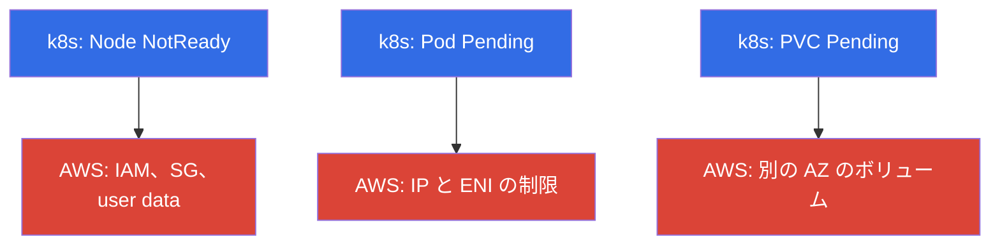
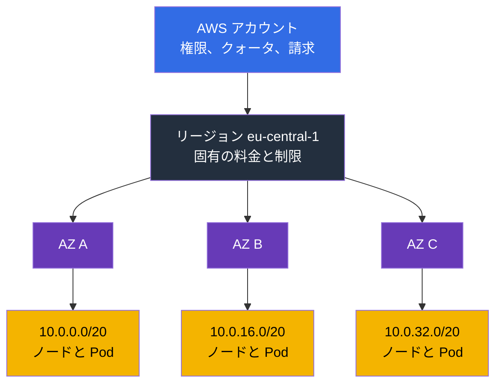
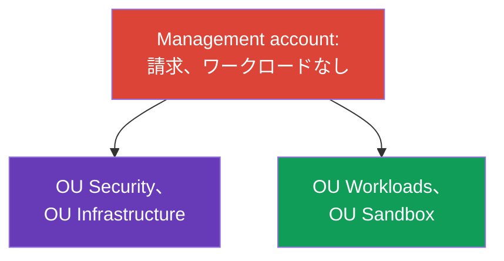
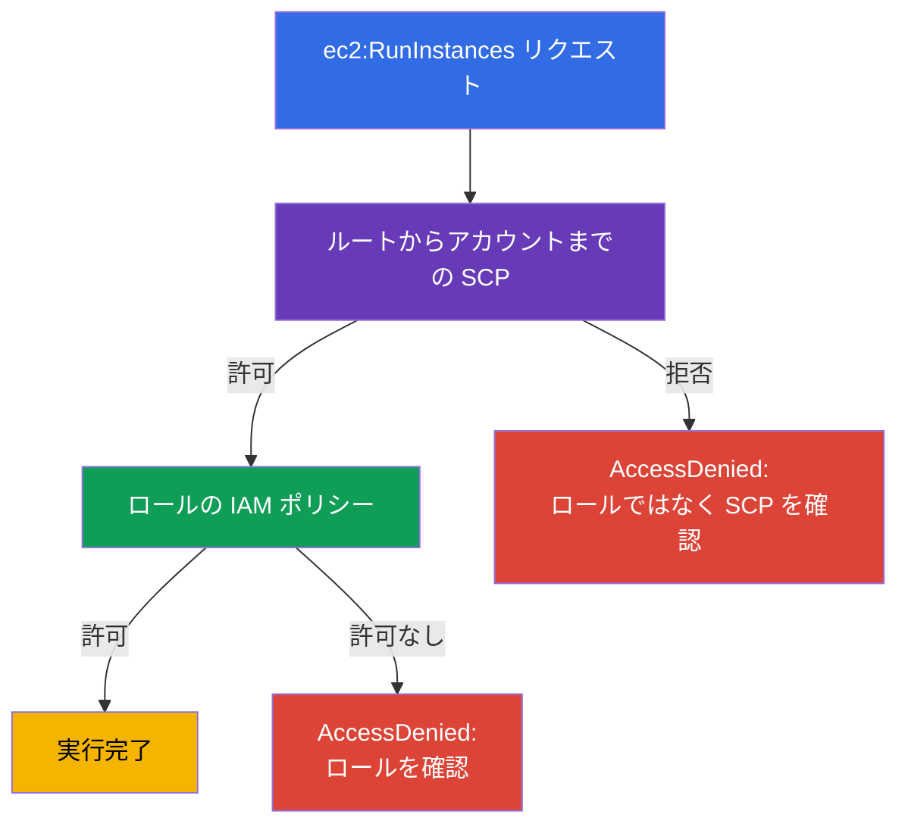
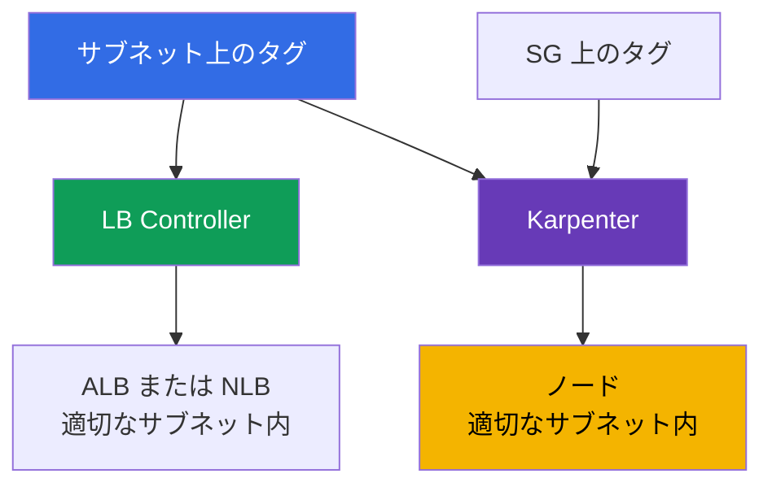

[Русская версия](ru.md) · [Eng version](en.md) · [Versión en español](es.md) · [Version française](fr.md) · [Deutsche Version](de.md) · [ქართული ვერსია](ge.md) · [繁體中文版](tw.md)
# 第0.1章 Kubernetes エンジニアのための AWS: アカウント、リージョン、AZ、クォータ、タグ、請求

> **この先の内容。** CKA を終えたあなたにとって、kubectl、Pod、Deployment、RBAC、PV は馴染みのあるツールです。EKS でもそれらは変わりませんが、クラスターの下には kubeadm にはなかった第2の層が現れます。アカウント、リージョン、アベイラビリティーゾーン、サービス制限、タグ、そして月末の請求です。この章では、ネットワーク、ノード、コストの章を理解するために必要な最小限の AWS 用語を扱います。次に IAM (第0.2章) と VPC (0.3) をこの基礎の上に積み上げます。

## 前提条件

このコースは AWS をゼロから学ぶものではありません。少なくとも「何の話か分かり、コンソールで見つけられる」程度に、クラウドの基本的な枠組みを知っていることを前提とします。

- **パブリッククラウドと従量課金モデルとは何か**: リソースは API からオンデマンドで作成し、ハードウェアではなく利用時間と容量に対して支払います。
- **AWS のグローバルインフラストラクチャ**: リージョン、アベイラビリティーゾーン、エッジロケーション、CDN、およびサービスにはリージョンサービスとグローバルサービスがあること。
- **基本サービスとその用途**: EC2 (仮想マシン)、EBS (ディスク)、S3 (オブジェクトストレージ)、VPC (ネットワーク)、IAM (アクセス)、Route 53 (DNS)、CloudWatch (メトリクスとログ)、KMS (暗号化キー)、ELB (ロードバランサー)。深い知識は不要ですが、それぞれが何をするかは理解しておく必要があります。
- **管理方法**: AWS コンソール、aws cli、API、SDK、Infrastructure as Code という考え方。
- **プロバイダーと顧客の責任分界の基本概念**。

この一覧に初めて見るものがあっても、立ち止まる必要はありません。パート0は不足分を補いますが、AWS の完全なコースではなく EKS の観点に絞ります。クラスター運用に必要な用語はここで詳しく扱い、それ以外のクラウドの知識はコースの範囲外とします。AWS Cloud Practitioner レベルの教材と各サービスの公式ドキュメントで補うとよいでしょう。

Kubernetes 側では CKA レベル、すなわち kubectl、ワークロード、Service と Ingress、RBAC、PV と PVC、probe、Pod のデバッグを前提とします。これらの内容はこのコースでは繰り返しません。

## 0.1.1. Kubernetes エンジニアが AWS の仕組みを理解すべき理由

kubeadm クラスターでは、マシン、ネットワーク、ディスク、アップグレードのすべてを所有していました。EKS では control plane を AWS が運用しますが、それ以外はあなたの責任であり、運用上の問題のほとんどは Kubernetes 自体ではなく、その下にある AWS に起因します。ノードが起動しない - IAM ロールまたは security group が正しくない。Pod が `Pending` のまま - サブネットの IP が尽きた。Autoscaler がノードを追加しない - vCPU クォータに達した。PVC がバインドされない - EBS ボリュームが別の AZ にある。請求額が倍増した - NAT 経由のトラフィックです。

これは正式には**責任共有モデル** (shared responsibility) と呼ばれます。AWS は**クラウドそのもの**のセキュリティ (ハードウェア、ハイパーバイザー、control plane とそのパッチ) を担い、あなたは**クラウド内**のセキュリティ (IAM、VPC、security groups、AMI とノードのバージョン、RBAC、シークレット、イメージ) を担います。境界は第1章で扱います。マネージドサービスは「すべてを代わりにしてくれる」ことを意味しません。

これを視覚化すると2層になります。上は馴染みのある Kubernetes、下は大半の症状の真の原因がある AWS 層です。



kubectl で見える3つの典型的な症状は、AWS における3種類の原因を隠しています。その他のケース (新しいノードがない、LB にアドレスがない) も同じ分類に帰着します。前者は IAM と SG、後者はネットワーク制限です。

このすべてを収める階層も、最初の章から頭に入れておく価値があります。アカウントは権限、クォータ、請求を定め、リージョンは地理を、アベイラビリティーゾーンは障害境界を、サブネットはノードと Pod のアドレスを定めます。



## 0.1.2. アカウント: 分離、アクセス、請求の境界

**AWS アカウント**は、リソースの名前空間、権限の境界、請求単位を兼ねています。デフォルトでは、あるアカウントのリソースから別のアカウントのリソースは見えません。アカウントには12桁の番号があり、ARN、IRSA の trust policy (第16章)、ECR レジストリのアドレス (第20章) で常に目にします。

```bash
# 現在の自分: アカウント番号、現在の identity の ARN、userId
aws sts get-caller-identity
```

**Root ユーザー**はアカウントの所有者で、email とパスワードでログインします。アカウントの閉鎖や支払い情報の変更を含めてすべてを実行でき、アカウント内のポリシーでは制限できません。ルールは単純です。root はアカウント作成時に一度だけ使用し (MFA の有効化と作業用アクセスの作成)、その後は決して使いません。日常的な作業は IAM ロールと一時的なキーで行います (第0.2章)。

会社が成長すると、1つのアカウントでは手狭になり、**AWS Organizations** が必要になります。次の節はこれを詳しく扱います。

| 境界 | 分離するもの | EKS での見え方 |
|---------|---------------|--------------------|
| **アカウント** | 権限、クォータ、請求、blast radius | `prod` を `dev` から分離 |
| **リージョン** | 地理、料金、リージョン障害 | クラスターは1つのリージョンに存在 |
| **AZ** | データセンター障害 | サブネットとノードを3つの AZ に配置 |

## 0.1.3. AWS Organizations: 本番におけるマルチアカウントの仕組み

定義ではなく問題から始めましょう。**1つの**アカウントに、本番 EKS クラスター、テストクラスター、CI、データベース、誰かの機械学習実験、バックアップ用バケットがすべてある会社を想像してください。チームが小さいうちは機能します。しかし、次のような具体的な問題が起こり始めます。

- **`dev` の負荷テストが本番のスケーリングを止める。** クォータはアカウントとリージョン単位です (0.1.6節)。テストが vCPU 制限を消費すると、本番クラスターはノードを追加できません。技術的には正常でもノードは増えません。
- **Terraform の1つの誤字が本番に及ぶ。** すべてのリソースが同じ空間にあるため、誤った `-target`、他人の workspace、あるいは「不要なものをすべて」削除するスクリプトが、触れてはいけないものまで消します。blast radius はビジネス全体です。
- **権限を適切に分離できない。** 開発者にはテストクラスターへのアクセスが必要でも、本番クラスターと同じ IAM にいます。ポリシーはタグと名前の条件で複雑化し、誰も全体を検証できず、結果としてチームの半数に `AdministratorAccess` が与えられます。
- **1つのキーの漏えいがすべてを侵害する。** 1つのアカウントは1つのアクセス境界です。テストパイプラインのキーが、本番と同じ API を開きます。
- **請求をチーム別に分解できない。** すべての支出が1行にまとまり、チーム A のクラスターとチーム B のクラスターを分けられるのは、誰も守らないタグ運用だけです。
- **監査ログがワークロードと同じ場所にある。** 何かを壊したり隠したりした管理者は CloudTrail にアクセスでき、痕跡を消せます。監査上これは許容できません。
- **何かを恒久的に禁止する方法がない。** 「この環境では他リージョンにリソースを作成できず、ログ記録も無効化できない」というルールが欲しくても、アカウント内では管理者が管理者である以上、その制限を解除できます。

明らかな答えは**アカウントの分離**です。本番、テスト、実験を分けます。しかし単純に複数のアカウントを作ると、新しい問題が生じます。1つではなく複数の請求 (および失われるボリュームディスカウント)、各アカウントへの個別ログイン、共通ポリシーの不在、新規アカウントごとの基本設定のコピー、そして「アカウントはいくつあり、中には何があるか」という問いへの答えがなくなります。

**AWS Organizations** はまさにこの問題群への答えです。共通の請求、共通の制限、集中管理を持つアカウントツリーです。アカウントは権限、クォータ、blast radius の強固な境界であり続けますが、孤島ではなくなります。EKS エンジニアにとって重要なのは、クラスターがどのアカウントにあるか、またアカウント管理者であっても一部の設定を変更できない理由を理解することです。

構成要素:

- **Management account** (payer とも呼ぶ) - 組織のルートです。ここにはワークロードを置かず、請求と組織管理だけを置きます。このアカウントの侵害は組織全体の侵害を意味します。
- **Member accounts** - `prod`、`stage`、`dev`、ネットワーク、共有サービスなどの作業用アカウントです。
- **OU (Organizational Unit)** - ポリシーを適用するツリー内のフォルダーです。アカウントは名前ではなく OU でグループ化します。
- **SCP (Service Control Policy)** - OU またはアカウントに対する制限ポリシーです。重要な点として、SCP は**何も許可しません**。可能な権限の上限を定めるだけです。アカウント管理者もその範囲を越えられず、アカウント内の `AdministratorAccess` で SCP の拒否を取り消すことはできません。
- **IAM Identity Center** - 単一のログインポイントです。ユーザーとグループは共通で、特定アカウントへのアクセスは一時的に permission set で与えます (第0.2章)。
- **AWS Control Tower** - 上記すべての完成済み実装であり、図の直後に説明します。

典型的な組織構造は次のようになります。



各 OU に何を置き、なぜ別アカウントにするのか:

| OU | アカウント | 含まれるもの | 分離する理由 |
|----|----------|-----------|-----------------|
| Security | `log-archive`, `audit` | 組織全体の CloudTrail、GuardDuty、Config、Security Hub | 作業用アカウントの管理者が自分自身に関するログを消せてはならない |
| Infrastructure | `network`, `shared-services` | VPC と Transit Gateway、Route 53、共有 ECR、CI、バックアップコピー | ネットワークとイメージはすべての環境で共有するが、所有者は1つ |
| Workloads | `prod`, `stage`, `dev` | それぞれに EKS クラスター | 固有のクォータと権限、環境で限定される blast radius |
| Sandbox | `sandbox-*` | エンジニアの個人用アカウント | 自動クリーンアップ付き予算、共有ネットワークへのアクセスなし |

ただし、`prod` アカウントのクラスターは孤立していません。サブネットは `network` が RAM 経由で提供し、イメージは `shared-services` から取得し、ログは `log-archive` に送られ、バックアップコピーは `shared-services` に戻ります。これらの接続は第20、31、32、41章で扱います。

この構成で権限がどう計算されるかも理解する必要があります。SCP は許可を付与しません。最終的な権限は、ルートからアカウントまでの経路で SCP が許すものと、アカウント内の IAM ポリシーが許すものの**積集合**です。ここから「ポリシーは正しいのにアクセスできない」という典型的な謎が生じます。



ここから時間を節約するルールが導かれます。**明示的な Deny はすべての Allow に勝ちます**。ルートからアカウントまでの経路のどこかで SCP が拒否したなら、IAM ロールを拡張しても無意味です。`AdministratorAccess`、新しいポリシー、trust policy への追加のいずれもアクセスを戻せません。Allow は Deny を取り消せないからです。これはアカウント内でも同じで、IAM ポリシーの明示的な Deny はどの Allow よりも強力です。`AccessDenied` の実践的な確認順序は、OU の SCP、ロールの permissions boundary、ポリシー本体、最後にクラスター内の RBAC (第47章) です。EKS エンジニアはロールから調べ始め、逆順で時間を失うことがよくあります。

### Landing zone と Control Tower

上の図は誰かの空想ではなく、典型的な**landing zone**です。ワークロードを後から受け入れる、あらかじめ準備した組織の基盤です。OU ツリーとサービス用アカウント、統一ログインとロール、必須の guardrails、集中ログと監査、基本ネットワーク構成、タグ付けポリシー、新しいアカウントを同じ方法で発行する仕組みで構成されます。要点は単純です。アカウントは毎回手作業で構成するのではなく、最初から安全かつ均一な状態で生まれるべきです。

**AWS Control Tower** は AWS が提供する完成済みの landing zone です。説明した構造を展開し、ログと監査用のアカウントを作成し、**controls** (guardrails とも呼ばれる) を有効にし、ポリシー、ログ記録、アクセスを備えたテンプレートから新しいアカウントを発行する **account factory** を提供します。Controls は3種類です。**preventive** (アクションを禁止し、技術的には SCP)、**detective** (AWS Config で逸脱を検出)、**proactive** (リソース作成前に CloudFormation テンプレートを検査) です。さらに Control Tower は**ドリフト**を監視します。誰かが OU、ポリシー、サービス用アカウントの設定を手作業で変更すると、コンソールに表示されます。

Control Tower だけが選択肢ではありません。landing zone は Organizations 上に Terraform で構築したり、**Account Factory for Terraform (AFT)** や Landing Zone Accelerator を使用したりもします。選択により基本設定の所有者は変わりますが、本質は変わりません。基盤はコードで記述し、すべてのアカウントに同じように適用します。

### コストと最初に無効化するもの

落とし穴は、Control Tower 自体には AWS の料金がかからず、それが有効化するサービスに対して支払うことです。そのため、クラスターで最初の Pod が起動する前から請求が発生し、ワークロードや休日に関係なく継続します。小規模な組織には不愉快な驚きですが、破滅ではありません。構造をあらかじめ知っておく必要があります。

| 項目 | 支払う対象 | 増加要因 |
|--------|----------------|----------------|
| **AWS Config** | 各リソース変更の configuration item の記録と detective controls のルール評価 | アカウント数 x governed リージョン数 x リソースの変動性。主な要因 |
| `log-archive` の S3 | Config と CloudTrail のログ保存 | 容量と保存期間 |
| CloudTrail | リージョン内の management events の最初のコピーは無料、有料なのは data events と2つ目の trail | trail の重複、data events の有効化 |
| Service Catalog | Account Factory によるアカウントのプロビジョニング | 発行するアカウント数 |
| 周辺コンポーネント (Lambda、EventBridge、SNS、KMS) | サービス呼び出しとキー | 少額でほぼ変動しない |
| AFT を選択した場合 | デフォルトでは CodeBuild 用の VPC endpoints と NAT Gateway | 存在時間ごとの料金 |
| Security Hub、GuardDuty、conformance packs | 基本 landing zone に含まれない別サービス | チェック数、イベント量 |
| Organizations、SCP、IAM Identity Center | 追加料金なし | - |

評価すべきなのは「Control Tower はいくらか」ではなく、configuration item がいくつになるかです。governed リージョン数、アカウント数、リソース変更の頻度を掛け合わせ、次に自リージョンの Config 料金を適用します。したがって、1リージョンに5アカウントの landing zone と、4リージョンに同じ landing zone では、同じワークロードでもコストが何倍も異なります。

EKS にはここで特有の落とし穴があります。**Karpenter はインスタンス、ENI、ボリューム、security group rules を絶えず作成・削除し**、各変更が configuration item になります。動的なクラスターは、静的な node group にはなかった記録の流れを発生させます。Control Tower のドキュメントも、エフェメラルなワークロードで Config コストが増えることを明示しています。

対策は、穏やかなものから強いものまで3つあります。

- ノイジーなタイプには **continuous ではなく daily recording** を使います。Config は状態が変わった場合にだけ1日1件を保存します。日中の履歴は失われますが、CI の流量は減ります。一部の Config サービスタイプ (例: `AWS::Config::ResourceCompliance`) は daily recording をサポートせず、常に連続記録されます。
- **recorder の対象からタイプを除外する**: 「列挙したもの以外をすべて記録する」戦略 (`EXCLUSION_BY_RESOURCE_TYPES`) です。dev と sandbox の候補は、まさに Karpenter が大量に処理する EC2 インスタンス、ネットワークインターフェイス、ボリューム、security group ルールです。
- **ノイジーなアカウントで recorder を完全に無効化する**: Control Tower のドキュメント自体が公式に提案する non-prod 向けの方法です。代償も明確で、そのアカウントでは detective controls が機能しなくなり、変更履歴も失われます。そのため `prod` では行いません。

landing zone バージョン3.0以降、Control Tower はグローバルリソース (IAM ロール、ユーザー、ポリシー) をすべてのリージョンではなくホームリージョンにのみ記録します。これにより重複の一部は自動的に解消されます。

スタートアップが最初から有効化せず、必要になったときに追加できるもの:

| 後回しにするもの | 後回しにできる理由 | 有効化する時期 |
|--------------|----------------|---------------|
| Control Tower 自体 | Organizations、SCP、Identity Center は無料で、OU ツリー、1つの org-trail、不要なリージョンの禁止だけで80%の利点を無料で得られる | アカウントを定常的に発行し始め、手作業のコストが高くなったとき |
| 余分な governed リージョン | Config recorder は各リージョンに配置され、請求が増幅する | DR リージョンが必要になったとき (第42章) |
| ノイジーな dev と sandbox アカウントの Enrollment | Config がそこで最も多くの不要な記録を残す | dev に監査要件が生じたとき |
| Config における全タイプの連続記録 | ノイジーなタイプには daily recording とタイプ除外がある | 正確な変更時系列が必要なとき |
| Security Hub Service-Managed Standard | 管理 control が有効化する、別料金のサービス | 最初の compliance 要件が出たとき (第21章) |
| GuardDuty | landing zone の一部ではなく、別途有効化する | 実際の顧客データを伴って本番投入するとき |
| AFT または CfCT | AFT は endpoints と NAT という常設インフラを追加する | アカウントが数十になりパイプラインが必要なとき |
| CloudTrail の Data events と長期 retention | 監査で最も高価な部分 | ライフサイクルでコールドストレージへ移す規制要件があるとき |

コスト削減が逆効果になる点が2つあります。第一に、**org-trail の上に追加する2つ目の CloudTrail trail** は節約ではなく、課金対象イベントの重複です。独自の trail は特定要件のためだけに作成します。第二に、**proactive controls は CloudFormation テンプレートを検査します**。クラスターを Terraform で記述している場合 (第4章)、それは保護にならず依存できません。禁止の役割は preventive controls、すなわち SCP が担います。

PCI DSS の取得を将来的に計画するスタートアップ向けの有効化順序は、第48章で個別の導入シナリオとして扱います。まず無料の基盤、次に検出、そしてアカウント発行パイプラインです。サービスとタグごとのコスト配賦は第43章で説明します。

EKS エンジニアにとって実践上重要なこと:

- **新しいクラスター用アカウントをゼロから設定することはありません。** account factory から、ログ、ロール、guardrails、通常は基本ネットワークを備えた状態で提供されます。あなたの役割はクラスターであり、アカウント周辺の設定ではありません。
- **一部の設定にアクセスできないのは正常です。** CloudTrail を無効化したり、許可されていないリージョンにリソースを作成したり、暗号化を外したりはできません。preventive control が禁止します。
- **逸脱は検知されます。** IaC を経由せず手作業で作成したリソースは、Config の非準拠または landing zone のドリフトとして現れます。そのためクラスターとその周辺はコードで記述します (第4章)。

EKS クラスターにもたらすもの:

| 組織の特性 | EKS への実践的効果 |
|----------------------|------------------------------|
| クォータはアカウントとリージョン単位 | `dev` の制限が `prod` の容量を消費しない (0.1.6節) |
| blast radius はアカウントで限定 | IAM または Terraform の誤りが本番クラスターに及ばない |
| Consolidated billing | Savings Plans とボリュームディスカウントが全アカウントに適用される (0.1.8) |
| guardrails としての SCP | ログ無効化、別リージョンでのリソース作成、暗号化解除を防ぐ |
| 集中ネットワーク | サブネットまたはトランジットはネットワークアカウントが提供する (第31、32章) |
| 集中サービス | 共有 ECR、別アカウントのバックアップコピー (第20、41章) |

エンジニアとして遭遇する典型的な SCP は、作業リージョン以外のすべてのリージョンの禁止、CloudTrail、Config、GuardDuty の無効化禁止、ログとスナップショットの削除禁止、ボリューム暗号化の要件です。問題は次のように現れます。IAM 権限が完全に正しくても Terraform が `AccessDenied` で失敗します。最初にロールではなく OU の SCP を確認します。

```bash
# 組織の有無と payer の確認
aws organizations describe-organization

# すべてのアカウントと OU (management または delegated admin アカウントで実行)
aws organizations list-accounts --query 'Accounts[].[Id,Name,Status]' --output table
aws organizations list-organizational-units-for-parent --parent-id r-abcd

# 特定のアカウントまたは OU にアタッチされた SCP
aws organizations list-policies-for-target --target-id 123456789012 \
  --filter SERVICE_CONTROL_POLICY
```

ここからマルチアカウントにおける EKS の詳細が始まり、あらかじめ知っておく価値があります。

- **クラスターは1つのアカウントに存在します**が、その周辺のリソースは別アカウントにあります。ネットワークは共有できます。ネットワークアカウントが **AWS RAM** を通じてサブネットを共有し、クラスターは他者の (shared) サブネットに起動します。この場合、サブネットのタグ (0.1.7節) はあなたではなくネットワーク所有者が付与し、タグの調整がプロセスの一部になります。
- **他アカウントのロールにクラスターアクセスを与えます。** Access entry は、CI アカウントまたは Identity Center から来るロールに作成できます (第5章)。デプロイパイプラインが共有サービスアカウントにあるのは一般的な慣行です。
- **別アカウントの共有 ECR からイメージを取得します**。そのため cross-account pull 用のリポジトリポリシーが必要です (第20章)。
- **バックアップは別アカウントへコピーします**。作業用アカウントが侵害されても、クラスターとその復旧ポイントをともに失わないようにするためです (第41章)。
- **セキュリティは監査アカウントから確認します。** GuardDuty、Config、Security Hub は各アカウントで手作業で有効化するのではなく、delegated administrator により組織全体で有効化します (第21章)。

クラスターに必要なアカウント数に唯一の答えはありません。ほぼ常に機能する最小構成は、`prod` を他のすべてから分けることです。本番クラスターには独自のクォータ、権限、メンテナンスウィンドウが必要だからです。その後は「環境ごとにアカウント」(管理が容易で運用コストが低い) と「チームまたは製品ごとにアカウント」(分離とコスト追跡は優れるが、ネットワーク周辺構成とクラスター数が増える - 第44章) の選択になります。

## 0.1.4. リージョンと Availability Zone

**リージョン** (`eu-central-1`、`us-east-1`) は、独自のサービス群と料金を持つ地理的な場所です。リソースはリージョンに紐付きます。`eu-central-1` のサブネットを `us-east-1` のクラスターには接続できず、EKS クラスター全体は1つのリージョン内に存在します。

**Availability Zone (AZ)** はリージョン内の1つ以上の物理的に分離されたデータセンターで、独自の電源、冷却、ネットワークを備えます。同一リージョンの AZ 間のレイテンシーは小さく (数ミリ秒) 、1つのゾーンの障害が他を巻き込むことはありません。ここから可用性に関する最重要ルールが導かれます。**サブネットは少なくとも3つの AZ、ノードは AZ に分散し、ワークロードは topology spread constraints で分散する** (第40章)。AWS は control plane を複数ゾーンに保持しますが、ノードはあなたの責任です。1つの AZ にある1つの node group のクラスターは、その AZ とともに停止します。

誰もがつまずく微妙な点があります。**`eu-central-1a` のような AZ 名は、アカウントごとに異なる物理ゾーンを指します**。AWS は顧客がすべて「最初の」ゾーンに集中しないよう名前を入れ替えます。安定した識別子は `ZoneId` (`euc1-az1`) で、全アカウントで同じです。マルチアカウント構成では必ずこれを比較します。

```bash
# リージョンのすべての AZ: 名前 (アカウントごとに異なる) と安定した ZoneId
aws ec2 describe-availability-zones \
  --region eu-central-1 \
  --query 'AvailabilityZones[].[ZoneName,ZoneId,State]' \
  --output table
```

AZ の構造からもう1つ、第23章で直面する結果があります。**EBS ボリュームは1つの AZ に存在し、同じゾーンのインスタンスにしかマウントできません**。`gp3` の PVC を持つ Pod はそのゾーンに縛られます。Karpenter が別の AZ にノードを起動すると、Pod は `Pending` のままです。これが StorageClass の `WaitForFirstConsumer` と EFS による shared storage につながります (第24章)。

## 0.1.5. ARN: AWS リソースのアドレス指定方法

**ARN (Amazon Resource Name)** はリソースの一意な識別子です。IAM ポリシー、ServiceAccount のアノテーション、コントローラーのマニフェスト、ログ、エラーに現れるため、一目で読める必要があります。一般形はコロンで区切る6フィールドです: `arn:partition:service:region:account-id:resource`。コースでの例:

- `arn:aws:iam::123456789012:role/eks-node-role` - IAM ロール。IAM にはリージョンがありません。
- `arn:aws:eks:eu-central-1:123456789012:cluster/demo` - EKS クラスター。
- `arn:aws:s3:::my-bucket/path/*` - バケット内のオブジェクト。リージョンとアカウントはありません。

`partition` はほぼ常に `aws` ですが、`aws-cn` と `aws-us-gov` もあります。そのような partition にポリシーをコピーするときは、`partition` を変更する必要があります。

ロール ARN はクラスター内のワークロードが AWS の権限を得る手段であり、2つの仕組みでは異なる方法で指定します。

- **IRSA** (第16章): ロール ARN は ServiceAccount の `eks.amazonaws.com/role-arn` アノテーションにあり、ロール自体はクラスターの OIDC プロバイダーを信頼します。ARN または trust policy 内の `sub` の誤りは、ノードではなく Pod の権限拒否として現れます。
- **EKS Pod Identity** (第17章): アノテーションはありません。代わりに EKS API 自体で association を作成し、ロール ARN を明示的に渡します。

```bash
# OIDC アノテーションなしでロールを ServiceAccount に関連付ける
aws eks create-pod-identity-association \
  --cluster-name demo --namespace default \
  --service-account my-sa \
  --role-arn arn:aws:iam::123456789012:role/app-role
```

実践的な結論は、Pod が権限を取得できなければ、まずどちらの仕組みでロールが関連付けられているかを確認することです。診断方法が異なります。IRSA ではアノテーションと trust policy を、Pod Identity では association 自体とノード上のエージェントを確認します。

## 0.1.6. サービスクォータ: クラスターがスケールしなくなる理由

各 AWS サービスには**クォータ (Service Quotas)**、すなわちアカウントとリージョンごとの制限があります。これは請求の制限ではなく保護上限であり、新しいアカウントには低い値が設定されます。

| サービス | クォータ | クラスターへの影響 |
|--------|-------|----------------------|
| `ec2` | Running On-Demand Standard instances (vCPU) | スケーリング時にノードを作成できない |
| `ec2` | All Standard Spot Instance Requests (vCPU) | Spot ノードが起動しない (第13章) |
| `vpc` | Network interfaces per Region | ENI がなく、Pod が IP を取得できない (第6章) |
| `ec2` | EC2-VPC Elastic IPs | NAT Gateway または public アドレスを作成できない |
| `elasticloadbalancing` | Load Balancers per Region | Service または Ingress が LB を取得できない |
| `eks` | Clusters per Region | 追加のクラスターを作成できない |

典型的なシナリオはこうです。負荷が増え、Karpenter または Cluster Autoscaler がノードを追加しようとしても、クラスターには何も現れません。Karpenter または Auto Scaling group のイベントに `VcpuLimitExceeded` か `MaxSpotInstanceCountExceeded` が出ています。上限は AWS 側にあります。

別種の制限として **API rate limits** (throttling) があります。これはリソース数ではなく、サービス API の呼び出し頻度です。大規模なノード群ではコントローラーと autoscaler が EC2 と Auto Scaling を頻繁に呼び出し、`RequestLimitExceeded` または `Throttling` が返ります。これも EKS とともに増えますが、クォータ引き上げではなく、ポーリング頻度を下げ、backoff を伴う retry で対処します。

```bash
# 現在値を含むすべての EC2 クォータ。サービスコードは aws service-quotas list-services
aws service-quotas list-service-quotas \
  --service-code ec2 \
  --query 'Quotas[].[QuotaCode,QuotaName,Value]' \
  --output table

# 特定の on-demand standard instances クォータ (vCPU 上限) と引き上げリクエスト
aws service-quotas get-service-quota --service-code ec2 --quota-code L-1216C47A
aws service-quotas request-service-quota-increase \
  --service-code ec2 --quota-code L-1216C47A --desired-value 256
```

実践では、負荷テストまたは本番クラスターの起動前にクォータを確認して引き上げます。処理には数分から数日かかり、通常必要になるのは待てないときです。

## 0.1.7. タグ: EKS では単なる装飾ではない

**タグ**は AWS リソース上のキーと値の組です。通常タグは整理のために使いますが、EKS では一部が機能的です。コントローラーはタグによってリソースを**検出**するため、タグを外すとレポートではなく仕組みそのものが壊れます。



正しく設定しなければならないタグ:

- `kubernetes.io/role/elb` = `1` を public サブネットに設定 - internet-facing ロードバランサーを配置する場所 (第26章)。
- `kubernetes.io/role/internal-elb` = `1` を private サブネットに設定 - 内部向けです。
- `karpenter.sh/discovery` = サブネットと security groups 上のクラスター名 - Karpenter がノードを起動する場所と SG を選ぶ方法です (第12章)。
- `kubernetes.io/cluster/<クラスター名>` - リソースがクラスターに属することを示す歴史的なマーカーで、古い構成に見られます。

```bash
# internet-facing ロードバランサー用にサブネットを public としてタグ付けする
aws ec2 create-tags --resources subnet-0a1b2c3d4e5f6a7b8 \
  --tags Key=kubernetes.io/role/elb,Value=1

# Karpenter が必要なサブネットを検出できることを確認する
aws ec2 describe-subnets \
  --filters "Name=tag:karpenter.sh/discovery,Values=demo" \
  --query 'Subnets[].[SubnetId,AvailabilityZone]' --output table
```

タグの第2の役割はコスト管理です。必須最小限の `CostCenter`、`Owner`、`Environment` はコスト配賦の基盤であり、AWS Cost Explorer と Kubecost で請求を分解できます (第43章)。より完全なポリシーでは `Team`、`Cluster`、`ManagedBy` を追加し、忘れられたリソースの発見に役立ちます。Terraform ではタグを `default_tags` として設定し、組織では Tag Policies で定め、AWS Config で確認します。

## 0.1.8. 請求: EKS クラスターの料金の内訳

請求書にある「EKS」の行は小額です。サービス自体は control plane の時間料金を取るだけで、主な支出は周辺サービスに流れます。

| 項目 | 支払う対象 | 注記 |
|--------|----------------|-----------|
| EKS control plane | クラスター稼働時間 | 小規模でも大規模でも同じ |
| Extended support | 標準サポート外バージョンのクラスター時間料金の上乗せ | 自動的に有効化され、バージョンの遅れには料金がかかる (第3章) |
| EC2 または Fargate | ノードまたは Pod の vCPU とメモリ | 通常は最大の割合 (第0.4、15章) |
| EBS、EFS、S3、ECR | ボリューム、スナップショット、イメージ | 忘れられたスナップショットは何年も蓄積する |
| NAT Gateway | 稼働時間と各ギガバイト | 典型的な驚き (第31章) |
| Load Balancers | 稼働時間とトラフィック | Service または Ingress ごとに1つ |
| Data transfer | AZ 間および外部へのトラフィック | ゾーン間は両方向で課金される |
| CloudWatch | ログとメトリクスの ingestion と保存 | ノードより高くなることがある (第34章) |

**extended support** の行について補足します。クラスターのバージョンが標準サポート期間内なら、control plane の時間料金はすべて同じです。標準サポート期間が終わるとクラスターは extended support に移行し、ワークロードがまったく変わらなくても同じ時間料金は高くなります。これはクラスター更新ポリシーの `supportType` フィールド (`STANDARD` または `EXTENDED`) で管理し、バージョンの期限とサポートモデルは第3章で扱います。実践で遭遇する2点があります。`supportType: STANDARD` では期限後にクラスターが強制更新され、標準サポート外のバージョンへ**ロールバック**すると extended support の料金が再び発生します (第39章)。つまり、バージョンの遅れはセキュリティリスクだけでなく請求項目です。

```bash
# クラスターのサポート期間と選択された更新ポリシー
aws eks describe-cluster --name demo \
  --query 'cluster.[version,upgradePolicy.supportType]' --output table
```

驚きはほぼ常に2か所にあります。第一は **NAT Gateway** です。イメージを取得し、S3 または ECR に NAT 経由でアクセスするクラスターは、VPC endpoints で回避できるトラフィックにも支払います (第31章)。第二は **AZ 間トラフィック**です。3つのゾーンで頻繁に通信するサービスは継続的な請求を生み、これは可用性のために意識して払うコストです。

```bash
# サービス別の月間コスト内訳。タグ別は --group-by Type=TAG,Key=Cluster
aws ce get-cost-and-usage \
  --time-period Start=2025-01-01,End=2025-02-01 \
  --granularity MONTHLY --metrics "UnblendedCost" \
  --group-by Type=DIMENSION,Key=SERVICE
```

重要な点として、**cost allocation tags は Billing セクションで手作業で有効化します**。データは有効化した時点からのみ現れ、過去にさかのぼって取得できません。そのためコスト管理用のタグは初日に有効化します。OpenCost、Kubecost、right-sizing は第43章で扱います。

## 0.1.9. 安く安全に練習する方法

- **学習専用のアカウント。** 自分のアカウントまたは sandbox を使えば、実験を作業用リソースから分離でき、コースの実際のコストも把握できます。
- **初日から予算とアラーム。** しきい値超過と予測時に通知する AWS Budgets は、忘れた NAT Gateway に1か月後気づくより安価です。
- **演習後はすべて削除する。** クラスター、NAT Gateway、ロードバランサー、EIP は利用時間ではなく存在時間に対して課金されます。**リージョン**は最も近いものを選びます。

```bash
# 現在のアカウント予算: しきい値と通知は一度設定する
aws budgets describe-budgets --account-id 123456789012
```

このコースのラボは Terragrunt により1コマンドで環境を作成・削除できるように構成されています。`apply` が必要なものをすべて作成し、`destroy` は課金対象の残骸を残しません (第0.5章)。

## 0.1.10. 本番での適用方法

組織とアカウント:

- **マルチアカウントをデフォルトにする。** `prod`、`stage`、`dev` を別アカウントに置きます。権限の分離、独立したクォータ、環境別に明確な請求を実現します。本番クラスターは他のものとアカウントを共有しません。
- **Management account は空にする。** ここには請求と Organizations だけを置き、ワークロードもクラスターも置きません。アクセスできるのは MFA を使う少数の人だけです。
- **Landing zone をコードで管理する。** OU ツリー、ログと監査のアカウント、基本 guardrails は、コンソールの手作業ではなく Control Tower または独自コードで展開します。新しいアカウントはテンプレートから発行し、同じ SCP、同じタグ、同じロールセットを備えます。
- **SCP を人為ミスへの保険にする。** 許可リージョン、CloudTrail、Config、GuardDuty の無効化禁止、ログとスナップショットの削除禁止、必須暗号化を定めます。Terraform の `AccessDenied` では IAM ポリシーより先に SCP を確認します。
- **Identity Center による統一ログイン。** 長期キーを持つ IAM ユーザーはゼロにします。グループへの permission set、一時的なロール、使用時にアラートを出す専用の break-glass ロールを使います (第0.2章)。
- **ネットワーク、イメージ、ログ、バックアップを集中化する。** サブネットはネットワークアカウントが RAM 経由で提供するか、Transit Gateway で接続します。イメージは共有 ECR に置き、バックアップコピーは別アカウントへ送り、セキュリティは delegated administrator によって監査アカウントから確認します (第20、21、31、32、41章)。

クラスターとコスト:

- **3つの AZ を標準にする。** サブネットと node groups を少なくとも3つのゾーンに置き、重要なワークロードを topology spread と PDB で分散します (第40章)。
- **起動チェックリストにクォータを入れる。** 本番投入前と負荷テスト前に、vCPU、ENI、EIP、ロードバランサーの制限を確認します。クォータは各アカウントごとにリクエストします。`dev` での引き上げは `prod` に適用されません。
- **タグはコードで付与する。** Terraform の `default_tags`、必須キーを定める Tag Policies、遵守を検証する AWS Config を使います。手作業のタグ付けは長続きしません。
- **FinOps をプロセスにする。** アカウントとタグ別の Cost Explorer、各アカウントのアラーム付き予算、トラフィックと NAT の増加分析を行います。コストはレイテンシーや可用性と同じメトリクスです。

## 0.1.11. ミニ用語集

- **アカウント** - 分離されたリソース空間および請求単位。12桁の番号は ARN と trust policy に含まれます。
- **Root ユーザー** - 無制限の権限を持つアカウント所有者で、初期設定時にのみ必要です。
- **AWS Organizations** - 共通の請求と共通の制限を持つアカウントツリーです。**Management account** は支払いを行うルートアカウントで、ワークロードは置きません。**OU** はポリシーを適用するアカウントのグループです。
- **SCP (Service Control Policy)** - OU またはアカウントに対する制限ポリシーです。権限の上限を定めるだけで、単独では何も許可しません。
- **Landing zone** - OU、サービス用アカウント、guardrails、ログ、アクセス、均一なアカウントを発行する方法からなる、あらかじめ準備した組織基盤です。**AWS Control Tower** は AWS の完成済み landing zone で、controls (preventive、detective、proactive)、ドリフト検出、account factory を提供します。**IAM Identity Center** は統一ログインと permission set によるアクセス付与です。
- **AWS RAM** - たとえばクラスター用 shared サブネットなど、アカウント間でリソースを共有する仕組みです。**Delegated administrator** - GuardDuty、Config、Security Hub、Backup などのサービス管理を組織から委任されたアカウントです。
- **Consolidated billing** - 組織全体の共通請求です。ボリュームディスカウントと Savings Plans は全アカウントに適用されます。
- **リージョン** - リソースが紐付く地理的な場所 (`eu-central-1`) です。
- **Availability Zone (AZ)** - リージョン内の分離されたデータセンターで、信頼性の基礎です。**ZoneId** (`euc1-az1`) は全アカウントで共通の安定した名称です。
- **ARN** - `arn:partition:service:region:account-id:resource` というリソースのアドレスです。
- **Service Quotas** - アカウントとリージョンごとのサービス制限で、リクエストにより引き上げられます。
- **タグ** - キーと値の組です。EKS コントローラーはタグでリソースを見つけ、有効化済みの **cost allocation tag** は請求の内訳に使われます。
- **Shared responsibility** - AWS はクラウドのセキュリティを、あなたはクラウド内のセキュリティを担うモデルです。

## 0.1.12. 章のまとめ

- アカウントは権限、クォータ、請求の境界です。root は使用せず、アクセスには IAM ロールと一時キーを使います (第0.2章)。
- 本番には多数のアカウントがあります。management account は空にし、ログと監査用、ネットワークと共有サービス用、環境別の作業用アカウントを設けます。本番クラスターは専用アカウントに置きます。
- OU の SCP は権限の上限を定めるだけで付与はしません。正しい IAM ポリシーで予期しない `AccessDenied` が出るなら、ほぼ常に SCP です。landing zone と新しいアカウントはコードから発行します。
- マルチアカウントではクラスター周辺構成が変わります。サブネットはネットワークアカウントから RAM 経由で来て、他アカウントのロールにアクセスを与え、共有 ECR からイメージを取得し、バックアップを別アカウントにコピーします (第5、20、31、32、41章)。
- リージョンは地理と料金を、AZ は障害分離を定めます。Multi-AZ は必須で、アカウント間で AZ 名は一致しません。`ZoneId` を比較してください。EBS ボリュームは1つの AZ に存在するため、PVC を持つ Pod はゾーンに縛られます (第23章)。
- ARN は6フィールドで読みます。vCPU、ENI、EIP のクォータは「新しいノードがない」原因になります。
- `kubernetes.io/role/elb` と `karpenter.sh/discovery` のタグは機能的です。コントローラーはこれらでリソースを検出します。他のタグはコスト管理に必要です。
- 請求は control plane、EC2/Fargate、ストレージ、ロードバランサー、NAT、トラフィック、ログから構成されます。驚きはほぼ常にトラフィックと NAT にあります (第31、43章)。

## 0.1.13. 実務での役立ち方

インシデント対応は「どのアカウント、どのリージョン、どの AZ か」という質問から始まり、この時点で解決する問題もあります。クラスター計画はマニフェストではなく、クォータとアドレス計画から始めます。タグが付与され、Cost Explorer がチーム別内訳を示す場合にのみ、コストについてビジネスと話せます。そして最も多いのは、ノードが現れないときに `kubectl describe` だけでなく AWS のクォータも確認することです。

## 0.1.14. 自己確認の質問

1. AWS アカウントは何を分離し、なぜ `prod` には専用アカウントを使うのですか。
2. Root ユーザーは何のために必要で、なぜ日常的に使わないのですか。
3. OU と SCP とは何ですか。なぜ SCP は何も許可できないのですか。
4. Terraform が `AccessDenied` で失敗し、ロールの IAM ポリシーは正しく見えます。どこを確認しますか。
5. なぜ management account にクラスターとワークロードを配置しないのですか。
6. EKS クラスターはどうやって他アカウントのサブネットを利用でき、そのタグの責任者は誰ですか。
7. リージョンと AZ はどう違い、なぜクラスターを少なくとも3つの AZ に配置するのですか。
8. 2つのアカウントで `eu-central-1a` が異なるゾーンになり得るのはなぜで、何を比較しますか。
9. `arn:aws:eks:eu-central-1:123456789012:cluster/demo` をフィールドごとに読んでください。
10. Autoscaler がノードを追加せず、Kubernetes にエラーがありません。AWS のどこを確認しますか。
11. AWS Load Balancer Controller と Karpenter がサブネットに必要とするタグは何ですか。
12. クラスターの請求は何から構成され、なぜ cost allocation tags をあらかじめ有効化するのですか。

## 演習

パート0には独自のラボはありません。これは残りの章を支える基礎です。演習はパート1で、Terragrunt により EKS クラスターを起動するときに始まります。次は IAM です。ポリシー、ロール、一時キーがなければ、EKS ではクラスターへのアクセスも Pod のアクセスも機能しません。

---
[目次](../README_JP.md) · [第0.2章](../00-2-iam/jp.md)
