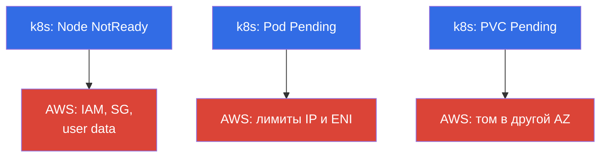
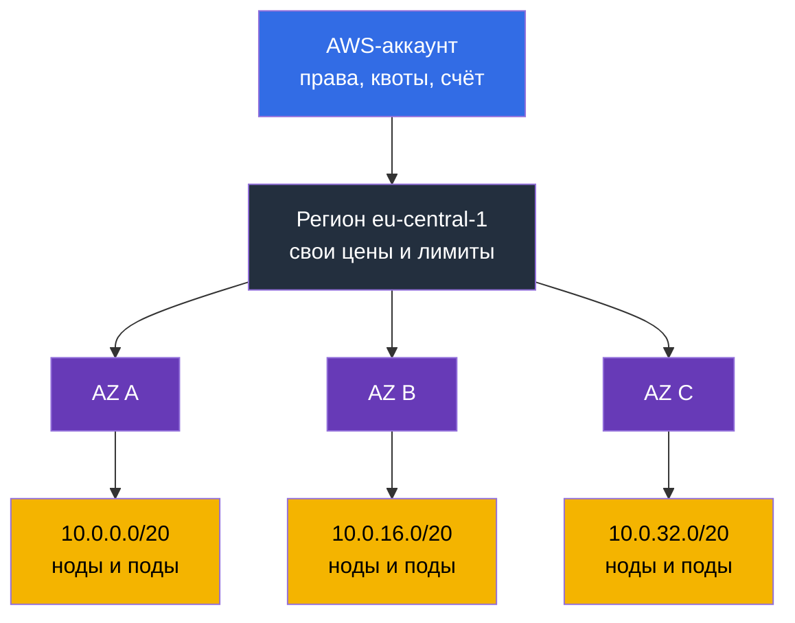
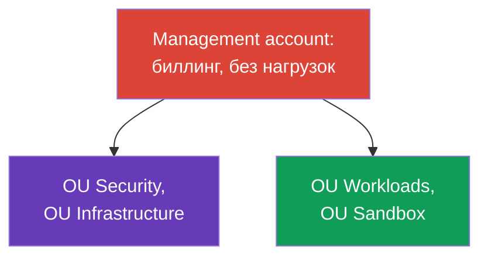
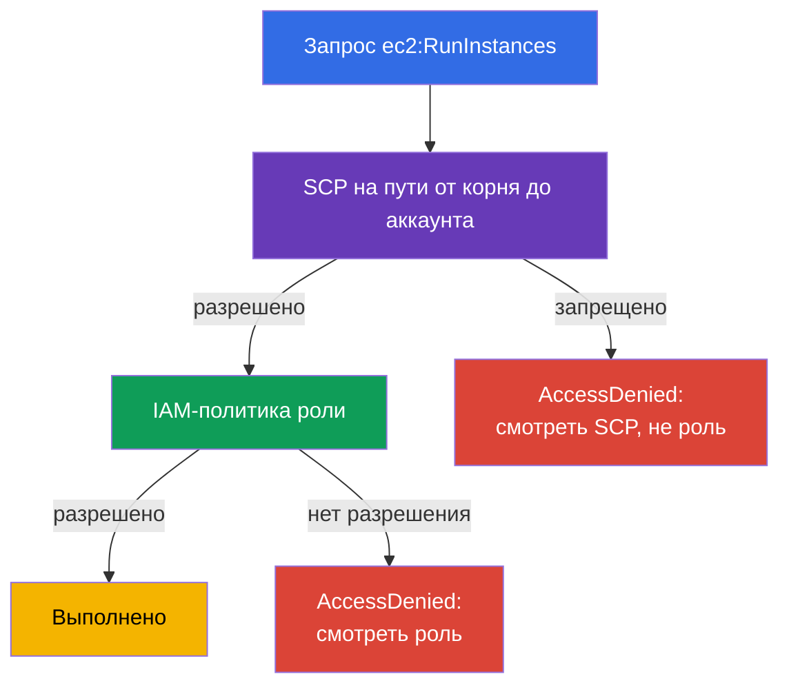
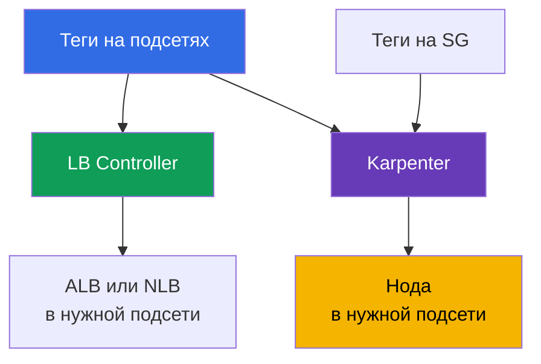

[Eng version](en.md) · [Versión en español](es.md) · [Version française](fr.md) · [Deutsche Version](de.md) · [ქართული ვერსია](ge.md) · [繁體中文版](tw.md) · [日本語版](jp.md)

# Глава 0.1. AWS для инженера Kubernetes: аккаунты, регионы, AZ, квоты, теги, биллинг

> **Что дальше.** Вы пришли с CKA: kubectl, поды, Deployment, RBAC и PV - привычные
> инструменты. В EKS они не меняются, зато под кластером появляется второй слой, которого
> не было в kubeadm: аккаунт, регион, зоны доступности, лимиты сервисов, теги и счёт в
> конце месяца. Эта глава даёт минимальный словарь AWS, без которого главы про сеть, ноды
> и стоимость читаются как перевод. Дальше на нём встанут IAM (глава 0.2) и VPC (0.3).

## Пререквизиты

Курс начинается не с нуля по AWS. Предполагается, что базовый каркас облака вам уже знаком
хотя бы на уровне «понимаю, о чём речь, и найду в консоли»:

- **Что такое публичное облако и модель оплаты по факту потребления**: ресурсы создаются по
  запросу через API, платите за время и объём, а не за железо.
- **Глобальная инфраструктура AWS**: регионы, зоны доступности, edge-локации и CDN, и то, что
  сервисы бывают региональными и глобальными.
- **Базовые сервисы и их назначение**: EC2 (виртуальные машины), EBS (диски), S3 (объектное
  хранилище), VPC (сеть), IAM (доступ), Route 53 (DNS), CloudWatch (метрики и логи), KMS
  (ключи шифрования), ELB (балансировщики). Глубокого знания не нужно, нужно понимание, что
  каждый из них делает.
- **Способы управления**: консоль AWS, aws cli, API и SDK, идея инфраструктуры как кода.
- **Общая идея разделения ответственности** между провайдером и клиентом.

Если что-то из списка ново, это не повод останавливаться: Часть 0 как раз добирает
недостающее, но именно в разрезе EKS, а не как полный курс по AWS. Термины, которые нужны
для эксплуатации кластера, разбираются здесь подробно; остальное облако остаётся за рамками
курса, и его удобно закрыть материалами уровня AWS Cloud Practitioner и официальной
документацией сервисов.

Со стороны Kubernetes предполагается уровень CKA: kubectl, рабочие нагрузки, Service и
Ingress, RBAC, PV и PVC, probes, отладка подов. Эти темы в курсе не повторяются.

## 0.1.1. Зачем инженеру Kubernetes разбираться в устройстве AWS

В kubeadm-кластере вы владели всем: машинами, сетью, диском, апгрейдом. В EKS control
plane обслуживает AWS, всё остальное остаётся вашим, и почти каждая эксплуатационная
проблема упирается не в Kubernetes, а в AWS под ним. Нода не поднялась - не та IAM-роль
или security group. Под висит в `Pending` - кончились IP в подсети. Autoscaler не
добавляет ноды - квота на vCPU. PVC не привязывается - том EBS в другой AZ. Счёт вырос
вдвое - трафик через NAT.

Формально это **модель разделённой ответственности** (shared responsibility): AWS отвечает
за безопасность **самого облака** (железо, гипервизор, control plane и его патчи), вы - за
безопасность **в облаке** (IAM, VPC и security groups, версии AMI и нод, RBAC, секреты,
образы). Границу разбираем в главе 1; управляемый сервис не значит «за меня всё сделают».

Наглядно это выглядит как два слоя. Сверху привычный Kubernetes, снизу слой AWS, в котором
и находятся настоящие причины большинства симптомов:



Три типичных симптома в kubectl скрывают три категории причин в AWS. Остальные случаи (нет
новых нод, LB без адреса) сводятся к тем же категориям: первая - к IAM и SG, вторая - к
сетевым лимитам.

Иерархия, в которую всё это укладывается, тоже стоит того, чтобы держать её в голове с
первой главы: аккаунт задаёт права, квоты и счёт, регион - географию, зоны доступности -
границу отказа, подсети - адреса для нод и подов.



## 0.1.2. Аккаунт: граница изоляции, доступа и счёта

**AWS-аккаунт** - это одновременно пространство имён ресурсов, граница прав и единица
биллинга: ресурсы одного аккаунта по умолчанию не видят ресурсы другого. У аккаунта есть
12-значный номер, который вы будете видеть постоянно: в ARN, в trust policy для IRSA
(глава 16), в адресе реестра ECR (глава 20).

```bash
# Кто я сейчас: номер аккаунта, ARN текущей identity, userId
aws sts get-caller-identity
```

**Root-пользователь** - владелец аккаунта, вход по email и паролю. Он может всё, включая
закрытие аккаунта и смену платёжных данных, и его нельзя ограничить политиками внутри
аккаунта. Правило простое: root используется один раз при создании аккаунта (включить
MFA, создать рабочий доступ) и больше не используется никогда, а повседневная работа
идёт через IAM-роли и временные ключи (глава 0.2).

Когда компания растёт, один аккаунт становится тесным, и появляется **AWS Organizations** -
следующий раздел целиком про него.

| Граница | Что изолирует | Как выглядит в EKS |
|---------|---------------|--------------------|
| **Аккаунт** | права, квоты, счёт, взрывной радиус | `prod` отдельно от `dev` |
| **Регион** | географию, цены, отказ региона | кластер живёт в одном регионе |
| **AZ** | отказ датацентра | подсети и ноды в 3 AZ |

## 0.1.3. AWS Organizations: как устроен мультиаккаунт в продакшене

Начнём с проблемы, а не с определения. Представьте компанию, которая живёт в **одном**
аккаунте: там прод-кластер EKS, тестовый кластер, CI, база данных, чей-то эксперимент с
машинным обучением и бакет с бэкапами. Пока команда маленькая, это работает. Дальше начинают
происходить вполне конкретные вещи:

- **Нагрузочный тест в `dev` останавливает масштабирование прода.** Квоты считаются на
  аккаунт и регион (раздел 0.1.6): тест съел лимит vCPU, и прод-кластер не добавляет ноды.
  Технически всё исправно, но нод нет.
- **Одна опечатка в Terraform достаёт прод.** Все ресурсы в одном пространстве, поэтому
  неверный `-target`, чужой workspace или скрипт очистки «всего, что не нужно» уносит то, что
  трогать было нельзя. Взрывной радиус равен всему бизнесу.
- **Права невозможно разделить честно.** Разработчику нужен доступ к тестовому кластеру, а он
  оказывается в одном IAM с прод-кластером. Политики обрастают условиями по тегам и именам,
  их никто не может проверить целиком, и в итоге у половины команды `AdministratorAccess`.
- **Утечка одного ключа компрометирует всё.** Один аккаунт - одна граница доступа: ключ из
  тестового пайплайна открывает те же API, что и прод.
- **Счёт нельзя разложить по командам.** Все расходы в одной строке, а отделить кластер
  команды A от кластера команды B удаётся только тегами, дисциплину которых никто не держит.
- **Логи аудита лежат там же, где нагрузки.** Администратор, который что-то сломал или скрыл,
  имеет доступ к CloudTrail и может подчистить следы. Для аудита это неприемлемо.
- **Нет способа запретить что-то навсегда.** Хочется правила уровня «в этой среде нельзя
  создавать ресурсы в чужих регионах и нельзя отключать логирование» - но внутри аккаунта
  любой администратор снимет такое ограничение, потому что он администратор.

Очевидный ответ - **разделить аккаунты**: прод отдельно, тест отдельно, эксперименты отдельно.
Но наивное «просто завести несколько аккаунтов» создаёт новый набор проблем: несколько
счетов вместо одного (и потерянные объёмные скидки), отдельные логины в каждый аккаунт,
никакой общей политики, копипаста базовых настроек при каждом новом аккаунте и полное
отсутствие ответа на вопрос «сколько у нас всего аккаунтов и что в них».

**AWS Organizations** - это ответ ровно на этот набор проблем: дерево аккаунтов, у которого
общий счёт, общие ограничения и централизованное управление. Аккаунт остаётся жёсткой
границей прав, квот и взрывного радиуса, но перестаёт быть островом. Инженеру EKS это важно
по двум причинам: он должен понимать, в каком аккаунте живёт его кластер, и почему часть
настроек ему недоступна, даже если в аккаунте он администратор.

Элементы конструкции:

- **Management account** (он же payer) - корень организации. В нём не держат нагрузки: только
  биллинг и управление организацией. Компрометация этого аккаунта означает компрометацию всей
  организации.
- **Member accounts** - рабочие аккаунты: `prod`, `stage`, `dev`, сетевой, общих сервисов.
- **OU (Organizational Unit)** - папка в дереве, к которой применяются политики. Аккаунты
  группируют по OU, а не по названию.
- **SCP (Service Control Policy)** - политика-ограничитель на OU или аккаунт. Важная деталь:
  SCP **ничего не разрешает**, она задаёт максимум возможных прав. Даже администратор аккаунта
  не выйдет за её рамки, а `AdministratorAccess` внутри аккаунта не отменяет запрет из SCP.
- **IAM Identity Center** - единая точка входа: пользователи и группы одни, а доступ в
  конкретный аккаунт выдаётся permission set'ом на время (глава 0.2).
- **AWS Control Tower** - готовая реализация всего перечисленного, о ней сразу после схемы.

Типовая структура организации выглядит так:



Что лежит внутри каждой OU и почему это отдельные аккаунты:

| OU | Аккаунты | Что в них | Почему отдельно |
|----|----------|-----------|-----------------|
| Security | `log-archive`, `audit` | CloudTrail всей организации, GuardDuty, Config, Security Hub | админ рабочего аккаунта не должен уметь чистить логи о себе |
| Infrastructure | `network`, `shared-services` | VPC и Transit Gateway, Route 53, общий ECR, CI, копии бэкапов | сеть и образы общие для всех сред, а владелец у них один |
| Workloads | `prod`, `stage`, `dev` | по кластеру EKS в каждом | свои квоты, свои права, взрывной радиус ограничен средой |
| Sandbox | `sandbox-*` | личные аккаунты инженеров | бюджет с автоочисткой, нет доступа к общей сети |

Кластер в аккаунте `prod` при этом не изолирован: подсети ему выдаёт `network` через RAM,
образы он тянет из `shared-services`, логи уходят в `log-archive`, копии бэкапов - обратно в
`shared-services`. Эти связи разбираем в главах 20, 31, 32 и 41.

Отдельно стоит понять, как считаются права в такой конструкции. SCP не выдаёт разрешений:
итоговые права - это **пересечение** того, что позволяет SCP на пути от корня до аккаунта, и
того, что даёт IAM-политика внутри аккаунта. Отсюда и типовая загадка «политика верная, а
доступа нет»:



Из этого следует правило, которое экономит часы: **явный Deny побеждает любой Allow**. Если
запрет сработал в SCP на любом уровне пути от корня до аккаунта, расширять IAM-роль
бессмысленно - ни `AdministratorAccess`, ни новая политика, ни дополнение trust policy не
вернут доступ, потому что Allow не отменяет Deny. То же верно и внутри аккаунта: явный Deny в
IAM-политике сильнее любого Allow. Практический порядок разбора `AccessDenied`: сначала SCP на
OU, потом permissions boundary роли, потом сама политика, и только затем RBAC внутри кластера
(глава 47). Инженеры EKS чаще всего теряют время наоборот, начиная с роли.

### Landing zone и Control Tower

Схема выше - не чья-то фантазия, а типовая **landing zone**: заранее подготовленный каркас
организации, в который потом заезжают нагрузки. В него входит дерево OU и служебные аккаунты,
единый вход и роли, обязательные guardrails, централизованные логи и аудит, базовая сетевая
схема, политика тегирования и способ выпускать новые аккаунты одинаковыми. Смысл простой:
аккаунт должен рождаться уже безопасным и однородным, а не настраиваться руками каждый раз.

**AWS Control Tower** - готовая landing zone от AWS. Она разворачивает описанную структуру,
создаёт аккаунты для логов и аудита, включает набор **controls** (они же guardrails) и даёт
**account factory** - выпуск нового аккаунта по шаблону, сразу с политиками, логированием и
доступом. Controls делятся на три типа: **preventive** (запрещают действие, технически это
SCP), **detective** (находят отклонения через AWS Config) и **proactive** (проверяют шаблоны
CloudFormation до создания ресурсов). Отдельно Control Tower следит за **дрейфом**: если
кто-то руками поменял OU, политику или настройку служебного аккаунта, это видно в консоли.

Control Tower не единственный путь. Landing zone собирают и сами: терраформом поверх
Organizations, через **Account Factory for Terraform (AFT)** или через Landing Zone
Accelerator. Выбор влияет на то, кто владеет базовыми настройками, но не на суть: каркас
описан кодом и применяется одинаково ко всем аккаунтам.

### Сколько это стоит и что выключить на старте

Ловушка в том, что за сам Control Tower AWS денег не берёт: вы платите за сервисы, которые
он включает. Поэтому счёт появляется до того, как в кластере запустится первый под, и он
постоянный: не зависит ни от нагрузки, ни от выходных. Для небольшой организации это
неприятный сюрприз, а не катастрофа, но знать структуру надо заранее.

| Статья | За что платите | От чего растёт |
|--------|----------------|----------------|
| **AWS Config** | запись configuration item на каждое изменение ресурса плюс оценки правил detective controls | аккаунты x governed-регионы x изменчивость ресурсов. Главный драйвер |
| S3 в `log-archive` | хранение логов Config и CloudTrail | объём и срок хранения |
| CloudTrail | первая копия management-событий в регионе бесплатна; платно - data events и второй трейл | дубли трейлов, включение data events |
| Service Catalog | провижининг аккаунтов через Account Factory | число выпусков аккаунтов |
| Обвязка (Lambda, EventBridge, SNS, KMS) | служебные вызовы и ключи | мало и почти не меняется |
| AFT, если выбран | по умолчанию VPC endpoints плюс NAT Gateway для CodeBuild | почасовая плата за существование |
| Security Hub, GuardDuty, conformance packs | отдельные сервисы, не входят в базовую landing zone | число проверок, объём событий |
| Organizations, SCP, IAM Identity Center | без дополнительной платы | - |

Оценивать надо не «сколько стоит Control Tower», а сколько будет configuration item. Считается
это так: число governed-регионов, умноженное на число аккаунтов, умноженное на то, как часто
у вас меняются ресурсы. Дальше берётся прайс Config в вашем регионе. Именно поэтому landing
zone на пять аккаунтов в одном регионе и та же landing zone в четырёх регионах отличаются
кратно при одинаковой нагрузке.

Для EKS здесь есть отдельная засада: **Karpenter создаёт и удаляет инстансы, ENI, тома и
security group rules постоянно**, а каждое такое изменение - это configuration item.
Динамический кластер генерирует поток записей, которого не было у статичной node group.
Документация Control Tower прямо предупреждает про рост затрат Config на эфемерных нагрузках.

Лечится это тремя способами, от мягкого к жёсткому:

- **daily recording вместо continuous** для шумных типов: Config сохраняет одну запись за
  сутки, и только если состояние изменилось. Хронология внутри дня теряется, зато поток CI
  падает. Для нескольких служебных типов Config (например `AWS::Config::ResourceCompliance`)
  daily recording не поддерживается, они всегда пишутся непрерывно.
- **исключение типов из области рекордера**: стратегия «писать всё, кроме перечисленного»
  (`EXCLUSION_BY_RESOURCE_TYPES`). Кандидаты в dev и sandbox - ровно то, что перемалывает
  Karpenter: инстансы EC2, сетевые интерфейсы, тома, правила security group.
- **выключить рекордер в шумном аккаунте целиком**: путь для non-prod, который официально
  предлагает сама документация Control Tower. Цена честная: в этом аккаунте перестают
  работать detective controls и пропадает журнал изменений, поэтому для `prod` так не делают.

Начиная с landing zone версии 3.0 Control Tower уже пишет глобальные ресурсы (роли IAM,
пользователей, политики) только в домашнем регионе, а не в каждом - это снимает часть
дублирования само собой.

Что стартап может не включать сразу, а добавить, когда появится причина:

| Что отложить | Почему можно | Когда включать |
|--------------|--------------|----------------|
| Сам Control Tower | Organizations, SCP и Identity Center бесплатны: дерево OU, один org-trail и запрет лишних регионов дают 80% пользы даром | когда аккаунты начинают выпускаться регулярно и руками это уже дорого |
| Лишние governed-регионы | Config-рекордер ставится в каждом, счёт умножается | при появлении DR-региона (глава 42) |
| Enrollment шумных dev и sandbox аккаунтов | Config в них пишет больше всего мусора | когда на dev появятся требования аудита |
| Непрерывная запись всех типов в Config | для шумных типов есть daily recording и исключение типов | когда нужна точная хронология изменений |
| Security Hub Service-Managed Standard | это отдельный тарифицируемый сервис, включается управляющим control | при первых требованиях compliance (глава 21) |
| GuardDuty | не часть landing zone, включается отдельно | при выходе в прод с реальными данными клиентов |
| AFT или CfCT | AFT добавляет постоянную инфраструктуру: endpoints и NAT | когда аккаунтов десятки и нужен конвейер |
| Data events CloudTrail и долгий retention | самая дорогая часть аудита | под регуляторное требование, с lifecycle в холодное хранилище |

Два пункта, где экономия оборачивается против вас. Первое: **второй CloudTrail-трейл поверх
org-trail** - это не экономия, а дубль тарифицируемых событий, свой трейл заводят только под
конкретное требование. Второе: **proactive controls проверяют шаблоны CloudFormation**, и если
ваш кластер описан Terraform (глава 4), защитой они не являются - полагаться на них нельзя,
и место запретов занимают preventive controls, то есть SCP.

Порядок включения для стартапа, который планирует со временем пройти PCI DSS, разбирается в
главе 48 как отдельный сценарий внедрения: сначала бесплатный каркас, потом детект, потом
конвейер аккаунтов. Раскладка расходов по сервисам и тегам - в главе 43.

Что из этого важно инженеру EKS на практике:

- **Аккаунт под новый кластер вы не настраиваете с нуля.** Он приходит из account factory уже
  с логами, ролями, guardrails и, как правило, с базовой сетью. Ваша задача - кластер, а не
  обвязка аккаунта.
- **Часть настроек вам недоступна, и это норма.** Не получится выключить CloudTrail, создать
  ресурс в неразрешённом регионе или снять шифрование - запрещает preventive control.
- **Отклонения заметят.** Ресурс, созданный руками мимо IaC, всплывёт как несоответствие в
  Config или как дрейф landing zone. Поэтому кластер и его обвязку описывают кодом (глава 4).

Что это даёт кластеру EKS:

| Свойство организации | Практический эффект для EKS |
|----------------------|------------------------------|
| Квоты считаются на аккаунт и регион | лимиты `dev` не съедают ёмкость `prod` (раздел 0.1.6) |
| Взрывной радиус ограничен аккаунтом | ошибка в IAM или Terraform не достаёт прод-кластер |
| Consolidated billing | Savings Plans и объёмные скидки действуют на все аккаунты (0.1.8) |
| SCP как guardrails | нельзя выключить логи, создать ресурс в чужом регионе, снять шифрование |
| Централизованная сеть | подсети или транзит выдаёт сетевой аккаунт (главы 31 и 32) |
| Централизованные сервисы | общий ECR, копии бэкапов в отдельный аккаунт (главы 20 и 41) |

Типовые SCP, с которыми вы столкнётесь как инженер: запрет всех регионов, кроме рабочих;
запрет отключать CloudTrail, Config и GuardDuty; запрет удалять логи и снапшоты; требование
шифрования томов. Ломается это так: Terraform падает с `AccessDenied` при вполне корректных
IAM-правах. Первым делом смотрят не роль, а SCP на OU.

```bash
# Есть ли организация и кто в ней payer
aws organizations describe-organization

# Все аккаунты и OU (выполняется в management или delegated admin аккаунте)
aws organizations list-accounts --query 'Accounts[].[Id,Name,Status]' --output table
aws organizations list-organizational-units-for-parent --parent-id r-abcd

# Какие SCP навешены на конкретный аккаунт или OU
aws organizations list-policies-for-target --target-id 123456789012 \
  --filter SERVICE_CONTROL_POLICY
```

Дальше начинается специфика EKS в мультиаккаунте, и её стоит знать заранее:

- **Кластер живёт в одном аккаунте**, но ресурсы вокруг него - в других. Сеть может быть
  общей: сетевой аккаунт делится подсетями через **AWS RAM**, и кластер поднимается в чужих
  (shared) подсетях. Тогда теги на подсетях (раздел 0.1.7) ставит владелец сети, а не вы, и
  согласование тегов становится частью процесса.
- **Доступ в кластер выдаётся ролям из других аккаунтов.** Access entry можно создать на
  роль, которая приходит из аккаунта CI или из Identity Center (глава 5). Это нормальная
  практика: пайплайн деплоя живёт в аккаунте общих сервисов.
- **Образы тянут из общего ECR** другого аккаунта, значит нужна политика репозитория на
  cross-account pull (глава 20).
- **Бэкапы копируют в отдельный аккаунт**, чтобы компрометация рабочего аккаунта не унесла
  вместе с кластером и его точки восстановления (глава 41).
- **Безопасность смотрят из аккаунта аудита.** GuardDuty, Config и Security Hub включают на
  всю организацию через delegated administrator, а не в каждом аккаунте руками (глава 21).

Сколько аккаунтов нужно под кластеры - вопрос без единственного ответа. Минимум, который
работает почти всегда: `prod` отдельно от всего остального, потому что у прод-кластера свои
квоты, свои права и своё окно обслуживания. Дальше выбор между «аккаунт на среду» (проще
управлять, дешевле в администрировании) и «аккаунт на команду или продукт» (лучше изоляция и
учёт расходов, но больше сетевой обвязки и больше кластеров в парке - глава 44).

## 0.1.4. Регион и Availability Zone

**Регион** (`eu-central-1`, `us-east-1`) - географическая площадка со своим набором сервисов
и своими ценами. Ресурсы привязаны к региону: подсеть из `eu-central-1` не подключить к
кластеру в `us-east-1`, и кластер EKS целиком живёт внутри одного региона.

**Availability Zone (AZ)** - один или несколько физически изолированных датацентров внутри
региона: своё питание, охлаждение, сеть. Задержка между AZ одного региона малая (единицы
миллисекунд), но отказ одной зоны не задевает остальные. Отсюда главное правило
отказоустойчивости: **подсети минимум в трёх AZ, ноды размазаны по AZ, нагрузки разведены
через topology spread constraints** (глава 40). Control plane AWS и так держит в нескольких
зонах, а за ноды отвечаете вы: кластер с одной node group в одной AZ падает вместе с ней.

Тонкость, на которой спотыкаются все: **имя AZ вида `eu-central-1a` в разных аккаунтах
указывает на разные физические зоны**. AWS перемешивает имена, чтобы клиенты не
сваливались все в «первую» зону. Стабильный идентификатор - `ZoneId` (`euc1-az1`), он
одинаков во всех аккаунтах, и в мультиаккаунтных схемах сравнивать надо именно его.

```bash
# Все AZ региона: имя (у каждого аккаунта своё) и стабильный ZoneId
aws ec2 describe-availability-zones \
  --region eu-central-1 \
  --query 'AvailabilityZones[].[ZoneName,ZoneId,State]' \
  --output table
```

Ещё одно следствие устройства AZ, которое ударит по вам в главе 23: **том EBS живёт в одной
AZ и монтируется только к инстансу из этой же зоны**. Под с PVC на `gp3` привязан к своей
зоне: если Karpenter поднимет ноду в другой AZ, под останется в `Pending`. Отсюда
`WaitForFirstConsumer` в StorageClass и shared storage через EFS (глава 24).

## 0.1.5. ARN: как адресуется любой ресурс AWS

**ARN (Amazon Resource Name)** - уникальный идентификатор ресурса. Он встречается в
политиках IAM, аннотациях ServiceAccount, манифестах контроллеров, логах и ошибках,
поэтому его надо читать с первого взгляда. Общий вид - шесть полей через двоеточие:
`arn:partition:service:region:account-id:resource`. Примеры из курса:

- `arn:aws:iam::123456789012:role/eks-node-role` - IAM-роль, у IAM нет региона.
- `arn:aws:eks:eu-central-1:123456789012:cluster/demo` - кластер EKS.
- `arn:aws:s3:::my-bucket/path/*` - объекты в бакете, без региона и аккаунта.

`partition` почти всегда `aws`, но бывает `aws-cn` и `aws-us-gov`: копируя политику в
такой раздел, partition придётся поменять.

ARN роли - это то, чем нагрузка в кластере получает права в AWS, и в двух механизмах он
указывается по-разному:

- **IRSA** (глава 16): ARN роли живёт в аннотации ServiceAccount
  `eks.amazonaws.com/role-arn`, а сама роль доверяет OIDC-провайдеру кластера. Ошибка в ARN
  или в `sub` внутри trust policy выглядит как отказ в правах у пода, не у ноды.
- **EKS Pod Identity** (глава 17): аннотации нет, вместо неё создаётся association в API
  самого EKS, где ARN роли передаётся явно:

```bash
# Связать роль с ServiceAccount без OIDC-аннотаций
aws eks create-pod-identity-association \
  --cluster-name demo --namespace default \
  --service-account my-sa \
  --role-arn arn:aws:iam::123456789012:role/app-role
```

Практический вывод: если под не получил прав, сначала смотрят, каким из двух механизмов роль
привязана, потому что диагностика у них разная - у IRSA проверяют аннотацию и trust policy, у
Pod Identity сам association и агент на ноде.

## 0.1.6. Сервисные квоты: почему кластер перестаёт масштабироваться

У каждого сервиса AWS есть **квоты (Service Quotas)** - лимиты на аккаунт и регион. Это
не биллинговое ограничение, а защитный потолок, и новый аккаунт получает его низким.

| Сервис | Квота | Чем бьёт по кластеру |
|--------|-------|----------------------|
| `ec2` | Running On-Demand Standard instances (vCPU) | ноды не создаются при масштабировании |
| `ec2` | All Standard Spot Instance Requests (vCPU) | спот-ноды не поднимаются (глава 13) |
| `vpc` | Network interfaces per Region | нет ENI, поды не получают IP (глава 6) |
| `ec2` | EC2-VPC Elastic IPs | не создать NAT Gateway или public-адрес |
| `elasticloadbalancing` | Load Balancers per Region | Service или Ingress не получает LB |
| `eks` | Clusters per Region | не создать ещё один кластер |

Типовой сценарий: нагрузка выросла, Karpenter или Cluster Autoscaler пытается добавить
ноды, в кластере ничего не появляется, а в событиях Karpenter или Auto Scaling group видно
`VcpuLimitExceeded` или `MaxSpotInstanceCountExceeded`. Потолок стоит в AWS.

Отдельный класс лимитов - **API rate limits** (throttling): частота вызовов к API сервиса,
а не число ресурсов. При большом парке нод контроллеры и autoscaler часто дёргают EC2 и
Auto Scaling, и в ответ прилетает `RequestLimitExceeded` или `Throttling`. Это тоже растёт
вместе с EKS, но лечится не повышением квоты, а реже опросами и ретраями с backoff.

```bash
# Все квоты EC2 с текущими значениями; коды сервисов - aws service-quotas list-services
aws service-quotas list-service-quotas \
  --service-code ec2 \
  --query 'Quotas[].[QuotaCode,QuotaName,Value]' \
  --output table

# Конкретная квота on-demand standard instances (лимит в vCPU) и запрос повышения
aws service-quotas get-service-quota --service-code ec2 --quota-code L-1216C47A
aws service-quotas request-service-quota-increase \
  --service-code ec2 --quota-code L-1216C47A --desired-value 256
```

Практика: перед нагрузочным тестом или запуском prod-кластера квоты проверяют и повышают
заранее. Обработка занимает от минут до дней, а нужна она обычно тогда, когда ждать нельзя.

## 0.1.7. Теги: в EKS это не косметика

**Тег** - пара ключ/значение на ресурсе AWS. Обычно теги нужны для порядка, а в EKS часть
тегов функциональна: по ним контроллеры **находят** ресурсы, и уберёте тег - сломается
механика, а не отчёт.



Теги, которые обязаны быть правильными:

- `kubernetes.io/role/elb` = `1` на публичных подсетях - куда ставить internet-facing
  балансировщики (глава 26).
- `kubernetes.io/role/internal-elb` = `1` на приватных подсетях - для внутренних.
- `karpenter.sh/discovery` = имя кластера на подсетях и security groups - как Karpenter
  выбирает, где и с какой SG поднимать ноды (глава 12).
- `kubernetes.io/cluster/<имя-кластера>` - историческая метка принадлежности ресурса
  кластеру, встречается в старых конфигурациях.

```bash
# Пометить подсеть как публичную для internet-facing балансировщиков
aws ec2 create-tags --resources subnet-0a1b2c3d4e5f6a7b8 \
  --tags Key=kubernetes.io/role/elb,Value=1

# Проверить, что Karpenter найдёт нужные подсети
aws ec2 describe-subnets \
  --filters "Name=tag:karpenter.sh/discovery,Values=demo" \
  --query 'Subnets[].[SubnetId,AvailabilityZone]' --output table
```

Вторая роль тегов - учёт денег. Обязательный минимум `CostCenter`, `Owner`, `Environment` -
это основа аллокации затрат: по ним счёт раскладывается в AWS Cost Explorer и в Kubecost
(глава 43). Более полная политика добавляет `Team`, `Cluster`, `ManagedBy` и помогает найти
забытые ресурсы. Теги задают в Terraform как `default_tags`, а в организации закрепляют
через Tag Policies и проверяют AWS Config.

## 0.1.8. Биллинг: из чего складывается счёт за кластер EKS

Строки «EKS» в счёте мало: сам сервис берёт почасовую плату за control plane, а
основные деньги уходят в соседние сервисы.

| Статья | За что платите | Замечание |
|--------|----------------|-----------|
| EKS control plane | час работы кластера | одинаково для мелкого и крупного кластера |
| Extended support | повышенная ставка за час кластера на версии вне стандартной поддержки | включается автоматически, отставание версии стоит денег (глава 3) |
| EC2 или Fargate | vCPU и память нод или подов | обычно самая большая доля (главы 0.4, 15) |
| EBS, EFS, S3, ECR | тома, снапшоты, образы | забытые снапшоты копятся годами |
| NAT Gateway | час работы плюс каждый гигабайт | классический сюрприз (глава 31) |
| Load Balancers | час работы плюс трафик | по одному на Service или Ingress |
| Data transfer | трафик между AZ и наружу | между зонами платят в обе стороны |
| CloudWatch | ingestion и хранение логов и метрик | умеет стоить дороже нод (глава 34) |

Отдельно про строку **extended support**. Пока версия кластера в стандартной поддержке, час
control plane стоит одинаково для всех. Когда стандартный срок версии заканчивается, кластер
переходит в extended support и та же самая почасовая плата становится выше - при полностью
неизменной нагрузке. Управляется это полем `supportType` в политике обновления кластера
(`STANDARD` или `EXTENDED`), а сроки версий и модель поддержки разбираются в главе 3. Две
детали, которые ловят на практике: со `supportType: STANDARD` кластер по истечении срока
обновят принудительно, а при **откате** версии со стандартной на ту, что уже вне стандартной
поддержки, плата за extended support начинает начисляться снова (глава 39). То есть отставание
по версиям - это не только риск безопасности, но и строка в счёте.

```bash
# В каком периоде поддержки кластер и какая политика обновления выбрана
aws eks describe-cluster --name demo \
  --query 'cluster.[version,upgradePolicy.supportType]' --output table
```

Сюрпризы почти всегда в двух местах. Первое - **NAT Gateway**: кластер, который тянет
образы и ходит в S3 или ECR через NAT, платит за трафик, которого можно избежать через VPC
endpoints (глава 31). Второе - **трафик между AZ**: болтливые сервисы в трёх зонах дают
постоянный счёт, и это осознанная цена отказоустойчивости.

```bash
# Разбивка расходов за месяц по сервисам; по тегу - --group-by Type=TAG,Key=Cluster
aws ce get-cost-and-usage \
  --time-period Start=2025-01-01,End=2025-02-01 \
  --granularity MONTHLY --metrics "UnblendedCost" \
  --group-by Type=DIMENSION,Key=SERVICE
```

Важная деталь: **cost allocation tags включаются вручную** в разделе Billing, и данные
появляются только с момента активации, задним числом их не получить. Поэтому теги для учёта
включают в первый день. OpenCost, Kubecost и right-sizing - в главе 43.

## 0.1.9. Как тренироваться дешево и без риска

- **Отдельный аккаунт под учёбу.** Свой аккаунт или sandbox изолирует эксперименты от
  рабочих ресурсов и даёт честную картину расходов на курс.
- **Бюджет и алармы с первого дня.** AWS Budgets с уведомлением при превышении порога и по
  прогнозу дешевле, чем узнать о забытом NAT Gateway через месяц.
- **Всё удалять после занятия.** Кластер, NAT Gateway, балансировщики и EIP платные за
  время существования, а не за использование. **Регион** берите ближайший.

```bash
# Текущие бюджеты аккаунта: порог и уведомления настраиваются один раз
aws budgets describe-budgets --account-id 123456789012
```

Лабы курса собраны так, чтобы стенд разворачивался и удалялся одной командой через
Terragrunt: `apply` создаёт всё нужное, `destroy` не оставляет платных хвостов (глава 0.5).

## 0.1.10. Как это применяют в продакшене

Организация и аккаунты:

- **Мультиаккаунт по умолчанию.** `prod`, `stage` и `dev` в отдельных аккаунтах: изоляция
  прав, независимые квоты, понятный счёт по средам. Прод-кластер не делит аккаунт ни с чем.
- **Management account пустой.** В нём только биллинг и Organizations, никаких нагрузок и
  никаких кластеров. Доступ туда - у единиц, с MFA.
- **Landing zone из кода.** Дерево OU, аккаунты логов и аудита, базовые guardrails
  разворачивают Control Tower или собственный код, а не руками из консоли. Новый аккаунт
  выпускается по шаблону: те же SCP, те же теги, тот же набор ролей.
- **SCP как страховка от человека.** Разрешённые регионы, запрет отключать CloudTrail,
  Config и GuardDuty, запрет удалять логи и снапшоты, обязательное шифрование. При
  `AccessDenied` в Terraform SCP проверяют раньше IAM-политик.
- **Единый вход через Identity Center.** Ни одного IAM-пользователя с долгоживущими ключами:
  роли на время, permission set'ы на группы, отдельная break-glass роль с алертом на
  использование (глава 0.2).
- **Централизованы сеть, образы, логи и бэкапы.** Подсети выдаёт сетевой аккаунт через RAM
  или связность идёт через Transit Gateway, образы лежат в общем ECR, копии бэкапов уходят в
  отдельный аккаунт, безопасность смотрят из аккаунта аудита через delegated administrator
  (главы 20, 21, 31, 32, 41).

Кластер и деньги:

- **Три AZ как норма.** Подсети и node groups минимум в трёх зонах, критичные нагрузки
  разведены через topology spread и PDB (глава 40).
- **Квоты в чеклисте запуска.** Перед выводом в prod и перед нагрузочным тестом проверяют
  лимиты на vCPU, ENI, EIP и балансировщики. Квоты запрашивают на каждый аккаунт отдельно:
  повышение в `dev` не действует в `prod`.
- **Теги проставляет код.** `default_tags` в Terraform, обязательные ключи закреплены Tag
  Policies, соблюдение проверяет AWS Config. Ручное тегирование не выживает.
- **FinOps как процесс.** Cost Explorer с разбивкой по аккаунтам и тегам, бюджеты с алармами
  на каждый аккаунт, разбор роста трафика и NAT. Стоимость - такая же метрика, как задержка
  и доступность.

## 0.1.11. Мини-глоссарий

- **Аккаунт** - изолированное пространство ресурсов и единица биллинга; 12-значный номер
  участвует в ARN и trust policy.
- **Root-пользователь** - владелец аккаунта с неограниченными правами, нужен только при
  первичной настройке.
- **AWS Organizations** - дерево аккаунтов с общим биллингом и общими ограничениями.
  **Management account** - корневой аккаунт-плательщик, нагрузки в нём не держат.
  **OU** - группа аккаунтов, к которой применяют политики.
- **SCP (Service Control Policy)** - политика-ограничитель на OU или аккаунт: задаёт максимум
  прав и ничего не разрешает сама.
- **Landing zone** - заранее подготовленный каркас организации: OU, служебные аккаунты,
  guardrails, логи, доступ и способ выпускать однородные аккаунты. **AWS Control Tower** -
  готовая landing zone от AWS: controls (preventive, detective, proactive), обнаружение
  дрейфа и
  account factory. **IAM Identity Center** - единый вход и выдача доступа permission set'ами.
- **AWS RAM** - совместное использование ресурсов между аккаунтами, например shared-подсетей
  под кластер. **Delegated administrator** - аккаунт, которому организация делегирует
  управление сервисом (GuardDuty, Config, Security Hub, Backup).
- **Consolidated billing** - общий счёт организации; объёмные скидки и Savings Plans
  действуют на все аккаунты.
- **Регион** - географическая площадка (`eu-central-1`), к которой привязаны ресурсы.
- **Availability Zone (AZ)** - изолированный датацентр внутри региона, основа надёжности.
  **ZoneId** (`euc1-az1`) - её стабильное имя во всех аккаунтах.
- **ARN** - `arn:partition:service:region:account-id:resource`, адрес ресурса.
- **Service Quotas** - лимиты сервисов на аккаунт и регион, повышаются по запросу.
- **Тег** - пара ключ/значение; по тегам контроллеры EKS находят ресурсы, а активированный
  **cost allocation tag** используется в биллинге для разбивки счёта.
- **Shared responsibility** - AWS отвечает за безопасность облака, вы - в облаке.

## 0.1.12. Итоги главы

- Аккаунт - граница прав, квот и счёта; root не используется, доступ идёт через IAM-роли и
  временные ключи (глава 0.2).
- В проде аккаунтов много: management account пустой, служебные аккаунты под логи и аудит,
  сетевой и общих сервисов, рабочие по средам. Прод-кластер живёт в своём аккаунте.
- SCP на OU задаёт максимум прав и не даёт их: неожиданный `AccessDenied` при верной
  IAM-политике - это почти всегда SCP. Landing zone и новые аккаунты выпускают из кода.
- Мультиаккаунт меняет обвязку кластера: подсети приходят через RAM из сетевого аккаунта,
  доступ выдаётся ролям из других аккаунтов, образы тянутся из общего ECR, бэкапы копируются
  в отдельный аккаунт (главы 5, 20, 31, 32, 41).
- Регион задаёт географию и цены, AZ - изоляцию отказа. Multi-AZ обязателен, а имена AZ у
  разных аккаунтов не совпадают: сравнивайте `ZoneId`. Том EBS живёт в одной AZ, поэтому
  под с PVC привязан к зоне (глава 23).
- ARN читается по шести полям; квоты на vCPU, ENI и EIP - причина «нет новых нод».
- Теги `kubernetes.io/role/elb` и `karpenter.sh/discovery` функциональны: контроллеры
  находят по ним ресурсы. Остальные теги нужны для учёта расходов.
- Счёт складывается из control plane, EC2/Fargate, хранилища, балансировщиков, NAT,
  трафика и логов. Сюрпризы почти всегда в трафике и NAT (главы 31 и 43).

## 0.1.13. Как это пригодится в реальной работе

Разбор инцидента начинается с вопросов «какой аккаунт, какой регион, какая AZ», и часть
проблем закрывается уже на этом шаге. Планирование кластера начинается с квот и адресного
плана, а не с манифестов. Разговор с бизнесом о стоимости возможен только когда теги
проставлены, а Cost Explorer показывает разбивку по командам. И самое частое: когда ноды не
появляются, вы смотрите не только в `kubectl describe`, но и в квоты AWS.

## 0.1.14. Вопросы для самопроверки

1. Что изолирует AWS-аккаунт и почему для `prod` берут отдельный аккаунт?
2. Зачем нужен root-пользователь и почему им не работают ежедневно?
3. Что такое OU и SCP? Почему SCP не может ничего разрешить?
4. Terraform падает с `AccessDenied`, а IAM-политика роли выглядит верной. Где смотреть?
5. Почему в management account не размещают кластеры и нагрузки?
6. Как кластер EKS может использовать подсети из другого аккаунта и кто отвечает за их теги?
7. Чем регион отличается от AZ и почему кластер размещают минимум в трёх AZ?
8. Почему `eu-central-1a` в двух аккаунтах может быть разными зонами и что сравнивать?
9. Прочитайте `arn:aws:eks:eu-central-1:123456789012:cluster/demo` по полям.
10. Autoscaler не добавляет ноды, в Kubernetes ошибок нет. Где смотреть в AWS?
11. Какие теги на подсетях нужны AWS Load Balancer Controller и Karpenter?
12. Из чего складывается счёт за кластер и почему cost allocation tags включают заранее?

## Практика

Своих лаб у Части 0 нет: это фундамент, на котором стоят остальные главы. Практика начнётся
в Части 1, когда вы поднимете кластер EKS через Terragrunt. Дальше - IAM: политики, роли и
временные ключи, без которых в EKS не работает ни доступ к кластеру, ни доступ подов.

---
[Оглавление](../README_RU.md) · [Глава 0.2](../00-2-iam/ru.md)
