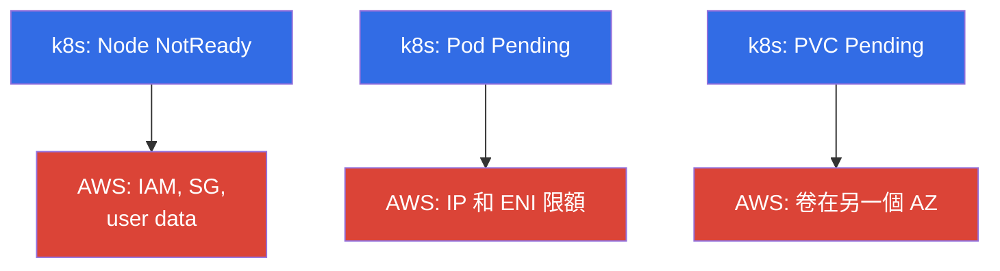
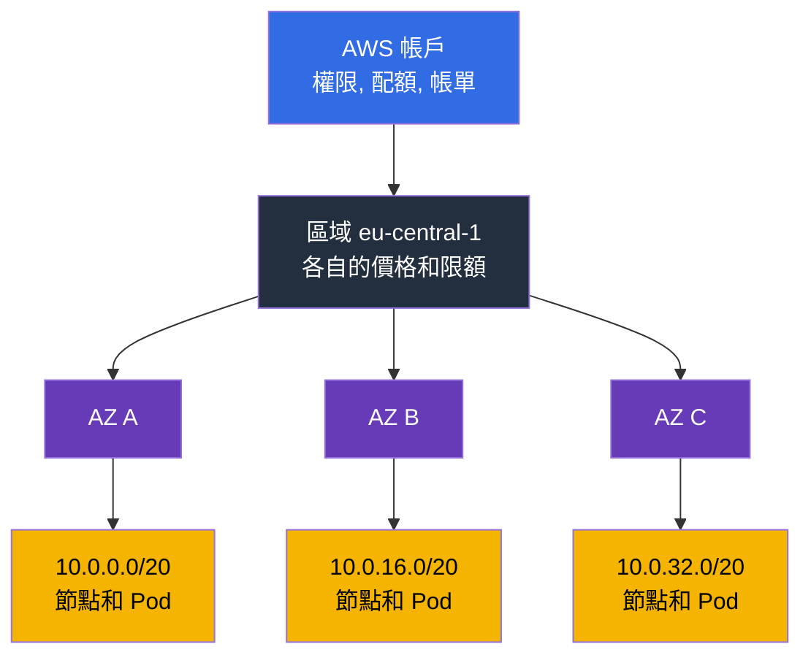
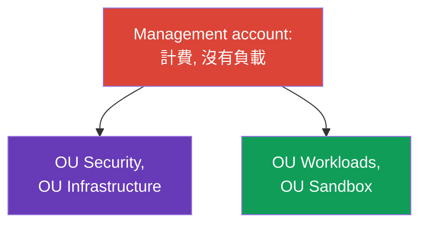
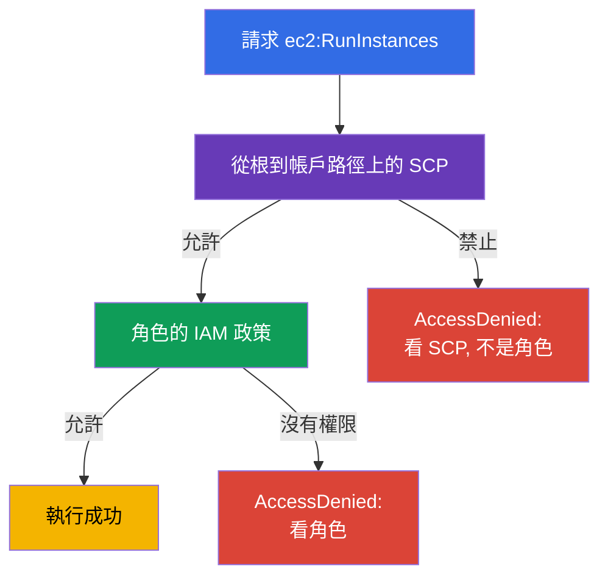
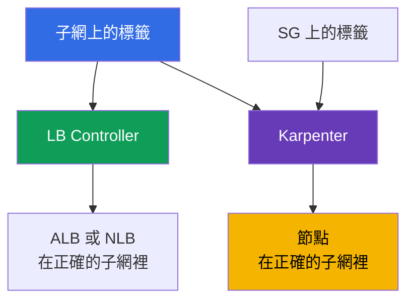

[Русская версия](ru.md) · [Eng version](en.md) · [Versión en español](es.md) · [Version française](fr.md) · [Deutsche Version](de.md) · [ქართული ვერსია](ge.md) · [日本語版](jp.md)
# 第 0.1 章. 給 Kubernetes 工程師的 AWS 入門：帳戶、區域、AZ、配額、標籤、計費

> **接下來會發生什麼。** 你是從 CKA 過來的：kubectl、Pod、Deployment、RBAC 和 PV - 這些都是熟悉的
> 工具。在 EKS 中它們不會改變，但集群下面多了一層在 kubeadm 裡不存在的東西：帳戶、區域、可用區、
> 服務限額、標籤,以及月底的帳單。這一章給出一套最小化的 AWS 詞彙表,沒有它,關於網路、節點和
> 成本的章節讀起來就像是翻譯腔。接下來會在此基礎上講 IAM(第 0.2 章)和 VPC(0.3)。

## 前置知識

課程並不是從零開始講 AWS。假設你對雲端的基礎框架已經有所了解,至少達到「知道在說什麼,能在
控制台裡找到」的程度:

- **什麼是公有雲以及按使用量付費的模式**:資源透過 API 按需建立,按時間和用量付費,而不是為硬體
  付費。
- **AWS 的全球基礎設施**:區域、可用區、edge 節點和 CDN,以及服務分為區域性和全球性這一事實。
- **基礎服務及其用途**:EC2(虛擬機)、EBS(磁碟)、S3(物件儲存)、VPC(網路)、IAM(存取權限)、
  Route 53(DNS)、CloudWatch(指標和日誌)、KMS(加密金鑰)、ELB(負載平衡器)。不需要深入了解,
  只需要理解每個服務做什麼。
- **管理方式**:AWS 控制台、aws cli、API 和 SDK,以及基礎設施即程式碼的概念。
- **供應商與客戶之間責任共擔的基本概念**。

如果列表中有些內容是陌生的,這不是停下來的理由:第 0 部分正是要補齊這些缺口,但是從 EKS 的
角度出發,而不是作為一套完整的 AWS 課程。運維集群所需的術語會在這裡詳細講解;其餘的雲端知識
則不在課程範圍內,可以透過 AWS Cloud Practitioner 等級的資料和官方服務文件來補足。

在 Kubernetes 方面,假設你已達到 CKA 水平:kubectl、工作負載、Service 和 Ingress、RBAC、PV
和 PVC、probes、Pod 除錯。這些主題在課程中不會重複講解。

## 0.1.1. 為什麼 Kubernetes 工程師需要了解 AWS 的架構

在 kubeadm 集群中,你擁有一切:機器、網路、磁碟、升級。在 EKS 中,control plane 由 AWS 負責,
其餘一切仍然是你的責任,幾乎每一個運維問題最終都不是出在 Kubernetes 上,而是出在它下面的
AWS 上。節點起不來 - 不對的 IAM 角色或 security group。Pod 卡在 `Pending` - 子網裡的 IP
用完了。Autoscaler 不增加節點 - vCPU 配額用完了。PVC 綁不上 - EBS 卷在另一個 AZ。帳單翻倍了
- 流量走了 NAT。

正式來說,這就是**責任共擔模型**(shared responsibility):AWS 負責**雲本身**的安全(硬體、
hypervisor、control plane 及其修補),你負責**雲中**的安全(IAM、VPC 和 security group、AMI
與節點版本、RBAC、密鑰、映像檔)。這條界線會在第 1 章詳細講解;託管服務不代表「一切都有人幫你
做好」。

直觀來看,這就像兩層。上面是熟悉的 Kubernetes,下面是 AWS 層,大多數症狀的真正原因就藏在
這一層裡:



kubectl 裡三個典型症狀,背後隱藏著 AWS 裡三類原因。其他情況(沒有新節點、LB 沒有位址)也可
歸結為相同的分類:第一類歸結為 IAM 和 SG,第二類歸結為網路限額。

這一切所處的層級結構,也值得從第一章起就記在心裡:帳戶決定權限、配額和帳單,區域決定地理位置,
可用區決定故障隔離邊界,子網為節點和 Pod 提供位址。



## 0.1.2. 帳戶:隔離、存取和帳單的邊界

**AWS 帳戶**同時是資源的命名空間、權限邊界,也是計費單位:一個帳戶的資源預設看不到另一個
帳戶的資源。帳戶有一個 12 位數字編號,你會一直看到它:在 ARN 裡、在 IRSA(第 16 章)的
trust policy 裡、在 ECR 倉庫位址(第 20 章)裡。

```bash
# 我現在是誰:帳戶編號、當前 identity 的 ARN、userId
aws sts get-caller-identity
```

**Root 使用者**是帳戶的所有者,透過 email 和密碼登入。它可以做任何事,包括關閉帳戶和修改
付款資訊,並且不能在帳戶內用政策去限制它。規則很簡單:root 只在建立帳戶時使用一次(啟用 MFA、
建立日常存取方式),之後永遠不再使用,日常工作透過 IAM 角色和臨時金鑰進行(第 0.2 章)。

當公司規模擴大,單一帳戶會變得擁擠,這時就出現了 **AWS Organizations** - 下一節將完整
介紹它。

| 邊界 | 隔離的內容 | 在 EKS 中的表現 |
|---------|---------------|--------------------|
| **帳戶** | 權限、配額、帳單、爆炸半徑 | `prod` 與 `dev` 分開 |
| **區域** | 地理位置、價格、區域故障 | 集群生活在單一區域中 |
| **AZ** | 資料中心故障 | 子網和節點分布在 3 個 AZ 中 |

## 0.1.3. AWS Organizations:生產環境中的多帳戶架構

我們從問題開始,而不是定義。想像一家公司住在**一個**帳戶裡:那裡有 prod EKS 集群、測試
集群、CI、資料庫、某人的機器學習實驗以及一個存放備份的 bucket。只要團隊還小,這是可行的。
接下來會發生一些非常具體的事情:

- **`dev` 中的負載測試會讓 prod 的擴縮容停止。** 配額按帳戶和區域計算(0.1.6 節):測試耗盡了
  vCPU 限額,prod 集群無法新增節點。技術上一切正常,但就是沒有節點。
- **Terraform 裡的一個錯字會波及 prod。** 所有資源都在同一個命名空間裡,因此一個錯誤的
  `-target`、別人的 workspace,或是一個「清理所有不需要的東西」的腳本,都可能帶走本不該碰的
  東西。爆炸半徑等於整個業務。
- **權限無法真正分開。** 開發者需要存取測試集群,結果卻和 prod 集群共用同一個 IAM。政策
  逐漸疊加上關於標籤和名稱的條件,沒人能完整檢查它們,最終團隊裡有一半人擁有
  `AdministratorAccess`。
- **一個金鑰的洩漏會危及一切。** 一個帳戶就是一個存取邊界:測試流水線裡的金鑰能打開和 prod
  一樣的 API。
- **帳單無法按團隊拆分。** 所有開支都在同一行裡,想把團隊 A 的集群和團隊 B 的集群分開,只能
  靠標籤,而標籤的紀律沒人能維持。
- **審計日誌和負載放在一起。** 弄壞了東西或想掩蓋痕跡的管理員,同時也能存取 CloudTrail,可以
  清除痕跡。這對審計來說是不可接受的。
- **沒有辦法永久禁止某件事。** 你想要一條「在這個環境裡不能在別的區域建立資源,也不能關閉
  日誌記錄」這樣的規則 - 但在帳戶內部,任何管理員都能取消這個限制,因為他就是管理員。

顯而易見的答案是**拆分帳戶**:prod 單獨、測試單獨、實驗單獨。但天真地「只是多開幾個帳戶」
會製造一組新的問題:多份帳單而不是一份(丟失了批量折扣)、每個帳戶各自登入、沒有統一的政策、
每個新帳戶都要複製貼上基本設定,以及完全無法回答「我們總共有多少個帳戶,裡面都是什麼」這個
問題。

**AWS Organizations** 正是針對這組問題的答案:一棵帳戶樹,擁有共同的帳單、共同的限制和
集中化的管理。帳戶仍然是權限、配額和爆炸半徑的硬邊界,但不再是一座孤島。這對 EKS 工程師
很重要,原因有兩個:他必須理解自己的集群生活在哪個帳戶裡,以及為什麼有些設定他碰不到,即使
他在該帳戶裡是管理員。

構造的元素:

- **Management account**(也叫 payer)- 組織的根。裡面不放負載:只有計費和組織管理。這個
  帳戶被攻破就意味著整個組織被攻破。
- **Member accounts** - 工作帳戶:`prod`、`stage`、`dev`、網路帳戶、共用服務帳戶。
- **OU(Organizational Unit)** - 樹狀結構裡的一個資料夾,政策套用在它上面。帳戶按 OU 分組,
  而不是按名稱。
- **SCP(Service Control Policy)** - 套用在 OU 或帳戶上的限制性政策。重要的細節:SCP
  **不授予任何權限**,它設定的是可能權限的上限。即使是帳戶管理員也不能超出它的範圍,而帳戶
  內的 `AdministratorAccess` 也不能取消 SCP 裡的禁令。
- **IAM Identity Center** - 統一的登入入口:使用者和群組是一份,對特定帳戶的存取則透過
  permission set 按時間發放(第 0.2 章)。
- **AWS Control Tower** - 對上述所有內容的現成實作,緊接在圖表後面介紹。

一個典型的組織結構看起來是這樣:



每個 OU 裡放的是什麼,以及為什麼它們是各自獨立的帳戶:

| OU | 帳戶 | 裡面是什麼 | 為什麼要分開 |
|----|----------|-----------|-----------------|
| Security | `log-archive`、`audit` | 整個組織的 CloudTrail、GuardDuty、Config、Security Hub | 工作帳戶的管理員不應該能清除關於自己的日誌 |
| Infrastructure | `network`、`shared-services` | VPC 和 Transit Gateway、Route 53、共用 ECR、CI、備份副本 | 網路和映像檔對所有環境都是共用的,但只有一個所有者 |
| Workloads | `prod`、`stage`、`dev` | 每個帳戶裡都有一個 EKS 集群 | 各自的配額、各自的權限,爆炸半徑限制在該環境內 |
| Sandbox | `sandbox-*` | 工程師的個人帳戶 | 帶自動清理的預算,沒有存取共用網路的權限 |

`prod` 帳戶裡的集群並不是被隔離的:子網由 `network` 透過 RAM 分配給它,映像檔從
`shared-services` 拉取,日誌流向 `log-archive`,備份副本又回到 `shared-services`。這些
連結會在第 20、31、32 和 41 章講解。

還值得單獨理解一下,這種構造裡的權限是如何計算的。SCP 不授予權限:最終的權限是從根到帳戶
這條路徑上 SCP 所允許的內容,與帳戶內部 IAM 政策所給予的內容,兩者的**交集**。由此產生了
典型的謎題「政策是對的,但就是沒有存取權」:



由此得出一條能省下幾個小時的規則:**明確的 Deny 勝過任何 Allow**。如果從根到帳戶路徑上
的任何一層 SCP 觸發了禁令,擴大 IAM 角色就沒有意義 - 不管是 `AdministratorAccess`、新的
政策,還是補充 trust policy,都不會恢復存取權,因為 Allow 不能取消 Deny。帳戶內部也是同樣
的道理:IAM 政策裡明確的 Deny 比任何 Allow 都更強。排查 `AccessDenied` 的實務順序是:先看
OU 上的 SCP,再看角色的 permissions boundary,再看政策本身,最後才看集群內部的 RBAC(第 47
章)。EKS 工程師最常見的浪費時間方式,恰好是反過來,從角色開始查。

### Landing zone 與 Control Tower

上面的圖不是憑空想像出來的,而是一種典型的 **landing zone**:提前準備好的組織框架,之後
負載會遷入其中。它包含 OU 樹和服務帳戶、統一的登入方式和角色、強制性的 guardrails、集中化
的日誌和審計、基礎的網路架構、標籤政策,以及讓新帳戶保持一致的發放方式。核心思路很簡單:
帳戶生來就應該是安全且統一的,而不是每次都靠人手動設定。

**AWS Control Tower** 是 AWS 提供的現成 landing zone。它會部署上述結構,建立用於日誌和
審計的帳戶,啟用一組 **controls**(也叫 guardrails),並提供 **account factory** - 依照
範本發放新帳戶,一開始就配好政策、日誌記錄和存取權限。Controls 分為三種類型:**preventive**
(禁止某個動作,技術上就是 SCP)、**detective**(透過 AWS Config 發現偏差)和 **proactive**
(在建立資源之前檢查 CloudFormation 範本)。Control Tower 另外還會監控**漂移**(drift):
如果有人手動修改了 OU、政策或某個服務帳戶的設定,在控制台裡就能看到。

Control Tower 不是唯一的路徑。Landing zone 也可以自己搭建:用 Terraform 疊加在
Organizations 上,透過 **Account Factory for Terraform(AFT)**,或透過 Landing Zone
Accelerator。選擇會影響誰擁有基礎設定,但不影響本質:框架用程式碼描述,並以同樣的方式套用
到所有帳戶。

### 這要花多少錢,以及一開始該關掉什麼

陷阱在於,Control Tower 本身不收費:你付的是它啟用的那些服務的費用。因此帳單會在集群裡跑
起第一個 Pod 之前就出現,而且是持續性的:不隨負載或週末而變化。對小型組織來說,這是一個
令人不快的意外,但不是災難,只是需要提前了解其結構。

| 項目 | 你在為什麼付費 | 隨什麼增長 |
|--------|----------------|----------------|
| **AWS Config** | 每次資源變更都記錄一個 configuration item,再加上 detective controls 規則的評估 | 帳戶數 x governed 區域數 x 資源的變化頻率。主要驅動因素 |
| `log-archive` 中的 S3 | 儲存 Config 和 CloudTrail 的日誌 | 容量和保留期限 |
| CloudTrail | 該區域第一份 management 事件副本是免費的;付費的是 data events 和第二個 trail | 重複的 trail、啟用 data events |
| Service Catalog | 透過 Account Factory 佈建帳戶 | 帳戶發放次數 |
| 黏合層(Lambda、EventBridge、SNS、KMS) | 服務呼叫和金鑰 | 很少,幾乎不變 |
| 如果選了 AFT | 預設的 VPC endpoints 加上給 CodeBuild 用的 NAT Gateway | 按小時收費,只要存在就收 |
| Security Hub、GuardDuty、conformance packs | 獨立的服務,不包含在基礎 landing zone 裡 | 檢查次數、事件量 |
| Organizations、SCP、IAM Identity Center | 不額外收費 | - |

要評估的不是「Control Tower 花多少錢」,而是會產生多少個 configuration item。計算方式是:
governed 區域數乘以帳戶數,再乘以你的資源變化頻率。之後再套用你所在區域的 Config 價格。
正因如此,五個帳戶在一個區域裡的 landing zone,和同樣的 landing zone 放在四個區域裡,在
相同負載下費用會相差好幾倍。

對於 EKS,這裡還有一個單獨的陷阱:**Karpenter 會不斷建立和刪除實例、ENI、卷和 security
group 規則**,而每一次這樣的變更都是一個 configuration item。一個動態集群產生的記錄流,是
靜態 node group 從未有過的。Control Tower 的文件明確警告過,ephemeral 負載會導致 Config
成本上升。

解決方式有三種,從溫和到激進:

- **對吵鬧的資源類型使用 daily recording 而不是 continuous**:Config 每天只保存一條記錄,
  且僅在狀態發生變化時才保存。這樣會失去一天內的時序細節,但能降低 CI 記錄流。對於 Config
  的一些服務類型(例如 `AWS::Config::ResourceCompliance`)不支援 daily recording,它們
  始終持續寫入。
- **把某些類型排除在 recorder 的範圍之外**:採用「除了列出的類型,其他都記錄」的策略
  (`EXCLUSION_BY_RESOURCE_TYPES`)。dev 和 sandbox 裡的候選對象正是 Karpenter 高頻攪動
  的那些:EC2 實例、網路介面、卷、security group 規則。
- **在吵鬧的帳戶裡整個關掉 recorder**:這是給 non-prod 用的方式,Control Tower 自己的文件
  也正式建議這樣做。代價是明確的:這個帳戶裡的 detective controls 會停止工作,變更記錄也會
  消失,因此 `prod` 不會這麼做。

從 landing zone 3.0 版本開始,Control Tower 已經只在主要區域寫入全域資源(IAM 角色、使用者、
政策),而不是每個區域都寫,這自然就消除了一部分重複。

初創公司可以不立即啟用、等出現理由再加上的內容:

| 可以推遲的內容 | 為什麼可以 | 什麼時候啟用 |
|--------------|--------------|----------------|
| Control Tower 本身 | Organizations、SCP 和 Identity Center 是免費的:一個 OU 樹、一個 org-trail 以及禁止多餘區域,就能免費獲得 80% 的價值 | 當帳戶開始定期發放,手動操作已經變得昂貴時 |
| 多餘的 governed 區域 | Config recorder 會在每個區域裡都啟用,帳單會成倍增長 | 出現 DR 區域時(第 42 章) |
| 為吵鬧的 dev 和 sandbox 帳戶開啟 enrollment | Config 在這些帳戶裡產生的垂圾最多 | 當 dev 出現審計要求時 |
| 對 Config 中所有類型持續記錄 | 吵鬧的類型有 daily recording 和類型排除可用 | 需要精確的變更時序時 |
| Security Hub Service-Managed Standard | 這是一個獨立收費的服務,透過管理型 control 啟用 | 出現首個合規要求時(第 21 章) |
| GuardDuty | 不屬於 landing zone,單獨啟用 | 帶著真實客戶資料上生產環境時 |
| AFT 或 CfCT | AFT 會增加常駐基礎設施:endpoints 和 NAT | 帳戶數量達到幾十個,需要一條流水線時 |
| CloudTrail 的 data events 和長期保留 | 審計中最昂貴的部分 | 出於監管要求,並配合生命週期規則放入冷儲存 |

有兩點,省錢反而會弄巧成拙。第一:**在 org-trail 之上再加一個 CloudTrail trail** 不是節省,
而是收費事件的重複,自己建 trail 只應該針對具體的要求。第二:**proactive controls 檢查的是
CloudFormation 範本**,如果你的集群是用 Terraform 描述的(第 4 章),它們就起不到保護作用
- 不能依賴它們,取代禁令位置的應該是 preventive controls,也就是 SCP。

對於計劃逐步通過 PCI DSS 的初創公司,啟用順序會在第 48 章作為一個單獨的落地場景講解:先是
免費的框架,然後是偵測,再然後是帳戶流水線。按服務和標籤拆分開支 - 在第 43 章。

其中對 EKS 工程師在實務上重要的內容:

- **你不會從零開始配置新集群的帳戶。** 它從 account factory 出來時就已經帶有日誌、角色、
  guardrails,通常還有基礎網路。你的任務是集群本身,而不是帳戶的周邊配置。
- **有些設定你碰不到,這是正常的。** 你無法關閉 CloudTrail、無法在未被允許的區域建立資源、
  也無法取消加密 - preventive control 會禁止這些操作。
- **偏差會被發現。** 繞過 IaC 手動建立的資源,會作為 Config 裡的不合規項目或 landing zone
  的漂移現身。因此集群及其周邊配置都要用程式碼描述(第 4 章)。

這給 EKS 集群帶來了什麼:

| 組織的特性 | 對 EKS 的實際效果 |
|----------------------|------------------------------|
| 配額按帳戶和區域計算 | `dev` 的限額不會吃掉 `prod` 的容量(0.1.6 節) |
| 爆炸半徑限制在帳戶內 | IAM 或 Terraform 的錯誤不會波及 prod 集群 |
| Consolidated billing | Savings Plans 和批量折扣適用於所有帳戶(0.1.8) |
| SCP 作為 guardrails | 不能關閉日誌、不能在別的區域建立資源、不能取消加密 |
| 集中化的網路 | 子網或 transit 由網路帳戶分配(第 31 和 32 章) |
| 集中化的服務 | 共用的 ECR、備份副本放在單獨的帳戶裡(第 20 和 41 章) |

你作為工程師會遇到的典型 SCP:禁止除工作區域外的所有區域;禁止關閉 CloudTrail、Config 和
GuardDuty;禁止刪除日誌和快照;強制要求卷加密。它壞掉的方式是這樣的:Terraform 在 IAM
權限完全正確的情況下報 `AccessDenied`。首先要看的不是角色,而是 OU 上的 SCP。

```bash
# 是否存在組織,誰是其中的 payer
aws organizations describe-organization

# 所有帳戶和 OU(在 management 或 delegated admin 帳戶中執行)
aws organizations list-accounts --query 'Accounts[].[Id,Name,Status]' --output table
aws organizations list-organizational-units-for-parent --parent-id r-abcd

# 某個具體帳戶或 OU 上掛了哪些 SCP
aws organizations list-policies-for-target --target-id 123456789012 \
  --filter SERVICE_CONTROL_POLICY
```

接下來要講的是多帳戶場景下 EKS 的一些特殊之處,這些需要提前了解:

- **集群生活在一個帳戶裡**,但周圍的資源在其他帳戶裡。網路可以是共用的:網路帳戶透過
  **AWS RAM** 分享子網,集群就在別人(shared)的子網裡建立起來。這時子網上的標籤(0.1.7
  節)是由網路的所有者來設定的,不是你,標籤的協調就成了流程的一部分。
- **對集群的存取權會授予其他帳戶的角色。** 可以為來自 CI 帳戶或 Identity Center(第 5 章)
  的角色建立 access entry。這是常見的做法:部署流水線生活在共用服務帳戶裡。
- **映像檔從共用的 ECR** 中拉取,那個 ECR 屬於另一個帳戶,因此需要一個支援跨帳戶 pull 的
  倉庫政策(第 20 章)。
- **備份會複製到單獨的帳戶**,這樣工作帳戶被攻破時,不會連同集群的恢復點一起被帶走(第 41
  章)。
- **安全性從審計帳戶的視角來查看。** GuardDuty、Config 和 Security Hub 是透過 delegated
  administrator 為整個組織啟用的,而不是在每個帳戶裡手動開啟(第 21 章)。

集群需要多少個帳戶,這個問題沒有唯一答案。幾乎總是有效的最低方案是:`prod` 與其他一切分開,
因為 prod 集群有自己的配額、自己的權限,以及自己的維護窗口。接下來要選的是「每個環境一個
帳戶」(管理更簡單,管理成本更低)還是「每個團隊或產品一個帳戶」(隔離和成本核算更好,但
網路方面的周邊配置更多,集群清單裡的集群數量也更多 - 第 44 章)之間的取捨。

## 0.1.4. 區域和可用區

**區域**(`eu-central-1`、`us-east-1`)是一個地理位置,擁有自己的一套服務和自己的價格。
資源與區域綁定:`eu-central-1` 裡的子網無法連接到 `us-east-1` 裡的集群,而 EKS 集群整體
生活在一個區域內。

**可用區(Availability Zone,AZ)**是區域內一個或多個物理隔離的資料中心:各自的電力、冷卻、
網路。同一區域內 AZ 之間的延遲很小(幾毫秒),但一個區域的故障不會波及其他區域。由此得出高
可用性的核心規則:**子網至少分布在三個 AZ 中,節點分散在各個 AZ,負載透過 topology spread
constraints 分散**(第 40 章)。AWS 的 control plane 本身就分布在多個區域裡,而節點由你
負責:只有一個 node group 且處於單一 AZ 的集群,會和那個 AZ 一起故障。

所有人都會踩到的一個細節:**在不同帳戶裡,`eu-central-1a` 這樣的 AZ 名稱指向的是不同的物理
區域**。AWS 會打亂名稱,避免所有客戶都集中到「第一個」區域裡。穩定的識別碼是 `ZoneId`
(`euc1-az1`),它在所有帳戶裡都是一致的,在多帳戶場景中應該比較的正是它。

```bash
# 該區域所有 AZ:名稱(每個帳戶各不相同)和穩定的 ZoneId
aws ec2 describe-availability-zones \
  --region eu-central-1 \
  --query 'AvailabilityZones[].[ZoneName,ZoneId,State]' \
  --output table
```

AZ 架構帶來的另一個後果,會在第 23 章讓你吃虧:**EBS 卷生活在一個 AZ 裡,只能掛載到同一個
區域的實例上**。掛載了 `gp3` PVC 的 Pod 被綁定在它自己的區域:如果 Karpenter 在另一個 AZ
裡拉起一個節點,Pod 就會停留在 `Pending`。由此產生了 StorageClass 裡的
`WaitForFirstConsumer`,以及透過 EFS 實現的共享儲存(第 24 章)。

## 0.1.5. ARN:AWS 中的資源是如何被定址的

**ARN(Amazon Resource Name)**是資源的唯一識別碼。它出現在 IAM 政策、ServiceAccount 的
annotation、控制器的 manifest、日誌和錯誤訊息裡,所以要能一眼讀懂它。它的通用形式是用冒號
分隔的六個欄位:`arn:partition:service:region:account-id:resource`。課程中的範例:

- `arn:aws:iam::123456789012:role/eks-node-role` - 一個 IAM 角色,IAM 沒有區域概念。
- `arn:aws:eks:eu-central-1:123456789012:cluster/demo` - 一個 EKS 集群。
- `arn:aws:s3:::my-bucket/path/*` - bucket 裡的物件,沒有區域和帳戶。

`partition` 幾乎總是 `aws`,但也有 `aws-cn` 和 `aws-us-gov`:把政策複製到這樣的分區裡時,
需要修改 `partition`。

角色的 ARN,是集群裡的負載用來取得 AWS 權限的東西,在兩種機制裡它的指定方式不同:

- **IRSA**(第 16 章):角色的 ARN 存放在 ServiceAccount 的 annotation
  `eks.amazonaws.com/role-arn` 裡,角色本身信任集群的 OIDC provider。ARN 出錯,或者 trust
  policy 裡的 `sub` 出錯,看起來就像是 Pod 缺少權限,而不是節點缺少權限。
- **EKS Pod Identity**(第 17 章):沒有 annotation,取而代之的是在 EKS 自身的 API 裡建立
  一個 association,角色的 ARN 在這裡是顯式傳遞的:

```bash
# 不使用 OIDC annotation,把角色與 ServiceAccount 關聯起來
aws eks create-pod-identity-association \
  --cluster-name demo --namespace default \
  --service-account my-sa \
  --role-arn arn:aws:iam::123456789012:role/app-role
```

實務結論:如果 Pod 沒有取得權限,首先要看角色是透過這兩種機制中的哪一種綁定的,因為它們的
診斷方式不同 - IRSA 要檢查 annotation 和 trust policy,Pod Identity 要檢查 association
本身以及節點上的 agent。

## 0.1.6. 服務配額:為什麼集群會停止擴容

每個 AWS 服務都有**配額(Service Quotas)** - 按帳戶和區域設定的限額。這不是計費上的限制,
而是一道防護上限,新帳戶拿到的初始值會比較低。

| 服務 | 配額 | 對集群的影響 |
|--------|-------|----------------------|
| `ec2` | Running On-Demand Standard instances (vCPU) | 擴容時無法建立節點 |
| `ec2` | All Standard Spot Instance Requests (vCPU) | spot 節點起不來(第 13 章) |
| `vpc` | Network interfaces per Region | 沒有 ENI,Pod 拿不到 IP(第 6 章) |
| `ec2` | EC2-VPC Elastic IPs | 無法建立 NAT Gateway 或公共位址 |
| `elasticloadbalancing` | Load Balancers per Region | Service 或 Ingress 拿不到 LB |
| `eks` | Clusters per Region | 無法再建立一個集群 |

典型場景:負載增加了,Karpenter 或 Cluster Autoscaler 嘗試新增節點,集群裡卻什麼都沒出現,
在 Karpenter 或 Auto Scaling group 的事件裡能看到 `VcpuLimitExceeded` 或
`MaxSpotInstanceCountExceeded`。上限是在 AWS 那一側設的。

還有一類單獨的限額是 **API 速率限制**(throttling):對服務 API 的呼叫頻率,而不是資源
數量。當節點規模很大時,控制器和 autoscaler 會頻繁呼叫 EC2 和 Auto Scaling,作為回應會收到
`RequestLimitExceeded` 或 `Throttling`。這也會隨著 EKS 一起增長,但解決方式不是提高配額,
而是降低輪詢頻率,並使用帶 backoff 的重試。

```bash
# EC2 所有配額及當前數值;服務代碼參見 aws service-quotas list-services
aws service-quotas list-service-quotas \
  --service-code ec2 \
  --query 'Quotas[].[QuotaCode,QuotaName,Value]' \
  --output table

# on-demand standard instances 的具體配額(以 vCPU 為單位的限額)及提高請求
aws service-quotas get-service-quota --service-code ec2 --quota-code L-1216C47A
aws service-quotas request-service-quota-increase \
  --service-code ec2 --quota-code L-1216C47A --desired-value 256
```

實務做法:在負載測試或啟動 prod 集群之前,要提前檢查並提高配額。處理時間從幾分鐘到幾天都有,
而通常正是在等不及的時候才需要它。

## 0.1.7. 標籤:在 EKS 裡這不是裝飾品

**標籤**是 AWS 資源上的一個鍵/值對。通常標籤是為了整理,但在 EKS 裡有一部分標籤是功能性的:
控制器靠它們來**找到**資源,拿掉標籤,壞掉的是機制本身,而不只是報表。



必須正確設定的標籤:

- `kubernetes.io/role/elb` = `1`,設在公共子網上 - 決定 internet-facing 負載平衡器放在
  哪裡(第 26 章)。
- `kubernetes.io/role/internal-elb` = `1`,設在私有子網上 - 用於內部負載平衡器。
- `karpenter.sh/discovery` = 集群名稱,設在子網和 security group 上 - 決定 Karpenter
  在哪裡、用哪個 SG 拉起節點(第 12 章)。
- `kubernetes.io/cluster/<集群名稱>` - 標記資源歸屬於某個集群的歷史性標籤,在舊配置裡
  還能見到。

```bash
# 把子網標記為公共子網,供 internet-facing 負載平衡器使用
aws ec2 create-tags --resources subnet-0a1b2c3d4e5f6a7b8 \
  --tags Key=kubernetes.io/role/elb,Value=1

# 確認 Karpenter 能找到所需的子網
aws ec2 describe-subnets \
  --filters "Name=tag:karpenter.sh/discovery,Values=demo" \
  --query 'Subnets[].[SubnetId,AvailabilityZone]' --output table
```

標籤的第二個作用是成本核算。強制性的最低標籤 `CostCenter`、`Owner`、`Environment` 是成本
分攤的基礎:AWS Cost Explorer 和 Kubecost(第 43 章)靠它們來拆分帳單。更完整的政策還會
加上 `Team`、`Cluster`、`ManagedBy`,幫助找出被遺忘的資源。標籤在 Terraform 裡以
`default_tags` 的形式設定,在組織層級透過 Tag Policies 固定下來,並由 AWS Config 檢查。

## 0.1.8. 計費:EKS 集群的帳單是如何構成的

帳單裡「EKS」這一行本身很小:這個服務本身只按小時收取 control plane 的費用,真正的錢花在
相鄰的服務上。

| 項目 | 你在為什麼付費 | 備註 |
|--------|----------------|-----------|
| EKS control plane | 集群運行的每小時 | 小集群和大集群一樣 |
| Extended support | 版本超出標準支援期後,每小時費率提高 | 自動啟用,版本落後就要花錢(第 3 章) |
| EC2 或 Fargate | 節點或 Pod 的 vCPU 和記憶體 | 通常是最大的一部分(第 0.4、15 章) |
| EBS、EFS、S3、ECR | 卷、快照、映像檔 | 被遺忘的快照會逐年累積 |
| NAT Gateway | 運行的每小時加上每一 GB | 經典的意外驚喜(第 31 章) |
| Load Balancers | 運行的每小時加上流量 | 每個 Service 或 Ingress 各一個 |
| Data transfer | AZ 之間及對外的流量 | 跨區域雙向都要付費 |
| CloudWatch | 日誌和指標的 ingestion 和儲存 | 有可能比節點還貴(第 34 章) |

單獨說一下 **extended support** 這一行。只要集群版本還在標準支援期內,control plane 每小
時的費用對所有人都一樣。一旦某個版本的標準支援期結束,集群就會進入 extended support,同樣
的每小時費用會變高 - 而負載完全沒有變化。這由集群更新政策裡的 `supportType` 欄位控制
(`STANDARD` 或 `EXTENDED`),版本期限和支援模式在第 3 章講解。實務中會碰到兩個細節:設為
`supportType: STANDARD` 的集群,在期限到達後會被強制升級;而如果把版本**回退**到已經超出
標準支援期的版本,extended support 的費用又會重新開始計算(第 39 章)。也就是說,版本落後
不只是安全風險,也是帳單上的一行。

```bash
# 集群目前處於哪個支援期,選擇的是哪種更新政策
aws eks describe-cluster --name demo \
  --query 'cluster.[version,upgradePolicy.supportType]' --output table
```

意外驚喜幾乎總是出現在兩個地方。第一是 **NAT Gateway**:一個拉取映像檔並透過 NAT 訪問 S3
或 ECR 的集群,要為本可以透過 VPC endpoints 避免的流量付費(第 31 章)。第二是**跨 AZ 的
流量**:三個區域裡話多的服務會產生持續性的帳單,這是高可用性有意識付出的代價。

```bash
# 按服務拆分的月度支出;按標籤拆分則用 --group-by Type=TAG,Key=Cluster
aws ce get-cost-and-usage \
  --time-period Start=2025-01-01,End=2025-02-01 \
  --granularity MONTHLY --metrics "UnblendedCost" \
  --group-by Type=DIMENSION,Key=SERVICE
```

一個重要細節:**cost allocation tag 需要手動在 Billing 頁面啟用**,資料只從啟用那一刻起
才會出現,無法追溯補上。因此用於成本核算的標籤要在第一天就啟用。OpenCost、Kubecost 和
right-sizing - 在第 43 章。

## 0.1.9. 如何低成本、無風險地練習

- **給學習用的獨立帳戶。** 自己的帳戶或 sandbox 能把實驗和工作資源隔離開,也能得到課程開支
  的真實數字。
- **從第一天就設好預算和告警。** 帶有超出門檻和預測超支通知的 AWS Budgets,比一個月後才
  發現被遺忘的 NAT Gateway要便宜得多。
- **練習結束後刪掉一切。** 集群、NAT Gateway、負載平衡器和 EIP 是按存在時間收費的,不是
  按使用量收費。**區域**選最近的即可。

```bash
# 帳戶當前的預算:門檻和通知只需要設定一次
aws budgets describe-budgets --account-id 123456789012
```

課程的實驗環境是這樣設計的:透過 Terragrunt 用一條命令就能建立和刪除整套環境:`apply`
建立所有需要的東西,`destroy` 不會留下需要付費的殘留(第 0.5 章)。

## 0.1.10. 生產環境中的實際應用

組織和帳戶方面:

- **預設多帳戶。** `prod`、`stage` 和 `dev` 分別放在獨立帳戶裡:權限隔離、配額獨立,每個
  環境的帳單也清晰可見。Prod 集群不與任何東西共用帳戶。
- **Management account 保持空白。** 裡面只有計費和 Organizations,沒有任何負載,也沒有
  任何集群。能存取它的人很少,且都需要 MFA。
- **Landing zone 用程式碼構建。** OU 樹、日誌和審計帳戶、基礎 guardrails 由 Control
  Tower 或自建程式碼部署,而不是在控制台裡手動操作。新帳戶按範本發放:同樣的 SCP、同樣的
  標籤、同樣的角色集合。
- **SCP 作為對人的保險。** 允許的區域、禁止關閉 CloudTrail、Config 和 GuardDuty、禁止
  刪除日誌和快照、強制加密。Terraform 出現 `AccessDenied` 時,SCP 會比 IAM 政策更早被
  檢查。
- **透過 Identity Center 統一登入。** 沒有一個帶長期有效金鑰的 IAM 使用者:角色按時間授予,
  permission set 分配給群組,還有一個獨立的、使用時會發出警報的 break-glass 角色(第 0.2
  章)。
- **網路、映像檔、日誌和備份全部集中化。** 子網由網路帳戶透過 RAM 分配,或者連通性透過
  Transit Gateway 實現,映像檔放在共用的 ECR 裡,備份副本流向獨立帳戶,安全性透過
  delegated administrator 從審計帳戶的視角來查看(第 20、21、31、32、41 章)。

集群與資金方面:

- **三個 AZ 是常態。** 子網和 node group 至少分布在三個區域,關鍵負載透過 topology
  spread 和 PDB 分散開(第 40 章)。
- **配額在啟動檢查清單裡。** 在上線 prod 或進行負載測試之前,要檢查 vCPU、ENI、EIP 和
  負載平衡器的限額。配額要對每個帳戶單獨申請:在 `dev` 裡提高的配額不會作用於 `prod`。
- **標籤由程式碼設定。** Terraform 裡的 `default_tags`,必填鍵由 Tag Policies 固定,
  合規性由 AWS Config 檢查。手動打標籤活不下去。
- **FinOps 作為一個流程。** 按帳戶和標籤拆分的 Cost Explorer,每個帳戶各自的預算告警,
  對流量和 NAT 增長的分析。成本是和延遲、可用性同等重要的指標。

## 0.1.11. 迷你詞彙表

- **帳戶** - 隔離的資源空間和計費單位;12 位數字編號會出現在 ARN 和 trust policy 裡。
- **Root 使用者** - 擁有無限權限的帳戶所有者,只在初始配置時需要用到。
- **AWS Organizations** - 一棵擁有共同計費和共同限制的帳戶樹。**Management account** -
  作為付款方的根帳戶,不放負載。**OU** - 套用政策的一組帳戶。
- **SCP(Service Control Policy)** - 套用在 OU 或帳戶上的限制性政策:設定權限上限,自身
  不授予任何權限。
- **Landing zone** - 提前準備好的組織框架:OU、服務帳戶、guardrails、日誌、存取權限,以及
  發放統一帳戶的方式。**AWS Control Tower** - AWS 提供的現成 landing zone:controls
  (preventive、detective、proactive)、漂移偵測和 account factory。**IAM Identity
  Center** - 統一登入,並用 permission set 發放存取權限。
- **AWS RAM** - 帳戶之間共用資源,例如給集群用的共用子網。**Delegated administrator** -
  組織把某個服務(GuardDuty、Config、Security Hub、Backup)的管理權委派給的帳戶。
- **Consolidated billing** - 組織的統一帳單;批量折扣和 Savings Plans 作用於所有帳戶。
- **區域** - 資源綁定的地理位置(`eu-central-1`)。
- **可用區(AZ)** - 區域內一個隔離的資料中心,是可靠性的基礎。**ZoneId**(`euc1-az1`)-
  它在所有帳戶裡的穩定名稱。
- **ARN** - `arn:partition:service:region:account-id:resource`,資源的位址。
- **Service Quotas** - 按帳戶和區域設定的服務限額,可依申請提高。
- **標籤** - 一個鍵/值對;EKS 的控制器靠標籤找到資源,啟用後的 **cost allocation tag**
  則用於計費中的帳單拆分。
- **Shared responsibility** - AWS 負責雲本身的安全,你負責雲中的安全。

## 0.1.12. 本章小結

- 帳戶是權限、配額和帳單的邊界;root 不會被使用,存取透過 IAM 角色和臨時金鑰進行(第 0.2
  章)。
- 生產環境裡帳戶很多:management account 是空的,有用於日誌和審計的服務帳戶,有網路和共用
  服務帳戶,還有按環境劃分的工作帳戶。Prod 集群生活在自己的帳戶裡。
- OU 上的 SCP 設定的是權限上限,而不是授予權限:在 IAM 政策正確的情況下出現意外的
  `AccessDenied`,幾乎總是 SCP 造成的。Landing zone 和新帳戶都是從程式碼發放出來的。
- 多帳戶架構改變了集群的周邊配置:子網透過 RAM 從網路帳戶而來,存取權限授予其他帳戶的角色,
  映像檔從共用的 ECR 拉取,備份複製到獨立帳戶(第 5、20、31、32、41 章)。
- 區域決定地理位置和價格,AZ 決定故障隔離。Multi-AZ 是必須的,而不同帳戶裡 AZ 的名稱並不
  一致:要比較 `ZoneId`。EBS 卷生活在一個 AZ 裡,因此帶 PVC 的 Pod 被綁定在某個區域(第 23
  章)。
- ARN 按六個欄位來讀;vCPU、ENI 和 EIP 的配額是「沒有新節點」的常見原因。
- `kubernetes.io/role/elb` 和 `karpenter.sh/discovery` 這兩個標籤是功能性的:控制器靠它們
  找到資源。其餘標籤是為了成本核算。
- 帳單由 control plane、EC2/Fargate、儲存、負載平衡器、NAT、流量和日誌構成。意外驚喜幾乎
  總是出現在流量和 NAT 上(第 31 和 43 章)。

## 0.1.13. 這在實際工作中會怎麼用到

事故排查通常從「哪個帳戶、哪個區域、哪個 AZ」這幾個問題開始,有一部分問題在這一步就能解決。
規劃集群要從配額和位址規劃開始,而不是從 manifest 開始。只有在標籤打好、Cost Explorer 能
按團隊拆分顯示之後,才能和業務方談成本。而最常見的情況是:當節點沒有出現時,你不只要看
`kubectl describe`,還要看 AWS 的配額。

## 0.1.14. 自我檢測問題

1. AWS 帳戶隔離的是什麼,為什麼 `prod` 要用獨立的帳戶?
2. Root 使用者有什麼用,為什麼不能日常使用它工作?
3. 什麼是 OU 和 SCP?為什麼 SCP 不能授予任何權限?
4. Terraform 報 `AccessDenied`,而角色的 IAM 政策看起來是對的。應該去哪裡查?
5. 為什麼不在 management account 裡放集群和負載?
6. EKS 集群如何使用來自另一個帳戶的子網,誰負責它們的標籤?
7. 區域和 AZ 有什麼區別,為什麼集群要至少分布在三個 AZ 裡?
8. 為什麼兩個帳戶裡的 `eu-central-1a` 可能是不同的區域,應該比較什麼?
9. 逐個欄位讀出 `arn:aws:eks:eu-central-1:123456789012:cluster/demo`。
10. Autoscaler 不新增節點,Kubernetes 裡也沒有錯誤。應該去 AWS 裡看哪裡?
11. AWS Load Balancer Controller 和 Karpenter 需要子網上的哪些標籤?
12. 集群的帳單是由什麼構成的,為什麼要提前啟用 cost allocation tag?

## 實踐

第 0 部分沒有自己的實驗:這是其餘章節所依託的基礎。實踐會在第 1 部分開始,那時你會透過
Terragrunt 拉起一個 EKS 集群。接下來是 IAM:政策、角色和臨時金鑰,沒有它們,EKS 裡無論是
對集群的存取,還是 Pod 的存取,都無法運作。

---
[目錄](../README_TW.md) · [第 0.2 章](../00-2-iam/tw.md)
