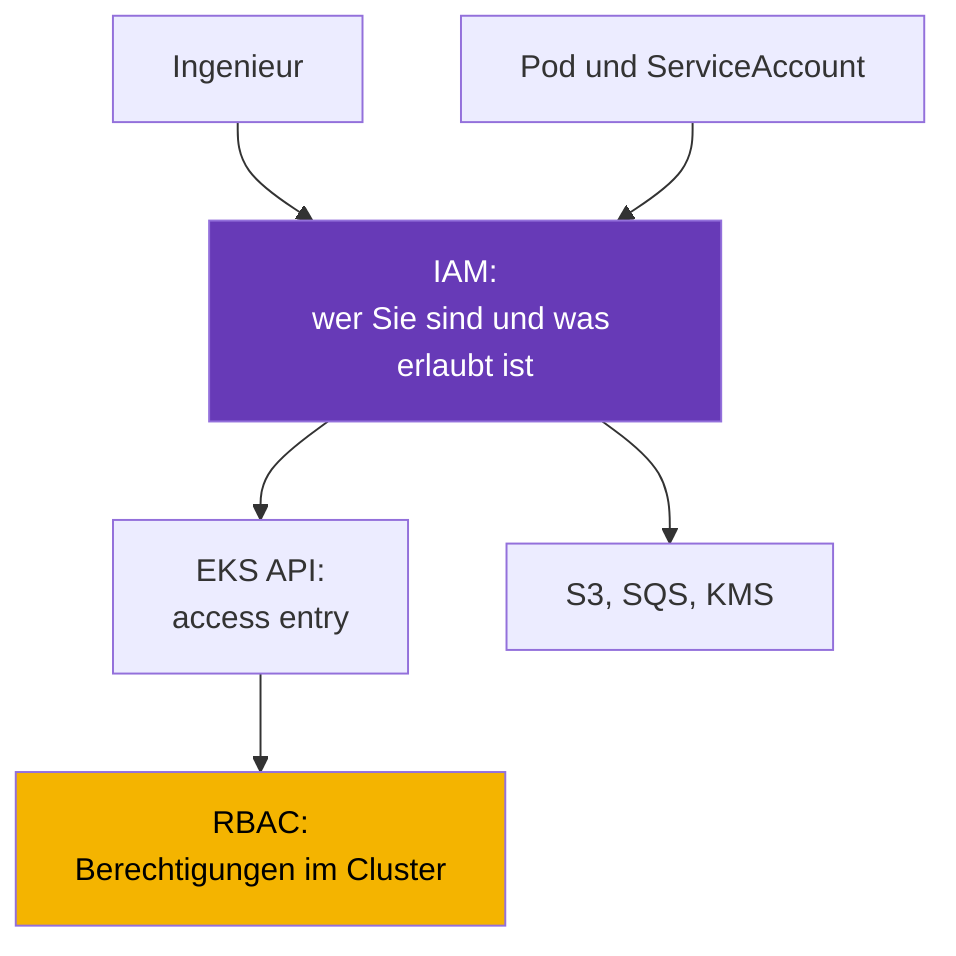
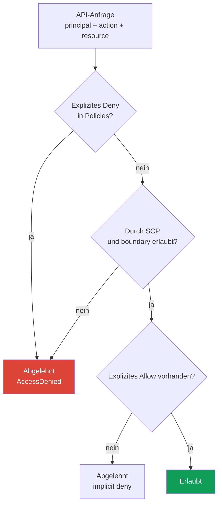
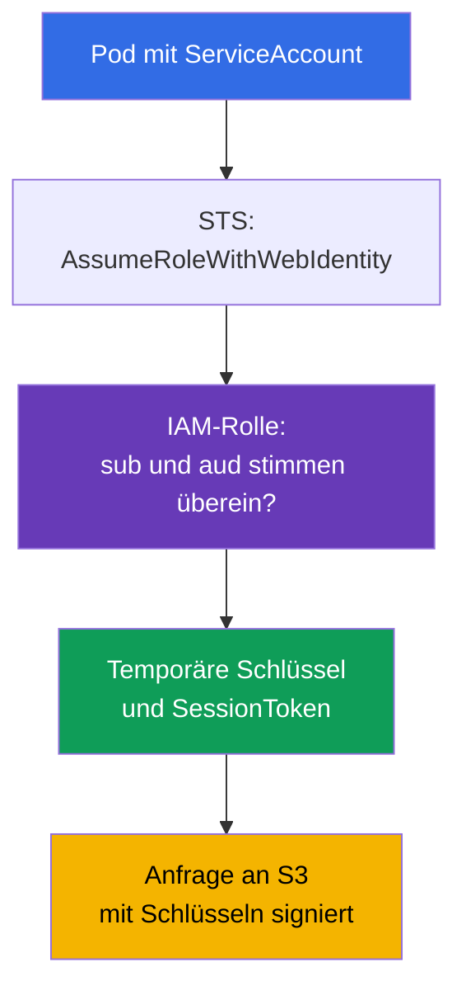

[Русская версия](ru.md) · [Eng version](en.md) · [Versión en español](es.md) · [Version française](fr.md) · [ქართული ვერსია](ge.md) · [繁體中文版](tw.md) · [日本語版](jp.md)
# Kapitel 0.2. IAM von Grund auf: Richtlinien, Rollen, Vertrauen, STS und temporäre Schlüssel

> **Wie geht es weiter.** Kapitel 0.1 führte das Konto als Grenze für Berechtigungen und Abrechnung ein, ließ aber die Frage "Wer bin ich gerade?" offen. IAM beantwortet sie. In EKS löst es zugleich zwei Aufgaben: Welche Personen auf den Cluster zugreifen dürfen (Kapitel 5) und was ein Pod darf, wenn er auf S3, SQS oder Secrets Manager zugreift (Kapitel 16-17). Hier steht nur das für den Betrieb nötige Minimum: Richtlinien, Rollen, Vertrauen, temporäre Schlüssel und die Fehlersuche bei Ablehnungen. Darauf baut als Nächstes VPC auf (Kapitel 0.3).

## 0.2.1. Warum ein Kubernetes-Ingenieur IAM kennen muss

In einem kubeadm-Cluster endete die Autorisierung bei RBAC. In EKS ist IAM eine zweite Schicht vor RBAC. Es ersetzt RBAC nicht, sondern arbeitet davor: Wenn Sie `kubectl get pods` ausführen, signieren Sie die Anfrage mit Ihrer IAM-identity, EKS prüft, ob diese identity überhaupt ein Recht auf den Cluster hat, und erst danach prüft Kubernetes RBAC. Eine Ablehnung im ersten Schritt sieht wie `You must be logged in to the server (Unauthorized)` aus, und in RBAC danach zu suchen ist sinnlos.

Die andere Hälfte sind Berechtigungen für Workloads. Eine Anwendung in einem Pod möchte einen S3-Bucket lesen, aber S3 kennt kein ServiceAccount. Der Pod benötigt daher AWS credentials. Der richtige Weg ist eine IAM-Rolle, die über IRSA (Kapitel 16) oder EKS Pod Identity (Kapitel 17) mit dem ServiceAccount verbunden ist. Der ServiceAccount liefert die identity des Pods im Cluster, die IAM-Rolle liefert die identity desselben Pods in AWS.



## 0.2.2. Entitäten: Benutzer, Gruppen, Rollen, Richtlinien

IAM besteht aus **Principals** (wer handelt) und **Policies** (was erlaubt ist). Principals gibt es in drei Arten, in der modernen Praxis wird jedoch hauptsächlich eine davon verwendet.

| Entität | Was es ist | Kubernetes-Analogie | Praxis |
|--------|------------|---------------------|--------|
| **IAM user** | langlebige identity mit Passwort und Schlüsseln | statisches Zertifikat | vermeiden |
| **IAM group** | Menge von Benutzern für gemeinsame Richtlinien | Group in RBAC | zusammen mit user |
| **IAM role** | identity ohne eigene Schlüssel, die übernommen wird | ServiceAccount | bevorzugter Ansatz |

Ein **IAM user** besitzt ein Konsolenpasswort und ein Paar aus `AccessKeyId` + `SecretAccessKey`, die nicht ablaufen. Genau deshalb werden Benutzer abgelöst: Ein permanenter Schlüssel landet früher oder später in git, einer CI-Variable oder einem Chat; er kann nur manuell widerrufen werden, und ein Leak ist fast unmöglich zu bemerken. Personen erhalten Zugriff über **IAM Identity Center** (früher AWS SSO) oder einen externen identity provider, Maschinen verwenden Rollen.

Eine **IAM role** ist das zentrale Objekt dieses Kurses. Eine Rolle hat weder Passwort noch permanente Schlüssel: Sie wird **übernommen** (assume) und liefert temporäre credentials für 15 Minuten bis mehrere Stunden. Eine Rolle kann von einer Person, einer EC2-Instanz, Lambda, einem Pod in EKS oder einem Principal aus einem anderen Konto übernommen werden. Policies werden danach unterschieden, woran sie angehängt sind:

- **identity-based** - an Benutzer, Gruppe oder Rolle angehängt: "Dieser Principal darf dies und das tun." Die meisten Policies gehören zu diesem Typ.
- **resource-based** - an die Ressource selbst angehängt (S3 bucket policy, KMS key policy, ECR repository policy): "Diese Principals dürfen auf mich zugreifen." Nur sie können Zugriff aus einem anderen Konto ohne vermittelnde Rolle gewähren.

Ein Detail für Kapitel 18: Eine KMS **key policy ist erforderlich**, und wenn sie Ihre Rolle nicht enthält, reicht eine identity-based policy mit `kms:Decrypt` allein nicht aus.

## 0.2.3. Aufbau einer Richtlinie und Entscheidungslogik

Eine IAM policy ist ein JSON-Dokument, und die Felder sind in allen AWS policies gleich.

```json
{
  "Version": "2012-10-17",
  "Statement": [{
    "Sid": "ReadAppBucket",
    "Effect": "Allow",
    "Action": ["s3:GetObject", "s3:ListBucket"],
    "Resource": ["arn:aws:s3:::my-app-bucket", "arn:aws:s3:::my-app-bucket/*"],
    "Condition": {"StringEquals": {"aws:PrincipalTag/Team": "platform"}}
  }]
}
```

- `Version` - die Version der Richtliniensprache, immer `2012-10-17`. Es ist nicht das Datum Ihres Dokuments.
- `Statement` - eine Liste von Regeln, die jeweils unabhängig ausgewertet werden.
- `Effect` - `Allow` oder `Deny`. `Action` - API-Operationen in der Form `service:Operation`.
- `Resource` - ARNs von Ressourcen; einige Aktionen sind nicht ressourcenbezogen und benötigen `"*"`.
- `Condition` - Bedingungen: Tags, IP-Adressen, MFA, Zeit oder Werte aus der Anfrage.

Ein Wildcard funktioniert sowohl in `Action` als auch in `Resource`: `s3:Get*` umfasst alle Leseaktionen. Daraus folgen zwei Tatsachen. Erstens benötigt ein Bucket **zwei ARNs**: den Bucket selbst für `s3:ListBucket` und `bucket/*` für Objektoperationen. Zweitens sind `Action` und `Resource` mit Wildcard administrative Berechtigungen, die in Production weder Personen noch Pods erhalten.

Tag-Bedingungen liefern einen zweiten Weg, Berechtigungen zu vergeben, und hier werden zwei Modelle unterschieden. **RBAC in IAM** ist der vertraute Ansatz: Für jede Rolle wird eine policy mit konkreten `Action` und `Resource` geschrieben. **ABAC (Attribute-Based Access Control)** vergleicht statt Ressourcenlisten Tags: Eine policy mit der Bedingung `aws:PrincipalTag/Team` öffnet Zugriff auf Ressourcen mit demselben Tag `Team`, und ein neues Team benötigt keine separate policy, sondern nur das Tag. Im obigen Beispiel ist die Bedingung `Team=platform` ABAC: Die Berechtigung hängt von einem Attribut des Principals ab, nicht von seinem Namen.



Merken Sie sich drei Regeln: **Standardmäßig ist alles verboten** (implicit deny); **ein explizites `Deny` ist stärker als jedes `Allow`** und kann nicht durch ein anderes `Allow` aufgehoben werden; Berechtigungen werden über alle policies zusammengeführt, daher reicht ein `Allow`, wenn kein `Deny` existiert und die Anfrage die Begrenzungen passiert.

## 0.2.4. Managed- und Inline-Policies, Boundaries, SCPs

Dasselbe Dokument kann auf verschiedene Arten angehängt werden, was die Verwaltbarkeit beeinflusst.

| Typ | Wo es lebt | Wiederverwendung | Wann einsetzen |
|-----|------------|------------------|----------------|
| **AWS managed** | bei AWS, AWS aktualisiert die Versionen | global | EKS-Node-Rollen, Schnellstart |
| **Customer managed** | in Ihrem Konto, mit eigenen Versionen | ja, viele Rollen | bevorzugte Option |
| **Inline** | innerhalb einer Rolle, lebt mit ihr | nein | gezielte Regel für eine Rolle |

AWS managed policies sind praktisch, aber oft breiter als nötig: `AmazonEKSWorkerNodePolicy` verwenden Sie unverändert, `AmazonS3FullAccess` sollten Sie jedoch in Production nicht vergeben. Eine Customer managed policy ist versioniert, in Terraform sichtbar und rückgängig zu machen; eine inline policy wird mit der Rolle gelöscht. Zwei darüberliegende Mechanismen gewähren keine Berechtigungen, sondern beschränken sie nur:

- **Permissions boundary** - eine Richtlinienobergrenze für eine Rolle oder einen Benutzer; die resultierenden Berechtigungen sind die Schnittmenge der gewöhnlichen policies und der boundary. Ein typisches Szenario: Ein Team erstellt selbst Rollen für seine Services, kann ihnen aber nicht mehr geben, als die boundary zulässt. Die Arbeitsnorm lautet: Eine boundary ist für jede Rolle Pflicht, die von Entwicklern und CI/CD-Pipelines erstellt wird. Andernfalls kann eine Pipeline mit `iam:CreateRole` faktisch eine Administratorrolle erstellen und ihre eigenen Rechte erweitern; eine boundary macht diese Eskalation unmöglich.
- **SCP (Service Control Policy)** aus AWS Organizations - eine Obergrenze für ein Konto oder eine OU. Eine SCP erlaubt nichts, sie verbietet nur: Sie sperrt unnötige Regionen, verhindert das Deaktivieren von CloudTrail und GuardDuty (Kapitel 21) sowie das Löschen von KMS-Schlüsseln. Selbst ein Kontoadministrator ist gegen eine SCP machtlos, und bei einer formal korrekten Rollenpolicy sieht dies wie ein unerklärliches `AccessDenied` aus.

## 0.2.5. Rolle und Trust Policy: zwei unterschiedliche Dokumente

Eine Rolle hat immer **zwei** Regelsätze, und sie zu verwechseln ist der häufigste IAM-Fehler:

- **permissions policy** (identity-based) - **was** die Rolle in AWS tun darf.
- **trust policy** (auch assume role policy genannt) - **wer** die Rolle übernehmen darf.

Die Analogie hilft: Eine permissions policy ist eine Role und eine trust policy ist eine RoleBinding, nur wird das Subjekt nicht durch seinen Namen im Cluster beschrieben, sondern durch einen AWS principal oder einen externen identity provider.

```json
{
  "Version": "2012-10-17",
  "Statement": [{
    "Effect": "Allow",
    "Principal": {"Service": "ec2.amazonaws.com"},
    "Action": "sts:AssumeRole"
  }]
}
```

Diese trust policy erlaubt dem EC2-Service, eine Rolle für eine Instanz zu übernehmen: So erhält ein EKS-Node Berechtigungen. Der Principal kann unterschiedlich sein: `"Service"` für einen AWS-Service, `"AWS"` mit ARN einer Rolle oder eines Kontos für kontoübergreifenden Zugriff und `"Federated"` für einen externen Provider. Auch zum Übernehmen einer Rolle gibt es mehrere Aktionen:

- `sts:AssumeRole` - die gewöhnliche Option: Ein AWS principal übernimmt eine Rolle.
- `sts:AssumeRoleWithWebIdentity` - die Rolle wird mit einem OIDC-Token übernommen. Darauf basiert IRSA (Kapitel 16): Der EKS-Cluster hat seinen eigenen OIDC provider, kubelet bindet dem Pod einen projizierten ServiceAccount-Token ein, und das SDK tauscht ihn in STS gegen temporäre Schlüssel.
- `sts:AssumeRoleWithSAML` - Föderation aus einem Unternehmensverzeichnis, üblicherweise für Personen.

Bedingungen funktionieren auch in einer trust policy - das ist ABAC bei der Rollenübernahme. Das folgende Dokument erlaubt die Übernahme nur Principals mit dem Tag `Team=platform`, ohne ihre ARNs einzeln hinzufügen zu müssen:

```json
{
  "Version": "2012-10-17",
  "Statement": [{
    "Effect": "Allow",
    "Principal": {"AWS": "arn:aws:iam::123456789012:root"},
    "Action": "sts:AssumeRole",
    "Condition": {"StringEquals": {"aws:PrincipalTag/Team": "platform"}}
  }]
}
```



Ein typischer IRSA-Fehler liegt nicht in der permissions policy, sondern in der trust policy: Deren Bedingung nennt den falschen namespace oder ServiceAccount-Namen, und STS lehnt die Anfrage vor jedem `s3:GetObject`-Aufruf ab.

## 0.2.6. STS und temporäre Schlüssel: die Credentials-Kette

**AWS STS (Security Token Service)** stellt temporäre credentials aus. Das Set hat immer drei Teile, und der dritte unterscheidet es von Schlüsseln eines IAM-Benutzers: `AccessKeyId` (temporäre beginnen mit `ASIA`, permanente mit `AKIA`), `SecretAccessKey` und `SessionToken` - ein erforderliches Sitzungstoken, ohne das eine Anfrage fehlschlägt. Die Laufzeit wird beim Bezug festgelegt: für `AssumeRole` von 15 Minuten bis 12 Stunden, jedoch nicht länger als die `MaxSessionDuration` der Rolle (standardmäßig eine Stunde). SDKs erneuern diese Schlüssel selbstständig, daher gibt es in einem Pod nichts zu rotieren.

Woher beziehen aws cli und SDKs credentials, wenn Sie keine explizit übergeben haben? Es gibt eine **Provider-Kette**, die bis zum ersten Erfolg der Reihe nach geprüft wird: Umgebungsvariablen (`AWS_ACCESS_KEY_ID`, `AWS_SESSION_TOKEN`), ein Profil in `~/.aws/config` und `~/.aws/credentials`, web identity (`AWS_WEB_IDENTITY_TOKEN_FILE`, also IRSA), EKS Pod Identity über einen Agent auf dem Node (Kapitel 17) und schließlich IMDS mit der Instanzrolle. Diese Reihenfolge erklärt zwei häufige Rätsel. Erstens läuft ein Pod mit korrekter IRSA-Rolle unter der Node-Rolle, weil im Image oder Deployment verbliebene Variablen `AWS_ACCESS_KEY_ID` alles andere überschreiben. Zweitens funktioniert ein Befehl lokal, aber nicht in CI, weil die Profile unterschiedlich sind.

Profile werden in `~/.aws/config` beschrieben, und die Arbeitsnorm für Personen ist IAM Identity Center:

```ini
[profile prod]
sso_session = company
sso_account_id = 123456789012
sso_role_name = PlatformEngineer
region = eu-central-1
```

```bash
# Anmeldung über IAM Identity Center: temporäre Schlüssel werden zwischengespeichert und nach Ablauf erneuert
aws sso login --profile prod
# Prüfen, als wen AWS Sie gerade identifiziert
aws sts get-caller-identity --profile prod
# Eine Rolle manuell übernehmen, wenn ein explizites Set von Schlüsseln für eine Stunde nötig ist
aws sts assume-role --role-arn arn:aws:iam::123456789012:role/PlatformAdmin \
  --role-session-name debug-session --duration-seconds 3600
```

Schlüssel in `~/.aws/credentials` werden ebenfalls unterstützt, aber das sind die langlebigen Secrets auf dem Datenträger. Sie werden in diesem Kurs nirgends benötigt.

## 0.2.7. IAM im EKS-Kontext: wofür welcher Teil benötigt wird

Ein EKS-Cluster hat einen eigenen Satz an IAM-Objekten, und fast jedes davon kann einen Incident verursachen.

| Objekt | Gehört zu | Wofür es benötigt wird |
|--------|-----------|------------------------|
| **Cluster role** | EKS control plane | AWS-Ressourcen im Namen des Clusters verwalten |
| **Node role** | EC2-Instanz eines Nodes | dem Cluster beitreten, ENIs, Images aus ECR |
| **Access entry** | Ihre IAM identity | Zugriff von Personen oder CI auf die Cluster-API (Kapitel 5) |
| **IRSA / Pod Identity** | ServiceAccount des Pods | Workload-Berechtigungen in AWS (Kapitel 16-17) |

**Die Clusterrolle** wird einmal erstellt, enthält üblicherweise `AmazonEKSClusterPolicy` und wird nach der Erstellung nicht mehr verändert. **Die Node-Rolle** ist verpflichtend: Ohne den richtigen Satz an Policies erscheint der Node schlicht nicht in `kubectl get nodes`. Sie benötigt `AmazonEKSWorkerNodePolicy` für die Registrierung im Cluster, `AmazonEC2ContainerRegistryReadOnly` (oder `...PullOnly`) für Images aus ECR und `AmazonEKS_CNI_Policy`, falls VPC CNI die Node-Rolle statt einer eigenen IRSA-Rolle verwendet. `AmazonSSMManagedInstanceCore` wird separat ergänzt, um über Session Manager ohne SSH oder Bastion auf Nodes zuzugreifen. Die Diagnose "Node ist nicht beigetreten" behandeln wir in Kapitel 45.

**Der Zugriff von Personen** lag früher in der ConfigMap `aws-auth`: manuelle Änderungen, keine Validierung und eine reale Chance, mit einem einzigen Tippfehler den Zugriff auf den Cluster zu verlieren. Heute wird er über **access entries** verwaltet - Objekte auf Ebene der EKS-API, die einen identity ARN mit Clusterberechtigungen verbinden (Kapitel 5). **Pod-Berechtigungen** werden über IRSA (OIDC, funktioniert überall) oder EKS Pod Identity (ein Node-Agent, einfacher einzurichten und ohne OIDC provider am Cluster) erteilt; Kapitel 16 und 17 behandeln Auswahl und Migration.

**IMDS (Instance Metadata Service)** verdient ebenfalls besondere Aufmerksamkeit. Es ist die lokale Adresse `169.254.169.254`, über die eine Instanz Metadaten und die Schlüssel der Node-Rolle bezieht. Diese Adresse ist auch aus einem Pod erreichbar: Wenn nichts konfiguriert ist, kann jeder Container mit einer gewöhnlichen HTTP-Anfrage die credentials der Node-Rolle erhalten, also Zugriff auf ECR, ENIs und alles andere, das Sie dort ergänzt haben. Daraus folgt der Hardening-Standard: IMDSv2 ist verpflichtend, der hop limit muss eine Anfrage aus einem Container daran hindern, es zu erreichen, und Workloads erhalten Berechtigungen nur über IRSA oder Pod Identity. Dies bereitet Kapitel 19 vor.

## 0.2.8. Fehlersuche bei Berechtigungen: Was bei AccessDenied zu prüfen ist

Eine Ablehnungsmeldung ist informativer, als sie scheint, und nennt gewöhnlich alles Nötige:

```text
User: arn:aws:sts::123456789012:assumed-role/app-role/1699... is not authorized
to perform: s3:GetObject on resource: arn:aws:s3:::my-app-bucket/data.csv
because no identity-based policy allows the s3:GetObject action
```

Lesen Sie sie anhand von vier Punkten: wer (`assumed-role/app-role`, also wurde die Rolle übernommen und IRSA funktionierte), was (`s3:GetObject`), worauf (der vollständige Objekt-ARN) und warum. Der Grund am Ende ist am wertvollsten: `no identity-based policy allows` ist ein implicit deny und erfordert das Hinzufügen einer Berechtigung, während `with an explicit deny in a service control policy` SCP bedeutet und eine Änderung der Rollenpolicy sinnlos macht.

```bash
# Ausgangspunkt jeder Fehlersuche: als wen AWS Sie gerade sieht
aws sts get-caller-identity
# Was an der Rolle angehängt ist und wer sie überhaupt übernehmen darf
aws iam list-attached-role-policies --role-name app-role
aws iam list-role-policies --role-name app-role
aws iam get-role --role-name app-role --query 'Role.AssumeRolePolicyDocument'
# Die Entscheidung prüfen, ohne einen tatsächlichen API-Aufruf auszuführen
aws iam simulate-principal-policy \
  --policy-source-arn arn:aws:iam::123456789012:role/app-role \
  --action-names s3:GetObject --resource-arns arn:aws:s3:::my-app-bucket/data.csv
```

`simulate-principal-policy` (IAM Policy Simulator in der Konsole) beantwortet die Frage, ob eine Aktion erlaubt ist, ohne sie auszuführen, bildet Bedingungen mit echten Anfragewerten jedoch nicht vollständig nach. **CloudTrail** hat das letzte Wort: Es zeigt den tatsächlichen Aufruf, den Principal, die Parameter und den Fehlercode. In einem Pod beginnt die Fehlersuche mit `AWS_ROLE_ARN` und `AWS_WEB_IDENTITY_TOKEN_FILE`: Fehlen sie, ist IRSA nicht verbunden (Kapitel 21 und 47).

## 0.2.9. Verwendung in Production

- **Personen ohne Schlüssel.** Zugriff erfolgt über IAM Identity Center oder Föderation, MFA ist verpflichtend, IAM-Benutzer mit langlebigen Schlüsseln werden nicht erstellt. Root wird nicht verwendet (Kapitel 0.1).
- **Eine Rolle pro Workload, nicht pro Cluster.** Jede Anwendung hat ihre eigene Rolle mit einer minimalen Menge an Aktionen und konkreten ARNs. Eine gemeinsame "Rolle für alle Pods" gibt dem gesamten Cluster unauffällig Zugriff auf alle Daten.
- **Begrenzungen darüber.** SCPs sperren gefährliche Aktionen und unnötige Regionen; eine permissions boundary lässt Teams selbst Rollen erstellen, ohne dass sie ihre Berechtigungen erweitern.
- **Externer Zugriff unter Kontrolle.** IAM Access Analyzer analysiert fortlaufend resource-based policies und trust policies und findet Entitäten außerhalb des Kontos oder der Organization, die Zugriff haben (external access): ein anderes Konto in der trust policy einer Rolle, einen öffentlichen S3-Bucket oder einen KMS-Schlüssel. Findings werden geprüft und unnötiger Zugriff wird entfernt.
- **IAM als Code.** Rollen und policies werden in Terraform beschrieben; die Prüfung von Policies ist Teil des Code Review. Manuelle Änderungen in der Konsole sind nicht reproduzierbar und verschwinden beim nächsten `apply`.
- **Audit und Alarme.** CloudTrail ist in jedem Konto aktiviert, und es gibt Alarme für die Nutzung von Root, das Erstellen von Benutzern und Schlüsseln sowie Änderungen an Policies (Kapitel 21).

## 0.2.10. Mini-Glossar

- **Principal** - wer eine Anfrage ausführt: ein Benutzer, eine Rolle oder ein AWS-Service.
- **IAM user / group** - eine langlebige identity und eine Menge solcher identities; in Production zu vermeiden.
- **IAM role** - eine identity ohne permanente Schlüssel, die temporär übernommen wird.
- **Policy** - JSON mit `Version`, `Statement`, `Effect`, `Action`, `Resource` und `Condition`; sie kann **identity-based** (am Principal) oder **resource-based** (an der Ressource selbst) sein.
- **ABAC / RBAC** - Zugriff nach Tags über `aws:PrincipalTag` gegenüber Zugriff nach Rollen und Policies mit konkreten Aktionen und Ressourcen.
- **IAM Access Analyzer** - findet extern vertraute Entitäten (external access) in resource-based policies und trust policies.
- **Managed / inline policy** - eine wiederverwendbare, versionierte policy / eine in eine Rolle eingebettete policy.
- **Permissions boundary** - eine Obergrenze für Berechtigungen einer Rolle oder eines Benutzers; sie gewährt keine Berechtigungen.
- **SCP** - eine Richtlinie auf Organizations-Ebene, die nur verbietet und für das gesamte Konto gilt.
- **Trust policy** - ein Rollendokument, das beschreibt, wer sie übernehmen kann.
- **STS** - der Dienst für temporäre Schlüssel; `sts:AssumeRole`, `sts:AssumeRoleWithWebIdentity`.
- **IRSA / Pod Identity** - zwei Wege, einem Pod eine IAM-Rolle zu geben (Kapitel 16-17).
- **IMDS** - der Metadatendienst der Instanz unter `169.254.169.254`, der die Schlüssel der Node-Rolle zurückgibt.

## 0.2.11. Zusammenfassung des Kapitels

- IAM arbeitet vor RBAC: AWS prüft zuerst die identity und das Recht auf den Cluster, danach prüft Kubernetes die Berechtigungen im Cluster.
- Der wichtigste Principal ist eine Rolle, kein Benutzer: Sie hat keine permanenten Schlüssel, wird über STS übernommen und liefert temporäre credentials mit einem `SessionToken`.
- Eine Rolle hat zwei Dokumente: eine permissions policy (was sie tun darf) und eine trust policy (wer sie übernehmen darf). IRSA-Fehler liegen meistens in der trust policy.
- Die Entscheidung wird wie folgt ermittelt: Standardmäßig ist alles verboten, ein explizites `Deny` ist stärker als jedes `Allow`, und SCPs sowie permissions boundaries beschränken die resultierenden Berechtigungen nur.
- Die Node-Rolle ist verpflichtend und muss Policies für die Registrierung im Cluster und den Zugriff auf ECR enthalten; der Zugriff von Personen wird über access entries beschrieben (Kapitel 5), die Berechtigungen von Pods über IRSA oder Pod Identity (Kapitel 16-17), nicht über die Node-Rolle und IMDS (Kapitel 19).
- Die Fehlersuche folgt dieser Kette: Text von `AccessDenied`, `aws sts get-caller-identity`, die Policies und trust policy der Rolle, der Simulator, dann CloudTrail als Quelle der Wahrheit (Kapitel 21).

## 0.2.12. Nutzen in der täglichen Arbeit

Die meisten Tickets mit der Aussage "In EKS funktioniert etwas nicht" betreffen IAM: Ein Ingenieur kann den Cluster nicht betreten, CI kann ein Deployment nicht aktualisieren, ein Pod kann keinen Bucket lesen, ein Node registriert sich nicht oder ein Controller kann keinen Load Balancer erstellen. Der Weg ist immer gleich: verstehen, welche identity den Aufruf ausführt, welche Policies sie hat, was die trust policy sagt und was CloudTrail zeigt. Die andere Hälfte der Arbeit ist Design: eine Rolle pro Anwendung, least privilege, keine langlebigen Schlüssel, Begrenzungen darüber und die gesamte Konstruktion in Terraform statt in der Konsole.

## 0.2.13. Fragen zur Selbstkontrolle

1. Warum ersetzt IAM RBAC nicht, und in welcher Reihenfolge werden sie bei `kubectl get pods` geprüft?
2. Wodurch unterscheidet sich eine IAM-Rolle von einem IAM-Benutzer, und warum werden Benutzer mit Schlüsseln vermieden?
3. Wie ermittelt AWS die Entscheidung, wenn eine Policy eine Aktion erlaubt und eine andere sie verbietet?
4. Wodurch unterscheidet sich eine permissions boundary von einer gewöhnlichen Policy und von einer SCP, und warum ist sie für durch CI/CD erstellte Rollen verpflichtend?
5. Welche zwei Dokumente hat eine Rolle, und was regelt jedes davon?
6. Welche STS-Aktion liegt IRSA zugrunde, und was legt ein Pod im Austausch für Schlüssel vor?
7. In welcher Reihenfolge sucht ein SDK nach credentials, und warum beeinträchtigen Umgebungsvariablen IRSA?
8. Warum ist es gefährlich, wenn ein Pod Zugriff auf `169.254.169.254` hat?
9. Sie erhalten `AccessDenied` mit Hinweis auf eine service control policy. Was sollten Sie ändern?
10. Wodurch unterscheidet sich ABAC von RBAC in IAM, und welche Bedingung bildet seine Grundlage?
11. Warum wird IAM Access Analyzer benötigt, und was klassifiziert er als external access?

## Praxis

Teil 0 hat keine eigenen Labs: Er ist das Fundament für die übrigen Kapitel. Sie werden IAM in fast jedem Lab von Teil 1 und darüber hinaus verwenden, beginnend mit der Erstellung des Clusters und dem Zugriff darauf. Als Nächstes folgt das Kapitel über VPC: Subnetze, Routing, NAT und security groups - das Netzwerk, in dem der Cluster leben wird.

---
[Inhaltsverzeichnis](../README_DE.md) · [Kapitel 0.1](../00-1-aws/de.md) · [Kapitel 0.3](../00-3-vpc/de.md)
