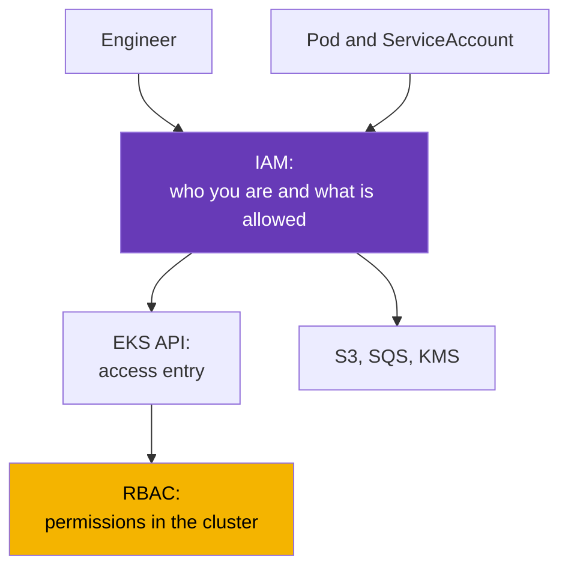
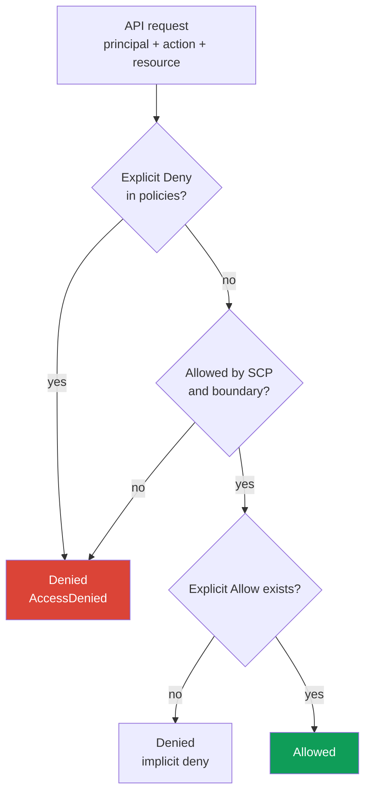
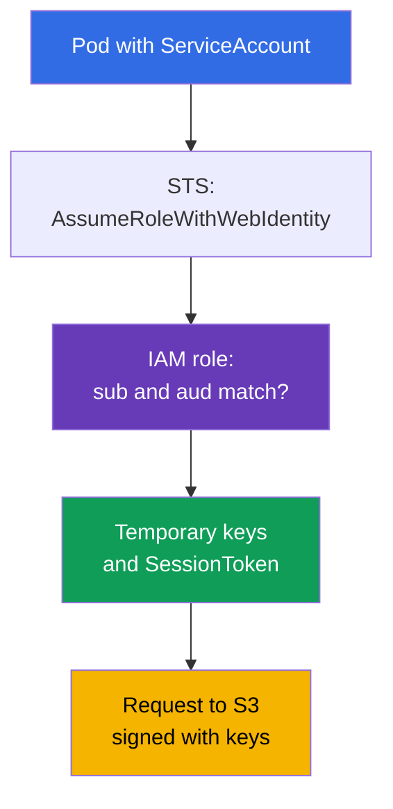

[Русская версия](ru.md) · [Versión en español](es.md) · [Version française](fr.md) · [Deutsche Version](de.md) · [ქართული ვერსია](ge.md) · [繁體中文版](tw.md) · [日本語版](jp.md)
# Chapter 0.2. IAM from Scratch: Policies, Roles, Trust, STS, and Temporary Keys

> **What's next.** Chapter 0.1 introduced the account as the boundary for permissions and billing, but left the question "who am I right now" unanswered. IAM answers it. In EKS it solves two tasks at once: who among people can access the cluster (chapter 5), and what a pod is allowed to do when it reaches S3, SQS, or Secrets Manager (chapters 16-17). Here is only the operational minimum: policies, roles, trust, temporary keys, and debugging denials. VPC (chapter 0.3) builds on this next.

## 0.2.1. Why a Kubernetes engineer needs to know IAM

In a kubeadm cluster, authorization ended at RBAC. In EKS, IAM is a second layer before RBAC. It does not replace RBAC, it runs before it: when you run `kubectl get pods`, you sign the request with your IAM identity, EKS checks whether that identity has any right to access the cluster, and only then does Kubernetes check RBAC. A denial at the first step looks like `You must be logged in to the server (Unauthorized)`, and looking for it in RBAC is pointless.

The other half is workload permissions. An application in a pod wants to read an S3 bucket, but S3 knows nothing about a ServiceAccount. The pod therefore needs AWS credentials, and the correct way to grant them is an IAM role linked to the ServiceAccount through IRSA (chapter 16) or EKS Pod Identity (chapter 17). The ServiceAccount provides the pod's identity in the cluster; the IAM role provides that same pod's identity in AWS.



## 0.2.2. Entities: users, groups, roles, policies

IAM consists of **principals** (who acts) and **policies** (what is allowed). Principals come in three types, but modern practice uses mainly one of them.

| Entity | What it is | Kubernetes analogy | Practice |
|--------|------------|--------------------|----------|
| **IAM user** | long-lived identity with a password and keys | static certificate | avoid |
| **IAM group** | a set of users for shared policies | Group in RBAC | together with user |
| **IAM role** | identity without keys of its own; it is assumed | ServiceAccount | primary approach |

An **IAM user** has a console password and an `AccessKeyId` + `SecretAccessKey` pair that do not expire. That is exactly why users are being phased out: a permanent key eventually ends up in git, a CI variable, or a chat; it can only be revoked manually, and a leak is almost impossible to notice. People are given access through **IAM Identity Center** (formerly AWS SSO) or an external identity provider, while machines use roles.

An **IAM role** is the course's key object. A role has no password or permanent keys: it is **assumed**, producing temporary credentials for 15 minutes to several hours. A role can be assumed by a person, an EC2 instance, Lambda, a pod in EKS, or a principal from another account. Policies are divided by what they are attached to:

- **identity-based** - attached to a user, group, or role: "this principal is allowed to do this and that." Most policies are this type.
- **resource-based** - attached to the resource itself (an S3 bucket policy, a KMS key policy, an ECR repository policy): "these principals are allowed to access me." Only these can grant access from another account without an intermediary role.

A detail for chapter 18: a KMS **key policy is required**, and if it does not include your role, an identity-based policy with `kms:Decrypt` alone is not enough.

## 0.2.3. Policy anatomy and decision logic

An IAM policy is a JSON document, and the fields are the same in all AWS policies.

```json
{
  "Version": "2012-10-17",
  "Statement": [{
    "Sid": "ReadAppBucket",
    "Effect": "Allow",
    "Action": ["s3:GetObject", "s3:ListBucket"],
    "Resource": ["arn:aws:s3:::my-app-bucket", "arn:aws:s3:::my-app-bucket/*"],
    "Condition": {"StringEquals": {"aws:PrincipalTag/Team": "platform"}}
  }]
}
```

- `Version` - the policy language version, always `2012-10-17`. It is not the date of your document.
- `Statement` - a list of rules, each evaluated independently.
- `Effect` - `Allow` or `Deny`. `Action` - API operations in the form `service:Operation`.
- `Resource` - resource ARNs; some actions are not resource-specific and require `"*"`.
- `Condition` - conditions: tags, IP addresses, MFA, time, or values from the request.

A wildcard works in both `Action` and `Resource`: `s3:Get*` covers all read actions. Two facts follow. First, a bucket needs **two ARNs**: the bucket itself for `s3:ListBucket` and `bucket/*` for object operations. Second, an `Action` and `Resource` with a wildcard are administrative permissions, and they are not granted to either a person or a pod in production.

Tag conditions provide a second way to grant permissions, and two models are distinguished here. **RBAC in IAM** is the familiar approach: write a policy with specific `Action` and `Resource` for each role. **ABAC (Attribute-Based Access Control)** compares tags instead of listing resources: one policy with the `aws:PrincipalTag/Team` condition opens access to resources with the same `Team` tag, and a new team does not need a separate policy, it only needs the tag. In the example above, the `Team=platform` condition is ABAC: the permission depends on a principal attribute, not its name.



Memorize three rules: **everything is denied by default** (implicit deny); **an explicit `Deny` is stronger than any `Allow`** and cannot be undone by another `Allow`; permissions are combined across all policies, so one `Allow` is enough if there is no `Deny` and the request passes the guardrails.

## 0.2.4. Managed and inline policies, boundaries, SCPs

The same document can be attached in different ways, and that affects manageability.

| Type | Where it lives | Reuse | When to use |
|------|----------------|-------|-------------|
| **AWS managed** | owned by AWS; AWS updates versions | globally | EKS node roles, quick start |
| **Customer managed** | in your account, with your own versions | yes, many roles | primary option |
| **Inline** | inside one role; lives with it | no | a targeted rule for one role |

AWS managed policies are convenient but are often broader than required: use `AmazonEKSWorkerNodePolicy` as provided, but do not grant `AmazonS3FullAccess` in production. A customer managed policy is versioned, visible in Terraform, and reversible; an inline policy is deleted with the role. Two mechanisms above them do not grant permissions, they only restrict them:

- **Permissions boundary** - a policy ceiling on a role or user; resulting permissions are the intersection of ordinary policies and the boundary. A typical scenario: a team creates roles for its services itself but cannot grant them more than the boundary allows. The working norm: a boundary is mandatory for every role created by developers and CI/CD pipelines. Otherwise, a pipeline with `iam:CreateRole` can effectively create an administrator role and escalate itself; a boundary makes such escalation impossible.
- **SCP (Service Control Policy)** from AWS Organizations - a ceiling for an account or OU. An SCP grants nothing, it only denies: it blocks unnecessary regions, prevents CloudTrail and GuardDuty from being disabled (chapter 21), and prevents KMS keys from being deleted. Even an account administrator is powerless against an SCP, and it looks like an unexplained `AccessDenied` despite a formally correct role policy.

## 0.2.5. Role and trust policy: two different documents

A role always has **two** sets of rules, and confusing them is the most common IAM mistake:

- **permissions policy** (identity-based) - **what** the role can do in AWS.
- **trust policy** (also called an assume role policy) - **who** can assume the role.

The analogy helps: a permissions policy is a Role, and a trust policy is a RoleBinding, except the subject is described not by its cluster name but by an AWS principal or an external identity provider.

```json
{
  "Version": "2012-10-17",
  "Statement": [{
    "Effect": "Allow",
    "Principal": {"Service": "ec2.amazonaws.com"},
    "Action": "sts:AssumeRole"
  }]
}
```

This trust policy allows the EC2 service to assume a role for an instance: that is how an EKS node receives permissions. The principal may vary: `"Service"` for an AWS service, `"AWS"` with a role or account ARN for cross-account access, and `"Federated"` for an external provider. There are also several actions for assuming a role:

- `sts:AssumeRole` - the ordinary option: an AWS principal assumes a role.
- `sts:AssumeRoleWithWebIdentity` - the role is assumed with an OIDC token. This is the basis of IRSA (chapter 16): the EKS cluster has its own OIDC provider, kubelet mounts a projected ServiceAccount token into the pod, and the SDK exchanges it in STS for temporary keys.
- `sts:AssumeRoleWithSAML` - federation from a corporate directory, usually for people.

Conditions work in a trust policy too - this is ABAC at role assumption. The following document permits assumption only to principals tagged `Team=platform`, with no need to add their ARNs one by one:

```json
{
  "Version": "2012-10-17",
  "Statement": [{
    "Effect": "Allow",
    "Principal": {"AWS": "arn:aws:iam::123456789012:root"},
    "Action": "sts:AssumeRole",
    "Condition": {"StringEquals": {"aws:PrincipalTag/Team": "platform"}}
  }]
}
```



A typical IRSA error is not in the permissions policy but in the trust policy: its condition specifies the wrong namespace or ServiceAccount name, and STS denies the request before any `s3:GetObject` call.

## 0.2.6. STS and temporary keys: the credentials chain

**AWS STS (Security Token Service)** issues temporary credentials. The set always has three parts, and the third distinguishes it from IAM user keys: `AccessKeyId` (temporary ones start with `ASIA`, permanent ones with `AKIA`), `SecretAccessKey`, and `SessionToken` - a required session token without which a request fails. The lifetime is set when they are obtained: from 15 minutes to 12 hours for `AssumeRole`, but no longer than the role's `MaxSessionDuration` (one hour by default). SDKs refresh these keys automatically, so there is nothing to rotate in a pod.

Where do aws cli and SDKs get credentials if you have not passed them explicitly? There is a **provider chain**, checked in order until the first success: environment variables (`AWS_ACCESS_KEY_ID`, `AWS_SESSION_TOKEN`), a profile in `~/.aws/config` and `~/.aws/credentials`, web identity (`AWS_WEB_IDENTITY_TOKEN_FILE`, which is IRSA), EKS Pod Identity through a node agent (chapter 17), and finally IMDS with the instance role. The order explains two common mysteries. First, a pod with a correct IRSA role runs under the node role because `AWS_ACCESS_KEY_ID` variables remain in the image or Deployment and override everything else. Second, a command works locally but not in CI because the profiles differ.

Profiles are described in `~/.aws/config`, and the working norm for people is IAM Identity Center:

```ini
[profile prod]
sso_session = company
sso_account_id = 123456789012
sso_role_name = PlatformEngineer
region = eu-central-1
```

```bash
# Sign in through IAM Identity Center: temporary keys are cached and refreshed when expired
aws sso login --profile prod
# Check how AWS identifies you right now
aws sts get-caller-identity --profile prod
# Assume a role manually if an explicit set of one-hour keys is needed
aws sts assume-role --role-arn arn:aws:iam::123456789012:role/PlatformAdmin \
  --role-session-name debug-session --duration-seconds 3600
```

Keys in `~/.aws/credentials` are supported too, but those are the long-lived secrets on disk. They are not needed anywhere in this course.

## 0.2.7. IAM in the EKS context: where each part is needed

An EKS cluster has its own set of IAM objects, and almost every one can cause an incident.

| Object | Belongs to | Why it is needed |
|--------|------------|------------------|
| **Cluster role** | EKS control plane | manage AWS resources on behalf of the cluster |
| **Node role** | EC2 instance of a node | join the cluster, ENIs, images from ECR |
| **Access entry** | your IAM identity | human or CI access to the cluster API (chapter 5) |
| **IRSA / Pod Identity** | pod ServiceAccount | workload permissions in AWS (chapters 16-17) |

**The cluster role** is created once, usually contains `AmazonEKSClusterPolicy`, and is not touched after creation. **The node role** is mandatory: without the correct set of policies, the node simply does not appear in `kubectl get nodes`. It needs `AmazonEKSWorkerNodePolicy` to register in the cluster, `AmazonEC2ContainerRegistryReadOnly` (or `...PullOnly`) for images from ECR, and `AmazonEKS_CNI_Policy` if VPC CNI uses the node role rather than its own IRSA role. `AmazonSSMManagedInstanceCore` is added separately to access nodes through Session Manager without SSH or a bastion. We cover the "node did not join" diagnosis in chapter 45.

**Human access** used to live in the `aws-auth` ConfigMap: manual edits, no validation, and a real chance of losing cluster access with a single typo. It is now handled through **access entries** - EKS API-level objects that link an identity ARN with cluster permissions (chapter 5). **Pod permissions** are granted through IRSA (OIDC, works everywhere) or EKS Pod Identity (a node agent, simpler to set up and without an OIDC provider on the cluster); chapters 16 and 17 cover the choice and migration.

**IMDS (Instance Metadata Service)** also deserves separate attention. It is the local address `169.254.169.254` through which an instance gets metadata and node role keys. This address is accessible from a pod too: if nothing is configured, any container can obtain the node role credentials with an ordinary HTTP request, which means access to ECR, ENIs, and anything else you added there. Hence the hardening standard: IMDSv2 is required, the hop limit must prevent a request from reaching it from a container, and workloads receive permissions only through IRSA or Pod Identity. This prepares for chapter 19.

## 0.2.8. Debugging permissions: what to inspect on AccessDenied

A denial message is more informative than it seems and usually names everything needed:

```text
User: arn:aws:sts::123456789012:assumed-role/app-role/1699... is not authorized
to perform: s3:GetObject on resource: arn:aws:s3:::my-app-bucket/data.csv
because no identity-based policy allows the s3:GetObject action
```

Read it through four points: who (`assumed-role/app-role`, which means the role was assumed and IRSA worked), what (`s3:GetObject`), against what (the full object ARN), and why. The reason at the end is most valuable: `no identity-based policy allows` is an implicit deny and requires adding permission, while `with an explicit deny in a service control policy` means SCP, making it pointless to change the role policy.

```bash
# The starting point for any debugging: how AWS sees you right now
aws sts get-caller-identity
# What is attached to the role and who can assume it at all
aws iam list-attached-role-policies --role-name app-role
aws iam list-role-policies --role-name app-role
aws iam get-role --role-name app-role --query 'Role.AssumeRolePolicyDocument'
# Check the decision without making an actual API call
aws iam simulate-principal-policy \
  --policy-source-arn arn:aws:iam::123456789012:role/app-role \
  --action-names s3:GetObject --resource-arns arn:aws:s3:::my-app-bucket/data.csv
```

`simulate-principal-policy` (IAM Policy Simulator in the console) answers whether an action is allowed without performing it, but it does not fully reproduce conditions with real request values. **CloudTrail** has the final word: it shows the actual call, principal, parameters, and error code. Inside a pod, debugging starts with `AWS_ROLE_ARN` and `AWS_WEB_IDENTITY_TOKEN_FILE`: if they are absent, IRSA is not connected (chapters 21 and 47).

## 0.2.9. How this is used in production

- **People without keys.** Access is through IAM Identity Center or federation, MFA is mandatory, long-lived-key IAM users are not created. Root is not used (chapter 0.1).
- **A role per workload, not per cluster.** Every application has its own role with a minimal set of actions and specific ARNs. A shared "role for all pods" quietly grants the whole cluster access to all data.
- **Guardrails above.** SCPs block dangerous actions and unnecessary regions; a permissions boundary lets teams create roles on their own without escalating their permissions.
- **External access under control.** IAM Access Analyzer continuously analyzes resource-based policies and trust policies and finds entities outside the account or Organization that have access (external access): another account in a role's trust policy, a public S3 bucket, or a KMS key. Findings are reviewed and unnecessary access is removed.
- **IAM as code.** Roles and policies are described in Terraform; policy review is part of code review. Manual console changes are not reproducible and disappear on the next `apply`.
- **Audit and alerts.** CloudTrail is enabled in every account, and alerts exist for root use, user and key creation, and policy changes (chapter 21).

## 0.2.10. Mini glossary

- **Principal** - whoever performs a request: a user, role, or AWS service.
- **IAM user / group** - a long-lived identity and a set of such identities; avoided in production.
- **IAM role** - an identity without permanent keys that is assumed temporarily.
- **Policy** - JSON with `Version`, `Statement`, `Effect`, `Action`, `Resource`, and `Condition`; it can be **identity-based** (on the principal) or **resource-based** (on the resource itself).
- **ABAC / RBAC** - access by tags through `aws:PrincipalTag` versus access by roles and policies with specific actions and resources.
- **IAM Access Analyzer** - finds externally trusted entities (external access) in resource-based policies and trust policies.
- **Managed / inline policy** - a reusable, versioned policy / a policy embedded in a role.
- **Permissions boundary** - a permission ceiling for a role or user; it grants no permissions.
- **SCP** - an Organizations-level policy that only denies and applies to the entire account.
- **Trust policy** - a role document that describes who can assume it.
- **STS** - the temporary-key service; `sts:AssumeRole`, `sts:AssumeRoleWithWebIdentity`.
- **IRSA / Pod Identity** - two ways to grant an IAM role to a pod (chapters 16-17).
- **IMDS** - the instance metadata service at `169.254.169.254`, which returns node role keys.

## 0.2.11. Chapter summary

- IAM runs before RBAC: AWS first checks the identity and right to access the cluster, then Kubernetes checks permissions inside the cluster.
- The primary principal is a role, not a user: it has no permanent keys, it is assumed through STS, and it produces temporary credentials with a `SessionToken`.
- A role has two documents: a permissions policy (what it can do) and a trust policy (who can assume it). IRSA errors most often live in the trust policy.
- The decision is computed as follows: everything is denied by default, an explicit `Deny` is stronger than any `Allow`, and SCPs and permissions boundaries only reduce the resulting permissions.
- The node role is mandatory and must contain policies to register in the cluster and access ECR; human access is described through access entries (chapter 5), pod permissions through IRSA or Pod Identity (chapters 16-17), not through the node role and IMDS (chapter 19).
- Debugging follows this chain: `AccessDenied` text, `aws sts get-caller-identity`, the role's policies and trust policy, the simulator, then CloudTrail as the source of truth (chapter 21).

## 0.2.12. How this helps in real work

Most tickets saying "something does not work in EKS" are IAM: an engineer cannot enter the cluster, CI cannot update a Deployment, a pod cannot read a bucket, a node does not register, or a controller cannot create a load balancer. The path is always the same: understand which identity makes the call, which policies it has, what the trust policy says, and what CloudTrail shows. The other half of the work is design: a role per application, least privilege, no long-lived keys, guardrails above, and the whole construction in Terraform rather than in the console.

## 0.2.13. Self-check questions

1. Why does IAM not replace RBAC, and in what order are they checked for `kubectl get pods`?
2. How does an IAM role differ from an IAM user, and why are users with keys avoided?
3. How does AWS compute the decision if one policy allows an action and another denies it?
4. How does a permissions boundary differ from an ordinary policy and from an SCP, and why is it mandatory for CI/CD-created roles?
5. Which two documents does a role have, and what does each one govern?
6. Which STS action underlies IRSA, and what does a pod present in exchange for keys?
7. In which order does an SDK search for credentials, and why do environment variables break IRSA?
8. Why is it dangerous for a pod to have access to `169.254.169.254`?
9. You received `AccessDenied` mentioning a service control policy. What should you change?
10. How does ABAC differ from RBAC in IAM, and which condition is its basis?
11. Why is IAM Access Analyzer needed, and what does it classify as external access?

## Practice

Part 0 has no labs of its own: it is a foundation for the remaining chapters. You will use IAM in nearly every Part 1 lab and beyond, starting with cluster creation and access. Next comes the chapter on VPC: subnets, routing, NAT, and security groups, the network in which the cluster will live.

---
[Contents](../README.md) · [Chapter 0.1](../00-1-aws/en.md) · [Chapter 0.3](../00-3-vpc/en.md)
