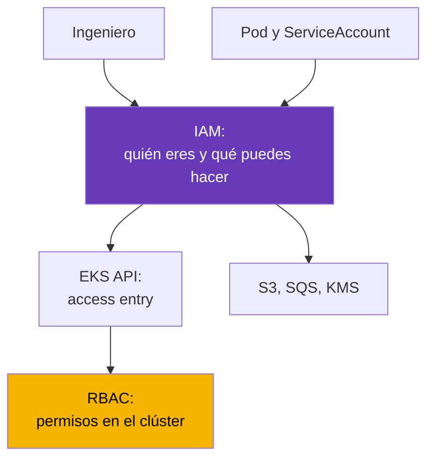
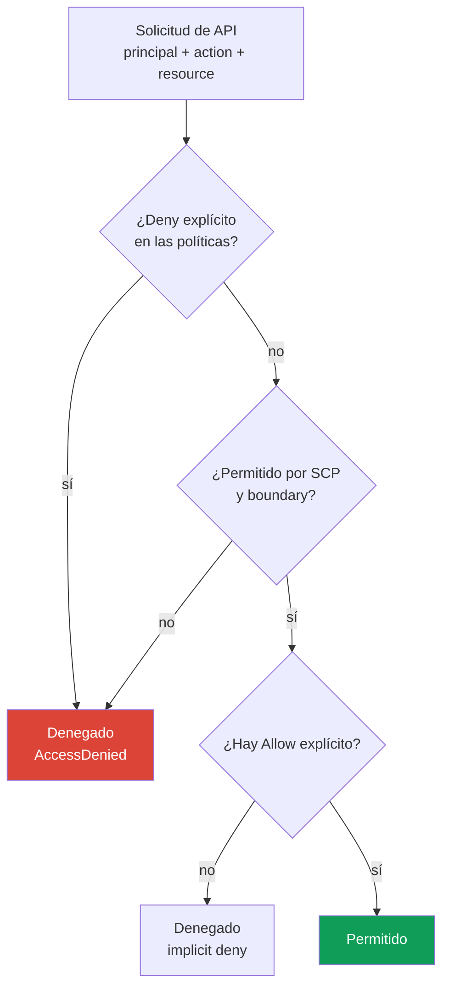
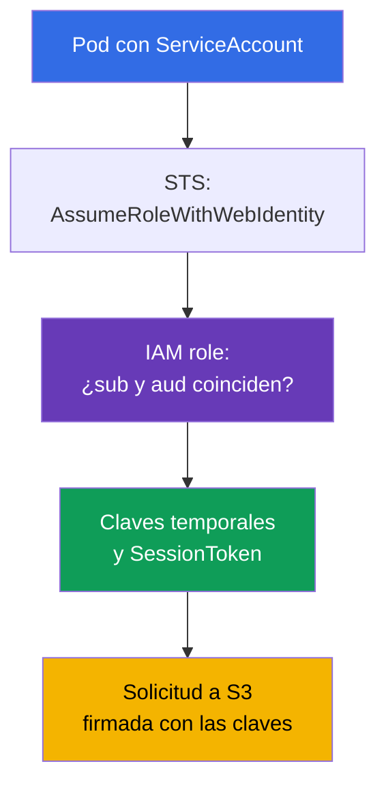

[Русская версия](ru.md) · [Eng version](en.md) · [Version française](fr.md) · [Deutsche Version](de.md) · [ქართული ვერსია](ge.md) · [繁體中文版](tw.md) · [日本語版](jp.md)
# Capítulo 0.2. IAM desde cero: políticas, roles, confianza, STS y claves temporales

> **Qué sigue.** En el capítulo 0.1 apareció la cuenta como frontera de permisos y facturación, pero la pregunta «quién soy ahora» quedó sin respuesta. IAM la responde: en EKS resuelve dos tareas a la vez, quién de las personas puede acceder al clúster (capítulo 5) y qué puede hacer un pod cuando va a S3, SQS o Secrets Manager (capítulos 16-17). Aquí está solo el mínimo necesario para operar: políticas, roles, confianza, claves temporales y depuración de denegaciones. Sobre esto se construirá VPC (capítulo 0.3).

## 0.2.1. Por qué un ingeniero de Kubernetes debe conocer IAM

En un clúster kubeadm la autorización terminaba en RBAC. En EKS hay un segundo perímetro antes de RBAC: IAM no reemplaza RBAC, sino que actúa antes. Al ejecutar `kubectl get pods`, firmas la solicitud con tu IAM identity, EKS comprueba que esa identity tenga derecho a acceder al clúster y solo entonces Kubernetes comprueba RBAC. Una denegación en el primer paso aparece como `You must be logged in to the server (Unauthorized)`, y no tiene sentido buscarla en RBAC.

La otra mitad son los permisos de las cargas. Una aplicación en un pod quiere leer un bucket S3, pero S3 no conoce ServiceAccount. Por tanto, el pod necesita credenciales de AWS, y la forma correcta de concedérselas es un IAM role vinculado al ServiceAccount mediante IRSA (capítulo 16) o EKS Pod Identity (capítulo 17). ServiceAccount se ocupa de la identity del pod dentro del clúster; IAM role, de la identity de ese mismo pod en AWS.



## 0.2.2. Entidades: usuarios, grupos, roles y políticas

IAM consta de **principals** (quién actúa) y **políticas** (qué se permite). Los principals son de tres tipos, pero en la práctica moderna se usa sobre todo uno.

| Entidad | Qué es | Analogía en Kubernetes | Práctica |
|----------|---------|-----------------------|----------|
| **IAM user** | identity duradera con contraseña y claves | certificado estático | evitar |
| **IAM group** | conjunto de usuarios para políticas comunes | Group en RBAC | junto con user |
| **IAM role** | identity sin claves propias que se asume | ServiceAccount | forma principal |

Un **IAM user** tiene una contraseña para la consola y un par de claves `AccessKeyId` + `SecretAccessKey` que no caducan. Por eso se evita usar usuarios: tarde o temprano una clave permanente llega a git, a una variable de CI o a un chat, solo se revoca manualmente y una filtración es casi imposible de detectar. Hoy se da acceso a las personas mediante **IAM Identity Center** (antes AWS SSO) o un proveedor de identity externo, y a las máquinas mediante roles.

Un **IAM role** es el objeto clave del curso. Un rol no tiene contraseña ni claves permanentes: se **asume** (assume) y se obtienen credenciales temporales por un período de 15 minutos a varias horas. Puede asumirlo una persona, una instancia EC2, Lambda, un pod en EKS o un principal de otra cuenta. Las políticas, en cambio, se dividen según a qué se adjuntan:

- **identity-based** - se adjuntan a un usuario, grupo o rol: «este principal puede hacer esto y aquello». Son la mayoría.
- **resource-based** - se adjuntan al propio recurso (bucket policy de S3, key policy de KMS, política de repositorio ECR): «estos principals pueden acceder a mí». Solo ellas pueden conceder acceso desde otra cuenta sin un rol intermediario.

Un detalle para el capítulo 18: en KMS la **key policy es obligatoria**, y si no contiene tu rol, una política identity-based con `kms:Decrypt` no basta.

## 0.2.3. Anatomía de una política y lógica de decisión

Una política IAM es un documento JSON, y los campos son iguales en todas las políticas de AWS.

```json
{
  "Version": "2012-10-17",
  "Statement": [{
    "Sid": "ReadAppBucket",
    "Effect": "Allow",
    "Action": ["s3:GetObject", "s3:ListBucket"],
    "Resource": ["arn:aws:s3:::my-app-bucket", "arn:aws:s3:::my-app-bucket/*"],
    "Condition": {"StringEquals": {"aws:PrincipalTag/Team": "platform"}}
  }]
}
```

- `Version` - versión del lenguaje de políticas, siempre `2012-10-17`. No es la fecha de tu documento.
- `Statement` - lista de reglas; cada una se considera de forma independiente.
- `Effect` - `Allow` o `Deny`. `Action` - acciones de API con la forma `servicio:Operación`.
- `Resource` - ARN de recursos; algunas acciones no se refieren a un recurso y requieren `"*"`.
- `Condition` - condiciones: etiquetas, IP, MFA, hora, valores de la solicitud.

El wildcard funciona tanto en `Action` como en `Resource`: `s3:Get*` son todas las acciones de lectura. De aquí se derivan dos hechos. Primero, un bucket necesita **dos ARN**: el bucket para `s3:ListBucket` y `bucket/*` para operaciones sobre objetos. Segundo, `Action` y `Resource` con asterisco son permisos administrativos, y en producción no se conceden ni a una persona ni a un pod.

Las condiciones por etiquetas dan una segunda manera de repartir permisos, y aquí se distinguen dos modelos. **RBAC en IAM** es el enfoque habitual: se escribe una política con `Action` y `Resource` concretos para cada rol. **ABAC (Attribute-Based Access Control)**, en vez de enumerar recursos, compara etiquetas: una política con la condición `aws:PrincipalTag/Team` da acceso a recursos con la misma etiqueta `Team`, y un equipo nuevo no necesita una política aparte, basta con establecer la etiqueta. En el ejemplo anterior, la condición `Team=platform` es ABAC: el permiso depende del atributo del principal, no de su nombre.



Tres reglas que hay que memorizar: **por defecto todo está prohibido** (implicit deny); un **`Deny` explícito es más fuerte que cualquier `Allow`** y no se puede anular con otro `Allow`; los permisos se suman entre todas las políticas, por lo que basta un `Allow` si no existe `Deny` y la solicitud pasa los límites.

## 0.2.4. Políticas administradas e inline, boundary y SCP

El mismo documento puede adjuntarse de distintas maneras, y eso afecta a la gestión.

| Tipo | Dónde vive | Reutilización | Cuándo usarlo |
|-----|-----------|-------------------|-----------------|
| **AWS managed** | en AWS, AWS actualiza las versiones | global | roles de nodos EKS, inicio rápido |
| **Customer managed** | en tu cuenta, con tus versiones | sí, muchos roles | opción principal |
| **Inline** | dentro de un solo rol, vive con él | no | regla puntual para un rol |

Las políticas AWS managed son prácticas, pero a menudo más amplias de lo necesario: conectarás `AmazonEKSWorkerNodePolicy` tal cual, pero no conviene conceder `AmazonS3FullAccess` en producción. Una política Customer managed tiene versiones, se ve en Terraform y puede revertirse; una política inline se elimina junto con el rol. Por encima hay dos mecanismos que no conceden permisos, sino que solo los recortan:

- **Permissions boundary** - política techo para un rol o usuario; los permisos finales son la intersección de las políticas normales y el boundary. Escenario típico: un equipo crea roles para sus servicios, pero no puede concederles más de lo que admite el boundary. Una norma operativa es que el boundary sea obligatorio para todos los roles creados por desarrolladores y pipelines de CI/CD. De lo contrario, un pipeline con `iam:CreateRole` puede crear de hecho un rol administrador y escalar sus propios permisos; el boundary impide esa escalada.
- **SCP (Service Control Policy)** de AWS Organizations - techo para una cuenta u OU. SCP no concede nada, solo prohíbe: bloquea regiones no necesarias, impide desactivar CloudTrail y GuardDuty (capítulo 21), o borrar claves KMS. Incluso un administrador de la cuenta es impotente frente a una SCP, y esto parece un `AccessDenied` inexplicable con una política de rol formalmente correcta.

## 0.2.5. Rol y trust policy: dos documentos diferentes

Un rol siempre tiene **dos** conjuntos de reglas, y confundirlos es uno de los errores más frecuentes en IAM:

- **permissions policy** (identity-based) - **qué** puede hacer el rol en AWS.
- **trust policy** (también llamada assume role policy) - **quién** puede asumir ese rol.

La analogía ayuda: la permissions policy es un Role, y la trust policy es un RoleBinding, solo que el sujeto no se describe por un nombre dentro del clúster, sino por un principal de AWS o un proveedor de identity externo.

```json
{
  "Version": "2012-10-17",
  "Statement": [{
    "Effect": "Allow",
    "Principal": {"Service": "ec2.amazonaws.com"},
    "Action": "sts:AssumeRole"
  }]
}
```

Esta trust policy permite al servicio EC2 asumir un rol en nombre de una instancia: así es como un nodo EKS obtiene permisos. El principal puede variar: `"Service"` para un servicio AWS, `"AWS"` con el ARN de un rol o cuenta para acceso entre cuentas, `"Federated"` para un proveedor externo. También hay varias acciones para asumir el rol:

- `sts:AssumeRole` - opción habitual: un principal de AWS asume un rol.
- `sts:AssumeRoleWithWebIdentity` - el rol se asume con un token OIDC. Sobre esto se basa IRSA (capítulo 16): el clúster EKS tiene su propio proveedor OIDC, kubelet monta en el pod un projected token de ServiceAccount y el SDK lo intercambia en STS por claves temporales.
- `sts:AssumeRoleWithSAML` - federación desde el directorio corporativo, normalmente para personas.

Las condiciones también funcionan en una trust policy: esto es ABAC al asumir un rol. Este documento permite asumir el rol solo a principals con la etiqueta `Team=platform`, sin necesidad de agregar sus ARN uno por uno:

```json
{
  "Version": "2012-10-17",
  "Statement": [{
    "Effect": "Allow",
    "Principal": {"AWS": "arn:aws:iam::123456789012:root"},
    "Action": "sts:AssumeRole",
    "Condition": {"StringEquals": {"aws:PrincipalTag/Team": "platform"}}
  }]
}
```



Un error típico de IRSA no está en la permissions policy, sino en la trust policy: la condición contiene el namespace o el nombre de ServiceAccount incorrecto, y STS rechaza la solicitud antes de cualquier `s3:GetObject`.

## 0.2.6. STS y claves temporales: cadena de credentials

**AWS STS (Security Token Service)** emite credenciales temporales. El conjunto siempre tiene tres partes, y la tercera lo distingue de las claves de un usuario IAM: `AccessKeyId` (en las temporales empieza por `ASIA`, en las permanentes por `AKIA`), `SecretAccessKey` y `SessionToken`, el token de sesión obligatorio sin el que la solicitud no pasa. La duración se indica al obtenerlas: de 15 minutos a 12 horas para `AssumeRole`, pero nunca más que `MaxSessionDuration` del rol (1 hora por defecto). Los SDK renuevan estas claves por sí solos, por lo que no hay nada que rotar dentro de un pod.

¿De dónde obtienen aws cli y los SDK las credentials si no les pasaste nada explícitamente? Hay una **cadena de proveedores** que se comprueba en orden hasta el primer resultado: variables de entorno (`AWS_ACCESS_KEY_ID`, `AWS_SESSION_TOKEN`), perfil de `~/.aws/config` y `~/.aws/credentials`, web identity (`AWS_WEB_IDENTITY_TOKEN_FILE`, que es IRSA), EKS Pod Identity a través del agente en el nodo (capítulo 17), y finalmente IMDS con el rol de instancia. El orden explica dos misterios frecuentes. Primero: un pod con un rol IRSA correcto opera con el rol del nodo porque quedaron variables `AWS_ACCESS_KEY_ID` en la imagen o en el Deployment y sustituyeron todo lo demás. Segundo: un comando funciona localmente, pero no en CI, porque se usan perfiles diferentes.

Los perfiles se describen en `~/.aws/config`, y la norma de trabajo para personas es IAM Identity Center:

```ini
[profile prod]
sso_session = company
sso_account_id = 123456789012
sso_role_name = PlatformEngineer
region = eu-central-1
```

```bash
# Inicio de sesión mediante IAM Identity Center: claves temporales en caché, se renuevan al caducar
aws sso login --profile prod
# Comprobar qué identity ve AWS ahora
aws sts get-caller-identity --profile prod
# Asumir manualmente un rol si se necesita un conjunto explícito de claves por una hora
aws sts assume-role --role-arn arn:aws:iam::123456789012:role/PlatformAdmin \
  --role-session-name debug-session --duration-seconds 3600
```

También se admiten claves en `~/.aws/credentials`, pero son precisamente secretos duraderos en disco. No se necesitan en ninguna parte del curso.

## 0.2.7. IAM en el contexto de EKS: dónde se necesita cada cosa

Un clúster EKS tiene su propio conjunto de objetos IAM, y casi todos pueden causar un incidente.

| Objeto | A quién pertenece | Para qué sirve |
|--------|------------------|-------------|
| **Cluster role** | control plane de EKS | administrar recursos AWS en nombre del clúster |
| **Node role** | instancia EC2 del nodo | unirse al clúster, ENI, imágenes de ECR |
| **Access entry** | tu IAM identity | acceso de una persona o CI a la API del clúster (capítulo 5) |
| **IRSA / Pod Identity** | ServiceAccount del pod | permisos de la carga en AWS (capítulos 16-17) |

El **rol del clúster** se crea una vez, normalmente contiene `AmazonEKSClusterPolicy`, y no se toca después de crearlo. El **rol del nodo** es obligatorio: sin el conjunto correcto de políticas, el nodo simplemente no aparecerá en `kubectl get nodes`. Se necesitan `AmazonEKSWorkerNodePolicy` para registrarse en el clúster, `AmazonEC2ContainerRegistryReadOnly` (o `...PullOnly`) para las imágenes de ECR y `AmazonEKS_CNI_Policy` si VPC CNI opera con el rol del nodo y no con su propio rol IRSA. También se agrega `AmazonSSMManagedInstanceCore` para entrar en nodos mediante Session Manager sin SSH ni bastion. El diagnóstico de «el nodo no se unió» se trata en el capítulo 45.

El **acceso de las personas** antes vivía en ConfigMap `aws-auth`: edición manual, ninguna validación y una posibilidad real de perder el acceso al clúster por una errata. Ahora son **access entries**, objetos de la API de EKS que vinculan el ARN de una identity con permisos en el clúster (capítulo 5). Los **permisos de los pods** se conceden mediante IRSA (OIDC, funciona en todas partes) o EKS Pod Identity (agente en el nodo, más sencillo de configurar, sin proveedor OIDC en el clúster); la elección y migración se tratan en los capítulos 16 y 17.

También hay que hablar de **IMDS (Instance Metadata Service)**, la dirección local `169.254.169.254` mediante la cual una instancia obtiene metadatos y las claves del rol del nodo. Esta dirección también es accesible desde un pod: si no se configura nada, cualquier contenedor puede obtener mediante una solicitud HTTP normal las credentials del rol del nodo, es decir, acceso a ECR, ENI y a todo lo que se haya agregado al rol. De aquí surge el estándar de hardening: IMDSv2 es obligatorio, el hop limit debe impedir que una solicitud desde el contenedor llegue allí, y las cargas obtienen permisos solo mediante IRSA o Pod Identity. Esto prepara el capítulo 19.

## 0.2.8. Depuración de permisos: qué revisar ante AccessDenied

Un mensaje de denegación aporta más información de la que parece y normalmente nombra todo lo necesario:

```text
User: arn:aws:sts::123456789012:assumed-role/app-role/1699... is not authorized
to perform: s3:GetObject on resource: arn:aws:s3:::my-app-bucket/data.csv
because no identity-based policy allows the s3:GetObject action
```

Léelo en cuatro puntos: quién (`assumed-role/app-role`, por tanto el rol fue asumido e IRSA funcionó), qué (`s3:GetObject`), sobre qué (el ARN completo del objeto) y por qué. La parte final de la causa es la más valiosa: `no identity-based policy allows` es implicit deny y se debe agregar el permiso; `with an explicit deny in a service control policy` significa SCP, y editar la política del rol no tiene sentido.

```bash
# Punto de partida para cualquier depuración: qué identity ve AWS ahora mismo
aws sts get-caller-identity
# Qué está adjunto al rol y quién puede asumirlo en absoluto
aws iam list-attached-role-policies --role-name app-role
aws iam list-role-policies --role-name app-role
aws iam get-role --role-name app-role --query 'Role.AssumeRolePolicyDocument'
# Comprobar la decisión sin realizar una llamada real a la API
aws iam simulate-principal-policy \
  --policy-source-arn arn:aws:iam::123456789012:role/app-role \
  --action-names s3:GetObject --resource-arns arn:aws:s3:::my-app-bucket/data.csv
```

`simulate-principal-policy` (en la consola, IAM Policy Simulator) responde a «¿está permitido?» sin ejecutar la acción, pero no reproduce por completo condiciones con valores reales de la solicitud. La última palabra la tiene **CloudTrail**: allí se ve la llamada real, el principal, los parámetros y el código de error. Dentro de un pod, la depuración comienza con las variables `AWS_ROLE_ARN` y `AWS_WEB_IDENTITY_TOKEN_FILE`: si no están, IRSA no se conectó (capítulos 21 y 47).

## 0.2.9. Cómo se aplica en producción

- **Personas sin claves.** Acceso mediante IAM Identity Center o federación, MFA obligatorio, y no se crean usuarios IAM con claves duraderas. No se usa Root (capítulo 0.1).
- **Un rol por carga, no por clúster.** Cada aplicación tiene su propio rol con un conjunto mínimo de acciones y ARN concretos. Un «rol para todos los pods» concede silenciosamente a todo el clúster acceso a todos los datos.
- **Límites superiores.** Las SCP bloquean acciones peligrosas y regiones no necesarias; permissions boundary permite a los equipos crear roles por sí mismos sin escalar permisos.
- **Acceso externo controlado.** IAM Access Analyzer analiza constantemente las políticas resource-based y trust policy y encuentra entidades fuera de la cuenta u Organization que tienen acceso (external access): otra cuenta en la trust policy de un rol, un bucket S3 público o una clave KMS. Se revisan los hallazgos y se elimina el acceso innecesario.
- **IAM como código.** Los roles y políticas se describen en Terraform; la revisión de políticas es parte del code review. Las ediciones manuales en la consola no se pueden reproducir y se pierden en el siguiente `apply`.
- **Auditoría y alarmas.** CloudTrail está activado en todas las cuentas y hay alarmas para el uso de root, la creación de usuarios y claves, y cambios de políticas (capítulo 21).

## 0.2.10. Mini glosario

- **Principal** - quien realiza una solicitud: un usuario, rol o servicio AWS.
- **IAM user / group** - identity duradera y conjunto de esas identity; se evitan en producción.
- **IAM role** - identity sin claves permanentes que se asume temporalmente.
- **Policy** - JSON con `Version`, `Statement`, `Effect`, `Action`, `Resource`, `Condition`; puede ser **identity-based** (en el principal) y **resource-based** (en el propio recurso).
- **ABAC / RBAC** - acceso por etiquetas mediante `aws:PrincipalTag` frente a acceso por roles y políticas con acciones y recursos concretos.
- **IAM Access Analyzer** - encuentra entidades externas de confianza (external access) en políticas resource-based y trust policy.
- **Managed / inline policy** - política reutilizable y versionada / política integrada en un rol.
- **Permissions boundary** - techo de permisos de un rol o usuario; no concede permisos.
- **SCP** - política de nivel Organizations, solo prohíbe y se aplica a toda la cuenta.
- **Trust policy** - documento del rol que describe quién puede asumirlo.
- **STS** - servicio de claves temporales; `sts:AssumeRole`, `sts:AssumeRoleWithWebIdentity`.
- **IRSA / Pod Identity** - dos maneras de conceder un IAM role a un pod (capítulos 16-17).
- **IMDS** - servicio de metadatos de instancia en `169.254.169.254`, entrega las claves del rol del nodo.

## 0.2.11. Resumen del capítulo

- IAM opera antes de RBAC: primero AWS comprueba la identity y el derecho al clúster; después Kubernetes comprueba los permisos dentro del clúster.
- El principal principal es un rol, no un usuario: no tiene claves permanentes, se asume mediante STS y proporciona credentials temporales con `SessionToken`.
- Un rol tiene dos documentos: permissions policy (qué puede hacer) y trust policy (quién puede asumirlo). Los errores de IRSA casi siempre están precisamente en la trust policy.
- La decisión se calcula así: por defecto se prohíbe, un `Deny` explícito es más fuerte que cualquier `Allow`, y SCP y permissions boundary solo recortan los permisos finales.
- El rol del nodo es obligatorio y debe contener políticas de registro en el clúster y acceso a ECR; el acceso de las personas se describe mediante access entries (capítulo 5), los permisos de los pods mediante IRSA o Pod Identity (capítulos 16-17), no mediante el rol del nodo ni IMDS (capítulo 19).
- La depuración sigue esta cadena: texto de `AccessDenied`, `aws sts get-caller-identity`, políticas y trust policy del rol, simulador y CloudTrail como fuente de verdad (capítulo 21).

## 0.2.12. Cómo será útil en el trabajo real

La mayor parte de los tickets de «algo no funciona en EKS» son IAM: un ingeniero no entra al clúster, CI no puede actualizar un Deployment, un pod no lee un bucket, un nodo no se registra o un controlador no crea un balanceador. El camino es siempre el mismo: entender desde qué identity parte la llamada, qué políticas tiene, qué dice la trust policy y qué se ve en CloudTrail. La otra mitad del trabajo es diseño: un rol por aplicación, permisos mínimos, ninguna clave duradera, límites superiores y toda la construcción en Terraform, no en la consola.

## 0.2.13. Preguntas de autoevaluación

1. ¿Por qué IAM no reemplaza RBAC y en qué orden se comprueban al ejecutar `kubectl get pods`?
2. ¿En qué se diferencia un IAM role de un IAM user y por qué se evitan los usuarios con claves?
3. ¿Cómo calcula AWS la decisión si una política permite una acción y otra la prohíbe?
4. ¿En qué se diferencia permissions boundary de una política normal y de una SCP, y por qué es obligatorio para los roles de CI/CD?
5. ¿Qué dos documentos tiene un rol y de qué se ocupa cada uno?
6. ¿Qué acción STS es la base de IRSA y qué presenta el pod a cambio de claves?
7. ¿En qué orden busca el SDK las credentials y por qué las variables de entorno rompen IRSA?
8. ¿Por qué es peligroso que un pod tenga acceso a `169.254.169.254`?
9. Has recibido `AccessDenied` con una mención de service control policy. ¿Qué debes editar?
10. ¿En qué se diferencia ABAC de RBAC en IAM y qué condición es su base?
11. ¿Para qué sirve IAM Access Analyzer y qué entiende por external access?

## Práctica

La Parte 0 no tiene laboratorios propios: es la base para los capítulos restantes. Aplicarás IAM en casi cada laboratorio de la Parte 1 y posteriores, empezando por crear el clúster y acceder a él. A continuación viene el capítulo sobre VPC: subredes, enrutamiento, NAT y security groups, es decir, la red donde vivirá el clúster.

---
[Índice](../README_ES.md) · [Capítulo 0.1](../00-1-aws/es.md) · [Capítulo 0.3](../00-3-vpc/es.md)
