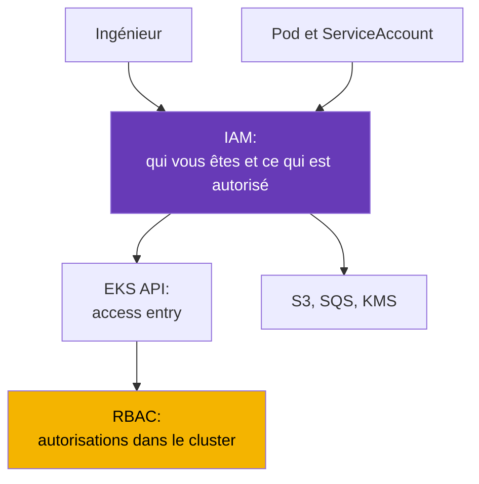
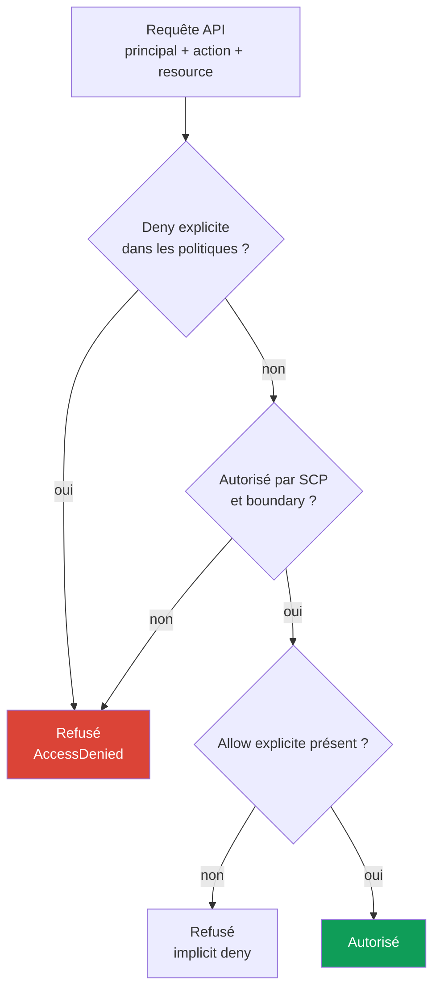
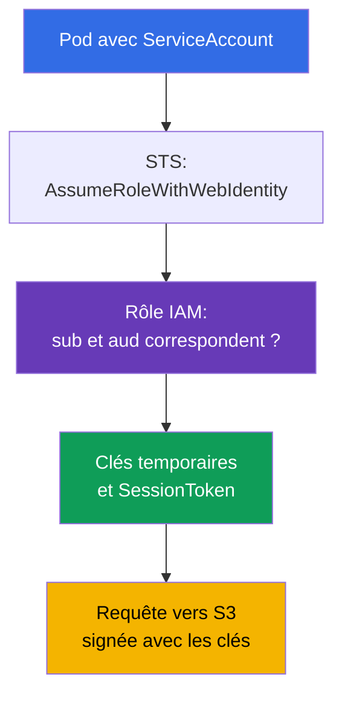

[Русская версия](ru.md) · [Eng version](en.md) · [Versión en español](es.md) · [Deutsche Version](de.md) · [ქართული ვერსია](ge.md) · [繁體中文版](tw.md) · [日本語版](jp.md)
# Chapitre 0.2. IAM depuis zéro : politiques, rôles, confiance, STS et clés temporaires

> **Et ensuite.** Le chapitre 0.1 a introduit le compte comme frontière des autorisations et de la facturation, mais a laissé sans réponse la question « qui suis-je actuellement ? ». IAM y répond. Dans EKS, il résout deux problèmes à la fois : quelles personnes peuvent accéder au cluster (chapitre 5) et ce qu'un pod est autorisé à faire lorsqu'il accède à S3, SQS ou Secrets Manager (chapitres 16-17). Voici uniquement le minimum nécessaire à l'exploitation : politiques, rôles, confiance, clés temporaires et débogage des refus. Le chapitre suivant s'appuiera sur cela pour VPC (chapitre 0.3).

## 0.2.1. Pourquoi un ingénieur Kubernetes doit connaître IAM

Dans un cluster kubeadm, l'autorisation s'arrêtait à RBAC. Dans EKS, IAM est une seconde couche placée avant RBAC. Il ne remplace pas RBAC, il s'exécute avant lui : lorsque vous lancez `kubectl get pods`, vous signez la requête avec votre identité IAM, EKS vérifie si cette identité a le droit d'accéder au cluster, puis Kubernetes vérifie RBAC. Un refus à cette première étape se présente sous la forme `You must be logged in to the server (Unauthorized)`, et le chercher dans RBAC est inutile.

L'autre moitié concerne les autorisations des charges de travail. Une application dans un pod veut lire un bucket S3, mais S3 ne sait rien d'un ServiceAccount. Le pod a donc besoin d'identifiants AWS, et la bonne manière de les lui accorder est un rôle IAM lié au ServiceAccount via IRSA (chapitre 16) ou EKS Pod Identity (chapitre 17). Le ServiceAccount fournit l'identité du pod dans le cluster, le rôle IAM fournit l'identité de ce même pod dans AWS.



## 0.2.2. Entités : utilisateurs, groupes, rôles, politiques

IAM se compose de **principaux** (qui agit) et de **politiques** (ce qui est autorisé). Les principaux se répartissent en trois types, mais la pratique moderne en utilise surtout un.

| Entité | Définition | Analogie Kubernetes | Pratique |
|--------|------------|---------------------|----------|
| **IAM user** | identité durable avec mot de passe et clés | certificat statique | à éviter |
| **IAM group** | ensemble d'utilisateurs pour des politiques partagées | Group dans RBAC | avec user |
| **IAM role** | identité sans clés propres, qui est assumée | ServiceAccount | approche principale |

Un **IAM user** possède un mot de passe pour la console et une paire `AccessKeyId` + `SecretAccessKey` qui n'expire pas. C'est précisément pourquoi les utilisateurs sont abandonnés : une clé permanente finit tôt ou tard dans git, une variable CI ou une conversation ; elle ne peut être révoquée que manuellement, et il est presque impossible de remarquer une fuite. Les personnes reçoivent aujourd'hui un accès via **IAM Identity Center** (anciennement AWS SSO) ou un fournisseur d'identité externe, tandis que les machines utilisent des rôles.

Un **IAM role** est l'objet central du cours. Un rôle n'a ni mot de passe ni clés permanentes : il est **assumé**, ce qui produit des identifiants temporaires pour une durée de 15 minutes à plusieurs heures. Un rôle peut être assumé par une personne, une instance EC2, Lambda, un pod dans EKS ou un principal d'un autre compte. Les politiques se distinguent selon l'élément auquel elles sont attachées :

- **identity-based** - attachées à un utilisateur, un groupe ou un rôle : « ce principal est autorisé à faire ceci ou cela ». La plupart des politiques sont de ce type.
- **resource-based** - attachées à la ressource elle-même (une bucket policy S3, une key policy KMS, une politique de dépôt ECR) : « ces principaux sont autorisés à m'accéder ». Elles seules peuvent accorder un accès depuis un autre compte sans rôle intermédiaire.

Détail pour le chapitre 18 : une **key policy KMS est obligatoire** et, si elle ne contient pas votre rôle, une politique identity-based avec `kms:Decrypt` seule ne suffit pas.

## 0.2.3. Anatomie d'une politique et logique de décision

Une politique IAM est un document JSON, et les champs sont les mêmes dans toutes les politiques AWS.

```json
{
  "Version": "2012-10-17",
  "Statement": [{
    "Sid": "ReadAppBucket",
    "Effect": "Allow",
    "Action": ["s3:GetObject", "s3:ListBucket"],
    "Resource": ["arn:aws:s3:::my-app-bucket", "arn:aws:s3:::my-app-bucket/*"],
    "Condition": {"StringEquals": {"aws:PrincipalTag/Team": "platform"}}
  }]
}
```

- `Version` - version du langage des politiques, toujours `2012-10-17`. Ce n'est pas la date de votre document.
- `Statement` - liste de règles, chacune évaluée indépendamment.
- `Effect` - `Allow` ou `Deny`. `Action` - opérations API de la forme `service:Operation`.
- `Resource` - ARN des ressources ; certaines actions ne sont pas spécifiques à une ressource et exigent `"*"`.
- `Condition` - conditions : tags, adresses IP, MFA, heure ou valeurs de la requête.

Un joker fonctionne à la fois dans `Action` et `Resource` : `s3:Get*` couvre toutes les actions de lecture. Deux faits en découlent. Premièrement, un bucket a besoin de **deux ARN** : le bucket lui-même pour `s3:ListBucket` et `bucket/*` pour les opérations sur les objets. Deuxièmement, un `Action` et un `Resource` avec un joker sont des autorisations administratives, et elles ne sont accordées ni à une personne ni à un pod en production.

Les conditions par tags offrent une seconde manière d'accorder des autorisations, et l'on distingue ici deux modèles. **RBAC dans IAM** est l'approche habituelle : écrire une politique avec des `Action` et `Resource` précis pour chaque rôle. **ABAC (Attribute-Based Access Control)** compare des tags au lieu d'énumérer les ressources : une politique avec la condition `aws:PrincipalTag/Team` ouvre l'accès aux ressources portant le même tag `Team`, et une nouvelle équipe n'a pas besoin de politique distincte, elle doit seulement recevoir le tag. Dans l'exemple ci-dessus, la condition `Team=platform` est de l'ABAC : l'autorisation dépend d'un attribut du principal, et non de son nom.



Retenez trois règles : **tout est refusé par défaut** (implicit deny) ; **un `Deny` explicite est plus fort que tout `Allow`** et ne peut pas être annulé par un autre `Allow` ; les autorisations se combinent dans toutes les politiques, donc un seul `Allow` suffit s'il n'existe pas de `Deny` et si la requête franchit les garde-fous.

## 0.2.4. Politiques gérées et inline, boundaries, SCP

Le même document peut être attaché de plusieurs façons, ce qui influence sa facilité de gestion.

| Type | Emplacement | Réutilisation | Quand l'utiliser |
|------|-------------|---------------|------------------|
| **AWS managed** | gérée par AWS ; AWS met à jour les versions | globale | rôles de nœuds EKS, démarrage rapide |
| **Customer managed** | dans votre compte, avec vos propres versions | oui, plusieurs rôles | option principale |
| **Inline** | dans un seul rôle ; vit avec lui | non | règle ciblée pour un rôle |

Les politiques AWS managed sont pratiques, mais souvent plus larges que nécessaire : utilisez `AmazonEKSWorkerNodePolicy` telle quelle, mais n'accordez pas `AmazonS3FullAccess` en production. Une politique Customer managed est versionnée, visible dans Terraform et réversible ; une politique inline est supprimée avec le rôle. Deux mécanismes situés au-dessus n'accordent pas d'autorisations, ils ne font que les restreindre :

- **Permissions boundary** - plafond de politique sur un rôle ou un utilisateur ; les autorisations résultantes sont l'intersection des politiques ordinaires et de la boundary. Cas typique : une équipe crée elle-même des rôles pour ses services, mais ne peut pas leur accorder plus que ce que permet la boundary. Règle de travail : une boundary est obligatoire pour tout rôle créé par les développeurs et les pipelines CI/CD. Sinon, un pipeline possédant `iam:CreateRole` peut en pratique créer un rôle administrateur et s'élever lui-même ; une boundary rend cette élévation impossible.
- **SCP (Service Control Policy)** d'AWS Organizations - plafond pour un compte ou une OU. Un SCP n'accorde rien, il ne fait que refuser : il bloque les régions inutiles, empêche de désactiver CloudTrail et GuardDuty (chapitre 21) et empêche de supprimer des clés KMS. Même un administrateur de compte est impuissant face à un SCP, et cela se présente comme un `AccessDenied` inexplicable malgré une politique de rôle formellement correcte.

## 0.2.5. Rôle et trust policy : deux documents différents

Un rôle a toujours **deux** ensembles de règles, et les confondre est l'erreur IAM la plus fréquente :

- **permissions policy** (identity-based) - **ce que** le rôle peut faire dans AWS.
- **trust policy** (aussi appelée assume role policy) - **qui** peut assumer le rôle.

L'analogie aide : une permissions policy est une Role, et une trust policy est une RoleBinding, sauf que le sujet n'est pas décrit par son nom dans le cluster, mais par un principal AWS ou un fournisseur d'identité externe.

```json
{
  "Version": "2012-10-17",
  "Statement": [{
    "Effect": "Allow",
    "Principal": {"Service": "ec2.amazonaws.com"},
    "Action": "sts:AssumeRole"
  }]
}
```

Cette trust policy permet au service EC2 d'assumer un rôle pour une instance : c'est ainsi qu'un nœud EKS reçoit ses autorisations. Le principal peut varier : `"Service"` pour un service AWS, `"AWS"` avec l'ARN d'un rôle ou d'un compte pour un accès inter-comptes, et `"Federated"` pour un fournisseur externe. Il existe aussi plusieurs actions pour assumer un rôle :

- `sts:AssumeRole` - l'option habituelle : un principal AWS assume un rôle.
- `sts:AssumeRoleWithWebIdentity` - le rôle est assumé avec un jeton OIDC. C'est la base d'IRSA (chapitre 16) : le cluster EKS possède son propre fournisseur OIDC, kubelet monte un jeton ServiceAccount projeté dans le pod, et le SDK l'échange dans STS contre des clés temporaires.
- `sts:AssumeRoleWithSAML` - fédération depuis un annuaire d'entreprise, généralement pour les personnes.

Les conditions fonctionnent également dans une trust policy : c'est de l'ABAC lors de l'assomption du rôle. Le document suivant permet l'assomption uniquement aux principaux portant le tag `Team=platform`, sans devoir ajouter leurs ARN un à un :

```json
{
  "Version": "2012-10-17",
  "Statement": [{
    "Effect": "Allow",
    "Principal": {"AWS": "arn:aws:iam::123456789012:root"},
    "Action": "sts:AssumeRole",
    "Condition": {"StringEquals": {"aws:PrincipalTag/Team": "platform"}}
  }]
}
```



Une erreur IRSA typique ne se trouve pas dans la permissions policy mais dans la trust policy : sa condition indique le mauvais namespace ou nom de ServiceAccount, et STS refuse la requête avant tout appel à `s3:GetObject`.

## 0.2.6. STS et clés temporaires : chaîne des credentials

**AWS STS (Security Token Service)** délivre des identifiants temporaires. L'ensemble comporte toujours trois éléments, et le troisième le distingue des clés d'IAM user : `AccessKeyId` (les temporaires commencent par `ASIA`, les permanentes par `AKIA`), `SecretAccessKey` et `SessionToken` - un jeton de session obligatoire sans lequel une requête échoue. La durée de vie est définie lors de leur obtention : de 15 minutes à 12 heures pour `AssumeRole`, mais jamais plus que `MaxSessionDuration` du rôle (une heure par défaut). Les SDK renouvellent ces clés automatiquement, il n'y a donc rien à faire tourner dans un pod.

D'où aws cli et les SDK obtiennent-ils les credentials lorsque vous ne les avez pas transmis explicitement ? Il existe une **chaîne de fournisseurs**, vérifiée dans l'ordre jusqu'au premier succès : variables d'environnement (`AWS_ACCESS_KEY_ID`, `AWS_SESSION_TOKEN`), profil dans `~/.aws/config` et `~/.aws/credentials`, web identity (`AWS_WEB_IDENTITY_TOKEN_FILE`, qui correspond à IRSA), EKS Pod Identity via un agent de nœud (chapitre 17), puis enfin IMDS avec le rôle de l'instance. L'ordre explique deux mystères fréquents. Premièrement, un pod avec un rôle IRSA correct s'exécute avec le rôle du nœud parce que des variables `AWS_ACCESS_KEY_ID` restent dans l'image ou le Deployment et remplacent tout le reste. Deuxièmement, une commande fonctionne en local mais pas dans CI parce que les profils diffèrent.

Les profils sont décrits dans `~/.aws/config`, et la règle de travail pour les personnes est IAM Identity Center :

```ini
[profile prod]
sso_session = company
sso_account_id = 123456789012
sso_role_name = PlatformEngineer
region = eu-central-1
```

```bash
# Se connecter par IAM Identity Center : les clés temporaires sont en cache et renouvelées à l'expiration
aws sso login --profile prod
# Vérifier comment AWS vous identifie actuellement
aws sts get-caller-identity --profile prod
# Assumer manuellement un rôle si un jeu explicite de clés d'une heure est nécessaire
aws sts assume-role --role-arn arn:aws:iam::123456789012:role/PlatformAdmin \
  --role-session-name debug-session --duration-seconds 3600
```

Les clés dans `~/.aws/credentials` sont également prises en charge, mais ce sont les secrets durables présents sur le disque. Elles ne sont nécessaires nulle part dans ce cours.

## 0.2.7. IAM dans le contexte EKS : à quoi sert chaque élément

Un cluster EKS possède son propre ensemble d'objets IAM, et presque chacun peut provoquer un incident.

| Objet | Appartient à | Pourquoi il est nécessaire |
|--------|-------------|----------------------------|
| **Cluster role** | plan de contrôle EKS | gérer les ressources AWS pour le compte du cluster |
| **Node role** | instance EC2 d'un nœud | rejoindre le cluster, ENI, images d'ECR |
| **Access entry** | votre identité IAM | accès d'une personne ou de CI à l'API du cluster (chapitre 5) |
| **IRSA / Pod Identity** | ServiceAccount du pod | autorisations de la charge de travail dans AWS (chapitres 16-17) |

**Le rôle du cluster** est créé une seule fois, contient généralement `AmazonEKSClusterPolicy` et n'est plus modifié après sa création. **Le rôle du nœud** est obligatoire : sans le bon ensemble de politiques, le nœud n'apparaît tout simplement pas dans `kubectl get nodes`. Il lui faut `AmazonEKSWorkerNodePolicy` pour s'enregistrer dans le cluster, `AmazonEC2ContainerRegistryReadOnly` (ou `...PullOnly`) pour les images d'ECR, ainsi que `AmazonEKS_CNI_Policy` si VPC CNI utilise le rôle du nœud au lieu de son propre rôle IRSA. On ajoute séparément `AmazonSSMManagedInstanceCore` pour accéder aux nœuds par Session Manager, sans SSH ni bastion. Le diagnostic « le nœud n'a pas rejoint le cluster » est traité au chapitre 45.

**L'accès des personnes** résidait auparavant dans la ConfigMap `aws-auth` : des modifications manuelles, aucune validation et une réelle possibilité de perdre l'accès au cluster avec une seule faute de frappe. Il passe maintenant par des **access entries** - objets de niveau API EKS qui associent l'ARN d'une identité aux autorisations dans le cluster (chapitre 5). **Les autorisations des pods** sont accordées via IRSA (OIDC, fonctionne partout) ou EKS Pod Identity (un agent de nœud, plus simple à configurer et sans fournisseur OIDC sur le cluster) ; les chapitres 16 et 17 couvrent le choix et la migration.

**IMDS (Instance Metadata Service)** mérite aussi une attention particulière. C'est l'adresse locale `169.254.169.254` par laquelle une instance obtient ses métadonnées et les clés du rôle du nœud. Cette adresse est également accessible depuis un pod : si rien n'est configuré, n'importe quel conteneur peut obtenir les credentials du rôle du nœud par une simple requête HTTP, ce qui donne accès à ECR, aux ENI et à tout ce que vous y avez ajouté. D'où la norme de durcissement : IMDSv2 est obligatoire, la limite de sauts doit empêcher une requête de l'atteindre depuis un conteneur, et les charges de travail reçoivent leurs autorisations uniquement via IRSA ou Pod Identity. Cela prépare le chapitre 19.

## 0.2.8. Débogage des autorisations : que vérifier lors d'un AccessDenied

Un message de refus est plus informatif qu'il n'y paraît et indique généralement tout ce qui est nécessaire :

```text
User: arn:aws:sts::123456789012:assumed-role/app-role/1699... is not authorized
to perform: s3:GetObject on resource: arn:aws:s3:::my-app-bucket/data.csv
because no identity-based policy allows the s3:GetObject action
```

Lisez-le selon quatre points : qui (`assumed-role/app-role`, ce qui signifie que le rôle a été assumé et qu'IRSA a fonctionné), quoi (`s3:GetObject`), sur quoi (l'ARN complet de l'objet) et pourquoi. La raison à la fin est la plus précieuse : `no identity-based policy allows` est un implicit deny et requiert l'ajout d'une autorisation, tandis que `with an explicit deny in a service control policy` signifie SCP, ce qui rend inutile toute modification de la politique du rôle.

```bash
# Point de départ de tout débogage : comment AWS vous voit actuellement
aws sts get-caller-identity
# Ce qui est attaché au rôle et qui peut réellement l'assumer
aws iam list-attached-role-policies --role-name app-role
aws iam list-role-policies --role-name app-role
aws iam get-role --role-name app-role --query 'Role.AssumeRolePolicyDocument'
# Vérifier la décision sans exécuter d'appel API réel
aws iam simulate-principal-policy \
  --policy-source-arn arn:aws:iam::123456789012:role/app-role \
  --action-names s3:GetObject --resource-arns arn:aws:s3:::my-app-bucket/data.csv
```

`simulate-principal-policy` (IAM Policy Simulator dans la console) répond si une action est autorisée sans l'exécuter, mais ne reproduit pas entièrement les conditions avec les vraies valeurs de requête. **CloudTrail** a le dernier mot : il montre l'appel réel, le principal, les paramètres et le code d'erreur. Dans un pod, le débogage commence par `AWS_ROLE_ARN` et `AWS_WEB_IDENTITY_TOKEN_FILE` : s'ils sont absents, IRSA n'est pas connecté (chapitres 21 et 47).

## 0.2.9. Comment cela est appliqué en production

- **Personnes sans clés.** L'accès passe par IAM Identity Center ou la fédération, MFA est obligatoire et les IAM user à clés durables ne sont pas créés. Root n'est pas utilisé (chapitre 0.1).
- **Un rôle par charge de travail, et non par cluster.** Chaque application a son propre rôle avec un ensemble minimal d'actions et des ARN précis. Un « rôle pour tous les pods » partagé accorde discrètement à l'ensemble du cluster l'accès à toutes les données.
- **Garde-fous supérieurs.** Les SCP bloquent les actions dangereuses et les régions inutiles ; une permissions boundary permet aux équipes de créer elles-mêmes des rôles sans élever leurs autorisations.
- **Accès externe sous contrôle.** IAM Access Analyzer analyse continuellement les politiques resource-based et les trust policies, et trouve les entités hors du compte ou de l'Organization qui disposent d'un accès (external access) : un autre compte dans la trust policy d'un rôle, un bucket S3 public ou une clé KMS. Les résultats sont examinés et les accès inutiles sont supprimés.
- **IAM comme code.** Les rôles et les politiques sont décrits dans Terraform ; la revue des politiques fait partie de la code review. Les modifications manuelles dans la console ne sont pas reproductibles et disparaissent au prochain `apply`.
- **Audit et alertes.** CloudTrail est activé dans chaque compte, et des alertes existent pour l'utilisation de root, la création d'utilisateurs et de clés, ainsi que les changements de politiques (chapitre 21).

## 0.2.10. Mini-glossaire

- **Principal** - toute entité qui effectue une requête : utilisateur, rôle ou service AWS.
- **IAM user / group** - identité durable et ensemble de ces identités ; évités en production.
- **IAM role** - identité sans clés permanentes, qui est assumée temporairement.
- **Policy** - JSON avec `Version`, `Statement`, `Effect`, `Action`, `Resource` et `Condition` ; peut être **identity-based** (sur le principal) ou **resource-based** (sur la ressource elle-même).
- **ABAC / RBAC** - accès par tags via `aws:PrincipalTag` par opposition à l'accès par rôles et politiques avec actions et ressources précises.
- **IAM Access Analyzer** - trouve les entités de confiance externes (external access) dans les politiques resource-based et les trust policies.
- **Managed / inline policy** - politique réutilisable et versionnée / politique intégrée à un rôle.
- **Permissions boundary** - plafond d'autorisations pour un rôle ou un utilisateur ; n'accorde aucune autorisation.
- **SCP** - politique de niveau Organizations qui ne fait que refuser et s'applique à tout le compte.
- **Trust policy** - document de rôle décrivant qui peut l'assumer.
- **STS** - service de clés temporaires ; `sts:AssumeRole`, `sts:AssumeRoleWithWebIdentity`.
- **IRSA / Pod Identity** - deux façons d'accorder un rôle IAM à un pod (chapitres 16-17).
- **IMDS** - service de métadonnées d'instance à l'adresse `169.254.169.254`, qui renvoie les clés du rôle du nœud.

## 0.2.11. Résumé du chapitre

- IAM s'exécute avant RBAC : AWS vérifie d'abord l'identité et le droit d'accéder au cluster, puis Kubernetes vérifie les autorisations à l'intérieur du cluster.
- Le principal principal est un rôle, pas un utilisateur : il n'a pas de clés permanentes, il est assumé via STS et produit des credentials temporaires avec un `SessionToken`.
- Un rôle possède deux documents : une permissions policy (ce qu'il peut faire) et une trust policy (qui peut l'assumer). Les erreurs IRSA se trouvent le plus souvent dans la trust policy.
- La décision est calculée ainsi : tout est refusé par défaut, un `Deny` explicite est plus fort que tout `Allow`, et les SCP ainsi que les permissions boundaries ne font que réduire les autorisations résultantes.
- Le rôle du nœud est obligatoire et doit contenir des politiques pour s'enregistrer dans le cluster et accéder à ECR ; l'accès des personnes est décrit par des access entries (chapitre 5), les autorisations des pods par IRSA ou Pod Identity (chapitres 16-17), et non par le rôle du nœud et IMDS (chapitre 19).
- Le débogage suit cette chaîne : texte `AccessDenied`, `aws sts get-caller-identity`, politiques et trust policy du rôle, simulateur, puis CloudTrail comme source de vérité (chapitre 21).

## 0.2.12. Utilité dans le travail réel

La plupart des tickets disant « quelque chose ne fonctionne pas dans EKS » relèvent d'IAM : un ingénieur ne peut pas entrer dans le cluster, CI ne peut pas mettre à jour un Deployment, un pod ne peut pas lire un bucket, un nœud ne s'enregistre pas ou un contrôleur ne peut pas créer un load balancer. Le chemin est toujours le même : comprendre quelle identité effectue l'appel, quelles politiques elle possède, ce que dit la trust policy et ce que montre CloudTrail. L'autre moitié du travail est la conception : un rôle par application, le moindre privilège, aucune clé durable, des garde-fous supérieurs et toute la construction dans Terraform plutôt que dans la console.

## 0.2.13. Questions d'auto-évaluation

1. Pourquoi IAM ne remplace-t-il pas RBAC, et dans quel ordre sont-ils vérifiés pour `kubectl get pods` ?
2. En quoi un rôle IAM diffère-t-il d'un utilisateur IAM, et pourquoi évite-t-on les utilisateurs munis de clés ?
3. Comment AWS calcule-t-il la décision si une politique autorise une action et qu'une autre la refuse ?
4. En quoi une permissions boundary diffère-t-elle d'une politique ordinaire et d'un SCP, et pourquoi est-elle obligatoire pour les rôles créés par CI/CD ?
5. Quels sont les deux documents d'un rôle, et que régit chacun d'eux ?
6. Quelle action STS sous-tend IRSA, et que présente un pod en échange de clés ?
7. Dans quel ordre un SDK recherche-t-il les credentials, et pourquoi les variables d'environnement cassent-elles IRSA ?
8. Pourquoi est-il dangereux qu'un pod ait accès à `169.254.169.254` ?
9. Vous avez reçu un `AccessDenied` mentionnant une service control policy. Que devez-vous modifier ?
10. En quoi ABAC diffère-t-il de RBAC dans IAM, et quelle condition en est la base ?
11. Pourquoi IAM Access Analyzer est-il nécessaire, et que classe-t-il comme external access ?

## Pratique

La partie 0 n'a pas de labs propres : elle constitue la base des chapitres restants. Vous appliquerez IAM dans presque tous les labs de la partie 1 et au-delà, à commencer par la création du cluster et son accès. Le chapitre suivant traite de VPC : sous-réseaux, routage, NAT et security groups, autrement dit le réseau dans lequel le cluster vivra.

---
[Sommaire](../README_FR.md) · [Chapitre 0.1](../00-1-aws/fr.md) · [Chapitre 0.3](../00-3-vpc/fr.md)
