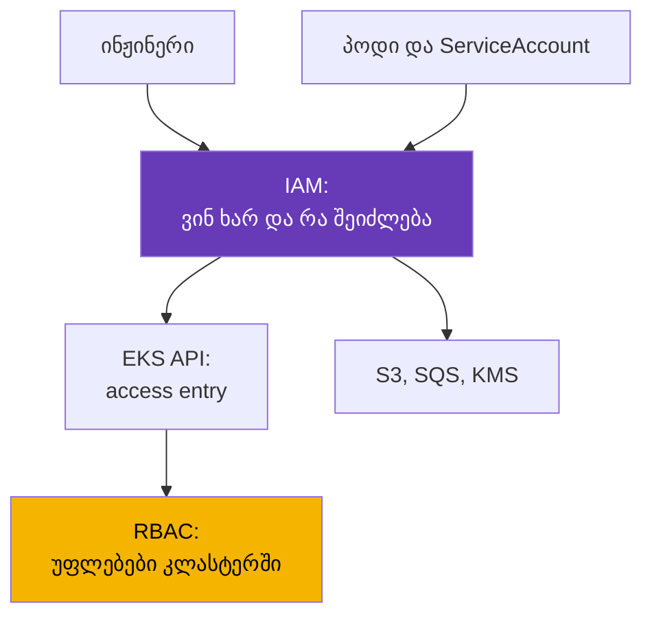
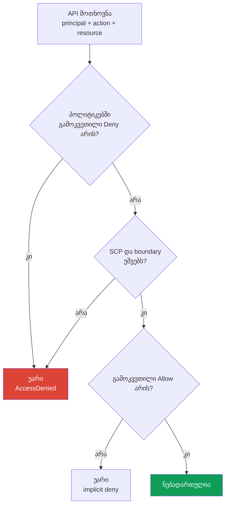
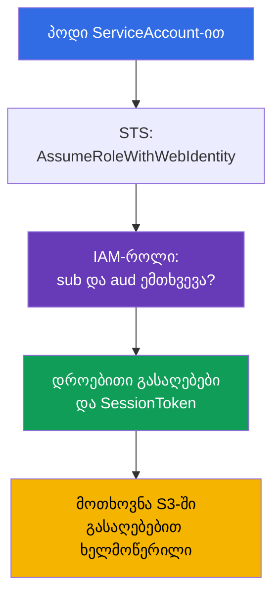

[Русская версия](ru.md) · [Eng version](en.md) · [Versión en español](es.md) · [Version française](fr.md) · [Deutsche Version](de.md) · [繁體中文版](tw.md) · [日本語版](jp.md)
# თავი 0.2. IAM ნულიდან: პოლიტიკები, როლები, ნდობა, STS და დროებითი გასაღებები

> **რა არის შემდეგ.** 0.1 თავში ანგარიში გაჩნდა, როგორც უფლებებისა და ანგარიშსწორების საზღვარი, მაგრამ კითხვა „ვინ ვარ ახლა“ პასუხგაუცემელი დარჩა. მასზე პასუხობს IAM - მექანიზმი, რომელიც EKS-ში ერთდროულად ორ ამოცანას წყვეტს: ვის შეუძლია კლასტერის გამოყენება (თავი 5) და რა არის ნებადართული პოდისთვის, როცა ის S3, SQS ან Secrets Manager-ს მიმართავს (თავები 16-17). აქ მხოლოდ ოპერირებისთვის აუცილებელი მინიმუმია: პოლიტიკები, როლები, ნდობა, დროებითი გასაღებები და უარების გამართვა. შემდეგ ამაზე დაეფუძნება VPC (თავი 0.3).

## 0.2.1. რატომ უნდა იცოდეს Kubernetes ინჟინერმა IAM

kubeadm-კლასტერში ავტორიზაცია RBAC-ით სრულდებოდა. EKS-ში RBAC-ის წინ მეორე კონტურია - IAM, რომელიც RBAC-ს არ ცვლის, არამედ მასზე ადრე მუშაობს: `kubectl get pods`-ის შესრულებისას მოთხოვნას თქვენი IAM-identity-ით აწერთ ხელს, EKS ამოწმებს, აქვს თუ არა ამ identity-ს საერთოდ კლასტერის გამოყენების უფლება, და მხოლოდ შემდეგ ამოწმებს Kubernetes RBAC-ს. პირველ ნაბიჯზე უარი ასე გამოიყურება: `You must be logged in to the server (Unauthorized)`, ამიტომ მისი RBAC-ში ძებნა უაზროა.

მეორე ნაწილი workload-ების უფლებებია. პოდში არსებულ აპლიკაციას S3 bucket-ის წაკითხვა სურს, მაგრამ S3 ServiceAccount-ს არ იცნობს. ამიტომ პოდს AWS credentials სჭირდება და მათი მიცემის სწორი გზა არის IAM-როლი, რომელიც ServiceAccount-ს IRSA-ით (თავი 16) ან EKS Pod Identity-ით (თავი 17) უკავშირდება. ServiceAccount პასუხობს პოდის identity-ზე კლასტერში, IAM-როლი კი იმავე პოდის identity-ზე AWS-ში.



## 0.2.2. ერთეულები: მომხმარებლები, ჯგუფები, როლები, პოლიტიკები

IAM შედგება **principal-ებისგან** (ვინ მოქმედებს) და **პოლიტიკებისგან** (რა არის ნებადართული). Principal სამი სახისაა, თუმცა თანამედროვე პრაქტიკაში ძირითადად ერთს იყენებენ.

| ერთეული | რა არის | ანალოგი Kubernetes-ში | პრაქტიკა |
|----------|---------|-----------------------|----------|
| **IAM user** | ხანგრძლივი identity პაროლითა და გასაღებებით | სტატიკური სერტიფიკატი | თავიდან არიდება |
| **IAM group** | მომხმარებლების ნაკრები საერთო პოლიტიკებისთვის | Group RBAC-ში | user-თან ერთად |
| **IAM role** | identity საკუთარი გასაღებების გარეშე, რომელსაც იღებენ | ServiceAccount | ძირითადი გზა |

**IAM user**-ს აქვს კონსოლის პაროლი და გასაღებების წყვილი `AccessKeyId` + `SecretAccessKey`, რომლებიც ვადას არ კარგავს. სწორედ ამიტომ მიდიან მომხმარებლებისგან: მუდმივი გასაღები ადრე თუ გვიან ხვდება git-ში, CI ცვლადში ან ჩატში, გაუქმება მხოლოდ ხელით შეიძლება, გაჟონვის შემჩნევა კი თითქმის შეუძლებელია. ადამიანებს დღეს წვდომას **IAM Identity Center**-ით (ყოფილი AWS SSO) ან გარე identity provider-ით აძლევენ, მანქანებს კი - როლებით.

**IAM role** კურსის საკვანძო ობიექტია. როლს არ აქვს პაროლი და მუდმივი გასაღებები: მას **იღებენ** (assume), რითაც 15 წუთიდან რამდენიმე საათამდე ვადით დროებით credentials იღებენ. როლი შეიძლება მიიღოს ადამიანმა, EC2 instance-მა, Lambda-მ, EKS პოდმა ან სხვა ანგარიშის principal-მა. პოლიტიკები კი იმით იყოფა, თუ რას არის მიმაგრებული:

- **identity-based** - მიმაგრებულია მომხმარებელზე, ჯგუფზე ან როლზე: „ამ principal-ს ეს და ეს შეუძლია“. მათი უმეტესობა ასეთია.
- **resource-based** - მიმაგრებულია უშუალოდ რესურსზე (S3-ის bucket policy, KMS-ის key policy, ECR repository-ის პოლიტიკა): „ამ principal-ებს ჩემთან მიმართვა შეუძლიათ“. მხოლოდ მათ შეუძლიათ სხვა ანგარიშიდან წვდომის დაშვება შუამავალი როლის გარეშე.

დეტალი 18 თავისთვის: KMS-ში **key policy სავალდებულოა**, და თუ მასში თქვენი როლი არ არის, მხოლოდ `kms:Decrypt`-იანი identity-based პოლიტიკა საკმარისი არ იქნება.

## 0.2.3. პოლიტიკის ანატომია და გადაწყვეტილების ლოგიკა

IAM პოლიტიკა JSON-დოკუმენტია და ველები ყველა AWS პოლიტიკაში ერთნაირია.

```json
{
  "Version": "2012-10-17",
  "Statement": [{
    "Sid": "ReadAppBucket",
    "Effect": "Allow",
    "Action": ["s3:GetObject", "s3:ListBucket"],
    "Resource": ["arn:aws:s3:::my-app-bucket", "arn:aws:s3:::my-app-bucket/*"],
    "Condition": {"StringEquals": {"aws:PrincipalTag/Team": "platform"}}
  }]
}
```

- `Version` - პოლიტიკების ენის ვერსიაა, ყოველთვის `2012-10-17`. ეს თქვენი დოკუმენტის თარიღი არ არის.
- `Statement` - წესების სიაა, თითოეული დამოუკიდებლად განიხილება.
- `Effect` - `Allow` ან `Deny`. `Action` - API მოქმედებები ფორმით `სერვისი:ოპერაცია`.
- `Resource` - რესურსების ARN; ზოგი მოქმედება რესურსს არ ეხება და `"*"`-ს მოითხოვს.
- `Condition` - პირობებია: ტეგები, IP, MFA, დრო, მოთხოვნიდან მიღებული მნიშვნელობები.

Wildcard მუშაობს როგორც `Action`, ისე `Resource`-ში: `s3:Get*` ყველა წაკითხვის მოქმედებას ნიშნავს. აქედან ორი ფაქტი გამომდინარეობს. bucket-ს **ორი ARN** სჭირდება - თავად bucket `s3:ListBucket`-ისთვის და `bucket/*` ობიექტებზე მოქმედებებისთვის. მეორე: `Action` და `Resource` ვარსკვლავით ადმინისტრაციული უფლებებია და production-ში არც ადამიანს აძლევენ, არც პოდს.

ტეგებზე დაფუძნებული პირობები უფლებების განაწილების მეორე გზას იძლევა და აქ ორ მოდელს განასხვავებენ. **RBAC IAM-ში** ჩვეულებრივი მიდგომაა: ყოველ როლზე კონკრეტული `Action` და `Resource`-ის მქონე პოლიტიკა იწერება. **ABAC (Attribute-Based Access Control)** რესურსების ჩამოთვლის ნაცვლად ტეგებს ადარებს: ერთი პოლიტიკა `aws:PrincipalTag/Team` პირობით იმავე `Team` ტეგის მქონე რესურსებთან წვდომას ხსნის და ახალ გუნდს ცალკე პოლიტიკა აღარ სჭირდება - საკმარისია ტეგის დაყენება. ზემოთ `Team=platform` სწორედ ABAC-ია: უფლება principal-ის ატრიბუტზეა დამოკიდებული და არა მის სახელზე.



სამი წესი ზეპირად: **ნაგულისხმევად ყველაფერი აკრძალულია** (implicit deny); **გამოკვეთილი `Deny` ნებისმიერ `Allow`-ზე ძლიერია** და სხვა `Allow`-ით მისი გაუქმება არ შეიძლება; უფლებები ყველა პოლიტიკიდან ჯამდება, ამიტომ ერთი `Allow` საკმარისია, თუ `Deny` არ არის და მოთხოვნა შემზღუდველებს გადის.

## 0.2.4. Managed და inline პოლიტიკები, boundary, SCP

ერთი და იგივე დოკუმენტი სხვადასხვაგვარად შეიძლება მიამაგროთ, რაც მართვადობაზე მოქმედებს.

| ტიპი | სად ცხოვრობს | ხელახალი გამოყენება | როდის გამოიყენება |
|-----|-----------|-------------------|-----------------|
| **AWS managed** | AWS-ში, ვერსიებს AWS ანახლებს | გლობალურად | EKS ნოდების როლები, სწრაფი დასაწყისი |
| **Customer managed** | თქვენს ანგარიშში, თქვენი ვერსიები | კი, ბევრ როლზე | ძირითადი ვარიანტი |
| **Inline** | ერთი როლის შიგნით, მასთან ერთად ცხოვრობს | არა | როლისთვის წერტილოვანი წესი |

AWS managed პოლიტიკები მოსახერხებელია, მაგრამ ხშირად საჭიროზე ფართოა: `AmazonEKSWorkerNodePolicy` შეგიძლიათ უცვლელად მიამაგროთ, `AmazonS3FullAccess` კი production-ში არ უნდა გასცეთ. Customer managed პოლიტიკა ვერსიონირდება, Terraform-ში ჩანს და ბრუნდება, inline პოლიტიკა კი როლთან ერთად იშლება. ზემოთ ორი მექანიზმია, რომლებიც უფლებებს არ გასცემენ, მხოლოდ ამცირებენ:

- **Permissions boundary** - პოლიტიკა-ჭერი როლზე ან მომხმარებელზე, საბოლოო უფლებები ჩვეულებრივი პოლიტიკებისა და boundary-ის კვეთაა. ტიპური შემთხვევა: გუნდი საკუთარი სერვისებისთვის როლებს ქმნის, მაგრამ მათ არ შეუძლია boundary-ზე მეტი უფლების მიცემა. სამუშაო ნორმაა, რომ developer-ებისა და CI/CD pipeline-ების მიერ შექმნილ ყველა როლზე boundary სავალდებულოა. სხვა შემთხვევაში `iam:CreateRole`-ის მქონე pipeline-ს ფაქტობრივად administrator-როლის შექმნა და საკუთარი უფლებების გაზრდა შეუძლია, boundary კი ასეთ ესკალაციას გამორიცხავს.
- **SCP (Service Control Policy)** AWS Organizations-იდან - ანგარიშის ან OU-ის ჭერი. SCP არაფერს არ რთავს, მხოლოდ კრძალავს: ხურავს ზედმეტ რეგიონებს, არ იძლევა CloudTrail-ისა და GuardDuty-ის გამორთვის (თავი 21) ან KMS გასაღებების წაშლის უფლებას. SCP-ის წინააღმდეგ ანგარიშის administrator-იც უძლურია, რაც ფორმალურად სწორი როლის პოლიტიკისას გაუგებარ `AccessDenied`-ს ჰგავს.

## 0.2.5. როლი და trust policy: ორი განსხვავებული დოკუმენტი

როლს ყოველთვის **ორი** წესების ნაკრები აქვს და IAM-ში ყველაზე ხშირად სწორედ მათ ურევენ:

- **permissions policy** (identity-based) - **რისი** გაკეთება შეუძლია როლს AWS-ში.
- **trust policy** (იგივე assume role policy) - **ვის** შეუძლია ამ როლის მიღება.

ანალოგია გვეხმარება: permissions policy არის Role, trust policy კი RoleBinding, მხოლოდ სუბიექტი კლასტერში სახელით კი არა, AWS principal-ით ან გარე identity provider-ითაა აღწერილი.

```json
{
  "Version": "2012-10-17",
  "Statement": [{
    "Effect": "Allow",
    "Principal": {"Service": "ec2.amazonaws.com"},
    "Action": "sts:AssumeRole"
  }]
}
```

ასეთი trust policy EC2 სერვისს უფლებას აძლევს instance-ის სახელით მიიღოს როლი: EKS ნოდი სწორედ ასე იღებს უფლებებს. Principal შეიძლება განსხვავებული იყოს: AWS სერვისისთვის `"Service"`, ანგარიშებს შორის წვდომისთვის როლის ან ანგარიშის ARN-ით `"AWS"`, გარე provider-ისთვის კი `"Federated"`. როლის მისაღებად მოქმედებებიც რამდენიმეა:

- `sts:AssumeRole` - ჩვეულებრივი ვარიანტი: AWS principal იღებს როლს.
- `sts:AssumeRoleWithWebIdentity` - როლი OIDC token-ით მიიღება. ამაზეა აგებული IRSA (თავი 16): EKS კლასტერს საკუთარი OIDC provider ჰყავს, kubelet პოდს ServiceAccount-ის projected token-ს უმონტაჟებს, SDK კი მას STS-ში დროებით გასაღებებზე ცვლის.
- `sts:AssumeRoleWithSAML` - ფედერაცია კორპორაციული კატალოგიდან, ჩვეულებრივ ადამიანებისთვის.

პირობები trust policy-შიც მუშაობს - ეს როლის მიღებისას ABAC-ია. ასეთი დოკუმენტი როლის მიღებას მხოლოდ `Team=platform` ტეგის მქონე principal-ებს აძლევს და მათი ARN-ების სათითაოდ დამატება საჭირო არ არის:

```json
{
  "Version": "2012-10-17",
  "Statement": [{
    "Effect": "Allow",
    "Principal": {"AWS": "arn:aws:iam::123456789012:root"},
    "Action": "sts:AssumeRole",
    "Condition": {"StringEquals": {"aws:PrincipalTag/Team": "platform"}}
  }]
}
```



IRSA-ის ტიპური შეცდომა permissions policy-ში კი არა, trust policy-შია: პირობაზე არასწორი namespace ან ServiceAccount სახელია მითითებული და STS უარს ამბობს ჯერ კიდევ `s3:GetObject`-მდე.

## 0.2.6. STS და დროებითი გასაღებები: credentials-ის ჯაჭვი

**AWS STS (Security Token Service)** დროებით credentials გასცემს. ნაკრები ყოველთვის სამნაწილიანია და მესამე მას IAM მომხმარებლის გასაღებებისგან განასხვავებს: `AccessKeyId` (დროებითი იწყება `ASIA`-თი, მუდმივი `AKIA`-თი), `SecretAccessKey` და `SessionToken` - სესიის სავალდებულო token, რომლის გარეშეც მოთხოვნა ვერ გავა. სიცოცხლის დრო მიღებისას განისაზღვრება: `AssumeRole`-ისთვის 15 წუთიდან 12 საათამდე, მაგრამ როლის `MaxSessionDuration`-ზე მეტი არაა (ნაგულისხმევად 1 საათი). SDK ამ გასაღებებს თავად ანახლებს, ამიტომ პოდში როტაცია საჭირო არ არის.

საიდან იღებენ aws cli და SDK credentials-ს, თუ პირდაპირ არაფერი მიუთითეთ? არსებობს **provider-ების ჯაჭვი**, რომელიც პირველ წარმატებამდე თანმიმდევრობით მოწმდება: გარემოს ცვლადები (`AWS_ACCESS_KEY_ID`, `AWS_SESSION_TOKEN`), პროფილი `~/.aws/config`-დან და `~/.aws/credentials`-დან, web identity (`AWS_WEB_IDENTITY_TOKEN_FILE`, ეს IRSA-ა), EKS Pod Identity ნოდზე არსებული agent-ით (თავი 17), ბოლოს კი IMDS instance-ის როლით. რიგი ორ ჩვეულებრივ გამოცანას ხსნის. პირველი: სწორი IRSA-როლის მქონე პოდი ნოდის როლით მუშაობს, რადგან image-ში ან Deployment-ში `AWS_ACCESS_KEY_ID` ცვლადები დარჩა და ყველაფერი გადაფარა. მეორე: ბრძანება ლოკალურად მუშაობს, CI-ში კი არა - პროფილები განსხვავებულია.

პროფილები `~/.aws/config`-შია აღწერილი და ადამიანებისთვის სამუშაო ნორმაა IAM Identity Center:

```ini
[profile prod]
sso_session = company
sso_account_id = 123456789012
sso_role_name = PlatformEngineer
region = eu-central-1
```

```bash
# IAM Identity Center-ით შესვლა: დროებითი გასაღებები cache-შია და ვადის გასვლისას ახლდება
aws sso login --profile prod
# შეამოწმეთ, ვინად აღგიქვამთ AWS ახლა
aws sts get-caller-identity --profile prod
# მიიღეთ როლი ხელით, თუ საათით გასაღებების აშკარა ნაკრები გჭირდებათ
aws sts assume-role --role-arn arn:aws:iam::123456789012:role/PlatformAdmin \
  --role-session-name debug-session --duration-seconds 3600
```

`~/.aws/credentials`-ში გასაღებებიც მხარდაჭერილია, მაგრამ ეს სწორედ ის ხანგრძლივი secrets-ია დისკზე. კურსში ისინი არსად არ გვჭირდება.

## 0.2.7. IAM EKS-ის კონტექსტში: სად რა დაგჭირდებათ

EKS კლასტერს IAM ობიექტების საკუთარი ნაკრები აქვს და თითქმის თითოეული შეიძლება ინციდენტის მიზეზი გახდეს.

| ობიექტი | ვის ეკუთვნის | რისთვის არის საჭირო |
|--------|------------------|-------------|
| **Cluster role** | EKS control plane | AWS რესურსების მართვა კლასტერის სახელით |
| **Node role** | ნოდის EC2 instance | კლასტერისთვის შეერთება, ENI, image-ები ECR-დან |
| **Access entry** | თქვენი IAM-identity | ადამიანის ან CI-ის წვდომა კლასტერის API-ზე (თავი 5) |
| **IRSA / Pod Identity** | პოდის ServiceAccount | workload-ის უფლებები AWS-ში (თავები 16-17) |

**კლასტერის როლი** ერთხელ იქმნება, ჩვეულებრივ `AmazonEKSClusterPolicy`-ს შეიცავს და შექმნის შემდეგ მას არ ეხებიან. **ნოდის როლი** სავალდებულოა: სწორი პოლიტიკების ნაკრების გარეშე ნოდი `kubectl get nodes`-ში უბრალოდ არ გამოჩნდება. საჭიროა `AmazonEKSWorkerNodePolicy` კლასტერში რეგისტრაციისთვის, `AmazonEC2ContainerRegistryReadOnly` (ან `...PullOnly`) ECR image-ებისთვის და `AmazonEKS_CNI_Policy`, თუ VPC CNI ნოდის როლით მუშაობს და არა საკუთარი IRSA-როლით. ნოდებზე Session Manager-ით SSH-ისა და bastion-ის გარეშე შესასვლელად ცალკე ამატებენ `AmazonSSMManagedInstanceCore`-ს. დიაგნოსტიკას „ნოდი არ შეერთებულა“ 45 თავში განვიხილავთ.

**ადამიანების წვდომა** ადრე ConfigMap `aws-auth`-ში ცხოვრობდა: ხელით შეცვლა, ვალიდაცია არ ჰქონდა და ერთი ბეჭდვითი შეცდომით კლასტერის წვდომის დაკარგვის რეალური შანსი არსებობდა. ახლა ეს **access entries**-ია - EKS API დონის ობიექტები, რომლებიც ARN identity-ს კლასტერში უფლებებს უკავშირებს (თავი 5). **პოდების უფლებებს** IRSA-ით (OIDC, ყველგან მუშაობს) ან EKS Pod Identity-ით (agent ნოდზე, კონფიგურაციაში უფრო მარტივი, კლასტერისთვის OIDC provider-ის გარეშე) აძლევენ; არჩევანსა და მიგრაციას 16 და 17 თავები განიხილავს.

ცალკე **IMDS (Instance Metadata Service)**-ზე: ეს ლოკალური მისამართია `169.254.169.254`, საიდანაც instance მეტამონაცემებსა და ნოდის როლის გასაღებებს იღებს. ეს მისამართი პოდიდანაც ხელმისაწვდომია: თუ არაფერი დააკონფიგურეთ, ნებისმიერ container-ს ჩვეულებრივი HTTP მოთხოვნით ნოდის როლის credentials-ის მიღება შეუძლია, ანუ წვდომა ECR-ზე, ENI-ზე და ყველაფერზე, რაც მას დაამატეთ. აქედან hardening-ის სტანდარტი: IMDSv2 სავალდებულოა, hop limit ისეთია, რომ container-იდან მოთხოვნა ვერ მივიდეს, workload-ები კი უფლებებს მხოლოდ IRSA-ით ან Pod Identity-ით იღებენ. ეს 19 თავის საფუძველია.

## 0.2.8. უფლებების გამართვა: რას ვუყუროთ AccessDenied-ისას

უარის შეტყობინება იმაზე ინფორმაციულია, ვიდრე ჩანს, და ჩვეულებრივ ყველაფერს საჭიროს ასახელებს:

```text
User: arn:aws:sts::123456789012:assumed-role/app-role/1699... is not authorized
to perform: s3:GetObject on resource: arn:aws:s3:::my-app-bucket/data.csv
because no identity-based policy allows the s3:GetObject action
```

წაიკითხეთ ოთხი წერტილით: ვინ (`assumed-role/app-role`, ანუ როლი მიღებულია და IRSA ამუშავდა), რა (`s3:GetObject`), რაზე (ობიექტის სრული ARN) და რატომ. მიზეზის ბოლო ნაწილი ყველაზე ღირებულია: `no identity-based policy allows` implicit deny-ს ნიშნავს და უფლების დამატებაა საჭირო, `with an explicit deny in a service control policy` კი SCP-ს ნიშნავს, ამიტომ როლის პოლიტიკის გასწორება უაზროა.

```bash
# ნებისმიერი გამართვის საწყისი წერტილი: ვინად გხედავთ AWS ახლა
aws sts get-caller-identity
# რა არის როლზე მიმაგრებული და ვის შეუძლია მისი მიღება
aws iam list-attached-role-policies --role-name app-role
aws iam list-role-policies --role-name app-role
aws iam get-role --role-name app-role --query 'Role.AssumeRolePolicyDocument'
# შეამოწმეთ გადაწყვეტილება რეალური API გამოძახების გარეშე
aws iam simulate-principal-policy \
  --policy-source-arn arn:aws:iam::123456789012:role/app-role \
  --action-names s3:GetObject --resource-arns arn:aws:s3:::my-app-bucket/data.csv
```

`simulate-principal-policy` (კონსოლში - IAM Policy Simulator) პასუხობს კითხვას „ნებადართულია თუ არა“, მოქმედებას არ ასრულებს, მაგრამ რეალური მოთხოვნის მნიშვნელობების პირობებს სრულად არ იმეორებს. საბოლოო სიტყვა **CloudTrail**-ს აქვს: მასში ჩანს ფაქტობრივი გამოძახება, principal, პარამეტრები და შეცდომის კოდი. პოდის შიგნით გამართვა `AWS_ROLE_ARN` და `AWS_WEB_IDENTITY_TOKEN_FILE` ცვლადებით იწყება: თუ ისინი არ არის, IRSA არ შეერთებულა (თავები 21 და 47).

## 0.2.9. როგორ იყენებენ ამას production-ში

- **ადამიანები გასაღებების გარეშე.** წვდომა IAM Identity Center-ით ან ფედერაციით არის, MFA სავალდებულოა, IAM მომხმარებლები ხანგრძლივი გასაღებებით არ იქმნება. Root არ გამოიყენება (თავი 0.1).
- **როლი workload-ზე და არა კლასტერზე.** თითოეულ აპლიკაციას საკუთარი როლი აქვს მოქმედებების მინიმალური ნაკრებითა და კონკრეტული ARN-ებით. საერთო „როლი ყველა პოდისთვის“ შეუმჩნევლად აძლევს მთელ კლასტერს ყველა მონაცემზე წვდომას.
- **ზედა შემზღუდველები.** SCP სახიფათო მოქმედებებსა და ზედმეტ რეგიონებს კეტავს, permissions boundary კი გუნდებს როლების დამოუკიდებლად შექმნის საშუალებას აძლევს საკუთარი უფლებების გაზრდის გარეშე.
- **გარე წვდომა კონტროლქვეშ.** IAM Access Analyzer მუდმივად აანალიზებს resource-based პოლიტიკებსა და trust policy-ს და პოულობს ანგარიშის ან Organization-ის გარეთ არსებულ ერთეულებს, რომლებსაც წვდომა აქვთ (external access): სხვა ანგარიში როლის trust policy-ში, საჯარო S3 bucket, KMS გასაღები. აღმოჩენებს არჩევენ და ზედმეტ წვდომას აუქმებენ.
- **IAM როგორც კოდი.** როლები და პოლიტიკები Terraform-შია აღწერილი, პოლიტიკის review კი code review-ის ნაწილია. კონსოლში ხელით ცვლილებები არ მეორდება და შემდეგ `apply`-ზე იკარგება.
- **აუდიტი და ალარმები.** CloudTrail ჩართულია ყველა ანგარიშში, არსებობს ალარმები root-ის გამოყენებაზე, მომხმარებლებისა და გასაღებების შექმნაზე, პოლიტიკების ცვლილებებზე (თავი 21).

## 0.2.10. მინი-გლოსარიუმი

- **Principal** - ის, ვინც მოთხოვნას ასრულებს: მომხმარებელი, როლი, AWS სერვისი.
- **IAM user / group** - ხანგრძლივი identity და ასეთი identity-ების ნაკრები; production-ში მათ ერიდებიან.
- **IAM role** - მუდმივი გასაღებების გარეშე identity, რომელსაც დროებით იღებენ.
- **Policy** - JSON `Version`, `Statement`, `Effect`, `Action`, `Resource`, `Condition`-ით; შეიძლება იყოს **identity-based** (principal-ზე) და **resource-based** (თავად რესურსზე).
- **ABAC / RBAC** - ტეგებზე დაფუძნებული წვდომა `aws:PrincipalTag`-ით როლებსა და კონკრეტული მოქმედებებისა და რესურსების პოლიტიკებზე დაფუძნებული წვდომის წინააღმდეგ.
- **IAM Access Analyzer** - პოულობს გარე სანდო ერთეულებს (external access) resource-based პოლიტიკებსა და trust policy-ში.
- **Managed / inline policy** - ხელახლა გამოსაყენებელი, ვერსიონირებადი პოლიტიკა / როლში ჩაშენებული პოლიტიკა.
- **Permissions boundary** - როლის ან მომხმარებლის უფლებების ჭერი, უფლებებს არ გასცემს.
- **SCP** - Organizations დონის პოლიტიკა, მხოლოდ კრძალავს და მთელ ანგარიშზე მოქმედებს.
- **Trust policy** - როლის დოკუმენტი, რომელიც აღწერს, ვის შეუძლია მისი მიღება.
- **STS** - დროებითი გასაღებების სერვისი; `sts:AssumeRole`, `sts:AssumeRoleWithWebIdentity`.
- **IRSA / Pod Identity** - პოდისთვის IAM-როლის მიცემის ორი გზა (თავები 16-17).
- **IMDS** - instance მეტამონაცემების სერვისი `169.254.169.254`-ზე, რომელიც ნოდის როლის გასაღებებს გასცემს.

## 0.2.11. თავის შეჯამება

- IAM RBAC-მდე მუშაობს: ჯერ AWS ამოწმებს identity-სა და კლასტერის უფლებას, შემდეგ Kubernetes ამოწმებს კლასტერის შიგნით უფლებებს.
- მთავარი principal როლია და არა მომხმარებელი: მუდმივი გასაღებები არ აქვს, STS-ით მიიღება და `SessionToken`-იან დროებით credentials-ს იძლევა.
- როლს ორი დოკუმენტი აქვს: permissions policy (რა შეიძლება) და trust policy (ვის შეუძლია მიღება). IRSA შეცდომები უმეტესად trust policy-შია.
- გადაწყვეტილება ასე ითვლება: ნაგულისხმევად აკრძალულია, გამოკვეთილი `Deny` ნებისმიერ `Allow`-ზე ძლიერია, SCP და permissions boundary კი საბოლოო უფლებებს მხოლოდ ამცირებს.
- ნოდის როლი სავალდებულოა და უნდა შეიცავდეს კლასტერში რეგისტრაციისა და ECR-ზე წვდომის პოლიტიკებს; ადამიანების წვდომა access entries-ით აღწერება (თავი 5), პოდების უფლებები კი IRSA-ით ან Pod Identity-ით (თავები 16-17), და არა ნოდის როლითა და IMDS-ით (თავი 19).
- გამართვა ამ ჯაჭვით მიდის: `AccessDenied` ტექსტი, `aws sts get-caller-identity`, როლის პოლიტიკები და trust policy, simulator, CloudTrail როგორც სიმართლის წყარო (თავი 21).

## 0.2.12. როგორ გამოგადგებათ ეს რეალურ სამუშაოში

ტიკეტების დიდი ნაწილი „EKS-ში რაღაც არ მუშაობს“ IAM-ია: ინჟინერი კლასტერამდე ვერ მიდის, CI Deployment-ს ვერ აახლებს, პოდი bucket-ს ვერ კითხულობს, ნოდი არ რეგისტრირდება, controller load balancer-ს ვერ ქმნის. გზა ყველგან ერთია: გაიგოთ, რომელი identity-ით მიდის გამოძახება, რა პოლიტიკები აქვს, რას ამბობს trust policy და რა ჩანს CloudTrail-ში. სამუშაოს მეორე ნახევარი დაპროექტებაა: როლი თითო აპლიკაციაზე, მინიმალური უფლებები, არანაირი ხანგრძლივი გასაღებები, ზედა შემზღუდველები და მთელი კონსტრუქცია Terraform-ში, არა კონსოლში.

## 0.2.13. კითხვები თვითშემოწმებისთვის

1. რატომ არ ცვლის IAM RBAC-ს და რა თანმიმდევრობით მოწმდება ისინი `kubectl get pods`-ისას?
2. რით განსხვავდება IAM-როლი IAM მომხმარებლისგან და რატომ ერიდებიან გასაღებიანი მომხმარებლების გამოყენებას?
3. როგორ ითვლის AWS გადაწყვეტილებას, თუ ერთი პოლიტიკა მოქმედებას უშვებს, მეორე კი კრძალავს?
4. რით განსხვავდება permissions boundary ჩვეულებრივი პოლიტიკისა და SCP-ისგან და რატომ არის ის სავალდებულო CI/CD-ის როლებისთვის?
5. რომელი ორი დოკუმენტი აქვს როლს და რაზეა პასუხისმგებელი თითოეული?
6. რომელი STS მოქმედება უდევს საფუძვლად IRSA-ს და რას წარადგენს პოდი გასაღებების სანაცვლოდ?
7. რა თანმიმდევრობით ეძებს SDK credentials-ს და რატომ აფუჭებს გარემოს ცვლადები IRSA-ს?
8. რატომ არის პოდისთვის `169.254.169.254`-ზე წვდომა საშიში?
9. მიიღეთ `AccessDenied` service control policy-ის ხსენებით. რა უნდა გაასწოროთ?
10. რით განსხვავდება ABAC IAM-ში RBAC-ისგან და რომელ პირობას ეფუძნება?
11. რისთვის არის საჭირო IAM Access Analyzer და რას უწოდებს ის external access-ს?

## პრაქტიკა

0 ნაწილს საკუთარი ლაბები არ აქვს: ეს დანარჩენი თავების საფუძველია. IAM-ს 1 ნაწილის თითქმის ყველა ლაბაში გამოიყენებთ, კლასტერის შექმნითა და მასზე წვდომით დაწყებული. შემდეგ მოდის თავი VPC-ზე: ქვექსელები, მარშრუტიზაცია, NAT და security groups, ანუ ქსელი, რომელშიც კლასტერი იცხოვრებს.

---
[სარჩევი](../README_GE.md) · [თავი 0.1](../00-1-aws/ge.md) · [თავი 0.3](../00-3-vpc/ge.md)
