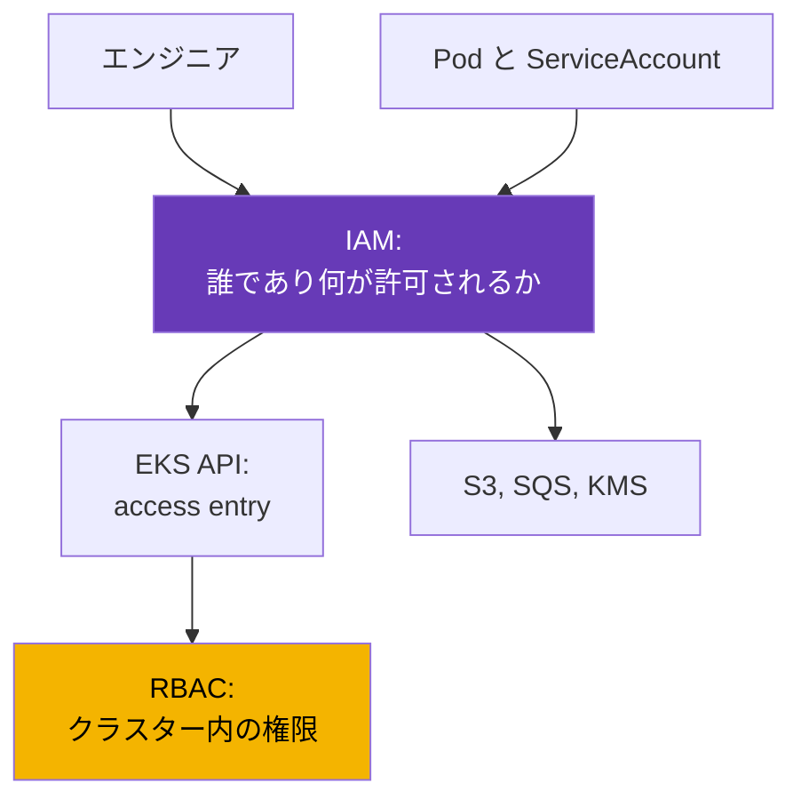
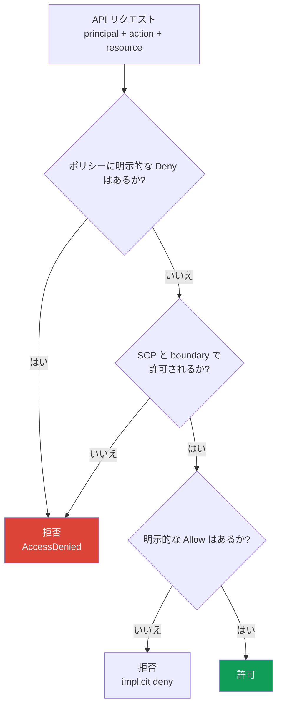
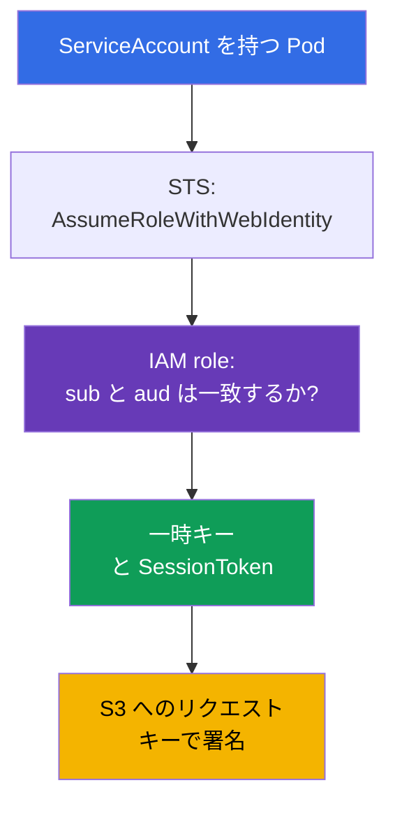

[Русская версия](ru.md) · [Eng version](en.md) · [Versión en español](es.md) · [Version française](fr.md) · [Deutsche Version](de.md) · [ქართული ვერსია](ge.md) · [繁體中文版](tw.md)
# 第0.2章 IAM をゼロから学ぶ: ポリシー、ロール、信頼、STS、一時キー

> **この先の内容。** 第0.1章では、権限と請求の境界としてアカウントを扱いましたが、「今の自分は誰か」という問いは残りました。IAM がその答えです。EKS では、誰がクラスターへアクセスできるか（第5章）と、Pod が S3、SQS、Secrets Manager へアクセスするときに何が許されるか（第16-17章）という二つの問題を同時に解決します。ここでは運用に必要な最小限、すなわちポリシー、ロール、信頼、一時キー、拒否のデバッグだけを扱います。この基礎の上に、次は VPC（第0.3章）を積み上げます。

## 0.2.1. Kubernetes エンジニアが IAM を知るべき理由

kubeadm クラスターでは認可は RBAC で終わります。EKS では RBAC の前に IAM という第2の層があります。IAM は RBAC を置き換えるのではなく、その前に動作します。`kubectl get pods` を実行すると、IAM identity でリクエストに署名し、EKS はまずその identity にクラスターへアクセスする権利があるかを確認し、その後に Kubernetes が RBAC を確認します。最初の段階での拒否は `You must be logged in to the server (Unauthorized)` と表示され、RBAC 内を探しても意味がありません。

もう一方はワークロードの権限です。Pod 内のアプリケーションが S3 bucket を読みたくても、S3 は ServiceAccount を知りません。したがって Pod には AWS credentials が必要であり、正しい付与方法は、IRSA（第16章）または EKS Pod Identity（第17章）を通じて IAM role を ServiceAccount に関連付けることです。ServiceAccount はクラスター内における Pod の identity を、IAM role は AWS 内における同じ Pod の identity を担います。



## 0.2.2. エンティティ: ユーザー、グループ、ロール、ポリシー

IAM は**principal**（誰が操作するか）と**policy**（何が許可されるか）で構成されます。Principal には三つの種類がありますが、現代の実務で主に使うのは一つです。

| エンティティ | 内容 | Kubernetes での類比 | 実務 |
|----------|------|---------------------|------|
| **IAM user** | パスワードとキーを持つ長期的な identity | 静的な証明書 | 避ける |
| **IAM group** | 共通ポリシー用のユーザー集合 | RBAC の Group | user とともに使う |
| **IAM role** | 自身のキーを持たず、assume される identity | ServiceAccount | 主な方法 |

**IAM user** にはコンソール用パスワードと、期限切れにならない `AccessKeyId` + `SecretAccessKey` の組があります。これこそ user から離れる理由です。恒久的なキーは遅かれ早かれ git、CI の変数、またはチャットに入り、失効には手作業が必要で、漏えいはほとんど検知できません。人には **IAM Identity Center**（旧 AWS SSO）または外部 identity provider 経由でアクセスを与え、マシンには role を使います。

**IAM role** はこのコースの中心的なオブジェクトです。Role にはパスワードも永続キーもありません。これを **assume** すると、15分から数時間有効な一時的 credentials が得られます。人、EC2 instance、Lambda、EKS の Pod、別アカウントの principal が role を assume できます。Policy は付与先によって次のように分かれます。

- **identity-based** - user、group、role にアタッチされます。「この principal はこれらの操作を許可される」という意味です。大半の policy がこの種別です。
- **resource-based** - リソース自体にアタッチされます。たとえば S3 bucket policy、KMS key policy、ECR repository policy です。「これらの principals は私へアクセスできる」という意味です。中間 role なしで別アカウントからのアクセスを許可できるのはこの種別だけです。

第18章の重要な点として、KMS **key policy は必須**です。そこに自分の role が含まれていなければ、`kms:Decrypt` を持つ identity-based policy だけでは足りません。

## 0.2.3. ポリシーの構造と決定ロジック

IAM policy は JSON ドキュメントであり、フィールドはすべての AWS policy で共通です。

```json
{
  "Version": "2012-10-17",
  "Statement": [{
    "Sid": "ReadAppBucket",
    "Effect": "Allow",
    "Action": ["s3:GetObject", "s3:ListBucket"],
    "Resource": ["arn:aws:s3:::my-app-bucket", "arn:aws:s3:::my-app-bucket/*"],
    "Condition": {"StringEquals": {"aws:PrincipalTag/Team": "platform"}}
  }]
}
```

- `Version` - policy 言語のバージョンで、常に `2012-10-17` です。あなたのドキュメントの日付ではありません。
- `Statement` - ルールの一覧です。各ルールは独立して評価されます。
- `Effect` - `Allow` または `Deny` です。`Action` は `service:Operation` 形式の API 操作です。
- `Resource` - リソース ARN です。一部の action は特定リソースに対応せず、`"*"` が必要です。
- `Condition` - タグ、IP、MFA、時刻、リクエスト内の値などの条件です。

Wildcard は `Action` と `Resource` の両方で使えます。`s3:Get*` はすべての読み取り action を対象にします。ここから二つの事実が導かれます。第一に、bucket には**二つの ARN**が必要です。`s3:ListBucket` 用の bucket 自体と、object 操作用の `bucket/*` です。第二に、wildcard を持つ `Action` と `Resource` は管理者権限であり、本番では人にも Pod にも付与しません。

タグ条件は、権限を付与する第2の方法です。ここでは二つのモデルを区別します。**IAM の RBAC** は馴染みのある方式で、各 role に具体的な `Action` と `Resource` を持つ policy を書きます。**ABAC (Attribute-Based Access Control)** はリソースを列挙せずタグを比較します。`aws:PrincipalTag/Team` 条件を持つ一つの policy が、同じ `Team` タグを持つリソースへのアクセスを開きます。新しいチームに個別の policy は不要で、タグを付けるだけです。上の例の `Team=platform` は ABAC であり、権限が principal の名前ではなく属性に依存することを示します。



覚えるべき規則は三つです。**デフォルトではすべて拒否**される（implicit deny）。**明示的な `Deny` はどの `Allow` より強く**、別の `Allow` では取り消せない。権限はすべての policy にまたがって合算されるため、`Deny` がなく、リクエストが制限を通過するなら、一つの `Allow` で十分です。

## 0.2.4. Managed と inline の policy、boundary、SCP

同じドキュメントでも異なる方法でアタッチでき、それが管理しやすさに影響します。

| 種別 | 存在場所 | 再利用 | 使用する場面 |
|------|----------|--------|--------------|
| **AWS managed** | AWS が所有し、AWS がバージョンを更新 | グローバル | EKS node role、素早い開始 |
| **Customer managed** | 自分のアカウント、自分のバージョン | はい、多数の role | 主な選択肢 |
| **Inline** | 一つの role の内部で、その role とともに存在 | いいえ | 一つの role 向けの限定ルール |

AWS managed policy は便利ですが、必要以上に広いことがあります。`AmazonEKSWorkerNodePolicy` はそのままアタッチできますが、`AmazonS3FullAccess` を本番で付与すべきではありません。Customer managed policy はバージョン管理され、Terraform から見え、元に戻せます。Inline policy は role とともに削除されます。その上には権限を与えず、制限するだけの二つの仕組みがあります。

- **Permissions boundary** - role または user に対する権限の上限です。最終的な権限は通常の policies と boundary の共通部分になります。典型例は、チームが自分のサービス用 role を作成しても、boundary が許す以上の権限は与えられないというものです。実務上の標準は、開発者と CI/CD pipeline が作成するすべての role に boundary を必須とすることです。そうしなければ、`iam:CreateRole` を持つ pipeline は実質的に administrator role を作って自己昇格できます。Boundary はこの昇格を不可能にします。
- **SCP (Service Control Policy)** - AWS Organizations によるアカウントまたは OU の上限です。SCP は何も許可せず、拒否だけを行います。不要な region を閉じ、CloudTrail と GuardDuty の無効化（第21章）や KMS key の削除を防ぎます。アカウント administrator でさえ SCP には対抗できず、role policy が形式上正しくても説明しにくい `AccessDenied` として現れます。


## 0.2.5. Role と trust policy: 二つの別ドキュメント

Role には常に**二つ**のルールセットがあり、これを混同することが IAM で最も多い誤りです。

- **permissions policy**（identity-based）- role が AWS で**何をできるか**。
- **trust policy**（assume role policy とも呼ばれる）- **誰が**その role を assume できるか。

類比が役立ちます。permissions policy は Role、trust policy は RoleBinding です。ただし subject はクラスター内の名前ではなく、AWS principal または外部 identity provider で表します。

```json
{
  "Version": "2012-10-17",
  "Statement": [{
    "Effect": "Allow",
    "Principal": {"Service": "ec2.amazonaws.com"},
    "Action": "sts:AssumeRole"
  }]
}
```

この trust policy は、EC2 service が instance のために role を assume することを許可します。これが EKS node が権限を得る方法です。Principal には複数の形があります。AWS service には `"Service"`、cross-account access には role または account ARN を持つ `"AWS"`、外部 provider には `"Federated"` を使います。Role を assume する action にも複数あります。

- `sts:AssumeRole` - 通常の選択肢です。AWS principal が role を assume します。
- `sts:AssumeRoleWithWebIdentity` - OIDC token によって role を assume します。これは IRSA（第16章）の基盤です。EKS cluster には独自の OIDC provider があり、kubelet は projected ServiceAccount token を Pod に mount し、SDK はそれを STS で一時キーと交換します。
- `sts:AssumeRoleWithSAML` - 通常は人向けの、企業ディレクトリからの federation です。

Condition は trust policy でも機能します。これは role の assume 時に行う ABAC です。次のドキュメントでは `Team=platform` のタグを持つ principals だけが role を assume でき、ARN を一つずつ追加する必要がありません。

```json
{
  "Version": "2012-10-17",
  "Statement": [{
    "Effect": "Allow",
    "Principal": {"AWS": "arn:aws:iam::123456789012:root"},
    "Action": "sts:AssumeRole",
    "Condition": {"StringEquals": {"aws:PrincipalTag/Team": "platform"}}
  }]
}
```



典型的な IRSA の誤りは permissions policy ではなく trust policy にあります。Condition に間違った namespace または ServiceAccount 名が指定されており、STS は `s3:GetObject` の呼び出しより前にリクエストを拒否します。

## 0.2.6. STS と一時キー: credentials のチェーン

**AWS STS (Security Token Service)** は一時的 credentials を発行します。組には必ず三つの部分があり、三つ目が IAM user のキーと区別する点です。`AccessKeyId`（一時キーは `ASIA`、恒久キーは `AKIA` で始まる）、`SecretAccessKey`、そして `SessionToken` です。`SessionToken` は必須の session token で、これなしにはリクエストが通りません。有効期限は取得時に設定します。`AssumeRole` では15分から12時間ですが、role の `MaxSessionDuration`（デフォルトでは1時間）を超えられません。SDK はこれらのキーを自動更新するため、Pod 内でローテーションするものはありません。

明示的に渡さなかった場合、aws cli と SDK はどこから credentials を得るのでしょうか。**provider chain** があり、最初に成功するまで順序どおりに確認されます。environment variables（`AWS_ACCESS_KEY_ID`、`AWS_SESSION_TOKEN`）、`~/.aws/config` と `~/.aws/credentials` の profile、web identity（IRSA である `AWS_WEB_IDENTITY_TOKEN_FILE`）、node agent 経由の EKS Pod Identity（第17章）、最後に instance role を持つ IMDS です。この順序は二つのよくある謎を説明します。第一に、正しい IRSA role を持つ Pod が node role で実行されるのは、image または Deployment に `AWS_ACCESS_KEY_ID` の variables が残り、他のすべてを上書きしたからです。第二に、ローカルでは動くコマンドが CI では動かないのは、profile が異なるためです。

Profile は `~/.aws/config` に記述し、人向けの実務上の標準は IAM Identity Center です。

```ini
[profile prod]
sso_session = company
sso_account_id = 123456789012
sso_role_name = PlatformEngineer
region = eu-central-1
```

```bash
# IAM Identity Center でログイン: 一時キーはキャッシュされ、期限切れに更新される
aws sso login --profile prod
# AWS が現在の自分をどう識別しているかを確認する
aws sts get-caller-identity --profile prod
# 明示的な1時間のキーセットが必要なら、手動で role を assume する
aws sts assume-role --role-arn arn:aws:iam::123456789012:role/PlatformAdmin \
  --role-session-name debug-session --duration-seconds 3600
```

`~/.aws/credentials` 内のキーもサポートされますが、これらはディスク上の長期的な secrets です。このコースではどこでも必要ありません。

## 0.2.7. EKS の文脈における IAM: 各要素が必要になる場所

EKS cluster には独自の IAM objects の組があり、そのほとんどすべてが incident の原因になり得ます。

| オブジェクト | 所有者 | 必要な理由 |
|------------|--------|------------|
| **Cluster role** | EKS control plane | cluster を代表して AWS resources を管理する |
| **Node role** | node の EC2 instance | cluster への参加、ENI、ECR からの images |
| **Access entry** | 自分の IAM identity | 人または CI の cluster API へのアクセス（第5章） |
| **IRSA / Pod Identity** | Pod の ServiceAccount | AWS における workload の権限（第16-17章） |

**Cluster role** は一度だけ作成され、通常は `AmazonEKSClusterPolicy` を含み、作成後に触ることはありません。**Node role** は必須です。正しい policies の組がなければ、node は `kubectl get nodes` に現れません。Cluster への登録には `AmazonEKSWorkerNodePolicy`、ECR からの images には `AmazonEC2ContainerRegistryReadOnly`（または `...PullOnly`）、VPC CNI が独自の IRSA role ではなく node role を使う場合は `AmazonEKS_CNI_Policy` が必要です。SSH や bastion なしで Session Manager 経由で nodes に入るには、別途 `AmazonSSMManagedInstanceCore` を追加します。「node が参加しない」診断は第45章で扱います。

**人のアクセス**は以前は `aws-auth` ConfigMap にありました。手作業の編集、検証なし、そして一つの typo で cluster へのアクセスを失う現実的な危険がありました。現在は **access entries**、すなわち identity ARN と cluster 権限を結び付ける EKS API レベルのオブジェクトで扱います（第5章）。**Pod の権限**は IRSA（OIDC、どこでも動く）または EKS Pod Identity（node agent、設定がより簡単で cluster に OIDC provider を必要としない）で付与します。選択と移行は第16章と第17章で扱います。

**IMDS (Instance Metadata Service)** も別途注意が必要です。これは instance が metadata と node role のキーを得るローカルアドレス `169.254.169.254` です。このアドレスには Pod からもアクセスできます。何も設定しなければ、どの container も通常の HTTP request で node role credentials を取得でき、ECR、ENI、さらにその role に追加したすべてへアクセスできます。ここから hardening の標準が導かれます。IMDSv2 を必須とし、hop limit により container からの request が到達しないようにし、workload には IRSA または Pod Identity 経由だけで権限を与えます。これは第19章への準備です。

## 0.2.8. 権限のデバッグ: AccessDenied で確認すること

拒否メッセージは見た目以上に情報量が多く、必要なものを通常はすべて示します。

```text
User: arn:aws:sts::123456789012:assumed-role/app-role/1699... is not authorized
to perform: s3:GetObject on resource: arn:aws:s3:::my-app-bucket/data.csv
because no identity-based policy allows the s3:GetObject action
```

四つの点から読みます。誰か（`assumed-role/app-role` なら role が assume され IRSA が動作したことを示す）、何をするか（`s3:GetObject`）、何に対してか（完全な object ARN）、そしてなぜかです。末尾の理由が最も重要です。`no identity-based policy allows` は implicit deny なので権限を追加する必要があります。一方、`with an explicit deny in a service control policy` は SCP を意味し、role policy を変更しても意味がありません。

```bash
# すべてのデバッグの出発点: AWS が今の自分をどう見ているか
aws sts get-caller-identity
# role に何がアタッチされ、そもそも誰が assume できるか
aws iam list-attached-role-policies --role-name app-role
aws iam list-role-policies --role-name app-role
aws iam get-role --role-name app-role --query 'Role.AssumeRolePolicyDocument'
# 実際の API call を行わずに決定を確認する
aws iam simulate-principal-policy \
  --policy-source-arn arn:aws:iam::123456789012:role/app-role \
  --action-names s3:GetObject --resource-arns arn:aws:s3:::my-app-bucket/data.csv
```

`simulate-principal-policy`（コンソールでは IAM Policy Simulator）は、action を実行せずに許可されるかを答えますが、実際の request values による conditions を完全には再現しません。最終的な判断は **CloudTrail** です。実際の call、principal、parameters、error code を確認できます。Pod 内では `AWS_ROLE_ARN` と `AWS_WEB_IDENTITY_TOKEN_FILE` からデバッグを始めます。これらがなければ IRSA は接続されていません（第21章と第47章）。


## 0.2.9. 本番での適用方法

- **人にキーを持たせない。** IAM Identity Center または federation 経由でアクセスさせ、MFA を必須にします。長期キーを持つ IAM users は作成しません。Root も使いません（第0.1章）。
- **クラスターごとではなく workload ごとに role を用意する。** 各 application に最小限の actions と具体的な ARN を持つ独自の role を与えます。「すべての Pods 用」の共通 role は、気付かないうちに cluster 全体へすべてのデータへのアクセスを与えます。
- **上位の guardrails を使う。** SCP は危険な actions と不要な regions を閉じ、permissions boundary は teams が自己昇格せずに roles を作成できるようにします。
- **外部アクセスを管理する。** IAM Access Analyzer は resource-based policies と trust policies を継続的に分析し、account または Organization の外部にあってアクセス可能な entities を検出します（external access）。たとえば role の trust policy 内の別 account、public S3 bucket、KMS key です。Findings を確認し、不要なアクセスを削除します。
- **IAM をコードとして扱う。** Roles と policies は Terraform で記述し、policy review を code review の一部にします。コンソールでの手動変更は再現できず、次の `apply` で消えます。
- **監査と alerts を整える。** すべての account で CloudTrail を有効にし、root の使用、users と keys の作成、policies の変更に alerts を設定します（第21章）。

## 0.2.10. ミニ用語集

- **Principal** - request を実行する主体。user、role、AWS service のいずれかです。
- **IAM user / group** - 長期的な identity と、そのような identities の集合です。本番では避けます。
- **IAM role** - 恒久キーを持たず、一時的に assume される identity です。
- **Policy** - `Version`、`Statement`、`Effect`、`Action`、`Resource`、`Condition` を持つ JSON です。**identity-based**（principal に付く）または **resource-based**（リソース自体に付く）があります。
- **ABAC / RBAC** - `aws:PrincipalTag` によるタグベースのアクセスと、具体的な actions と resources を持つ roles と policies によるアクセスの対比です。
- **IAM Access Analyzer** - resource-based policies と trust policies 内の外部で信頼された entities（external access）を検出します。
- **Managed / inline policy** - 再利用可能でバージョン管理された policy / role に埋め込まれた policy です。
- **Permissions boundary** - role または user の権限上限で、権限を付与しません。
- **SCP** - Organizations レベルで account 全体に適用され、拒否だけを行う policy です。
- **Trust policy** - 誰が role を assume できるかを記述する role のドキュメントです。
- **STS** - 一時キーの service。`sts:AssumeRole`、`sts:AssumeRoleWithWebIdentity` です。
- **IRSA / Pod Identity** - Pod に IAM role を与える二つの方法です（第16-17章）。
- **IMDS** - `169.254.169.254` にある instance metadata service で、node role のキーを返します。

## 0.2.11. この章のまとめ

- IAM は RBAC の前に動作します。AWS が identity と cluster へアクセスする権利を確認してから、Kubernetes が cluster 内の権限を確認します。
- 主な principal は user ではなく role です。Role には恒久キーがなく、STS で assume され、`SessionToken` を持つ一時的 credentials を生成します。
- Role には二つのドキュメントがあります。permissions policy（何ができるか）と trust policy（誰が assume できるか）です。IRSA の誤りは最も多く trust policy にあります。
- 決定は次のように計算されます。デフォルトではすべて拒否され、明示的な `Deny` はどの `Allow` より強く、SCP と permissions boundary は最終的な権限を減らすだけです。
- Node role は必須で、cluster への登録と ECR へのアクセスの policies を含む必要があります。人のアクセスは access entries（第5章）、Pod の権限は IRSA または Pod Identity（第16-17章）で記述し、node role と IMDS（第19章）では与えません。
- デバッグはこの順で行います。`AccessDenied` の文面、`aws sts get-caller-identity`、role の policies と trust policy、simulator、最後に真実の情報源である CloudTrail（第21章）です。

## 0.2.12. 実務での役立ち方

「EKS の何かが動かない」という tickets の大部分は IAM です。エンジニアが cluster に入れない、CI が Deployment を更新できない、Pod が bucket を読めない、node が登録されない、controller が load balancer を作れない、といった事象です。経路は常に同じです。どの identity が call を行うか、どの policies を持つか、trust policy が何を示すか、CloudTrail に何が見えるかを理解します。仕事のもう半分は設計です。application ごとの role、最小権限、長期キーを持たないこと、上位の guardrails、そしてコンソールではなく Terraform に全体を置くことです。

## 0.2.13. 自己確認の質問

1. IAM が RBAC を置き換えない理由は何ですか。`kubectl get pods` ではどの順番で確認されますか。
2. IAM role は IAM user とどう異なり、キーを持つ users が避けられるのはなぜですか。
3. ある policy が action を許可し、別の policy が拒否するとき、AWS はどのように決定を計算しますか。
4. Permissions boundary は通常の policy と SCP とどう異なり、CI/CD が作成する roles で必須なのはなぜですか。
5. Role にはどの二つのドキュメントがあり、それぞれ何を管理しますか。
6. どの STS action が IRSA の基礎であり、Pod はキーとの交換に何を提示しますか。
7. SDK はどの順序で credentials を探し、environment variables が IRSA を壊すのはなぜですか。
8. Pod が `169.254.169.254` へアクセスできることが危険なのはなぜですか。
9. service control policy に言及した `AccessDenied` を受け取りました。何を修正しますか。
10. IAM における ABAC と RBAC はどう異なり、ABAC の基礎となる condition は何ですか。
11. IAM Access Analyzer はなぜ必要で、external access を何として扱いますか。

## 演習

パート0には独自の labs はありません。これは残りの章のための基礎です。Cluster の作成とアクセスから始めて、パート1以降のほぼすべての lab で IAM を使います。次は VPC の章です。subnets、routing、NAT、security groups、すなわち cluster が動作するネットワークを扱います。

---
[目次](../README_JP.md) · [第0.1章](../00-1-aws/jp.md) · [第0.3章](../00-3-vpc/jp.md)
