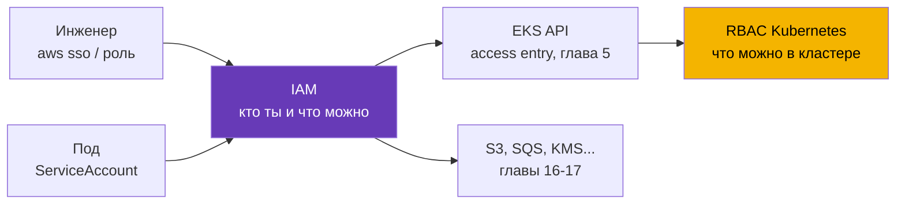
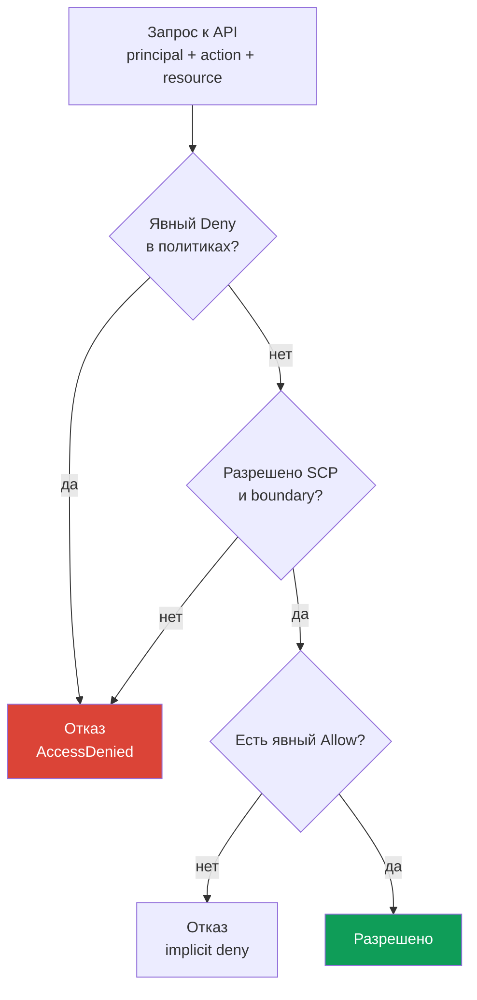
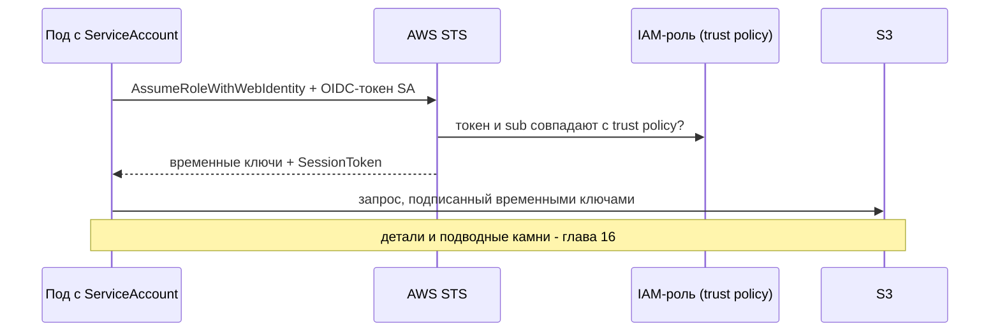

# Глава 0.2. IAM с нуля: политики, роли, доверие, STS и временные ключи

> **Что дальше.** В главе 0.1 появился аккаунт как граница прав и счёта, но вопрос «кто я
> сейчас» остался без ответа. Отвечает на него IAM - механизм, который в EKS решает сразу
> две задачи: кто из людей может обращаться к кластеру (глава 5) и что разрешено поду, когда
> он идёт в S3, SQS или Secrets Manager (главы 16-17). Здесь только нужный для эксплуатации
> минимум: политики, роли, доверие, временные ключи и отладка отказов. Дальше на этом
> встанет VPC (глава 0.3).

## 0.2.1. Зачем инженеру Kubernetes знать IAM

В kubeadm-кластере авторизация заканчивалась на RBAC. В EKS перед RBAC стоит второй контур -
IAM, и он не заменяет RBAC, а работает до него: делая `kubectl get pods`, вы подписываете
запрос своей IAM-identity, EKS проверяет, что у этой identity вообще есть право на кластер, и
только потом Kubernetes проверяет RBAC. Отказ на первом шаге выглядит как
`You must be logged in to the server (Unauthorized)`, и искать его в RBAC бессмысленно.

Вторая половина - права нагрузок. Приложение в поде хочет читать бакет S3, но S3 не знает про
ServiceAccount. Значит поду нужны учётные данные AWS, и правильный способ их выдать -
IAM-роль, привязанная к ServiceAccount через IRSA (глава 16) или EKS Pod Identity (глава 17).
ServiceAccount отвечает за identity пода в кластере, IAM-роль - за identity того же пода в AWS.



## 0.2.2. Сущности: пользователи, группы, роли, политики

IAM состоит из **принципалов** (кто действует) и **политик** (что разрешено). Принципалы
бывают трёх видов, и в современной практике используется в основном один.

| Сущность | Что это | Аналогия в Kubernetes | Практика |
|----------|---------|-----------------------|----------|
| **IAM user** | долгоживущая identity с паролем и ключами | статический сертификат | избегать |
| **IAM group** | набор пользователей для общих политик | Group в RBAC | вместе с user |
| **IAM role** | identity без своих ключей, её принимают | ServiceAccount | основной способ |

У **IAM user** есть пароль для консоли и пара ключей `AccessKeyId` + `SecretAccessKey`,
которые не истекают. Именно поэтому от пользователей уходят: вечный ключ рано или поздно
попадает в git, в переменную CI или в чат, отзывается только вручную, а утечку почти
невозможно заметить. Людям сегодня дают доступ через **IAM Identity Center** (бывший AWS SSO)
или внешний провайдер identity, машинам - роли.

**IAM role** - ключевой объект курса. У роли нет пароля и постоянных ключей: её **принимают**
(assume), получая временные учётные данные на срок от 15 минут до нескольких часов. Роль может
принять человек, EC2-инстанс, Lambda, под в EKS или принципал из другого аккаунта. Политики же
делятся по тому, к чему прикреплены:

- **identity-based** - висят на пользователе, группе или роли: «этому принципалу разрешено то
  и то». Их большинство.
- **resource-based** - висят на самом ресурсе (bucket policy у S3, key policy у KMS, политика
  репозитория ECR): «этим принципалам разрешено обращаться ко мне». Только они умеют
  разрешать доступ из другого аккаунта без роли-посредника.

Деталь для главы 18: у KMS **key policy обязательна**, и если в ней нет вашей роли, одной
identity-based политики с `kms:Decrypt` не хватит.

## 0.2.3. Анатомия политики и логика решения

Политика IAM - JSON-документ, и поля одинаковы во всех политиках AWS.

```json
{
  "Version": "2012-10-17",
  "Statement": [{
    "Sid": "ReadAppBucket",
    "Effect": "Allow",
    "Action": ["s3:GetObject", "s3:ListBucket"],
    "Resource": ["arn:aws:s3:::my-app-bucket", "arn:aws:s3:::my-app-bucket/*"],
    "Condition": {"StringEquals": {"aws:PrincipalTag/Team": "platform"}}
  }]
}
```

- `Version` - версия языка политик, всегда `2012-10-17`. Это не дата вашего документа.
- `Statement` - список правил, каждое рассматривается независимо.
- `Effect` - `Allow` или `Deny`. `Action` - действия API вида `сервис:Операция`.
- `Resource` - ARN ресурсов; часть действий не относится к ресурсу и требует `"*"`.
- `Condition` - условия: теги, IP, MFA, время, значения из запроса.

Wildcard работает и в `Action`, и в `Resource`: `s3:Get*` это все действия чтения. Отсюда два
факта. Первый: для бакета нужны **два ARN** - сам бакет для `s3:ListBucket` и `bucket/*` для
операций над объектами. Второй: `Action` и `Resource` со звёздочкой это административные
права, и в проде их не выдают ни человеку, ни поду.



Три правила наизусть: **по умолчанию запрещено всё** (implicit deny); **явный `Deny` сильнее
любого `Allow`** и отменить его другим `Allow` нельзя; разрешения суммируются по всем
политикам, поэтому хватит одного `Allow`, если нет `Deny` и запрос проходит ограничители.

## 0.2.4. Управляемые и inline-политики, boundary, SCP

Один и тот же документ можно прикрепить по-разному, и это влияет на управляемость.

| Тип | Где живёт | Переиспользование | Когда применять |
|-----|-----------|-------------------|-----------------|
| **AWS managed** | у AWS, версии обновляет AWS | глобально | роли нод EKS, быстрый старт |
| **Customer managed** | в вашем аккаунте, свои версии | да, много ролей | основной вариант |
| **Inline** | внутри одной роли, живёт с ней | нет | точечное правило для роли |

AWS managed политики удобны, но часто шире, чем нужно: `AmazonEKSWorkerNodePolicy` вы
подключите как есть, а `AmazonS3FullAccess` в проде выдавать не стоит. Customer managed
политика версионируется, видна в Terraform и откатывается, inline-политика удаляется вместе с
ролью. Поверх есть два механизма, которые прав не дают, а только урезают:

- **Permissions boundary** - политика-потолок на роли или пользователе, итоговые права это
  пересечение обычных политик и boundary. Типовой сценарий: команда сама создаёт роли для
  своих сервисов, но не может выдать им больше, чем позволяет boundary.
- **SCP (Service Control Policy)** из AWS Organizations - потолок для аккаунта или OU. SCP
  ничего не разрешает, только запрещает: закрывает лишние регионы, не даёт отключить
  CloudTrail и GuardDuty (глава 21), удалить ключи KMS. Против SCP бессилен даже
  администратор аккаунта, и это выглядит как необъяснимый `AccessDenied` при формально
  правильной политике роли.

## 0.2.5. Роль и trust policy: два разных документа

У роли всегда **два** набора правил, и путают их чаще всего остального в IAM:

- **permissions policy** (identity-based) - **что** роль может делать в AWS.
- **trust policy** (она же assume role policy) - **кто** может эту роль принять.

Аналогия помогает: permissions policy это Role, а trust policy это RoleBinding, только субъект
описан не именем в кластере, а принципалом AWS или внешним провайдером identity.

```json
{
  "Version": "2012-10-17",
  "Statement": [{
    "Effect": "Allow",
    "Principal": {"Service": "ec2.amazonaws.com"},
    "Action": "sts:AssumeRole"
  }]
}
```

Такая trust policy разрешает сервису EC2 принимать роль от имени инстанса: именно так нода EKS
получает права. Принципал бывает разным: `"Service"` для сервиса AWS, `"AWS"` с ARN роли или
аккаунта для доступа между аккаунтами, `"Federated"` для внешнего провайдера. Действий для
приёма роли тоже несколько:

- `sts:AssumeRole` - обычный вариант: принципал AWS принимает роль.
- `sts:AssumeRoleWithWebIdentity` - роль принимается по токену OIDC. На этом стоит IRSA
  (глава 16): у кластера EKS есть свой OIDC-провайдер, kubelet монтирует поду
  projected-токен ServiceAccount, SDK обменивает его в STS на временные ключи.
- `sts:AssumeRoleWithSAML` - федерация из корпоративного каталога, обычно для людей.



Типовая ошибка IRSA живёт не в permissions policy, а в trust policy: в условии указан не тот
namespace или имя ServiceAccount, и STS отказывает ещё до всякого `s3:GetObject`.

## 0.2.6. STS и временные ключи: цепочка credentials

**AWS STS (Security Token Service)** выдаёт временные учётные данные. Комплект всегда из трёх
частей, и третья отличает его от ключей IAM-пользователя: `AccessKeyId` (у временных
начинается с `ASIA`, у постоянных `AKIA`), `SecretAccessKey` и `SessionToken` - обязательный
токен сессии, без которого запрос не пройдёт. Срок жизни задаётся при получении: от 15 минут
до 12 часов для `AssumeRole`, но не больше `MaxSessionDuration` роли (по умолчанию 1 час). SDK
обновляют такие ключи сами, поэтому в поде нечего ротировать.

Откуда aws cli и SDK берут credentials, если явно ничего не передали? Есть **цепочка
провайдеров**, она проверяется по порядку до первого успеха: переменные окружения
(`AWS_ACCESS_KEY_ID`, `AWS_SESSION_TOKEN`), профиль из `~/.aws/config` и `~/.aws/credentials`,
web identity (`AWS_WEB_IDENTITY_TOKEN_FILE`, это IRSA), EKS Pod Identity через агент на ноде
(глава 17), и в конце IMDS с ролью инстанса. Порядок объясняет две частые загадки. Первая: под
с корректной IRSA-ролью работает от роли ноды, потому что в образе или Deployment остались
переменные `AWS_ACCESS_KEY_ID` и они перебили всё остальное. Вторая: локально команда
работает, в CI нет - разные профили.

Профили описываются в `~/.aws/config`, и рабочая норма для людей это IAM Identity Center:

```ini
[profile prod]
sso_session = company
sso_account_id = 123456789012
sso_role_name = PlatformEngineer
region = eu-central-1
```

```bash
# Вход через IAM Identity Center: временные ключи в кеше, обновляются по истечении
aws sso login --profile prod
# Проверить, кем вы сейчас представляетесь AWS
aws sts get-caller-identity --profile prod
# Принять роль вручную, если нужен явный набор ключей на час
aws sts assume-role --role-arn arn:aws:iam::123456789012:role/PlatformAdmin \
  --role-session-name debug-session --duration-seconds 3600
```

Ключи в `~/.aws/credentials` тоже поддерживаются, но это те самые долгоживущие секреты на
диске. В курсе они не нужны нигде.

## 0.2.7. IAM в контексте EKS: где что понадобится

У кластера EKS свой набор IAM-объектов, и почти каждый может стать причиной инцидента.

| Объект | Кому принадлежит | Зачем нужен |
|--------|------------------|-------------|
| **Cluster role** | control plane EKS | управлять ресурсами AWS от имени кластера |
| **Node role** | EC2-инстансу ноды | присоединиться к кластеру, ENI, образы из ECR |
| **Access entry** | вашей IAM-identity | доступ человека или CI к API кластера (глава 5) |
| **IRSA / Pod Identity** | ServiceAccount пода | права нагрузки в AWS (главы 16-17) |

**Роль кластера** создаётся один раз, обычно содержит `AmazonEKSClusterPolicy`, и после
создания её не трогают. **Роль ноды** обязательна: без правильного набора политик нода просто
не появится в `kubectl get nodes`. Нужны `AmazonEKSWorkerNodePolicy` для регистрации в
кластере, `AmazonEC2ContainerRegistryReadOnly` (или `...PullOnly`) для образов из ECR и
`AmazonEKS_CNI_Policy`, если VPC CNI работает от роли ноды, а не от своей IRSA-роли. Отдельно
добавляют `AmazonSSMManagedInstanceCore` для входа на ноды через Session Manager без SSH и
bastion. Диагностику «нода не присоединилась» разбираем в главе 45.

**Доступ людей** раньше жил в ConfigMap `aws-auth`: правка вручную, никакой валидации и
реальный шанс потерять доступ к кластеру одной опечаткой. Сейчас это **access entries** -
объекты уровня API EKS, связывающие ARN identity с правами в кластере (глава 5). **Права
подов** дают через IRSA (OIDC, работает везде) или EKS Pod Identity (агент на ноде, проще в
настройке, без OIDC-провайдера на кластер); выбор и миграцию разбираем в главах 16 и 17.

Отдельно про **IMDS (Instance Metadata Service)** - локальный адрес `169.254.169.254`, по
которому инстанс получает метаданные и ключи роли ноды. Этот адрес доступен и из пода: если
ничего не настроить, любой контейнер обычным HTTP-запросом получит credentials роли ноды, то
есть доступ к ECR, ENI и всему, что вы туда добавили. Отсюда стандарт харденинга: IMDSv2
обязателен, hop limit такой, чтобы запрос из контейнера не доходил, а нагрузки получают права
только через IRSA или Pod Identity. Это задел на главу 19.

## 0.2.8. Отладка прав: что смотреть при AccessDenied

Сообщение об отказе информативнее, чем кажется, и обычно называет всё нужное:

```text
User: arn:aws:sts::123456789012:assumed-role/app-role/1699... is not authorized
to perform: s3:GetObject on resource: arn:aws:s3:::my-app-bucket/data.csv
because no identity-based policy allows the s3:GetObject action
```

Читайте по четырём точкам: кто (`assumed-role/app-role`, значит роль принята и IRSA
сработала), что (`s3:GetObject`), над чем (полный ARN объекта) и почему. Хвост про причину
самый ценный: `no identity-based policy allows` это implicit deny и нужно добавить право, а
`with an explicit deny in a service control policy` означает SCP, и политику роли править
бессмысленно.

```bash
# Точка старта любой отладки: кем вас видит AWS прямо сейчас
aws sts get-caller-identity
# Что подключено к роли и кто вообще может её принять
aws iam list-attached-role-policies --role-name app-role
aws iam list-role-policies --role-name app-role
aws iam get-role --role-name app-role --query 'Role.AssumeRolePolicyDocument'
# Проверить решение, не выполняя реальный вызов API
aws iam simulate-principal-policy \
  --policy-source-arn arn:aws:iam::123456789012:role/app-role \
  --action-names s3:GetObject --resource-arns arn:aws:s3:::my-app-bucket/data.csv
```

`simulate-principal-policy` (в консоли - IAM Policy Simulator) отвечает на вопрос «разрешено
ли», не выполняя действие, но условия с реальными значениями запроса воспроизводит не
полностью. Последнее слово за **CloudTrail**: там видно фактический вызов, принципал,
параметры и код ошибки. Внутри пода отладку начинают с переменных `AWS_ROLE_ARN` и
`AWS_WEB_IDENTITY_TOKEN_FILE`: если их нет, IRSA не подключилась (главы 21 и 47).

## 0.2.9. Как это применяют в продакшене

- **Люди без ключей.** Доступ через IAM Identity Center или федерацию, MFA обязателен,
  IAM-пользователи с долгоживущими ключами не создаются. Root не используется (глава 0.1).
- **Роль на нагрузку, а не на кластер.** У каждого приложения своя роль с минимальным набором
  действий и конкретными ARN. Общая «роль для всех подов» незаметно выдаёт всему кластеру
  доступ ко всем данным.
- **Ограничители сверху.** SCP закрывают опасные действия и лишние регионы, permissions
  boundary позволяет командам создавать роли самостоятельно, не повышая себе права.
- **IAM как код.** Роли и политики описаны в Terraform, ревью политики - часть code review.
  Ручные правки в консоли не воспроизводятся и теряются при следующем `apply`.
- **Аудит и алармы.** CloudTrail включён во всех аккаунтах, есть алармы на использование root,
  создание пользователей и ключей, изменения политик (глава 21).

## 0.2.10. Мини-глоссарий

- **Principal** - тот, кто выполняет запрос: пользователь, роль, сервис AWS.
- **IAM user / group** - долгоживущая identity и набор таких identity; в проде избегаются.
- **IAM role** - identity без постоянных ключей, которую принимают на время.
- **Policy** - JSON с `Version`, `Statement`, `Effect`, `Action`, `Resource`, `Condition`;
  бывает **identity-based** (на принципале) и **resource-based** (на самом ресурсе).
- **Managed / inline policy** - переиспользуемая версионируемая политика / встроенная в роль.
- **Permissions boundary** - потолок прав для роли или пользователя, права не выдаёт.
- **SCP** - политика уровня Organizations, только запрещает, действует на весь аккаунт.
- **Trust policy** - документ роли, описывающий, кто может её принять.
- **STS** - сервис временных ключей; `sts:AssumeRole`, `sts:AssumeRoleWithWebIdentity`.
- **IRSA / Pod Identity** - два способа дать поду IAM-роль (главы 16-17).
- **IMDS** - сервис метаданных инстанса на `169.254.169.254`, отдаёт ключи роли ноды.

## 0.2.11. Итоги главы

- IAM работает до RBAC: сначала AWS проверяет identity и право на кластер, потом Kubernetes
  проверяет права внутри кластера.
- Основной принципал это роль, а не пользователь: постоянных ключей у неё нет, её принимают
  через STS и получают временные credentials с `SessionToken`.
- У роли два документа: permissions policy (что можно) и trust policy (кто может принять).
  Ошибки IRSA чаще всего живут именно в trust policy.
- Решение считается так: по умолчанию запрещено, явный `Deny` сильнее любого `Allow`, а SCP и
  permissions boundary только урезают итоговые права.
- Роль ноды обязательна и должна содержать политики регистрации в кластере и доступа к ECR;
  доступ людей описывается через access entries (глава 5), права подов - через IRSA или Pod
  Identity (главы 16-17), а не через роль ноды и IMDS (глава 19).
- Отладка идёт по цепочке: текст `AccessDenied`, `aws sts get-caller-identity`, политики и
  trust policy роли, симулятор, CloudTrail как источник правды (глава 21).

## 0.2.12. Как это пригодится в реальной работе

Большая часть тикетов «в EKS что-то не работает» это IAM: инженер не попадает в кластер, CI не
может обновить Deployment, под не читает бакет, нода не регистрируется, контроллер не создаёт
балансировщик. Путь везде один: понять, от какой identity идёт вызов, какие у неё политики,
что говорит trust policy и что видно в CloudTrail. Вторая половина работы это проектирование:
роль на приложение, минимальные права, никаких долгоживущих ключей, ограничители сверху и вся
конструкция в Terraform, а не в консоли.

## 0.2.13. Вопросы для самопроверки

1. Почему IAM не заменяет RBAC и в каком порядке они проверяются при `kubectl get pods`?
2. Чем IAM-роль отличается от IAM-пользователя и почему пользователей с ключами избегают?
3. Как AWS вычисляет решение, если одна политика разрешает, а другая запрещает действие?
4. Чем permissions boundary отличается от обычной политики и от SCP?
5. Какие два документа есть у роли и за что отвечает каждый?
6. Какое действие STS лежит в основе IRSA и что под предъявляет в обмен на ключи?
7. В каком порядке SDK ищет credentials и почему переменные окружения ломают IRSA?
8. Почему поду опасно иметь доступ к `169.254.169.254`?
9. Вы получили `AccessDenied` с упоминанием service control policy. Что править?

## Практика

Своих лаб у Части 0 нет: это фундамент для остальных глав. IAM вы будете применять почти в
каждой лабе Части 1 и дальше, начиная с создания кластера и доступа к нему. Дальше идёт глава
про VPC: подсети, маршрутизация, NAT и security groups, то есть сеть, в которой будет жить
кластер.

---
[Оглавление](../README_RU.md) · [Глава 0.1](../00-1-aws/ru.md) · [Глава 0.3](../00-3-vpc/ru.md)
