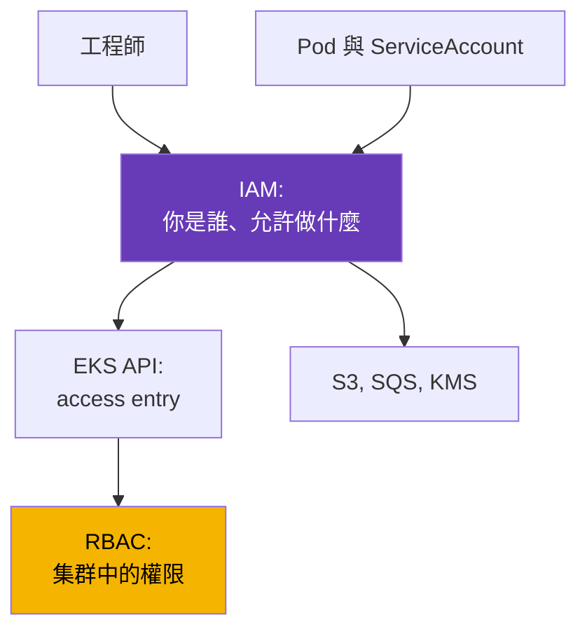
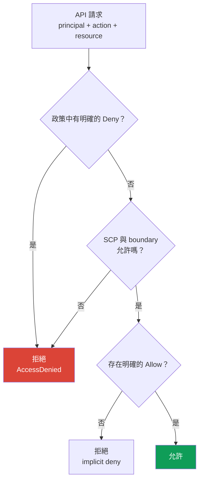
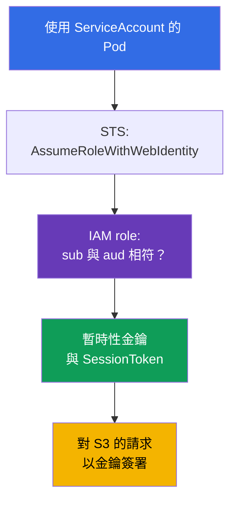

[Русская версия](ru.md) · [Eng version](en.md) · [Versión en español](es.md) · [Version française](fr.md) · [Deutsche Version](de.md) · [ქართული ვერსია](ge.md) · [日本語版](jp.md)
# 第 0.2 章. 從零開始認識 IAM：政策、角色、信任、STS 與暫時性金鑰

> **接下來。** 第 0.1 章將帳戶介紹為權限與帳單的邊界，卻尚未回答「我現在是誰」。IAM 會回答這個問題。在 EKS 中，它同時處理兩件事：哪些人可以存取集群（第 5 章），以及 Pod 存取 S3、SQS 或 Secrets Manager 時可做什麼（第 16-17 章）。本章只涵蓋運維所需的最小內容：政策、角色、信任、暫時性金鑰和拒絕的除錯。下一章會在此基礎上介紹 VPC（第 0.3 章）。

## 0.2.1. 為什麼 Kubernetes 工程師需要了解 IAM

在 kubeadm 集群中，授權止於 RBAC。在 EKS 裡，RBAC 前還有 IAM 這一層。它不取代 RBAC，而是在它之前執行：當你執行 `kubectl get pods`，會用 IAM identity 簽署請求；EKS 先檢查該 identity 是否有權存取集群，然後 Kubernetes 才檢查 RBAC。第一步遭拒會顯示 `You must be logged in to the server (Unauthorized)`，到 RBAC 裡尋找原因沒有意義。

另一半是工作負載權限。Pod 中的應用程式想讀取 S3 bucket，但 S3 不認識 ServiceAccount。因此 Pod 需要 AWS credentials，正確的授予方式是經由 IRSA（第 16 章）或 EKS Pod Identity（第 17 章）將 IAM role 綁定至 ServiceAccount。ServiceAccount 提供 Pod 在集群內的 identity，IAM role 則提供同一個 Pod 在 AWS 中的 identity。



## 0.2.2. 實體：使用者、群組、角色、政策

IAM 由**principals**（誰在行動）和**policies**（允許做什麼）構成。Principal 有三種類型，但現代實務主要使用其中一種。

| 實體 | 說明 | Kubernetes 類比 | 實務 |
|------|------|-----------------|------|
| **IAM user** | 具密碼和金鑰的長期 identity | 靜態憑證 | 避免使用 |
| **IAM group** | 用於共用政策的一組使用者 | RBAC 中的 Group | 與 user 一起使用 |
| **IAM role** | 沒有自己的金鑰、由其他 principal assume 的 identity | ServiceAccount | 主要方法 |

**IAM user** 有主控台密碼和永不過期的 `AccessKeyId` + `SecretAccessKey`。這正是逐步淘汰 user 的原因：永久金鑰遲早會進入 git、CI 變數或聊天記錄；只能手動撤銷，且洩漏幾乎無法察覺。人員應透過 **IAM Identity Center**（前身為 AWS SSO）或外部 identity provider 取得存取權，機器則使用 role。

**IAM role** 是本課程的關鍵物件。Role 沒有密碼和永久金鑰：它會被 **assume**，並產生有效期從 15 分鐘到數小時的暫時性 credentials。人員、EC2 instance、Lambda、EKS 中的 Pod，或其他帳戶的 principal 都可以 assume role。政策依附加位置分成：

- **identity-based** - 附加在 user、group 或 role 上：「允許此 principal 做這些事」。大部分政策屬於此類。
- **resource-based** - 附加在資源本身（S3 bucket policy、KMS key policy、ECR repository policy）：「允許這些 principals 存取我」。只有這一類可在沒有中介 role 的情況下授予其他帳戶存取權。

第 18 章的一個細節：KMS **key policy 必不可少**。若其中沒有你的 role，僅有帶 `kms:Decrypt` 的 identity-based policy 並不夠。

## 0.2.3. 政策的構造與決策邏輯

IAM policy 是 JSON 文件，所有 AWS policy 的欄位都一樣。

```json
{
  "Version": "2012-10-17",
  "Statement": [{
    "Sid": "ReadAppBucket",
    "Effect": "Allow",
    "Action": ["s3:GetObject", "s3:ListBucket"],
    "Resource": ["arn:aws:s3:::my-app-bucket", "arn:aws:s3:::my-app-bucket/*"],
    "Condition": {"StringEquals": {"aws:PrincipalTag/Team": "platform"}}
  }]
}
```

- `Version` - policy 語言版本，永遠是 `2012-10-17`，不是你的文件日期。
- `Statement` - 規則清單，每條規則會獨立評估。
- `Effect` - `Allow` 或 `Deny`。`Action` - 形式為 `服務:操作` 的 API 動作。
- `Resource` - 資源 ARN；部分動作不對應特定資源，必須使用 `"*"`。
- `Condition` - 條件：標籤、IP、MFA、時間或請求中的值。

Wildcard 可同時用於 `Action` 和 `Resource`：`s3:Get*` 包含所有讀取動作。由此有兩個重點。第一，bucket 需要**兩個 ARN**：bucket 本身用於 `s3:ListBucket`，`bucket/*` 用於物件操作。第二，帶 wildcard 的 `Action` 和 `Resource` 是管理權限，生產環境不應授予人員或 Pod。

依標籤設定條件提供了第二種授權方式，這裡有兩種模型。**IAM 中的 RBAC** 是熟悉的方法：為每個 role 寫出具體的 `Action` 和 `Resource`。**ABAC（Attribute-Based Access Control）** 不列舉資源，而是比較標籤：帶 `aws:PrincipalTag/Team` 條件的一條 policy，即可開放給具有相同 `Team` 標籤的資源；新增團隊不需另建 policy，只要設定標籤。以上範例的 `Team=platform` 正是 ABAC：權限取決於 principal 的屬性而非名稱。



請牢記三條規則：**預設拒絕一切**（implicit deny）；**明確的 `Deny` 強於任何 `Allow`**，不能被其他 `Allow` 取消；權限會合併所有 policies，因此只要沒有 `Deny` 且請求通過限制條件，一個 `Allow` 就足夠。

## 0.2.4. Managed 與 inline policy、boundary、SCP

同一份文件可用不同方式附加，這會影響可管理性。

| 類型 | 所在位置 | 重複使用 | 使用時機 |
|------|----------|----------|----------|
| **AWS managed** | AWS 擁有，版本由 AWS 更新 | 全域 | EKS node role、快速起步 |
| **Customer managed** | 你的帳戶中，使用自己的版本 | 是，多個 role | 主要選項 |
| **Inline** | 單一 role 內，隨 role 存在 | 否 | 為單一 role 設定的精確規則 |

AWS managed policy 很方便，但通常過寬：可原樣使用 `AmazonEKSWorkerNodePolicy`，但生產環境不應授予 `AmazonS3FullAccess`。Customer managed policy 有版本、可在 Terraform 中看到且可回復；inline policy 會與 role 一起刪除。其上還有兩種不會授權、只會縮減權限的機制：

- **Permissions boundary** - role 或 user 的權限上限，最終權限是一般 policies 與 boundary 的交集。典型情境是團隊自行為服務建立 roles，卻不能授予超過 boundary 的權限。實務基準是：開發者和 CI/CD pipeline 建立的每個 role 都必須有 boundary。否則具有 `iam:CreateRole` 的 pipeline 實際上能建立 administrator role 並提升自己；boundary 會使此類提權無法發生。
- **SCP（Service Control Policy）**來自 AWS Organizations - 帳戶或 OU 的上限。SCP 不授予任何權限，只會拒絕：它封鎖不必要的 regions、禁止停用 CloudTrail 和 GuardDuty（第 21 章），並禁止刪除 KMS keys。即使帳戶 administrator 也無法對抗 SCP，因此即便 role policy 表面正確，仍會出現難以解釋的 `AccessDenied`。

## 0.2.5. Role 與 trust policy：兩份不同的文件

Role 永遠有**兩**組規則，混淆它們是 IAM 最常見的錯誤：

- **permissions policy**（identity-based）- role 在 AWS 中**能做什麼**。
- **trust policy**（也稱 assume role policy）- **誰**可以 assume 這個 role。

這個類比很有幫助：permissions policy 是 Role，trust policy 是 RoleBinding，但 subject 不是以集群中的名稱描述，而是 AWS principal 或外部 identity provider。

```json
{
  "Version": "2012-10-17",
  "Statement": [{
    "Effect": "Allow",
    "Principal": {"Service": "ec2.amazonaws.com"},
    "Action": "sts:AssumeRole"
  }]
}
```

這份 trust policy 允許 EC2 service 為 instance assume role：EKS node 就是如此取得權限。Principal 可為不同類型：`"Service"` 表示 AWS service，`"AWS"` 搭配 role 或 account ARN 表示跨帳戶存取，`"Federated"` 表示外部 provider。Assume role 的動作也有數種：

- `sts:AssumeRole` - 一般選項：AWS principal assume role。
- `sts:AssumeRoleWithWebIdentity` - 透過 OIDC token assume role。這是 IRSA（第 16 章）的基礎：EKS cluster 有自己的 OIDC provider，kubelet 將 projected ServiceAccount token 掛載到 Pod，SDK 在 STS 以它換取暫時性金鑰。
- `sts:AssumeRoleWithSAML` - 來自公司目錄的 federation，通常用於人員。

Condition 也可用於 trust policy，這是在 assume role 時使用 ABAC。下列文件只允許帶有 `Team=platform` 標籤的 principals assume role，無須逐一加入其 ARN：

```json
{
  "Version": "2012-10-17",
  "Statement": [{
    "Effect": "Allow",
    "Principal": {"AWS": "arn:aws:iam::123456789012:root"},
    "Action": "sts:AssumeRole",
    "Condition": {"StringEquals": {"aws:PrincipalTag/Team": "platform"}}
  }]
}
```



典型的 IRSA 錯誤不在 permissions policy，而是在 trust policy：它的 condition 指定錯誤的 namespace 或 ServiceAccount 名稱，STS 會在執行任何 `s3:GetObject` 前拒絕請求。

## 0.2.6. STS 與暫時性金鑰：credentials chain

**AWS STS（Security Token Service）**會簽發暫時性 credentials。這組資料永遠有三部分，第三項使其不同於 IAM user key：`AccessKeyId`（暫時性金鑰以 `ASIA` 開頭，永久金鑰以 `AKIA` 開頭）、`SecretAccessKey` 和 `SessionToken` - 必要的 session token，沒有它請求就會失敗。取得時設定有效期：`AssumeRole` 為 15 分鐘到 12 小時，但不能超過 role 的 `MaxSessionDuration`（預設 1 小時）。SDK 會自動更新這些金鑰，因此 Pod 中沒有要輪替的東西。

若未明確傳遞，aws cli 與 SDK 從哪裡取得 credentials？有一條**provider chain**，依順序檢查直到首次成功：environment variables（`AWS_ACCESS_KEY_ID`、`AWS_SESSION_TOKEN`）、`~/.aws/config` 和 `~/.aws/credentials` 中的 profile、web identity（`AWS_WEB_IDENTITY_TOKEN_FILE`，即 IRSA）、透過 node agent 的 EKS Pod Identity（第 17 章），最後是具有 instance role 的 IMDS。這個順序解釋兩個常見謎題。第一，IRSA role 正確的 Pod 卻以 node role 運行，因為 image 或 Deployment 還保留 `AWS_ACCESS_KEY_ID` variables，覆蓋了其他來源。第二，指令在本機可用、CI 中不可用，因為 profiles 不同。

Profiles 定義於 `~/.aws/config`，人員的實務基準是 IAM Identity Center：

```ini
[profile prod]
sso_session = company
sso_account_id = 123456789012
sso_role_name = PlatformEngineer
region = eu-central-1
```

```bash
# 透過 IAM Identity Center 登入：暫時性金鑰會快取並在過期後更新
aws sso login --profile prod
# 檢查 AWS 現在如何識別你
aws sts get-caller-identity --profile prod
# 若需要明確的一組一小時金鑰，手動 assume role
aws sts assume-role --role-arn arn:aws:iam::123456789012:role/PlatformAdmin \
  --role-session-name debug-session --duration-seconds 3600
```

`~/.aws/credentials` 中的金鑰也受到支援，但它們是磁碟上的長期 secrets。本課程不需要在任何地方使用它們。

## 0.2.7. EKS 脈絡中的 IAM：各部分會用在哪裡

EKS cluster 有自己的一組 IAM objects，幾乎每一項都可能導致 incident。

| 物件 | 歸屬 | 用途 |
|------|------|------|
| **Cluster role** | EKS control plane | 代表 cluster 管理 AWS resources |
| **Node role** | node 的 EC2 instance | 加入 cluster、ENI、從 ECR 取得 images |
| **Access entry** | 你的 IAM identity | 人員或 CI 存取 cluster API（第 5 章） |
| **IRSA / Pod Identity** | Pod 的 ServiceAccount | workload 在 AWS 的權限（第 16-17 章） |

**Cluster role** 只建立一次，通常包含 `AmazonEKSClusterPolicy`，建立後不會再調整。**Node role** 是必要的：沒有正確的 policies，node 就不會出現在 `kubectl get nodes`。它需要 `AmazonEKSWorkerNodePolicy` 來註冊到 cluster、`AmazonEC2ContainerRegistryReadOnly`（或 `...PullOnly`）從 ECR 取得 images，若 VPC CNI 使用 node role 而非自己的 IRSA role，還需要 `AmazonEKS_CNI_Policy`。另行加入 `AmazonSSMManagedInstanceCore`，即可透過 Session Manager 登入 nodes，而不需 SSH 或 bastion。第 45 章會說明「node 未加入」的診斷。

**人員存取**過去放在 `aws-auth` ConfigMap：手動編輯、沒有驗證，而且一個錯字就可能失去 cluster 存取權。現在使用 **access entries** - 將 identity ARN 與 cluster 權限連結的 EKS API 層級物件（第 5 章）。**Pod 權限**透過 IRSA（OIDC、任何地方皆適用）或 EKS Pod Identity（node agent、設定較簡單且 cluster 不需 OIDC provider）授予；第 16 和 17 章會討論選擇與遷移。

**IMDS（Instance Metadata Service）**也值得單獨注意。它是 instance 取得 metadata 與 node role keys 的本機位址 `169.254.169.254`。Pod 也可存取這個位址：若未設定任何保護，任何 container 以普通 HTTP request 就能取得 node role credentials，也就是可存取 ECR、ENI 和所有加入該 role 的資源。因此 hardening 標準是：必須使用 IMDSv2，hop limit 必須阻止 container 發出的 request 抵達 IMDS，而 workloads 只能透過 IRSA 或 Pod Identity 取得權限。這是第 19 章的前置知識。

## 0.2.8. 權限除錯：AccessDenied 時要查看什麼

拒絕訊息比看起來更有資訊，通常已列出所有需要的內容：

```text
User: arn:aws:sts::123456789012:assumed-role/app-role/1699... is not authorized
to perform: s3:GetObject on resource: arn:aws:s3:::my-app-bucket/data.csv
because no identity-based policy allows the s3:GetObject action
```

從四個面向閱讀：誰（`assumed-role/app-role`，代表 role 已被 assume 且 IRSA 正常）、做什麼（`s3:GetObject`）、針對什麼（完整物件 ARN）和原因。結尾的原因最有價值：`no identity-based policy allows` 是 implicit deny，必須新增權限；`with an explicit deny in a service control policy` 則代表 SCP，修改 role policy 沒有意義。

```bash
# 所有除錯的起點：AWS 現在如何看待你
aws sts get-caller-identity
# 有哪些項目附加至 role，以及誰可以 assume 它
aws iam list-attached-role-policies --role-name app-role
aws iam list-role-policies --role-name app-role
aws iam get-role --role-name app-role --query 'Role.AssumeRolePolicyDocument'
# 不執行真正 API 呼叫，檢查決策
aws iam simulate-principal-policy \
  --policy-source-arn arn:aws:iam::123456789012:role/app-role \
  --action-names s3:GetObject --resource-arns arn:aws:s3:::my-app-bucket/data.csv
```

`simulate-principal-policy`（主控台中的 IAM Policy Simulator）可回答是否允許動作，而不會真的執行它，但無法完整重現帶實際 request values 的 conditions。最後以 **CloudTrail** 為準：它會顯示實際呼叫、principal、參數與 error code。在 Pod 中，除錯從 `AWS_ROLE_ARN` 和 `AWS_WEB_IDENTITY_TOKEN_FILE` 開始：若不存在，IRSA 尚未連線（第 21 和 47 章）。

## 0.2.9. 如何在生產環境使用

- **人員不使用金鑰。** 透過 IAM Identity Center 或 federation 存取，MFA 為必要條件，不建立帶長期金鑰的 IAM users。不使用 root（第 0.1 章）。
- **每個 workload 一個 role，而非每個 cluster 一個 role。** 每個 application 都有自己的 role，只包含最小動作集合和特定 ARN。共用的「所有 Pod 共用 role」會悄悄讓整個 cluster 存取所有資料。
- **上層限制。** SCP 封鎖危險動作與不必要的 regions；permissions boundary 允許 teams 自行建立 roles，同時不會提升自身權限。
- **受控的外部存取。** IAM Access Analyzer 持續分析 resource-based policies 與 trust policies，找出帳戶或 Organization 外仍有權限的 entities（external access）：role trust policy 中的其他帳戶、公開 S3 bucket 或 KMS key。應檢閱 findings 並移除不必要的存取權。
- **IAM 即程式碼。** Roles 和 policies 以 Terraform 描述；policy review 是 code review 的一部分。手動主控台變更無法重現，下一次 `apply` 就會消失。
- **稽核與警示。** 每個帳戶均啟用 CloudTrail，並對 root 使用、建立 users 與 keys、變更 policies 設定 alerts（第 21 章）。

## 0.2.10. 迷你詞彙表

- **Principal** - 執行 request 的對象：user、role 或 AWS service。
- **IAM user / group** - 長期 identity 和一組這類 identities；生產環境應避免。
- **IAM role** - 沒有永久金鑰、暫時被 assume 的 identity。
- **Policy** - 含有 `Version`、`Statement`、`Effect`、`Action`、`Resource`、`Condition` 的 JSON；可為 **identity-based**（附加於 principal）或 **resource-based**（附加於資源本身）。
- **ABAC / RBAC** - 透過 `aws:PrincipalTag` 依標籤存取，對比以具體 actions 和 resources 的 roles 與 policies 進行存取。
- **IAM Access Analyzer** - 在 resource-based policies 與 trust policies 中找到外部受信任 entities（external access）。
- **Managed / inline policy** - 可重複使用、可版本控制的 policy / 內嵌於 role 的 policy。
- **Permissions boundary** - role 或 user 的權限上限；不授予任何權限。
- **SCP** - Organizations 層級、僅拒絕且作用於整個帳戶的 policy。
- **Trust policy** - 說明誰可 assume role 的 role 文件。
- **STS** - 暫時性金鑰服務；`sts:AssumeRole`、`sts:AssumeRoleWithWebIdentity`。
- **IRSA / Pod Identity** - 對 Pod 授予 IAM role 的兩種方法（第 16-17 章）。
- **IMDS** - 位於 `169.254.169.254` 的 instance metadata service，會回傳 node role keys。

## 0.2.11. 本章小結

- IAM 在 RBAC 前運作：AWS 先檢查 identity 和存取 cluster 的權利，然後 Kubernetes 檢查 cluster 內權限。
- 主要的 principal 是 role 而非 user：它沒有永久金鑰，經由 STS 被 assume 並產生帶 `SessionToken` 的暫時性 credentials。
- Role 有兩份文件：permissions policy（可做什麼）與 trust policy（誰可以 assume）。IRSA 錯誤多半存在於 trust policy。
- 決策邏輯如下：預設拒絕一切，明確的 `Deny` 強於任何 `Allow`，而 SCP 和 permissions boundaries 只會縮減最後的權限。
- Node role 是必要的，必須包含註冊 cluster 與存取 ECR 的 policies；人員存取透過 access entries（第 5 章），Pod 權限透過 IRSA 或 Pod Identity（第 16-17 章），而非 node role 和 IMDS（第 19 章）。
- 除錯沿著此鏈進行：`AccessDenied` 文字、`aws sts get-caller-identity`、role 的 policies 與 trust policy、simulator，最後以 CloudTrail 為事實來源（第 21 章）。

## 0.2.12. 在實際工作中如何派上用場

多數「EKS 有東西不能運作」的 tickets 都是 IAM：工程師無法進入 cluster、CI 無法更新 Deployment、Pod 不能讀 bucket、node 無法註冊，或 controller 無法建立 load balancer。路徑永遠相同：了解哪個 identity 發出呼叫、它有哪些 policies、trust policy 怎麼說，以及 CloudTrail 顯示什麼。另一半工作是設計：每個 application 一個 role、最小權限、沒有長期金鑰、上層 guardrails，整個架構放在 Terraform 而不是主控台中。

## 0.2.13. 自我檢測問題

1. 為什麼 IAM 不取代 RBAC，執行 `kubectl get pods` 時它們按什麼順序檢查？
2. IAM role 與 IAM user 有何差異，為什麼要避免使用帶金鑰的 users？
3. 若一個 policy 允許動作、另一個拒絕，AWS 如何計算決策？
4. Permissions boundary 與一般 policy、SCP 有何不同，為什麼它對 CI/CD 建立的 roles 是必要的？
5. Role 有哪兩份文件，各自控制什麼？
6. 哪個 STS action 是 IRSA 的基礎，Pod 以什麼交換金鑰？
7. SDK 按什麼順序尋找 credentials，為什麼 environment variables 會破壞 IRSA？
8. 為什麼 Pod 存取 `169.254.169.254` 有危險？
9. 你收到提及 service control policy 的 `AccessDenied`。應該修改什麼？
10. IAM 中的 ABAC 與 RBAC 有何差異，哪個 condition 是它的基礎？
11. 為什麼需要 IAM Access Analyzer，它如何界定 external access？

## 實作

第 0 部分沒有自己的 labs：它是其餘章節的基礎。從建立 cluster 與取得存取權開始，你會在幾乎每個第 1 部分及之後的 lab 中使用 IAM。接下來是 VPC 章節：subnets、routing、NAT 和 security groups，也就是 cluster 要運行其中的網路。

---
[目錄](../README_TW.md) · [第 0.1 章](../00-1-aws/tw.md) · [第 0.3 章](../00-3-vpc/tw.md)
