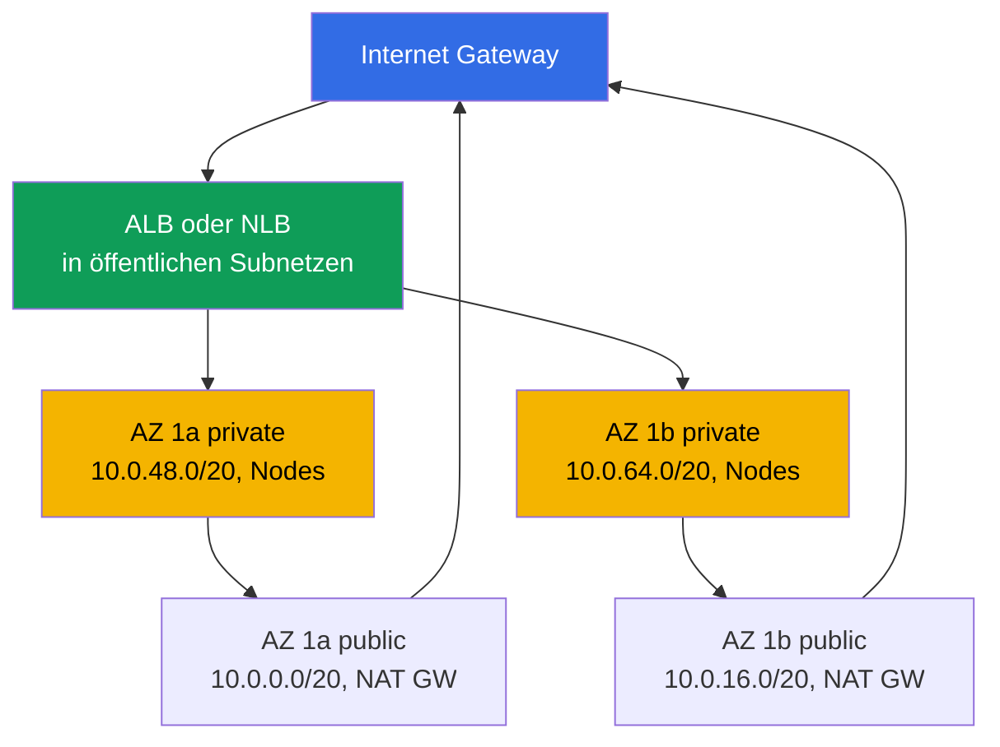
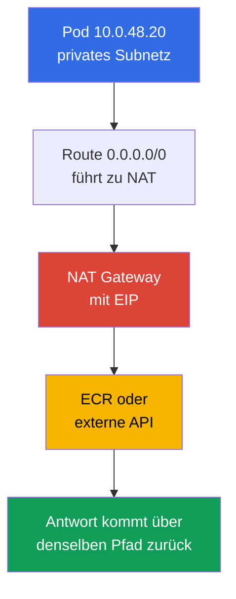
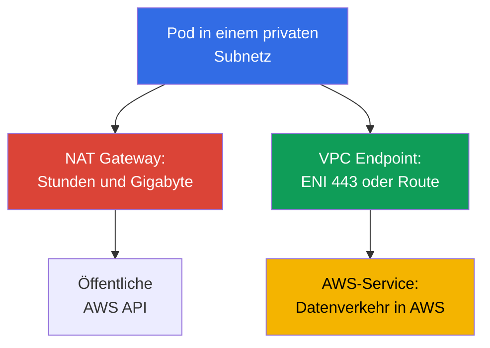

[Русская версия](ru.md) · [Eng version](en.md) · [Versión en español](es.md) · [Version française](fr.md) · [ქართული ვერსია](ge.md) · [繁體中文版](tw.md) · [日本語版](jp.md)
# Kapitel 0.3. VPC von Grund auf: Subnetze, Routing, IGW und NAT, Security Groups, VPC Endpoints

> **Was als Nächstes kommt.** In Kapitel 0.1 wurden Region, Availability Zones und funktionale Tags auf Subnetzen eingeführt, in Kapitel 0.2 Rollen und temporäre Schlüssel. Jetzt bauen wir die Umgebung, in der der Cluster lebt: das VPC-Netzwerk. In EKS ist es kein Hintergrund, sondern die Arbeitsfläche: Pods beziehen Adressen aus Ihren Subnetzen, Load Balancer wählen Subnetze anhand von Tags, und NAT beeinflusst die Rechnung für Datenverkehr. Darauf bauen Nodes (Kapitel 0.4), das Cluster-Netzwerk (Kapitel 6 und 7) und Egress (Kapitel 31) auf.

## 0.3.1. VPC: ein isoliertes Netzwerk in einer Region und sein CIDR

**VPC (Virtual Private Cloud)** ist ein logisch isoliertes Netzwerk innerhalb einer Region. Andere AWS-Kunden haben eigene VPCs, und die Adresse `10.0.1.15` in Ihrem Netzwerk hat keine Beziehung zu derselben Adresse in einem anderen. Innerhalb einer VPC definieren Sie den Adressraum, teilen ihn in Subnetze auf, schreiben Routen und konfigurieren Firewall-Regeln.

Der Unterschied zu einem kubeadm-Cluster besteht darin, dass in EKS **das VPC-Netzwerk und das Pod-Netzwerk ein einziges Netzwerk sind**. Das Standard-Amazon VPC CNI baut kein Overlay auf: Jeder Pod erhält eine reale Adresse aus dem CIDR des Subnetzes, in dem sein Node läuft, und ist in der VPC als reguläres Netzwerk-Interface sichtbar (Kapitel 6 und 7). Daher ist die Größe der VPC eine langfristig gewählte Obergrenze für die Anzahl der Pods.

Beim Erstellen einer VPC geben Sie den **primären CIDR-Block** an: Masken von `/16` (65 536 Adressen) bis `/28`. Sie können ihn nach der Erstellung **weder ändern noch verkleinern**; ein anderer Adressplan bedeutet eine neue VPC und eine Cluster-Migration. Erweitern lässt er sich **nur durch Hinzufügen sekundärer CIDRs** (bis zu fünf Blöcke), eine praktische Methode für einen Cluster ohne freie Adressen (Kapitel 7). Daraus folgt die übliche Praxis: Für einen Cluster wird `/16` reserviert, auch wenn `/20` heute ausreichend scheint. Zusätzliche Adressen kosten nichts, während fehlende Kapazität schmerzhaft zu beheben ist. Der Bereich darf sich nicht mit anderen VPCs, dem Unternehmensnetzwerk oder über Peering beziehungsweise Transit Gateway verbundenen Netzen überschneiden (Kapitel 32).

Diese Einschränkung bestimmt selbst die Wahl des Verbindungsmusters, wenn eine VPC mit anderen Netzwerken verbunden werden muss. Dieses Kapitel unterscheidet sie nur; Konfiguration und Details stehen in Kapitel 32.

| Muster | Was es verbindet | Transitfähigkeit | Wann es verwendet wird |
|--------|------------------|------------------|------------------------|
| VPC Peering | zwei VPCs direkt | nein, nur 1:1 | ein Paar VPCs mit einfachem Austausch |
| Transit Gateway | viele VPCs und On-Premises über einen Hub | ja, zwischen Attachments | ein Netzwerk aus Dutzenden VPCs |
| VPC Lattice | Services statt Subnetze | auf Anwendungsebene | L7-Konnektivität über Accounts hinweg |

VPC Peering und Transit Gateway erfordern nicht überlappende CIDRs, daher wird der Adressplan auf Organisationsebene abgestimmt. VPC Lattice arbeitet auf Service-Ebene und benötigt keinen gemeinsamen Adressplan, betrifft jedoch Anwendungskonnektivität statt Subnetze (Kapitel 32).

## 0.3.2. Subnetze: eine AZ, öffentlich und privat, EKS-Layout

Ein **Subnetz** ist ein Teil eines VPC-CIDR, der **streng an eine einzige AZ** gebunden ist. Eine Ressource in einem Subnetz läuft physisch in dieser Zone: Ein Node in `eu-central-1a` kann nicht in eine andere Zone wechseln, und ein EBS-Volume kann nur an eine Instance in seiner eigenen AZ angehängt werden (Kapitel 0.1, ausführlich in Kapitel 23).

Der Unterschied zwischen einem öffentlichen und einem privaten Subnetz ist **keine Einstellung des Subnetzes**, sondern nur seine Route Table: Ein öffentliches Subnetz hat eine Route `0.0.0.0/0` zu einem Internet Gateway, ein privates leitet sie zu einem NAT Gateway oder besitzt gar keine solche Route. Es gibt kein Flag `public: true`; `MapPublicIpOnLaunch` existiert, aber eine öffentliche Adresse ist ohne Route zu einem IGW nutzlos. Ein typisches EKS-Layout hat zwei Subnetze in jeder AZ: öffentliche für Load Balancer und NAT Gateway, private für Nodes und Pods. Das Diagramm zeigt zwei Zonen; die dritte ist gleich aufgebaut.



Nodes bleiben in privaten Subnetzen: Ohne öffentliche Adresse kann das Internet weder kubelet noch Pods erreichen, und eingehender Datenverkehr läuft nur durch einen Load Balancer (ein Cluster ohne Internet wird in Kapitel 19 behandelt). Öffentliche Subnetze werden benötigt, weil internet-facing ALBs und NLBs dort erstellt werden und sie über das Tag `kubernetes.io/role/elb` finden (Kapitel 0.1). Sie übergeben Subnetze beim Erstellen an die Cluster-Konfiguration, und die Control Plane platziert dort ihre Interfaces für die Kommunikation mit Nodes. Deshalb sind Subnetze in mindestens zwei AZs erforderlich.

```bash
# VPC-Subnetze: Zone, CIDR, verfügbare Adressen
aws ec2 describe-subnets --filters "Name=vpc-id,Values=vpc-0a1b2c3d4e5f6a7b8" \
  --query 'Subnets[].[SubnetId,AvailabilityZone,AvailableIpAddressCount]' --output table
```

## 0.3.3. Route Tables, IGW und NAT Gateway: wie Datenverkehr nach außen gelangt

Eine **Route Table** ist eine Liste von Regeln, die festlegen, welches Netzwerk über welchen Weg erreichbar ist. Jedes Subnetz hat genau eine aktive Tabelle (ohne explizite Zuordnung gilt die Main Route Table der VPC). Jede Tabelle enthält eine lokale Route für den eigenen CIDR der VPC: Innerhalb der VPC kommuniziert alles direkt, ohne Gateways oder NAT. Ein **Internet Gateway (IGW)** ist das VPC-Gateway zum Internet, eines pro VPC und kostenlos. Es öffnet allein nichts: Sie benötigen eine öffentliche Adresse und eine Route.

Ein **NAT Gateway** ist verwaltetes NAT: Instances aus privaten Subnetzen erreichen die Außenwelt über dessen öffentliche Adresse. Die NAT-Mechanik kennen Sie aus CKA; wichtig ist die Asymmetrie: Eine ausgehende Verbindung funktioniert, eingehender Datenverkehr von außen jedoch nicht, da das Internet keine Rückroute zu einer privaten Adresse kennt. Daher braucht ein privates Subnetz keinen separaten Schutz gegen eingehenden Datenverkehr.



NAT Gateway ist einer der teuersten Rechnungsposten: Sie zahlen sowohl für jede Stunde, in der das Gateway existiert, als auch **für jedes verarbeitete Gigabyte**. Ein Cluster, der Images über NAT aus ECR lädt, Logs nach CloudWatch schreibt und S3 liest, zahlt für Datenverkehr, den VPC Endpoints von NAT fernhalten können (Abschnitt 0.3.7 und Kapitel 31). Daraus ergibt sich die klassische Wahl: **ein NAT pro AZ** ist die Produktionsnorm, weil ein AZ-Ausfall nicht den Egress der übrigen ausfallen lässt und keine Inter-AZ-Transferkosten entstehen; **eines pro Region** eignet sich für Dev- und Schulungsumgebungen, spart Gateway-Stunden, wird jedoch zu einem Single Point of Failure.

```bash
# Subnetz-Routen: was zu igw-... und was zu nat-... führt
aws ec2 describe-route-tables --filters "Name=vpc-id,Values=vpc-0a1b2c3d4e5f6a7b8" \
  --query 'RouteTables[].{RT:RouteTableId,R:Routes[].[DestinationCidrBlock,GatewayId]}'

# Anzahl der NAT Gateways und die Subnetze, in denen sie laufen
aws ec2 describe-nat-gateways --filter "Name=vpc-id,Values=vpc-0a1b2c3d4e5f6a7b8" \
  --query 'NatGateways[].[NatGatewayId,SubnetId]' --output table
```

## 0.3.4. Security Groups und NACLs: zwei Filterebenen

Eine **Security Group (SG)** ist eine Stateful Firewall auf Ebene des **Network Interface (ENI)**, nicht auf Subnetzebene. Sie hat ausschließlich erlaubende Regeln; Antwortdatenverkehr passiert automatisch, weil eine SG etablierte Verbindungen verfolgt. Die zentrale Eigenschaft ist, dass die Quelle einer Regel **eine andere Security Group** und nicht nur ein CIDR sein kann. Daher funktioniert eine Regel, die Port 5432 aus `sg-nodes` erlaubt, bei jeder Änderung der Node-Adressen. Eine **Network ACL (NACL)** ist ein Stateless Filter an der Grenze eines **Subnetzes**: Regeln sind nummeriert und können erlauben oder verweigern, aber der Zustand wird nicht verfolgt, daher müssen Sie beide Richtungen einschließlich ephemeral Ports erlauben.

| Eigenschaft | Security Group | Network ACL |
|-------------|----------------|-------------|
| Ebene | ENI (Instance, Pod, Load Balancer) | gesamtes Subnetz |
| Zustand | stateful, Antwort automatisch erlaubt | stateless, beide Richtungen nötig |
| Regeln | nur allow | allow und deny, nach Nummer |
| Regelquelle | CIDR **oder andere SG** | nur CIDR |
| EKS-Praxis | mehrere SGs an einem ENI, primäres Werkzeug | bleibt auf dem Default |

Standardmäßig filtern Sie mit Security Groups und ändern NACLs nur, wenn Sie eine explizite Verweigerung auf Subnetzebene benötigen: Stateless Regeln sind schwer zu diagnostizieren, und Datenverkehr, der genau in einer Richtung verschwindet, ist das typische Symptom einer von Hand erstellten NACL (Kapitel 46).

In einem EKS-Cluster begegnen Ihnen drei Gruppen. Die **Cluster-SG** (cluster security group) wird von EKS erstellt, liegt auf den Control-Plane-Interfaces und wird standardmäßig an Nodes angehängt; innerhalb von ihr ist sämtlicher Datenverkehr erlaubt, sodass Nodes und Control Plane ohne zusätzliche Regeln kommunizieren. Die **Node-SG** ist an Instance-ENIs und damit auch an Pods mit VPC CNI angehängt: Sie definiert Datenbankzugriff und Regeln zwischen Nodes. Die **Load-Balancer-SG** erstellt AWS Load Balancer Controller; sie akzeptiert externen Datenverkehr und wird als Quelle in Node-SGs angegeben (Kapitel 26 und 27).

```bash
# SG-Regeln, einschließlich Verweisen auf andere Gruppen in UserIdGroupPairs
aws ec2 describe-security-groups --group-ids sg-0a1b2c3d4e5f6a7b8 \
  --query 'SecurityGroups[].IpPermissions'
```

Was eine SG oder NACL genau filtert, zeigen **VPC Flow Logs**, Aufzeichnungen akzeptierter und abgelehnter Flows auf einem ENI, einem Subnetz oder der gesamten VPC. Für SecOps und Incident-Untersuchungen aktivieren Sie Logs in CloudWatch Logs und filtern nach `action = REJECT`: So sehen Sie, wer versucht, geschlossene Ports zu erreichen, und finden den einseitigen Ausfall einer selbst erstellten NACL. Abgelehnter Datenverkehr ist um eine Größenordnung kleiner als akzeptierter, daher ist der REJECT-Filter günstig und aussagekräftig.

```
# CloudWatch Logs Insights: nur abgelehnter Datenverkehr, neueste zuerst
fields @timestamp, interfaceId, srcAddr, dstAddr, srcPort, dstPort, protocol, action
| filter action = "REJECT"
| sort @timestamp desc
| limit 50
```
## 0.3.5. Wie viele Adressen ein Cluster tatsächlich benötigt

Sie müssen Adressen zählen, weil bei VPC CNI **jeder Pod eine IP aus dem Node-Subnetz belegt**. Pods leben nicht wie bei kubeadm in einem Overlay; 40 Pods auf einem Node belegen tatsächlich 40 Subnetz-Adressen zusätzlich zu den Adressen des Nodes selbst. Das Plugin hält außerdem vorab einen Pool warmer Adressen vor, sodass der tatsächliche Verbrauch die Zahl laufender Pods übersteigt. Zusätzlich reserviert AWS **fünf Adressen in jedem Subnetz**: die Netzwerkadresse, den VPC Router, Route 53 Resolver (die `.2` auf VPC-Ebene), eine Reserve für die Zukunft und die letzte Adresse. Daher hat `/24` 251 nutzbare statt 256 Adressen.

| Maske | Adressen insgesamt | Verfügbar (minus 5) | Wofür sie verwendet wird |
|-------|--------------------|---------------------|--------------------------|
| `/24` | 256 | 251 | öffentliches Subnetz für Load Balancer |
| `/22` | 1 024 | 1 019 | kleiner Cluster, Dev |
| `/20` | 4 096 | 4 091 | praktische Größe eines privaten Node-Subnetzes |
| `/19` | 8 192 | 8 187 | großer Cluster oder Wachstumsreserve |
| `/16` | 65 536 | 65 531 | die gesamte VPC |

Warum `/24` für Nodes schnell voll ist: 251 Adressen entsprechen ungefähr fünf Nodes vom Typ `m5.large` bei einer Dichte von etwa 29 Pods. Der Cluster wächst innerhalb einer Woche, Pods bleiben mit einer Meldung wie `failed to assign an IP address` in `Pending`, und die Lösung ist nicht mehr Skalierung, sondern eine Neugestaltung des Netzwerks. Die Optionen (ausführlich in Kapitel 7) sind **prefix delegation**, bei der ein Node `/28`-Blöcke statt einzelner Adressen erhält und die Dichte ohne mehr ENIs steigt; ein **secondary CIDR** aus `100.64.0.0/10` für Pod-Subnetze; und **custom networking**, bei dem Pods getrennte Subnetze verwenden.

Alle drei Techniken umgehen die IPv4-Obergrenze. Die strategische Lösung ist **dual-stack**: Die VPC erhält von AWS einen IPv6-Block `/56`, Subnetze erhalten `/64`-Blöcke, und im IPv6-Modus beziehen Pods Adressen aus einem praktisch unerschöpflichen Raum, wodurch IPv4-Knappheit für Pods grundsätzlich entfällt. Nodes behalten IPv4 für Services ohne IPv6. Planen Sie das Subnetz-Layout frühzeitig für IPv6: Die Migration eines Clusters auf IPv6 ist ein eigenes Thema (Kapitel 7).

## 0.3.6. DNS in einer VPC: warum ohne DNS nichts funktioniert

Eine VPC besitzt zwei DNS-Attribute, und beide sind wichtig. **`enableDnsSupport`** aktiviert den integrierten Resolver, **Route 53 Resolver**, an der Adresse "VPC-CIDR-Basis plus 2" (für `10.0.0.0/16` ist das `10.0.0.2`) und an `169.254.169.253`. **`enableDnsHostnames`** steuert die Zuweisung von Namen wie `ip-10-0-48-20.eu-central-1.compute.internal` an Instances.

Für EKS müssen beide auf `true` stehen; dies ist eine Anforderung und keine Empfehlung. Ohne den Resolver kann **CoreDNS im Cluster nichts Externes auflösen**: Sein Upstream ist diese `.2`, und Pods können weder `ecr.eu-central-1.amazonaws.com` noch externe API-Adressen auflösen. Ohne DNS Hostnames funktioniert der **private Cluster-Endpoint** nicht mehr: Der Name des API Servers wird im privaten Modus über eine private hosted zone zurückgegeben, und ohne diese Attribute finden Nodes die Control Plane nicht. Derselbe Mechanismus liegt external-dns und Route 53 in Kapitel 29 zugrunde.

```bash
# DNS-Attribute prüfen (eines pro Anfrage) und bei Bedarf aktivieren
aws ec2 describe-vpc-attribute --vpc-id vpc-0a1b2c3d4e5f6a7b8 --attribute enableDnsSupport
aws ec2 modify-vpc-attribute --vpc-id vpc-0a1b2c3d4e5f6a7b8 --enable-dns-hostnames
```

Der integrierte Resolver hat eine Obergrenze, auf die ausgelastete Cluster stoßen: **1 024 Pakete pro Sekunde pro Network Interface**, und dieses Limit lässt sich über Service Quotas **nicht erhöhen**. Zwei Details machen es tückischer, als es klingt. Erstens gilt das Limit **gemeinsam für alle link-local Services**: Resolver-Abfragen, IMDS-Aufrufe an `169.254.169.254` und NTP-Zeitsynchronisierung zählen alle dazu. Zweitens wird es pro Interface gemessen, während Pods auf einem Node dessen ENIs verwenden und daher ein Budget mit kubelet, CNI und allen Agents teilen. Bei Überschreitung verwirft der Resolver Datenverkehr einfach, was ein unangenehmes Symptom erzeugt: **sporadische DNS-Timeouts** ohne Bezug zu einem bestimmten Namen. Die Einstellung `ndots:5` in Pods verschärft dies, indem eine Abfrage eines externen Namens in mehrere Anfragen zerlegt wird. Die Standardabschwächung ist NodeLocal DNSCache, ein lokaler Cache auf dem Node; Diagnose und Behandlung dieser Incident-Klasse finden sich in Kapitel 46.

Der Resolver hat noch eine weitere Eigenschaft: **Datenverkehr zu ihm lässt sich weder durch Security Groups noch durch NACLs filtern**. Das vereinfacht private Cluster, bedeutet aber, dass DNS-Verweigerung nicht auf der Netzwerkschicht gebaut wird; stattdessen nutzen Sie Richtlinien im Cluster, wo Port 53 eine Ausnahme bleiben muss (Kapitel 30).

## 0.3.7. VPC Endpoints: privater Zugriff auf AWS-Services

Standardmäßig gehen Aufrufe einer AWS-API an eine öffentliche Adresse, also laufen Aufrufe aus einem privaten Subnetz über NAT Gateway, mit allen Folgen für Kosten und der Anforderung, nicht nach außen zu gehen. Ein **VPC Endpoint** entfernt diesen Pfad: Datenverkehr zum Service bleibt innerhalb des AWS-Netzwerks. Ein **Gateway Endpoint** existiert nur für **S3 und DynamoDB**: Er ist eine Route in einer Route Table zu einer Service Prefix List, verbraucht keine Adressen und **verursacht keine Kosten für den Endpoint selbst**. Ein **Interface Endpoint (AWS PrivateLink)** ist ein ENI mit privater Adresse in Ihren Subnetzen sowie einem privaten DNS-Namen, der die gewöhnliche Service-Adresse abfängt; er funktioniert für fast alle Services, wird jedoch pro Stunde in jeder AZ und pro Gigabyte abgerechnet und benötigt eine SG, die Port 443 erlaubt.



Ein Cluster ohne Internetzugang (Kapitel 19) benötigt einen konkreten Satz; Endpoint-Namen sind an eine Region gebunden und sehen wie `com.amazonaws.eu-central-1.s3` aus.

| Endpoint | Typ | Warum der Cluster ihn benötigt |
|----------|-----|-------------------------------|
| `com.amazonaws.eu-central-1.ecr.api` | Interface | Autorisierung am Image-Register |
| `com.amazonaws.eu-central-1.ecr.dkr` | Interface | eigentliche Image Pulls (Kapitel 20) |
| `com.amazonaws.eu-central-1.s3` | Gateway | ECR-Image-Layer werden in S3 gespeichert |
| `com.amazonaws.eu-central-1.sts` | Interface | IRSA und Austausch eines Tokens gegen Schlüssel (Kapitel 16) |
| `com.amazonaws.eu-central-1.ec2` | Interface | Controller und CNI: ENIs, Instances |
| `com.amazonaws.eu-central-1.elasticloadbalancing` | Interface | LB Controller (Kapitel 26) |
| `com.amazonaws.eu-central-1.logs` | Interface | Logs in CloudWatch (Kapitel 34) |

Beachten Sie die Abhängigkeit: Ohne S3 Gateway Endpoint kann ein privater Cluster dennoch kein Image herunterladen, weil ECR-Layer in S3 liegen. Das ist der häufigste Fehler beim ersten Versuch, einen Cluster vom Internet zu trennen. Die Wirtschaftlichkeit ist einfach: Wenn Dutzende Gigabyte pro Monat einen Service über NAT erreichen, amortisiert sich ein Interface Endpoint sofort; gibt es fast keinen Datenverkehr, können drei ENIs in drei Zonen mehr als NAT kosten (Kapitel 31).

Es ist außerdem wichtig, eine **Endpoint Policy** zu kennen, eine Resource Policy auf dem Endpoint selbst, die sowohl für Gateway- als auch Interface-Typen existiert. Entscheidend ist: **Sie erlaubt standardmäßig alles**, daher beschränkt ein Endpoint, der "NAT-Kosten sparen" soll, nichts. Eine Einschränkung ist sinnvoll, weil ein Endpoint der einzige Punkt ist, der die **Richtung** einer Anfrage sichtbar macht. Ein kompromittierter Pod mit gültigen Berechtigungen kann Daten in einen **fremden** S3-Bucket hochladen, und eine IAM Role Policy verhindert dies nicht, wenn sie `s3:PutObject` auf `*` enthält. Eine Endpoint Policy schließt genau diese Lücke: Sie erlaubt Zugriff nur auf Ressourcen in Ihrer Organisation (`aws:ResourceOrgID`) oder auf aufgelistete Accounts (`aws:PrincipalAccount`), sodass eine Anfrage über Ihren Endpoint an einen externen Bucket blockiert wird.

Das umgekehrte Problem löst die Bucket Policy: Die Bedingungen `aws:SourceVpce` und `aws:PrincipalOrgID` in einer Bucket Policy beantworten die Frage, wer auf **meinen** Bucket zugreifen darf, und schützen ihn vor Zugriff, der Ihr Netzwerk umgeht. Dies sind zwei unterschiedliche Kontrollen und dürfen nicht verwechselt werden: Die Endpoint Policy schützt vor Exfiltration, während die Bucket Policy den eigenen Bucket schützt. Zusammen bilden sie das, was AWS einen Data Perimeter nennt; in einem privaten Cluster ist dies ein standardmäßiger Teil des Hardening (Kapitel 19).

```bash
# Gateway Endpoint für S3: Route in den angegebenen Route Tables, keine Endpoint-Kosten
aws ec2 create-vpc-endpoint --vpc-id vpc-0a1b2c3d4e5f6a7b8 \
  --vpc-endpoint-type Gateway --service-name com.amazonaws.eu-central-1.s3 \
  --route-table-ids rtb-0aaa1111 rtb-0bbb2222

# Interface Endpoint für ECR: ENIs in privaten Subnetzen, privates DNS aktiviert
aws ec2 create-vpc-endpoint --vpc-id vpc-0a1b2c3d4e5f6a7b8 \
  --vpc-endpoint-type Interface --service-name com.amazonaws.eu-central-1.ecr.dkr \
  --subnet-ids subnet-0aaa subnet-0bbb --security-group-ids sg-0a1b --private-dns-enabled
```

## 0.3.8. Wie eine VPC in IaC aussieht

Erstellen Sie einmal eine VPC von Hand, um die Mechanik zu verstehen. In der Praxis wird alles als Code beschrieben, und das ist entscheidend: Adressplan, Subnetz-Tags, Anzahl der NAT Gateways und der Endpoint-Satz sind genau die Dinge, die sich nicht an einem laufenden System ändern lassen und reproduzierbar sein müssen. Ein typischer Satz von Terraform-Ressourcen enthält `aws_vpc` mit CIDR und DNS-Attributen, `aws_subnet` für jede AZ und Rolle, `aws_internet_gateway`, `aws_nat_gateway` mit EIP, `aws_route_table` mit Routen und Zuordnungen, `aws_security_group` und `aws_vpc_endpoint`; üblicherweise dient das Modul `terraform-aws-modules/vpc/aws` als Basis.

Der Code muss Tags `kubernetes.io/role/elb` auf öffentlichen Subnetzen, `kubernetes.io/role/internal-elb` auf privaten Subnetzen und `karpenter.sh/discovery` auf Subnetzen und SGs enthalten (Kapitel 0.1); außerdem `enable_dns_hostnames` und `enable_dns_support`, freie Kapazität in Subnetzmasken für das Wachstum von Pods sowie den Satz VPC Endpoints als Teil des Netzwerk-Stacks. In den Kurs-Labs wird die VPC nicht durch Klicks in der Konsole erstellt: Ein eigener `vpc`-Stack in Terragrunt provisioniert das Netzwerk mit dem erforderlichen Layout und den Tags, und der Cluster-Stack übernimmt seine Identifikatoren über Dependencies (Kapitel 0.5).
## 0.3.9. Anwendung in der Produktion

- **Stimmen Sie den Adressplan vor dem Erstellen des Clusters ab.** Verwenden Sie `/16` für die VPC, `/20` oder größer für private Node-Subnetze, drei AZs und keine Überschneidung mit dem Unternehmensnetzwerk.
- **Halten Sie Nodes ausschließlich in privaten Subnetzen;** öffentliche Subnetze sind für Load Balancer und NAT bestimmt. Nodes in der Produktion haben keine öffentlichen Adressen.
- **Verwenden Sie ein NAT pro AZ und immer einen S3 Gateway Endpoint.** Erweitern Sie den Satz Interface Endpoints nach tatsächlichem Bedarf: Beobachten Sie, wohin Datenverkehr über NAT abfließt, und schließen Sie die größten Flows.
- **Beschreiben Sie Zugriffe mit SG-Verweisen,** nicht mit CIDR-Listen: Die Regeln überstehen das Ersetzen von Nodes. Lassen Sie die NACL auf dem Default, sofern keine ausdrückliche Sicherheitsanforderung besteht.

## 0.3.10. Mini-Glossar

- **VPC** ist ein isoliertes Netzwerk in einer Region; sein primärer CIDR (`/16` ... `/28`) ist unveränderlich und kann nur mit einem secondary CIDR erweitert werden. Ein **Subnetz** ist ein Teil eines VPC-CIDR in einer AZ.
- Eine **Route Table** ist die Routing-Tabelle eines Subnetzes; öffentliche und private Subnetze unterscheiden sich nur in ihrer Default Route. Ein **Internet Gateway** ist das kostenlose Internet-Gateway für öffentliche Adressen. Ein **NAT Gateway** ist verwaltetes NAT mit Abrechnung pro Stunde und Gigabyte.
- Eine **Security Group** ist eine Stateful ENI-Firewall mit ausschließlich Allow-Regeln, deren Quelle eine andere SG sein kann. Eine **Network ACL** ist ein Stateless Subnetzfilter mit Allow- und Deny-Regeln nach Regelnummer.
- Ein **ENI** ist ein Network Interface; mit VPC CNI erhalten Pods Adressen auf dem Node-ENI. **Route 53 Resolver** ist das integrierte VPC-DNS bei "CIDR plus 2", der Upstream für CoreDNS. Ein **VPC Endpoint** bietet privaten Zugriff auf einen AWS-Service: Gateway (S3, DynamoDB) oder Interface (PrivateLink).
- **Dual-stack** ist eine VPC mit Subnetzen für IPv4 und IPv6 (`/56` und `/64`); der IPv6-Modus beseitigt Adresserschöpfung für Pods. **VPC Flow Logs** zeichnen akzeptierte und abgelehnte Flows auf; der Filter `action = REJECT` in CloudWatch Logs Insights ist ein Werkzeug für SecOps und Diagnose.

## 0.3.11. Zusammenfassung des Kapitels

- Einen primären VPC-CIDR können Sie weder verkleinern noch ändern, daher wird `/16` mit Wachstumsreserve verwendet; eine Erweiterung erfolgt nur über secondary CIDR (Kapitel 7). Ein Subnetz gehört zu einer AZ.
- Eine Route `0.0.0.0/0` zu einem IGW macht ein Subnetz öffentlich; eine Route zu NAT oder das Fehlen einer solchen Route macht es privat. Für EKS gehören Nodes in private und Load Balancer in öffentliche Subnetze.
- NAT Gateway bietet ausgehenden Zugriff und erzeugt keinen Rückweg nach innen. Abgerechnet werden Stunden und Gigabyte; ein NAT pro AZ bietet Ausfallsicherheit, eines pro Region spart Geld, ist aber ein Single Point of Failure (Kapitel 31).
- Eine Security Group ist Stateful auf ENI-Ebene und das wichtigste Filterwerkzeug mit Regeln, die andere SGs referenzieren. Eine NACL ist Stateless auf Subnetzebene und bleibt normalerweise auf dem Default.
- Mit VPC CNI belegt ein Pod eine Subnetz-IP, AWS reserviert fünf Adressen und `/24` für Nodes ist fast sofort ausgeschöpft. Danach folgen prefix delegation, secondary CIDR oder custom networking (Kapitel 6 und 7). `enableDnsSupport` und `enableDnsHostnames` sind zwingend: CoreDNS verwendet den `.2`-Resolver und der private Cluster-Endpoint hängt von DNS-Namen ab.
- VPC Endpoints halten Datenverkehr von NAT fern und ermöglichen einen Cluster ohne Internet. Der Mindestsatz lautet `ecr.api`, `ecr.dkr`, `s3` (Gateway), `sts`, `ec2` und `elasticloadbalancing` (Kapitel 19 und 31).

## 0.3.12. Wie dies bei der realen Arbeit hilft

Die Hälfte aller EKS-Incidents lebt in diesem Kapitel. Ein Pod steht ohne Scheduler-Ereignisse auf `Pending`: Prüfen Sie die verfügbaren Subnetz-Adressen. Ein Node ist dem Cluster nicht beigetreten: Prüfen Sie Route, SG oder einen fehlenden Endpoint (Kapitel 45). Ein Load Balancer wurde nicht erstellt: Ein Subnetz-Tag fehlt. Datenverkehr verschwindet in einer Richtung: Eine von Hand erstellte NACL ist die wahrscheinliche Ursache. Die Rechnung ist um ein Drittel gestiegen: Untersuchen Sie NAT und Datenverkehr zwischen Zonen. Die wichtigste Entscheidung wird genau einmal getroffen, vor dem ersten Cluster: Wie lautet Ihr Adressplan?

## 0.3.13. Fragen zur Selbstkontrolle

1. Warum sollte ein primärer VPC-CIDR freie Kapazität enthalten, und was ist zu tun, wenn die Adressen ausgehen?
2. Wie unterscheidet sich ein öffentliches Subnetz von einem privaten auf Ebene der AWS-Konfiguration?
3. Warum ist ein Subnetz an eine AZ gebunden, und wie wirkt sich das auf PVCs und Nodes aus?
4. Wie erreicht Datenverkehr aus einem privaten Subnetz das Internet, und warum kann er nicht in der Gegenrichtung zurückkehren?
5. Ein NAT Gateway pro Region gegenüber einem pro AZ: Was wählen Sie für die Produktion und warum?
6. Wie unterscheidet sich eine Security Group von einer NACL, und was sollte standardmäßig verwendet werden?
7. Wie viele Adressen stehen in einem `/24`-Subnetz zur Verfügung, und wie viele Nodes unterstützt es mit VPC CNI?
8. Warum benötigt eine VPC `enableDnsSupport` und `enableDnsHostnames`?
9. Welche VPC Endpoints sind für einen Cluster ohne Internet zwingend, und warum gehört S3 dazu?
10. Wie beseitigt dual-stack IPv4-Knappheit für Pods, und was bleibt bei IPv4?
11. Wie unterscheidet sich VPC Peering von Transit Gateway, und wo ist VPC Lattice geeignet?
12. Warum sollten VPC Flow Logs nach `action = REJECT` gefiltert werden, und was hilft das zu finden?

## Praxis

Teil 0 hat keine eigenen Labs: Das Netzwerk wird vom `vpc`-Stack in den Kurs-Labs erstellt (Kapitel 0.5), wo Sie dasselbe Subnetz-Layout, Tags und Endpoints als Code sehen. Danach folgen EC2 und Preismodelle: Instance-Typen, AMIs, On-Demand, Spot und Savings Plans, also alles, womit die Nodes aufgebaut werden, die Sie gerade in privaten Subnetzen platziert haben.

---
[Inhaltsverzeichnis](../README_DE.md) · [Kapitel 0.2](../00-2-iam/de.md) · [Kapitel 0.4](../00-4-ec2/de.md)
