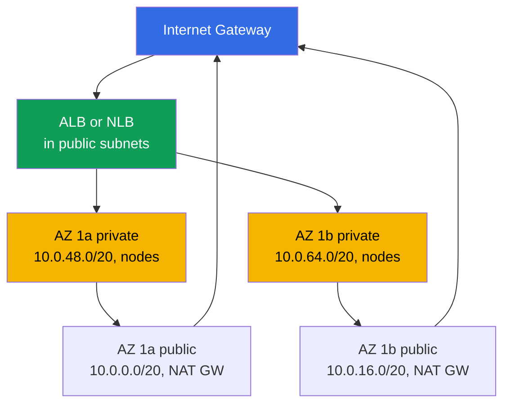
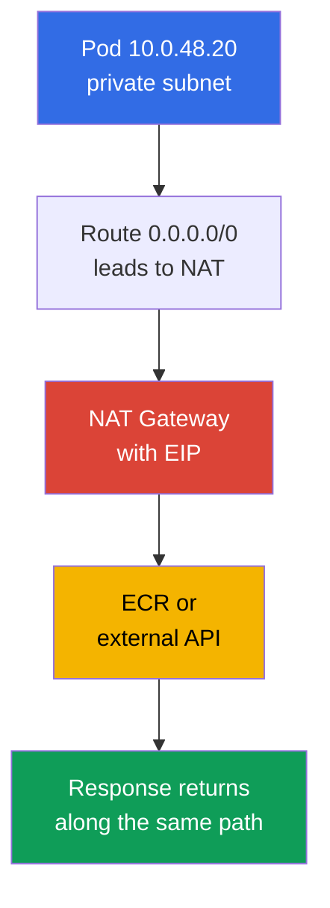
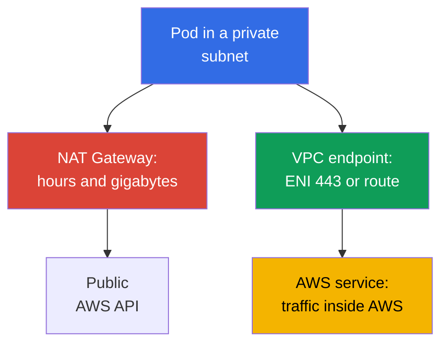

[Русская версия](ru.md) · [Versión en español](es.md) · [Version française](fr.md) · [Deutsche Version](de.md) · [ქართული ვერსია](ge.md) · [繁體中文版](tw.md) · [日本語版](jp.md)
# Chapter 0.3. VPC from Scratch: Subnets, Routing, IGW and NAT, Security Groups, VPC Endpoints

> **What's next.** Chapter 0.1 introduced regions, Availability Zones, and functional subnet tags, while chapter 0.2 covered roles and temporary keys. Now we will build the environment in which the cluster lives: the VPC network. In EKS, it is not background infrastructure but the working surface: pods take addresses from your subnets, load balancers select subnets by tags, and NAT shapes the traffic bill. Nodes (chapter 0.4), cluster networking (chapters 6 and 7), and egress (chapter 31) build on it.

## 0.3.1. VPC: an isolated network in a region and its CIDR

**VPC (Virtual Private Cloud)** is a logically isolated network within one region. Other AWS customers have their own VPCs, and address `10.0.1.15` in your network has no relation to the same address in another one. Inside a VPC, you define the address space, divide it into subnets, write routes, and configure firewall rules.

The difference from a kubeadm cluster is that in EKS **the VPC network and pod network are one network**. The standard Amazon VPC CNI does not build an overlay: every pod receives a real address from the CIDR of the subnet where its node runs and is visible in the VPC as a regular network interface (chapters 6 and 7). Therefore, the VPC size is a long-term ceiling for the number of pods.

When you create a VPC, you specify its **primary CIDR block**: masks from `/16` (65,536 addresses) to `/28`. You **cannot change or shrink it** after creation; another address plan means a new VPC and a cluster migration. You can **extend it only by adding secondary CIDRs** (up to five blocks), a practical method for a cluster that has run out of addresses (chapter 7). This leads to a common practice: reserve `/16` for a cluster even if `/20` seems enough today. Extra addresses cost nothing, while insufficient capacity is painful to fix. The range must not overlap other VPCs, the corporate network, or anything connected through peering or Transit Gateway (chapter 32).

This limitation itself determines the connectivity pattern when a VPC must connect to other networks. This chapter only distinguishes them; configuration and details are in chapter 32.

| Pattern | What it connects | Transitivity | When to use it |
|--------|------------------|--------------|----------------|
| VPC Peering | two VPCs directly | no, only 1:1 | a pair of VPCs with simple exchange |
| Transit Gateway | many VPCs and on-premises through a hub | yes, between attachments | a network of dozens of VPCs |
| VPC Lattice | services rather than subnets | at the application layer | L7 connectivity across accounts |

VPC Peering and Transit Gateway require non-overlapping CIDRs, so the address plan is coordinated at the organization level. VPC Lattice works at the service layer and does not need a shared address plan, but it concerns application connectivity rather than subnets (chapter 32).

## 0.3.2. Subnets: one AZ, public and private, EKS layout

A **subnet** is a portion of a VPC CIDR that is attached **strictly to one AZ**. A resource in a subnet physically runs in that zone: a node in `eu-central-1a` cannot move to another zone, and an EBS volume can attach only to an instance in its own AZ (chapter 0.1, chapter 23 in detail).

The difference between a public and private subnet is **not a subnet setting**, but only its route table: a public subnet has a `0.0.0.0/0` route to an Internet Gateway, while a private one routes it to a NAT Gateway or has no such route at all. There is no `public: true` flag; `MapPublicIpOnLaunch` exists, but a public address is useless without a route to an IGW. A typical EKS layout has two subnets in each AZ: public ones for load balancers and NAT Gateway, private ones for nodes and pods. The diagram shows two zones; the third is arranged the same way.



Nodes stay in private subnets: without a public address, the internet cannot reach kubelet or pods, and inbound traffic passes only through a load balancer (an internet-free cluster is chapter 19). Public subnets are needed because internet-facing ALBs and NLBs are created there and discover them by the `kubernetes.io/role/elb` tag (chapter 0.1). You pass subnets to the cluster configuration during creation, and the control plane places its interfaces there for communication with nodes, so subnets in at least two AZs are required.

```bash
# VPC subnets: zone, CIDR, available addresses
aws ec2 describe-subnets --filters "Name=vpc-id,Values=vpc-0a1b2c3d4e5f6a7b8" \
  --query 'Subnets[].[SubnetId,AvailabilityZone,AvailableIpAddressCount]' --output table
```

## 0.3.3. Route tables, IGW, and NAT Gateway: how traffic goes out

A **route table** is a list of rules that say "which network to reach through what." Every subnet has exactly one active table (without an explicit association, the VPC main route table applies). Every table contains a local route for the VPC's own CIDR: everything inside the VPC communicates directly, without gateways or NAT. An **Internet Gateway (IGW)** is the VPC gateway to the internet, one per VPC and free of charge. It opens nothing on its own: you need a public address and a route.

A **NAT Gateway** is managed NAT: instances from private subnets reach the outside world through its public address. You know the NAT mechanics from CKA; the important point is the asymmetry: an outbound connection passes, but inbound traffic from outside does not, because the internet has no return route to a private address. Therefore, a private subnet does not need separate protection from inbound traffic.



NAT Gateway is one of the most expensive line items: you pay both for every hour the gateway exists and **for every processed gigabyte**. A cluster that pulls images from ECR through NAT, writes logs to CloudWatch, and reads S3 pays for traffic that VPC endpoints can keep off NAT (section 0.3.7 and chapter 31). Hence the classic choice: **one NAT per AZ** is the production norm, because an AZ failure does not take down the egress of the others and there is no inter-AZ transfer charge; **one per region** suits dev and training environments, saving gateway hours but becoming a single point of failure.

```bash
# Subnet routes: what leads to igw-..., what leads to nat-...
aws ec2 describe-route-tables --filters "Name=vpc-id,Values=vpc-0a1b2c3d4e5f6a7b8" \
  --query 'RouteTables[].{RT:RouteTableId,R:Routes[].[DestinationCidrBlock,GatewayId]}'

# Number of NAT Gateways and the subnets in which they run
aws ec2 describe-nat-gateways --filter "Name=vpc-id,Values=vpc-0a1b2c3d4e5f6a7b8" \
  --query 'NatGateways[].[NatGatewayId,SubnetId]' --output table
```

## 0.3.4. Security groups and NACLs: two filtering layers

A **security group (SG)** is a stateful firewall at the **network interface (ENI)** level, not the subnet level. It has only allowing rules; response traffic passes automatically because an SG remembers established connections. The key feature is that a rule source can be **another security group**, not only a CIDR, so a rule that permits port 5432 from `sg-nodes` works through any change in node addresses. A **Network ACL (NACL)** is a stateless filter at the **subnet** boundary: rules are numbered and can allow or deny, but state is not tracked, so you must permit both directions, including ephemeral ports.

| Property | Security group | Network ACL |
|----------|----------------|-------------|
| Level | ENI (instance, pod, load balancer) | entire subnet |
| State | stateful, response allowed automatically | stateless, both directions required |
| Rules | allow only | allow and deny, by number |
| Rule source | CIDR **or another SG** | CIDR only |
| EKS practice | several SGs on an ENI, primary tool | left at the default |

By default, filter with security groups and change NACLs only when you need an explicit subnet-level denial: stateless rules are hard to diagnose, and traffic disappearing in exactly one direction is the typical symptom of a hand-made NACL (chapter 46).

In an EKS cluster, you will encounter three groups. The **cluster SG** (cluster security group) is created by EKS, lives on control-plane interfaces, and is attached to nodes by default; all traffic within it is allowed, so nodes and the control plane communicate without extra rules. The **node SG** is attached to instance ENIs and therefore to pods with VPC CNI: it defines database access and rules between nodes. The **load balancer SG** is created by AWS Load Balancer Controller; it accepts external traffic and is specified as the source in node SGs (chapters 26 and 27).

```bash
# SG rules, including references to other groups in UserIdGroupPairs
aws ec2 describe-security-groups --group-ids sg-0a1b2c3d4e5f6a7b8 \
  --query 'SecurityGroups[].IpPermissions'
```

What an SG or NACL filters is shown by **VPC Flow Logs**, records of accepted and rejected flows on an ENI, subnet, or the entire VPC. For SecOps and incident investigation, enable logs in CloudWatch Logs and filter by `action = REJECT`: this reveals who is attempting to reach closed ports and finds that one-way break introduced by a hand-made NACL. Rejected traffic is an order of magnitude smaller than accepted traffic, making the REJECT filter inexpensive and informative.

```
# CloudWatch Logs Insights: rejected traffic only, newest first
fields @timestamp, interfaceId, srcAddr, dstAddr, srcPort, dstPort, protocol, action
| filter action = "REJECT"
| sort @timestamp desc
| limit 50
```

## 0.3.5. How many addresses a cluster actually needs

You need to count addresses because with VPC CNI **every pod occupies an IP from its node subnet**. Pods do not live in an overlay as they do in kubeadm; literally, 40 pods on a node use 40 subnet addresses in addition to the node's own addresses. The plugin also keeps a pool of warm addresses in advance, so actual consumption exceeds the number of running pods. In addition, AWS reserves **five addresses in every subnet**: the network address, VPC router, Route 53 Resolver (the `.2` at VPC scale), a future reserve, and the final address. Therefore, `/24` has 251 usable addresses rather than 256.

| Mask | Total addresses | Available (minus 5) | What it is used for |
|------|-----------------|---------------------|---------------------|
| `/24` | 256 | 251 | public subnet for load balancers |
| `/22` | 1,024 | 1,019 | small cluster, dev |
| `/20` | 4,096 | 4,091 | practical private-subnet size for nodes |
| `/19` | 8,192 | 8,187 | large cluster or growth reserve |
| `/16` | 65,536 | 65,531 | the entire VPC |

Why `/24` for nodes runs out quickly: 251 addresses is roughly five `m5.large` nodes at a density of about 29 pods. The cluster grows within a week, pods remain `Pending` with an error such as `failed to assign an IP address`, and the remedy is no longer scaling but redesigning the network. Options (in detail in chapter 7) are **prefix delegation**, where a node receives `/28` blocks instead of individual addresses and density grows without increasing the ENI count; a **secondary CIDR** from `100.64.0.0/10` for pod subnets; and **custom networking**, where pods use separate subnets.

All three techniques work around the IPv4 ceiling. The strategic solution is **dual-stack**: the VPC receives an IPv6 `/56` block from AWS, subnets receive `/64` blocks, and in IPv6 mode pods take addresses from practically inexhaustible space, eliminating IPv4 scarcity for pods in principle. Nodes retain IPv4 for services without IPv6. Plan the subnet layout for IPv6 in advance: migrating a cluster to IPv6 is a separate topic (chapter 7).

## 0.3.6. DNS in a VPC: why nothing works without it

A VPC has two DNS attributes, and both matter. **`enableDnsSupport`** enables the built-in resolver, **Route 53 Resolver**, at the address "VPC CIDR base plus 2" (for `10.0.0.0/16`, this is `10.0.0.2`) and at `169.254.169.253`. **`enableDnsHostnames`** controls assignment of names such as `ip-10-0-48-20.eu-central-1.compute.internal` to instances.

Both must be `true` for EKS; this is a requirement rather than a recommendation. Without the resolver, **CoreDNS in the cluster cannot resolve anything outside**: its upstream is that `.2`, and pods cannot resolve either `ecr.eu-central-1.amazonaws.com` or external API addresses. Without DNS hostnames, the **private cluster endpoint** breaks: the API server name in private mode is returned through a private hosted zone, and without these attributes nodes cannot find the control plane. The same mechanism underlies external-dns and Route 53 in chapter 29.

```bash
# Check DNS attributes (one per request) and enable them when needed
aws ec2 describe-vpc-attribute --vpc-id vpc-0a1b2c3d4e5f6a7b8 --attribute enableDnsSupport
aws ec2 modify-vpc-attribute --vpc-id vpc-0a1b2c3d4e5f6a7b8 --enable-dns-hostnames
```

The built-in resolver has a ceiling that busy clusters encounter: **1,024 packets per second per network interface**, and you **cannot raise this limit** through Service Quotas. Two details make it more deceptive than it sounds. First, the limit is **shared by all link-local services**: resolver queries, IMDS calls to `169.254.169.254`, and NTP time synchronization all count against it. Second, it is measured per interface, while pods on a node use its ENIs, so they share one budget with kubelet, CNI, and every agent. When exceeded, the resolver simply drops traffic, creating an unpleasant symptom: **intermittent DNS timeouts** unrelated to a particular name. The `ndots:5` setting in pods makes this worse by turning one lookup of an external name into several queries. The standard mitigation is NodeLocal DNSCache, a local cache on the node; diagnosis and treatment of this incident class are in chapter 46.

The resolver has another property: **traffic to it cannot be filtered by either security group or NACL**. This simplifies private clusters but means DNS denial is not constructed at the network layer; instead, use policies in the cluster, where port 53 must remain an exception (chapter 30).

## 0.3.7. VPC endpoints: private access to AWS services

By default, calls to an AWS API go to a public address, so calls from a private subnet pass through NAT Gateway, with all the associated cost and the requirement not to go outside. A **VPC endpoint** removes that path: traffic to the service stays inside the AWS network. A **gateway endpoint** exists only for **S3 and DynamoDB**: it is a route-table route to a service prefix list, consumes no addresses, and **has no charge for the endpoint itself**. An **interface endpoint (AWS PrivateLink)** is an ENI with a private address in your subnets plus a private DNS name that intercepts the ordinary service address; it works for almost every service but is billed per hour in every AZ and per gigabyte, and requires an SG that permits port 443.



An internet-free cluster (chapter 19) needs a specific set; endpoint names are tied to a region and look like `com.amazonaws.eu-central-1.s3`.

| Endpoint | Type | Why the cluster needs it |
|----------|------|--------------------------|
| `com.amazonaws.eu-central-1.ecr.api` | Interface | authorization to the image registry |
| `com.amazonaws.eu-central-1.ecr.dkr` | Interface | image pulls themselves (chapter 20) |
| `com.amazonaws.eu-central-1.s3` | Gateway | ECR image layers are stored in S3 |
| `com.amazonaws.eu-central-1.sts` | Interface | IRSA and exchanging a token for keys (chapter 16) |
| `com.amazonaws.eu-central-1.ec2` | Interface | controllers and CNI: ENIs, instances |
| `com.amazonaws.eu-central-1.elasticloadbalancing` | Interface | LB Controller (chapter 26) |
| `com.amazonaws.eu-central-1.logs` | Interface | logs in CloudWatch (chapter 34) |

Notice the dependency: without an S3 gateway endpoint, a private cluster still cannot download an image because ECR layers are stored in S3. This is the most common mistake during the first attempt to disconnect a cluster from the internet. The economics are straightforward: if tens of gigabytes per month reach a service through NAT, an interface endpoint pays for itself immediately; if there is almost no traffic, three ENIs in three zones can cost more than NAT (chapter 31).

It is also important to know about an **endpoint policy**, a resource policy on the endpoint itself that exists for both gateway and interface types. Crucially, **it allows everything by default**, so an endpoint created "to avoid paying for NAT" restricts nothing. Restricting it is useful because an endpoint is the only point that exposes the request **direction**. A compromised pod with valid permissions can upload data to a **foreign** S3 bucket, and an IAM role policy does not prevent it if it contains `s3:PutObject` on `*`. An endpoint policy closes this gap: it permits access only to resources in your organization (`aws:ResourceOrgID`) or to listed accounts (`aws:PrincipalAccount`), so a request to an external bucket through your endpoint is blocked.

The reverse problem is solved by the bucket policy: `aws:SourceVpce` and `aws:PrincipalOrgID` conditions in a bucket policy answer the question of who may access **my** bucket and protect it from access that bypasses your network. These are two different controls and should not be confused: the endpoint policy protects against exfiltration, while the bucket policy protects your own bucket. Together, they form what AWS calls a data perimeter; in a private cluster, this is a standard part of hardening (chapter 19).

```bash
# Gateway endpoint for S3: route in the specified route tables, no endpoint charge
aws ec2 create-vpc-endpoint --vpc-id vpc-0a1b2c3d4e5f6a7b8 \
  --vpc-endpoint-type Gateway --service-name com.amazonaws.eu-central-1.s3 \
  --route-table-ids rtb-0aaa1111 rtb-0bbb2222

# Interface endpoint for ECR: ENIs in private subnets, private DNS enabled
aws ec2 create-vpc-endpoint --vpc-id vpc-0a1b2c3d4e5f6a7b8 \
  --vpc-endpoint-type Interface --service-name com.amazonaws.eu-central-1.ecr.dkr \
  --subnet-ids subnet-0aaa subnet-0bbb --security-group-ids sg-0a1b --private-dns-enabled
```

## 0.3.8. What a VPC looks like in IaC

Create a VPC manually once to understand the mechanics. In real life, everything is described as code, and this is essential: the address plan, subnet tags, number of NAT Gateways, and endpoint set are precisely the things that cannot be changed on a live system and must be reproducible. A typical Terraform resource set is `aws_vpc` with CIDR and DNS attributes, `aws_subnet` for each AZ and role, `aws_internet_gateway`, `aws_nat_gateway` with EIP, `aws_route_table` with routes and associations, `aws_security_group`, and `aws_vpc_endpoint`; the usual base is the `terraform-aws-modules/vpc/aws` module.

The code must include `kubernetes.io/role/elb` tags on public subnets, `kubernetes.io/role/internal-elb` on private subnets, and `karpenter.sh/discovery` on subnets and SGs (chapter 0.1); `enable_dns_hostnames` and `enable_dns_support`; spare capacity in subnet masks to account for pod growth; and the VPC endpoint set as part of the network stack. In the course labs, the VPC is not created through console clicks: a dedicated `vpc` stack in Terragrunt provisions the network with the required layout and tags, and the cluster stack takes its identifiers through dependencies (chapter 0.5).

## 0.3.9. How this is applied in production

- **Coordinate the address plan before creating the cluster.** Use `/16` for the VPC, `/20` or larger for private node subnets, three AZs, and no overlap with the corporate network.
- **Keep nodes only in private subnets;** public subnets are for load balancers and NAT. Nodes in production do not have public addresses.
- **Use one NAT per AZ and always an S3 gateway endpoint.** Expand the set of interface endpoints based on actual demand: observe where traffic leaves through NAT and close the largest flows.
- **Describe access with SG references,** not CIDR lists: rules survive node replacement. Keep the NACL at its default unless there is an explicit security requirement.

## 0.3.10. Mini glossary

- **VPC** is an isolated network in a region; its primary CIDR (`/16` ... `/28`) is immutable and can be extended only with a secondary CIDR. A **subnet** is a part of a VPC CIDR in one AZ.
- A **route table** is the subnet routing table; public and private subnets differ only in their default route. An **Internet Gateway** is the free internet gateway for public addresses. A **NAT Gateway** is managed NAT, billed per hour and gigabyte.
- A **security group** is a stateful ENI firewall with allow-only rules whose source can be another SG. A **Network ACL** is a stateless subnet filter with allow and deny rules by rule number.
- An **ENI** is a network interface; with VPC CNI, pods receive addresses on the node ENI. **Route 53 Resolver** is the built-in VPC DNS at "CIDR plus 2," the upstream for CoreDNS. A **VPC endpoint** provides private access to an AWS service: gateway (S3, DynamoDB) or interface (PrivateLink).
- **Dual-stack** is a VPC and subnets with IPv4 and IPv6 (`/56` and `/64`); IPv6 mode removes address exhaustion for pods. **VPC Flow Logs** record accepted and rejected flows; the `action = REJECT` filter in CloudWatch Logs Insights is a SecOps and diagnostic tool.

## 0.3.11. Chapter summary

- You cannot shrink or change a VPC primary CIDR, so use `/16` with room to grow; extension is only through a secondary CIDR (chapter 7). A subnet belongs to one AZ.
- A `0.0.0.0/0` route to an IGW makes a subnet public; a route to NAT or no such route makes it private. For EKS, nodes belong in private subnets and load balancers in public ones.
- NAT Gateway provides outbound access and creates no return path inward. You pay per hour and gigabyte; one NAT per AZ gives resilience, while one per region saves money but is a single point of failure (chapter 31).
- A security group is stateful at the ENI layer and is the primary filtering tool, with rules that reference other SGs. A NACL is stateless at the subnet layer and usually remains at its default.
- With VPC CNI, a pod consumes a subnet IP, AWS reserves five addresses, and `/24` for nodes runs out almost immediately. Next come prefix delegation, secondary CIDR, or custom networking (chapters 6 and 7). `enableDnsSupport` and `enableDnsHostnames` are mandatory: CoreDNS uses the `.2` resolver and the private cluster endpoint depends on DNS names.
- VPC endpoints keep traffic off NAT and enable an internet-free cluster. The minimum set is `ecr.api`, `ecr.dkr`, `s3` (gateway), `sts`, `ec2`, and `elasticloadbalancing` (chapters 19 and 31).

## 0.3.12. How this helps in real work

Half of EKS incidents live in this chapter. A pod is `Pending` with no scheduler events: check available subnet addresses. A node did not join the cluster: check the route, SG, or a missing endpoint (chapter 45). A load balancer was not created: a subnet tag is missing. Traffic disappeared in one direction: a hand-made NACL is the likely cause. The bill rose by a third: inspect NAT and traffic between zones. The most important decision is made once, before the first cluster: what is your address plan?

## 0.3.13. Self-check questions

1. Why should a VPC primary CIDR include spare capacity, and what should you do when addresses run out?
2. How does a public subnet differ from a private one at the AWS configuration level?
3. Why is a subnet attached to one AZ, and how does this affect PVCs and nodes?
4. How does traffic from a private subnet reach the internet, and why cannot it return in the other direction?
5. One NAT Gateway per region versus one per AZ: which should you choose in production, and why?
6. How does a security group differ from a NACL, and which should you use by default?
7. How many addresses are available in a `/24` subnet, and how many nodes does that support with VPC CNI?
8. Why does a VPC need `enableDnsSupport` and `enableDnsHostnames`?
9. Which VPC endpoints are mandatory for an internet-free cluster, and why is S3 among them?
10. How does dual-stack eliminate IPv4 scarcity for pods, and what remains on IPv4?
11. How does VPC Peering differ from Transit Gateway, and where is VPC Lattice appropriate?
12. Why filter VPC Flow Logs by `action = REJECT`, and what does it help find?

## Practice

Part 0 has no labs of its own: the network is created by the `vpc` stack in the course labs (chapter 0.5), where you will see the same subnet layout, tags, and endpoints as code. Next come EC2 and pricing models: instance types, AMIs, on-demand, spot, and Savings Plans, in other words, everything used to build the nodes that you have just placed in private subnets.

---
[Contents](../README.md) · [Chapter 0.2](../00-2-iam/en.md) · [Chapter 0.4](../00-4-ec2/en.md)
