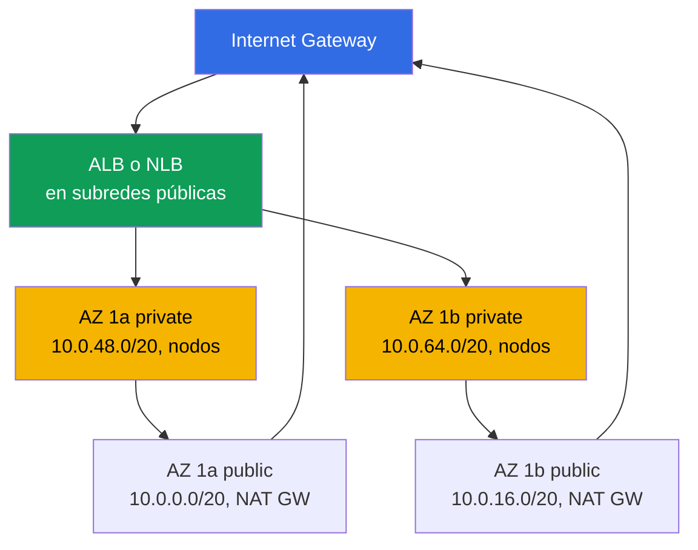
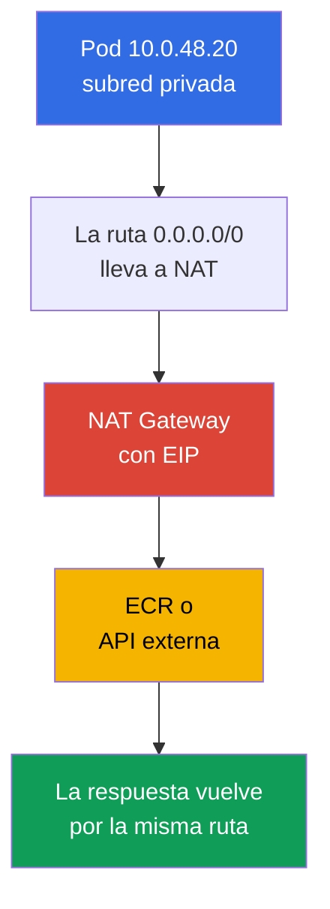
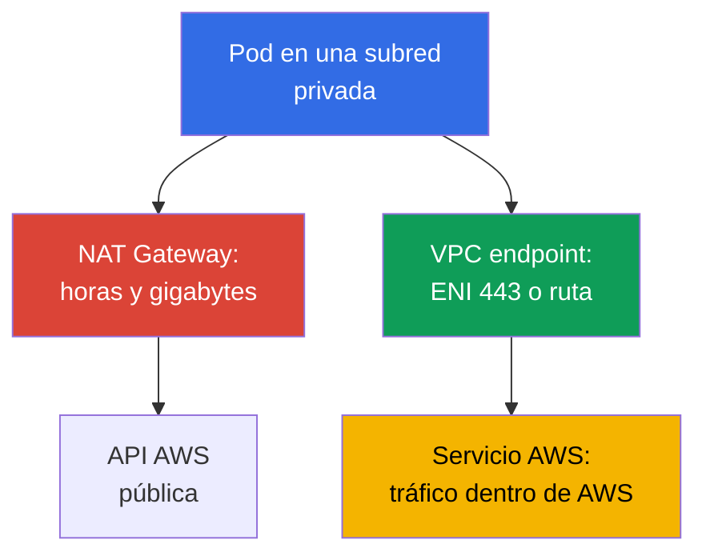

[Русская версия](ru.md) · [Eng version](en.md) · [Version française](fr.md) · [Deutsche Version](de.md) · [ქართული ვერსია](ge.md) · [繁體中文版](tw.md) · [日本語版](jp.md)
# Capítulo 0.3. VPC desde cero: subredes, enrutamiento, IGW y NAT, security groups, VPC endpoints

> **Qué sigue.** En el capítulo 0.1 aparecieron la región, las zonas de disponibilidad y las etiquetas funcionales en las subredes, y en el capítulo 0.2, los roles y las claves temporales. Ahora construiremos el entorno donde vive el clúster: la red VPC. En EKS no es un fondo, sino la superficie de trabajo: los pods toman direcciones de tus subredes, los balanceadores eligen subredes por etiquetas y NAT determina la factura de tráfico. Sobre esto se apoyarán los nodos (capítulo 0.4), la red del clúster (capítulos 6 y 7) y egress (capítulo 31).

## 0.3.1. VPC: red aislada en una región y su CIDR

**VPC (Virtual Private Cloud)** es una red lógicamente aislada dentro de una región. Los clientes vecinos de AWS tienen sus propias VPC, y la dirección `10.0.1.15` de tu red no está relacionada con la misma dirección de otra. Dentro de una VPC defines el espacio de direcciones, lo divides en subredes y escribes las rutas y reglas de firewall.

La diferencia respecto a un clúster kubeadm es que en EKS **la red VPC y la red de pods son una sola red**. Amazon VPC CNI estándar no crea un overlay: cada pod obtiene una dirección real del CIDR de la subred donde está el nodo y aparece en la VPC como una interfaz de red normal (capítulos 6 y 7). Por eso, el tamaño de la VPC es el límite elegido por adelantado y a largo plazo para el número de pods.

Al crear una VPC se especifica el **bloque CIDR principal**: máscaras desde `/16` (65 536 direcciones) hasta `/28`. **No se puede cambiar ni reducir** después de crearla, otro plan de direcciones significa una VPC nueva y migrar el clúster; **solo se puede ampliar añadiendo un secondary CIDR** (hasta cinco bloques), una técnica práctica para un clúster que se queda sin direcciones (capítulo 7). De aquí viene la práctica: para un clúster se toma `/16`, aunque hoy «también bastaría /20». Las direcciones de más no cuestan nada; la falta se corrige dolorosamente. Solo hay una limitación: el rango no debe solaparse con otras VPC, con la red corporativa ni con lo que conectes mediante peering o Transit Gateway (capítulo 32).

Esta limitación determina la elección del patrón de conectividad cuando debes conectar la VPC con otras redes. Aquí solo hacemos la distinción; la configuración y los detalles están en el capítulo 32.

| Patrón | Qué conecta | Transitividad | Cuándo se usa |
|--------|-------------|---------------|---------------|
| VPC Peering | dos VPC directamente | no, solo 1:1 | un par de VPC, intercambio sencillo |
| Transit Gateway | muchas VPC y on-prem mediante un hub | sí, entre adjuntos | red de decenas de VPC |
| VPC Lattice | servicios, no subredes | en el nivel de aplicaciones | conectividad L7 entre cuentas |

VPC Peering y Transit Gateway requieren CIDR sin solapamientos, por lo que el plan de direcciones se coordina a nivel de la organización. VPC Lattice funciona a nivel de servicios y no requiere un plan de direcciones compartido, pero eso ya trata de conectividad de aplicaciones, no de subredes (capítulo 32).

## 0.3.2. Subredes: una AZ, pública y privada, distribución para EKS

**Una subred (subnet)** es una parte del CIDR de una VPC vinculada **estrictamente a una sola AZ**. Un recurso de la subred reside físicamente en su zona: un nodo de `eu-central-1a` no se moverá a otra zona y un volumen EBS solo se monta en una instancia de su AZ (capítulo 0.1, en detalle en el capítulo 23).

La diferencia entre una subred pública y una privada **no está en la configuración de la subred**, sino solo en su tabla de enrutamiento: la pública tiene una ruta `0.0.0.0/0` hacia Internet Gateway y la privada la lleva hacia NAT Gateway o no la tiene en absoluto. No existe la bandera `public: true`; existe `MapPublicIpOnLaunch`, pero sin una ruta hacia IGW una dirección pública es inútil. La distribución típica para EKS es dos subredes en cada AZ: las públicas se asignan a los balanceadores y NAT Gateway, las privadas a nodos y pods. El diagrama muestra dos zonas; la tercera se organiza igual.



Los nodos se mantienen en subredes privadas: sin una dirección pública no se puede alcanzar kubelet ni los pods desde Internet, y el tráfico entrante solo pasa por el balanceador (clúster sin Internet, capítulo 19). Las subredes públicas son necesarias porque los ALB y NLB internet-facing se crean justamente allí y las encuentran por la etiqueta `kubernetes.io/role/elb` (capítulo 0.1). Las subredes se pasan a la configuración del clúster al crearlo y el control plane coloca en ellas sus interfaces para comunicarse con los nodos, por lo que son obligatorias subredes en al menos dos AZ.

```bash
# Subredes de la VPC: zona, CIDR, direcciones libres
aws ec2 describe-subnets --filters "Name=vpc-id,Values=vpc-0a1b2c3d4e5f6a7b8" \
  --query 'Subnets[].[SubnetId,AvailabilityZone,AvailableIpAddressCount]' --output table
```

## 0.3.3. Route table, IGW y NAT Gateway: cómo sale el tráfico

**Route table** es una lista de reglas «a qué red ir y a través de qué». Cada subred tiene exactamente una tabla activa (sin una asociación explícita funciona la main route table de la VPC). Toda tabla tiene una ruta local al CIDR de la VPC: dentro de la VPC todo se comunica directamente, sin gateways ni NAT. **Internet Gateway (IGW)** es el gateway de la VPC hacia Internet, uno por VPC y gratuito; por sí solo no abre nada, hace falta una dirección pública y una ruta.

**NAT Gateway** es NAT administrado: las instancias de subredes privadas salen al exterior con su dirección pública. Ya conoces la mecánica de NAT de CKA; importa la asimetría: la conexión saliente pasa, la entrante desde fuera no, y no existe una ruta de regreso a una dirección privada en Internet. Por eso, una subred privada no necesita una protección separada contra el tráfico entrante.



NAT Gateway es una de las partidas más caras de la factura: se paga tanto por cada hora de existencia del gateway como **por cada gigabyte procesado**. Un clúster que descarga imágenes de ECR mediante NAT, escribe logs en CloudWatch y lee S3 paga por tráfico que se puede desviar a VPC endpoints (sección 0.3.7 y capítulo 31). De ahí la elección clásica: **uno NAT por AZ** es la norma en producción, la caída de una zona no elimina el egress de las demás y no hay coste de transferencia inter-AZ; **uno por región** sirve para entornos dev y de formación, ahorra horas de gateway, pero se convierte en un único punto de fallo.

```bash
# Rutas de las subredes: qué lleva a igw-... y qué a nat-...
aws ec2 describe-route-tables --filters "Name=vpc-id,Values=vpc-0a1b2c3d4e5f6a7b8" \
  --query 'RouteTables[].{RT:RouteTableId,R:Routes[].[DestinationCidrBlock,GatewayId]}'

# Cuántos NAT Gateway hay y en qué subredes están
aws ec2 describe-nat-gateways --filter "Name=vpc-id,Values=vpc-0a1b2c3d4e5f6a7b8" \
  --query 'NatGateways[].[NatGatewayId,SubnetId]' --output table
```

## 0.3.4. Security groups y NACL: dos niveles de filtrado

**Security group (SG)** es un firewall stateful en el nivel de la **interfaz de red (ENI)**, no de la subred. Solo tiene reglas de permiso; el tráfico de respuesta pasa por sí solo porque el SG recuerda las conexiones establecidas. La característica clave es que la fuente de una regla puede ser **otro security group**, no solo un CIDR, y la entrada «permitir el puerto 5432 desde `sg-nodes`» funciona ante cualquier cambio de direcciones de los nodos. **Network ACL (NACL)** es un filtro stateless en el borde de la **subred**: sus reglas están numeradas, hay allow y deny, pero no se sigue el estado, por lo que debes permitir ambos sentidos, incluidos los puertos ephemeral.

| Propiedad | Security group | Network ACL |
|----------|----------------|-------------|
| Nivel | ENI (instancia, pod, balanceador) | subred completa |
| Estado | stateful, la respuesta se permite sola | stateless, se requieren ambos sentidos |
| Reglas | solo allow | allow y deny, por número |
| Fuente en la regla | CIDR **u otro SG** | solo CIDR |
| Práctica en EKS | varios SG por ENI, herramienta principal | se deja el predeterminado |

Por defecto, filtra con security groups y toca NACL solo cuando necesites una denegación explícita en el nivel de la subred: las reglas stateless son difíciles de diagnosticar y «el tráfico desapareció exactamente en un sentido» es un síntoma típico de una NACL creada a mano (capítulo 46).

En un clúster EKS encontrarás tres grupos. El **SG del clúster** (cluster security group) lo crea EKS, vive en las interfaces del control plane y de forma predeterminada se adjunta a los nodos; dentro de él se permite todo el tráfico, de modo que nodos y control plane se comunican sin reglas adicionales. El **SG de los nodos** está en los ENI de las instancias y, por tanto, también en los pods con VPC CNI: aquí se describe el acceso a bases de datos y las reglas entre nodos. El **SG de los balanceadores** lo crea AWS Load Balancer Controller; recibe tráfico externo y se indica como fuente en el SG de los nodos (capítulos 26 y 27).

```bash
# Reglas de SG, incluidas referencias a otros grupos en UserIdGroupPairs
aws ec2 describe-security-groups --group-ids sg-0a1b2c3d4e5f6a7b8 \
  --query 'SecurityGroups[].IpPermissions'
```

Lo que SG o NACL filtran exactamente lo muestran los **VPC Flow Logs**, registros de flujos aceptados y rechazados en un ENI, una subred o toda la VPC. Para SecOps e investigación de incidentes, se activan logs en CloudWatch Logs y se filtran por `action = REJECT`: así ves quién intenta conectarse a puertos cerrados y encuentras ese corte unidireccional de una NACL creada a mano. El tráfico rechazado es un orden de magnitud menor que el aceptado, por lo que el filtro REJECT es económico e informativo.

```
# CloudWatch Logs Insights: solo tráfico rechazado, lo más reciente arriba
fields @timestamp, interfaceId, srcAddr, dstAddr, srcPort, dstPort, protocol, action
| filter action = "REJECT"
| sort @timestamp desc
| limit 50
```

## 0.3.5. Cuántas direcciones necesita realmente un clúster

Debes contar direcciones porque con VPC CNI **cada pod ocupa una IP de la subred del nodo**. No es que «los pods vivan en un overlay», como en kubeadm, sino literalmente: 40 pods en un nodo son 40 direcciones de la subred más las direcciones del propio nodo. El plugin además mantiene de antemano un pool de direcciones calientes, por lo que el consumo real es mayor que el número de pods en ejecución. AWS reserva además **5 direcciones en cada subred**: la dirección de red, el VPC router, Route 53 Resolver (el conocido `.2` a escala de VPC), una reserva futura y la última dirección. Por ello, en `/24` hay 251 direcciones disponibles, no 256.

| Máscara | Total de direcciones | Disponibles (menos 5) | Para qué se usa |
|-------|----------------------|-----------------------|-----------------|
| `/24` | 256 | 251 | subred pública para balanceadores |
| `/22` | 1 024 | 1 019 | clúster pequeño, dev |
| `/20` | 4 096 | 4 091 | tamaño operativo de subred privada para nodos |
| `/19` | 8 192 | 8 187 | clúster grande o reserva de crecimiento |
| `/16` | 65 536 | 65 531 | toda la VPC |

Por qué `/24` para nodos se agota rápido: 251 direcciones son aproximadamente 5 nodos de tipo `m5.large` con una densidad de unos 29 pods. El clúster crece en una semana, los pods empiezan a quedarse en `Pending` con un error como `failed to assign an IP address`, y ya no se corrige escalando, sino replanteando la red. Las opciones (en detalle en el capítulo 7) son: **prefix delegation**, donde el nodo recibe bloques `/28` en lugar de direcciones individuales y aumenta la densidad sin aumentar el número de ENI; **secondary CIDR** desde `100.64.0.0/10` para subredes de pods; **custom networking**, con pods en subredes separadas.

Las tres técnicas evitan el límite de IPv4. La salida estratégica es **dual-stack**: la VPC recibe un bloque IPv6 `/56` de AWS, las subredes reciben `/64` y, en modo IPv6, los pods toman direcciones de un espacio prácticamente inagotable, eliminando en principio la escasez de IPv4 para pods. Los nodos conservan IPv4 para servicios sin IPv6. La distribución de subredes se planea teniendo IPv6 en cuenta desde el principio: migrar el clúster a IPv6 es un tema aparte (capítulo 7).

## 0.3.6. DNS en VPC: por qué sin él no funciona nada

Una VPC tiene dos atributos DNS y ambos son importantes. **`enableDnsSupport`** activa el resolver integrado, **Route 53 Resolver**, en la dirección «base del CIDR de la VPC más 2» (para `10.0.0.0/16` es `10.0.0.2`) y en `169.254.169.253`. **`enableDnsHostnames`** se ocupa de asignar a las instancias nombres como `ip-10-0-48-20.eu-central-1.compute.internal`.

Para EKS ambos deben ser `true`; es un requisito, no una recomendación. Sin resolver, **CoreDNS del clúster no resolverá nada externo**: su upstream es ese mismo `.2` y los pods no resolverán ni `ecr.eu-central-1.amazonaws.com` ni las direcciones de API externas. Sin DNS hostnames, se rompe el **endpoint privado del clúster**: el nombre del API server en modo privado se entrega mediante una private hosted zone y, sin estos atributos, los nodos no encontrarán el control plane. El mismo mecanismo está detrás de external-dns y Route 53 en el capítulo 29.

```bash
# Comprobar el atributo DNS (uno por solicitud) y activarlo si es necesario
aws ec2 describe-vpc-attribute --vpc-id vpc-0a1b2c3d4e5f6a7b8 --attribute enableDnsSupport
aws ec2 modify-vpc-attribute --vpc-id vpc-0a1b2c3d4e5f6a7b8 --enable-dns-hostnames
```

El resolver integrado tiene un límite que afecta a clústeres con carga: **1024 paquetes por segundo por interfaz de red**, y este límite **no se puede aumentar** mediante Service Quotas. Dos detalles lo hacen más engañoso de lo que parece. Primero, el límite es **compartido por todos los servicios link-local**: suma consultas al resolver, solicitudes a IMDS en `169.254.169.254` y sincronización de tiempo por NTP. Segundo, se cuenta por interfaz y los pods del nodo están en su ENI, por lo que comparten un presupuesto con kubelet, CNI y todos los agentes. Al superarlo, el resolver simplemente descarta tráfico y el síntoma es desagradable: no un fallo, sino **timeouts DNS intermitentes** sin relación con un nombre concreto. Todo empeora con `ndots:5` en los pods, que convierte una consulta a un nombre externo en varias solicitudes. La mitigación estándar es NodeLocal DNSCache, una caché local en el nodo; el diagnóstico y tratamiento de esta clase de incidentes están en el capítulo 46.

Otra característica del resolver es que **su tráfico no se puede filtrar ni con security group ni con NACL**. Esto simplifica los clústeres privados, pero significa que la denegación de DNS no se construye en la capa de red, sino mediante políticas en el clúster, donde el puerto 53 debe permanecer como excepción (capítulo 30).

## 0.3.7. VPC endpoints: acceso privado a servicios AWS

Por defecto, una llamada a la API de AWS se dirige a una dirección pública, es decir, desde una subred privada pasa por NAT Gateway, con todas las consecuencias de coste y del requisito «no salimos al exterior». Un **VPC endpoint** elimina esta ruta: el tráfico hacia el servicio permanece dentro de la red AWS. Un **Gateway endpoint** solo existe para **S3 y DynamoDB**: es una ruta en una route table hacia la prefix list del servicio, no consume direcciones y **no se paga por el endpoint en sí**. Un **Interface endpoint (AWS PrivateLink)** es un ENI con una dirección privada en tus subredes más un nombre DNS privado que intercepta la dirección normal del servicio; funciona para casi todos los servicios, pero se paga por hora en cada AZ y por gigabytes, y requiere un SG que permita el puerto 443.



Un clúster sin salida a Internet (capítulo 19) necesita un conjunto concreto; los nombres de endpoint dependen de la región y tienen este aspecto: `com.amazonaws.eu-central-1.s3`.

| Endpoint | Tipo | Para qué lo necesita el clúster |
|----------|------|---------------------------------|
| `com.amazonaws.eu-central-1.ecr.api` | Interface | autorización en el registro de imágenes |
| `com.amazonaws.eu-central-1.ecr.dkr` | Interface | el pull de imágenes (capítulo 20) |
| `com.amazonaws.eu-central-1.s3` | Gateway | las capas de imágenes ECR están en S3 |
| `com.amazonaws.eu-central-1.sts` | Interface | IRSA e intercambio de token por claves (capítulo 16) |
| `com.amazonaws.eu-central-1.ec2` | Interface | controladores y CNI: ENI, instancias |
| `com.amazonaws.eu-central-1.elasticloadbalancing` | Interface | LB Controller (capítulo 26) |
| `com.amazonaws.eu-central-1.logs` | Interface | logs en CloudWatch (capítulo 34) |

Observa la conexión: sin un gateway endpoint para S3, un clúster privado tampoco descargará una imagen, porque las capas de ECR se almacenan en S3. Es el error más frecuente en el primer intento de aislar un clúster de Internet. El beneficio se calcula fácilmente: si decenas de gigabytes al mes van al servicio mediante NAT, un interface endpoint se amortiza de inmediato; si apenas hay tráfico, tres ENI en tres zonas pueden resultar más caros que NAT (capítulo 31).

También conviene conocer la **endpoint policy**, una política de recursos en el propio endpoint, que existe tanto para tipos gateway como interface. Importante: **de forma predeterminada permite todo**, es decir, un endpoint levantado «para no pagar NAT» no limita nada. Y conviene limitarlo porque el endpoint es el único punto donde se ve la **dirección** de una solicitud. Un pod comprometido con permisos válidos puede cargar datos en un bucket S3 **ajeno**, y una política IAM del rol no lo impide si contiene `s3:PutObject` sobre `*`. La endpoint policy cierra precisamente esto: permite acceso solo a recursos de tu organización (`aws:ResourceOrgID`) o cuentas enumeradas (`aws:PrincipalAccount`), y la solicitud hacia un bucket externo no pasa por tu endpoint.

La tarea inversa la resuelve la política del bucket: las condiciones `aws:SourceVpce` y `aws:PrincipalOrgID` de una bucket policy responden a la pregunta «quién puede acceder a **mi** bucket» y lo protegen de acceso fuera de tu red. Son dos controles diferentes y no deben confundirse: endpoint policy protege de la fuga hacia afuera y bucket policy cierra tu propio bucket. Juntas forman lo que AWS llama data perimeter; en un clúster privado es una parte estándar del hardening (capítulo 19).

```bash
# Gateway endpoint para S3: ruta en las route tables indicadas, sin coste
aws ec2 create-vpc-endpoint --vpc-id vpc-0a1b2c3d4e5f6a7b8 \
  --vpc-endpoint-type Gateway --service-name com.amazonaws.eu-central-1.s3 \
  --route-table-ids rtb-0aaa1111 rtb-0bbb2222

# Interface endpoint para ECR: ENI en subredes privadas, DNS privado activado
aws ec2 create-vpc-endpoint --vpc-id vpc-0a1b2c3d4e5f6a7b8 \
  --vpc-endpoint-type Interface --service-name com.amazonaws.eu-central-1.ecr.dkr \
  --subnet-ids subnet-0aaa subnet-0bbb --security-group-ids sg-0a1b --private-dns-enabled
```

## 0.3.8. Cómo se ve VPC en IaC

Una VPC se crea manualmente una vez para entender la mecánica. En realidad, todo se describe como código, y esto es fundamental: el plan de direcciones, las etiquetas de subred, el número de NAT y el conjunto de endpoints son precisamente aquello que no se puede cambiar «en vivo» y que debe ser reproducible. El conjunto típico de recursos en Terraform es `aws_vpc` con CIDR y atributos DNS, `aws_subnet` uno por AZ y rol, `aws_internet_gateway`, `aws_nat_gateway` con EIP, `aws_route_table` con rutas y asociaciones, `aws_security_group` y `aws_vpc_endpoint`; normalmente se usa encima el módulo `terraform-aws-modules/vpc/aws`.

El código debe incluir: etiquetas `kubernetes.io/role/elb` en subredes públicas y `kubernetes.io/role/internal-elb` en privadas, además de `karpenter.sh/discovery` en subredes y SG (capítulo 0.1); `enable_dns_hostnames` y `enable_dns_support`; margen en las máscaras de subred teniendo en cuenta el crecimiento de pods; y el conjunto de VPC endpoints como parte del stack de red. En los laboratorios del curso, VPC no se crea mediante clics: hay un stack `vpc` separado en Terragrunt que crea la red con la distribución y etiquetas necesarias, y el stack del clúster toma sus identificadores mediante dependencias (capítulo 0.5).

## 0.3.9. Cómo se aplica en producción

- **El plan de direcciones se acuerda antes de crear el clúster.** `/16` para la VPC, `/20` y mayores para subredes privadas de nodos, tres AZ y ningún solapamiento con la red corporativa.
- **Los nodos solo van en subredes privadas;** las públicas se asignan a balanceadores y NAT; no hay direcciones públicas en nodos de prod.
- **Un NAT por AZ y siempre un S3 gateway endpoint.** El conjunto de interface endpoints se amplía según los hechos: se observa a dónde sale el tráfico por NAT y se cierran los flujos grandes.
- **El acceso se describe con referencias a SG,** no con listas CIDR: las reglas sobreviven a la recreación de nodos. NACL se queda predeterminada si no existe un requisito de seguridad explícito.

## 0.3.10. Mini glosario

- **VPC** es una red aislada en una región; su CIDR principal (`/16` ... `/28`) no se puede modificar y solo se amplía mediante secondary CIDR. Una **subred** es parte del CIDR VPC en una AZ.
- **Route table** es la tabla de rutas de una subred; la subred pública y privada solo se diferencian por su ruta predeterminada. **Internet Gateway** es el gateway gratuito hacia Internet para direcciones públicas. **NAT Gateway** es NAT administrado, con coste por hora y gigabyte.
- **Security group** es un firewall stateful en un ENI, solo allow, cuya fuente puede ser otro SG. **Network ACL** es un filtro stateless en una subred, con allow y deny según números de regla.
- **ENI** es una interfaz de red; con VPC CNI los pods obtienen direcciones en el ENI del nodo. **Route 53 Resolver** es el DNS integrado de VPC en la dirección «CIDR más 2», upstream para CoreDNS. Un **VPC endpoint** es acceso privado a un servicio AWS: gateway (S3, DynamoDB) o interface (PrivateLink).
- **Dual-stack** son VPC y subredes con IPv4 e IPv6 (`/56` y `/64`); el modo IPv6 elimina la escasez de direcciones para pods. **VPC Flow Logs** son registros de flujos aceptados y rechazados; el filtro `action = REJECT` en CloudWatch Logs Insights es una herramienta de SecOps y diagnóstico.

## 0.3.11. Resumen del capítulo

- El CIDR principal de VPC no se puede reducir ni cambiar, por eso se toma `/16` con margen; la ampliación solo es mediante secondary CIDR (capítulo 7). Una subred vive en una AZ.
- Una ruta `0.0.0.0/0` hacia IGW hace pública una subred; una ruta a NAT, o su ausencia, la hace privada. Para EKS: nodos en subredes privadas, balanceadores en públicas.
- NAT Gateway proporciona acceso saliente y no crea una ruta de vuelta hacia dentro. Se paga por hora y gigabytes; un NAT por AZ ofrece tolerancia a fallos, uno por región aporta ahorro y un único punto de fallo (capítulo 31).
- Security group es stateful en ENI y la herramienta principal de filtrado, con reglas que referencian otros SG. NACL es stateless en la subred y normalmente se deja predeterminada.
- Con VPC CNI un pod ocupa una IP de subred, AWS reserva 5 direcciones y `/24` para nodos se agota casi de inmediato: después vienen prefix delegation, secondary CIDR o custom networking (capítulos 6 y 7). `enableDnsSupport` y `enableDnsHostnames` son obligatorios: CoreDNS usa el resolver `.2` y el endpoint privado del clúster depende de nombres DNS.
- VPC endpoints sacan tráfico de NAT y hacen posible un clúster sin Internet. El mínimo es `ecr.api`, `ecr.dkr`, `s3` (gateway), `sts`, `ec2`, `elasticloadbalancing` (capítulos 19, 31).

## 0.3.12. Cómo será útil en el trabajo real

La mitad de los incidentes de EKS vive en este capítulo. Un pod en `Pending` sin eventos del scheduler: revisa las direcciones libres de la subred. Un nodo no se unió al clúster: ruta, SG o endpoint ausente (capítulo 45). Un balanceador no se creó: falta una etiqueta en las subredes. El tráfico desapareció en un sentido: NACL creada a mano. La factura creció un tercio: NAT y tráfico entre zonas. Y la decisión más importante se toma una sola vez, antes del primer clúster: cuál es tu plan de direcciones.

## 0.3.13. Preguntas de autoevaluación

1. ¿Por qué se toma el CIDR principal de VPC con margen y qué se hace si se acaban las direcciones?
2. ¿En qué se diferencia una subred pública de una privada en el nivel de configuración de AWS?
3. ¿Por qué una subred está vinculada a una sola AZ y cómo afecta esto a PVC y nodos?
4. ¿Cómo llega el tráfico de una subred privada a Internet y por qué no puede volver?
5. ¿Un NAT Gateway por región frente a uno por AZ: cuál elegir en prod y por qué?
6. ¿En qué se diferencia un security group de NACL y cuál se usa de forma predeterminada?
7. ¿Cuántas direcciones hay disponibles en una subred `/24` y para cuántos nodos alcanzan con VPC CNI?
8. ¿Por qué una VPC necesita `enableDnsSupport` y `enableDnsHostnames`?
9. ¿Qué VPC endpoints son obligatorios para un clúster sin Internet y por qué S3 está entre ellos?
10. ¿Cómo elimina dual-stack la escasez de IPv4 para pods y qué se mantiene en IPv4?
11. ¿En qué se diferencia VPC Peering de Transit Gateway y dónde es apropiado VPC Lattice?
12. ¿Por qué filtrar VPC Flow Logs por `action = REJECT` y qué ayuda a encontrar?

## Práctica

La Parte 0 no tiene laboratorios propios: la red se crea mediante el stack `vpc` en los laboratorios del curso (capítulo 0.5), donde verás la misma distribución de subredes, etiquetas y endpoints ya como código. A continuación vienen EC2 y los modelos de pago: tipos de instancia, AMI, on-demand, spot y Savings Plans, es decir, todo lo que forma los nodos que acabas de distribuir por subredes privadas.

---
[Índice](../README_ES.md) · [Capítulo 0.2](../00-2-iam/es.md) · [Capítulo 0.4](../00-4-ec2/es.md)
