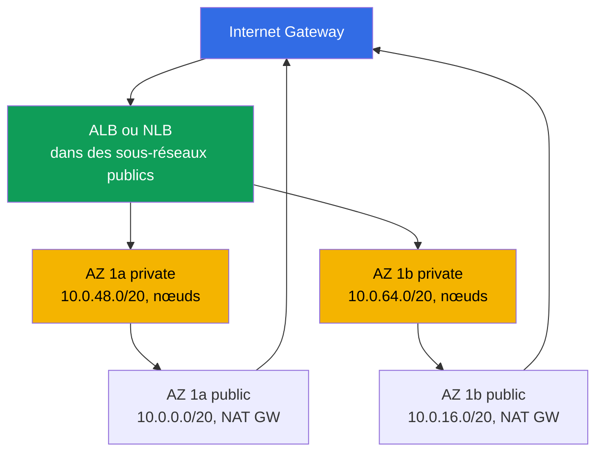
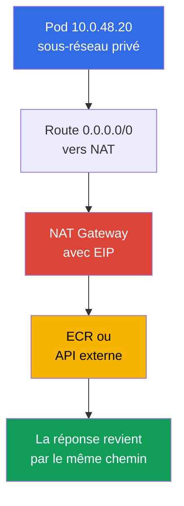
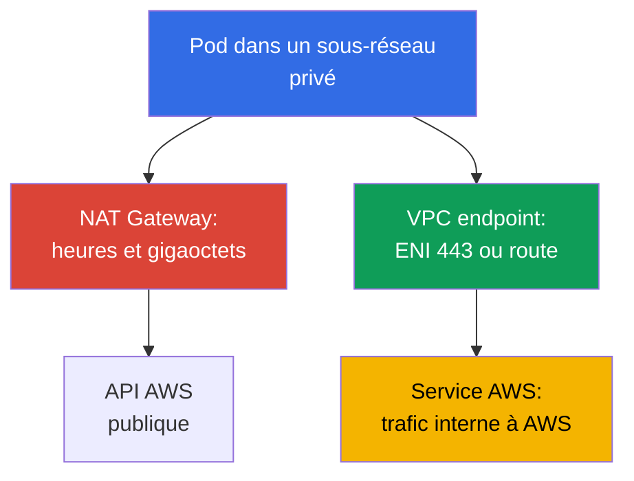

[Русская версия](ru.md) · [Eng version](en.md) · [Versión en español](es.md) · [Deutsche Version](de.md) · [ქართული ვერსია](ge.md) · [繁體中文版](tw.md) · [日本語版](jp.md)
# Chapitre 0.3. VPC de zéro : sous-réseaux, routage, IGW et NAT, security groups, VPC endpoints

> **La suite.** Le chapitre 0.1 a présenté la région, les zones de disponibilité et les tags fonctionnels des sous-réseaux, tandis que le chapitre 0.2 a couvert les rôles et les clés temporaires. Construisons maintenant l'environnement dans lequel vit le cluster : le réseau VPC. Dans EKS, ce n'est pas un décor mais un espace de travail : les pods prennent leurs adresses dans vos sous-réseaux, les load balancers choisissent les sous-réseaux selon les tags et NAT détermine la facture de trafic. Les nœuds (chapitre 0.4), le réseau du cluster (chapitres 6 et 7) et l'egress (chapitre 31) reposeront sur cette base.

## 0.3.1. VPC : réseau isolé dans une région et son CIDR

**VPC (Virtual Private Cloud)** est un réseau logiquement isolé au sein d'une région. Les autres clients AWS ont leurs propres VPC, et l'adresse `10.0.1.15` de votre réseau n'a aucun lien avec la même adresse dans le leur. Dans un VPC, vous définissez vous-même l'espace d'adressage, le découpez en sous-réseaux et écrivez les routes et les règles de firewall.

La différence avec un cluster kubeadm est que, dans EKS, **le réseau VPC et le réseau des pods ne forment qu'un seul réseau**. Le Amazon VPC CNI standard ne crée pas d'overlay : chaque pod reçoit une adresse réelle du CIDR du sous-réseau où se trouve le nœud et apparaît dans le VPC comme une interface réseau ordinaire (chapitres 6 et 7). La taille du VPC est donc le plafond, choisi à l'avance et pour longtemps, du nombre de pods.

Lors de la création d'un VPC, on indique le **bloc CIDR principal** : des masques allant de `/16` (65 536 adresses) à `/28`. Il est **impossible de le modifier ou de le réduire** après la création ; un autre plan d'adressage implique un nouveau VPC et la migration du cluster. Il est possible de l'étendre uniquement en ajoutant un **secondary CIDR** (jusqu'à cinq blocs), une méthode pratique pour un cluster qui n'a plus d'adresses (chapitre 7). En conséquence, on choisit généralement un `/16` pour un cluster, même si un `/20` semble suffisant aujourd'hui. Les adresses en trop ne coûtent rien ; un manque d'adresses se corrige difficilement. Une seule contrainte s'applique : la plage ne doit pas chevaucher d'autres VPC, le réseau d'entreprise ou ce que vous connectez au moyen de peering ou de Transit Gateway (chapitre 32).

Cette contrainte détermine elle-même le choix du modèle de connectivité lorsqu'un VPC doit être relié à d'autres réseaux. Nous faisons ici seulement la distinction ; la configuration et les détails figurent au chapitre 32.

| Modèle | Ce qu'il relie | Transitivité | Cas d'usage |
|--------|---------------|--------------|-------------|
| VPC Peering | deux VPC directement | non, seulement 1:1 | une paire de VPC, échange simple |
| Transit Gateway | de nombreux VPC et on-prem via un hub | oui, entre les attachements | réseau de dizaines de VPC |
| VPC Lattice | des services, pas des sous-réseaux | au niveau applicatif | connectivité L7 entre comptes |

VPC Peering et Transit Gateway exigent des CIDR qui ne se chevauchent pas ; le plan d'adressage est donc coordonné à l'échelle de l'organisation. VPC Lattice fonctionne au niveau des services et n'exige pas de plan d'adressage commun, mais il s'agit alors de connectivité applicative, non de sous-réseaux (chapitre 32).

## 0.3.2. Sous-réseaux : une AZ, public et privé, répartition pour EKS

**Un sous-réseau (subnet)** est une partie du CIDR d'un VPC, attachée **strictement à une seule AZ**. Une ressource du sous-réseau réside physiquement dans sa zone : un nœud de `eu-central-1a` ne se déplace pas dans une autre zone et un volume EBS ne se monte que sur une instance de sa propre AZ (chapitre 0.1, en détail au chapitre 23).

La différence entre un sous-réseau public et privé **ne réside pas dans la configuration du sous-réseau**, mais uniquement dans sa table de routage : le public possède une route `0.0.0.0/0` vers Internet Gateway, tandis que le privé la dirige vers NAT Gateway ou ne la possède pas du tout. Il n'existe pas de flag `public: true` ; `MapPublicIpOnLaunch` existe, mais sans route vers IGW, une adresse publique est inutile. La répartition typique pour EKS prévoit deux sous-réseaux dans chaque AZ : les publics sont réservés aux load balancers et à NAT Gateway, les privés aux nœuds et aux pods. Le diagramme montre deux zones, la troisième est organisée de la même manière.



Les nœuds sont placés dans des sous-réseaux privés : sans adresse publique, kubelet et les pods ne sont pas accessibles depuis Internet, et le trafic entrant passe uniquement par le load balancer (cluster sans Internet, chapitre 19). Les sous-réseaux publics sont nécessaires car les ALB et NLB internet-facing y sont créés et les détectent grâce au tag `kubernetes.io/role/elb` (chapitre 0.1). Les sous-réseaux sont transmis à la configuration du cluster lors de sa création ; le control plane y place ses interfaces pour communiquer avec les nœuds, ce qui rend obligatoire l'utilisation de sous-réseaux dans au moins deux AZ.

```bash
# Sous-réseaux VPC : zone, CIDR, adresses disponibles
aws ec2 describe-subnets --filters "Name=vpc-id,Values=vpc-0a1b2c3d4e5f6a7b8" \
  --query 'Subnets[].[SubnetId,AvailabilityZone,AvailableIpAddressCount]' --output table
```

## 0.3.3. Route table, IGW et NAT Gateway : comment le trafic sort

**Route table** est une liste de règles indiquant vers quel réseau aller et par quel moyen. Chaque sous-réseau possède exactement une table active (sans association explicite, c'est la main route table du VPC qui fonctionne). Toute table contient une route locale vers le CIDR du VPC : à l'intérieur du VPC, tout communique directement, sans gateways ni NAT. **Internet Gateway (IGW)** est la passerelle du VPC vers Internet, une par VPC et gratuite ; seule, elle n'ouvre rien, une adresse publique et une route sont aussi nécessaires.

**NAT Gateway** est un NAT géré : les instances des sous-réseaux privés accèdent à l'extérieur avec son adresse publique. Vous connaissez le fonctionnement du NAT avec CKA ; l'asymétrie importe ici : la connexion sortante passe, la connexion entrante depuis l'extérieur ne passe pas, et aucune route de retour vers une adresse privée n'existe sur Internet. C'est pourquoi un sous-réseau privé ne requiert pas de protection distincte contre le trafic entrant.



NAT Gateway est l'un des postes les plus chers de la facture : vous payez son heure d'existence et **chaque gigaoctet traité**. Un cluster qui télécharge des images depuis ECR via NAT, écrit des logs dans CloudWatch et lit S3 paie un trafic qui peut être redirigé vers des VPC endpoints (section 0.3.7 et chapitre 31). D'où le choix classique : **un NAT par AZ** est la norme en production, la défaillance d'une zone ne supprime pas l'egress des autres et il n'y a pas de frais de transfert inter-AZ ; **un seul par région** convient aux environnements dev et de formation, économise les heures de gateway mais devient un point unique de défaillance.

```bash
# Routes des sous-réseaux : lesquelles vont vers igw-... et lesquelles vers nat-...
aws ec2 describe-route-tables --filters "Name=vpc-id,Values=vpc-0a1b2c3d4e5f6a7b8" \
  --query 'RouteTables[].{RT:RouteTableId,R:Routes[].[DestinationCidrBlock,GatewayId]}'

# Nombre de NAT Gateway et sous-réseaux dans lesquels ils se trouvent
aws ec2 describe-nat-gateways --filter "Name=vpc-id,Values=vpc-0a1b2c3d4e5f6a7b8" \
  --query 'NatGateways[].[NatGatewayId,SubnetId]' --output table
```

## 0.3.4. Security groups et NACL : deux niveaux de filtrage

**Security group (SG)** est un firewall stateful au niveau de l'**interface réseau (ENI)**, et non du sous-réseau. Il ne possède que des règles d'autorisation ; le trafic de réponse passe de lui-même car le SG mémorise les connexions établies. Sa caractéristique essentielle est qu'une autre **security group** peut être la source d'une règle, et pas seulement un CIDR ; l'entrée « autoriser le port 5432 depuis `sg-nodes` » fonctionne donc malgré tout changement d'adresses des nœuds. **Network ACL (NACL)** est un filtre stateless à la frontière du **sous-réseau** : ses règles sont numérotées, il existe des règles allow et deny, mais l'état n'est pas suivi ; les deux directions, y compris les ports ephemeral, doivent donc être autorisées.

| Propriété | Security group | Network ACL |
|----------|----------------|-------------|
| Niveau | ENI (instance, pod, load balancer) | sous-réseau entier |
| État | stateful, réponse autorisée automatiquement | stateless, deux directions nécessaires |
| Règles | allow uniquement | allow et deny, par numéros |
| Source dans une règle | CIDR **ou autre SG** | CIDR uniquement |
| Pratique dans EKS | plusieurs SG par ENI, outil principal | laisser la valeur par défaut |

Par défaut, filtrez avec les security groups et ne modifiez une NACL que lorsqu'un refus explicite est nécessaire au niveau du sous-réseau : les règles stateless sont difficiles à diagnostiquer, et « le trafic a disparu exactement dans un sens » est le symptôme typique d'une NACL créée manuellement (chapitre 46).

Dans un cluster EKS, vous rencontrerez trois groupes. Le **SG du cluster** (cluster security group) est créé par EKS, réside sur les interfaces du control plane et est attaché par défaut aux nœuds ; tout le trafic y est autorisé, de sorte que les nœuds et le control plane communiquent sans règles supplémentaires. Le **SG des nœuds** est attaché aux ENI des instances et donc aux pods avec VPC CNI : on y décrit l'accès aux bases de données et les règles entre nœuds. Le **SG des load balancers** est créé par AWS Load Balancer Controller ; il reçoit le trafic externe et est indiqué comme source dans le SG des nœuds (chapitres 26 et 27).

```bash
# Règles SG, y compris les références à d'autres groupes dans UserIdGroupPairs
aws ec2 describe-security-groups --group-ids sg-0a1b2c3d4e5f6a7b8 \
  --query 'SecurityGroups[].IpPermissions'
```

Ce que SG ou NACL filtrent exactement est visible dans les **VPC Flow Logs**, enregistrements des flux acceptés et rejetés sur un ENI, un sous-réseau ou l'ensemble du VPC. Pour SecOps et l'analyse des incidents, activez les logs dans CloudWatch Logs et filtrez sur `action = REJECT` : vous voyez ainsi qui tente d'accéder à des ports fermés et trouvez cette rupture unidirectionnelle causée par une NACL créée manuellement. Le trafic rejeté est d'un ordre de grandeur inférieur au trafic accepté, ce qui rend le filtre REJECT économique et informatif.

```
# CloudWatch Logs Insights : uniquement le trafic rejeté, le plus récent en haut
fields @timestamp, interfaceId, srcAddr, dstAddr, srcPort, dstPort, protocol, action
| filter action = "REJECT"
| sort @timestamp desc
| limit 50
```

## 0.3.5. Combien d'adresses un cluster nécessite réellement

Il faut compter les adresses car, avec VPC CNI, **chaque pod occupe une IP du sous-réseau du nœud**. Les pods ne vivent pas « dans un overlay », comme avec kubeadm : concrètement, 40 pods sur un nœud représentent 40 adresses de sous-réseau, plus les adresses du nœud lui-même. Le plugin conserve également à l'avance un pool d'adresses prêtes à l'emploi, si bien que la consommation réelle dépasse le nombre de pods exécutés. AWS réserve en outre **5 adresses dans chaque sous-réseau** : l'adresse réseau, le VPC router, Route 53 Resolver (le fameux `.2` à l'échelle du VPC), une réserve future et la dernière adresse. Dans un `/24`, 251 adresses sont donc disponibles, et non 256.

| Masque | Total d'adresses | Disponibles (moins 5) | Usage |
|-------|------------------|-----------------------|-------|
| `/24` | 256 | 251 | sous-réseau public pour les load balancers |
| `/22` | 1 024 | 1 019 | petit cluster, dev |
| `/20` | 4 096 | 4 091 | taille opérationnelle d'un sous-réseau privé de nœuds |
| `/19` | 8 192 | 8 187 | grand cluster ou réserve de croissance |
| `/16` | 65 536 | 65 531 | VPC complet |

Un `/24` pour les nœuds s'épuise rapidement : 251 adresses représentent environ 5 nœuds `m5.large` avec une densité d'environ 29 pods. Le cluster grandit en une semaine, les pods restent en `Pending` avec une erreur telle que `failed to assign an IP address`, et la solution n'est alors plus le scaling mais une nouvelle conception du réseau. Les options, détaillées au chapitre 7, sont : **prefix delegation**, qui donne au nœud des blocs `/28` plutôt que des adresses individuelles et augmente la densité sans augmenter le nombre d'ENI ; **secondary CIDR** de `100.64.0.0/10` pour les sous-réseaux de pods ; **custom networking**, qui place les pods dans des sous-réseaux distincts.

Ces trois techniques contournent le plafond IPv4. La sortie stratégique est le **dual-stack** : le VPC reçoit un bloc IPv6 `/56` d'AWS, les sous-réseaux reçoivent des `/64` et, en mode IPv6, les pods prennent des adresses dans un espace pratiquement inépuisable, ce qui supprime par principe le manque d'IPv4 pour les pods. Les nœuds conservent IPv4 pour les services sans IPv6. La répartition des sous-réseaux doit prévoir IPv6 dès le départ : la migration d'un cluster vers IPv6 est un sujet distinct (chapitre 7).

## 0.3.6. DNS dans un VPC : pourquoi rien ne fonctionne sans lui

Un VPC possède deux attributs DNS, et les deux sont importants. **`enableDnsSupport`** active le resolver intégré, **Route 53 Resolver**, à l'adresse « base CIDR du VPC plus 2 » (pour `10.0.0.0/16`, c'est `10.0.0.2`) et à `169.254.169.253`. **`enableDnsHostnames`** attribue aux instances des noms tels que `ip-10-0-48-20.eu-central-1.compute.internal`.

Pour EKS, les deux doivent être définis à `true` ; c'est une obligation, non une recommandation. Sans resolver, **CoreDNS du cluster ne résout rien vers l'extérieur** : son upstream est ce même `.2`, et les pods ne résoudront ni `ecr.eu-central-1.amazonaws.com` ni les adresses des API externes. Sans DNS hostnames, le **endpoint privé du cluster** se brise : le nom de l'API server en mode privé est fourni par une private hosted zone, et sans ces attributs les nœuds ne trouveront pas le control plane. Le même mécanisme sous-tend external-dns et Route 53 au chapitre 29.

```bash
# Vérifier l'attribut DNS, un par requête, et l'activer au besoin
aws ec2 describe-vpc-attribute --vpc-id vpc-0a1b2c3d4e5f6a7b8 --attribute enableDnsSupport
aws ec2 modify-vpc-attribute --vpc-id vpc-0a1b2c3d4e5f6a7b8 --enable-dns-hostnames
```

Le resolver intégré a une limite qui affecte les clusters chargés : **1024 paquets par seconde par interface réseau**, et cette limite **ne peut pas être augmentée** au moyen de Service Quotas. Deux détails la rendent plus trompeuse qu'elle ne paraît. Premièrement, la limite est **commune à tous les services link-local** : elle cumule les requêtes au resolver, les appels IMDS à `169.254.169.254` et la synchronisation de temps par NTP. Deuxièmement, elle est calculée par interface ; les pods d'un nœud se trouvent sur son ENI, ils partagent donc un budget avec kubelet, CNI et tous les agents. En cas de dépassement, le resolver abandonne simplement le trafic et le symptôme devient désagréable : non pas une panne, mais des **timeouts DNS intermittents** sans lien avec un nom particulier. Le paramètre `ndots:5` des pods aggrave le problème en transformant un appel à un nom externe en plusieurs requêtes. L'atténuation standard est NodeLocal DNSCache, un cache local sur le nœud ; le diagnostic et le traitement de cette classe d'incidents figurent au chapitre 46.

Une autre particularité du resolver est que **son trafic ne peut être filtré ni par security group ni par NACL**. Cela simplifie les clusters privés, mais implique que l'interdiction DNS ne se construit pas au niveau réseau ; elle repose sur des politiques dans le cluster, où le port 53 doit rester une exception (chapitre 30).

## 0.3.7. VPC endpoints : accès privé aux services AWS

Par défaut, les appels à l'API AWS vont vers une adresse publique ; depuis un sous-réseau privé, ils passent donc par NAT Gateway, avec les conséquences de coût et de l'exigence « nous ne sortons pas ». Un **VPC endpoint** supprime ce trajet : le trafic vers le service reste dans le réseau AWS. Un **Gateway endpoint** n'existe que pour **S3 et DynamoDB** : il s'agit d'une route dans une route table vers la prefix list du service, il ne consomme pas d'adresses et **le endpoint lui-même est gratuit**. Un **Interface endpoint (AWS PrivateLink)** est un ENI avec une adresse privée dans vos sous-réseaux et un nom DNS privé qui intercepte l'adresse habituelle du service ; il fonctionne pour presque tous les services, mais coûte par heure dans chaque AZ et par gigaoctet, et exige un SG autorisant le port 443.



Un cluster sans sortie Internet (chapitre 19) exige un ensemble précis ; les noms d'endpoint dépendent de la région et ressemblent à `com.amazonaws.eu-central-1.s3`.

| Endpoint | Type | Utilité pour le cluster |
|----------|------|-------------------------|
| `com.amazonaws.eu-central-1.ecr.api` | Interface | autorisation auprès du registre d'images |
| `com.amazonaws.eu-central-1.ecr.dkr` | Interface | le pull d'images lui-même (chapitre 20) |
| `com.amazonaws.eu-central-1.s3` | Gateway | les couches d'images ECR sont stockées dans S3 |
| `com.amazonaws.eu-central-1.sts` | Interface | IRSA et échange de token contre des clés (chapitre 16) |
| `com.amazonaws.eu-central-1.ec2` | Interface | controllers et CNI : ENI, instances |
| `com.amazonaws.eu-central-1.elasticloadbalancing` | Interface | LB Controller (chapitre 26) |
| `com.amazonaws.eu-central-1.logs` | Interface | logs dans CloudWatch (chapitre 34) |


Remarquez le lien : sans gateway endpoint pour S3, un cluster privé ne télécharge toujours pas une image car les couches ECR sont stockées dans S3. C'est l'erreur la plus fréquente lors de la première tentative d'isoler un cluster d'Internet. Le bénéfice se calcule simplement : si des dizaines de gigaoctets par mois passent par NAT vers un service, un interface endpoint devient rentable immédiatement ; si le trafic est presque nul, trois ENI dans trois zones peuvent coûter plus cher que NAT (chapitre 31).

Il faut aussi connaître l'**endpoint policy**, une politique de ressource sur le endpoint lui-même, qui existe pour les types gateway et interface. Point important : **par défaut, elle autorise tout** ; un endpoint créé « pour ne pas payer NAT » ne limite donc rien. Il est pourtant utile de le limiter, car le endpoint est le seul point où la **direction** d'une requête est visible. Un pod compromis disposant de droits valides peut téléverser des données dans un bucket S3 **tiers**, et une politique IAM du rôle ne l'empêche pas si elle contient `s3:PutObject` sur `*`. L'endpoint policy résout précisément ce cas : elle n'autorise l'accès qu'aux ressources de votre organisation (`aws:ResourceOrgID`) ou aux comptes répertoriés (`aws:PrincipalAccount`), et une requête vers un bucket externe ne passe pas par votre endpoint.

La tâche inverse est assurée par la politique du bucket : les conditions `aws:SourceVpce` et `aws:PrincipalOrgID` d'une bucket policy répondent à la question « qui peut accéder à **mon** bucket » et le protègent contre l'accès hors de votre réseau. Ce sont deux contrôles différents et il ne faut pas les confondre : l'endpoint policy protège contre une fuite vers l'extérieur ; la bucket policy ferme votre propre bucket. Ensemble, ils composent ce qu'AWS appelle un data perimeter ; dans un cluster privé, c'est une partie standard du hardening (chapitre 19).

```bash
# Gateway endpoint pour S3 : route dans les route tables indiquées, sans frais
aws ec2 create-vpc-endpoint --vpc-id vpc-0a1b2c3d4e5f6a7b8 \
  --vpc-endpoint-type Gateway --service-name com.amazonaws.eu-central-1.s3 \
  --route-table-ids rtb-0aaa1111 rtb-0bbb2222

# Interface endpoint pour ECR : ENI dans les sous-réseaux privés, DNS privé activé
aws ec2 create-vpc-endpoint --vpc-id vpc-0a1b2c3d4e5f6a7b8 \
  --vpc-endpoint-type Interface --service-name com.amazonaws.eu-central-1.ecr.dkr \
  --subnet-ids subnet-0aaa subnet-0bbb --security-group-ids sg-0a1b --private-dns-enabled
```

## 0.3.8. À quoi ressemble un VPC dans l'IaC

On crée une VPC manuellement une fois afin de comprendre la mécanique. En réalité, tout est décrit comme du code, ce qui est essentiel : le plan d'adressage, les tags des sous-réseaux, le nombre de NAT et l'ensemble des endpoints sont précisément ce qu'il est impossible de modifier sur un système vivant et ce qui doit être reproductible. L'ensemble classique de ressources Terraform est constitué de `aws_vpc` avec CIDR et attributs DNS, de `aws_subnet` à raison d'un par AZ et par rôle, de `aws_internet_gateway`, de `aws_nat_gateway` avec EIP, de `aws_route_table` avec routes et associations, de `aws_security_group` et de `aws_vpc_endpoint` ; on utilise généralement le module `terraform-aws-modules/vpc/aws` par-dessus.

Le code doit impérativement inclure les tags `kubernetes.io/role/elb` sur les sous-réseaux publics et `kubernetes.io/role/internal-elb` sur les privés, ainsi que `karpenter.sh/discovery` sur les sous-réseaux et les SG (chapitre 0.1) ; `enable_dns_hostnames` et `enable_dns_support` ; une marge dans les masques de sous-réseaux qui tient compte de la croissance du nombre de pods ; et l'ensemble des VPC endpoints comme partie de la stack réseau. Dans les labs du cours, le VPC n'est pas créé par des clics : une stack `vpc` distincte dans Terragrunt crée le réseau avec la répartition et les tags requis, et la stack du cluster récupère ses identifiants au moyen de dépendances (chapitre 0.5).

## 0.3.9. Application en production

- **Le plan d'adressage est convenu avant la création du cluster.** `/16` pour le VPC, `/20` et plus pour les sous-réseaux privés des nœuds, trois AZ, sans chevauchement avec le réseau d'entreprise.
- **Les nœuds ne vont que dans des sous-réseaux privés ;** les sous-réseaux publics sont réservés aux load balancers et à NAT ; il n'y a pas d'adresses publiques sur les nœuds en prod.
- **Un NAT par AZ et toujours un S3 gateway endpoint.** L'ensemble des interface endpoints s'étend selon les besoins : observez où part le trafic via NAT, puis traitez les flux importants.
- **L'accès est décrit par des références à des SG,** non par des listes de CIDR : les règles survivent à la recréation des nœuds. La NACL reste par défaut en l'absence d'une exigence de sécurité explicite.

## 0.3.10. Mini-glossaire

- **VPC** est un réseau isolé dans une région ; son CIDR principal (`/16` ... `/28`) ne peut pas être modifié et ne s'étend que par secondary CIDR. Un **sous-réseau** est une partie du CIDR du VPC dans une AZ.
- **Route table** est la table de routage d'un sous-réseau ; un sous-réseau public et un sous-réseau privé ne diffèrent que par leur route par défaut. **Internet Gateway** est la passerelle gratuite vers Internet pour les adresses publiques. **NAT Gateway** est un NAT géré, facturé par heure et par gigaoctet.
- **Security group** est un firewall stateful sur un ENI, avec seulement allow et une autre SG possible comme source. **Network ACL** est un filtre stateless de sous-réseau, avec allow et deny selon le numéro des règles.
- **ENI** est une interface réseau ; avec VPC CNI, les pods obtiennent des adresses sur l'ENI du nœud. **Route 53 Resolver** est le DNS intégré du VPC à l'adresse « CIDR plus 2 », upstream pour CoreDNS. Un **VPC endpoint** offre un accès privé à un service AWS : gateway (S3, DynamoDB) ou interface (PrivateLink).
- **Dual-stack** désigne un VPC et des sous-réseaux avec IPv4 et IPv6 (`/56` et `/64`) ; le mode IPv6 supprime le manque d'adresses pour les pods. **VPC Flow Logs** enregistrent les flux acceptés et rejetés ; le filtre `action = REJECT` dans CloudWatch Logs Insights est un outil de SecOps et de diagnostic.

## 0.3.11. Résumé du chapitre

- Le CIDR principal d'un VPC ne peut être ni réduit ni modifié ; on choisit donc un `/16` avec de la marge, et l'extension ne se fait que par secondary CIDR (chapitre 7). Un sous-réseau vit dans une AZ.
- Une route `0.0.0.0/0` vers IGW rend un sous-réseau public ; une route vers NAT, ou son absence, le rend privé. Pour EKS : les nœuds sont dans les sous-réseaux privés, les load balancers dans les publics.
- NAT Gateway fournit un accès sortant et ne crée pas de route de retour vers l'intérieur. Vous payez par heure et par gigaoctet ; un NAT par AZ apporte la tolérance aux pannes, un par région apporte des économies et un point unique de défaillance (chapitre 31).
- Security group est stateful sur ENI et constitue l'outil principal de filtrage, avec des règles faisant référence à d'autres SG. NACL est stateless sur le sous-réseau et reste habituellement à sa valeur par défaut.
- Avec VPC CNI, un pod occupe une IP du sous-réseau, AWS réserve 5 adresses et un `/24` pour les nœuds s'épuise presque immédiatement : viennent alors prefix delegation, secondary CIDR ou custom networking (chapitres 6 et 7). `enableDnsSupport` et `enableDnsHostnames` sont obligatoires : CoreDNS dépend du resolver `.2`, tandis que le endpoint privé du cluster dépend des noms DNS.
- Les VPC endpoints sortent le trafic de NAT et rendent possible un cluster sans Internet. Le minimum est `ecr.api`, `ecr.dkr`, `s3` (gateway), `sts`, `ec2`, `elasticloadbalancing` (chapitres 19, 31).

## 0.3.12. Utilité dans le travail réel

La moitié des incidents EKS se trouvent dans ce chapitre. Un pod en `Pending` sans événements du scheduler : vérifiez les adresses libres du sous-réseau. Un nœud n'a pas rejoint le cluster : route, SG ou endpoint absent (chapitre 45). Un load balancer n'a pas été créé : il manque un tag sur les sous-réseaux. Le trafic disparaît dans un sens : NACL créée manuellement. La facture augmente d'un tiers : NAT et trafic entre zones. Et la décision la plus importante ne se prend qu'une fois, avant le premier cluster : quel est votre plan d'adressage.

## 0.3.13. Questions d'auto-évaluation

1. Pourquoi choisir le CIDR principal du VPC avec de la marge et que faire si les adresses sont épuisées ?
2. En quoi un sous-réseau public diffère-t-il d'un sous-réseau privé au niveau de la configuration AWS ?
3. Pourquoi un sous-réseau est-il attaché à une seule AZ et comment cela affecte-t-il les PVC et les nœuds ?
4. Comment le trafic d'un sous-réseau privé atteint-il Internet et pourquoi ne peut-il pas revenir ?
5. Un NAT Gateway par région contre un par AZ : que choisir en prod et pourquoi ?
6. En quoi une security group diffère-t-elle d'une NACL et que faut-il utiliser par défaut ?
7. Combien d'adresses sont disponibles dans un sous-réseau `/24` et pour combien de nœuds suffisent-elles avec VPC CNI ?
8. Pourquoi un VPC a-t-il besoin de `enableDnsSupport` et de `enableDnsHostnames` ?
9. Quels VPC endpoints sont obligatoires pour un cluster sans Internet et pourquoi S3 en fait-il partie ?
10. Comment le dual-stack supprime-t-il le manque d'IPv4 pour les pods et que reste-t-il sur IPv4 ?
11. En quoi VPC Peering diffère-t-il de Transit Gateway et où VPC Lattice est-il approprié ?
12. Pourquoi filtrer les VPC Flow Logs selon `action = REJECT` et qu'est-ce que cela aide à trouver ?

## Pratique

La partie 0 n'a pas de labs propres : le réseau est créé par la stack `vpc` dans les labs du cours (chapitre 0.5), où vous verrez la même répartition des sous-réseaux, les tags et les endpoints sous forme de code. La suite couvre EC2 et les modèles de tarification : types d'instances, AMI, on-demand, spot et Savings Plans, c'est-à-dire tout ce qui compose les nœuds que vous venez de répartir dans les sous-réseaux privés.

---
[Table des matières](../README_FR.md) · [Chapitre 0.2](../00-2-iam/fr.md) · [Chapitre 0.4](../00-4-ec2/fr.md)
