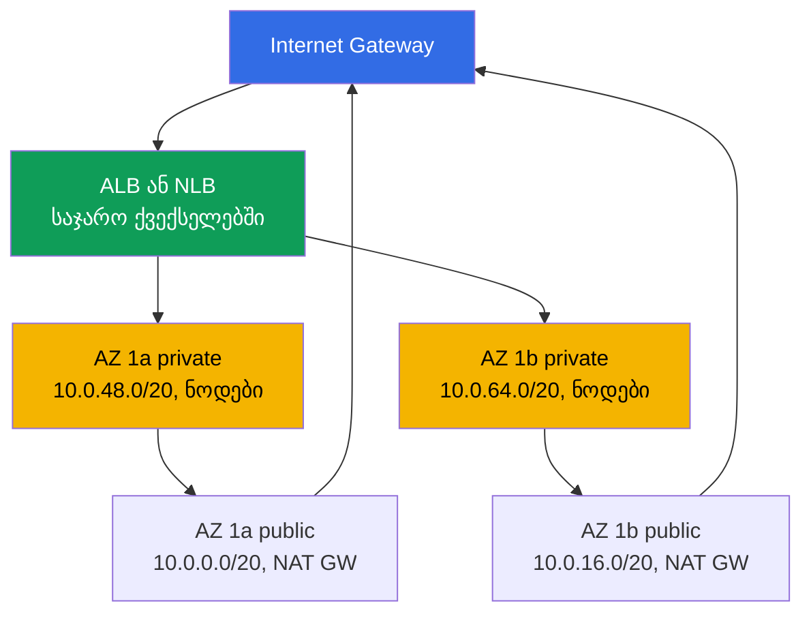
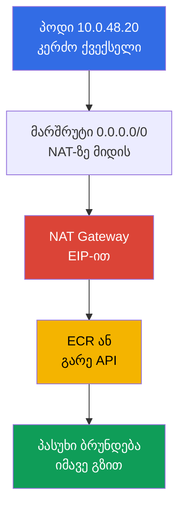
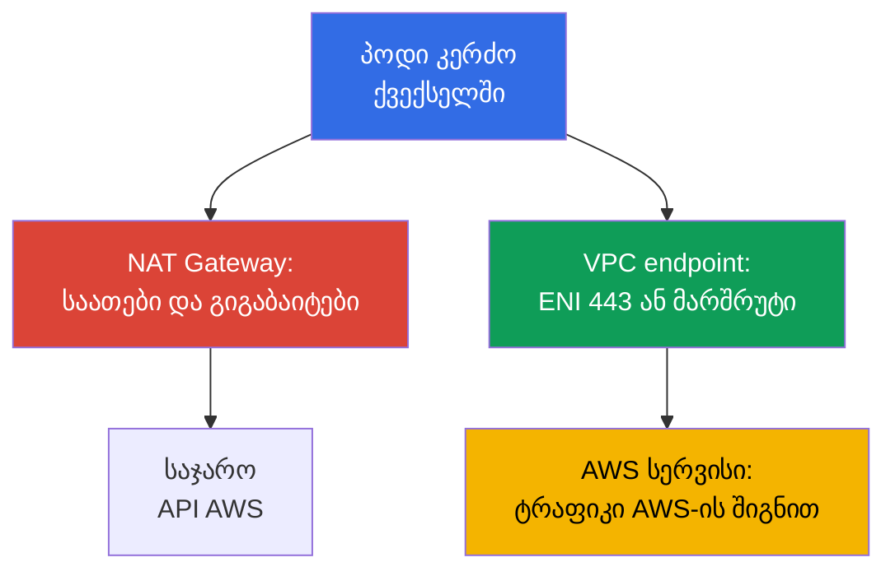

[Русская версия](ru.md) · [Eng version](en.md) · [Versión en español](es.md) · [Version française](fr.md) · [Deutsche Version](de.md) · [繁體中文版](tw.md) · [日本語版](jp.md)
# თავი 0.3. VPC ნულიდან: ქვექსელები, მარშრუტიზაცია, IGW და NAT, security groups, VPC endpoints

> **რა არის შემდეგ.** 0.1 თავში გაჩნდა რეგიონი, ხელმისაწვდომობის ზონები და ქვექსელების ფუნქციური ტეგები, 0.2 თავში კი - როლები და დროებითი გასაღებები. ახლა ავაწყობთ გარემოს, რომელშიც კლასტერი ცხოვრობს: VPC ქსელს. EKS-ში ეს ფონი კი არა, სამუშაო ზედაპირია: პოდები მისამართებს თქვენი ქვექსელებიდან იღებენ, load balancer-ები ქვექსელებს ტეგებით არჩევენ, NAT კი ტრაფიკის ანგარიშს აყალიბებს. ამაზე დაეფუძნება ნოდები (თავი 0.4), კლასტერის ქსელი (თავები 6 და 7) და egress (თავი 31).

## 0.3.1. VPC: იზოლირებული ქსელი რეგიონში და მისი CIDR

**VPC (Virtual Private Cloud)** არის ლოგიკურად იზოლირებული ქსელი ერთი რეგიონის ფარგლებში. AWS-ის მეზობელ მომხმარებლებს საკუთარი VPC აქვთ და თქვენი ქსელის მისამართი `10.0.1.15` სხვა ქსელში იმავე მისამართთან კავშირში არ არის. VPC-ის შიგნით თავად განსაზღვრავთ მისამართების სივრცეს, ყოფთ მას ქვექსელებად, წერთ მარშრუტებსა და firewall-ის წესებს.

განსხვავება kubeadm-კლასტერთან ის არის, რომ EKS-ში **VPC-ის ქსელი და პოდების ქსელი ერთი ქსელია**. სტანდარტული Amazon VPC CNI overlay-ს არ ქმნის: ყოველი პოდი იღებს რეალურ მისამართს იმ ქვექსელის CIDR-დან, სადაც ნოდი დგას, და VPC-ში ჩვეულებრივ ქსელურ ინტერფეისად ჩანს (თავები 6 და 7). ამიტომ VPC-ის ზომა პოდების რაოდენობის წინასწარ და ხანგრძლივად არჩეული ზღვარია.

VPC-ის შექმნისას უთითებთ **ძირითად CIDR ბლოკს**: ნიღბებს `/16`-დან (65 536 მისამართი) `/28`-მდე. მისი **შეცვლა და შევიწროება შეუძლებელია** შექმნის შემდეგ, სხვა მისამართების გეგმა ახალ VPC-სა და კლასტერის მიგრაციას ნიშნავს; **გაფართოება მხოლოდ secondary CIDR-ის დამატებითაა შესაძლებელი** (ხუთ ბლოკამდე) - პრაქტიკული ხერხი მისამართებამოწურული კლასტერისთვის (თავი 7). აქედან მოდის წესი: კლასტერისთვის იღებენ `/16`-ს, მაშინაც კი, როცა დღეს „`/20`-იც საკმარისი იქნებოდა“. ზედმეტი მისამართები არაფერს ღირს, დეფიციტის გამოსწორება კი მტკივნეულია. ერთი შეზღუდვა არსებობს: დიაპაზონი არ უნდა იკვეთებოდეს სხვა VPC-ებთან, კორპორაციულ ქსელთან და იმ ქსელებთან, რომლებსაც peering-ით ან Transit Gateway-ით აერთებთ (თავი 32).

ეს შეზღუდვა განსაზღვრავს კავშირის შაბლონის არჩევას, როცა VPC სხვა ქსელებთან უნდა დააკავშიროთ. აქ მხოლოდ განსხვავებას ვადგენთ, დაყენება და დეტალები კი 32 თავშია.

| შაბლონი | რას აკავშირებს | ტრანზიტულობა | როდის გამოიყენება |
|--------|----------------|--------------|-------------------|
| VPC Peering | ორი VPC პირდაპირ | არა, მხოლოდ 1:1 | VPC-ების წყვილი, მარტივი გაცვლა |
| Transit Gateway | ბევრი VPC და on-prem ჰაბის გავლით | კი, დანართებს შორის | ათეულობით VPC-ის ქსელი |
| VPC Lattice | სერვისები და არა ქვექსელები | აპლიკაციის დონეზე | L7 კავშირი ანგარიშებს შორის |

VPC Peering-სა და Transit Gateway-ს გადაუკვეთავი CIDR სჭირდება, ამიტომ მისამართების გეგმა ორგანიზაციის დონეზე თანხმდება. VPC Lattice სერვისების დონეზე მუშაობს და საერთო მისამართების გეგმას არ მოითხოვს, თუმცა ეს უკვე აპლიკაციების კავშირია და არა ქვექსელების (თავი 32).

## 0.3.2. ქვექსელები: ერთი AZ, საჯარო და კერძო, განლაგება EKS-ისთვის

**ქვექსელი (subnet)** VPC-ის CIDR-ის ნაწილია, რომელიც **მკაცრად ერთ AZ-ს** ეკუთვნის. ქვექსელის რესურსი ფიზიკურად თავის ზონაშია: `eu-central-1a`-ს ნოდი სხვა ზონაში ვერ გადავა, ხოლო EBS volume მხოლოდ თავისი AZ-ის instance-ზე მონტაჟდება (თავი 0.1, დეტალურად 23 თავში).

საჯარო და კერძო ქვექსელის განსხვავება **ქვექსელის კონფიგურაციაში არ არის**, ის მხოლოდ მის route table-შია: საჯაროს აქვს მარშრუტი `0.0.0.0/0` Internet Gateway-ზე, კერძოს კი NAT Gateway-ზე მიჰყავს ან საერთოდ არ აქვს. `public: true` flag არ არსებობს; არის `MapPublicIpOnLaunch`, მაგრამ IGW-მდე მარშრუტის გარეშე საჯარო მისამართი უსარგებლოა. EKS-ის ტიპური განლაგება ასეთია: თითო AZ-ში ორი ქვექსელი, საჯაროები load balancer-ებსა და NAT Gateway-ს ეძლევა, კერძოები - ნოდებსა და პოდებს. სქემაზე ორი ზონაა, მესამე ისევეა მოწყობილი.



ნოდები კერძო ქვექსელებშია: საჯარო მისამართის გარეშე ინტერნეტიდან kubelet-სა და პოდებამდე ვერ მიდიხართ, შემომავალი ტრაფიკი მხოლოდ load balancer-ით შედის (ინტერნეტის გარეშე კლასტერი - თავი 19). საჯარო ქვექსელები საჭიროა, რადგან internet-facing ALB და NLB სწორედ იქ იქმნება და მათ ტეგით `kubernetes.io/role/elb` პოულობს (თავი 0.1). ქვექსელები კლასტერის შექმნისას მის კონფიგურაციაში გადაეცემა, control plane კი იქ ნოდებთან დასაკავშირებელ საკუთარ ინტერფეისებს ათავსებს, ამიტომ სულ მცირე ორ AZ-ში ქვექსელები სავალდებულოა.

```bash
# VPC-ის ქვექსელები: ზონა, CIDR, თავისუფალი მისამართები
aws ec2 describe-subnets --filters "Name=vpc-id,Values=vpc-0a1b2c3d4e5f6a7b8" \
  --query 'Subnets[].[SubnetId,AvailabilityZone,AvailableIpAddressCount]' --output table
```

## 0.3.3. Route table, IGW და NAT Gateway: როგორ გადის ტრაფიკი გარეთ

**Route table** არის წესების სია: „რომელ ქსელში, რის გავლით წავიდეს“. თითოეულ ქვექსელს ზუსტად ერთი აქტიური ცხრილი აქვს (გამოკვეთილი მიბმის გარეშე მუშაობს VPC-ის main route table). ნებისმიერ ცხრილში არის ლოკალური მარშრუტი თავად VPC-ის CIDR-ზე: VPC-ის შიგნით ყველაფერი პირდაპირ, gateway-ებისა და NAT-ის გარეშე ურთიერთობს. **Internet Gateway (IGW)** VPC-ის ინტერნეტთან gateway-ა, თითო VPC-ზე ერთია და უფასოა; თავისით არაფერს ხსნის, საჭიროა საჯარო მისამართი და მარშრუტი.

**NAT Gateway** მართული NAT-ია: კერძო ქვექსელების instance-ები გარეთ მისი საჯარო მისამართიდან გადიან. NAT-ის მექანიკა CKA-დან უკვე იცით, აქ მნიშვნელოვანია ასიმეტრია: გამავალი კავშირი გადის, გარედან შემომავალი - არა, ხოლო ინტერნეტში კერძო მისამართამდე დაბრუნების მარშრუტი არ არსებობს. ამიტომ კერძო ქვექსელს შემომავალი ტრაფიკისგან ცალკე დაცვა არ სჭირდება.



NAT Gateway ანგარიშის ერთ-ერთი ყველაზე ძვირი სტრიქონია: იხდით როგორც gateway-ის არსებობის თითო საათისთვის, ისე **ყოველი დამუშავებული გიგაბაიტისთვის**. კლასტერი, რომელიც NAT-ით ECR-დან image-ებს იღებს, CloudWatch-ში logs წერს და S3-ს კითხულობს, იხდის იმ ტრაფიკისთვის, რომელიც VPC endpoints-ში შეიძლება გადაიტანოთ (სექცია 0.3.7 და თავი 31). აქედან კლასიკური არჩევანი: **თითო NAT თითო AZ-ზე** - production-ის ნორმაა, ზონის გათიშვა დანარჩენების egress-ს არ თიშავს და inter-AZ transfer-ის ფასი არ გაქვთ; **ერთი რეგიონზე** - dev და სასწავლო გარემოებისთვის, gateway-ების სამუშაო საათებს ზოგავს, მაგრამ ერთ წერტილში ქმნის მტყუნებას.

```bash
# ქვექსელების მარშრუტები: რა მიდის igw-...-ში და რა nat-...-ში
aws ec2 describe-route-tables --filters "Name=vpc-id,Values=vpc-0a1b2c3d4e5f6a7b8" \
  --query 'RouteTables[].{RT:RouteTableId,R:Routes[].[DestinationCidrBlock,GatewayId]}'

# რამდენი NAT Gateway არის და რომელ ქვექსელებშია განთავსებული
aws ec2 describe-nat-gateways --filter "Name=vpc-id,Values=vpc-0a1b2c3d4e5f6a7b8" \
  --query 'NatGateways[].[NatGatewayId,SubnetId]' --output table
```

## 0.3.4. Security groups და NACL: ფილტრაციის ორი დონე

**Security group (SG)** არის stateful firewall **ქსელური ინტერფეისის (ENI)** დონეზე და არა ქვექსელის. მხოლოდ დაშვების წესები აქვს; საპასუხო ტრაფიკი თავისით გადის, რადგან SG დამყარებულ კავშირებს იმახსოვრებს. მთავარი თვისება ისაა, რომ წესის წყარო შეიძლება **სხვა security group** იყოს და არა მხოლოდ CIDR, ხოლო ჩანაწერი „დაუშვი პორტი 5432 `sg-nodes`-დან“ ნოდების მისამართების ნებისმიერ ცვლილებაზე მუშაობს. **Network ACL (NACL)** არის stateless ფილტრი **ქვექსელის** საზღვარზე: წესები დანომრილია, არსებობს allow და deny, თუმცა მდგომარეობას არ ადევნებს თვალს, ამიტომ ორივე მიმართულება უნდა დაუშვათ, ephemeral port-ების ჩათვლით.

| თვისება | Security group | Network ACL |
|----------|----------------|-------------|
| დონე | ENI (instance, პოდი, load balancer) | მთელი ქვექსელი |
| მდგომარეობა | stateful, პასუხი თავისითაა დაშვებული | stateless, ორივე მიმართულება საჭიროა |
| წესები | მხოლოდ allow | allow და deny, ნომრებით |
| წესის წყარო | CIDR **ან სხვა SG** | მხოლოდ CIDR |
| პრაქტიკა EKS-ში | რამდენიმე SG თითო ENI-ზე, მთავარი ინსტრუმენტი | ნაგულისხმევი რჩება |

ნაგულისხმევად security groups-ით ფილტრეთ, NACL-ს კი მხოლოდ მაშინ შეეხეთ, როცა ქვექსელის დონეზე გამოკვეთილი აკრძალვა გჭირდებათ: stateless წესების დიაგნოსტიკა ძნელია, ხოლო „ტრაფიკი ზუსტად ერთ მხარეს გაქრა“ თვითნაკეთი NACL-ის ტიპური სიმპტომია (თავი 46).

EKS კლასტერში სამ ჯგუფს შეხვდებით. **კლასტერის SG** (cluster security group) EKS-ს შექმნილი აქვს, control plane-ის ინტერფეისებზეა და ნოდებზე ნაგულისხმევადაც ემატება; მის შიგნით მთელი ტრაფიკი დაშვებულია, ამიტომ ნოდები და control plane დამატებითი წესების გარეშე ურთიერთობენ. **ნოდების SG** instance-ების ENI-ზეა და, შესაბამისად, VPC CNI-ისას პოდებზეც: აქ აღწერთ მონაცემთა ბაზებთან წვდომასა და ნოდებს შორის წესებს. **Load balancer-ების SG** AWS Load Balancer Controller-ს შექმნილი აქვს; ის გარედან ტრაფიკს იღებს და ნოდების SG-ში წყაროდ მიეთითება (თავები 26 და 27).

```bash
# SG-ის წესები, მათ შორის სხვა ჯგუფებზე მითითებები UserIdGroupPairs-ში
aws ec2 describe-security-groups --group-ids sg-0a1b2c3d4e5f6a7b8 \
  --query 'SecurityGroups[].IpPermissions'
```

ზუსტად რას ფილტრავს SG ან NACL, აჩვენებს **VPC Flow Logs** - მიღებული და უარყოფილი ნაკადების ჩანაწერი ENI-ზე, ქვექსელზე ან მთლიან VPC-ზე. SecOps-ისა და ინციდენტების გამოძიებისთვის logs CloudWatch Logs-ში ირთვება და `action = REJECT`-ით იფილტრება: ასე ჩანს, ვინ და სად ცდილობს დახურულ პორტებთან მისვლას, და პოულობთ თვითნაკეთი NACL-ის იმ ცალმხრივ გაწყვეტას. უარყოფილი ტრაფიკი მიღებულზე რიგით ნაკლებია, ამიტომ REJECT-ის ფილტრი იაფი და ინფორმაციულია.

```
# CloudWatch Logs Insights: მხოლოდ უარყოფილი ტრაფიკი, ახალი ზემოთ
fields @timestamp, interfaceId, srcAddr, dstAddr, srcPort, dstPort, protocol, action
| filter action = "REJECT"
| sort @timestamp desc
| limit 50
```

## 0.3.5. რამდენი მისამართი სჭირდება რეალურად კლასტერს

მისამართების დათვლა საჭიროა, რადგან VPC CNI-ისას **ყოველი პოდი ნოდის ქვექსელის IP-ს იკავებს**. ეს არ ნიშნავს, რომ „პოდები overlay-ში ცხოვრობენ“, როგორც kubeadm-ში, არამედ პირდაპირ ნიშნავს: ნოდზე 40 პოდი არის ქვექსელის 40 მისამართი, პლუს თავად ნოდის მისამართები. plugin წინასწარ თბილი მისამართების pool-საც ინახავს, ამიტომ ფაქტობრივი მოხმარება გაშვებული პოდების რაოდენობაზე მეტია. AWS დამატებით **თითო ქვექსელში 5 მისამართს ჯავშნის**: ქსელის მისამართს, VPC router-ს, Route 53 Resolver-ს (VPC-ის მასშტაბით ცნობილი `.2`), სამომავლო რეზერვს და ბოლო მისამართს. ამიტომ `/24`-ში ხელმისაწვდომია 251 მისამართი და არა 256.

| ნიღაბი | სულ მისამართი | ხელმისაწვდომი (მინუს 5) | რისთვის გამოიყენება |
|-------|---------------|--------------------------|---------------------|
| `/24` | 256 | 251 | საჯარო ქვექსელი load balancer-ებისთვის |
| `/22` | 1 024 | 1 019 | მცირე კლასტერი, dev |
| `/20` | 4 096 | 4 091 | ნოდებისთვის კერძო ქვექსელის სამუშაო ზომა |
| `/19` | 8 192 | 8 187 | დიდი კლასტერი ან ზრდის რეზერვი |
| `/16` | 65 536 | 65 531 | მთელი VPC |

რატომ იწურება ნოდებისთვის `/24` სწრაფად: 251 მისამართი დაახლოებით `m5.large` ტიპის 5 ნოდია, თითოეულზე დაახლოებით 29 პოდის სიმჭიდროვით. კლასტერი ერთ კვირაში იზრდება, პოდები `Pending`-ში `failed to assign an IP address`-ის მსგავსი შეცდომით ჩერდება, ხოლო გამოსავალი უკვე მასშტაბირება კი არა, ქსელის ხელახლა დაგეგმვაა. ვარიანტებია (დეტალურად 7 თავში): **prefix delegation** - ნოდი ცალკეული მისამართების ნაცვლად `/28` ბლოკებს იღებს და სიმჭიდროვე ENI-ების რაოდენობის ზრდის გარეშე მატულობს; **secondary CIDR** `100.64.0.0/10`-დან პოდების ქვექსელებისთვის; **custom networking** - პოდები ცალკე ქვექსელებში.

სამივე ხერხი IPv4-ის ჭერს უვლის გვერდს. სტრატეგიული გამოსავალი **dual-stack**-ია: VPC AWS-ისგან IPv6 `/56` ბლოკს იღებს, ქვექსელები - `/64`-ს, IPv6 რეჟიმში კი პოდები მისამართებს პრაქტიკულად ამოუწურავი სივრციდან იღებენ, ამიტომ პოდებისთვის IPv4-ის დეფიციტი პრინციპულად იხსნება. ნოდები ამასთან ინარჩუნებს IPv4-ს IPv6-ის არმქონე სერვისებისთვის. ქვექსელების განლაგება IPv6-ის გათვალისწინებით წინასწარ უნდა დაიგეგმოს: კლასტერის IPv6-ზე მიგრაცია ცალკე თემაა (თავი 7).

## 0.3.6. DNS VPC-ში: რატომ არ მუშაობს მის გარეშე არაფერი

VPC-ს DNS-ის ორი ატრიბუტი აქვს და ორივე მნიშვნელოვანია. **`enableDnsSupport`** ჩაშენებულ resolver-ს - **Route 53 Resolver**-ს - რთავს მისამართზე „VPC-ის CIDR-ის ბაზა პლუს 2“ ( `10.0.0.0/16`-ისთვის ეს არის `10.0.0.2`) და `169.254.169.253`-ზე. **`enableDnsHostnames`** instance-ებისთვის `ip-10-0-48-20.eu-central-1.compute.internal` ტიპის სახელების მინიჭებაზეა პასუხისმგებელი.

EKS-ისთვის ორივე `true` უნდა იყოს და ეს მოთხოვნაა, არა რეკომენდაცია. resolver-ის გარეშე **კლასტერის CoreDNS გარეთ ვერაფერს გადაწყვეტს**: მისი upstream სწორედ ის `.2`-ია და პოდები ვერც `ecr.eu-central-1.amazonaws.com`-ს გადაწყვეტენ, ვერც გარე API-ების მისამართებს. DNS hostnames-ის გარეშე ფუჭდება **კლასტერის კერძო endpoint**: private რეჟიმში API server-ის სახელი private hosted zone-ით გაიცემა და ამ ატრიბუტების გარეშე ნოდები control plane-ს ვერ იპოვიან. იმავე მექანიზმს ეყრდნობა external-dns და Route 53 29 თავში.

```bash
# შეამოწმეთ DNS ატრიბუტი (თითო მოთხოვნაზე ერთი) და საჭიროებისას ჩართეთ
aws ec2 describe-vpc-attribute --vpc-id vpc-0a1b2c3d4e5f6a7b8 --attribute enableDnsSupport
aws ec2 modify-vpc-attribute --vpc-id vpc-0a1b2c3d4e5f6a7b8 --enable-dns-hostnames
```

ჩაშენებულ resolver-ს აქვს ზღვარი, რომელსაც დატვირთული კლასტერები ეჯახება: **1024 პაკეტი წამში თითო ქსელურ ინტერფეისზე**, და ამ ლიმიტის **გაზრდა შეუძლებელია** Service Quotas-ის მეშვეობით. ორი დეტალი მას იმაზე მზაკვრულს ხდის, ვიდრე ჩანს. პირველი, ლიმიტი **ყველა link-local სერვისისთვის საერთოა**: მასში შედის resolver-ის მოთხოვნები, IMDS-თან `169.254.169.254` მისამართზე მიმართვები და NTP-ით დროის სინქრონიზაცია. მეორე, დათვლა ინტერფეისზეა, ხოლო ნოდის პოდები მის ENI-ზე სხედან, ანუ kubelet-ს, CNI-სა და ყველა agent-ს ერთ budget-ს უზიარებენ. გადაჭარბებისას resolver უბრალოდ ტრაფიკს აგდებს და უსიამოვნო სიმპტომი მიიღება: არა სრული უარი, არამედ **მცურავი DNS timeout-ები** კონკრეტულ სახელთან კავშირის გარეშე. მდგომარეობას პოდების `ndots:5` აუარესებს, რადგან ერთ გარე სახელზე მიმართვა რამდენიმე მოთხოვნად იქცევა. სტანდარტული შემსუბუქება NodeLocal DNSCache-ია, ნოდზე არსებული ლოკალური cache; ამ კლასის ინციდენტების დიაგნოსტიკა და მკურნალობა 46 თავშია.

resolver-ის კიდევ ერთი თავისებურება ის არის, რომ **მისი ტრაფიკის გაფილტვრა არც security group-ით და არც NACL-ით არ შეიძლება**. ეს კერძო კლასტერებს ამარტივებს, მაგრამ ნიშნავს, რომ DNS-ის აკრძალვა ქსელურ შრეში კი არა, კლასტერის პოლიტიკებით კეთდება, სადაც პორტი 53 გამონაკლისად უნდა დარჩეს (თავი 30).

## 0.3.7. VPC endpoints: კერძო წვდომა AWS სერვისებზე

ნაგულისხმევად AWS API-ს მიმართვა საჯარო მისამართზე მიდის, ანუ კერძო ქვექსელიდან NAT Gateway-ის გავლით, თანხისა და „გარეთ არ გავდივართ“ მოთხოვნის ყველა შედეგით. **VPC endpoint** ამ გზას აშორებს: სერვისისკენ ტრაფიკი AWS-ის ქსელის შიგნით რჩება. **Gateway endpoint** მხოლოდ **S3-ისა და DynamoDB-ისთვის** არსებობს: ეს არის მარშრუტი route table-ში სერვისის prefix list-ზე, მისამართებს არ იკავებს და **თვით endpoint-ისთვის გადასახადი არ არის**. **Interface endpoint (AWS PrivateLink)** არის ENI თქვენი ქვექსელების კერძო მისამართით და private DNS სახელით, რომელიც სერვისის ჩვეულებრივ მისამართს იჭერს; თითქმის ყველა სერვისზე მუშაობს, მაგრამ თითო AZ-ში საათობრივად და გიგაბაიტებით ფასიანია და პორტ 443-ის დამშვებ SG-ს მოითხოვს.



ინტერნეტზე გასასვლელის არმქონე კლასტერს (თავი 19) კონკრეტული ნაკრები სჭირდება; endpoint-ების სახელები რეგიონზეა მიბმული და ასე გამოიყურება: `com.amazonaws.eu-central-1.s3`.

| Endpoint | ტიპი | რატომ სჭირდება კლასტერს |
|----------|------|--------------------------|
| `com.amazonaws.eu-central-1.ecr.api` | Interface | image registry-ში ავტორიზაცია |
| `com.amazonaws.eu-central-1.ecr.dkr` | Interface | თავად image pull (თავი 20) |
| `com.amazonaws.eu-central-1.s3` | Gateway | ECR image-ების layers S3-შია |
| `com.amazonaws.eu-central-1.sts` | Interface | IRSA და token-ის გასაღებებზე გაცვლა (თავი 16) |
| `com.amazonaws.eu-central-1.ec2` | Interface | controllers და CNI: ENI, instance-ები |
| `com.amazonaws.eu-central-1.elasticloadbalancing` | Interface | LB Controller (თავი 26) |
| `com.amazonaws.eu-central-1.logs` | Interface | logs CloudWatch-ში (თავი 34) |

შეამჩნიეთ კავშირი: S3-ის gateway endpoint-ის გარეშე კერძო კლასტერი image-ს მაინც ვერ ჩამოტვირთავს, რადგან ECR-ის layers S3-ში ინახება. ეს ინტერნეტიდან კლასტერის მოჭრის პირველი მცდელობის ყველაზე ხშირი შეცდომაა. სარგებელი მარტივად ითვლება: თუ NAT-ით სერვისში თვეში ათეულობით გიგაბაიტი მიდის, interface endpoint მაშინვე ამოიღებს ღირებულებას; თუ ტრაფიკი თითქმის არ არის, სამ ზონაში სამი ENI NAT-ზე ძვირი შეიძლება გამოვიდეს (თავი 31).

ცალკე უნდა იცოდეთ **endpoint policy** - რესურსის პოლიტიკა თავად endpoint-ზე, რომელიც როგორც gateway, ისე interface ტიპს აქვს. მნიშვნელოვანია: **ნაგულისხმევად ის ყველაფერს უშვებს**, ანუ endpoint, რომელიც „NAT-ის ფასის არგადახდისთვის“ ააწიეთ, არაფერს ზღუდავს. მისი შეზღუდვა სასარგებლოა, რადგან endpoint ერთადერთი წერტილია, სადაც მოთხოვნის **მიმართულება** ჩანს. კომპრომეტირებული პოდი ვალიდური უფლებებით მონაცემებს **უცხო** S3 bucket-ში ატვირთავს, და როლის IAM პოლიტიკა ამას არ უშლის, თუ მასში `s3:PutObject` `*`-ზე წერია. endpoint policy ზუსტად ამას კეტავს: წვდომას მხოლოდ საკუთარი ორგანიზაციის რესურსებზე (`aws:ResourceOrgID`) ან ჩამოთვლილ ანგარიშებზე (`aws:PrincipalAccount`) უშვებს, ხოლო გარე bucket-ზე მოთხოვნა თქვენი endpoint-ით ვერ გაივლის.

შებრუნებულ ამოცანას bucket policy წყვეტს: `aws:SourceVpce` და `aws:PrincipalOrgID` პირობები bucket policy-ში პასუხობს კითხვას „ვის შეუძლია **ჩემს** bucket-თან მიმართვა“ და მას თქვენი ქსელის გვერდის ავლით წვდომისგან იცავს. ეს ორი განსხვავებული კონტროლია და არ უნდა აგერიოთ: გარეთ გაჟონვისგან endpoint policy იცავს, საკუთარ bucket-ს კი bucket policy კეტავს. ერთად ისინი ქმნის იმას, რასაც AWS data perimeter-ს უწოდებს; კერძო კლასტერში ეს hardening-ის სტანდარტული ნაწილია (თავი 19).

```bash
# Gateway endpoint S3-ისთვის: მარშრუტი მითითებულ route tables-ში, გადასახადი არ არის
aws ec2 create-vpc-endpoint --vpc-id vpc-0a1b2c3d4e5f6a7b8 \
  --vpc-endpoint-type Gateway --service-name com.amazonaws.eu-central-1.s3 \
  --route-table-ids rtb-0aaa1111 rtb-0bbb2222

# Interface endpoint ECR-ისთვის: ENI კერძო ქვექსელებში, private DNS ჩართულია
aws ec2 create-vpc-endpoint --vpc-id vpc-0a1b2c3d4e5f6a7b8 \
  --vpc-endpoint-type Interface --service-name com.amazonaws.eu-central-1.ecr.dkr \
  --subnet-ids subnet-0aaa subnet-0bbb --security-group-ids sg-0a1b --private-dns-enabled
```

## 0.3.8. როგორ გამოიყურება VPC IaC-ში

VPC-ს ხელით ერთხელ ქმნიან, რათა მექანიკა გაიგონ. რეალურად ყველაფერი კოდით არის აღწერილი და ეს პრინციპულია: მისამართების გეგმა, ქვექსელების ტეგები, NAT-ების რაოდენობა და endpoint-ების ნაკრები ზუსტად ისაა, რასაც მოქმედ სისტემაში ვერ შეცვლით და რაც გამეორებადი უნდა იყოს. Terraform-ში რესურსების ტიპური ნაკრებია: `aws_vpc` CIDR-ითა და DNS ატრიბუტებით, `aws_subnet` თითო AZ-სა და როლზე, `aws_internet_gateway`, `aws_nat_gateway` EIP-ით, `aws_route_table` მარშრუტებითა და მიბმებით, `aws_security_group` და `aws_vpc_endpoint`; ზემოდან ჩვეულებრივ `terraform-aws-modules/vpc/aws` მოდულს იყენებენ.

კოდში აუცილებელია: `kubernetes.io/role/elb` ტეგები საჯარო ქვექსელებზე და `kubernetes.io/role/internal-elb` კერძო ქვექსელებზე, ასევე `karpenter.sh/discovery` ქვექსელებსა და SG-ზე (თავი 0.1); `enable_dns_hostnames` და `enable_dns_support`; ქვექსელების ნიღბებში პოდების რაოდენობის ზრდის გათვალისწინებით დატოვებული მარაგი; VPC endpoints-ის ნაკრები, როგორც ქსელური stack-ის ნაწილი. კურსის lab-ებში VPC click-ებით არ იქმნება: Terragrunt-ში ცალკე `vpc` stack არსებობს, რომელიც ქსელს საჭირო განლაგებითა და ტეგებით აყენებს, ხოლო კლასტერის stack მის იდენტიფიკატორებს dependencies-ით იღებს (თავი 0.5).

## 0.3.9. როგორ გამოიყენება ეს production-ში

- **მისამართების გეგმა კლასტერის შექმნამდე თანხმდება.** VPC-სთვის `/16`, ნოდების კერძო ქვექსელებისთვის `/20` და უფრო დიდი, სამი AZ, კორპორაციულ ქსელთან გადაკვეთის გარეშე.
- **ნოდები მხოლოდ კერძო ქვექსელებშია,** საჯაროები load balancer-ებსა და NAT-ს ეთმობა; prod-ში ნოდებს საჯარო მისამართები არ აქვთ.
- **თითო NAT თითო AZ-ზე და S3 gateway endpoint ყოველთვის.** interface endpoints-ის ნაკრებს ფაქტის მიხედვით აფართოებენ: უყურებენ, საით გადის ტრაფიკი NAT-ით და დიდ ნაკადებს კეტავენ.
- **წვდომა SG-ზე მითითებებით აღიწერება,** და არა CIDR სიებით: წესები ნოდების ხელახლა შექმნას უძლებს. NACL ნაგულისხმევი რჩება, თუ გამოკვეთილი უსაფრთხოების მოთხოვნა არ არსებობს.

## 0.3.10. მინი-გლოსარიუმი

- **VPC** - იზოლირებული ქსელი რეგიონში; ძირითადი CIDR (`/16` ... `/28`) უცვლელია და მხოლოდ secondary CIDR-ით ფართოვდება. **ქვექსელი** - VPC-ის CIDR-ის ნაწილი ერთ AZ-ში.
- **Route table** - ქვექსელის მარშრუტების ცხრილი; საჯარო და კერძო ქვექსელები მხოლოდ ნაგულისხმევი მარშრუტით განსხვავდება. **Internet Gateway** - უფასო gateway ინტერნეტში საჯარო მისამართებისთვის. **NAT Gateway** - მართული NAT, საათისა და გიგაბაიტის ფასით.
- **Security group** - stateful firewall ENI-ზე, მხოლოდ allow, წყარო შეიძლება სხვა SG იყოს. **Network ACL** - stateless ფილტრი ქვექსელზე, allow და deny წესის ნომრებით.
- **ENI** - ქსელური ინტერფეისი; VPC CNI-ისას პოდები ნოდის ENI-ზე მისამართებს იღებენ. **Route 53 Resolver** - ჩაშენებული VPC DNS მისამართზე „CIDR პლუს 2“, CoreDNS-ის upstream. **VPC endpoint** - კერძო წვდომა AWS სერვისზე: gateway (S3, DynamoDB) ან interface (PrivateLink).
- **Dual-stack** - VPC და ქვექსელები IPv4-ითა და IPv6-ით (`/56` და `/64`); IPv6 რეჟიმი პოდებისთვის მისამართების დეფიციტს ხსნის. **VPC Flow Logs** - მიღებული და უარყოფილი ნაკადების ჩანაწერი; `action = REJECT` ფილტრი CloudWatch Logs Insights-ში SecOps-ისა და დიაგნოსტიკის ინსტრუმენტია.

## 0.3.11. თავის შეჯამება

- ძირითადი VPC CIDR-ის შევიწროება ან შეცვლა შეუძლებელია, ამიტომ მარაგით `/16`-ს იღებენ; გაფართოება მხოლოდ secondary CIDR-ითაა შესაძლებელი (თავი 7). ქვექსელი ერთ AZ-ში ცხოვრობს.
- ქვექსელს საჯაროს `0.0.0.0/0`-ის IGW-ზე მარშრუტი ხდის, კერძოს - NAT-ზე მარშრუტი ან მისი არყოფნა. EKS-ისთვის: ნოდები კერძო ქვექსელებში, load balancer-ები საჯაროში.
- NAT Gateway გამავალ წვდომას იძლევა და შიგნით დასაბრუნებელ გზას არ ქმნის. იხდით საათებისა და გიგაბაიტებისთვის; თითო NAT AZ-ზე მტყუნებისადმი გამძლეობაა, ერთი რეგიონზე - ეკონომია და მტყუნების ერთი წერტილი (თავი 31).
- Security group stateful-ია ENI-ზე და ფილტრაციის მთავარი ინსტრუმენტია, წესებით სხვა SG-ზე მითითებით. NACL stateless-ია ქვექსელზე და ჩვეულებრივ ნაგულისხმევი რჩება.
- VPC CNI-ისას პოდი ქვექსელის IP-ს იკავებს, AWS 5 მისამართს იტოვებს და ნოდებისთვის `/24` თითქმის მაშინვე იწურება: შემდეგ მოდის prefix delegation, secondary CIDR ან custom networking (თავები 6 და 7). `enableDnsSupport` და `enableDnsHostnames` სავალდებულოა: CoreDNS resolver `.2`-ზე დგას, ხოლო კლასტერის private endpoint DNS სახელებზეა დამოკიდებული.
- VPC endpoints ტრაფიკს NAT-დან აშორებს და ინტერნეტის გარეშე კლასტერს შესაძლებელს ხდის. მინიმუმია `ecr.api`, `ecr.dkr`, `s3` (gateway), `sts`, `ec2`, `elasticloadbalancing` (თავები 19, 31).

## 0.3.12. როგორ გამოგადგებათ ეს რეალურ სამუშაოში

EKS-ის ინციდენტების ნახევარი ამ თავში ცხოვრობს. `Pending`-ში მყოფ პოდს scheduler-ის მოვლენების გარეშე თუ ხედავთ - ქვექსელში თავისუფალი მისამართები შეამოწმეთ. ნოდი კლასტერს არ შეუერთდა - მარშრუტი, SG ან არმყოფი endpoint (თავი 45). load balancer არ შეიქმნა - ქვექსელებს ტეგი არ აქვს. ტრაფიკი ერთ მხარეს გაქრა - თვითნაკეთი NACL. ანგარიში მესამედით გაიზარდა - NAT და ზონებს შორის ტრაფიკი. ყველაზე მნიშვნელოვანი გადაწყვეტილება კი მხოლოდ ერთხელ, პირველ კლასტერამდე მიიღება: როგორია თქვენი მისამართების გეგმა.

## 0.3.13. კითხვები თვითშემოწმებისთვის

1. რატომ იღებენ ძირითად VPC CIDR-ს მარაგით და რა უნდა გააკეთოთ, თუ მისამართები ამოიწურა?
2. რით განსხვავდება საჯარო ქვექსელი კერძოსგან AWS კონფიგურაციის დონეზე?
3. რატომ არის ქვექსელი ერთ AZ-ზე მიბმული და როგორ მოქმედებს ეს PVC-სა და ნოდებზე?
4. როგორ გადის ტრაფიკი კერძო ქვექსელიდან ინტერნეტში და რატომ ვერ ბრუნდება უკან?
5. ერთი NAT Gateway რეგიონზე თუ ერთი AZ-ზე: რა აირჩიოთ prod-ში და რატომ?
6. რით განსხვავდება security group NACL-ისგან და რა გამოიყენება ნაგულისხმევად?
7. რამდენი მისამართია ხელმისაწვდომი `/24` ქვექსელში და რამდენ ნოდს ეყოფა VPC CNI-ისას?
8. რატომ სჭირდება VPC-ს `enableDnsSupport` და `enableDnsHostnames`?
9. რომელი VPC endpoints არის სავალდებულო ინტერნეტის გარეშე კლასტერისთვის და რატომ არის მათ შორის S3?
10. როგორ ხსნის dual-stack პოდებისთვის IPv4-ის დეფიციტს და რა რჩება IPv4-ზე?
11. რით განსხვავდება VPC Peering Transit Gateway-ისგან და სად არის VPC Lattice შესაფერისი?
12. რატომ უნდა გაფილტროთ VPC Flow Logs `action = REJECT`-ით და რის პოვნაში გეხმარებათ ეს?

## პრაქტიკა

0 ნაწილს საკუთარი lab-ები არ აქვს: ქსელი კურსის lab-ებში `vpc` stack-ით იქმნება (თავი 0.5), სადაც ქვექსელების იმავე განლაგებას, ტეგებსა და endpoints-ს უკვე კოდის სახით ნახავთ. შემდეგ მოდის EC2 და გადახდის მოდელები: instance-ის ტიპები, AMI, on-demand, spot და Savings Plans, ანუ ყველაფერი, რისგანაც იკრიბება ნოდები, რომლებიც ახლა კერძო ქვექსელებში განათავსეთ.

---
[სარჩევი](../README_GE.md) · [თავი 0.2](../00-2-iam/ge.md) · [თავი 0.4](../00-4-ec2/ge.md)
