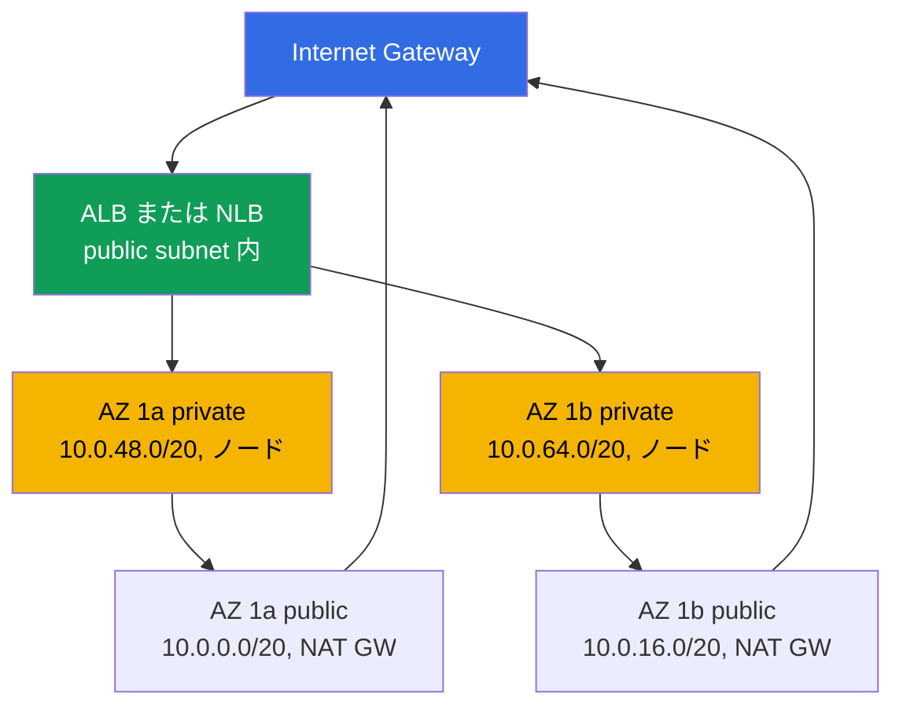
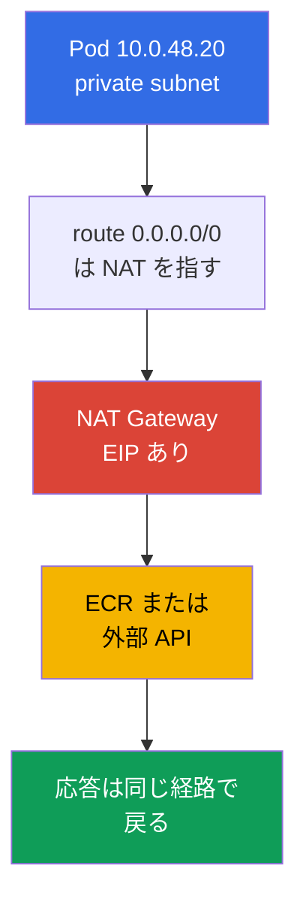
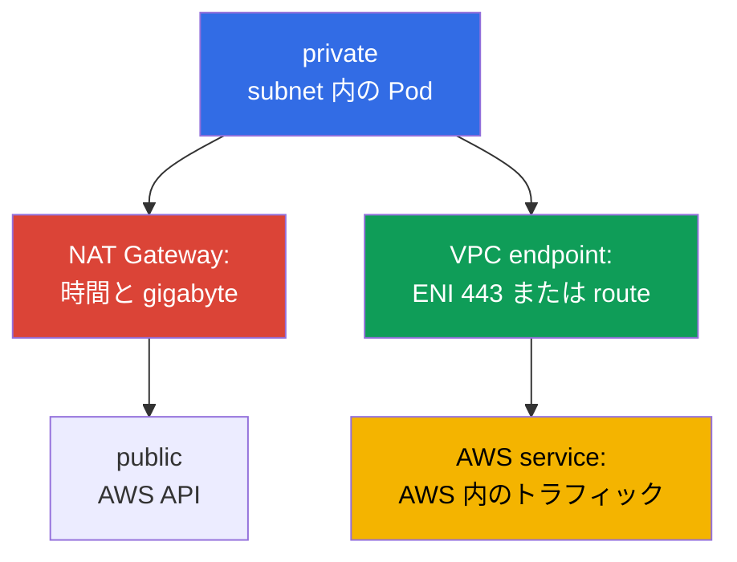

[Русская версия](ru.md) · [Eng version](en.md) · [Versión en español](es.md) · [Version française](fr.md) · [Deutsche Version](de.md) · [ქართული ვერსია](ge.md) · [繁體中文版](tw.md)
# 第 0.3 章. VPC をゼロから学ぶ: サブネット、ルーティング、IGW と NAT、security groups、VPC endpoints

> **次に進む内容。** 第 0.1 章ではリージョン、Availability Zone、サブネットの機能タグを、第 0.2 章ではロールと一時的なキーを扱いました。ここではクラスターが存在する基盤である VPC ネットワークを構築します。EKS ではこれは背景ではなく作業面です。Pod はサブネットからアドレスを取得し、ロードバランサーはタグでサブネットを選び、NAT がトラフィック料金を決めます。この上にノード (第 0.4 章)、クラスターのネットワーク (第 6、7 章)、egress (第 31 章) が成り立ちます。

## 0.3.1. VPC: リージョン内の分離ネットワークと CIDR

**VPC (Virtual Private Cloud)** は単一リージョン内の論理的に分離されたネットワークです。ほかの AWS 顧客にもそれぞれの VPC があり、自分のネットワークの `10.0.1.15` は他者の同じアドレスとは無関係です。VPC 内では、アドレス空間の定義、サブネットへの分割、ルートと firewall ルールの作成を自分で行います。

kubeadm クラスターとの違いは、EKS では **VPC ネットワークと Pod ネットワークが同一のネットワーク**であることです。標準の Amazon VPC CNI は overlay を作りません。各 Pod はノードのあるサブネット CIDR から実際のアドレスを受け取り、通常のネットワークインターフェイスとして VPC から見えます (第 6、7 章)。したがって、VPC のサイズは Pod 数のために事前に長期的に選ぶ上限です。

VPC の作成時には **primary CIDR block** を指定します。マスクは `/16` (65 536 アドレス) から `/28` までです。作成後に **変更または縮小はできません**。別のアドレス計画には新しい VPC とクラスター移行が必要です。**拡張は secondary CIDR の追加だけで可能**であり、最大 5 ブロックまで追加できます。これはアドレスを使い切ったクラスターの実用的な対策です (第 7 章)。そのため、今日 `/20` で足りそうでもクラスターには `/16` を選びます。余分なアドレスは無料ですが、不足の解消は苦痛です。制約は一つで、範囲が他の VPC、社内ネットワーク、peering または Transit Gateway で接続するネットワークと重複してはなりません (第 32 章)。

この制約により、VPC を他のネットワークに接続する際の接続パターンが決まります。ここでは区別だけを示し、設定と詳細は第 32 章で扱います。

| パターン | 接続する対象 | トランジット性 | 利用場面 |
|--------|---------------|--------------|----------|
| VPC Peering | 2 つの VPC を直接接続 | なし、1:1 のみ | 単純な交換を行う VPC の組 |
| Transit Gateway | hub 経由の多数の VPC と on-prem | あり、attachment 間 | 数十の VPC によるネットワーク |
| VPC Lattice | サブネットではなくサービス | アプリケーション層 | アカウントをまたぐ L7 接続 |

VPC Peering と Transit Gateway には重複しない CIDR が必要なため、アドレス計画は組織レベルで調整します。VPC Lattice はサービスレベルで動作し、共有アドレス計画を必要としませんが、これはサブネットではなくアプリケーション接続の話です (第 32 章)。

## 0.3.2. サブネット: 1 つの AZ、public と private、EKS 向け配置

**サブネット (subnet)** は VPC CIDR の一部で、**厳密に 1 つの AZ** に結び付けられます。サブネットのリソースはその zone に物理的に存在します。`eu-central-1a` のノードは別の zone には移れず、EBS volume は同じ AZ の instance にだけ mount できます (第 0.1 章、第 23 章で詳述)。

public subnet と private subnet の違いは **サブネットの設定そのものではなく**、route table だけです。public subnet には Internet Gateway への `0.0.0.0/0` ルートがあり、private subnet ではそのルートは NAT Gateway を指すか、まったく存在しません。`public: true` フラグはありません。`MapPublicIpOnLaunch` はありますが、IGW へのルートなしでは public address は役に立ちません。EKS の典型的な配置は、各 AZ に 2 つのサブネットを置き、public subnet をロードバランサーと NAT Gateway に、private subnet をノードと Pod に割り当てることです。図には 2 zone を示しますが、3 つ目も同様です。



ノードは private subnet に置きます。public address がなければ、インターネットから kubelet や Pod に到達できず、受信トラフィックはロードバランサーだけを通ります (インターネットなしのクラスターは第 19 章)。internet-facing ALB と NLB はそこに作成され、`kubernetes.io/role/elb` タグで検出されるため、public subnet が必要です (第 0.1 章)。クラスター作成時にサブネットを設定へ渡し、control plane はノードとの通信のためにそこへインターフェイスを配置します。このため少なくとも 2 AZ のサブネットが必須です。

```bash
# VPC サブネット: zone、CIDR、空きアドレス
aws ec2 describe-subnets --filters "Name=vpc-id,Values=vpc-0a1b2c3d4e5f6a7b8" \
  --query 'Subnets[].[SubnetId,AvailabilityZone,AvailableIpAddressCount]' --output table
```

## 0.3.3. Route table、IGW、NAT Gateway: トラフィックが外へ出る経路

**Route table** は「どのネットワークへ何を経由して行くか」を示すルール一覧です。各サブネットには正確に 1 つの active table があります。明示的な association がない場合は VPC の main route table が使われます。どの table にも VPC 自身の CIDR への local route があり、VPC 内では gateway や NAT なしで直接通信します。**Internet Gateway (IGW)** は VPC からインターネットへの gateway で、VPC ごとに 1 つ、利用料は無料です。ただし、それだけでは何も公開されず、public address と route が必要です。

**NAT Gateway** は managed NAT です。private subnet の instance はその public address から外部へ出ます。NAT の仕組みは CKA で学んだとおりですが、重要なのは非対称性です。発信接続は通りますが、外部からの受信接続は通らず、インターネットには private address への戻り route がありません。そのため private subnet に受信トラフィック専用の保護は不要です。



NAT Gateway は請求額で最も高価な項目の一つです。gateway の存在時間と **処理した各 gigabyte** の両方に料金がかかります。NAT 経由で ECR から image を pull し、CloudWatch に log を書き、S3 を読むクラスターは、VPC endpoints に逃がせるトラフィックに対して支払っています (0.3.7 節、第 31 章)。したがって典型的な選択は、**AZ ごとに 1 つの NAT** が production の標準です。zone が障害になっても他の egress は失われず、inter-AZ transfer 料金もありません。**リージョンごとに 1 つ**は dev と学習環境向けで、gateway 時間を節約できますが単一障害点になります。

```bash
# サブネットの route: igw-... と nat-... のどちらを指すか
aws ec2 describe-route-tables --filters "Name=vpc-id,Values=vpc-0a1b2c3d4e5f6a7b8" \
  --query 'RouteTables[].{RT:RouteTableId,R:Routes[].[DestinationCidrBlock,GatewayId]}'

# NAT Gateway の数と配置サブネット
aws ec2 describe-nat-gateways --filter "Name=vpc-id,Values=vpc-0a1b2c3d4e5f6a7b8" \
  --query 'NatGateways[].[NatGatewayId,SubnetId]' --output table
```

## 0.3.4. Security groups と NACL: 2 層のフィルタリング

**Security group (SG)** はサブネットではなく **network interface (ENI)** レベルの stateful firewall です。許可ルールだけを持ち、SG が確立済み接続を記憶するため、応答トラフィックは自動で通ります。重要な特性は、ルールの source に CIDR だけでなく **別の security group** を指定できることです。`sg-nodes` から port 5432 を許可するという記述は、ノードのアドレスが変わっても有効です。**Network ACL (NACL)** は **サブネット** 境界の stateless filter です。ルールには番号があり allow と deny が使えますが、状態を追跡しないため ephemeral port を含む両方向を許可する必要があります。

| 特性 | Security group | Network ACL |
|----------|----------------|-------------|
| レベル | ENI (instance、Pod、ロードバランサー) | サブネット全体 |
| 状態 | stateful、応答は自動許可 | stateless、両方向が必要 |
| ルール | allow のみ | 番号順の allow と deny |
| ルールの source | CIDR **または別の SG** | CIDR のみ |
| EKS での実践 | ENI ごとに複数 SG、主要な手段 | default のままにする |

通常は security groups で filter し、サブネットレベルで明示的な deny が必要な場合だけ NACL を使います。stateless ルールは診断が難しく、「トラフィックがちょうど一方向だけ消えた」は手作り NACL の典型的な症状です (第 46 章)。

EKS クラスターでは 3 種類の group を扱います。**クラスター SG** (cluster security group) は EKS が作成し、control plane の interface に存在して default でノードに付与されます。その内部ではすべてのトラフィックが許可されるため、ノードと control plane は追加ルールなしで通信します。**ノード SG** は instance の ENI に付き、VPC CNI 使用時は Pod にも適用されます。ここで database への access やノード間ルールを定義します。**ロードバランサー SG** は AWS Load Balancer Controller が作成し、外部トラフィックを受け、ノード SG の source として指定されます (第 26、27 章)。

```bash
# UserIdGroupPairs 内の他 group への参照を含む SG ルール
aws ec2 describe-security-groups --group-ids sg-0a1b2c3d4e5f6a7b8 \
  --query 'SecurityGroups[].IpPermissions'
```

SG または NACL が何を filter しているかは、ENI、サブネット、または VPC 全体の accept と reject の flow を記録する **VPC Flow Logs** で分かります。SecOps と incident 調査では CloudWatch Logs に log を出し、`action = REJECT` で filter します。これにより誰が閉じた port をたたいているか、手作り NACL による一方向の遮断がどこにあるかを見つけられます。reject されたトラフィックは accept より桁違いに少ないため、REJECT filter は低コストで有益です。

```
# CloudWatch Logs Insights: reject されたトラフィックだけを新しい順に表示
fields @timestamp, interfaceId, srcAddr, dstAddr, srcPort, dstPort, protocol, action
| filter action = "REJECT"
| sort @timestamp desc
| limit 50
```

## 0.3.5. クラスターに実際に必要なアドレス数

VPC CNI では **各 Pod がノードのサブネットから IP を 1 つ使う**ため、アドレスを数える必要があります。kubeadm のように「Pod が overlay に存在する」のではなく、文字どおりです。ノード上の 40 Pod はノード自身のアドレスに加えてサブネットの 40 アドレスを使います。plugin は warm address の pool も事前に維持するため、実消費量は起動中 Pod 数より大きくなります。さらに AWS は **各サブネットで 5 アドレスを予約**します。network address、VPC router、Route 53 Resolver (VPC スケールの `.2`)、将来用の予約、最後の address です。そのため `/24` で利用できるのは 256 ではなく 251 アドレスです。

| マスク | 総アドレス数 | 利用可能 (5 を除く) | 用途 |
|-------|---------------|--------------------|---------------|
| `/24` | 256 | 251 | ロードバランサー用 public subnet |
| `/22` | 1 024 | 1 019 | 小規模クラスター、dev |
| `/20` | 4 096 | 4 091 | ノード用 private subnet の実用的なサイズ |
| `/19` | 8 192 | 8 187 | 大規模クラスターまたは成長余地 |
| `/16` | 65 536 | 65 531 | VPC 全体 |

ノードに `/24` がすぐ不足する理由は、251 アドレスが約 29 Pod の密度を持つ `m5.large` ノード約 5 台に相当するからです。クラスターは 1 週間で成長し、Pod は `failed to assign an IP address` のような error で `Pending` になります。この対処は scaling ではなくネットワークの再計画です。選択肢 (第 7 章で詳述) は、ノードが個別アドレスの代わりに `/28` block を取得して ENI 数を増やさず密度を上げる **prefix delegation**、Pod subnet 向けの `100.64.0.0/10` からの **secondary CIDR**、Pod を個別 subnet に置く **custom networking** です。

これら 3 つは IPv4 の上限を回避します。戦略的な解決策は **dual-stack** です。VPC は AWS から IPv6 の `/56` block を、サブネットは `/64` を取得します。IPv6 mode では Pod は実質的に尽きない空間から address を取り、Pod 用 IPv4 の不足が原理的に解消されます。一方、ノードは IPv6 を持たない service のため IPv4 を維持します。サブネット配置は IPv6 を前提に早期に計画します。クラスターを IPv6 に移行すること自体は別のテーマです (第 7 章)。

## 0.3.6. VPC の DNS: これなしでは何も動かない理由

VPC には 2 つの DNS attribute があり、どちらも重要です。**`enableDnsSupport`** は組み込み resolver、すなわち VPC CIDR の「base + 2」アドレス (`10.0.0.0/16` なら `10.0.0.2`) と `169.254.169.253` の **Route 53 Resolver** を有効にします。**`enableDnsHostnames`** は instance に `ip-10-0-48-20.eu-central-1.compute.internal` のような name を発行します。

EKS では両方が `true` でなければならず、これは推奨ではなく要件です。resolver がなければ **クラスターの CoreDNS は外部を解決できません**。その upstream は同じ `.2` であり、Pod は `ecr.eu-central-1.amazonaws.com` も外部 API address も解決できません。DNS hostnames がなければ **クラスターの private endpoint** が壊れます。private mode の API server name は private hosted zone 経由で返され、これらの attribute がなければノードは control plane を見つけられません。同じ仕組みは第 29 章の external-dns と Route 53 の下にもあります。

```bash
# DNS attribute を確認し、必要であれば有効化する。リクエストごとに 1 attribute
aws ec2 describe-vpc-attribute --vpc-id vpc-0a1b2c3d4e5f6a7b8 --attribute enableDnsSupport
aws ec2 modify-vpc-attribute --vpc-id vpc-0a1b2c3d4e5f6a7b8 --enable-dns-hostnames
```

組み込み resolver には、高負荷クラスターで問題になる上限があります。**network interface ごとに毎秒 1024 packet** であり、この limit は Service Quotas で **増やせません**。2 つの点がこの limit を分かりにくくします。第一に、これは **すべての link-local service で共有**されます。resolver query、`169.254.169.254` の IMDS への request、NTP による時刻同期が合算されます。第二に、interface ごとに計算され、ノード上の Pod はその ENI にあるため、kubelet、CNI、すべての agent と一つの budget を共有します。超過時に resolver はトラフィックを捨てるだけで、特定の name に結び付かない **断続的な DNS timeout** という不快な症状になります。Pod の `ndots:5` は、外部 name への 1 回の query を複数 request にするため問題を悪化させます。標準的な緩和策はノード上の local cache である NodeLocal DNSCache です。この種の incident の診断と解決は第 46 章で扱います。

resolver のもう一つの特性として、**そこへのトラフィックは security group でも NACL でも filter できません**。これは private クラスターを簡単にしますが、DNS の拒否は network layer ではなくクラスター内の policy で構築する必要があり、port 53 は例外として残すことを意味します (第 30 章)。

## 0.3.7. VPC endpoints: AWS service への private access

default では AWS API への request は public address に行きます。つまり private subnet からは NAT Gateway を通り、料金と「外へ出ない」という要件の影響を受けます。**VPC endpoint** はこの経路を除き、service へのトラフィックを AWS network 内に留めます。**Gateway endpoint** は **S3 と DynamoDB** 専用です。これは service prefix list への route table entry で、address を消費せず **endpoint 自体の料金はありません**。**Interface endpoint (AWS PrivateLink)** は、サブネット内の private address を持つ ENI と通常の service address を捕捉する private DNS name です。ほぼすべての service に使えますが、各 AZ の時間料金と gigabyte 料金がかかり、port 443 を許可する SG が必要です。



インターネットへの出口がないクラスター (第 19 章) には特定のセットが必要です。endpoint 名はリージョンに結び付いており、`com.amazonaws.eu-central-1.s3` のようになります。

| Endpoint | 種類 | クラスターでの用途 |
|----------|-----|----------------|
| `com.amazonaws.eu-central-1.ecr.api` | Interface | image registry の認証 |
| `com.amazonaws.eu-central-1.ecr.dkr` | Interface | image の pull 自体 (第 20 章) |
| `com.amazonaws.eu-central-1.s3` | Gateway | ECR image layer は S3 にある |
| `com.amazonaws.eu-central-1.sts` | Interface | IRSA と token から key への交換 (第 16 章) |
| `com.amazonaws.eu-central-1.ec2` | Interface | controller と CNI: ENI、instance |
| `com.amazonaws.eu-central-1.elasticloadbalancing` | Interface | LB Controller (第 26 章) |
| `com.amazonaws.eu-central-1.logs` | Interface | CloudWatch の log (第 34 章) |

関係に注意してください。S3 の gateway endpoint がなければ、private クラスターは依然として image を download できません。ECR layer は S3 に保存されるためです。これはクラスターを初めてインターネットから切り離す際に最も多い失敗です。利益の計算は単純です。service に NAT 経由で月数十 gigabyte が流れるなら interface endpoint はすぐに元を取ります。トラフィックがほとんどなければ、3 zone の 3 ENI が NAT より高くなる可能性があります (第 31 章)。

**endpoint policy** も知っておくべきです。これは endpoint 自体にある resource policy で、gateway と interface の両方にあります。重要なのは、**default ではすべてを許可する**ことです。つまり「NAT に払わないため」に作った endpoint は何も制限しません。endpoint は request の **方向**が見える唯一の場所なので、制限には価値があります。有効な権限を持つ侵害済み Pod は、role の IAM policy に `s3:PutObject` が `*` に対してあれば、**他者の** S3 bucket に data を upload できます。endpoint policy はまさにこれを閉じます。組織の resource (`aws:ResourceOrgID`) または列挙した account (`aws:PrincipalAccount`) だけへの access を許可するため、外部 bucket への request は自分の endpoint を通りません。

逆の問題は bucket policy が解決します。bucket policy の `aws:SourceVpce` と `aws:PrincipalOrgID` 条件は「**自分の** bucket に誰が access できるか」を答え、ネットワーク外からの access を防ぎます。これは異なる 2 つの control であり、混同してはいけません。外部への漏えいは endpoint policy が防ぎ、自分の bucket は bucket policy が閉じます。両者は AWS が data perimeter と呼ぶものを構成し、private クラスターでは標準的な hardening の一部です (第 19 章)。

```bash
# S3 用 Gateway endpoint: 指定した route table へ route を追加し、料金は発生しない
aws ec2 create-vpc-endpoint --vpc-id vpc-0a1b2c3d4e5f6a7b8 \
  --vpc-endpoint-type Gateway --service-name com.amazonaws.eu-central-1.s3 \
  --route-table-ids rtb-0aaa1111 rtb-0bbb2222

# ECR 用 Interface endpoint: private subnet の ENI、private DNS を有効化
aws ec2 create-vpc-endpoint --vpc-id vpc-0a1b2c3d4e5f6a7b8 \
  --vpc-endpoint-type Interface --service-name com.amazonaws.eu-central-1.ecr.dkr \
  --subnet-ids subnet-0aaa subnet-0bbb --security-group-ids sg-0a1b --private-dns-enabled
```

## 0.3.8. IaC での VPC の見え方

VPC を手作業で作るのは、仕組みを理解するための一度だけです。実際にはすべてを code で記述します。アドレス計画、サブネット tag、NAT 数、endpoint セットは、稼働中に変更できず再現可能でなければならないものだからです。Terraform の典型的な resource セットは、CIDR と DNS attribute を持つ `aws_vpc`、AZ と role ごとの `aws_subnet`、`aws_internet_gateway`、EIP 付きの `aws_nat_gateway`、route と association を持つ `aws_route_table`、`aws_security_group`、`aws_vpc_endpoint` です。通常はその上に `terraform-aws-modules/vpc/aws` module を使います。

code に必須なのは、public subnet の `kubernetes.io/role/elb`、private subnet の `kubernetes.io/role/internal-elb`、サブネットと SG の `karpenter.sh/discovery` tag (第 0.1 章)、`enable_dns_hostnames` と `enable_dns_support`、Pod 増加を見込んだ subnet mask の余裕、network stack の一部としての VPC endpoints です。コースの lab では VPC をクリックで作りません。Terragrunt に分離された `vpc` stack が必要な配置と tag で network を作成し、cluster stack は dependency を通じてその identifier を取ります (第 0.5 章)。

## 0.3.9. production での適用方法

- **アドレス計画はクラスター作成前に合意します。** VPC には `/16`、node private subnet には `/20` 以上、3 AZ、社内 network との重複なしです。
- **ノードは private subnet のみに置きます。** public subnet はロードバランサーと NAT に割り当て、prod のノードに public address はありません。
- **AZ ごとに 1 NAT、S3 gateway endpoint は常に作ります。** interface endpoints のセットは実測に従い拡張します。NAT 経由の行き先を調べ、大きな flow を閉じます。
- **access は CIDR list ではなく SG 参照で記述します。** ルールはノードを再作成しても維持されます。明示的な security requirement がなければ NACL は default のままです。

## 0.3.10. ミニ用語集

- **VPC** はリージョン内の分離された network です。primary CIDR (`/16` ... `/28`) は変更できず、secondary CIDR でだけ拡張できます。**サブネット** は 1 AZ 内の VPC CIDR の一部です。
- **Route table** は subnet の routing table です。public と private subnet は default route だけが異なります。**Internet Gateway** は public address 向けの無料の internet gateway です。**NAT Gateway** は時間と gigabyte で課金される managed NAT です。
- **Security group** は ENI 上の stateful firewall で、allow のみ、source に別の SG を指定できます。**Network ACL** は subnet 上の stateless filter で、rule number ごとの allow と deny があります。
- **ENI** は network interface です。VPC CNI では Pod は node ENI の address を受け取ります。**Route 53 Resolver** は「CIDR + 2」address の組み込み VPC DNS であり、CoreDNS の upstream です。**VPC endpoint** は AWS service への private access で、gateway (S3、DynamoDB) または interface (PrivateLink) です。
- **Dual-stack** は IPv4 と IPv6 (`/56` と `/64`) を持つ VPC と subnet です。IPv6 mode は Pod address の不足を解消します。**VPC Flow Logs** は accept と reject の flow record です。CloudWatch Logs Insights の `action = REJECT` filter は SecOps と診断の手段です。

## 0.3.11. この章のまとめ

- VPC の primary CIDR は縮小も変更もできないため、余裕を持って `/16` を選びます。拡張は secondary CIDR のみで、サブネットは 1 AZ に属します (第 7 章)。
- `0.0.0.0/0` から IGW への route が subnet を public にします。NAT への route または route がないことが private にします。EKS ではノードは private subnet、ロードバランサーは public subnet に置きます。
- NAT Gateway は発信 access を提供しますが、内側への逆 route は作りません。時間と gigabyte に対して課金されます。AZ ごとに 1 NAT は高可用性、リージョンごとに 1 NAT は節約と単一障害点を意味します (第 31 章)。
- Security group は ENI 上の stateful な主要 filter で、別 SG を参照する rule を使えます。NACL は subnet 上の stateless filter で、通常は default のままです。
- VPC CNI では Pod が subnet IP を使い、AWS が 5 address を取るため、node 用 `/24` はすぐ尽きます。次に prefix delegation、secondary CIDR、custom networking を使います (第 6、7 章)。`enableDnsSupport` と `enableDnsHostnames` は必須です。CoreDNS は `.2` resolver を使い、クラスターの private endpoint は DNS name に依存します。
- VPC endpoints は NAT からトラフィックを外し、インターネットなしのクラスターを可能にします。最低限は `ecr.api`、`ecr.dkr`、`s3` (gateway)、`sts`、`ec2`、`elasticloadbalancing` です (第 19、31 章)。

## 0.3.12. 実際の業務で役立つ点

EKS の incident の半分はこの章にあります。scheduler event がない `Pending` Pod なら subnet の空き address を確認します。node がクラスターに join しないなら route、SG、または欠けた endpoint を確認します (第 45 章)。ロードバランサーが作成されないなら subnet tag がありません。トラフィックが一方向だけ消えたなら手作り NACL です。請求が 3 分の 1 増えたなら NAT と zone 間トラフィックです。そして最も重要な決定は、最初のクラスターより前に一度だけ行います。どのアドレス計画にするかです。

## 0.3.13. 自己確認の質問

1. VPC の primary CIDR を余裕を持って選ぶ理由と、address が尽きた場合の対処は何ですか。
2. AWS configuration において public subnet と private subnet は何が違いますか。
3. subnet が 1 AZ に結び付く理由と、PVC と node への影響は何ですか。
4. private subnet からインターネットへトラフィックが届く経路と、戻れない理由は何ですか。
5. リージョンごとに 1 NAT Gateway と AZ ごとに 1 NAT Gateway では、prod にはどちらを選び、その理由は何ですか。
6. security group と NACL は何が違い、default ではどちらを使いますか。
7. `/24` subnet で利用可能な address 数と、VPC CNI 使用時に収容できる node 数はどの程度ですか。
8. VPC に `enableDnsSupport` と `enableDnsHostnames` が必要な理由は何ですか。
9. インターネットなしのクラスターに必須の VPC endpoints と、その中に S3 がある理由は何ですか。
10. dual-stack は Pod の IPv4 不足をどのように解消し、その場合も IPv4 に残るものは何ですか。
11. VPC Peering と Transit Gateway の違い、および VPC Lattice が適する場面は何ですか。
12. VPC Flow Logs を `action = REJECT` で filter する理由と、見つけられるものは何ですか。

## 演習

Part 0 には専用 lab がありません。network はコース lab の `vpc` stack で作成され (第 0.5 章)、そこでは同じ subnet 配置、tag、endpoint を code として確認できます。次は EC2 と料金モデルです。instance type、AMI、on-demand、spot、Savings Plans、つまり先ほど private subnet に配置したノードを構成するすべてを扱います。

---
[目次](../README_JP.md) · [第 0.2 章](../00-2-iam/jp.md) · [第 0.4 章](../00-4-ec2/jp.md)
