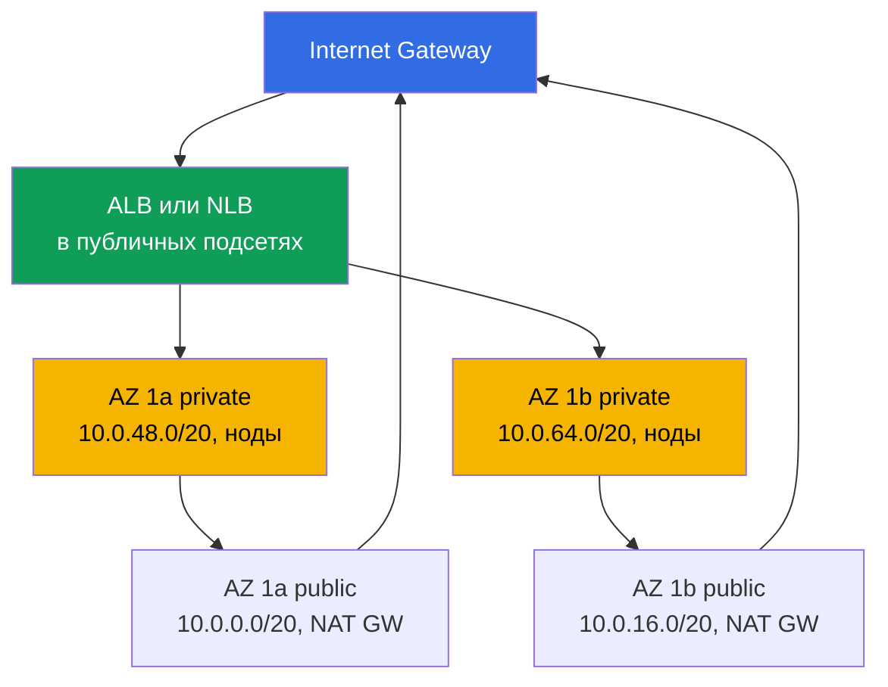
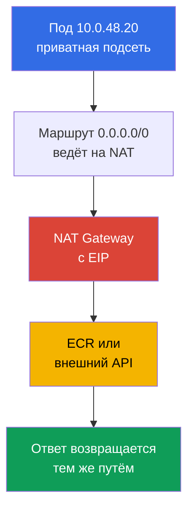
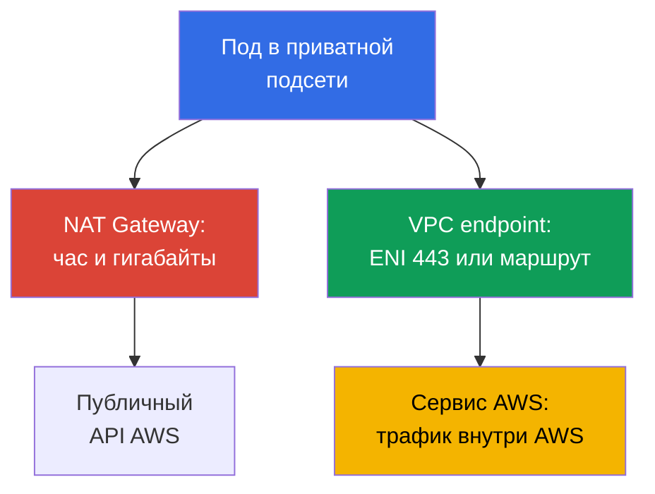

[Eng version](en.md) · [Versión en español](es.md) · [Version française](fr.md) · [Deutsche Version](de.md) · [ქართული ვერსია](ge.md) · [繁體中文版](tw.md) · [日本語版](jp.md)
# Глава 0.3. VPC с нуля: подсети, маршрутизация, IGW и NAT, security groups, VPC endpoints

> **Что дальше.** В главе 0.1 появились регион, зоны доступности и функциональные теги на
> подсетях, в главе 0.2 - роли и временные ключи. Теперь соберём то, внутри чего живёт
> кластер: сеть VPC. В EKS это не фон, а рабочая поверхность: поды берут адреса из ваших
> подсетей, балансировщики выбирают подсети по тегам, счёт за трафик формирует NAT. Дальше на
> этом встанут ноды (глава 0.4), сеть кластера (главы 6 и 7) и egress (глава 31).

## 0.3.1. VPC: изолированная сеть в регионе и её CIDR

**VPC (Virtual Private Cloud)** - логически изолированная сеть внутри одного региона. У
соседних клиентов AWS свои VPC, и адрес `10.0.1.15` в вашей сети никак не связан с таким же
адресом в чужой. Внутри VPC вы сами задаёте адресное пространство, режете его на подсети,
пишете маршруты и правила firewall.

Отличие от kubeadm-кластера в том, что в EKS **сеть VPC и сеть подов - это одна сеть**.
Стандартный Amazon VPC CNI не строит оверлей: каждый под получает реальный адрес из CIDR
подсети, где стоит нода, и виден в VPC как обычный сетевой интерфейс (главы 6 и 7). Поэтому
размер VPC - это заранее и надолго выбранный потолок числа подов.

При создании VPC указывается **основной блок CIDR**: маски от `/16` (65 536 адресов) до
`/28`. Его **нельзя изменить и нельзя сузить** после создания, другой адресный план означает
новую VPC и миграцию кластера; **расширить можно только добавлением secondary CIDR** (до пяти
блоков) - рабочий приём для кластера, у которого кончились адреса (глава 7). Отсюда практика:
под кластер берут `/16`, даже если сегодня «хватит и /20». Лишние адреса ничего не стоят,
нехватка лечится болезненно. Ограничение одно: диапазон не должен пересекаться с другими VPC,
с корпоративной сетью и с тем, что вы подключаете через peering или Transit Gateway (глава 32).

Само это ограничение задаёт выбор шаблона связности, когда VPC нужно соединить с другими
сетями. Здесь только разграничение, настройка и подробности - в главе 32.

| Шаблон | Что связывает | Транзитность | Когда берут |
|--------|---------------|--------------|-------------|
| VPC Peering | две VPC напрямую | нет, только 1:1 | пара VPC, простой обмен |
| Transit Gateway | много VPC и on-prem через хаб | да, между вложениями | сеть из десятков VPC |
| VPC Lattice | сервисы, а не подсети | на уровне приложений | связность L7 поверх аккаунтов |

VPC Peering и Transit Gateway требуют непересекающихся CIDR, поэтому адресный план согласуют
на уровне организации. VPC Lattice работает на уровне сервисов и общего плана адресов не
требует, но это уже про связность приложений, а не подсетей (глава 32).

## 0.3.2. Подсети: одна AZ, публичная и приватная, раскладка под EKS

**Подсеть (subnet)** - часть CIDR VPC, привязанная **строго к одной AZ**. Ресурс из подсети
физически стоит в её зоне: нода из `eu-central-1a` не переедет в другую зону, а том EBS
монтируется только к инстансу своей AZ (глава 0.1, подробно в главе 23).

Разница между публичной и приватной подсетью **не в настройке подсети**, а только в её
таблице маршрутизации: у публичной есть маршрут `0.0.0.0/0` на Internet Gateway, у приватной
он ведёт на NAT Gateway либо отсутствует вовсе. Флага `public: true` не существует; есть
`MapPublicIpOnLaunch`, но без маршрута на IGW публичный адрес бесполезен. Типовая раскладка
под EKS: в каждой AZ по две подсети, публичные отданы балансировщикам и NAT Gateway,
приватные - нодам и подам. На схеме две зоны, третья устроена так же.



Ноды держат в приватных подсетях: без публичного адреса из интернета к kubelet и к подам не
дотянуться, входящий трафик идёт только через балансировщик (кластер без интернета - глава
19). Публичные подсети нужны потому, что internet-facing ALB и NLB создаются именно там, а
находят их по тегу `kubernetes.io/role/elb` (глава 0.1). Подсети передают в конфигурацию
кластера при создании, и control plane размещает в них свои интерфейсы для связи с нодами,
поэтому подсети минимум в двух AZ обязательны.

```bash
# Подсети VPC: зона, CIDR, свободные адреса
aws ec2 describe-subnets --filters "Name=vpc-id,Values=vpc-0a1b2c3d4e5f6a7b8" \
  --query 'Subnets[].[SubnetId,AvailabilityZone,AvailableIpAddressCount]' --output table
```

## 0.3.3. Route table, IGW и NAT Gateway: как трафик выходит наружу

**Route table** - список правил «в какую сеть через что идти». У каждой подсети ровно одна
активная таблица (без явной привязки работает main route table VPC). В любой таблице есть
локальный маршрут на CIDR самой VPC: внутри VPC всё общается напрямую, без шлюзов и NAT.
**Internet Gateway (IGW)** - шлюз VPC в интернет, один на VPC, бесплатен; сам по себе ничего
не открывает, нужен публичный адрес и маршрут.

**NAT Gateway** - управляемый NAT: инстансы из приватных подсетей выходят наружу от его
публичного адреса. Механику NAT вы знаете из CKA, важна асимметрия: исходящее соединение
проходит, входящее извне - нет, обратного маршрута к приватному адресу в интернете не
существует. Поэтому приватная подсеть не требует отдельной защиты от входящего трафика.



NAT Gateway - одна из самых дорогих строк в счёте: платят и за час существования шлюза, и **за
каждый обработанный гигабайт**. Кластер, который через NAT тянет образы из ECR, пишет логи в
CloudWatch и читает S3, платит за трафик, который можно увести в VPC endpoints (раздел 0.3.7 и
глава 31). Отсюда классический выбор: **по одному NAT на AZ** - норма в продакшене, отказ зоны
не выносит egress остальных и нет платы за inter-AZ transfer; **один на регион** - для dev и
учебных стендов, экономит часы работы шлюзов, но становится единой точкой отказа.

```bash
# Маршруты подсетей: что ведёт в igw-..., что в nat-...
aws ec2 describe-route-tables --filters "Name=vpc-id,Values=vpc-0a1b2c3d4e5f6a7b8" \
  --query 'RouteTables[].{RT:RouteTableId,R:Routes[].[DestinationCidrBlock,GatewayId]}'

# Сколько NAT Gateway и в каких подсетях они стоят
aws ec2 describe-nat-gateways --filter "Name=vpc-id,Values=vpc-0a1b2c3d4e5f6a7b8" \
  --query 'NatGateways[].[NatGatewayId,SubnetId]' --output table
```

## 0.3.4. Security groups и NACL: два уровня фильтрации

**Security group (SG)** - stateful firewall на уровне **сетевого интерфейса (ENI)**, а не
подсети. Только разрешающие правила; ответный трафик проходит сам, потому что SG помнит
установленные соединения. Ключевая особенность: источником в правиле может быть **другая
security group**, а не только CIDR, и запись «разрешить порт 5432 из `sg-nodes`» работает при
любом изменении адресов нод. **Network ACL (NACL)** - stateless фильтр на границе **подсети**:
правила нумерованные, есть и allow, и deny, но состояние не отслеживается, поэтому разрешать
надо оба направления, включая ephemeral-порты.

| Свойство | Security group | Network ACL |
|----------|----------------|-------------|
| Уровень | ENI (инстанс, под, балансировщик) | подсеть целиком |
| Состояние | stateful, ответ разрешён сам | stateless, нужны оба направления |
| Правила | только allow | allow и deny, по номерам |
| Источник в правиле | CIDR **или другая SG** | только CIDR |
| Практика в EKS | несколько SG на ENI, основной инструмент | оставляют дефолтную |

По умолчанию фильтруйте security groups, а NACL трогайте только когда нужен явный запрет на
уровне подсети: stateless-правила тяжело диагностировать, а «трафик пропал ровно в одну
сторону» - типичный симптом самодельной NACL (глава 46).

В кластере EKS вы встретите три группы. **SG кластера** (cluster security group) создаётся
EKS, живёт на интерфейсах control plane и по умолчанию навешивается на ноды; внутри неё
разрешён весь трафик, поэтому ноды и control plane общаются без дополнительных правил. **SG
нод** висит на ENI инстансов, а значит и на подах при VPC CNI: здесь описывают доступ к базам
и правила между узлами. **SG балансировщиков** создаёт AWS Load Balancer Controller; она
принимает трафик извне и указывается как источник в SG нод (главы 26 и 27).

```bash
# Правила SG, включая ссылки на другие группы в UserIdGroupPairs
aws ec2 describe-security-groups --group-ids sg-0a1b2c3d4e5f6a7b8 \
  --query 'SecurityGroups[].IpPermissions'
```

Чем именно SG или NACL режут трафик, показывают **VPC Flow Logs** - запись о принятых и
отклонённых потоках на ENI, подсети или всей VPC. Для SecOps и разбора инцидентов включают
логи в CloudWatch Logs и фильтруют по `action = REJECT`: так видно, кто и куда стучится в
закрытые порты, и находится тот самый односторонний обрыв от самодельной NACL. Отклонённого
трафика на порядок меньше принятого, поэтому фильтр по REJECT недорог и информативен.

```
# CloudWatch Logs Insights: только отклонённый трафик, свежее сверху
fields @timestamp, interfaceId, srcAddr, dstAddr, srcPort, dstPort, protocol, action
| filter action = "REJECT"
| sort @timestamp desc
| limit 50
```

## 0.3.5. Сколько адресов реально нужно кластеру

Считать адреса приходится потому, что при VPC CNI **каждый под занимает IP из подсети ноды**.
Не «поды живут в оверлее», как в kubeadm, а буквально: 40 подов на ноде - это 40 адресов
подсети плюс адреса самой ноды. Плагин к тому же держит пул тёплых адресов заранее, поэтому
фактическое потребление выше числа запущенных подов. Ещё **5 адресов в каждой подсети
зарезервированы AWS**: адрес сети, VPC router, Route 53 Resolver (тот самый `.2` в масштабе
VPC), резерв на будущее и последний адрес. Поэтому в `/24` доступны 251 адрес, а не 256.

| Маска | Всего адресов | Доступно (минус 5) | Под что берут |
|-------|---------------|--------------------|---------------|
| `/24` | 256 | 251 | публичная подсеть под балансировщики |
| `/22` | 1 024 | 1 019 | небольшой кластер, dev |
| `/20` | 4 096 | 4 091 | рабочий размер приватной подсети под ноды |
| `/19` | 8 192 | 8 187 | крупный кластер или запас на рост |
| `/16` | 65 536 | 65 531 | вся VPC целиком |

Почему `/24` под ноды кончается быстро: 251 адрес - это примерно 5 нод типа `m5.large` с
плотностью около 29 подов. Кластер вырастает за неделю, поды начинают висеть в `Pending` с
ошибкой вида `failed to assign an IP address`, и лечится это уже не масштабированием, а
перепланированием сети. Варианты (детально в главе 7): **prefix delegation** - нода получает
блоки `/28` вместо отдельных адресов, плотность растёт без роста числа ENI; **secondary CIDR**
из `100.64.0.0/10` под подсети подов; **custom networking** - поды в отдельных подсетях.

Все три приёма - обход потолка IPv4. Стратегический выход - **dual-stack**: VPC получает
IPv6-блок `/56` от AWS, подсети - по `/64`, и в режиме IPv6 поды берут адреса из практически
неисчерпаемого пространства, а нехватка IPv4 под поды снимается в принципе. Ноды при этом
сохраняют IPv4 для сервисов без IPv6. Раскладку подсетей закладывают с расчётом на IPv6
заранее: сама миграция кластера на IPv6 - отдельная тема (глава 7).

## 0.3.6. DNS в VPC: почему без него не работает ничего

У VPC два атрибута DNS, и оба важны. **`enableDnsSupport`** включает встроенный резолвер -
**Route 53 Resolver** по адресу «база CIDR VPC плюс 2» (для `10.0.0.0/16` это `10.0.0.2`) и по
`169.254.169.253`. **`enableDnsHostnames`** отвечает за выдачу инстансам имён вида
`ip-10-0-48-20.eu-central-1.compute.internal`.

Для EKS оба должны быть `true`, и это требование, а не рекомендация. Без резолвера **CoreDNS в
кластере ничего не решит наружу**: его upstream - тот самый `.2`, и подам не разрешатся ни
`ecr.eu-central-1.amazonaws.com`, ни адреса внешних API. Без DNS hostnames ломается
**приватный endpoint кластера**: имя API-сервера в приватном режиме отдаётся через private
hosted zone, и без этих атрибутов ноды не найдут control plane. Тот же механизм лежит под
работой external-dns и Route 53 в главе 29.

```bash
# Проверить атрибут DNS (по одному за запрос) и включить при необходимости
aws ec2 describe-vpc-attribute --vpc-id vpc-0a1b2c3d4e5f6a7b8 --attribute enableDnsSupport
aws ec2 modify-vpc-attribute --vpc-id vpc-0a1b2c3d4e5f6a7b8 --enable-dns-hostnames
```

У встроенного резолвера есть потолок, о который бьются нагруженные кластеры: **1024 пакета в
секунду на сетевой интерфейс**, и этот лимит **нельзя повысить** через Service Quotas. Две
детали делают его коварнее, чем кажется. Во-первых, лимит **общий на все link-local сервисы**:
в него складываются запросы к резолверу, обращения к IMDS на `169.254.169.254` и синхронизация
времени по NTP. Во-вторых, считается он на интерфейс, а поды на ноде сидят на её ENI, то есть
делят один бюджет с kubelet, CNI и всеми агентами. При превышении резолвер просто отбрасывает
трафик, и симптом получается неприятный: не отказ, а **плавающие таймауты DNS** без привязки к
конкретному имени. Усугубляет всё `ndots:5` в подах, из-за которого одно обращение к внешнему
имени превращается в несколько запросов. Штатное смягчение - NodeLocal DNSCache, локальный
кэш на ноде; диагностика и лечение этого класса инцидентов - в главе 46.

Ещё одна особенность резолвера: **трафик к нему нельзя фильтровать ни security group, ни
NACL**. Это упрощает жизнь в приватных кластерах, но означает, что запрет DNS строится не в
сетевом слое, а политиками в кластере, где порт 53 приходится оставлять исключением (глава 30).

## 0.3.7. VPC endpoints: приватный доступ к сервисам AWS

По умолчанию обращение к API AWS идёт на публичный адрес, то есть из приватной подсети - через
NAT Gateway, со всеми последствиями по деньгам и по требованию «наружу не ходим». **VPC
endpoint** убирает этот путь: трафик к сервису остаётся внутри сети AWS. **Gateway endpoint**
существует только для **S3 и DynamoDB**: это маршрут в route table на префикс-лист сервиса,
адресов он не занимает и **платы за сам endpoint нет**. **Interface endpoint (AWS
PrivateLink)** - ENI с приватным адресом в ваших подсетях плюс приватное DNS-имя, которое
перехватывает обычный адрес сервиса; работает почти для всех сервисов, но платный за час в
каждой AZ и за гигабайты, и требует SG с разрешённым портом 443.



Кластеру без выхода в интернет (глава 19) нужен конкретный набор; имена endpoint привязаны к
региону и выглядят как `com.amazonaws.eu-central-1.s3`.

| Endpoint | Тип | Зачем кластеру |
|----------|-----|----------------|
| `com.amazonaws.eu-central-1.ecr.api` | Interface | авторизация в реестре образов |
| `com.amazonaws.eu-central-1.ecr.dkr` | Interface | сам pull образов (глава 20) |
| `com.amazonaws.eu-central-1.s3` | Gateway | слои образов ECR лежат в S3 |
| `com.amazonaws.eu-central-1.sts` | Interface | IRSA и обмен токена на ключи (глава 16) |
| `com.amazonaws.eu-central-1.ec2` | Interface | контроллеры и CNI: ENI, инстансы |
| `com.amazonaws.eu-central-1.elasticloadbalancing` | Interface | LB Controller (глава 26) |
| `com.amazonaws.eu-central-1.logs` | Interface | логи в CloudWatch (глава 34) |

Заметьте связку: без gateway endpoint на S3 приватный кластер всё равно не скачает образ,
потому что слои ECR хранятся в S3. Это самая частая ошибка при первой попытке отрезать кластер
от интернета. Выгода считается просто: если через NAT в сервис идут десятки гигабайт в месяц,
interface endpoint окупается сразу; если трафика почти нет, три ENI в трёх зонах могут
оказаться дороже NAT (глава 31).

Отдельно стоит знать про **endpoint policy** - политику ресурса на самом endpoint, которая
есть и у gateway, и у interface типов. Важно: **по умолчанию она разрешает всё**, то есть
endpoint, поднятый «чтобы не платить за NAT», не ограничивает ничего. А ограничивать полезно,
потому что endpoint - единственная точка, где видно **направление** запроса. Взломанный под с
валидными правами может выгрузить данные в **чужой** бакет S3, и IAM-политика роли этому не
мешает, если в ней стоит `s3:PutObject` на `*`. Endpoint policy закрывает именно это: она
разрешает доступ только к ресурсам своей организации (`aws:ResourceOrgID`) или перечисленных
аккаунтов (`aws:PrincipalAccount`), и запрос в сторонний бакет через ваш endpoint не проходит.

Обратную задачу решает уже политика бакета: условия `aws:SourceVpce` и `aws:PrincipalOrgID` в
bucket policy отвечают на вопрос «кто может обращаться к **моему** бакету» и защищают его от
доступа мимо вашей сети. Это два разных контроля, и путать их не стоит: от утечки наружу
защищает endpoint policy, свой бакет закрывает bucket policy. Вместе они складываются в то, что
AWS называет data perimeter; в приватном кластере это штатная часть харденинга (глава 19).

```bash
# Gateway endpoint для S3: маршрут в указанные route tables, плата не берётся
aws ec2 create-vpc-endpoint --vpc-id vpc-0a1b2c3d4e5f6a7b8 \
  --vpc-endpoint-type Gateway --service-name com.amazonaws.eu-central-1.s3 \
  --route-table-ids rtb-0aaa1111 rtb-0bbb2222

# Interface endpoint для ECR: ENI в приватных подсетях, приватное DNS включено
aws ec2 create-vpc-endpoint --vpc-id vpc-0a1b2c3d4e5f6a7b8 \
  --vpc-endpoint-type Interface --service-name com.amazonaws.eu-central-1.ecr.dkr \
  --subnet-ids subnet-0aaa subnet-0bbb --security-group-ids sg-0a1b --private-dns-enabled
```

## 0.3.8. Как VPC выглядит в IaC

Руками VPC создают один раз, чтобы понять механику. В реальности всё описано кодом, и это
принципиально: адресный план, теги подсетей, число NAT и набор endpoints - как раз то, что
нельзя менять «на живом» и что обязано быть воспроизводимым. Типовой набор ресурсов в
Terraform: `aws_vpc` с CIDR и атрибутами DNS, `aws_subnet` по одной на AZ и на роль,
`aws_internet_gateway`, `aws_nat_gateway` с EIP, `aws_route_table` с маршрутами и привязками,
`aws_security_group` и `aws_vpc_endpoint`; поверх обычно берут модуль
`terraform-aws-modules/vpc/aws`.

Обязательно в коде: теги `kubernetes.io/role/elb` на публичных и
`kubernetes.io/role/internal-elb` на приватных подсетях плюс `karpenter.sh/discovery` на
подсетях и SG (глава 0.1); `enable_dns_hostnames` и `enable_dns_support`; запас в масках
подсетей с учётом роста числа подов; набор VPC endpoints как часть стека сети. В лабах курса
VPC не создаётся кликами: есть отдельный стек `vpc` в Terragrunt, который поднимает сеть с
нужной раскладкой и тегами, а стек кластера берёт её идентификаторы через зависимости
(глава 0.5).

## 0.3.9. Как это применяют в продакшене

- **Адресный план согласуют до создания кластера.** `/16` на VPC, `/20` и крупнее под приватные
  подсети нод, три AZ, никаких пересечений с корпоративной сетью.
- **Ноды только в приватных подсетях,** публичные отданы балансировщикам и NAT; публичных
  адресов на нодах в prod не бывает.
- **NAT по одному на AZ, S3 gateway endpoint всегда.** Набор interface endpoints расширяют по
  факту: смотрят, куда уходит трафик через NAT, и закрывают крупные потоки.
- **Доступ описывают ссылками на SG,** а не списками CIDR: правила переживают пересоздание нод.
  NACL остаётся дефолтной, если нет явного требования безопасности.

## 0.3.10. Мини-глоссарий

- **VPC** - изолированная сеть в регионе; основной CIDR (`/16` ... `/28`) неизменяем,
  расширяется только secondary CIDR. **Подсеть** - часть CIDR VPC в одной AZ.
- **Route table** - таблица маршрутов подсети; публичная и приватная подсеть отличаются только
  маршрутом по умолчанию. **Internet Gateway** - бесплатный шлюз в интернет для публичных
  адресов. **NAT Gateway** - управляемый NAT, платный за час и за гигабайт.
- **Security group** - stateful firewall на ENI, только allow, источником может быть другая SG.
  **Network ACL** - stateless фильтр на подсети, allow и deny по номерам правил.
- **ENI** - сетевой интерфейс; при VPC CNI поды получают адреса на ENI ноды. **Route 53
  Resolver** - встроенный DNS VPC по адресу «CIDR плюс 2», upstream для CoreDNS. **VPC
  endpoint** - приватный доступ к сервису AWS: gateway (S3, DynamoDB) или interface
  (PrivateLink).
- **Dual-stack** - VPC и подсети с IPv4 и IPv6 (`/56` и `/64`); режим IPv6 снимает нехватку
  адресов под поды. **VPC Flow Logs** - запись принятых и отклонённых потоков; фильтр
  `action = REJECT` в CloudWatch Logs Insights - инструмент SecOps и диагностики.

## 0.3.11. Итоги главы

- Основной CIDR VPC не сузить и не поменять, поэтому берут `/16` с запасом; расширение только
  через secondary CIDR (глава 7). Подсеть живёт в одной AZ.
- Публичной подсеть делает маршрут `0.0.0.0/0` на IGW, приватной - маршрут на NAT или его
  отсутствие. Под EKS: ноды в приватных подсетях, балансировщики в публичных.
- NAT Gateway даёт исходящий доступ и обратного пути внутрь не создаёт. Платят за час и за
  гигабайты; один NAT на AZ - отказоустойчивость, один на регион - экономия и единая точка
  отказа (глава 31).
- Security group - stateful на ENI и основной инструмент фильтрации, с правилами по ссылке на
  другие SG. NACL - stateless на подсети, обычно остаётся дефолтной.
- При VPC CNI под занимает IP подсети, 5 адресов забирает AWS, и `/24` под ноды кончается почти
  сразу: дальше prefix delegation, secondary CIDR или custom networking (главы 6 и 7).
  `enableDnsSupport` и `enableDnsHostnames` обязательны: на резолвере `.2` стоит CoreDNS, а на
  DNS-именах - приватный endpoint кластера.
- VPC endpoints убирают трафик из NAT и делают возможным кластер без интернета. Минимум:
  `ecr.api`, `ecr.dkr`, `s3` (gateway), `sts`, `ec2`, `elasticloadbalancing` (главы 19, 31).

## 0.3.12. Как это пригодится в реальной работе

Половина инцидентов в EKS живёт в этой главе. Под в `Pending` без событий планировщика -
смотрите свободные адреса в подсети. Нода не присоединилась к кластеру - маршрут, SG или
отсутствующий endpoint (глава 45). Балансировщик не создался - нет тега на подсети. Трафик
пропал в одну сторону - самодельная NACL. Счёт вырос на треть - NAT и трафик между зонами. А
самое важное решение принимается один раз, до первого кластера: какой у вас адресный план.

## 0.3.13. Вопросы для самопроверки

1. Почему основной CIDR VPC берут с запасом и что делать, если адреса кончились?
2. Чем публичная подсеть отличается от приватной на уровне конфигурации AWS?
3. Почему подсеть привязана к одной AZ и как это влияет на PVC и на ноды?
4. Как трафик из приватной подсети попадает в интернет и почему обратно нельзя?
5. Один NAT Gateway на регион против одного на AZ: что выбрать в prod и почему?
6. Чем security group отличается от NACL и что использовать по умолчанию?
7. Сколько адресов доступно в подсети `/24` и на сколько нод их хватит при VPC CNI?
8. Зачем VPC нужны `enableDnsSupport` и `enableDnsHostnames`?
9. Какие VPC endpoints обязательны кластеру без интернета и почему среди них S3?
10. Как dual-stack снимает нехватку IPv4 под поды и что при этом остаётся на IPv4?
11. Чем VPC Peering отличается от Transit Gateway и где уместен VPC Lattice?
12. Зачем фильтровать VPC Flow Logs по `action = REJECT` и что это помогает найти?

## Практика

Своих лаб у Части 0 нет: сеть создаётся стеком `vpc` в лабах курса (глава 0.5), и там вы
увидите ту же раскладку подсетей, теги и endpoints уже в виде кода. Дальше - EC2 и модели
оплаты: типы инстансов, AMI, on-demand, spot и Savings Plans, то есть всё, из чего собираются
ноды, которые вы только что расселили по приватным подсетям.

---
[Оглавление](../README_RU.md) · [Глава 0.2](../00-2-iam/ru.md) · [Глава 0.4](../00-4-ec2/ru.md)
