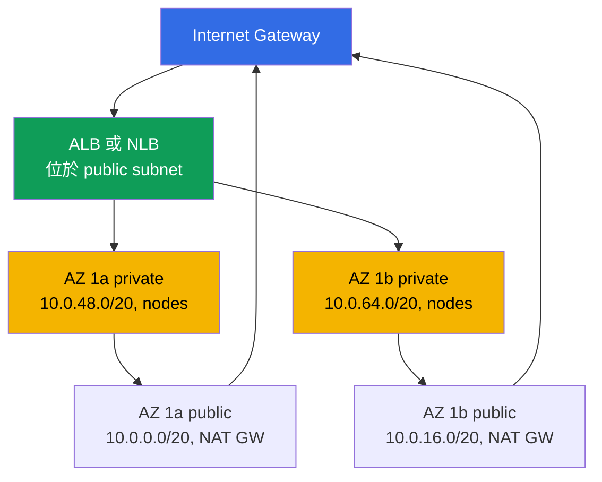
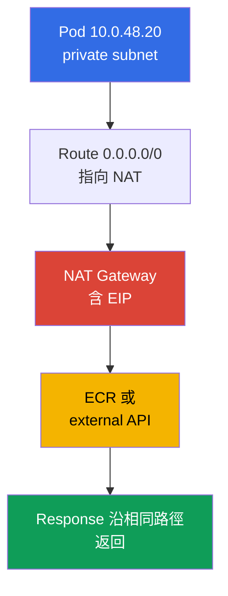
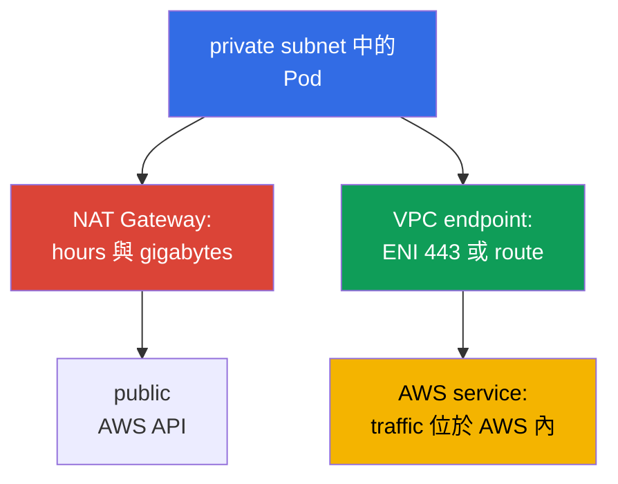

[Русская версия](ru.md) · [Eng version](en.md) · [Versión en español](es.md) · [Version française](fr.md) · [Deutsche Version](de.md) · [ქართული ვერსია](ge.md) · [日本語版](jp.md)
# 第 0.3 章. 從零開始認識 VPC：subnet、路由、IGW 與 NAT、security groups、VPC endpoints

> **接下來。** 第 0.1 章介紹了 region、availability zones 與 subnet 上的功能性 tags，第 0.2 章介紹了 roles 與暫時性 keys。現在我們要建立 cluster 所在的 VPC 網路。在 EKS 中，它不是背景，而是工作平面：Pod 從你的 subnet 取得 addresses，load balancers 依 tags 選擇 subnet，NAT 形成 traffic 費用。接下來 nodes（第 0.4 章）、cluster network（第 6 與第 7 章）及 egress（第 31 章）都建構於此。

## 0.3.1. VPC：region 中的隔離網路及其 CIDR

**VPC (Virtual Private Cloud)** 是單一 region 內邏輯隔離的網路。其他 AWS customers 有自己的 VPC，而你網路內的 `10.0.1.15` 與其他網路中的相同 address 完全無關。在 VPC 中，你自行定義 address space、將它切分為 subnet，並設定 routes 與 firewall rules。

與 kubeadm cluster 的差異在於，在 EKS 裡**VPC network 與 Pod network 是同一個網路**。標準 Amazon VPC CNI 不會建立 overlay：每個 Pod 從 node 所在 subnet 的 CIDR 取得真實 address，並在 VPC 中顯示為一般 network interface（第 6 與第 7 章）。因此，VPC 的大小是預先且長期選定的 Pod 數量上限。

建立 VPC 時要指定**主要 CIDR block**：mask 從 `/16`（65 536 個 addresses）到 `/28`。建立後**無法變更或縮小**；不同的 address plan 代表新 VPC 與 cluster migration；**只能藉由加入 secondary CIDR 擴充**（最多五個 blocks），這是 cluster 用盡 addresses 時的實用方式（第 7 章）。因此實務上會為 cluster 選擇 `/16`，即使現在「`/20` 也足夠」。多餘 addresses 不會花錢，缺少 addresses 的補救則很痛苦。唯一限制是範圍不得與其他 VPC、corporate network 或透過 peering 或 Transit Gateway 連接的網路重疊（第 32 章）。

這項限制本身決定 VPC 需要連接其他網路時的 connectivity pattern 選擇。此處只作區分，設定與詳細內容見第 32 章。

| 模式 | 連接內容 | Transit 性 | 適用時機 |
|--------|---------------|--------------|-------------|
| VPC Peering | 直接連接兩個 VPC | 否，僅 1:1 | 一對 VPC、簡易交換 |
| Transit Gateway | 透過 hub 連接多個 VPC 與 on-prem | 是，在 attachments 之間 | 由數十個 VPC 組成的網路 |
| VPC Lattice | services，而非 subnet | application 層級 | 跨 accounts 的 L7 connectivity |

VPC Peering 與 Transit Gateway 都要求 CIDR 不重疊，因此必須在 organization 層級協調 address plan。VPC Lattice 在 service 層級運作，不需要共同 address plan，但那是 application connectivity，而非 subnet 的問題（第 32 章）。

## 0.3.2. Subnet：一個 AZ、public 與 private、EKS 配置

**Subnet（subnet）**是 VPC CIDR 中**嚴格綁定單一 AZ**的一部分。Subnet 中的 resource 實際位於該 zone：`eu-central-1a` 的 node 不會移至其他 zone，而 EBS volume 只能掛載到其 AZ 中的 instance（第 0.1 章，第 23 章詳述）。

Public 與 private subnet 的差別**不在 subnet 設定**，而只在 route table：public subnet 有通往 Internet Gateway 的 `0.0.0.0/0` route，private subnet 則通往 NAT Gateway 或完全沒有該 route。不存在 `public: true` flag；有 `MapPublicIpOnLaunch`，但沒有通往 IGW 的 route 時 public address 無用。典型 EKS 配置是在每個 AZ 放置兩個 subnet：public subnet 給 load balancers 與 NAT Gateway，private subnet 給 nodes 與 Pods。圖中有兩個 zones，第三個配置相同。



Nodes 位於 private subnet：沒有 public address 時，無法從 internet 存取 kubelet 與 Pods，inbound traffic 只會經過 load balancer（無 internet 的 cluster，見第 19 章）。需要 public subnet，因為 internet-facing ALB 與 NLB 正是在其中建立，並透過 `kubernetes.io/role/elb` tag 找到它們（第 0.1 章）。建立 cluster 時會將 subnet 傳入其設定，control plane 會在其中部署與 nodes 通訊的 interfaces，因此至少兩個 AZ 的 subnet 是必要條件。

```bash
# VPC subnet：可用區、CIDR、可用位址
aws ec2 describe-subnets --filters "Name=vpc-id,Values=vpc-0a1b2c3d4e5f6a7b8" \
  --query 'Subnets[].[SubnetId,AvailabilityZone,AvailableIpAddressCount]' --output table
```

## 0.3.3. Route table、IGW 與 NAT Gateway：traffic 如何輸出到外部

**Route table** 是「前往哪個 network、經由什麼」的 rule 清單。每個 subnet 恰有一個 active table（未明確建立 association 時，使用 VPC main route table）。任何 table 都有通往 VPC 自身 CIDR 的 local route：VPC 內所有項目直接通訊，不經 gateways 或 NAT。**Internet Gateway (IGW)** 是 VPC 通往 internet 的 gateway，每個 VPC 一個且免費；它本身不開放任何存取，仍需要 public address 與 route。

**NAT Gateway** 是 managed NAT：private subnet 中的 instances 使用其 public address 對外連線。你已在 CKA 中學過 NAT 機制，重要的是不對稱性：outbound connection 可通過，來自外部的 inbound connection 不可通過，internet 中不存在返回 private address 的 route。因此，private subnet 不需要額外防護 inbound traffic。



NAT Gateway 是帳單中最昂貴的項目之一：要支付 gateway 存在的每小時費用，以及**每個處理的 gigabyte**。透過 NAT 從 ECR 拉取 images、將 logs 寫入 CloudWatch 及讀取 S3 的 cluster，會為可移至 VPC endpoints 的 traffic 付費（第 0.3.7 節與第 31 章）。因此經典選擇是：**每個 AZ 一個 NAT**是 production 標準，zone 故障不會中斷其他 zone 的 egress，且沒有 inter-AZ transfer 費用；**每個 region 一個**適用於 dev 與 training environments，可節省 gateway hours，但會成為 single point of failure。

```bash
# Subnet 路由：哪些指向 igw-...，哪些指向 nat-...
aws ec2 describe-route-tables --filters "Name=vpc-id,Values=vpc-0a1b2c3d4e5f6a7b8" \
  --query 'RouteTables[].{RT:RouteTableId,R:Routes[].[DestinationCidrBlock,GatewayId]}'

# NAT Gateway 的數量及其所在 subnet
aws ec2 describe-nat-gateways --filter "Name=vpc-id,Values=vpc-0a1b2c3d4e5f6a7b8" \
  --query 'NatGateways[].[NatGatewayId,SubnetId]' --output table
```

## 0.3.4. Security groups 與 NACL：兩層過濾

**Security group (SG)** 是在**network interface (ENI)** 層級而不是 subnet 層級運作的 stateful firewall。它只有 allow rules；response traffic 自行通過，因為 SG 會記住已建立的 connections。關鍵特性是，rule 的 source 可為**另一個 security group**，不只是 CIDR，且「允許來自 `sg-nodes` 的 5432 port」在 node addresses 的任何變動下都能運作。**Network ACL (NACL)** 是位於**subnet**邊界的 stateless filter：rules 有編號，包含 allow 與 deny，但不追蹤 state，因此必須允許兩個方向，包括 ephemeral ports。

| 屬性 | Security group | Network ACL |
|----------|----------------|-------------|
| 層級 | ENI（instance、Pod、load balancer） | 整個 subnet |
| 狀態 | 有狀態，回應自動允許 | 無狀態，需要兩個方向 |
| 規則 | 僅允許 | 允許與拒絕，依編號 |
| 規則中的來源 | CIDR **或另一個 SG** | 僅 CIDR |
| EKS 實務 | 每個 ENI 多個 SG，主要工具 | 保持 default |

預設使用 security groups 過濾，只有在 subnet 層級需要明確 deny 時才處理 NACL：stateless rules 很難診斷，而「traffic 恰好只在一個方向消失」是自行建立 NACL 的典型症狀（第 46 章）。

在 EKS cluster 中會遇到三個 groups。**Cluster SG**（cluster security group）由 EKS 建立，位於 control plane interfaces，且預設附加至 nodes；其內允許所有 traffic，因此 nodes 與 control plane 不需要額外 rules 即可通訊。**Node SG** 位於 instance ENI，因此 VPC CNI 下也適用於 Pods：此處描述 database access 及 nodes 間 rules。**Load balancer SG** 由 AWS Load Balancer Controller 建立；它接收 external traffic，並作為 node SG 中的 source（第 26 與第 27 章）。

```bash
# SG rules，包含 UserIdGroupPairs 中對其他 groups 的 references
aws ec2 describe-security-groups --group-ids sg-0a1b2c3d4e5f6a7b8 \
  --query 'SecurityGroups[].IpPermissions'
```

SG 或 NACL 實際過濾的內容可由 **VPC Flow Logs** 顯示，它會記錄 ENI、subnet 或整個 VPC 上接受與拒絕的 flows。SecOps 與 incident investigation 會在 CloudWatch Logs 中啟用 logs，並依 `action = REJECT` 過濾：如此可看出誰正嘗試連至關閉 ports，並找出自行建立 NACL 所造成的單向中斷。Rejected traffic 比 accepted traffic 少一個數量級，因此 REJECT filter 便宜且資訊充足。

```
# CloudWatch Logs Insights：僅顯示被拒絕的 traffic，最新的在上方
fields @timestamp, interfaceId, srcAddr, dstAddr, srcPort, dstPort, protocol, action
| filter action = "REJECT"
| sort @timestamp desc
| limit 50
```

## 0.3.5. Cluster 實際需要多少 addresses

必須計算 addresses，因為 VPC CNI 中**每個 Pod 都占用 node subnet 中的一個 IP**。這不是 kubeadm 中「Pods 位於 overlay」的情況，而是字面上的事實：一個 node 上 40 個 Pods 就是 40 個 subnet addresses，加上 node 自身的 addresses。Plugin 還會預先保留一個 warm address pool，因此實際消耗高於運行中 Pod 數量。此外，AWS 在**每個 subnet 保留 5 個 addresses**：network address、VPC router、Route 53 Resolver（VPC 規模中那個 `.2`）、未來預留以及最後一個 address。因此 `/24` 可用 251 個 addresses，而非 256 個。

| 遮罩 | 位址總數 | 可用（減去 5） | 用途 |
|-------|---------------|--------------------|---------------|
| `/24` | 256 | 251 | 給 load balancers 的 public subnet |
| `/22` | 1 024 | 1 019 | 小型 cluster、dev |
| `/20` | 4 096 | 4 091 | nodes 的 private subnet 工作大小 |
| `/19` | 8 192 | 8 187 | 大型 cluster 或成長預留 |
| `/16` | 65 536 | 65 531 | 整個 VPC |

為何給 nodes 的 `/24` 很快用盡：251 個 addresses 約可容納 5 個 `m5.large` type 的 nodes，每個 node 密度約為 29 個 Pods。Cluster 一週內成長後，Pods 會開始以 `failed to assign an IP address` 類型的 error 停留在 `Pending`，此時不能靠 scaling 修復，而必須重新規劃 network。選項（第 7 章詳述）有：**prefix delegation**，node 取得 `/28` blocks 而非單一 addresses，密度增加而不增加 ENI 數量；供 Pod subnet 使用的 `100.64.0.0/10` **secondary CIDR**；以及**custom networking**，即將 Pods 放在獨立 subnet。

這三種方式都是繞過 IPv4 上限。策略性的解法是**dual-stack**：VPC 從 AWS 取得 IPv6 `/56` block，subnet 取得 `/64`，在 IPv6 mode 下，Pods 從幾乎無盡的 address space 取得 addresses，IPv4 address 對 Pod 不足的問題原則上得以消除。Nodes 仍為不支援 IPv6 的 services 保留 IPv4。Subnet 配置應提前考量 IPv6：將 cluster migration 至 IPv6 是另一個主題（第 7 章）。

## 0.3.6. VPC 中的 DNS：沒有它為何一切都無法運作

VPC 有兩個 DNS attributes，兩者都很重要。**`enableDnsSupport`** 會啟用內建 resolver，亦即位於「VPC CIDR base 加 2」address（對 `10.0.0.0/16` 即 `10.0.0.2`）及 `169.254.169.253` 的 **Route 53 Resolver**。**`enableDnsHostnames`** 負責為 instances 指派如 `ip-10-0-48-20.eu-central-1.compute.internal` 的 names。

對 EKS 而言兩者都必須為 `true`，這是 requirement 而非建議。沒有 resolver，**cluster 中的 CoreDNS 無法解析任何外部項目**：它的 upstream 就是該 `.2`，Pods 無法解析 `ecr.eu-central-1.amazonaws.com` 或 external API addresses。沒有 DNS hostnames，**cluster private endpoint**會失效：private mode 中的 API server name 透過 private hosted zone 提供，沒有這些 attributes，nodes 就找不到 control plane。相同機制也支撐第 29 章中的 external-dns 與 Route 53。

```bash
# 檢查 DNS attributes（每次一項）並在必要時啟用
aws ec2 describe-vpc-attribute --vpc-id vpc-0a1b2c3d4e5f6a7b8 --attribute enableDnsSupport
aws ec2 modify-vpc-attribute --vpc-id vpc-0a1b2c3d4e5f6a7b8 --enable-dns-hostnames
```

內建 resolver 有一項高負載 cluster 會碰到的上限：**每個 network interface 每秒 1024 packets**，此 limit 無法透過 Service Quotas 提高。兩項細節使它比表面更危險。第一，此 limit 由所有 link-local services**共用**：它包括 resolver queries、對 `169.254.169.254` 上 IMDS 的 requests 與 NTP time synchronization。第二，它依 interface 計算，而 node 上的 Pods 位於其 ENI，故與 kubelet、CNI 及所有 agents 共用同一 budget。超出後 resolver 直接丟棄 traffic，症狀令人不適：不是完全失效，而是**間歇性 DNS timeouts**，且不綁定特定 name。Pod 的 `ndots:5` 會加劇問題，因為對 external name 的一次 lookup 轉為多個 queries。標準緩解措施是 NodeLocal DNSCache，即 node local cache；此類 incidents 的 diagnosis 與處置見第 46 章。

Resolver 另有一個特性：**無法使用 security group 或 NACL 過濾通往它的 traffic**。這使 private clusters 的操作更簡單，但代表 DNS deny 並非建構於 network layer，而是使用 cluster 中的 policies，其中 port 53 必須保留作為例外（第 30 章）。

## 0.3.7. VPC endpoints：私有存取 AWS services

預設對 AWS API 的 calls 會前往 public address，因此從 private subnet 出發會經過 NAT Gateway，帶來費用及「不得對外」的要求。**VPC endpoint** 會移除此路徑：通往 service 的 traffic 保留在 AWS network 內。**Gateway endpoint** 僅適用於 **S3 與 DynamoDB**：它是 route table 中通往 service prefix list 的 route，不占用 addresses，且**endpoint 本身不收費**。**Interface endpoint (AWS PrivateLink)** 是位於你的 subnet、具 private address 的 ENI，加上一個攔截正常 service address 的 private DNS name；它適用於幾乎所有 services，但每個 AZ 每小時與每 gigabyte 都要收費，且需要允許 port 443 的 SG。



無 internet egress 的 cluster（第 19 章）需要一組明確 endpoints；endpoint names 綁定 region，形式如 `com.amazonaws.eu-central-1.s3`。

| Endpoint | 類型 | Cluster 為何需要 |
|----------|-----|----------------|
| `com.amazonaws.eu-central-1.ecr.api` | Interface | image registry authorization |
| `com.amazonaws.eu-central-1.ecr.dkr` | Interface | image pull 本身（第 20 章） |
| `com.amazonaws.eu-central-1.s3` | Gateway | ECR image layers 位於 S3 |
| `com.amazonaws.eu-central-1.sts` | Interface | IRSA 與 token 換取 keys（第 16 章） |
| `com.amazonaws.eu-central-1.ec2` | Interface | controllers 與 CNI：ENI、instances |
| `com.amazonaws.eu-central-1.elasticloadbalancing` | Interface | LB Controller（第 26 章） |
| `com.amazonaws.eu-central-1.logs` | Interface | CloudWatch 中的 logs（第 34 章） |

請注意此關聯：沒有 S3 gateway endpoint，private cluster 仍無法下載 image，因為 ECR layers 儲存在 S3。這是第一次嘗試將 cluster 與 internet 隔離時最常見的錯誤。效益很容易計算：若每月有數十 gigabytes 通過 NAT 前往 service，interface endpoint 立即回本；若 traffic 幾乎沒有，三個 AZ 裡的三個 ENI 可能比 NAT 更昂貴（第 31 章）。

也應了解 **endpoint policy**，它是 endpoint 自身上的 resource policy，gateway 與 interface types 都具備它。重要的是，**預設它允許一切**，也就是為「不支付 NAT」建立的 endpoint 不會限制任何事。限制它很有價值，因為 endpoint 是唯一能看見 request **方向**的位置。擁有有效 permissions 的遭入侵 Pod，可能將 data 上傳至**外部** S3 bucket；若 role IAM policy 對 `*` 具有 `s3:PutObject`，它不會阻止此事。Endpoint policy 正可阻止這項行為：它只允許存取自己 organization 的 resources（`aws:ResourceOrgID`）或列出的 accounts（`aws:PrincipalAccount`），通往外部 bucket 的 request 不會經過你的 endpoint。

相反問題由 bucket policy 解決：bucket policy 中的 `aws:SourceVpce` 與 `aws:PrincipalOrgID` conditions 回答「誰可以存取**我的**bucket」，並保護其不受 network 外的 access。這是兩種不同 controls，不應混淆：endpoint policy 防止向外 data exfiltration，而 bucket policy 關閉自己的 bucket。兩者共同形成 AWS 所稱的 data perimeter；在 private cluster 中，這是 hardening 的標準部分（第 19 章）。

```bash
# S3 的 Gateway endpoint：在指定 route tables 中建立 route，endpoint 不收費
aws ec2 create-vpc-endpoint --vpc-id vpc-0a1b2c3d4e5f6a7b8 \
  --vpc-endpoint-type Gateway --service-name com.amazonaws.eu-central-1.s3 \
  --route-table-ids rtb-0aaa1111 rtb-0bbb2222

# ECR 的 Interface endpoint：private subnets 中的 ENI，已啟用 private DNS
aws ec2 create-vpc-endpoint --vpc-id vpc-0a1b2c3d4e5f6a7b8 \
  --vpc-endpoint-type Interface --service-name com.amazonaws.eu-central-1.ecr.dkr \
  --subnet-ids subnet-0aaa subnet-0bbb --security-group-ids sg-0a1b --private-dns-enabled
```

## 0.3.8. IaC 中的 VPC 外觀

手動建立一次 VPC 有助於理解機制。實際上，所有內容都以 code 描述，這很重要：address plan、subnet tags、NAT 數量與 endpoints 組合，正是無法在「運行中」變更且必須可重現的項目。Terraform 中的典型 resource 組合包括具 CIDR 與 DNS attributes 的 `aws_vpc`、每個 AZ 與 role 一個 `aws_subnet`、`aws_internet_gateway`、含 EIP 的 `aws_nat_gateway`、包含 routes 與 associations 的 `aws_route_table`、`aws_security_group` 及 `aws_vpc_endpoint`；通常再使用 `terraform-aws-modules/vpc/aws` module。

Code 中必須包含：public subnet 上的 `kubernetes.io/role/elb` tags、private subnet 上的 `kubernetes.io/role/internal-elb` tags，以及 subnet 與 SG 上的 `karpenter.sh/discovery`（第 0.1 章）；`enable_dns_hostnames` 與 `enable_dns_support`；考量 Pod 數量成長後的 subnet masks buffer；還有作為 network stack 一部分的 VPC endpoints 組合。在 course labs 中，VPC 並非透過點選建立：Terragrunt 有獨立的 `vpc` stack，以所需配置與 tags 建立 network，而 cluster stack 透過 dependencies 取得其 identifiers（第 0.5 章）。

## 0.3.9. 如何在 production 使用

- **在建立 cluster 前協調 address plan。** VPC 使用 `/16`，node private subnet 使用 `/20` 或更大，三個 AZ，且絕不與 corporate network 重疊。
- **Nodes 僅在 private subnet。** Public subnet 交給 load balancers 與 NAT；prod 中 nodes 不使用 public addresses。
- **每個 AZ 一個 NAT，且始終使用 S3 gateway endpoint。** Interface endpoints 組合依事實擴充：檢視 traffic 經 NAT 前往何處，再關閉大型 flows。
- **使用對 SG 的 references 描述 access，**而非 CIDR lists：rules 在 nodes 重建後仍可持續使用。若沒有明確 security requirement，NACL 保持 default。

## 0.3.10. 迷你詞彙表

- **VPC** - region 中的隔離網路；主要 CIDR（`/16` ... `/28`）無法變更，僅能透過 secondary CIDR 擴充。**Subnet** - 位於單一 AZ 的 VPC CIDR 部分。
- **Route table** - subnet 的 routing table；public 與 private subnet 僅由 default route 區別。**Internet Gateway** - public addresses 的免費 internet gateway。**NAT Gateway** - managed NAT，按 hour 與 gigabyte 收費。
- **Security group** - ENI 上的 stateful firewall，僅 allow，source 可為另一個 SG。**Network ACL** - subnet 上的 stateless filter，依 rule numbers allow 與 deny。
- **ENI** - network interface；在 VPC CNI 中，Pods 從 node ENI 取得 addresses。**Route 53 Resolver** - 位於「CIDR 加 2」address 的內建 VPC DNS，為 CoreDNS 的 upstream。**VPC endpoint** - 對 AWS service 的 private access：gateway（S3、DynamoDB）或 interface（PrivateLink）。
- **Dual-stack** - 具 IPv4 與 IPv6（`/56` 與 `/64`）的 VPC 與 subnet；IPv6 mode 消除 Pod address 不足。**VPC Flow Logs** - 接受與拒絕 flow 的 records；CloudWatch Logs Insights 中的 `action = REJECT` filter 是 SecOps 與 diagnosis 工具。

## 0.3.11. 本章小結

- 主要 VPC CIDR 不能縮小或變更，因此會保留為 `/16`；只能透過 secondary CIDR 擴充（第 7 章）。Subnet 位於單一 AZ。
- 通往 IGW 的 `0.0.0.0/0` route 使 subnet 成為 public；通往 NAT 的 route 或沒有該 route 則使其成為 private。EKS 中：nodes 在 private subnet，load balancers 在 public subnet。
- NAT Gateway 提供 outbound access，且不建立返回內部的 route。按 hour 與 gigabytes 收費；每個 AZ 一個 NAT 提供 fault tolerance，每個 region 一個則提供節省與 single point of failure（第 31 章）。
- Security group 是 ENI 上的 stateful 主要 filtering 工具，其 rules 可 reference 其他 SG。NACL 是 subnet 上的 stateless filter，通常保持 default。
- VPC CNI 中，Pod 占用一個 subnet IP，AWS 保留 5 個 addresses，供 nodes 使用的 `/24` 幾乎立即耗盡：接下來使用 prefix delegation、secondary CIDR 或 custom networking（第 6 與第 7 章）。`enableDnsSupport` 與 `enableDnsHostnames` 是必要的：CoreDNS 位於 resolver `.2`，cluster private endpoint 仰賴 DNS names。
- VPC endpoints 將 traffic 移出 NAT，使無 internet 的 cluster 成為可能。最小組合是 `ecr.api`、`ecr.dkr`、`s3`（gateway）、`sts`、`ec2`、`elasticloadbalancing`（第 19、31 章）。

## 0.3.12. 在實際工作中的用途

EKS incidents 有一半發生在本章。沒有 scheduler events 的 `Pending` Pod，請檢查 subnet 的可用 addresses。Node 未加入 cluster，請檢查 route、SG 或缺少的 endpoint（第 45 章）。Load balancer 未建立，是 subnet 沒有 tag。Traffic 只在一個方向消失，是自行建立的 NACL。帳單增加三分之一，是 NAT 與 zone 間 traffic。最重要的決策只會在第一個 cluster 之前作出一次：你的 address plan 是什麼。

## 0.3.13. 自我檢測問題

1. 為什麼 VPC 主要 CIDR 要保留空間？addresses 用盡時該怎麼做？
2. 在 AWS 設定層級上，public subnet 與 private subnet 有何差別？
3. 為什麼 subnet 綁定一個 AZ？這如何影響 PVC 與 nodes？
4. Private subnet 的 traffic 如何抵達 internet？為什麼不能反向返回？
5. 每個 region 一個 NAT Gateway 與每個 AZ 一個 NAT Gateway 相比，prod 應選哪個？為什麼？
6. Security group 與 NACL 有何差別？預設應使用哪個？
7. `/24` subnet 中有多少可用 addresses？VPC CNI 下能容納多少 nodes？
8. VPC 為何需要 `enableDnsSupport` 與 `enableDnsHostnames`？
9. 無 internet 的 cluster 必須使用哪些 VPC endpoints？為什麼其中包括 S3？
10. Dual-stack 如何消除 Pod 的 IPv4 address 不足？哪些內容仍保留在 IPv4？
11. VPC Peering 與 Transit Gateway 有何不同？何時適合 VPC Lattice？
12. 為何依 `action = REJECT` 過濾 VPC Flow Logs？它有助於找到什麼？

## 實作

第 0 部分沒有自己的 labs：network 由 course labs 中的 `vpc` stack 建立（第 0.5 章），你會在其中看到同一份 subnet 配置、tags 與 endpoints 的 code 形式。接下來是 EC2 與 billing models：instance types、AMI、on-demand、spot 與 Savings Plans，也就是構成剛剛分配至 private subnet 的 nodes 的所有項目。

---
[目錄](../README_TW.md) · [第 0.2 章](../00-2-iam/tw.md) · [第 0.4 章](../00-4-ec2/tw.md)
