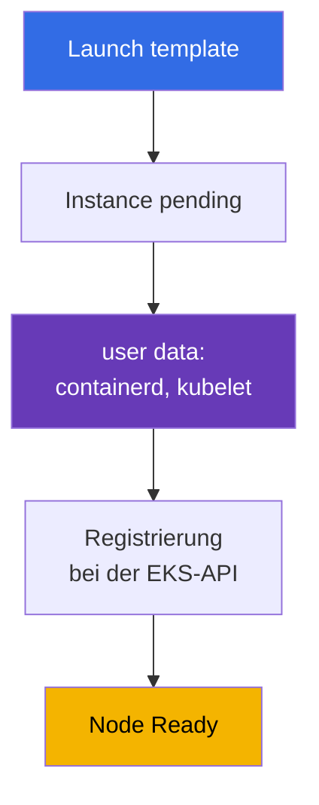
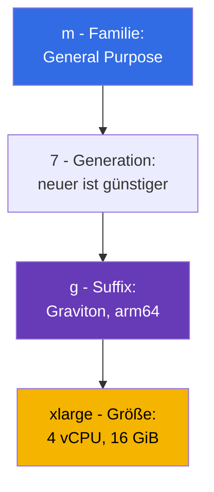
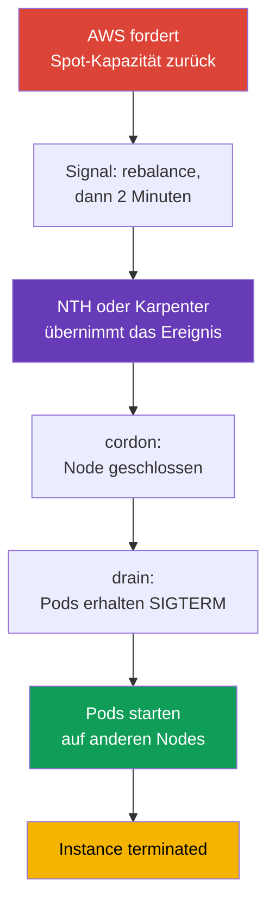

[Русская версия](ru.md) · [Eng version](en.md) · [Versión en español](es.md) · [Version française](fr.md) · [ქართული ვერსია](ge.md) · [繁體中文版](tw.md) · [日本語版](jp.md)
# Kapitel 0.4. EC2 und Preismodelle: Instance-Typen, AMIs, On-Demand, Spot, Savings Plans

> **Was als Nächstes kommt.** Account, Region und AZ sind klar (Kapitel 0.1), IAM vergibt Berechtigungen (0.2), Adressen leben in der VPC (0.3). Es bleibt, woraus die Data Plane besteht: eine virtuelle EC2-Maschine. Ein EKS-Node ist eine Instance mit einem konkreten Typ, AMI, Datenträger und Preis, und fast alle Entscheidungen über Dichte, Zuverlässigkeit und Kosten des Clusters fallen hier. Wir behandeln EC2 in dem für Nodes nötigen Umfang und verbinden es sofort mit dem Preis: On-Demand, Spot, Savings Plans und Graviton.

## 0.4.1. Eine EC2-Instance als Cluster-Node

Eine **EC2-Instance** ist eine virtuelle Maschine: Typ (wie viele vCPU und wie viel Speicher), AMI (was bootet), Subnetz und Security Group (Kapitel 0.3), IAM Instance Profile (die Instance-Rolle, Kapitel 0.2) sowie Datenträger. Ein Kubernetes-Node ist eine solche Instance, auf der beim Start containerd und kubelet hochkommen und kubelet sich beim API-Server registriert. Das Schlüsselelement der Registrierung sind die **user data**: Konfiguration, die der Instance beim Start übergeben und vor dem Start von kubelet ausgeführt wird. Sie enthält den Clusternamen, den API-Server-Endpoint, das CA-Zertifikat und kubelet-Argumente (labels, taints, `--max-pods`). In AL2023 ist dies cloud-init mit einem Abschnitt `NodeConfig`, in Bottlerocket TOML (Kapitel 10 und 45).



Der Lebenszyklus lautet `pending` -> `running` (wird abgerechnet) -> `stopped` (Sie zahlen nur für EBS) -> `terminated` (unumkehrbar). Für Nodes wird `stopped` nicht verwendet: Einen Node repariert man nicht, sondern **ersetzt** ihn. Seine Daten sind daher ephemer, und ein Wechsel des AMI oder Typs bedeutet eine Neuerstellung.

**IMDS (Instance Metadata Service)** ist der lokale Endpoint `169.254.169.254`, über den eine Instance ihre ID, Region, AZ und ihren Typ erfährt und **temporäre Credentials ihrer IAM-Rolle** erhält. Von dort beziehen kubelet, VPC CNI und aws-node sie. Die Kehrseite: Auch ein gewöhnlicher Pod kann IMDS erreichen und **die Credentials der Node-Rolle übernehmen**, die möglicherweise ECR lesen und ENIs verwalten darf. Deshalb ist IMDSv2 obligatorisch, das Hop Limit beträgt 1, und Berechtigungen für Pods werden über IRSA oder Pod Identity vergeben (Kapitel 16-19).

```bash
# IMDSv2: zuerst ein Token, dann die Metadatenanfrage (v1 ohne Token ist bereits deaktiviert)
TOKEN=$(curl -sX PUT "http://169.254.169.254/latest/api/token" \
  -H "X-aws-ec2-metadata-token-ttl-seconds: 21600")
curl -s -H "X-aws-ec2-metadata-token: $TOKEN" \
  http://169.254.169.254/latest/meta-data/instance-id
# IMDSv2 verlangen und Metadatenzugriff für Pods sperren
aws ec2 modify-instance-metadata-options --instance-id i-0123456789abcdef0 \
  --http-tokens required --http-put-response-hop-limit 1
```

## 0.4.2. Familien und Größen: So liest man t3.medium und m7g.xlarge

Ein Typname ist keine Marke, sondern eine Beschreibung. `m7g.xlarge` wird in Teile zerlegt:



Die Größen wachsen im Preis fast linear: `large`, `xlarge`, `2xlarge`, `4xlarge`, `8xlarge`. Ein `2xlarge` kostet doppelt so viel wie ein `xlarge` bei doppelt so vielen Ressourcen. Die Wahl zwischen zwei `xlarge` und einem `2xlarge` ist daher eine Frage von Zuverlässigkeit und Dichte, nicht des Preises (Abschnitt 0.4.8). Suffixe: `g` ist Graviton (arm64), `i` ist Intel, `a` ist AMD, `d` ist lokales NVMe und `n` ist verstärktes Networking.

| Familie | Klasse | Verhältnis | Einsatz im Cluster |
|----------|--------|------------|--------------------|
| `t3`, `t4g` | burstable | 1:2 / 1:4 | Dev-Cluster und Lernen, keine Prod-Nodes |
| `m5`, `m6i`, `m7g` | general purpose | 1 vCPU : 4 GiB | Standard-Nodes, System-Add-ons |
| `c6i`, `c7g` | compute optimized | 1 vCPU : 2 GiB | CI-Runner, Verarbeitung, Codecs |
| `r6i`, `r7g` | memory optimized | 1 vCPU : 8 GiB | JVM, Caches, Analytik |
| `i4i`, `im4gn` | storage optimized | lokales NVMe | Kafka, Elasticsearch, Caches auf Datenträgern |
| `g5`, `p5` | accelerated | GPU | ML-Inferenz und Training, eigene taints |

**ARM gegenüber x86.** Graviton ist arm64, und dabei sind zwei Dinge wichtig. Erstens müssen Images für arm64 existieren, sonst schlägt der Pod mit `exec format error` fehl. Öffentliche Images sind meist multi-arch, eigene werden mit `docker buildx --platform linux/amd64,linux/arm64` gebaut. Zweitens funktioniert ein gemischter Cluster, aber Workloads werden über `kubernetes.io/arch` mit nodeSelector oder affinity getrennt.

**Die Falle der T-Serie.** `t3` und `t4g` sind **burstable**: Sie erhalten einen Basisanteil an vCPU (bei `t3.medium` sind das 20% pro Core), alles darüber stammt aus **CPU credits**, die im Leerlauf angesammelt werden. Unter Last gehen die Credits aus, die Instance drosselt auf ihr Basisniveau (oder verursacht im Modus `unlimited` Zusatzkosten), kubelet und CNI hängen, der Node flappt auf `NotReady`, und die Ursache ist in `kubectl describe` nicht sichtbar.

## 0.4.3. Wie viele Pods auf eine Instance passen

Mit VPC CNI (dem Standardmodus) erhält **jeder Pod eine echte IP aus dem VPC-Subnetz**, und die Adressen werden über ENIs, die Netzwerkschnittstellen der Instance, vergeben. Die Anzahl der ENIs und IPs pro ENI ist für einen Typ festgelegt. Daher steuert die Instance-Größe die Dichte: `max-pods = ENI * (IP pro ENI - 1) + 2`.

| Typ | ENI | IP pro ENI | Ungefähr max-pods |
|-----|-----|------------|-------------------|
| `t3.small` | 3 | 4 | 11 |
| `m5.large` | 3 | 10 | 29 |
| `m5.4xlarge` | 8 | 30 | 234 |

Bei kleinen Instances wird die Pod-Grenze erreicht, bevor CPU und Speicher ausgehen. System-Pods (aws-node, kube-proxy, CSI-Treiber, Logging-Agenten) belegen Slots auf **jedem** Node. Auf `t3.small` bleiben nur 6-7 Plätze. Prefix Delegation erhöht das Limit (Kapitel 7), die Dichte behandelt Kapitel 14.

```bash
# Dichte der Typen vergleichen: ENIs und IP-Adressen pro Schnittstelle
aws ec2 describe-instance-types --instance-types t3.medium m5.xlarge m7g.2xlarge \
  --query 'InstanceTypes[].[InstanceType,NetworkInfo.MaximumNetworkInterfaces,
    NetworkInfo.Ipv4AddressesPerInterface]' --output table
```

## 0.4.4. AMI: Das Image, aus dem ein Node startet

Ein **AMI (Amazon Machine Image)** ist das Datenträger-Template, aus dem eine Instance startet. Für Nodes verwendet man nicht einfach Linux: AWS veröffentlicht **EKS-optimierte AMIs** mit containerd, kubelet der benötigten Minor-Version, dem CNI-Plugin und Bootstrap-Logik. Varianten sind **Amazon Linux 2023** (eine normale Distribution mit `dnf` und vertrautem Debugging), **Bottlerocket** (ein minimales OS für Container, read-only Root, Aktualisierung als ganzes Image), **Windows** sowie das auslaufende **AL2**. Der Unterschied zwischen den ersten beiden wird im Bereitschaftsdienst spürbar: In Bottlerocket gibt es weder die vertraute Shell noch einen Paketmanager, und man kann sich nicht per SSH auf einem Node anmelden, um lediglich Logs anzusehen. Das Debugging läuft über die standardmäßigen Control- und Admin-Container oder über SSM Session Manager (Kapitel 10 und 45).

Die wichtigste Eigenschaft: Ein **AMI ist an eine Kubernetes-Minor-Version gebunden**. Ein Image für `1.33` wird nicht in einem Cluster `1.34` eingesetzt, weil kubelet nur einen begrenzten Versionsabstand zum API-Server haben darf. Ein Cluster-Upgrade enthält daher auch ein AMI-Upgrade. Die ID hängt von Version, Region, Architektur und Variante ab und wird aus SSM abgerufen:

```bash
# ID des EKS-optimierten AL2023 für 1.33 (für Graviton arm64 statt x86_64 verwenden,
# für Bottlerocket /aws/service/bottlerocket/aws-k8s-1.33/x86_64/latest/image_id verwenden)
aws ssm get-parameter --region eu-central-1 \
  --name /aws/service/eks/optimized-ami/1.33/amazon-linux-2023/x86_64/standard/recommended/image_id \
  --query Parameter.Value --output text
```

Ein AMI ist ebenso ein Objekt des Lebenszyklus wie eine Cluster-Version: AWS veröffentlicht regelmäßig Builds mit Kernel-Patches und geschlossenen CVEs. Ein Node, der ein halbes Jahr auf einem alten Image läuft, bedeutet nicht Stabilität, sondern Schulden. In einer managed node group erfolgt die Aktualisierung standardmäßig per Rolling Replacement (Kapitel 10), die Reihenfolge behandelt Kapitel 38.

## 0.4.5. Node-Datenträger: EBS-Root-Volume, gp3 und lokales NVMe

Ein Node hat ein **EBS-Root-Volume**, einen Netzwerk-Blockdatenträger mit dem OS, Container-Images, containerd-Schichten und ephemerem Storage der Pods (`emptyDir`, Logs). Größe und Typ werden im Launch Template angegeben und oft vergessen: Ein kleines Volume füllt sich mit Images, kubelet meldet **disk pressure**, verdrängt Pods und leert den Cache. Für Nodes verwendet man `gp3`: IOPS und Durchsatz werden unabhängig von der Größe konfiguriert, und es ist günstiger als `gp2`.

**Instance store** ist lokales NVMe auf Typen mit dem Suffix `d` (`m6id`, `c6gd`) und auf storage optimized Typen (`i4i`, `im4gn`). Es ist schnell und im Preis der Instance enthalten, aber **ephemer**: Daten verschwinden beim Ersetzen der Instance, was bei Spot-Nodes regelmäßig geschieht. Es eignet sich für Build-Cache und Scratch-Daten. Dauerhafte Daten gehören nur auf EBS oder EFS.

Eine wichtige Folge aus Kapitel 0.1: Ein **EBS-Volume lebt in einer AZ** und wird nur an eine Instance derselben Zone angeschlossen. Deshalb ist ein Pod mit PVC an die Zone seines Volumes gebunden. Startet der Autoscaler einen Node in einer anderen AZ, bleibt der Pod `Pending`. Daher sind `WaitForFirstConsumer` und Shared Storage wichtig, wie Kapitel 23 erläutert.

## 0.4.6. Auto Scaling group und launch template

Nodes werden nicht einzeln erstellt. Zwei EC2-Objekte arbeiten zusammen:

- Ein **Launch template** ist ein versioniertes Start-Template: AMI, Typ (oder Liste von Typen), Security Groups, IAM Instance Profile, Größe und Typ des Root-Volumes, user data, IMDS-Einstellungen und Tags.
- Eine **Auto Scaling group (ASG)** ist eine Gruppe von Instances, die die vorgegebene Anzahl von Maschinen (`min`, `desired`, `max`) über Subnetze verschiedener AZs hinweg hält, ausgefallene ersetzt und On-Demand und Spot mischt.

Eine **EKS managed node group ist eine ASG plus Launch template**, die vom EKS-Service verwaltet werden: Er erstellt sie selbst, setzt Tags, kann beim Update drain durchführen und kennt Spot-Unterbrechungen. Daraus folgt eine Regel, die Stunden beim Debugging spart: **Die ASG einer managed node group wird nicht manuell verändert**. Ändern Sie Parameter der node group oder Ihre eigene Version des Launch Template. Rechenvarianten (managed, self-managed, Fargate, Auto Mode) werden in Kapitel 9 verglichen, die Bootstrap-Anpassung steht in Kapitel 10. Karpenter erstellt Instances direkt ohne ASG und reagiert deshalb schneller (Kapitel 11 und 12).

```bash
# Grenzen der Node-Group-Skalierung und Inhalt der neuesten Version des Launch Template
aws autoscaling describe-auto-scaling-groups --query 'AutoScalingGroups[].[
  AutoScalingGroupName,MinSize,DesiredCapacity,MaxSize]'
aws ec2 describe-launch-template-versions --launch-template-id lt-0123456789abcdef0 \
  --versions '$Latest' --query 'LaunchTemplateVersions[].LaunchTemplateData'
```

Ein weiteres Startattribut, das man früh kennen sollte, ist eine **placement group**. Standardmäßig verteilt EC2 Instances auf verschiedene Hardware, um korrelierte Ausfälle zu verringern. Das ist in den meisten Fällen richtig. Man greift ein, wenn eine Workload extrem empfindlich auf Latenzen zwischen Nodes reagiert oder ihre Daten selbst replizieren kann und wissen möchte, dass Replikate auf unterschiedlichen Racks stehen. Das Erstellen einer Gruppe kostet nichts. Es gibt vier Strategien (einschließlich precision time für exakte Zeit); für Cluster sind drei interessant:

| Strategie | Was sie tut | Typische Workload | Wichtige Einschränkung |
|-----------|-------------|-------------------|------------------------|
| `cluster` | platziert Instances nahe beieinander in einer AZ, minimale Latenz | HPC, verteiltes Modelltraining | eine AZ für die gesamte Gruppe; gemischte Typen senken die Chance, Kapazität zu finden |
| `partition` | verschiedene Partitionen teilen keine Racks, bis zu 7 Partitionen je AZ | Cassandra, HDFS, HBase, Kafka | die Anzahl der Instances ist nur durch Account-Limits begrenzt |
| `spread` | jede Instance auf eigener Hardware | einige kritische Nodes | strikt **7 laufende Instances je AZ** pro Gruppe |

Drei Fallen treten speziell im Cluster auf. Erstens bedeutet `spread` plus Autoskalierung, dass ein achter Node in einer AZ schlicht nicht startet, während Karpenter oder ASG immer wieder auf einen Fehler stoßen, der wie Kapazitätsmangel aussieht. Zweitens schlägt die Anfrage **fehl**, statt in eine Warteschlange gestellt zu werden, wenn keine geeignete einzigartige Hardware verfügbar ist. Daher macht man eine Gruppe nicht für Nodes verpflichtend, ohne die der Cluster nicht leben kann. Drittens hält `cluster` definitionsgemäß alle Nodes in einer AZ, was der Verteilung über drei Zonen widerspricht (Kapitel 40). Verwenden Sie es daher für einen dedizierten NodePool und nicht für den gesamten Cluster. Außerdem kann eine Spot-Instance, die bei Rückforderung auf stop oder hibernate eingestellt ist, nicht in einer placement group starten (Kapitel 13).

Dies wird im Launch Template für self-managed Nodes und managed node groups konfiguriert. Im EKS Auto Mode gibt es dafür das Feld `placementGroupSelector` in `NodeClass`; Karpenter kann Nodes ebenfalls in einer placement group starten. Details stehen in Kapitel 9 und 12.

## 0.4.7. Preismodelle: On-Demand, Spot, Savings Plans, Graviton

**On-Demand** ist nutzungsbasierte Abrechnung pro Sekunde zum Listenpreis ohne Verpflichtung: Vergleichsbasis und Standard.

**Spot** ist freie Kapazität, meist mit 60-90% Rabatt. Der Preis ist für jeden Typ und jede AZ verschieden, und AWS kann eine Instance **unterbrechen**, wenn es die Kapazität benötigt: Eine Benachrichtigung kommt über IMDS und EventBridge, mit **zwei Minuten** Zeit. Kubernetes verkraftet das gut, wenn Workloads vorbereitet sind: NodeTerminationHandler oder Karpenter fangen das Ereignis ab, markieren den Node mit `NoSchedule` und führen drain aus. Der Unterschied besteht darin, woher das Signal kommt: von dem Node selbst über IMDS oder zentral, wenn EventBridge Ereignisse in eine SQS-Queue legt und ein Controller sie liest. Der zweite Weg ist die Produktionsvariante für Karpenter, weil er nicht von der Verfügbarkeit eines bestimmten Nodes abhängt (Kapitel 12 und 13).



Die gesamte Kette muss in 120 Sekunden abgeschlossen sein. Das ist keine Empfehlung, sondern eine physische Frist: Nach ihrem Ablauf verschwindet die Instance, unabhängig davon, ob Ihre Pods fertig sind. Deshalb sind PDBs und korrekte Behandlung von SIGTERM in der Anwendung ein verpflichtender Teil der Konfiguration von Spot-Nodes (Kapitel 40).

**Savings Plans** und **Reserved Instances** sind Rabatte für die Verpflichtung, einen festen Betrag auszugeben (oder bestimmte Instances zu halten), und zwar für **1 oder 3 Jahre**. Es gibt zwei Savings Plans, und der Unterschied ist für einen EC2- plus Fargate-Hybrid wichtig (Kapitel 9 und 15). **Compute Savings Plans** sind am flexibelsten: Der Rabatt gilt für EC2, Fargate und Lambda unabhängig von Familie, Größe, Region und OS. Ein Umzug von `m6i` nach `m7g` oder eines Teils der Workload von Nodes nach Fargate macht ihn daher nicht ungültig. **EC2 Instance Savings Plans** bieten einen stärkeren Rabatt, decken aber nur EC2 und eine Familie in einer Region ab (zum Beispiel `m7g` in eu-central-1). Innerhalb dieser sind sie nach Größe, AZ und OS flexibel, gelten aber nicht für Fargate. RIs sind an Typ und Zone gebunden und werden für Nodes selten gewählt. Bemessen Sie die Verpflichtung nach der **Untergrenze** des Verbrauchs und decken Sie Spitzen mit Spot ab. **Graviton** ist kein Preismodell, sondern eine weitere Quelle für Einsparungen.

Für GPU-Training und große ML-Jobs gibt es **EC2 Capacity Blocks for ML**: Reservierte Kapazität von Instances der P-Familie und Trainium für einen zukünftigen Termin und eine Dauer von einem Tag bis zu einem halben Jahr, bis zu acht Wochen im Voraus, mit garantierter Verfügbarkeit. Damit werden knappe Beschleuniger reserviert, kein Rabatt gewährt: Starten Sie Nodes für ein begrenztes Trainingsfenster, statt sie dauerhaft zu betreiben (Kapitel 9).

| Modell | Rabatt | Risiko | Einsatz für Cluster-Nodes |
|--------|--------|--------|---------------------------|
| **On-Demand** | keiner | keines | System-Nodes, Controller, Datenbanken im Cluster |
| **Spot** | 60-90% | Unterbrechung mit zwei Minuten Vorlauf | Stateless-Services, CI, Batch, Queues |
| **Compute SP** | flexibler | Verpflichtung für 1-3 Jahre, EC2+Fargate+Lambda | vorhersehbare Basis, Hybrid |
| **EC2 Instance SP** | stärker | Verpflichtung auf eine Familie in einer Region | stabiles Node-Profil |
| **Reserved Instances** | 30-70% | Bindung an Typ und Zone | seltene Node-Profile |
| **Capacity Blocks** | Kapazitätsreservierung | Reservierungsfenster und -datum | GPU- und Trainium-Training |
| **Graviton** | 15-40% | arm64-Images erforderlich | alles, was multi-arch gebaut wird |

```bash
# Spot-Preise nach Typ und AZ für die letzte Stunde: Grundlage der Diversifizierung
aws ec2 describe-spot-price-history --product-descriptions "Linux/UNIX" \
  --instance-types m7g.xlarge m6i.xlarge c7g.xlarge \
  --start-time "$(date -u -d '1 hour ago' +%Y-%m-%dT%H:%M:%S)" \
  --query 'SpotPriceHistory[].[InstanceType,AvailabilityZone,SpotPrice]' --output table
# Empfehlung für Compute Savings Plans über ein Jahr anhand des tatsächlichen Verbrauchs
aws ce get-savings-plans-purchase-recommendation --savings-plans-type COMPUTE_SP \
  --term-in-years ONE_YEAR --payment-option NO_UPFRONT --lookback-period-in-days SIXTY_DAYS
```

Ein typischer Produktionsmix besteht aus Basis-Kapazität auf On-Demand unter Savings Plans, sämtlicher elastischer Kapazität auf Spot mit einer breiten Liste von Typen und, wo möglich, Graviton (Kapitel 13 und 43).

## 0.4.8. Node-Sizing: Viele kleine oder wenige große Nodes

Dasselbe Volumen an CPU und Speicher kann durch zehn `m7g.large` Instances oder ein Paar `m7g.4xlarge` Instances bereitgestellt werden:

- **Blast Radius.** Der Verlust eines kleinen Nodes ist kaum bemerkbar; ein großer Node nimmt einen beträchtlichen Teil der Workloads mit.
- **Overhead der System-Pods.** aws-node, kube-proxy, CSI-Treiber und Logging-Agenten verbrauchen Ressourcen auf **jedem** Node: Je mehr Nodes vorhanden sind, desto kleiner ist der nutzbare Anteil.
- **Pod-Limit.** Kleine Instances erreichen max-pods, während CPU und Speicher ungenutzt bleiben; ein Pod mit einer Anforderung von 8 GiB passt überhaupt nicht auf `large`.
- **Skalierungsschritt.** Ein kleiner Node startet schneller und fügt Kapazität in kleinen Schritten hinzu; ein großer Node macht einen groben und teuren Schritt, verliert dafür aber weniger durch Packaging-Overhead.

Ein vernünftiger Mittelweg sind Nodes von `xlarge` bis `4xlarge`, mehrere je AZ und nach NodePool getrennte Profile.

Speziell bei Spot ist eine **homogene Menge von Instances der größte Feind von Spot-Nodes**. Wenn eine Gruppe nur `m6i.2xlarge` erlaubt, entfernt die Rückforderung der Kapazität dieses Typs in einer AZ alle Nodes auf einmal, und ein PDB kann nicht helfen. Richtig sind 10-20 kompatible Typen verschiedener Familien und Generationen in drei AZs. Dann treten Unterbrechungen je Node einzeln auf und der Cluster bemerkt sie nicht (Kapitel 12).

Eine Typenliste allein genügt nicht. Wichtig ist, **wie der Pool ausgewählt wird**. `lowest-price` nimmt die billigsten Pools und wird daher häufiger unterbrochen; `capacity-optimized` wählt Pools mit der größten Kapazitätsreserve und minimiert Rückforderungen; `capacity-optimized-prioritized` macht dasselbe, beachtet aber nach Best Effort die vorgegebene Prioritätsreihenfolge der Typen (es benötigt ein Launch Template). Für Nodes verwendet man kapazitätsorientierte Strategien statt `lowest-price`, und Karpenter verwendet standardmäßig `price-capacity-optimized`, das Preis und Kapazitätsreserve ausbalanciert (Kapitel 13).

## 0.4.9. So wird dies in Produktion eingesetzt

- **Zwei Node-Profile.** Eine kleine On-Demand-Gruppe für System-Add-ons (CoreDNS, Controller, Metriken) und Spot-Kapazität für Anwendungen: System-Komponenten auf Spot verursachen kaskadierende Incidents.
- **Trennung nach Familien.** `m` für allgemeine Workloads, `c` für CI und Verarbeitung, `r` für JVM und Caches sowie eigene taints für GPU-Nodes. Ein universeller Typ für alles bedeutet Überzahlung.
- **Graviton als Standard.** Neue Services werden sofort multi-arch gebaut, ältere werden migriert, sobald ihre Images bereit sind: Das ist die einfachste Einsparung ohne Architekturänderung. Die Image-ID wird aus SSM abgerufen, AMI-Updates werden zusammen mit Cluster-Upgrades geplant (Kapitel 10 und 38), und die Abdeckung durch Savings Plans wird vierteljährlich geprüft (Kapitel 43).

## 0.4.10. Mini-Glossar

- Eine **EC2-Instance** ist eine virtuelle Maschine; für EKS ist sie ein Node mit containerd und kubelet.
- **User data** ist beim Start einer Instance ausgeführte Konfiguration; sie enthält den Bootstrap des Nodes.
- **IMDS** ist der Metadaten-Service unter `169.254.169.254`; er liefert Instance-Daten und temporäre Credentials der IAM-Rolle. In Produktion nur IMDSv2 mit Hop Limit 1 verwenden.
- Ein **Instance-Typ** ist `Familie + Generation + Suffix . Größe`, zum Beispiel `m7g.xlarge`. **Graviton** sind AWS-Prozessoren auf arm64 (Suffix `g`) und benötigen multi-arch Images.
- **Burstable (T-Serie)** bedeutet einen Basisanteil CPU plus **CPU credits**; für Prod-Nodes ungeeignet. **max-pods** ist die Grenze der Pods auf einem Node und hängt bei VPC CNI von der Anzahl ENIs und IPs je ENI ab.
- Ein **AMI** ist ein Start-Image der Instance; AL2023 und Bottlerocket sind an eine Kubernetes-Minor-Version gebunden. **EBS / instance store** bedeutet Netzwerk-Volume in einer AZ / ephemeres lokales NVMe.
- Ein **Launch template / Auto Scaling group** ist ein versioniertes Start-Template / eine Gruppe von Instances mit `min`, `desired`, `max` über AZ-Subnetze.
- Eine **placement group** steuert die Platzierung von Instances: `cluster` (nahe beieinander, minimale Latenz, eine AZ), `partition` (getrennte Racks nach Partitionen, bis zu 7 pro AZ) und `spread` (jeweils eigene Hardware, nicht mehr als 7 laufende Instances pro AZ).
- **On-Demand / Spot** bedeutet Abrechnung nach Verbrauch / vergünstigte Kapazität mit Unterbrechung nach zwei Minuten. **Savings Plans / RI** bedeutet 30-70% Rabatt für eine Verpflichtung über 1 oder 3 Jahre.
- **Compute SP / EC2 Instance SP** bedeutet flexibler Plan (EC2, Fargate, Lambda) / tieferer Plan für eine Familie in einer Region. **Capacity Blocks** reservieren GPU-/Trainium-Kapazität für Training.
- Eine **Spot-Strategie** beschreibt die Pool-Auswahl: `capacity-optimized(-prioritized)` gegenüber `lowest-price`; kapazitätsorientierte Strategien werden seltener unterbrochen.

## 0.4.11. Zusammenfassung des Kapitels

- Ein EKS-Node ist eine EC2-Instance: Das Launch Template definiert AMI, Typ, SG und user data; user data startet kubelet und kubelet registriert sich beim Cluster. Nodes sind Einwegobjekte und werden ersetzt.
- IMDS gibt Credentials der Node-Rolle aus. Daher sind IMDSv2 und Hop Limit 1 obligatorisch, während Berechtigungen für Pods über IRSA oder Pod Identity vergeben werden (Kapitel 16, 17 und 19).
- Ein Typname wird nach Teilen gelesen: Familie, Generation, Suffixe (`g` für Graviton, `d` für lokales NVMe) und Größe. T-Serien-Instances mit CPU credits eignen sich nicht für Prod-Nodes. Die Größe legt auch die Pod-Anzahl über ENIs und IPs fest: Kleine Nodes erreichen max-pods, bevor ihnen Ressourcen ausgehen (Kapitel 6, 7 und 14).
- Ein AMI ist an eine Kubernetes-Minor-Version gebunden, seine ID kommt aus SSM und die Aktualisierung des Images ist Teil des Cluster-Lebenszyklus (Kapitel 10 und 38).
- Das gp3-Root-Volume muss passend dimensioniert werden, instance store ist ephemer und ein EBS-Volume lebt in einer AZ und bindet einen Pod mit PVC an diese Zone (Kapitel 23). Eine managed node group ist eine von EKS verwaltete ASG plus Launch template, und ihre ASG wird nicht manuell bearbeitet (Kapitel 9 und 10).
- Node-Ökonomie: On-Demand ist die durch Savings Plans abgedeckte Basis, Spot mit breiter Typen-Diversifizierung bedient den elastischen Anteil und Graviton vervielfacht die Einsparungen (Kapitel 13 und 43).

## 0.4.12. Wie dies bei der täglichen Arbeit hilft

Die Analyse von Node-Incidents geschieht auf EC2-Ebene: Warum eine Instance kein Node wurde (user data, IAM, SG), warum Pods nicht passen (max-pods statt CPU), warum ein Node auf `NotReady` ging (CPU credits oder Platz auf dem Root-Volume gingen aus) und warum auf einmal die Hälfte des Clusters verschwand (homogene Spot-Nodes). Dieselbe Ebene steuert die Kosten: Familie, Graviton, Spot-Anteil und Savings-Plans-Abdeckung.

## 0.4.13. Fragen zur Selbstkontrolle

1. Was muss auf einer Instance passieren, damit sie ein Cluster-Node wird, und wo ist das beschrieben?
2. Wozu braucht kubelet IMDS, und warum ist Hop Limit 1 eine Sicherheitseinstellung?
3. Zerlegen Sie `c7gd.2xlarge` in seine Bestandteile: Was bedeutet jeder davon?
4. Warum ist `t3.medium` eine schlechte Wahl für einen Prod-Node?
5. Sie haben `m5.large`, Pods sind `Pending`, CPU und Speicher sind frei. Was prüfen Sie zuerst?
6. Warum wird die ID eines EKS-optimierten AMI nicht fest codiert, und woher wird sie bezogen?
7. Worin unterscheidet sich instance store von einem EBS-Root-Volume, und was darf darauf gespeichert werden?
8. Was ist eine managed node group in EC2-Begriffen, und warum wird ihre ASG nicht manuell bearbeitet?
9. Wie viel Zeit gewährt eine Spot-Unterbrechung, und warum ist eine Spot-Node-Gruppe aus einem Instance-Typ schädlich?
10. Wann sind Savings Plans vorteilhafter als Spot, und wie werden beide in einem Cluster kombiniert?

## Praxis

Teil 0 hat keine eigenen Labs: Er bildet die Grundlage für die übrigen Kapitel. Die Praxis beginnt in Teil 1, wenn Sie einen EKS-Cluster mit Terragrunt erstellen. Nodes, Spot und Karpenter werden Sie in den Labs von Teil 2 behandeln. Als Nächstes folgen die Tools: aws cli, eksctl, terraform und terragrunt, helm und Plugins.

---
[Inhalt](../README_DE.md) · [Kapitel 0.3](../00-3-vpc/de.md) · [Kapitel 0.5](../00-5-tools/de.md)
