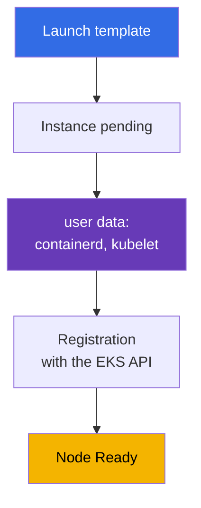
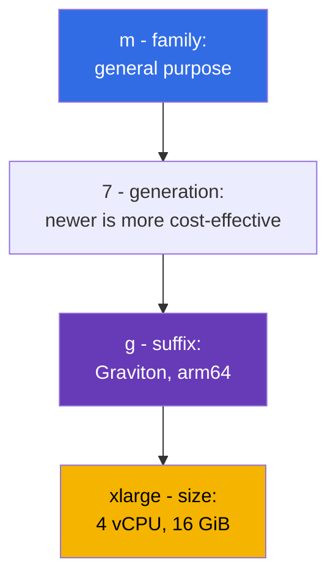
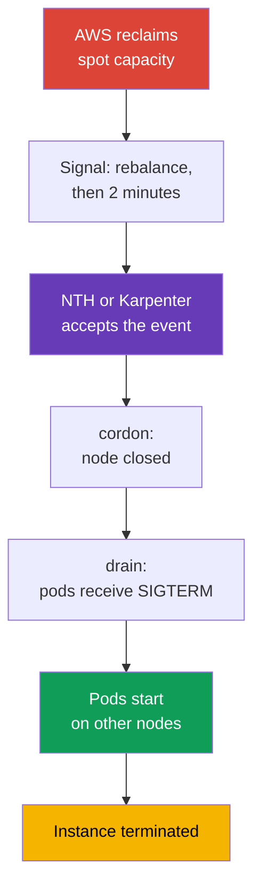

[Русская версия](ru.md) · [Versión en español](es.md) · [Version française](fr.md) · [Deutsche Version](de.md) · [ქართული ვერსია](ge.md) · [繁體中文版](tw.md) · [日本語版](jp.md)
# Chapter 0.4. EC2 and Pricing Models: Instance Types, AMIs, On-Demand, Spot, Savings Plans

> **What comes next.** You now understand accounts, regions, and AZs (chapter 0.1), IAM grants permissions (chapter 0.2), and addresses live in a VPC (chapter 0.3). What remains is the basis of the data plane: an EC2 virtual machine. An EKS node is an instance with a specific type, AMI, disk, and price, and nearly every decision about cluster density, reliability, and cost happens here. We will cover EC2 as it applies to nodes and immediately connect it to cost: on-demand, spot, Savings Plans, and Graviton.

## 0.4.1. An EC2 instance as a cluster node

An **EC2 instance** is a virtual machine: its type (how many vCPUs and how much memory), AMI (what boots), subnet and security group (chapter 0.3), IAM instance profile (the instance role, chapter 0.2), and disks. A Kubernetes node is such an instance where containerd and kubelet start at boot, then kubelet registers with the API server. The key registration component is **user data**: configuration supplied to the instance at launch and run before kubelet starts; it contains the cluster name, API server endpoint, CA certificate, and kubelet arguments (labels, taints, `--max-pods`). In AL2023 this is cloud-init with a `NodeConfig` section; in Bottlerocket it is TOML (chapters 10 and 45).



The lifecycle is `pending` -> `running` (billed) -> `stopped` (you pay only for EBS) -> `terminated` (irreversible). Nodes do not use `stopped`: a node is not repaired but **replaced**, so its data is ephemeral, and changing an AMI or type means recreating it.

**IMDS (Instance Metadata Service)** is the local endpoint `169.254.169.254` where an instance learns its ID, region, AZ, and type, and obtains **temporary credentials for its IAM role**. kubelet, VPC CNI, and aws-node obtain them there. The downside is that an ordinary pod can also reach IMDS and **take the node role credentials**, which may be allowed to read ECR and manage ENIs. Therefore IMDSv2 is mandatory, the hop limit is 1, and pod permissions are granted through IRSA or Pod Identity (chapters 16-19).

```bash
# IMDSv2: token first, then a metadata request (v1 without a token is already disabled)
TOKEN=$(curl -sX PUT "http://169.254.169.254/latest/api/token" \
  -H "X-aws-ec2-metadata-token-ttl-seconds: 21600")
curl -s -H "X-aws-ec2-metadata-token: $TOKEN" \
  http://169.254.169.254/latest/meta-data/instance-id
# Require IMDSv2 and block metadata access from pods
aws ec2 modify-instance-metadata-options --instance-id i-0123456789abcdef0 \
  --http-tokens required --http-put-response-hop-limit 1
```

## 0.4.2. Families and sizes: how to read t3.medium and m7g.xlarge

A type name is not a brand but a description. `m7g.xlarge` breaks down into parts:



Sizes grow almost linearly in price: `large`, `xlarge`, `2xlarge`, `4xlarge`, `8xlarge`. A `2xlarge` costs twice as much as an `xlarge` while providing twice the resources, so choosing between two `xlarge` instances and one `2xlarge` is a question of reliability and density rather than price (section 0.4.8). Suffixes: `g` is Graviton (arm64), `i` is Intel, `a` is AMD, `d` is local NVMe, and `n` is enhanced networking.

| Family | Class | Ratio | Cluster use |
|--------|-------|-------|-------------|
| `t3`, `t4g` | burstable | 1:2 / 1:4 | dev clusters and learning, not prod nodes |
| `m5`, `m6i`, `m7g` | general purpose | 1 vCPU : 4 GiB | default nodes, system add-ons |
| `c6i`, `c7g` | compute optimized | 1 vCPU : 2 GiB | CI runners, processing, codecs |
| `r6i`, `r7g` | memory optimized | 1 vCPU : 8 GiB | JVM, caches, analytics |
| `i4i`, `im4gn` | storage optimized | local NVMe | Kafka, Elasticsearch, disk caches |
| `g5`, `p5` | accelerated | GPU | ML inference and training, dedicated taints |

**ARM versus x86.** Graviton is arm64, and two facts matter. First, images must exist for arm64 or the pod fails with `exec format error`; public images are usually multi-arch, while your own are built with `docker buildx --platform linux/amd64,linux/arm64`. Second, a mixed cluster works, but workloads are separated using `kubernetes.io/arch` through nodeSelector or affinity.

**The T-series trap.** `t3` and `t4g` are **burstable**: they receive a base vCPU share (`t3.medium` receives 20% per core), and anything above it comes from **CPU credits** accumulated while idle. Under load, credits run out and the instance slows to its base level (or incurs extra charges in `unlimited` mode), kubelet and CNI stall, the node flaps into `NotReady`, and the cause is invisible in `kubectl describe`.

## 0.4.3. How many pods fit on an instance

With VPC CNI (the default mode), **every pod receives a real IP from a VPC subnet**, and addresses are assigned through ENIs, the instance network interfaces. The number of ENIs and IPs per ENI are fixed for a type, so instance size controls density: `max-pods = ENI * (IP per ENI - 1) + 2`.

| Type | ENI | IPs per ENI | Approximate max-pods |
|------|-----|-------------|----------------------|
| `t3.small` | 3 | 4 | 11 |
| `m5.large` | 3 | 10 | 29 |
| `m5.4xlarge` | 8 | 30 | 234 |

On small instances, the pod ceiling is reached before CPU and memory are exhausted. System pods (aws-node, kube-proxy, CSI drivers, logging agents) occupy slots on **every** node, leaving only 6-7 positions on `t3.small`. Prefix delegation raises the limit (chapter 7); density is covered in chapter 14.

```bash
# Compare type density: ENIs and IP addresses per interface
aws ec2 describe-instance-types --instance-types t3.medium m5.xlarge m7g.2xlarge \
  --query 'InstanceTypes[].[InstanceType,NetworkInfo.MaximumNetworkInterfaces,
    NetworkInfo.Ipv4AddressesPerInterface]' --output table
```

## 0.4.4. AMI: the image from which a node starts

An **AMI (Amazon Machine Image)** is the disk template from which an instance starts. Nodes do not use "just Linux": AWS publishes **EKS-optimized AMIs** with containerd, kubelet for the required minor version, the CNI plugin, and bootstrap logic. Options include **Amazon Linux 2023** (a conventional distribution with `dnf` and familiar debugging), **Bottlerocket** (a minimal OS for containers, read-only root, whole-image updates), **Windows**, and aging **AL2**. The difference between the first two is felt during an incident: Bottlerocket has neither a familiar shell nor a package manager, and you cannot SSH into a node merely to "look at logs". Debugging uses the standard control and admin containers or SSM Session Manager (chapters 10 and 45).

The key property is that an **AMI is tied to a Kubernetes minor version**. An image for `1.33` is not used in a `1.34` cluster because kubelet has a limited version skew from the API server, so a cluster upgrade includes an AMI upgrade. The ID depends on the version, region, architecture, and variant, and is retrieved from SSM:

```bash
# ID of the EKS-optimized AL2023 for 1.33 (for Graviton use arm64 instead of x86_64,
# for Bottlerocket use /aws/service/bottlerocket/aws-k8s-1.33/x86_64/latest/image_id)
aws ssm get-parameter --region eu-central-1 \
  --name /aws/service/eks/optimized-ami/1.33/amazon-linux-2023/x86_64/standard/recommended/image_id \
  --query Parameter.Value --output text
```

An AMI is the same kind of lifecycle object as a cluster version: AWS regularly releases builds with kernel patches and closed CVEs, and "a node that has used an old image for six months" is not stability but debt. A managed node group updates it in the standard way through rolling replacement (chapter 10); the order is in chapter 38.

## 0.4.5. Node disks: EBS root volume, gp3, and local NVMe

A node has an **EBS root volume**, a network block disk holding the OS, container images, containerd layers, and pod ephemeral storage (`emptyDir`, logs). Its size and type are specified in the launch template and often forgotten: a small volume fills with images, kubelet raises **disk pressure**, evicts pods, and clears cache. Nodes use `gp3`: IOPS and throughput are configured independently of size, and it costs less than `gp2`.

**Instance store** is local NVMe on types with the `d` suffix (`m6id`, `c6gd`) and on storage optimized types (`i4i`, `im4gn`). It is fast and included in the instance price, but **ephemeral**: data disappears when the instance is replaced, which is regular on spot nodes. It suits build cache and scratch data; persistent data belongs only on EBS or EFS.

A key consequence from chapter 0.1 is that an **EBS volume lives in one AZ** and attaches only to an instance in that zone. Therefore a pod with a PVC is tied to the zone of its volume; if the autoscaler starts a node in another AZ, the pod remains `Pending`. This is why `WaitForFirstConsumer` and shared storage matter, as chapter 23 explains.

## 0.4.6. Auto Scaling group and launch template

Nodes are not created one by one. Two EC2 objects are involved:

- A **launch template** is a versioned launch template: AMI, type (or a list of types), security groups, IAM instance profile, root-volume size and type, user data, IMDS settings, and tags.
- An **Auto Scaling group (ASG)** is a group of instances that maintains the configured number of machines (`min`, `desired`, `max`) across subnets in multiple AZs, replaces failed machines, and mixes on-demand and spot.

An **EKS managed node group is an ASG plus a launch template** managed by the EKS service: it creates them, applies tags, can drain during updates, and understands spot interruptions. This gives an hours-saving debugging rule: **do not modify a managed node group's ASG manually**. Change the node group parameters or your own launch template version. Compute options (managed, self-managed, Fargate, Auto Mode) are compared in chapter 9, bootstrap customization is in chapter 10, and Karpenter creates instances directly without an ASG, so it reacts faster (chapters 11 and 12).

```bash
# Node-group scaling bounds and the contents of the latest launch-template version
aws autoscaling describe-auto-scaling-groups --query 'AutoScalingGroups[].[
  AutoScalingGroupName,MinSize,DesiredCapacity,MaxSize]'
aws ec2 describe-launch-template-versions --launch-template-id lt-0123456789abcdef0 \
  --versions '$Latest' --query 'LaunchTemplateVersions[].LaunchTemplateData'
```

Another launch attribute worth knowing early is a **placement group**. By default, EC2 spreads instances across different hardware to reduce correlated failures, which is correct in most cases. You intervene when a workload is extremely latency-sensitive between nodes, or when it can replicate its own data and wants to know that replicas stand on different racks. Creating a group is free; there are four strategies (including precision time for exact time), and three are relevant to clusters:

| Strategy | What it does | Typical workload | Limitation that matters |
|----------|--------------|------------------|-------------------------|
| `cluster` | packs instances close together in one AZ, minimal latency | HPC, distributed model training | one AZ for the entire group; mixing types reduces the chance of finding capacity |
| `partition` | different partitions do not share racks, up to 7 partitions per AZ | Cassandra, HDFS, HBase, Kafka | instance count is limited only by account limits |
| `spread` | each instance runs on separate hardware | a few critical nodes | strictly **7 running instances per AZ** per group |

Three traps appear specifically in clusters. First, `spread` plus autoscaling means an eighth node in an AZ simply does not start, while Karpenter or ASG keeps encountering a failure that looks like a capacity shortage. Second, if suitable unique hardware is unavailable, the request **fails** rather than queues, so a group is not made mandatory for nodes without which the cluster cannot operate. Third, `cluster` keeps all nodes in one AZ by definition, which conflicts with three-zone placement (chapter 40), so use it for a dedicated NodePool rather than the entire cluster. Separately, a spot instance configured to stop or hibernate on reclamation cannot start in a placement group (chapter 13).

This is configured in a launch template for self-managed nodes and managed node groups. In EKS Auto Mode, use the `placementGroupSelector` field in `NodeClass`; Karpenter can also start nodes in a placement group, with details in chapters 9 and 12.

## 0.4.7. Pricing models: on-demand, spot, Savings Plans, Graviton

**On-demand** is pay-by-the-second list-price usage with no commitment: it is the comparison baseline and default.

**Spot** is spare capacity, usually discounted by 60-90%. The price differs for every type and AZ, and AWS can **interrupt** an instance when it needs the capacity: a notice arrives through IMDS and EventBridge, with **two minutes** provided. Kubernetes handles this well if workloads are prepared: NodeTerminationHandler or Karpenter catches the event, marks the node `NoSchedule`, and drains it. The difference is where the signal comes from: from the node itself through IMDS, or centrally when EventBridge puts events into an SQS queue and a controller reads it. The second path is the production variant for Karpenter because it does not depend on the liveness of a particular node (chapters 12 and 13).



The entire chain must finish in 120 seconds. This is not a recommendation but a physical deadline: when it expires, the instance disappears whether your pods have finished or not. Therefore PDBs and correct SIGTERM handling in the application are mandatory configuration for spot nodes (chapter 40).

**Savings Plans** and **Reserved Instances** are discounts for a commitment to spend a fixed amount (or hold specific instances) for **1 or 3 years**. There are two Savings Plans, and their difference matters for an EC2 plus Fargate hybrid (chapters 9 and 15). **Compute Savings Plans** are the most flexible: the discount applies to EC2, Fargate, and Lambda regardless of family, size, region, and OS, so moving from `m6i` to `m7g` or moving part of a workload from nodes to Fargate does not break it. **EC2 Instance Savings Plans** offer a deeper discount but cover only EC2 and one family in one region (for example, `m7g` in eu-central-1); they are flexible within it by size, AZ, and OS, but do not apply to Fargate. RIs are tied to type and zone and are rarely chosen for nodes. Size a commitment to the **lower bound** of consumption, and cover peaks with spot. **Graviton** is not a pricing model but a separate source of savings.

For GPU training and large ML jobs, use **EC2 Capacity Blocks for ML**: reserved P-family and Trainium instance capacity for a future date and a period from one day to half a year, up to eight weeks ahead, with guaranteed availability. This reserves scarce accelerators rather than granting a discount: start nodes for a finite training window rather than running them permanently (chapter 9).

| Model | Discount | Risk | Cluster node use |
|-------|----------|------|------------------|
| **On-demand** | none | none | system nodes, controllers, databases in the cluster |
| **Spot** | 60-90% | interruption with two minutes notice | stateless services, CI, batch, queues |
| **Compute SP** | more flexible | 1-3 year commitment, EC2+Fargate+Lambda | predictable baseline, hybrid |
| **EC2 Instance SP** | deeper | commitment to a family in a region | stable node profile |
| **Reserved Instances** | 30-70% | tied to type and zone | uncommon node profiles |
| **Capacity Blocks** | capacity reservation | reservation window and date | GPU and Trainium training |
| **Graviton** | 15-40% | arm64 images required | anything built multi-arch |

```bash
# Spot prices by type and AZ for the last hour: the basis for diversification
aws ec2 describe-spot-price-history --product-descriptions "Linux/UNIX" \
  --instance-types m7g.xlarge m6i.xlarge c7g.xlarge \
  --start-time "$(date -u -d '1 hour ago' +%Y-%m-%dT%H:%M:%S)" \
  --query 'SpotPriceHistory[].[InstanceType,AvailabilityZone,SpotPrice]' --output table
# One-year Compute Savings Plans recommendation based on actual consumption
aws ce get-savings-plans-purchase-recommendation --savings-plans-type COMPUTE_SP \
  --term-in-years ONE_YEAR --payment-option NO_UPFRONT --lookback-period-in-days SIXTY_DAYS
```

A typical production mix is baseline capacity on on-demand covered by Savings Plans, all elastic capacity on spot with a broad list of types, and Graviton wherever possible (chapters 13 and 43).

## 0.4.8. Node sizing: many small nodes or a few large ones

The same CPU and memory volume can be provided by ten `m7g.large` instances or a pair of `m7g.4xlarge` instances:

- **Blast radius.** Losing a small node is barely noticeable; a large node removes a substantial portion of workloads.
- **System pod overhead.** aws-node, kube-proxy, CSI drivers, and logging agents consume resources on **every** node: the more nodes you have, the smaller the useful share.
- **Pod limit.** Small instances reach max-pods while CPU and memory sit idle; a pod requesting 8 GiB does not fit on a `large` at all.
- **Scaling increment.** A small node starts faster and adds capacity in small increments; a large node makes a coarse, costly increment but loses less to packing overhead.

A reasonable middle ground is `xlarge` to `4xlarge` nodes, several in each AZ, with profiles separated by NodePool.

For spot specifically, a **homogeneous instance set is the main enemy of spot nodes**. If a group allows only `m6i.2xlarge`, reclaiming that type's capacity in an AZ removes all nodes at once, and a PDB cannot help. The correct approach is 10-20 compatible types from different families and generations in three AZs. Then interruptions arrive one node at a time and the cluster does not notice them (chapter 12).

Providing a type list is not enough; what matters is **how the pool is selected**. `lowest-price` chooses the cheapest pools and therefore has more interruptions; `capacity-optimized` chooses pools with the greatest capacity reserve and minimizes reclaims; `capacity-optimized-prioritized` does the same but follows the specified type-priority order on a best-effort basis (it needs a launch template). Nodes use capacity-oriented strategies rather than `lowest-price`, and Karpenter uses `price-capacity-optimized` by default, balancing price with capacity reserve (chapter 13).

## 0.4.9. How this is applied in production

- **Two node profiles.** A small on-demand group for system add-ons (CoreDNS, controllers, metrics) and spot capacity for applications: system components on spot create cascading incidents.
- **Separation by family.** Use `m` for general workloads, `c` for CI and processing, `r` for JVM and caches, and dedicated taints for GPU nodes. One universal type for everything means overpaying.
- **Graviton by default.** Build new services as multi-arch from the start, and migrate older ones as their images become ready: this is the simplest saving without an architecture change. Retrieve image IDs from SSM, plan AMI updates together with cluster upgrades (chapters 10 and 38), and review Savings Plans coverage quarterly (chapter 43).

## 0.4.10. Mini glossary

- An **EC2 instance** is a virtual machine; for EKS, it is a node with containerd and kubelet.
- **User data** is configuration run when an instance starts; it contains node bootstrap settings.
- **IMDS** is the metadata service at `169.254.169.254`; it returns instance data and temporary IAM-role credentials. In production, use only IMDSv2 with hop limit 1.
- An **instance type** is `family + generation + suffix . size`, for example `m7g.xlarge`. **Graviton** is AWS arm64 processors (the `g` suffix) and requires multi-arch images.
- **Burstable (T-series)** means a base CPU share plus **CPU credits**; it is unsuitable for prod nodes. **max-pods** is the pod limit on a node; with VPC CNI it depends on the number of ENIs and IPs per ENI.
- An **AMI** is an instance startup image; AL2023 and Bottlerocket are tied to a Kubernetes minor version. **EBS / instance store** means a network volume in one AZ / ephemeral local NVMe.
- A **launch template / Auto Scaling group** is a versioned launch template / an instance group with `min`, `desired`, and `max` across AZ subnets.
- A **placement group** controls instance placement: `cluster` (close together, minimum latency, one AZ), `partition` (separate racks by partition, up to 7 per AZ), and `spread` (each on separate hardware, no more than 7 running per AZ).
- **On-demand / Spot** means pay-as-you-go / discounted capacity subject to interruption with two minutes notice. **Savings Plans / RI** means a 30-70% discount for a 1- or 3-year commitment.
- **Compute SP / EC2 Instance SP** means the flexible plan (EC2, Fargate, Lambda) / a deeper plan limited to one family in a region. **Capacity Blocks** reserve GPU/Trainium capacity for training.
- A **spot strategy** is how a pool is selected: `capacity-optimized(-prioritized)` versus `lowest-price`; capacity-oriented strategies interrupt less often.

## 0.4.11. Chapter summary

- An EKS node is an EC2 instance: the launch template defines AMI, type, SG, and user data; user data starts kubelet, and kubelet registers with the cluster. Nodes are disposable and are replaced.
- IMDS issues node-role credentials, so IMDSv2 and hop limit 1 are mandatory, while pod permissions are granted through IRSA or Pod Identity (chapters 16, 17, and 19).
- A type name is read by parts: family, generation, suffixes (`g` for Graviton, `d` for local NVMe), and size. T-series instances with CPU credits are unsuitable for prod nodes. Size also sets pod count through ENIs and IPs: small nodes reach max-pods before they run out of resources (chapters 6, 7, and 14).
- An AMI is tied to a Kubernetes minor version, its ID comes from SSM, and updating the image is part of the cluster lifecycle (chapters 10 and 38).
- Size the gp3 root volume, remember that instance store is ephemeral, and that an EBS volume lives in one AZ and ties a pod with a PVC to that zone (chapter 23). A managed node group is an EKS-managed ASG plus launch template, and its ASG is not edited manually (chapters 9 and 10).
- Node economics: on-demand is the baseline covered by Savings Plans, spot with broad type diversification serves the elastic portion, and Graviton multiplies savings (chapters 13 and 43).

## 0.4.12. How this helps in real work

Node incident analysis happens at the EC2 level: why an instance did not become a node (user data, IAM, SG), why pods do not fit (max-pods rather than CPU), why a node entered `NotReady` (CPU credits or space on the root volume ran out), and why half the cluster disappeared at once (homogeneous spot nodes). The same level controls spending: family, Graviton, spot share, and Savings Plans coverage.

## 0.4.13. Self-check questions

1. What must happen on an instance for it to become a cluster node, and where is this described?
2. Why does kubelet need IMDS, and why is hop limit 1 a security setting?
3. Break down `c7gd.2xlarge`: what does each part mean?
4. Why is `t3.medium` a poor choice for a prod node?
5. You have `m5.large`, pods are `Pending`, and CPU and memory are free. What should you check first?
6. Why is an EKS-optimized AMI ID not hardcoded, and where do you retrieve it?
7. How does instance store differ from an EBS root volume, and what may be stored on it?
8. What is a managed node group in EC2 terms, and why is its ASG not edited manually?
9. How much time does a spot interruption provide, and why is a spot-node group with one instance type harmful?
10. When are Savings Plans more beneficial than spot, and how are both combined in one cluster?

## Practice

Part 0 has no labs of its own: it is the foundation for the remaining chapters. Practice begins in Part 1, when you create an EKS cluster through Terragrunt; nodes, spot, and Karpenter are covered in Part 2 labs. Next come the tools: aws cli, eksctl, terraform and terragrunt, helm, and plugins.

---
[Contents](../README.md) · [Chapter 0.3](../00-3-vpc/en.md) · [Chapter 0.5](../00-5-tools/en.md)
