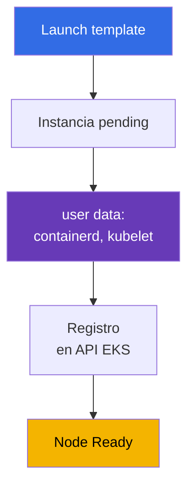
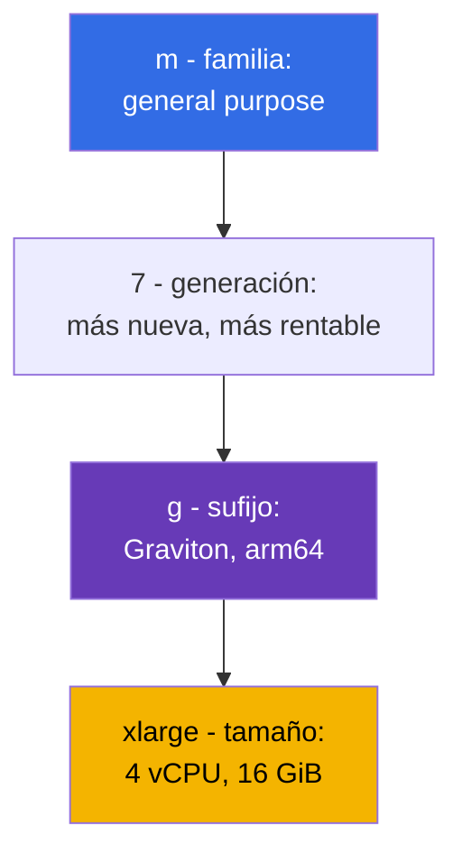
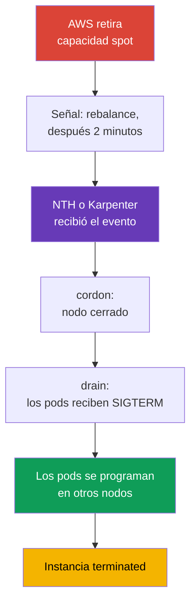

[Русская версия](ru.md) · [Eng version](en.md) · [Version française](fr.md) · [Deutsche Version](de.md) · [ქართული ვერსია](ge.md) · [繁體中文版](tw.md) · [日本語版](jp.md)
# Capítulo 0.4. EC2 y modelos de pago: tipos de instancia, AMI, on-demand, spot, Savings Plans

> **Qué sigue.** Ya se entienden la cuenta, la región y las AZ (capítulo 0.1), IAM otorga los permisos (0.2) y las direcciones viven en VPC (0.3). Falta aquello con lo que se construye el data plane: la máquina virtual EC2. Un nodo EKS es una instancia con un tipo concreto, una imagen AMI, un disco y un precio, y casi todas las decisiones sobre densidad, fiabilidad y coste del clúster se toman aquí. Veremos EC2 al nivel necesario para los nodos y lo vincularemos de inmediato con el precio: on-demand, spot, Savings Plans y Graviton.

## 0.4.1. Instancia EC2 como nodo de clúster

Una **instancia EC2** es una máquina virtual: tipo (cuántos vCPU y memoria), AMI (lo que arrancará), subred y security group (capítulo 0.3), IAM instance profile (el rol de la instancia, capítulo 0.2) y discos. Un nodo Kubernetes es una instancia de este tipo en la que al inicio arrancaron containerd y kubelet, y kubelet se registró en el API server. El eslabón clave del registro es **user data**: una configuración que se entrega a la instancia al iniciarla y se ejecuta antes de arrancar kubelet; contiene el nombre del clúster, el endpoint del API server, el certificado CA y los argumentos de kubelet (labels, taints, `--max-pods`). En AL2023 es cloud-init con una sección `NodeConfig`, y en Bottlerocket es TOML (capítulos 10 y 45).



El ciclo de vida es: `pending` -> `running` (se factura) -> `stopped` (solo pagas EBS) -> `terminated` (irreversible). Para nodos no se usa `stopped`: un nodo no se repara, sino que se **reemplaza**, por eso sus datos son efímeros y cambiar AMI o tipo equivale a recrearlo.

**IMDS (Instance Metadata Service)** es un endpoint local, `169.254.169.254`, donde la instancia conoce su ID, región, AZ y tipo, y obtiene las **credentials temporales de su IAM role**: de allí las toman kubelet, VPC CNI y aws-node. La otra cara es que un pod ordinario también puede llegar a IMDS y **robar las credentials del rol del nodo**, que puede leer ECR y administrar ENI. Por ello IMDSv2 es obligatorio, hop limit es 1 y los permisos de los pods se conceden mediante IRSA o Pod Identity (capítulos 16-19).

```bash
# IMDSv2: primero el token y después la solicitud de metadatos (v1 sin token ya se deshabilita)
TOKEN=$(curl -sX PUT "http://169.254.169.254/latest/api/token" \
  -H "X-aws-ec2-metadata-token-ttl-seconds: 21600")
curl -s -H "X-aws-ec2-metadata-token: $TOKEN" \
  http://169.254.169.254/latest/meta-data/instance-id
# Exigir IMDSv2 y bloquear los metadatos para los pods
aws ec2 modify-instance-metadata-options --instance-id i-0123456789abcdef0 \
  --http-tokens required --http-put-response-hop-limit 1
```

## 0.4.2. Familias y tamaños: cómo se lee t3.medium y m7g.xlarge

El nombre de tipo no es una marca, sino una descripción. `m7g.xlarge` se descompone así:



Los tamaños suben de precio casi linealmente: `large`, `xlarge`, `2xlarge`, `4xlarge`, `8xlarge`; `2xlarge` cuesta el doble que `xlarge` al ofrecer el doble de recursos, de modo que elegir «dos `xlarge` o un `2xlarge`» es una cuestión de fiabilidad y densidad, no de precio (sección 0.4.8). Sufijos: `g` - Graviton (arm64), `i` - Intel, `a` - AMD, `d` - NVMe local, `n` - red mejorada.

| Familia | Clase | Relación | Dónde se usa en el clúster |
|-----------|-------|-------------|--------------------------|
| `t3`, `t4g` | burstable | 1:2 / 1:4 | clústeres dev y formación, no nodos prod |
| `m5`, `m6i`, `m7g` | general purpose | 1 vCPU : 4 GiB | nodos predeterminados, addons de sistema |
| `c6i`, `c7g` | compute optimized | 1 vCPU : 2 GiB | CI runners, procesamiento, códecs |
| `r6i`, `r7g` | memory optimized | 1 vCPU : 8 GiB | JVM, cachés, analítica |
| `i4i`, `im4gn` | storage optimized | NVMe local | Kafka, Elasticsearch, cachés en disco |
| `g5`, `p5` | accelerated | GPU | inferencia y entrenamiento ML, taints propios |

**ARM frente a x86.** Graviton es arm64 y hay dos cosas a considerar. Primera: las imágenes deben existir para arm64; de lo contrario el pod falla con `exec format error`; las públicas suelen ser multi-arch, las propias se construyen con `docker buildx --platform linux/amd64,linux/arm64`. Segunda: un clúster mixto funciona, pero las cargas se separan mediante `kubernetes.io/arch` con nodeSelector o affinity.

**Trampa de la serie T.** `t3` y `t4g` son **burstable**: por defecto disponen de una fracción de vCPU (en `t3.medium`, 20% por núcleo); todo lo adicional sale de **CPU credits**, que se acumulan en inactividad. Bajo carga se agotan los créditos, la instancia se ralentiza al nivel base (o se paga adicionalmente en modo `unlimited`), kubelet y CNI se bloquean, el nodo fluctúa a `NotReady` y la causa no aparece en `kubectl describe`.

## 0.4.3. Cuántos pods caben en una instancia

Con VPC CNI (el modo predeterminado), **cada pod recibe una IP real de la subred VPC**, y las direcciones se asignan mediante ENI, las interfaces de red de la instancia. El número de ENI y de IP por ENI está fijado para cada tipo, por tanto el tamaño de instancia gobierna la densidad: `max-pods = ENI * (IP por ENI - 1) + 2`.

| Tipo | ENI | IP por ENI | max-pods aproximado |
|-----|-----|-----------|--------------------|
| `t3.small` | 3 | 4 | 11 |
| `m5.large` | 3 | 10 | 29 |
| `m5.4xlarge` | 8 | 30 | 234 |

En instancias pequeñas se alcanza el límite de pods antes de agotar CPU y memoria, y los pods de sistema (aws-node, kube-proxy, controladores CSI y agente de logs) ocupan puestos en **cada** nodo: en `t3.small` quedan 6-7 puestos. Prefix delegation eleva el límite (capítulo 7), y el capítulo 14 trata la densidad.

```bash
# Comparar la densidad de tipos: ENI y número de IP por interfaz
aws ec2 describe-instance-types --instance-types t3.medium m5.xlarge m7g.2xlarge \
  --query 'InstanceTypes[].[InstanceType,NetworkInfo.MaximumNetworkInterfaces,
    NetworkInfo.Ipv4AddressesPerInterface]' --output table
```

## 0.4.4. AMI: la imagen desde la que arranca un nodo

Una **AMI (Amazon Machine Image)** es la plantilla de disco desde la que inicia una instancia. Para nodos no se usa «simplemente Linux»: AWS publica **AMI optimizadas para EKS** con containerd, kubelet de la versión minor requerida, el plugin CNI y lógica bootstrap. Opciones: **Amazon Linux 2023** (distribución normal, `dnf`, depuración habitual), **Bottlerocket** (SO mínimo para contenedores, root read-only, actualización de imagen completa), **Windows** y el obsoleto **AL2**. La diferencia entre las dos primeras se nota durante una guardia: Bottlerocket no ofrece ni la shell habitual ni un gestor de paquetes, y no se puede entrar por SSH al nodo para «ver logs»; la depuración se realiza con los contenedores estándar control y admin, o mediante SSM Session Manager (capítulos 10 y 45).

La propiedad principal es que una **AMI está ligada a la versión minor de Kubernetes**. Una imagen para `1.33` no se instala en un clúster `1.34`: kubelet tiene un desfase de versiones limitado respecto al API server, por lo que actualizar un clúster incluye actualizar la AMI. El ID depende de versión, región, arquitectura y variante, y se toma de SSM:

```bash
# ID de AL2023 optimizada para EKS para 1.33 (para Graviton - arm64 en lugar de x86_64,
# para Bottlerocket - /aws/service/bottlerocket/aws-k8s-1.33/x86_64/latest/image_id)
aws ssm get-parameter --region eu-central-1 \
  --name /aws/service/eks/optimized-ami/1.33/amazon-linux-2023/x86_64/standard/recommended/image_id \
  --query Parameter.Value --output text
```

Una AMI es un objeto de ciclo de vida igual que la versión del clúster: AWS publica regularmente compilaciones con parches de kernel y CVE cerrados, y «un nodo medio año con una imagen antigua» no es estabilidad, sino deuda. En managed node group la actualización es estándar, con rolling replacement (capítulo 10), y el capítulo 38 explica el orden.

## 0.4.5. Discos del nodo: volumen root EBS, gp3 y NVMe local

Un nodo tiene un **volumen root EBS**: un disco de bloques de red con SO, imágenes de contenedor, capas de containerd y almacenamiento efímero de los pods (`emptyDir`, logs). Su tamaño y tipo se definen en launch template, y se olvidan a menudo: un volumen pequeño se llena de imágenes, kubelet activa **disk pressure**, expulsa pods y limpia caché. Para nodos se usa `gp3`: IOPS y rendimiento se configuran independientemente del tamaño y resulta más barato que `gp2`.

**Instance store** son NVMe locales en tipos con sufijo `d` (`m6id`, `c6gd`) y en storage optimized (`i4i`, `im4gn`). Son rápidos y están incluidos en el precio de la instancia, pero son **efímeros**: los datos desaparecen al reemplazar la instancia y, en nodos spot, esto es habitual. Sirven para caché de compilación y scratch; los datos persistentes solo van en EBS o EFS.

Una consecuencia importante del capítulo 0.1: **un volumen EBS vive en una sola AZ** y se conecta solo a una instancia de la misma zona; por eso un pod con PVC queda ligado a la zona de su volumen y, si el autoscaler levanta un nodo en otra AZ, el pod seguirá en `Pending`. De ahí `WaitForFirstConsumer` y shared storage - capítulo 23.

## 0.4.6. Auto Scaling group y launch template

Los nodos no se crean uno a uno. Se usan dos objetos EC2:

- **Launch template** - plantilla versionada de inicio: AMI, tipo (o lista de tipos), security groups, IAM instance profile, tamaño y tipo del volumen root, user data, opciones IMDS y tags.
- **Auto Scaling group (ASG)** - grupo de instancias que mantiene un número de máquinas dado (`min`, `desired`, `max`) en subredes de distintas AZ, reemplaza las que fallan y mezcla on-demand y spot.

**Managed node group EKS es un ASG más launch template**, administrados por el servicio EKS: los crea, aplica tags, sabe hacer drain durante una actualización y conoce las interrupciones spot. De aquí una regla que ahorra horas de depuración: **el ASG de un managed node group no se modifica manualmente**; se cambian los parámetros del node group o la propia versión de launch template. El capítulo 9 compara opciones de cómputo (managed, self-managed, Fargate y Auto Mode), el 10 cubre personalización bootstrap; Karpenter crea instancias directamente, sin ASG, y por ello responde más rápido (capítulos 11 y 12).

```bash
# Límites de escalado de los grupos de nodos y contenido de la versión más reciente de la plantilla de lanzamiento
aws autoscaling describe-auto-scaling-groups --query 'AutoScalingGroups[].[
  AutoScalingGroupName,MinSize,DesiredCapacity,MaxSize]'
aws ec2 describe-launch-template-versions --launch-template-id lt-0123456789abcdef0 \
  --versions '$Latest' --query 'LaunchTemplateVersions[].LaunchTemplateData'
```

Otro atributo de inicio que conviene conocer de antemano es **placement group**. De forma predeterminada EC2 distribuye tus instancias entre hardware distinto para reducir fallos correlacionados, y en la mayoría de casos es lo adecuado. Se interviene cuando la carga es muy sensible a la latencia entre nodos o cuando puede replicar sus datos y quiere saber que las réplicas están en racks distintos. Crear el grupo no cuesta, hay cuatro estrategias (también existe precision time para tiempo exacto), y tres interesan para clústeres:

| Estrategia | Qué hace | Carga típica | Limitación que se alcanza |
|-----------|-----------|-------------------|-------------------------------|
| `cluster` | empaqueta instancias juntas dentro de una AZ, latencia mínima | HPC, entrenamiento distribuido de modelos | una AZ para todo el grupo; mezclar tipos reduce la posibilidad de hallar capacidad |
| `partition` | distintas particiones no comparten racks, hasta 7 particiones por AZ | Cassandra, HDFS, HBase, Kafka | el número de instancias solo está limitado por las cuotas de cuenta |
| `spread` | cada instancia usa hardware separado | unos pocos nodos críticos | estrictamente **7 instancias en ejecución por AZ** por grupo |

Tres trampas que aparecen precisamente en un clúster. Primera: `spread` más autoscaling - el octavo nodo de una zona simplemente no iniciará y Karpenter o ASG chocarán con un rechazo, cuyo síntoma parece falta de capacidad. Segunda: si no existe hardware único apropiado, la solicitud **falla**, no queda en cola; por ello el grupo no se vuelve obligatorio para nodos sin los cuales el clúster no sobrevive. Tercera: `cluster` por definición mantiene todos los nodos en una AZ, lo que contradice la distribución en tres zonas (capítulo 40); se usa para un NodePool dedicado, no para todo el clúster. Y sobre spot: una instancia configurada para stop o hibernate al retirarse no puede iniciarse en placement group (capítulo 13).

Se configura en launch template para nodos self-managed y managed node groups. En EKS Auto Mode existe el campo `placementGroupSelector` en `NodeClass`, y Karpenter también puede iniciar nodos en placement group - detalles en los capítulos 9 y 12.

## 0.4.7. Modelos de pago: on-demand, spot, Savings Plans, Graviton

**On-demand** es el pago por segundos de ejecución según tarifa, sin compromiso: la base de comparación y el predeterminado.

**Spot** es capacidad libre con un descuento normalmente de 60-90%. Cada tipo y AZ tienen su propio precio, y AWS puede **interrumpir** la instancia cuando necesita capacidad: llega una notificación mediante IMDS y EventBridge y hay **dos minutos**. Kubernetes lo tolera sin problemas si las cargas están preparadas: NodeTerminationHandler o Karpenter capturan el evento, marcan el nodo como `NoSchedule` y hacen drain. La diferencia está en el origen de la señal: desde el nodo mediante IMDS o centralizadamente, cuando EventBridge coloca eventos en una cola SQS y un controlador los lee. La segunda ruta es la variante de producción para Karpenter: no depende de que un nodo concreto siga vivo (capítulos 12 y 13).



Toda la cadena debe completarse en 120 segundos, y no es una recomendación sino un plazo físico: al expirar la instancia desaparece, aunque tus pods no hayan terminado. Por tanto, en nodos spot PDB y el manejo correcto de SIGTERM en la aplicación son una parte obligatoria de la configuración (capítulo 40).

**Savings Plans** y **Reserved Instances** son descuentos por el compromiso de gastar una cantidad fija (o mantener instancias concretas) durante **1 o 3 años**. Hay dos planes Savings y su diferencia importa para un híbrido EC2 + Fargate (capítulos 9 y 15). **Compute Savings Plans** es el más flexible: aplica descuento a EC2, Fargate y Lambda sin importar familia, tamaño, región ni SO; migrar de `m6i` a `m7g` o una parte de las cargas de nodos a Fargate no lo rompe. **EC2 Instance Savings Plans** ofrece un descuento mayor, pero cubre solo EC2 y una familia en una región (por ejemplo, `m7g` en eu-central-1), es flexible en tamaño, AZ y SO dentro de ella, y no afecta a Fargate. Los RI están ligados a tipo y zona y se usan poco para nodos. El compromiso se calcula según el **mínimo** de consumo; spot cubre los picos. **Graviton** no es un modelo de pago, sino otra fuente de ahorro.

Para entrenamiento GPU y grandes trabajos ML existen **EC2 Capacity Blocks for ML**: reserva de capacidad de instancias de familia P y Trainium para una fecha futura y un periodo de un día a medio año, hasta ocho semanas de antelación, con disponibilidad garantizada. Es una reserva de aceleradores escasos, no un descuento: se levantan nodos para una ventana final de entrenamiento, no se mantienen constantemente (capítulo 9).

| Modelo | Descuento | Riesgo | Para qué nodos del clúster |
|--------|------|------------------------|------------------------|
| **On-demand** | no | no | nodos de sistema, controladores, bases en clúster |
| **Spot** | 60-90% | interrupción en 2 minutos | servicios stateless, CI, batch, colas |
| **Compute SP** | más flexible | compromiso de 1-3 años, EC2+Fargate+Lambda | base predecible, híbrido |
| **EC2 Instance SP** | mayor | compromiso con familia en región | perfil estable de nodos |
| **Reserved Instances** | 30-70% | ligado a tipo y zona | perfiles poco comunes de nodos |
| **Capacity Blocks** | reserva de capacidad | ventana y fecha de reserva | GPU y Trainium para entrenamiento |
| **Graviton** | 15-40% | se requieren imágenes arm64 | todo lo que se compile multi-arch |

```bash
# Precios spot por tipo y zona durante la última hora: base para la diversificación
aws ec2 describe-spot-price-history --product-descriptions "Linux/UNIX" \
  --instance-types m7g.xlarge m6i.xlarge c7g.xlarge \
  --start-time "$(date -u -d '1 hour ago' +%Y-%m-%dT%H:%M:%S)" \
  --query 'SpotPriceHistory[].[InstanceType,AvailabilityZone,SpotPrice]' --output table
# Recomendación de Compute Savings Plans para un año basada en el consumo real
aws ce get-savings-plans-purchase-recommendation --savings-plans-type COMPUTE_SP \
  --term-in-years ONE_YEAR --payment-option NO_UPFRONT --lookback-period-in-days SIXTY_DAYS
```

La combinación típica de producción es: capacidad base on-demand bajo Savings Plans, todo lo elástico en spot con una lista amplia de tipos y, cuando sea posible, en Graviton (capítulos 13 y 43).

## 0.4.8. Sizing de nodos: muchos pequeños o unos pocos grandes

La misma cantidad de CPU y memoria se obtiene con diez `m7g.large` o con un par de `m7g.4xlarge`:

- **Radio de explosión.** Perder un nodo pequeño apenas se nota; uno grande se lleva una gran parte de las cargas.
- **Overhead de pods de sistema.** aws-node, kube-proxy, controladores CSI y agentes de logs consumen recursos en **cada** nodo: cuantos más nodos, menor la parte útil.
- **Límite de pods.** En instancias pequeñas se alcanza max-pods, mientras CPU y memoria permanecen ociosas; un pod con solicitud de 8 GiB ni siquiera cabe en `large`.
- **Paso de escalado.** Un nodo pequeño se levanta más rápido y añade capacidad en porciones pequeñas; uno grande da un paso tosco y caro, aunque se pierde menos en empaquetado.

Un punto medio razonable son nodos `xlarge` - `4xlarge`, varios por AZ, con perfiles separados por NodePool.

Sobre spot: **un conjunto homogéneo de instancias es el principal enemigo de los nodos spot**. Si un grupo permite solo `m6i.2xlarge`, retirar capacidad de ese tipo en esa AZ derriba todos los nodos a la vez y PDB no ayudará. Lo correcto son 10-20 tipos compatibles de distintas familias y generaciones en tres AZ: así las interrupciones llegan de un nodo cada vez y el clúster no las percibe (capítulo 12).

No basta con una lista de tipos; importa **cómo se elige el pool**. `lowest-price` toma los pools más baratos y por tanto sufre más interrupciones; `capacity-optimized` elige pools con la mayor reserva de capacidad y minimiza retiradas; `capacity-optimized-prioritized` hace lo mismo, pero respeta best-effort el orden de prioridad de tipos dado (requiere launch template). Para nodos se usan estrategias orientadas a capacidad, no `lowest-price`; Karpenter usa por defecto `price-capacity-optimized`, equilibrando precio y reserva de capacidad (capítulo 13).

## 0.4.9. Cómo se aplica en producción

- **Dos perfiles de nodos.** Un grupo on-demand pequeño para addons de sistema (CoreDNS, controladores, métricas) y capacidad spot para aplicaciones: el sistema en spot provoca incidentes en cascada.
- **Separación por familias.** `m` para uso general, `c` para CI y procesamiento, `r` para JVM y cachés; los nodos GPU usan taints propios. Un tipo universal para todo implica pagar de más.
- **Graviton de forma predeterminada.** Los servicios nuevos se construyen multi-arch desde el comienzo y los antiguos se migran según estén listas sus imágenes: es el ahorro más simple sin cambiar arquitectura. El ID de imagen se toma de SSM, la actualización de AMI se planifica junto con la del clúster (capítulos 10 y 38), y la cobertura de Savings Plans se revisa trimestralmente (capítulo 43).

## 0.4.10. Mini glosario

- Una **instancia EC2** es una máquina virtual; para EKS es un nodo con containerd y kubelet.
- **User data** es la configuración que se ejecuta al iniciar la instancia; contiene el bootstrap del nodo.
- **IMDS** es el servicio de metadatos en `169.254.169.254`; entrega datos de la instancia y credentials temporales del IAM role. En prod se usa solo IMDSv2 con hop limit 1.
- El **tipo de instancia** es `familia + generación + sufijo . tamaño`, por ejemplo `m7g.xlarge`. **Graviton** son procesadores AWS arm64 (sufijo `g`) que requieren imágenes multi-arch.
- **Burstable (serie T)** es una fracción base de CPU más **CPU credits**; no sirve para nodos prod. **max-pods** es el límite de pods de un nodo y, con VPC CNI, depende del número de ENI e IP por ENI.
- **AMI** es una imagen de inicio de instancia; AL2023 y Bottlerocket están ligadas a la versión minor de Kubernetes. **EBS / instance store** son volumen de red en una AZ / NVMe local efímero.
- **Launch template / Auto Scaling group** son plantilla versionada de inicio / grupo de instancias con `min`, `desired`, `max` entre subredes AZ.
- **Placement group** controla la colocación de instancias: `cluster` (juntas, latencia mínima, una AZ), `partition` (racks distintos por particiones, hasta 7 por AZ), `spread` (cada una en hardware propio, máximo 7 activas por AZ).
- **On-demand / Spot** son pago por uso / capacidad con descuento e interrupción en dos minutos. **Savings Plans / RI** son descuento de 30-70% por compromiso de 1 o 3 años.
- **Compute SP / EC2 Instance SP** son plan flexible (EC2, Fargate, Lambda) / más profundo, pero para una familia en una región. **Capacity Blocks** es reserva de capacidad GPU/Trainium para entrenamiento.
- La **estrategia spot** define cómo se elige el pool: `capacity-optimized(-prioritized)` frente a `lowest-price`; las orientadas a capacidad sufren menos interrupciones.

## 0.4.11. Resumen del capítulo

- Un nodo EKS es una instancia EC2: launch template define AMI, tipo, SG y user data; user data inicia kubelet y kubelet se registra en el clúster. Los nodos son desechables: se reemplazan.
- IMDS entrega credentials del rol de nodo, por tanto IMDSv2 y hop limit 1 son obligatorios, y los permisos de pods se dan por IRSA o Pod Identity (capítulos 16, 17 y 19).
- El nombre de tipo se lee por partes: familia, generación, sufijos (`g` - Graviton, `d` - NVMe local) y tamaño; la serie T con CPU credits no sirve para nodos prod. El tamaño también define los pods mediante ENI e IP: los nodos pequeños alcanzan max-pods antes que los recursos (capítulos 6, 7 y 14).
- La AMI está ligada a la versión minor de Kubernetes, su ID se obtiene de SSM y actualizar la imagen es parte del ciclo de vida del clúster (capítulos 10 y 38).
- Hay que dimensionar el volumen root gp3; instance store es efímero, un volumen EBS vive en una AZ y liga un pod con PVC a la zona (capítulo 23). Managed node group = ASG + launch template administrado por EKS, y su ASG no se modifica manualmente (capítulos 9 y 10).
- Economía de nodos: on-demand como base bajo Savings Plans, spot con amplia diversificación de tipos para la parte elástica y Graviton como multiplicador de ahorro (capítulos 13 y 43).

## 0.4.12. Cómo será útil en el trabajo real

La investigación de incidentes de nodos se realiza en el nivel EC2: por qué una instancia no se convirtió en nodo (user data, IAM, SG), por qué no caben pods (max-pods, no CPU), por qué el nodo pasó a `NotReady` (se agotaron CPU credits o el espacio del volumen root), por qué desapareció medio clúster de golpe (nodos spot homogéneos). El mismo nivel responde por el dinero: familia, Graviton, porcentaje spot y cobertura Savings Plans.

## 0.4.13. Preguntas de autoevaluación

1. ¿Qué debe ocurrir en una instancia para que se convierta en nodo del clúster y dónde se describe?
2. ¿Para qué necesita kubelet IMDS y por qué hop limit 1 es un asunto de seguridad?
3. Descompón `c7gd.2xlarge`: ¿qué significa cada parte?
4. ¿Por qué `t3.medium` es una mala elección para un nodo prod?
5. Tienes `m5.large`, pods en `Pending`, CPU y memoria libres. ¿Qué revisas primero?
6. ¿Por qué no se codifica el ID de una AMI optimizada para EKS y de dónde se obtiene?
7. ¿En qué se diferencia instance store del volumen root EBS y qué se puede guardar allí?
8. ¿Qué es un managed node group en términos EC2 y por qué no se modifica su ASG manualmente?
9. ¿Cuánto tiempo da una interrupción spot y por qué es mala una agrupación spot de un único tipo de instancia?
10. ¿Cuándo son Savings Plans más rentables que spot y cómo se combinan en un clúster?

## Práctica

La Parte 0 no tiene laboratorios propios: es la base de los demás capítulos. La práctica comenzará en la Parte 1, cuando levantes un clúster EKS mediante Terragrunt; los nodos, spot y Karpenter se practicarán en los laboratorios de la Parte 2. A continuación están las herramientas: aws cli, eksctl, terraform y terragrunt, helm y plugins.

---
[Índice](../README_ES.md) · [Capítulo 0.3](../00-3-vpc/es.md) · [Capítulo 0.5](../00-5-tools/es.md)
