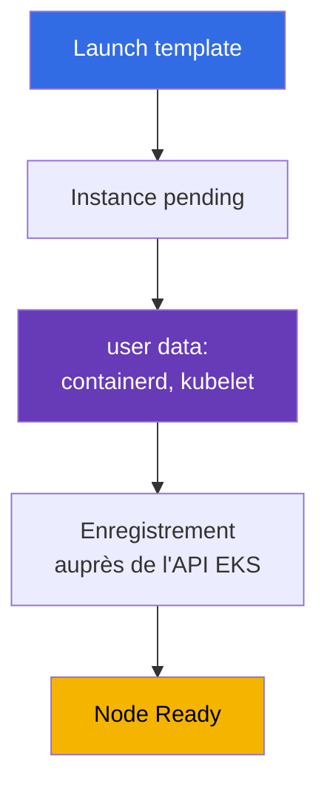
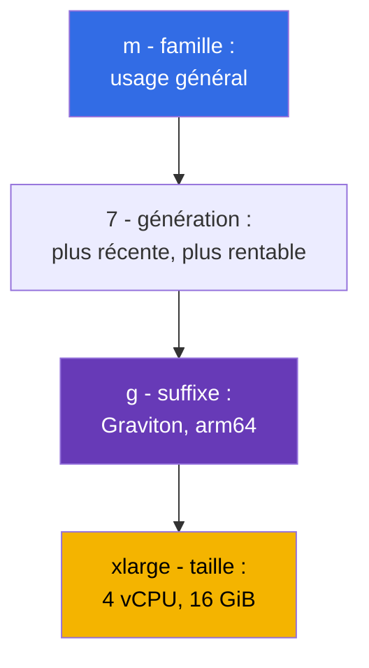
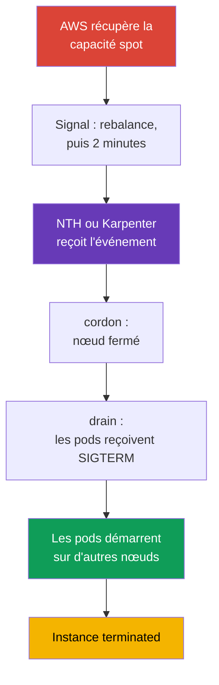

[Русская версия](ru.md) · [Eng version](en.md) · [Versión en español](es.md) · [Deutsche Version](de.md) · [ქართული ვერსია](ge.md) · [繁體中文版](tw.md) · [日本語版](jp.md)
# Chapitre 0.4. EC2 et modèles de tarification : types d'instances, AMI, on-demand, spot, Savings Plans

> **La suite.** Vous connaissez maintenant les comptes, les régions et les AZ (chapitre 0.1), IAM accorde les droits (chapitre 0.2) et les adresses vivent dans un VPC (chapitre 0.3). Il reste la base du data plane : une machine virtuelle EC2. Un nœud EKS est une instance avec un type, une AMI, un disque et un prix précis, et presque toutes les décisions sur la densité, la fiabilité et le coût du cluster se prennent ici. Nous verrons EC2 dans la mesure nécessaire aux nœuds, puis son lien avec le prix : on-demand, spot, Savings Plans et Graviton.

## 0.4.1. Une instance EC2 comme nœud de cluster

Une **instance EC2** est une machine virtuelle : son type (nombre de vCPU et quantité de mémoire), son AMI (ce qui démarre), son sous-réseau et son security group (chapitre 0.3), son IAM instance profile (le rôle de l'instance, chapitre 0.2) et ses disques. Un nœud Kubernetes est une telle instance où containerd et kubelet démarrent au lancement, puis kubelet s'enregistre auprès de l'API server. L'élément clé de l'enregistrement est le **user data** : la configuration fournie à l'instance au lancement et exécutée avant kubelet. Elle contient le nom du cluster, l'endpoint de l'API server, le certificat CA et les arguments kubelet (labels, taints, `--max-pods`). Dans AL2023, c'est cloud-init avec une section `NodeConfig` ; dans Bottlerocket, c'est TOML (chapitres 10 et 45).



Le cycle de vie est `pending` -> `running` (facturé) -> `stopped` (vous ne payez que EBS) -> `terminated` (irréversible). Les nœuds n'utilisent pas `stopped` : un nœud n'est pas réparé, il est **remplacé**. Ses données sont donc éphémères, et changer une AMI ou un type implique de le recréer.

**IMDS (Instance Metadata Service)** est l'endpoint local `169.254.169.254` où une instance apprend son ID, sa région, son AZ et son type, puis obtient les **credentials temporaires de son rôle IAM**. kubelet, VPC CNI et aws-node les y récupèrent. Le revers est qu'un pod ordinaire peut aussi atteindre IMDS et **récupérer les credentials du rôle du nœud**, autorisé par exemple à lire ECR et à gérer des ENI. IMDSv2 est donc obligatoire, le hop limit vaut 1, et les droits des pods sont accordés via IRSA ou Pod Identity (chapitres 16 à 19).

```bash
# IMDSv2 : d'abord le token, puis une requête de métadonnées (v1 sans token est déjà désactivé)
TOKEN=$(curl -sX PUT "http://169.254.169.254/latest/api/token" \
  -H "X-aws-ec2-metadata-token-ttl-seconds: 21600")
curl -s -H "X-aws-ec2-metadata-token: $TOKEN" \
  http://169.254.169.254/latest/meta-data/instance-id
# Exiger IMDSv2 et bloquer l'accès aux métadonnées depuis les pods
aws ec2 modify-instance-metadata-options --instance-id i-0123456789abcdef0 \
  --http-tokens required --http-put-response-hop-limit 1
```

## 0.4.2. Familles et tailles : lire t3.medium et m7g.xlarge

Le nom d'un type n'est pas une marque, mais une description. `m7g.xlarge` se décompose ainsi :



Les tailles augmentent presque linéairement avec le prix : `large`, `xlarge`, `2xlarge`, `4xlarge`, `8xlarge`. Un `2xlarge` coûte deux fois un `xlarge` pour deux fois les ressources. Choisir deux `xlarge` ou un `2xlarge` est donc une question de fiabilité et de densité, pas de prix (section 0.4.8). Les suffixes sont : `g` pour Graviton (arm64), `i` pour Intel, `a` pour AMD, `d` pour le NVMe local et `n` pour le réseau amélioré.

| Famille | Classe | Ratio | Usage dans le cluster |
|--------|-------|-------|-----------------------|
| `t3`, `t4g` | burstable | 1:2 / 1:4 | clusters dev et apprentissage, pas de nœuds prod |
| `m5`, `m6i`, `m7g` | usage général | 1 vCPU : 4 GiB | nœuds par défaut, add-ons système |
| `c6i`, `c7g` | compute optimized | 1 vCPU : 2 GiB | runners CI, traitement, codecs |
| `r6i`, `r7g` | memory optimized | 1 vCPU : 8 GiB | JVM, caches, analytique |
| `i4i`, `im4gn` | storage optimized | NVMe local | Kafka, Elasticsearch, caches sur disque |
| `g5`, `p5` | accelerated | GPU | inférence et entraînement ML, taints dédiés |

**ARM contre x86.** Graviton est arm64 et deux faits comptent. D'abord, des images doivent exister pour arm64, sinon le pod échoue avec `exec format error` ; les images publiques sont généralement multi-arch, les vôtres se construisent avec `docker buildx --platform linux/amd64,linux/arm64`. Ensuite, un cluster mixte fonctionne, mais les charges sont séparées avec `kubernetes.io/arch` par nodeSelector ou affinity.

**Le piège des séries T.** `t3` et `t4g` sont **burstable** : ils reçoivent une part vCPU de base (`t3.medium` reçoit 20 % par cœur) et tout surplus provient des **CPU credits** accumulés au repos. Sous charge, les crédits s'épuisent, l'instance ralentit à son niveau de base (ou génère un coût supplémentaire en mode `unlimited`), kubelet et CNI se bloquent, le nœud oscille vers `NotReady`, et la cause reste invisible dans `kubectl describe`.

## 0.4.3. Combien de pods tiennent sur une instance

Avec VPC CNI (le mode par défaut), **chaque pod reçoit une IP réelle d'un sous-réseau VPC**, et les adresses sont attribuées via les ENI, les interfaces réseau de l'instance. Le nombre d'ENI et d'IP par ENI est fixe pour un type ; la taille de l'instance contrôle donc la densité : `max-pods = ENI * (IP par ENI - 1) + 2`.

| Type | ENI | IP par ENI | max-pods approximatif |
|------|-----|------------|-----------------------|
| `t3.small` | 3 | 4 | 11 |
| `m5.large` | 3 | 10 | 29 |
| `m5.4xlarge` | 8 | 30 | 234 |

Sur les petites instances, le plafond de pods est atteint avant l'épuisement du CPU et de la mémoire. Les pods système (aws-node, kube-proxy, pilotes CSI, agents de logs) occupent des emplacements sur **chaque** nœud et il ne reste que 6-7 places sur `t3.small`. Prefix delegation relève la limite (chapitre 7) ; la densité est traitée au chapitre 14.

```bash
# Comparer la densité des types : ENI et nombre d'adresses IP par interface
aws ec2 describe-instance-types --instance-types t3.medium m5.xlarge m7g.2xlarge \
  --query 'InstanceTypes[].[InstanceType,NetworkInfo.MaximumNetworkInterfaces,
    NetworkInfo.Ipv4AddressesPerInterface]' --output table
```

## 0.4.4. AMI : l'image depuis laquelle démarre le nœud

Une **AMI (Amazon Machine Image)** est le modèle de disque depuis lequel une instance démarre. Les nœuds n'utilisent pas « simplement Linux » : AWS publie des **AMI optimisées pour EKS** avec containerd, kubelet pour la version mineure requise, le plugin CNI et la logique bootstrap. Les choix sont **Amazon Linux 2023** (distribution classique avec `dnf` et débogage familier), **Bottlerocket** (OS minimal pour les conteneurs, root en lecture seule, mises à jour par image complète), **Windows** et le vieillissant **AL2**. La différence entre les deux premiers se ressent pendant un incident : Bottlerocket n'a ni shell habituel ni gestionnaire de paquets, et l'on ne peut pas se connecter à un nœud en SSH simplement pour « consulter les logs ». Le débogage utilise les conteneurs control et admin standard, ou SSM Session Manager (chapitres 10 et 45).

La propriété essentielle est qu'une **AMI est liée à une version mineure de Kubernetes**. Une image pour `1.33` ne s'utilise pas dans un cluster `1.34`, car kubelet a un écart de versions limité avec l'API server ; une mise à niveau du cluster inclut donc celle de l'AMI. L'ID dépend de la version, de la région, de l'architecture et de la variante, et se récupère depuis SSM :

```bash
# ID de l'AL2023 optimisée pour EKS 1.33 (pour Graviton, arm64 à la place de x86_64,
# pour Bottlerocket : /aws/service/bottlerocket/aws-k8s-1.33/x86_64/latest/image_id)
aws ssm get-parameter --region eu-central-1 \
  --name /aws/service/eks/optimized-ami/1.33/amazon-linux-2023/x86_64/standard/recommended/image_id \
  --query Parameter.Value --output text
```

Une AMI est un objet de cycle de vie comme une version de cluster : AWS publie régulièrement des builds avec des correctifs de kernel et des CVE fermées, et « un nœud sur une vieille image depuis six mois » n'est pas de la stabilité, mais de la dette. Un managed node group se met à jour normalement par rolling replacement (chapitre 10) ; l'ordre est au chapitre 38.

## 0.4.5. Disques du nœud : volume root EBS, gp3 et NVMe local

Un nœud a un **volume root EBS**, disque bloc réseau qui contient l'OS, les images de conteneurs, les couches containerd et le stockage éphémère des pods (`emptyDir`, logs). Sa taille et son type sont définis dans le launch template et souvent oubliés : un petit volume se remplit d'images, kubelet déclenche **disk pressure**, évince les pods et vide le cache. Les nœuds utilisent `gp3` : IOPS et débit se configurent indépendamment de la taille, et il est moins cher que `gp2`.

**Instance store** est le NVMe local des types avec le suffixe `d` (`m6id`, `c6gd`) et des types storage optimized (`i4i`, `im4gn`). Il est rapide et inclus dans le prix de l'instance, mais **éphémère** : les données disparaissent quand l'instance est remplacée, ce qui est courant pour les nœuds spot. Il convient au cache de build et aux données scratch ; les données persistantes vont uniquement sur EBS ou EFS.

Une conséquence importante du chapitre 0.1 est qu'un **volume EBS vit dans un AZ** et ne s'attache qu'à une instance de cette zone. Un pod avec PVC est donc lié à la zone de son volume ; si l'autoscaler démarre un nœud dans un autre AZ, le pod reste `Pending`. C'est la raison d'être de `WaitForFirstConsumer` et du stockage partagé, expliquée au chapitre 23.

## 0.4.6. Auto Scaling group et launch template

Les nœuds ne sont pas créés un par un. Deux objets EC2 interviennent :

- Un **launch template** est un modèle de lancement versionné : AMI, type (ou liste de types), security groups, IAM instance profile, taille et type du volume root, user data, paramètres IMDS et tags.
- Un **Auto Scaling group (ASG)** est un groupe d'instances qui maintient le nombre configuré de machines (`min`, `desired`, `max`) dans des sous-réseaux de plusieurs AZ, remplace celles qui échouent et mélange on-demand et spot.

Un **managed node group EKS est un ASG plus un launch template** gérés par le service EKS : il les crée, applique les tags, sait faire un drain pendant les mises à jour et comprend les interruptions spot. Il en découle une règle qui économise des heures de débogage : **ne modifiez pas manuellement l'ASG d'un managed node group**. Modifiez les paramètres du node group ou votre propre version du launch template. Les options de calcul (managed, self-managed, Fargate, Auto Mode) sont comparées au chapitre 9, la personnalisation bootstrap au chapitre 10, et Karpenter crée directement les instances sans ASG ; il réagit donc plus vite (chapitres 11 et 12).

```bash
# Limites de mise à l'échelle des node groups et contenu de la dernière version du launch template
aws autoscaling describe-auto-scaling-groups --query 'AutoScalingGroups[].[
  AutoScalingGroupName,MinSize,DesiredCapacity,MaxSize]'
aws ec2 describe-launch-template-versions --launch-template-id lt-0123456789abcdef0 \
  --versions '$Latest' --query 'LaunchTemplateVersions[].LaunchTemplateData'
```

Un autre attribut de lancement qu'il faut connaître tôt est le **placement group**. Par défaut, EC2 répartit les instances sur du matériel différent pour réduire les défaillances corrélées, ce qui convient dans la plupart des cas. On intervient lorsqu'une charge est très sensible à la latence entre nœuds, ou qu'elle peut répliquer ses propres données et veut savoir que ses répliques se trouvent sur des racks différents. La création d'un groupe est gratuite ; il existe quatre stratégies (dont precision time pour une heure exacte), et trois intéressent les clusters :

| Stratégie | Rôle | Charge typique | Limite importante |
|-----------|------|----------------|-------------------|
| `cluster` | place les instances proches dans un AZ, latence minimale | HPC, entraînement distribué de modèles | un AZ pour tout le groupe ; mélanger les types réduit les chances de capacité |
| `partition` | des partitions différentes ne partagent pas de racks, jusqu'à 7 partitions par AZ | Cassandra, HDFS, HBase, Kafka | le nombre d'instances n'est limité que par les limites du compte |
| `spread` | chaque instance fonctionne sur un matériel distinct | quelques nœuds critiques | strictement **7 instances en fonctionnement par AZ** par groupe |

Trois pièges se manifestent surtout dans les clusters. D'abord, `spread` avec autoscaling signifie qu'un huitième nœud dans un AZ ne démarre tout simplement pas ; Karpenter ou l'ASG rencontre alors un échec qui ressemble à un manque de capacité. Ensuite, si le matériel unique approprié n'est pas disponible, la requête **échoue** au lieu d'être mise en file ; le groupe ne doit donc pas être obligatoire pour des nœuds sans lesquels le cluster ne fonctionne pas. Enfin, `cluster` garde par définition tous les nœuds dans un AZ, ce qui contredit une répartition sur trois zones (chapitre 40) : utilisez-le pour un NodePool dédié, pas pour tout le cluster. Séparément, une instance spot configurée pour s'arrêter ou hiberner lors de sa reprise ne peut pas démarrer dans un placement group (chapitre 13).

Cette configuration se fait dans un launch template pour les nœuds self-managed et les managed node groups. Dans EKS Auto Mode, utilisez le champ `placementGroupSelector` de `NodeClass` ; Karpenter peut aussi démarrer des nœuds dans un placement group, avec les détails aux chapitres 9 et 12.

## 0.4.7. Modèles de tarification : on-demand, spot, Savings Plans, Graviton

**On-demand** est une utilisation facturée à la seconde au tarif catalogue, sans engagement : c'est la référence de comparaison et le défaut.

**Spot** est de la capacité disponible, généralement avec une remise de 60-90 %. Le prix diffère pour chaque type et AZ, et AWS peut **interrompre** une instance lorsqu'il a besoin de la capacité : une notification arrive via IMDS et EventBridge, avec **deux minutes**. Kubernetes le gère bien si les charges sont préparées : NodeTerminationHandler ou Karpenter intercepte l'événement, marque le nœud `NoSchedule` et fait le drain. La différence est l'origine du signal : le nœud lui-même via IMDS, ou une voie centralisée où EventBridge place les événements dans une file SQS lue par un contrôleur. La seconde voie est la variante production pour Karpenter, car elle ne dépend pas de l'état d'un nœud particulier (chapitres 12 et 13).



Toute la chaîne doit se terminer en 120 secondes. Ce n'est pas une recommandation, mais une échéance physique : quand elle expire, l'instance disparaît, que vos pods soient terminés ou non. Les PDB et une gestion correcte de SIGTERM par l'application sont donc une configuration obligatoire pour les nœuds spot (chapitre 40).

**Savings Plans** et **Reserved Instances** sont des remises en échange d'un engagement à dépenser un montant fixe (ou à conserver des instances précises) pendant **1 ou 3 ans**. Il existe deux Savings Plans, et leur différence importe pour un hybride EC2 plus Fargate (chapitres 9 et 15). Les **Compute Savings Plans** sont les plus souples : la remise s'applique à EC2, Fargate et Lambda, indépendamment de la famille, de la taille, de la région et de l'OS. Passer de `m6i` à `m7g` ou déplacer une partie d'une charge des nœuds vers Fargate ne les casse donc pas. Les **EC2 Instance Savings Plans** offrent une remise plus profonde, mais ne couvrent que EC2 et une famille dans une région (par exemple `m7g` dans eu-central-1) ; ils restent flexibles par taille, AZ et OS, mais ne s'appliquent pas à Fargate. Les RI sont liées au type et à la zone, et sont rarement choisies pour les nœuds. Dimensionnez l'engagement sur la **borne basse** de consommation et couvrez les pics par du spot. **Graviton** n'est pas un modèle de tarification, mais une source distincte d'économies.

Pour l'entraînement GPU et les gros jobs ML, utilisez **EC2 Capacity Blocks for ML** : de la capacité réservée d'instances de famille P et Trainium pour une date future et une période allant d'un jour à un semestre, jusqu'à huit semaines à l'avance, avec disponibilité garantie. Cela réserve des accélérateurs rares au lieu d'accorder une remise : démarrez des nœuds pour une fenêtre d'entraînement finie plutôt que de les garder en permanence (chapitre 9).

| Modèle | Remise | Risque | Usage pour les nœuds du cluster |
|--------|--------|--------|---------------------------------|
| **On-demand** | aucune | aucun | nœuds système, contrôleurs, bases dans le cluster |
| **Spot** | 60-90% | interruption avec deux minutes de préavis | services stateless, CI, batch, files |
| **Compute SP** | plus souple | engagement de 1-3 ans, EC2+Fargate+Lambda | base prévisible, hybride |
| **EC2 Instance SP** | plus profonde | engagement sur une famille dans une région | profil de nœud stable |
| **Reserved Instances** | 30-70% | liées au type et à la zone | profils de nœud peu courants |
| **Capacity Blocks** | réservation de capacité | fenêtre et date de réservation | entraînement GPU et Trainium |
| **Graviton** | 15-40% | images arm64 requises | tout ce qui est construit multi-arch |

```bash
# Prix spot par type et AZ durant la dernière heure : base de la diversification
aws ec2 describe-spot-price-history --product-descriptions "Linux/UNIX" \
  --instance-types m7g.xlarge m6i.xlarge c7g.xlarge \
  --start-time "$(date -u -d '1 hour ago' +%Y-%m-%dT%H:%M:%S)" \
  --query 'SpotPriceHistory[].[InstanceType,AvailabilityZone,SpotPrice]' --output table
# Recommandation annuelle de Compute Savings Plans basée sur la consommation réelle
aws ce get-savings-plans-purchase-recommendation --savings-plans-type COMPUTE_SP \
  --term-in-years ONE_YEAR --payment-option NO_UPFRONT --lookback-period-in-days SIXTY_DAYS
```

Un mix production typique est une capacité de base on-demand couverte par Savings Plans, toute la capacité élastique en spot avec une large liste de types, et Graviton chaque fois que possible (chapitres 13 et 43).

## 0.4.8. Dimensionnement des nœuds : beaucoup de petits ou quelques gros

Le même volume de CPU et de mémoire peut être fourni par dix instances `m7g.large` ou deux instances `m7g.4xlarge` :

- **Blast radius.** La perte d'un petit nœud passe presque inaperçue ; celle d'un gros retire une part importante des charges.
- **Overhead des pods système.** aws-node, kube-proxy, les pilotes CSI et les agents de logs consomment des ressources sur **chaque** nœud : plus il y a de nœuds, plus la part utile diminue.
- **Limite de pods.** Les petites instances atteignent max-pods alors que CPU et mémoire restent inactifs ; un pod demandant 8 GiB ne tient pas du tout sur un `large`.
- **Incrément de mise à l'échelle.** Un petit nœud démarre plus vite et ajoute de la capacité par petits incréments ; un gros nœud apporte un incrément grossier et coûteux, mais perd moins en overhead de placement.

Un juste milieu raisonnable est constitué de nœuds `xlarge` à `4xlarge`, plusieurs par AZ, avec des profils séparés par NodePool.

Pour le spot en particulier, un **ensemble homogène d'instances est le principal ennemi des nœuds spot**. Si un groupe n'autorise que `m6i.2xlarge`, la récupération de la capacité de ce type dans un AZ retire tous les nœuds à la fois et un PDB ne peut rien y faire. La bonne approche est de choisir 10-20 types compatibles de familles et générations différentes dans trois AZ. Les interruptions arrivent alors nœud par nœud et le cluster ne les remarque pas (chapitre 12).

Donner une liste de types ne suffit pas ; l'important est **la façon dont le pool est sélectionné**. `lowest-price` choisit les pools les moins chers et subit donc plus d'interruptions ; `capacity-optimized` sélectionne les pools ayant la plus grande réserve de capacité et minimise les récupérations ; `capacity-optimized-prioritized` fait de même tout en respectant au mieux l'ordre de priorité des types défini (il nécessite un launch template). Les nœuds utilisent des stratégies orientées capacité plutôt que `lowest-price`, et Karpenter utilise par défaut `price-capacity-optimized`, équilibrant prix et réserve de capacité (chapitre 13).

## 0.4.9. Application en production

- **Deux profils de nœuds.** Un petit groupe on-demand pour les add-ons système (CoreDNS, contrôleurs, métriques) et de la capacité spot pour les applications : des composants système en spot créent des incidents en cascade.
- **Séparation par famille.** `m` pour l'usage général, `c` pour CI et le traitement, `r` pour JVM et les caches, des taints dédiés pour les nœuds GPU. Un type universel pour tout implique de surpayer.
- **Graviton par défaut.** Les nouveaux services sont construits multi-arch dès le départ, les anciens migrent lorsque leurs images sont prêtes : c'est l'économie la plus simple sans changement d'architecture. Récupérez les ID d'image depuis SSM, planifiez les mises à jour d'AMI avec celles du cluster (chapitres 10 et 38) et revoyez la couverture des Savings Plans chaque trimestre (chapitre 43).

## 0.4.10. Mini-glossaire

- Une **instance EC2** est une machine virtuelle ; pour EKS, c'est un nœud avec containerd et kubelet.
- **User data** est la configuration exécutée au démarrage de l'instance ; elle contient le bootstrap du nœud.
- **IMDS** est le service de métadonnées à `169.254.169.254` ; il renvoie les données de l'instance et les credentials temporaires du rôle IAM. En production, utilisez uniquement IMDSv2 avec hop limit 1.
- Un **type d'instance** est `famille + génération + suffixe . taille`, par exemple `m7g.xlarge`. **Graviton** est constitué des processeurs AWS arm64 (suffixe `g`) et exige des images multi-arch.
- **Burstable (série T)** signifie une part CPU de base plus des **CPU credits** ; cela ne convient pas aux nœuds prod. **max-pods** est la limite de pods sur un nœud ; avec VPC CNI, elle dépend du nombre d'ENI et d'IP par ENI.
- Une **AMI** est l'image de démarrage d'une instance ; AL2023 et Bottlerocket sont liés à une version mineure Kubernetes. **EBS / instance store** signifie volume réseau dans un AZ / NVMe local éphémère.
- Un **launch template / Auto Scaling group** est un modèle de lancement versionné / un groupe d'instances avec `min`, `desired` et `max` réparti entre les sous-réseaux AZ.
- Un **placement group** contrôle le placement des instances : `cluster` (proches, latence minimale, un AZ), `partition` (racks séparés par partition, jusqu'à 7 par AZ) et `spread` (chacune sur son propre matériel, pas plus de 7 en fonctionnement par AZ).
- **On-demand / Spot** signifie paiement à l'usage / capacité à prix réduit, susceptible d'interruption avec deux minutes de préavis. **Savings Plans / RI** signifie remise de 30-70 % contre engagement de 1 ou 3 ans.
- **Compute SP / EC2 Instance SP** signifie plan souple (EC2, Fargate, Lambda) / plan plus profond limité à une famille dans une région. **Capacity Blocks** réservent de la capacité GPU/Trainium pour l'entraînement.
- Une **stratégie spot** est la façon de sélectionner un pool : `capacity-optimized(-prioritized)` contre `lowest-price` ; les stratégies orientées capacité interrompent moins souvent.

## 0.4.11. Résumé du chapitre

- Un nœud EKS est une instance EC2 : le launch template définit l'AMI, le type, le SG et le user data ; le user data démarre kubelet, puis kubelet s'enregistre auprès du cluster. Les nœuds sont jetables et remplacés.
- IMDS délivre les credentials du rôle du nœud ; IMDSv2 et hop limit 1 sont donc obligatoires, tandis que les droits des pods sont accordés par IRSA ou Pod Identity (chapitres 16, 17 et 19).
- Un nom de type se lit par parties : famille, génération, suffixes (`g` pour Graviton, `d` pour NVMe local) et taille. Les instances de série T avec CPU credits ne conviennent pas aux nœuds prod. La taille détermine aussi le nombre de pods via les ENI et IP : les petits nœuds atteignent max-pods avant d'épuiser les ressources (chapitres 6, 7 et 14).
- Une AMI est liée à une version mineure Kubernetes, son ID vient de SSM et la mise à jour de l'image fait partie du cycle de vie du cluster (chapitres 10 et 38).
- Dimensionnez le volume root gp3, rappelez-vous que instance store est éphémère et qu'un volume EBS vit dans un AZ, liant un pod avec PVC à cette zone (chapitre 23). Un managed node group est un ASG plus launch template géré par EKS, et son ASG ne se modifie pas à la main (chapitres 9 et 10).
- Économie des nœuds : on-demand est la base couverte par Savings Plans, spot avec une large diversification de types sert la partie élastique et Graviton multiplie les économies (chapitres 13 et 43).

## 0.4.12. Utilité dans le travail réel

L'analyse des incidents de nœuds se fait au niveau EC2 : pourquoi une instance n'est pas devenue nœud (user data, IAM, SG), pourquoi les pods ne tiennent pas (max-pods plutôt que CPU), pourquoi un nœud est passé à `NotReady` (CPU credits ou espace du volume root épuisés) et pourquoi la moitié du cluster a disparu d'un coup (nœuds spot homogènes). Le même niveau contrôle les dépenses : famille, Graviton, part de spot et couverture Savings Plans.

## 0.4.13. Questions d'auto-évaluation

1. Que doit-il se passer sur une instance pour qu'elle devienne un nœud de cluster, et où cela est-il décrit ?
2. Pourquoi kubelet a-t-il besoin d'IMDS, et pourquoi hop limit 1 concerne-t-il la sécurité ?
3. Décomposez `c7gd.2xlarge` : que signifie chaque partie ?
4. Pourquoi `t3.medium` est-il un mauvais choix pour un nœud prod ?
5. Vous avez `m5.large`, des pods sont `Pending` et CPU comme mémoire sont libres. Que vérifiez-vous d'abord ?
6. Pourquoi l'ID d'une AMI optimisée EKS n'est-il pas codé en dur, et où le récupérez-vous ?
7. En quoi instance store diffère-t-il d'un volume root EBS, et que peut-on y stocker ?
8. Qu'est-ce qu'un managed node group en termes EC2, et pourquoi son ASG n'est-il pas modifié manuellement ?
9. Combien de temps donne une interruption spot, et pourquoi un groupe de nœuds spot d'un seul type est-il dangereux ?
10. Quand les Savings Plans sont-ils plus avantageux que le spot, et comment associer les deux dans un même cluster ?

## Pratique

La Partie 0 n'a pas de labs propres : elle constitue la base des chapitres suivants. La pratique commence en Partie 1, lorsque vous créez un cluster EKS avec Terragrunt ; les nœuds, spot et Karpenter sont travaillés dans les labs de la Partie 2. Viennent ensuite les outils : aws cli, eksctl, terraform et terragrunt, helm et les plugins.

---
[Sommaire](../README_FR.md) · [Chapitre 0.3](../00-3-vpc/fr.md) · [Chapitre 0.5](../00-5-tools/fr.md)
