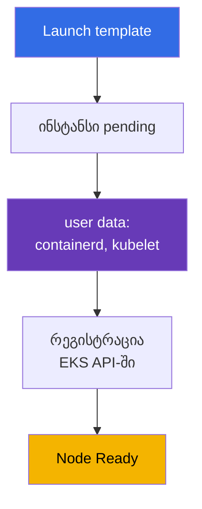
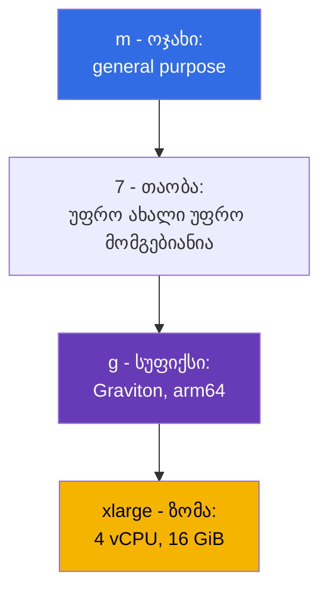
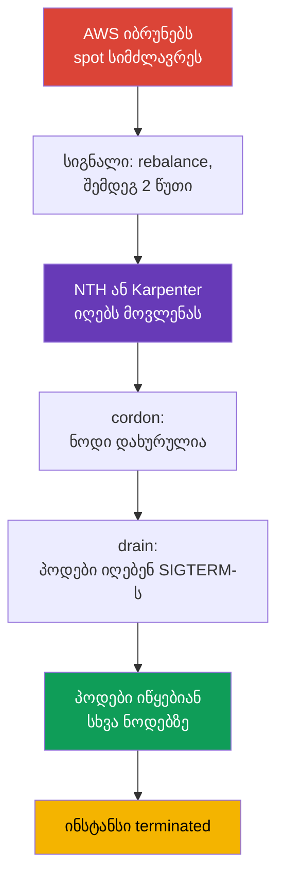

[Русская версия](ru.md) · [Eng version](en.md) · [Versión en español](es.md) · [Version française](fr.md) · [Deutsche Version](de.md) · [繁體中文版](tw.md) · [日本語版](jp.md)
# თავი 0.4. EC2 და გადახდის მოდელები: ინსტანსის ტიპები, AMI, on-demand, spot, Savings Plans

> **რა არის შემდეგ.** ანგარიშები, რეგიონები და AZ-ები უკვე გასაგებია (თავი 0.1), უფლებებს IAM ანიჭებს (თავი 0.2), მისამართები კი VPC-შია (თავი 0.3). დარჩა data plane-ის საფუძველი: EC2 ვირტუალური მანქანა. EKS ნოდი არის ინსტანსი კონკრეტული ტიპით, AMI-ით, დისკითა და ფასით, და კლასტერის სიმჭიდროვის, საიმედოობისა და ღირებულების თითქმის ყველა გადაწყვეტილება აქ მიიღება. განვიხილავთ EC2-ს ნოდებისთვის საჭირო მოცულობით და მაშინვე დავაკავშირებთ ფასს: on-demand, spot, Savings Plans, Graviton.

## 0.4.1. EC2 ინსტანსი, როგორც კლასტერის ნოდი

**EC2 ინსტანსი** არის ვირტუალური მანქანა: ტიპი (რამდენი vCPU და მეხსიერება აქვს), AMI (რა ჩაიტვირთება), ქვექსელი და security group (თავი 0.3), IAM instance profile (ინსტანსის როლი, თავი 0.2) და დისკები. Kubernetes ნოდი არის ასეთი ინსტანსი, რომელზეც გაშვებისას იწყება containerd და kubelet, შემდეგ კი kubelet რეგისტრირდება API სერვერზე. რეგისტრაციის მთავარი რგოლია **user data**: კონფიგურაცია, რომელიც ინსტანსს გაშვებისას გადაეცემა და kubelet-ის დაწყებამდე სრულდება; მასშია კლასტერის სახელი, API სერვერის endpoint, CA სერტიფიკატი და kubelet-ის არგუმენტები (labels, taints, `--max-pods`). AL2023-ში ეს არის cloud-init `NodeConfig` სექციით, Bottlerocket-ში კი TOML (თავები 10 და 45).



სიცოცხლის ციკლი: `pending` -> `running` (ფასიანია) -> `stopped` (იხდით მხოლოდ EBS-ისთვის) -> `terminated` (შეუქცევადია). ნოდებისთვის `stopped` არ გამოიყენება: ნოდს არ არემონტებენ, არამედ **ცვლიან**, ამიტომ მასზე მონაცემები ეფემერულია, ხოლო AMI-ის ან ტიპის შეცვლა ხელახლა შექმნას ნიშნავს.

**IMDS (Instance Metadata Service)** არის ლოკალური endpoint `169.254.169.254`, სადაც ინსტანსი იგებს საკუთარ ID-ს, რეგიონს, AZ-ს, ტიპს და იღებს **თავისი IAM როლის დროებით credentials-ს**. მათ იქიდან იღებენ kubelet, VPC CNI და aws-node. მეორე მხარეა ის, რომ ჩვეულებრივ პოდსაც შეუძლია IMDS-მდე მისვლა და **ნოდის როლის credentials-ის აღება**, რომელსაც ECR-ის წაკითხვა და ENI-ების მართვა შეიძლება შეეძლოს. ამიტომ IMDSv2 სავალდებულოა, hop limit არის 1, ხოლო პოდების უფლებები გაიცემა IRSA-ით ან Pod Identity-ით (თავები 16-19).

```bash
# IMDSv2: ჯერ ტოკენი, შემდეგ მეტამონაცემების მოთხოვნა (v1 ტოკენის გარეშე უკვე ითიშება)
TOKEN=$(curl -sX PUT "http://169.254.169.254/latest/api/token" \
  -H "X-aws-ec2-metadata-token-ttl-seconds: 21600")
curl -s -H "X-aws-ec2-metadata-token: $TOKEN" \
  http://169.254.169.254/latest/meta-data/instance-id
# მოითხოვეთ IMDSv2 და პოდებისთვის მეტამონაცემები დახურეთ
aws ec2 modify-instance-metadata-options --instance-id i-0123456789abcdef0 \
  --http-tokens required --http-put-response-hop-limit 1
```

## 0.4.2. ოჯახები და ზომები: როგორ იკითხება t3.medium და m7g.xlarge

ტიპის სახელი ბრენდი კი არა, აღწერაა. `m7g.xlarge` ნაწილებად იშლება:



ზომები ფასით თითქმის ხაზოვნად იზრდება: `large`, `xlarge`, `2xlarge`, `4xlarge`, `8xlarge`; `2xlarge` ორჯერ ძვირია `xlarge`-ზე და ორჯერ მეტი რესურსი აქვს, ამიტომ არჩევანი „ორი `xlarge` თუ ერთი `2xlarge`“ საიმედოობისა და სიმჭიდროვის საკითხია და არა ფასის (სექცია 0.4.8). სუფიქსები: `g` - Graviton (arm64), `i` - Intel, `a` - AMD, `d` - ლოკალური NVMe, `n` - გაძლიერებული ქსელი.

| ოჯახი | კლასი | თანაფარდობა | კლასტერის გამოყენება |
|-------|-------|-------------|----------------------|
| `t3`, `t4g` | burstable | 1:2 / 1:4 | dev კლასტერები და სწავლება, არა prod ნოდები |
| `m5`, `m6i`, `m7g` | general purpose | 1 vCPU : 4 GiB | ნოდები ნაგულისხმევად, სისტემური add-on-ები |
| `c6i`, `c7g` | compute optimized | 1 vCPU : 2 GiB | CI runner-ები, დამუშავება, კოდეკები |
| `r6i`, `r7g` | memory optimized | 1 vCPU : 8 GiB | JVM, ქეშები, ანალიტიკა |
| `i4i`, `im4gn` | storage optimized | ლოკალური NVMe | Kafka, Elasticsearch, დისკზე არსებული ქეშები |
| `g5`, `p5` | accelerated | GPU | ML ინფერენსი და სწავლება, საკუთარი taint-ები |

**ARM x86-ის წინააღმდეგ.** Graviton არის arm64 და აქ ორი რამაა მნიშვნელოვანი. პირველი: იმიჯები უნდა არსებობდეს arm64-ისთვის, თორემ პოდი `exec format error`-ით დაეცემა; საჯარო იმიჯები ჩვეულებრივ multi-arch-ია, საკუთარი კი ეწყობა `docker buildx --platform linux/amd64,linux/arm64`-ით. მეორე: შერეული კლასტერი მუშაობს, მაგრამ დატვირთვები `kubernetes.io/arch`-ით იყოფა nodeSelector-ის ან affinity-ის მეშვეობით.

**T სერიის ხაფანგი.** `t3` და `t4g` არის **burstable**: საბაზისოდ მათ ეკუთვნით vCPU-ის წილი (`t3.medium`-ზე თითო ბირთვზე 20%), ხოლო ზემოთ ყველაფერი მოდის **CPU credits**-იდან, რომლებიც უქმე რეჟიმში გროვდება. დატვირთვისას კრედიტები იწურება, ინსტანსი საბაზისო დონემდე ნელდება (ან დამატებით იხდით `unlimited` რეჟიმში), kubelet და CNI ჭედავს, ნოდი `NotReady`-ში ფლაპავს, მიზეზი კი `kubectl describe`-ში არ ჩანს.

## 0.4.3. რამდენი პოდი ეტევა ინსტანსზე

VPC CNI-ით (ნაგულისხმევი რეჟიმი) **თითოეული პოდი იღებს ნამდვილ IP-ს VPC ქვექსელიდან**, მისამართები კი ENI-ით, ინსტანსის ქსელური ინტერფეისებით გაიცემა. ENI-ების და თითო ENI-ზე IP-ების რაოდენობა ტიპისთვის ფიქსირებულია, ამიტომ სიმჭიდროვეს ინსტანსის ზომა მართავს: `max-pods = ENI * (IP თითო ENI-ზე - 1) + 2`.

| ტიპი | ENI | IP თითო ENI-ზე | სავარაუდო max-pods |
|-----|-----|----------------|--------------------|
| `t3.small` | 3 | 4 | 11 |
| `m5.large` | 3 | 10 | 29 |
| `m5.4xlarge` | 8 | 30 | 234 |

პატარა ინსტანსებზე პოდების ჭერს CPU-სა და მეხსიერების ამოწურვამდე ეჯახებით, ხოლო სისტემური პოდები (aws-node, kube-proxy, CSI დრაივერები, ლოგების აგენტი) სლოტებს **ყოველ** ნოდზე იკავებს: `t3.small`-ზე მხოლოდ 6-7 ადგილი რჩება. ლიმიტს prefix delegation ზრდის (თავი 7), სიმჭიდროვე კი განხილულია თავში 14.

```bash
# შეადარეთ ტიპების სიმჭიდროვე: ENI და ინტერფეისზე IP-ების რაოდენობა
aws ec2 describe-instance-types --instance-types t3.medium m5.xlarge m7g.2xlarge \
  --query 'InstanceTypes[].[InstanceType,NetworkInfo.MaximumNetworkInterfaces,
    NetworkInfo.Ipv4AddressesPerInterface]' --output table
```

## 0.4.4. AMI: იმიჯი, საიდანაც ნოდი იწყება

**AMI (Amazon Machine Image)** არის დისკის შაბლონი, საიდანაც ინსტანსი იწყება. ნოდებისთვის „უბრალო Linux“-ს არ იყენებენ: AWS აქვეყნებს **EKS-ოპტიმიზებულ AMI**-ებს containerd-ით, საჭირო მინორული ვერსიის kubelet-ით, CNI plugin-ით და bootstrap ლოგიკით. ვარიანტებია **Amazon Linux 2023** (ჩვეულებრივი დისტრიბუცია, `dnf`, ნაცნობი გამართვა), **Bottlerocket** (მინიმალური OS კონტეინერებისთვის, read-only root, განახლება მთლიან იმიჯად), **Windows** და მოძველებული **AL2**. პირველ ორს შორის განსხვავება ინციდენტისას იგრძნობა: Bottlerocket-ში არც ნაცნობი shell არის, არც პაკეტების მენეჯერი, და ნოდზე SSH-ით შესვლა მხოლოდ „ლოგების სანახავად“ ვერ მოხერხდება - გამართვა სტანდარტული control- და admin-კონტეინერებით ან SSM Session Manager-ით მიდის (თავები 10 და 45).

მთავარი თვისებაა: **AMI მიბმულია Kubernetes-ის მინორულ ვერსიაზე**. `1.33`-ის იმიჯი `1.34` კლასტერიში არ დგება - kubelet-ს API სერვერთან ვერსიების დაშორების შეზღუდვა აქვს, ამიტომ კლასტერის განახლება AMI-ის განახლებასაც მოიცავს. ID დამოკიდებულია ვერსიაზე, რეგიონზე, არქიტექტურასა და ვარიანტზე და SSM-დან მიიღება:

```bash
# EKS-ოპტიმიზებული AL2023-ის ID 1.33-ისთვის (Graviton-ისთვის - arm64 x86_64-ის ნაცვლად,
# Bottlerocket-ისთვის - /aws/service/bottlerocket/aws-k8s-1.33/x86_64/latest/image_id)
aws ssm get-parameter --region eu-central-1 \
  --name /aws/service/eks/optimized-ami/1.33/amazon-linux-2023/x86_64/standard/recommended/image_id \
  --query Parameter.Value --output text
```

AMI ისეთივე სასიცოცხლო ციკლის ობიექტია, როგორც კლასტერის ვერსია: AWS რეგულარულად უშვებს build-ებს kernel patch-ებითა და დახურული CVE-ებით, ხოლო „ნოდი ნახევარი წელია ძველ იმიჯზეა“ სტაბილურობა კი არა, ვალია. managed node group-ში განახლება სტანდარტულია, rolling replacement-ით (თავი 10), მიმდევრობა კი თავში 38-ა.

## 0.4.5. ნოდის დისკები: root EBS ტომი, gp3 და ლოკალური NVMe

ნოდს აქვს **root EBS ტომი** - ქსელური ბლოკური დისკი OS-ით, კონტეინერის იმიჯებით, containerd ფენებითა და პოდების ეფემერული საცავით (`emptyDir`, ლოგები). ზომა და ტიპი launch template-ში განისაზღვრება და ხშირად ავიწყდებათ: პატარა ტომი იმიჯებით ივსება, kubelet ჩართავს **disk pressure**-ს, პოდებს გამოაძევებს და ქეშს გაასუფთავებს. ნოდებისთვის იყენებენ `gp3`-ს: IOPS და გამტარუნარიანობა ზომისგან დამოუკიდებლად რეგულირდება და ის `gp2`-ზე იაფია.

**Instance store** არის ლოკალური NVMe `d` სუფიქსის მქონე ტიპებზე (`m6id`, `c6gd`) და storage optimized ტიპებზე (`i4i`, `im4gn`). სწრაფია და ინსტანსის ფასში შედის, მაგრამ **ეფემერულია**: მონაცემები ინსტანსის შეცვლისას ქრება, რაც spot ნოდებზე რეგულარული მოვლენაა. გამოდგება build cache-ისა და scratch-ისთვის; მუდმივი მონაცემები მხოლოდ EBS ან EFS-ზეა.

თავი 0.1-დან მნიშვნელოვანი შედეგია: **EBS ტომი ერთ AZ-ში ცხოვრობს** და მხოლოდ იმავე ზონის ინსტანსს უერთდება, ამიტომ PVC-იანი პოდი თავისი ტომის ზონასაა მიბმული; თუ autoscaler სხვა AZ-ში ნოდს წამოჭრის, პოდი `Pending`-ში დარჩება. აქედან მოდის `WaitForFirstConsumer` და shared storage - თავი 23.

## 0.4.6. Auto Scaling group და launch template

ნოდებს თითო-თითოდ არ ქმნიან. მუშაობს EC2-ის ორი ობიექტი:

- **Launch template** - ვერსიონირებადი გაშვების შაბლონი: AMI, ტიპი (ან ტიპების სია), security groups, IAM instance profile, root ტომის ზომა და ტიპი, user data, IMDS პარამეტრები, ტეგები.
- **Auto Scaling group (ASG)** - ინსტანსების ჯგუფი, რომელიც მითითებულ მანქანების რაოდენობას (`min`, `desired`, `max`) ინარჩუნებს სხვადასხვა AZ-ის ქვექსელებში, ცვლის ჩავარდნილებს და ურევს on-demand-სა და spot-ს.

**EKS managed node group არის ASG პლუს launch template**, რომლებსაც EKS სერვისი მართავს: თავად ქმნის, ტეგებს სვამს, განახლებისას შეუძლია drain და იცის spot შეწყვეტების შესახებ. აქედან მოდის საათების დამზოგავი წესი: **managed node group-ის ASG ხელით არ შეცვალოთ** - შეცვალეთ node group-ის პარამეტრები ან თქვენი launch template-ის ვერსია. გამოთვლის ვარიანტები (managed, self-managed, Fargate, Auto Mode) თავში 9 არის შედარებული, bootstrap-ის მორგება - თავში 10, Karpenter კი ინსტანსებს პირდაპირ, ASG-ის გარეშე ქმნის და ამიტომ უფრო სწრაფად რეაგირებს (თავები 11 და 12).

```bash
# ნოდების ჯგუფების მასშტაბირების საზღვრები და გაშვების შაბლონის უახლესი ვერსიის შიგთავსი
aws autoscaling describe-auto-scaling-groups --query 'AutoScalingGroups[].[
  AutoScalingGroupName,MinSize,DesiredCapacity,MaxSize]'
aws ec2 describe-launch-template-versions --launch-template-id lt-0123456789abcdef0 \
  --versions '$Latest' --query 'LaunchTemplateVersions[].LaunchTemplateData'
```

კიდევ ერთი გაშვების ატრიბუტი, რომლის ცოდნაც წინასწარ ღირს, არის **placement group**. ნაგულისხმევად EC2 ინსტანსებს სხვადასხვა აპარატურაზე ანაწილებს, რათა კორელირებული ავარიები შეამციროს, და უმეტეს შემთხვევაში ეს სწორია. ჩარევა საჭიროა, როცა დატვირთვა ნოდებს შორის დაყოვნებისადმი ძალიან მგრძნობიარეა, ან თავად შეუძლია მონაცემების რეპლიკაცია და უნდა იცოდეს, რომ რეპლიკები სხვადასხვა rack-ზე დგას. ჯგუფის შექმნა უფასოა; სტრატეგია ოთხია (ზუსტი დროისთვის არის precision time-ც), კლასტერებისთვის კი სამი მათგანია საინტერესო:

| სტრატეგია | რას აკეთებს | ტიპური დატვირთვა | მნიშვნელოვანი შეზღუდვა |
|-----------|------------|------------------|-------------------------|
| `cluster` | ინსტანსებს ერთ AZ-ში ახლოს აწყობს, მინიმალური დაყოვნება | HPC, განაწილებული მოდელების სწავლება | მთელი ჯგუფისთვის ერთი AZ; ტიპების შერევა სიმძლავრის პოვნის შანსს ამცირებს |
| `partition` | სხვადასხვა partition rack-ებს არ იზიარებს, თითო AZ-ზე 7 partition-მდე | Cassandra, HDFS, HBase, Kafka | ინსტანსების რაოდენობა მხოლოდ ანგარიშის ლიმიტებით იზღუდება |
| `spread` | ყოველი ინსტანსი ცალკე აპარატურაზეა | რამდენიმე კრიტიკული ნოდი | მკაცრად **7 მოქმედი ინსტანსი თითო AZ-ზე** თითო ჯგუფისთვის |

სამი ხაფანგი სწორედ კლასტერებში ჩნდება. პირველი: `spread` პლუს ავტომასშტაბირება ნიშნავს, რომ AZ-ში მერვე ნოდი უბრალოდ არ გაეშვება, Karpenter ან ASG კი უარყოფას შეხვდება, რაც სიმპტომით სიმძლავრის ნაკლებობას ჰგავს. მეორე: თუ შესაფერისი უნიკალური აპარატურა არ არის, მოთხოვნა **ვარდება** და რიგში არ დგება, ამიტომ ჯგუფს სავალდებულოდ არ იყენებენ იმ ნოდებისთვის, რომელთა გარეშეც კლასტერი ვერ მუშაობს. მესამე: `cluster` განმარტებით ყველა ნოდს ერთ AZ-ში ტოვებს, რაც სამზონიან განლაგებას ეწინააღმდეგება (თავი 40), ამიტომ ის გამოიყენეთ ცალკე NodePool-ისთვის და არა მთელი კლასტერისთვის. ცალკე, spot ინსტანსი, რომელიც ჩამორთმევისას stop ან hibernate-ზეა დაყენებული, placement group-ში ვერ გაეშვება (თავი 13).

ეს self-managed ნოდებისა და managed node group-ებისთვის launch template-ში განისაზღვრება. EKS Auto Mode-ში ამისთვის `NodeClass`-ში `placementGroupSelector` ველია, Karpenter-საც შეუძლია placement group-ში ნოდების გაშვება - დეტალები თავებში 9 და 12 არის.

## 0.4.7. გადახდის მოდელები: on-demand, spot, Savings Plans, Graviton

**On-demand** არის მუშაობის წამებზე გადახდა ფასების სიით, ვალდებულებების გარეშე: შედარების ბაზა და ნაგულისხმევი ვარიანტი.

**Spot** არის თავისუფალი სიმძლავრე, ჩვეულებრივ 60-90% ფასდაკლებით. ფასი საკუთარია თითოეული ტიპისა და AZ-ისთვის, ხოლო ინსტანსი AWS-ს შეუძლია **შეწყვიტოს**, როცა სიმძლავრე დასჭირდება: შეტყობინება IMDS-ითა და EventBridge-ით მოდის და გეძლევათ **ორი წუთი**. Kubernetes ამას მშვიდად გადაიტანს, თუ დატვირთვები მზადაა: NodeTerminationHandler ან Karpenter იჭერს მოვლენას, ნოდს `NoSchedule`-ით მონიშნავს და drain-ს აკეთებს. განსხვავებაა, საიდან მოდის სიგნალი: თვით ნოდიდან IMDS-ით ან ცენტრალიზებულად, როდესაც EventBridge მოვლენებს SQS რიგში ათავსებს და კონტროლერი კითხულობს. მეორე გზა არის Karpenter-ის prod ვარიანტი: ის კონკრეტული ნოდის ცოცხალ მდგომარეობაზე არ არის დამოკიდებული (თავები 12 და 13).



მთელი ჯაჭვი 120 წამში უნდა ჩაეტიოს და ეს რეკომენდაცია კი არა, ფიზიკური deadline-ია: ვადის გასვლისას ინსტანსი ქრება, მიუხედავად იმისა, დასრულდა თუ არა თქვენი პოდები. ამიტომ spot ნოდებზე PDB და აპლიკაციაში SIGTERM-ის სწორი დამუშავება კონფიგურაციის სავალდებულო ნაწილია (თავი 40).

**Savings Plans** და **Reserved Instances** არის ფასდაკლებები ფიქსირებული თანხის დახარჯვის (ან კონკრეტული ინსტანსების ქონის) ვალდებულებისთვის **1 ან 3 წლის** განმავლობაში. Savings Plans ორი სახისაა და მათი განსხვავება მნიშვნელოვანია EC2 + Fargate ჰიბრიდისთვის (თავები 9 და 15). **Compute Savings Plans** ყველაზე მოქნილია: ფასდაკლება ვრცელდება EC2-ზე, Fargate-სა და Lambda-ზე ოჯახიდან, ზომიდან, რეგიონიდან და OS-დან დამოუკიდებლად, ამიტომ `m6i`-დან `m7g`-ზე გადასვლა ან ნოდებიდან დატვირთვის ნაწილის Fargate-ზე გადატანა მას არ არღვევს. **EC2 Instance Savings Plans** უფრო დიდ ფასდაკლებას იძლევა, მაგრამ ფარავს მხოლოდ EC2-ს და ერთ ოჯახს ერთ რეგიონში (მაგალითად, `m7g` eu-central-1-ში), მის შიგნით მოქნილია ზომით, AZ-ითა და OS-ით, Fargate-ზე კი არ მოქმედებს. RI ტიპსა და ზონაზეა მიბმული და ნოდებისთვის იშვიათად ირჩევენ. ვალდებულება მოხმარების **ქვედა ზღვარზე** გამოთვალეთ, პიკები კი spot-ით დაფარეთ. **Graviton** გადახდის მოდელი კი არა, ეკონომიის ცალკე წყაროა.

GPU სწავლებისა და დიდი ML job-ებისთვის არის **EC2 Capacity Blocks for ML**: P-ოჯახისა და Trainium ინსტანსების სიმძლავრის ჯავშანი მომავალი თარიღისთვის, ერთი დღიდან ნახევარ წლამდე ვადით, რვა კვირით ადრე და გარანტირებული ხელმისაწვდომობით. ეს დეფიციტური ამაჩქარებლების რეზერვია და არა ფასდაკლება: ასეთ ჯავშანზე ნოდებს სასრული სასწავლო ფანჯრისთვის ქმნიან და მუდმივად არ ტოვებენ (თავი 9).

| მოდელი | ფასდაკლება | რისკი | კლასტერის ნოდებისთვის |
|--------|-----------|-------|------------------------|
| **On-demand** | არა | არა | სისტემური ნოდები, კონტროლერები, კლასტერის ბაზები |
| **Spot** | 60-90% | შეწყვეტა ორ წუთში | stateless სერვისები, CI, batch, რიგები |
| **Compute SP** | უფრო მოქნილი | 1-3 წლის ვალდებულება, EC2+Fargate+Lambda | პროგნოზირებადი ბაზა, ჰიბრიდი |
| **EC2 Instance SP** | უფრო ღრმა | ვალდებულება ოჯახისადმი რეგიონში | სტაბილური ნოდების პროფილი |
| **Reserved Instances** | 30-70% | ტიპსა და ზონაზე მიბმული | იშვიათი ნოდების პროფილები |
| **Capacity Blocks** | სიმძლავრის ჯავშანი | ჯავშნის ფანჯარა და თარიღი | GPU და Trainium სწავლებისთვის |
| **Graviton** | 15-40% | საჭიროა arm64 იმიჯები | ყველაფერი, რაც multi-arch-ად ეწყობა |

```bash
# Spot ფასები ტიპებისა და ზონების მიხედვით ბოლო საათისთვის: დივერსიფიკაციის საფუძველი
aws ec2 describe-spot-price-history --product-descriptions "Linux/UNIX" \
  --instance-types m7g.xlarge m6i.xlarge c7g.xlarge \
  --start-time "$(date -u -d '1 hour ago' +%Y-%m-%dT%H:%M:%S)" \
  --query 'SpotPriceHistory[].[InstanceType,AvailabilityZone,SpotPrice]' --output table
# რეკომენდაცია Compute Savings Plans-ისთვის ერთი წლით ფაქტობრივი მოხმარების საფუძველზე
aws ce get-savings-plans-purchase-recommendation --savings-plans-type COMPUTE_SP \
  --term-in-years ONE_YEAR --payment-option NO_UPFRONT --lookback-period-in-days SIXTY_DAYS
```

ტიპური prod მიქსია: ბაზისური სიმძლავრე on-demand-ზე Savings Plans-ით, ყველა ელასტიური ნაწილი ფართო ტიპების სიით spot-ზე და, სადაც შესაძლებელია, Graviton-ზე (თავები 13 და 43).

## 0.4.8. ნოდების ზომის არჩევა: ბევრი პატარა თუ რამდენიმე დიდი

CPU-სა და მეხსიერების ერთნაირ მოცულობას ათი `m7g.large` ან წყვილი `m7g.4xlarge` იძლევა:

- **აფეთქების რადიუსი.** პატარა ნოდის დაკარგვა თითქმის შეუმჩნეველია, დიდი კი დატვირთვების დიდ ნაწილს მიაქვს.
- **სისტემური პოდების overhead.** aws-node, kube-proxy, CSI დრაივერები და ლოგების აგენტები რესურსებს **ყოველ** ნოდზე მოიხმარენ: რაც მეტი ნოდია, მით ნაკლებია სასარგებლო წილი.
- **პოდების ლიმიტი.** პატარა ინსტანსებზე max-pods-ს ეჯახებით, როცა CPU და მეხსიერება უქმადაა; 8 GiB მოთხოვნის მქონე პოდი `large`-ზე საერთოდ ვერ დაეტევა.
- **მასშტაბირების ნაბიჯი.** პატარა ნოდი უფრო სწრაფად იწყება და სიმძლავრეს პატარა ნაწილებით ამატებს; დიდი უხეშ და ძვირ ნაბიჯს იძლევა, სამაგიეროდ შეფუთვაზე ნაკლები იკარგება.

გონივრული შუა გზაა `xlarge` - `4xlarge` ნოდები, რამდენიმე თითო AZ-ში, პროფილები კი NodePool-ითაა გაყოფილი.

ცალკე spot-ის შესახებ: **ერთგვაროვანი ინსტანსების ნაკრები spot ნოდების მთავარი მტერია**. თუ ჯგუფი მხოლოდ `m6i.2xlarge`-ს უშვებს, ამ ტიპის სიმძლავრის ჩამორთმევა ამ AZ-ში ყველა ნოდს ერთდროულად აგდებს და PDB ვერ დაგეხმარებათ. სწორია სამი AZ-ის ფარგლებში სხვადასხვა ოჯახისა და თაობის 10-20 თავსებადი ტიპი: მაშინ შეწყვეტები თითო-თითო ნოდზე მოვა და კლასტერი მათ ვერც შეამჩნევს (თავი 12).

ტიპების სიის მიცემა საკმარისი არ არის - მნიშვნელოვანია, **როგორ შეირჩევა მისგან pool**. `lowest-price` ყველაზე იაფ pool-ებს იღებს და ამიტომ უფრო ხშირად წყდება; `capacity-optimized` ყველაზე დიდი სიმძლავრის მარაგის pool-ებს ირჩევს და ჩამორთმევებს ამცირებს; `capacity-optimized-prioritized` იმავეს აკეთებს, მაგრამ best-effort პრინციპით იცავს მითითებულ ტიპების პრიორიტეტს (სჭირდება launch template). ნოდებისთვის იყენებენ capacity-ზე ორიენტირებულ სტრატეგიებს და არა `lowest-price`-ს, Karpenter კი ნაგულისხმევად `price-capacity-optimized`-ს იყენებს, ფასსა და სიმძლავრის მარაგს შორის ბალანსით (თავი 13).

## 0.4.9. როგორ გამოიყენება ეს prod-ში

- **ნოდების ორი პროფილი.** მცირე on-demand ჯგუფი სისტემური add-on-ებისთვის (CoreDNS, კონტროლერები, მეტრიკები) და spot სიმძლავრე აპლიკაციებისთვის: სისტემური კომპონენტები spot-ზე კასკადურ ინციდენტებს იწვევს.
- **ოჯახების მიხედვით გაყოფა.** `m` ზოგადისთვის, `c` CI-სა და დამუშავებისთვის, `r` JVM-ისა და ქეშებისთვის, GPU ნოდებს საკუთარი taint-ები. ერთი უნივერსალური ტიპი ყველაფრისთვის ზედმეტ გადახდას ნიშნავს.
- **Graviton ნაგულისხმევად.** ახალ სერვისებს თავიდანვე multi-arch-ად აწყობენ, ძველებს კი იმიჯების მზადყოფნისას გადაჰყავთ: ეს ყველაზე მარტივი ეკონომიაა არქიტექტურის შეცვლის გარეშე. იმიჯის ID-ს SSM-დან იღებენ, AMI-ის განახლებას კლასტერის განახლებასთან ერთად გეგმავენ (თავები 10 და 38), Savings Plans-ის დაფარვას კი კვარტალში ერთხელ გადახედავენ (თავი 43).

## 0.4.10. მინი-გლოსარიუმი

- **EC2 ინსტანსი** - ვირტუალური მანქანა; EKS-ისთვის ეს containerd-ითა და kubelet-ით აღჭურვილი ნოდია.
- **User data** - კონფიგურაცია, რომელიც ინსტანსის გაშვებისას სრულდება; მასში ნოდის bootstrap-ია.
- **IMDS** - მეტამონაცემების სერვისი `169.254.169.254`-ზე; აბრუნებს ინსტანსის მონაცემებსა და IAM როლის დროებით credentials-ს. prod-ში მხოლოდ IMDSv2 გამოიყენეთ hop limit 1-ით.
- **ინსტანსის ტიპი** - `ოჯახი + თაობა + სუფიქსი . ზომა`, მაგალითად `m7g.xlarge`. **Graviton** არის AWS-ის arm64 პროცესორები (`g` სუფიქსი), რომლებიც multi-arch იმიჯებს მოითხოვს.
- **Burstable (T სერია)** - CPU-ის საბაზისო წილი პლუს **CPU credits**; prod ნოდებისთვის არ გამოდგება. **max-pods** - პოდების ზღვარი ნოდზე, VPC CNI-ში დამოკიდებულია ENI-ებისა და თითო ENI-ზე IP-ების რაოდენობაზე.
- **AMI** - ინსტანსის გაშვების იმიჯი; AL2023 და Bottlerocket მიბმულია Kubernetes-ის მინორულ ვერსიაზე. **EBS / instance store** - ქსელური ტომი ერთ AZ-ში / ეფემერული ლოკალური NVMe.
- **Launch template / Auto Scaling group** - ვერსიონირებადი გაშვების შაბლონი / ინსტანსების ჯგუფი `min`, `desired`, `max` პარამეტრებით AZ ქვექსელებში.
- **Placement group** - ინსტანსების განლაგების მართვა: `cluster` (ახლოს, მინიმალური დაყოვნება, ერთი AZ), `partition` (სხვადასხვა rack partition-ებით, თითო AZ-ზე 7-მდე), `spread` (თითოეული ცალკე აპარატურაზე, არა უმეტეს 7 მოქმედი თითო AZ-ზე).
- **On-demand / Spot** - ფაქტობრივი გადახდა / ფასდაკლებული სიმძლავრე ორ წუთში შეწყვეტით. **Savings Plans / RI** - 30-70% ფასდაკლება 1 ან 3 წლის ვალდებულებისთვის.
- **Compute SP / EC2 Instance SP** - მოქნილი გეგმა (EC2, Fargate, Lambda) / უფრო ღრმა, მაგრამ ერთ რეგიონში ერთ ოჯახზე შეზღუდული. **Capacity Blocks** - GPU/Trainium სიმძლავრის ჯავშანი სწავლებისთვის.
- **Spot სტრატეგია** - როგორ აირჩევა pool: `capacity-optimized(-prioritized)` `lowest-price`-ის წინააღმდეგ; capacity-ზე ორიენტირებული სტრატეგიები იშვიათად წყდება.

## 0.4.11. თავის შეჯამება

- EKS ნოდი არის EC2 ინსტანსი: launch template განსაზღვრავს AMI-ს, ტიპს, SG-სა და user data-ს, user data იწყებს kubelet-ს, kubelet კი კლასტერიში რეგისტრირდება. ნოდები ერთჯერადია და იცვლება.
- IMDS გასცემს ნოდის როლის credentials-ს, ამიტომ IMDSv2 და hop limit 1 სავალდებულოა, პოდების უფლებები კი IRSA-ით ან Pod Identity-ით გაიცემა (თავები 16, 17, 19).
- ტიპის სახელი ნაწილებად იკითხება: ოჯახი, თაობა, სუფიქსები (`g` - Graviton, `d` - ლოკალური NVMe), ზომა; CPU credits-იანი T სერია prod ნოდებისთვის არ გამოდგება. ზომა ENI-ებითა და IP-ებით პოდების რიცხვსაც განსაზღვრავს: პატარა ნოდები max-pods-ს რესურსების ამოწურვამდე ეჯახება (თავები 6, 7, 14).

- AMI მიბმულია Kubernetes-ის მინორულ ვერსიაზე, ID SSM-დან მიიღება, იმიჯის განახლება კი კლასტერის სასიცოცხლო ციკლის ნაწილია (თავები 10 და 38).
- gp3 root ტომი უნდა დაასაიზოთ, instance store ეფემერულია, EBS ტომი ერთ AZ-ში ცხოვრობს და PVC-იან პოდს ამ ზონაზე აბამს (თავი 23). managed node group არის EKS-ის მიერ მართული ASG და launch template, მის ASG-ს კი ხელით არ ცვლიან (თავები 9 და 10).
- ნოდების ეკონომიკა: on-demand არის Savings Plans-ით დაფარული ბაზა, ფართო ტიპების დივერსიფიკაციით spot ემსახურება ელასტიურ ნაწილს, Graviton კი ეკონომიას აძლიერებს (თავები 13 და 43).

## 0.4.12. როგორ გამოგადგებათ ეს რეალურ მუშაობაში

ნოდებთან დაკავშირებული ინციდენტების ანალიზი EC2-ის დონეზე მიდის: რატომ არ გახდა ინსტანსი ნოდი (user data, IAM, SG), რატომ არ ეტევა პოდები (max-pods და არა CPU), რატომ გადავიდა ნოდი `NotReady`-ში (CPU credits ან root ტომზე ადგილი ამოიწურა), რატომ გაქრა ერთდროულად ნახევარი კლასტერი (ერთგვაროვანი spot ნოდები). იმავე დონეზე იმართება ფულიც: ოჯახი, Graviton, spot-ის წილი და Savings Plans-ის დაფარვა.

## 0.4.13. კითხვები თვითშემოწმებისთვის

1. რა უნდა მოხდეს ინსტანსზე, რომ ის კლასტერის ნოდი გახდეს და სად არის ეს აღწერილი?
2. რატომ სჭირდება kubelet-ს IMDS და რატომ არის hop limit 1 უსაფრთხოების პარამეტრი?
3. დაშალეთ `c7gd.2xlarge` ნაწილებად: რას ნიშნავს თითოეული?
4. რატომ არის `t3.medium` ცუდი არჩევანი prod ნოდისთვის?
5. გაქვთ `m5.large`, პოდები `Pending`-შია, CPU და მეხსიერება თავისუფალია. რას შეამოწმებთ პირველად?
6. რატომ არ ჰარდკოდავენ EKS-ოპტიმიზებული AMI-ის ID-ს და საიდან იღებენ მას?
7. რით განსხვავდება instance store EBS root ტომისგან და რა შეიძლება შეინახოთ მასზე?
8. რა არის managed node group EC2-ის ტერმინებით და რატომ არ ცვლიან მის ASG-ს ხელით?
9. რამდენ დროს გაძლევთ spot შეწყვეტა და რატომ არის საზიანო spot ნოდების ჯგუფი ერთი ინსტანსის ტიპით?
10. როდის არის Savings Plans spot-ზე უფრო მომგებიანი და როგორ აერთიანებენ ორივეს ერთ კლასტერიში?

## პრაქტიკა

ნაწილი 0-ს საკუთარი ლაბები არ აქვს: ეს არის საფუძველი დანარჩენი თავებისთვის. პრაქტიკა დაიწყება ნაწილში 1, როცა EKS კლასტერის შექმნით Terragrunt-ის მეშვეობით დაკავდებით, ნოდებს, spot-სა და Karpenter-ს კი ნაწილის 2 ლაბებში შეისწავლით. შემდეგ მოდის ხელსაწყოები: aws cli, eksctl, terraform და terragrunt, helm და plugins.

---
[სარჩევი](../README_GE.md) · [თავი 0.3](../00-3-vpc/ge.md) · [თავი 0.5](../00-5-tools/ge.md)
