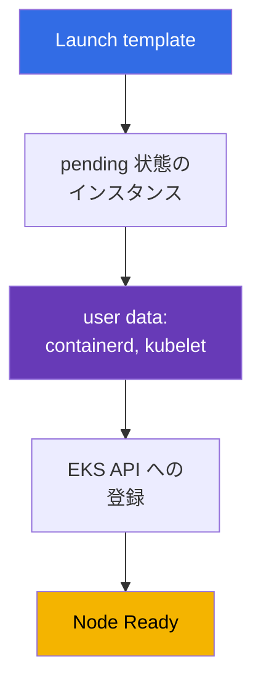
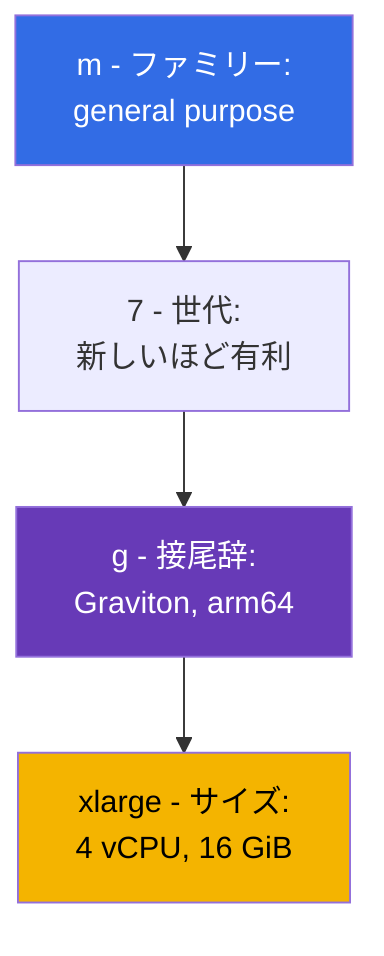
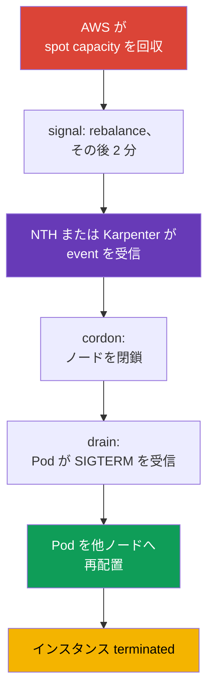

[Русская версия](ru.md) · [Eng version](en.md) · [Versión en español](es.md) · [Version française](fr.md) · [Deutsche Version](de.md) · [ქართული ვერსია](ge.md) · [繁體中文版](tw.md)
# 第 0.4 章. EC2 と料金モデル: インスタンスタイプ、AMI、on-demand、spot、Savings Plans

> **次に進む内容。** アカウント、リージョン、AZ は理解し (第 0.1 章)、権限は IAM が付与し (0.2)、アドレスは VPC にあります (0.3)。残るのは data plane を構成する仮想マシン EC2 です。EKS ノードは特定のタイプ、AMI イメージ、ディスク、料金を持つインスタンスであり、クラスターの密度、信頼性、コストに関するほとんどの判断はここで行われます。ノードに必要な範囲で EC2 を扱い、on-demand、spot、Savings Plans、Graviton の料金にもすぐ結び付けます。

## 0.4.1. クラスターノードとしての EC2 インスタンス

**EC2 インスタンス** は仮想マシンです。タイプ (vCPU とメモリの量)、AMI (起動するもの)、サブネットと security group (第 0.3 章)、IAM instance profile (インスタンスのロール、第 0.2 章)、ディスクを持ちます。Kubernetes ノードはそのようなインスタンスで、起動時に containerd と kubelet が立ち上がり、kubelet が API server に登録されます。登録の重要な要素は **user data** です。これはインスタンス起動時に渡され、kubelet の開始前に実行される設定で、クラスター名、API server endpoint、CA certificate、kubelet 引数 (labels、taints、`--max-pods`) が含まれます。AL2023 では `NodeConfig` セクションを持つ cloud-init、Bottlerocket では TOML です (第 10、45 章)。



ライフサイクルは `pending` -> `running` (課金対象) -> `stopped` (EBS のみを支払う) -> `terminated` (元に戻せない) です。ノードには `stopped` を使いません。ノードは修理するのではなく **置き換える** ため、そこにあるデータはエフェメラルで、AMI やタイプの変更は再作成になります。

**IMDS (Instance Metadata Service)** はローカル endpoint `169.254.169.254` です。インスタンスはここから自身の ID、リージョン、AZ、タイプを知り、**IAM ロールの一時的な credentials** を取得します。kubelet、VPC CNI、aws-node はここから取得します。反対に、通常の Pod も IMDS に到達でき、ECR の読み取りや ENI の管理を許可された **ノードロールの credentials を奪えます**。そのため IMDSv2 は必須で、hop limit は 1、Pod の権限は IRSA または Pod Identity で与えます (第 16-19 章)。

```bash
# IMDSv2: まずトークンを取得し、次にメタデータを要求する (トークンなしの v1 はすでに無効化される)
TOKEN=$(curl -sX PUT "http://169.254.169.254/latest/api/token" \
  -H "X-aws-ec2-metadata-token-ttl-seconds: 21600")
curl -s -H "X-aws-ec2-metadata-token: $TOKEN" \
  http://169.254.169.254/latest/meta-data/instance-id
# IMDSv2 を必須にし、Pod からメタデータを遮断する
aws ec2 modify-instance-metadata-options --instance-id i-0123456789abcdef0 \
  --http-tokens required --http-put-response-hop-limit 1
```

## 0.4.2. ファミリーとサイズ: t3.medium と m7g.xlarge の読み方

タイプ名はブランドではなく説明です。`m7g.xlarge` は次の要素に分かれます。



サイズの料金はほぼ線形に増えます。`large`、`xlarge`、`2xlarge`、`4xlarge`、`8xlarge` があり、`2xlarge` はリソースが 2 倍で `xlarge` の 2 倍の価格です。そのため「`xlarge` を 2 台か `2xlarge` を 1 台か」は価格ではなく、信頼性と密度の問題です (0.4.8 節)。接尾辞は `g` が Graviton (arm64)、`i` が Intel、`a` が AMD、`d` がローカル NVMe、`n` が強化ネットワークを意味します。

| ファミリー | クラス | 比率 | クラスターでの用途 |
|-----------|-------|-------------|--------------------------|
| `t3`, `t4g` | burstable | 1:2 / 1:4 | dev クラスターと学習用、prod ノードには不向き |
| `m5`, `m6i`, `m7g` | general purpose | 1 vCPU : 4 GiB | デフォルトノード、system addon |
| `c6i`, `c7g` | compute optimized | 1 vCPU : 2 GiB | CI runner、処理、codec |
| `r6i`, `r7g` | memory optimized | 1 vCPU : 8 GiB | JVM、cache、分析 |
| `i4i`, `im4gn` | storage optimized | ローカル NVMe | Kafka、Elasticsearch、ディスク上の cache |
| `g5`, `p5` | accelerated | GPU | ML inference と学習、専用 taint |

**ARM と x86。** Graviton は arm64 であり、二点に注意します。第一に、イメージが arm64 向けに存在しなければ Pod は `exec format error` で落ちます。public イメージは通常 multi-arch で、自前のものは `docker buildx --platform linux/amd64,linux/arm64` で作成します。第二に、混在クラスターは動きますが、workload は nodeSelector または affinity で `kubernetes.io/arch` によって振り分けます。

**T シリーズの落とし穴。** `t3` と `t4g` は **burstable** です。基本的には vCPU の一部だけが割り当てられ (`t3.medium` では core あたり 20%)、それ以上はアイドル時に蓄積する **CPU credits** から使います。負荷時に credit が尽きるとインスタンスは基本レベルまで遅くなり (または `unlimited` モードで追加料金となり)、kubelet と CNI が停止し、ノードは `NotReady` を繰り返しますが、理由は `kubectl describe` に現れません。

## 0.4.3. インスタンスに収容できる Pod 数

VPC CNI (デフォルトモード) では **各 Pod が VPC サブネットから実 IP を取得**し、アドレスはインスタンスの network interface である ENI を通じて割り当てられます。ENI 数と ENI あたりの IP 数はタイプごとに固定であるため、インスタンスタイプが密度を決めます。`max-pods = ENI * (IP per ENI - 1) + 2` です。

| タイプ | ENI | ENI あたりの IP | おおよその max-pods |
|-----|-----|-----------|--------------------|
| `t3.small` | 3 | 4 | 11 |
| `m5.large` | 3 | 10 | 29 |
| `m5.4xlarge` | 8 | 30 | 234 |

小さいインスタンスでは、CPU とメモリより先に Pod 上限へ達します。system Pod (aws-node、kube-proxy、CSI driver、logging agent) は **各** ノードの slot を占有するため、`t3.small` では 6-7 slot しか残りません。prefix delegation (第 7 章) が上限を増やし、第 14 章が密度を扱います。

```bash
# タイプの密度を比較する: ENI と interface あたりの IP 数
aws ec2 describe-instance-types --instance-types t3.medium m5.xlarge m7g.2xlarge \
  --query 'InstanceTypes[].[InstanceType,NetworkInfo.MaximumNetworkInterfaces,
    NetworkInfo.Ipv4AddressesPerInterface]' --output table
```

## 0.4.4. AMI: ノードが起動するイメージ

**AMI (Amazon Machine Image)** は、インスタンスを起動するディスクテンプレートです。ノードには単なる Linux を使いません。AWS は containerd、必要な minor version の kubelet、CNI plugin、bootstrap logic を含む **EKS optimized AMI** を公開しています。選択肢は **Amazon Linux 2023** (通常の distribution、`dnf`、慣れたデバッグ)、**Bottlerocket** (container 向けの最小 OS、read-only root、イメージ全体で更新)、**Windows**、非推奨になりつつある **AL2** です。最初の二つの違いは当番時に明らかです。Bottlerocket には通常の shell も package manager もなく、SSH でノードに入り「ログを見る」ことはできません。デバッグには標準の control / admin container または SSM Session Manager を使います (第 10、45 章)。

重要な性質は、**AMI が Kubernetes の minor version に結び付く**ことです。`1.33` 用イメージを `1.34` クラスターに入れることはできません。kubelet と API server の version gap には制限があるため、クラスター更新には AMI 更新も含まれます。ID は version、リージョン、architecture、variant に依存し、SSM から取得します。

```bash
# 1.33 用 EKS optimized AL2023 の ID (Graviton では x86_64 の代わりに arm64、
# Bottlerocket では /aws/service/bottlerocket/aws-k8s-1.33/x86_64/latest/image_id)
aws ssm get-parameter --region eu-central-1 \
  --name /aws/service/eks/optimized-ami/1.33/amazon-linux-2023/x86_64/standard/recommended/image_id \
  --query Parameter.Value --output text
```

AMI はクラスター version と同じライフサイクル対象です。AWS は kernel patch と修正済み CVE を含む build を定期的に公開するため、「半年間古いイメージのノード」は安定性ではなく負債です。managed node group では rolling replacement (第 10 章) による標準更新ができ、順序は第 38 章で扱います。

## 0.4.5. ノードディスク: EBS root volume、gp3、ローカル NVMe

ノードには **EBS root volume** があります。OS、container image、containerd layer、Pod のエフェメラル storage (`emptyDir`、log) 用の network block disk です。サイズとタイプは launch template で設定しますが、忘れられがちです。小さい volume は image で埋まり、kubelet は **disk pressure** を有効にし、Pod を evict して cache を掃除します。ノードには `gp3` を使います。IOPS と throughput はサイズに依存せず設定でき、`gp2` より安価です。

**Instance store** は、接尾辞 `d` のタイプ (`m6id`、`c6gd`) と storage optimized タイプ (`i4i`、`im4gn`) にあるローカル NVMe です。高速でインスタンス料金に含まれますが **エフェメラル** です。インスタンスの置き換えでデータは消え、spot ノードではそれが定期的に起きます。build cache と scratch には適しますが、永続データは EBS または EFS のみです。

第 0.1 章の重要な帰結は、**EBS volume は一つの AZ に存在**し、同じ zone のインスタンスにだけ接続できることです。そのため PVC を持つ Pod は volume の zone に縛られ、autoscaler が別 AZ にノードを起動しても Pod は `Pending` のままです。ここから `WaitForFirstConsumer` と shared storage が必要になります (第 23 章)。

## 0.4.6. Auto Scaling group と launch template

ノードを一台ずつ作成することはありません。二つの EC2 object を使います。

- **Launch template** は versioned launch template です。AMI、タイプ (またはタイプのリスト)、security groups、IAM instance profile、root volume のサイズとタイプ、user data、IMDS 設定、tag を含みます。
- **Auto Scaling group (ASG)** はインスタンス群です。異なる AZ の subnet で指定されたマシン数 (`min`、`desired`、`max`) を維持し、停止したものを置き換え、on-demand と spot を混在させます。

**EKS managed node group は ASG と launch template であり、EKS service が管理します。** EKS がこれらを作成し、tag を設定し、更新時に drain でき、spot interruption を認識します。これによりデバッグ時間を節約する規則が得られます。**managed node group の ASG を手作業で変更しない**ことです。node group parameter または独自の launch template version を変更します。compute option (managed、self-managed、Fargate、Auto Mode) は第 9 章、bootstrap customization は第 10 章で比較します。Karpenter は ASG なしでインスタンスを直接作成するため、より速く反応します (第 11、12 章)。

```bash
# node group の scaling 境界と、最新 launch template version の内容
aws autoscaling describe-auto-scaling-groups --query 'AutoScalingGroups[].[
  AutoScalingGroupName,MinSize,DesiredCapacity,MaxSize]'
aws ec2 describe-launch-template-versions --launch-template-id lt-0123456789abcdef0 \
  --versions '$Latest' --query 'LaunchTemplateVersions[].LaunchTemplateData'
```

事前に知っておくべきもう一つの launch attribute は **placement group** です。デフォルトでは EC2 が相関した障害を減らすため、インスタンスを異なる hardware に分散します。ほとんどの場合はそれで適切です。workload がノード間の遅延に非常に敏感な場合、または自分でデータを replica し replica が別 rack にあることを知る必要がある場合に介入します。group の作成は無料で、strategy は四つ (正確な時刻向けの precision time もあります) あり、クラスターで重要なのは三つです。

| 戦略 | 動作 | 典型的な workload | 直面する制約 |
|-----------|-----------|-------------------|-------------------------------|
| `cluster` | 一つの AZ 内で instance を近くに配置し、最小の遅延 | HPC、分散モデル学習 | group 全体で一つの AZ、タイプ混在は capacity を見つける可能性を下げる |
| `partition` | 異なる partition は rack を共有せず、AZ あたり最大 7 partition | Cassandra、HDFS、HBase、Kafka | instance 数は account limit のみで制限される |
| `spread` | 各 instance を別 hardware に置く | 少数の重要ノード | group あたり **AZ ごとに稼働 instance は 7 台まで** |

クラスターで特に現れる三つの罠があります。第一に、`spread` と autoscaling の組み合わせでは、zone の 8 台目のノードは起動せず、Karpenter または ASG は拒否に突き当たり、症状は capacity 不足のように見えます。第二に、適切な固有 hardware がなければ request は待機せず **失敗**します。そのためクラスターが生きるために必須のノードには group を必須にしません。第三に、`cluster` は定義上すべてのノードを一つの AZ に置くため、三つの zone への配置と矛盾します (第 40 章)。これはクラスター全体ではなく個別 NodePool 用です。spot についても、回収時に stop または hibernate を設定したインスタンスは placement group で起動できません (第 13 章)。

これは self-managed node と managed node groups では launch template に設定します。EKS Auto Mode には `NodeClass` の `placementGroupSelector` field があり、Karpenter も placement group 内にノードを起動できます。詳細は第 9、12 章で扱います。

## 0.4.7. 料金モデル: on-demand、spot、Savings Plans、Graviton

**On-demand** は commitment なしに定価で稼働秒数を支払うモデルです。比較の基準でありデフォルトです。

**Spot** は通常 60-90% 割引された余剰 capacity です。料金はタイプと AZ ごとに異なり、AWS が capacity を必要とするとインスタンスは **interrupt** されます。IMDS と EventBridge から通知が届き、**2 分間**が与えられます。workload の準備ができていれば Kubernetes はこれを問題なく処理します。NodeTerminationHandler または Karpenter が event を検出し、ノードを `NoSchedule` にして drain します。違いは signal の取得元です。ノード自身の IMDS から得るか、EventBridge が event を SQS queue に置き controller が読む集中方式です。後者が Karpenter の production 選択肢であり、特定ノードの生存に依存しません (第 12、13 章)。



この chain 全体は 120 秒以内に終わる必要があります。これは推奨ではなく物理的な deadline で、期限を過ぎると Pod が終わったかにかかわらずインスタンスは消えます。そのため spot ノードでは PDB とアプリケーションでの正しい SIGTERM 処理が必須設定です (第 40 章)。

**Savings Plans** と **Reserved Instances** は、固定額を支出する (または特定のインスタンスを維持する) **1 年または 3 年**の commitment に対する割引です。Savings Plans には二つの種類があり、EC2 + Fargate の混在では違いが重要です (第 9、15 章)。**Compute Savings Plans** は最も柔軟で、family、size、リージョン、OS に関係なく EC2、Fargate、Lambda に割引を適用します。そのため `m6i` から `m7g` への移行や、負荷の一部をノードから Fargate に移しても壊れません。**EC2 Instance Savings Plans** は割引が大きい一方、EC2 と一つのリージョンの一つの family (例: eu-central-1 の `m7g`) だけを対象にします。size、AZ、OS には柔軟ですが Fargate には適用されません。RI はタイプと zone に縛られるためノードにはあまり使いません。commitment は消費の **下限**で計算し、peak は spot で埋めます。**Graviton** は料金モデルではなく、別の節約源です。

GPU 学習と大規模 ML job には **EC2 Capacity Blocks for ML** があります。これは P-family と Trainium インスタンスの capacity を将来の日付に一日から半年まで、最大八週間先まで予約し、availability を保証します。これは不足しがちな accelerator の予約であり割引ではありません。この予約では学習の有限な window 向けにノードを起動し、常時保持はしません (第 9 章)。

| モデル | 割引 | リスク | クラスターの対象ノード |
|--------|------|------|------------------------|
| **On-demand** | なし | なし | system ノード、controller、クラスター内 database |
| **Spot** | 60-90% | 2 分で interruption | stateless service、CI、batch、queue |
| **Compute SP** | より柔軟 | 1-3 年の commitment、EC2+Fargate+Lambda | 予測可能な基盤、hybrid |
| **EC2 Instance SP** | より大きい | リージョン内 family への commitment | 安定した node profile |
| **Reserved Instances** | 30-70% | タイプと zone への固定 | まれな node profile |
| **Capacity Blocks** | capacity の予約 | 予約の window と日付 | 学習用 GPU と Trainium |
| **Graviton** | 15-40% | arm64 image が必要 | multi-arch で作れるすべて |

```bash
# 過去一時間のタイプと zone ごとの spot price: 多様化の基礎
aws ec2 describe-spot-price-history --product-descriptions "Linux/UNIX" \
  --instance-types m7g.xlarge m6i.xlarge c7g.xlarge \
  --start-time "$(date -u -d '1 hour ago' +%Y-%m-%dT%H:%M:%S)" \
  --query 'SpotPriceHistory[].[InstanceType,AvailabilityZone,SpotPrice]' --output table
# 実際の消費に基づく一年分の Compute Savings Plans 推奨
aws ce get-savings-plans-purchase-recommendation --savings-plans-type COMPUTE_SP \
  --term-in-years ONE_YEAR --payment-option NO_UPFRONT --lookback-period-in-days SIXTY_DAYS
```

典型的な production mix は、Savings Plans 下の on-demand を基盤 capacity とし、弾力的なすべてを幅広いタイプのリストを持つ spot に置き、可能な限り Graviton を使う形です (第 13、43 章)。

## 0.4.8. ノードの sizing: 多数の小型か少数の大型か

同じ CPU とメモリ量は、十台の `m7g.large` または二台の `m7g.4xlarge` で得られます。

- **Blast radius。** 小さいノード一台の喪失は目立ちませんが、大きなノードは workload の大きな部分を持ち去ります。
- **System Pod の overhead。** aws-node、kube-proxy、CSI driver、logging agent は **各** ノードで resource を使います。ノードが多いほど有効な比率は小さくなります。
- **Pod 上限。** 小さなインスタンスでは max-pods に達し、CPU とメモリは idle のままです。8 GiB を request する Pod は `large` にはまったく入りません。
- **Scaling step。** 小さいノードはより速く起動し、少しずつ capacity を加えます。大型ノードは粗く高価な step を与えますが、packing の損失は少なくなります。

妥当な中間点は `xlarge` から `4xlarge` のノードを AZ ごとに複数置き、profile を NodePool で分けることです。

spot については、**均一なインスタンスセットが spot ノードの最大の敵**です。group が `m6i.2xlarge` だけを許可すると、その AZ でこのタイプの capacity が回収されたとき全ノードが一度に失われ、PDB では助かりません。正しくは、三つの AZ に異なる family と世代の互換性がある 10-20 タイプを使うことです。すると interruption は一台ずつ来て、クラスターは気付きません (第 12 章)。

タイプのリストを与えるだけでは不十分で、**そこから pool をどう選ぶか**が重要です。`lowest-price` は最安の pool を取るため interruption が多く、`capacity-optimized` は capacity 余裕が最も大きい pool を選び回収を減らし、`capacity-optimized-prioritized` は同じことをしつつ type priority を best-effort で守ります (launch template が必要です)。ノードには `lowest-price` ではなく capacity 指向の strategy を使い、Karpenter はデフォルトで `price-capacity-optimized` を使って価格と capacity の余裕を両立します (第 13 章)。

## 0.4.9. production での適用方法

- **二つの node profile。** system addon (CoreDNS、controller、metrics) 向けの小さな on-demand group と、application 向けの spot capacity を用意します。system を spot に置くと cascade incident につながります。
- **family による分離。** 汎用には `m`、CI と処理には `c`、JVM と cache には `r`、GPU ノードには専用 taint を使います。一つの万能タイプですべてを処理すると過払いです。
- **Graviton をデフォルトにする。** 新しい service はすぐ multi-arch で build し、古いものは image の準備状況に応じて移行します。これは architecture を変えずにできる最も簡単な節約です。image ID は SSM から取り、AMI 更新はクラスター更新と共に計画し (第 10、38 章)、Savings Plans の coverage は四半期ごとに見直します (第 43 章)。

## 0.4.10. ミニ用語集

- **EC2 インスタンス** は仮想マシンです。EKS では containerd と kubelet を持つノードです。
- **User data** はインスタンス起動時に実行される設定で、ノード bootstrap を含みます。
- **IMDS** は `169.254.169.254` の metadata service で、インスタンス data と IAM role の一時 credentials を返します。prod では hop limit 1 の IMDSv2 のみを使います。
- **インスタンスタイプ** は `ファミリー + 世代 + 接尾辞 . サイズ` で、例は `m7g.xlarge` です。**Graviton** は arm64 上の AWS processor (接尾辞 `g`) で、multi-arch image を必要とします。
- **Burstable (T シリーズ)** は、基本 CPU share と **CPU credits** の組み合わせです。prod ノードには適しません。**max-pods** はノード上の Pod 上限で、VPC CNI では ENI 数と ENI あたりの IP に依存します。
- **AMI** はインスタンス起動イメージです。AL2023 と Bottlerocket は Kubernetes の minor version に結び付きます。**EBS / instance store** は、一つの AZ にある network volume / エフェメラルなローカル NVMe です。
- **Launch template / Auto Scaling group** は、versioned launch template / AZ subnet に `min`、`desired`、`max` を持つ instance group です。
- **Placement group** は instance placement を制御します。`cluster` (近接、最小遅延、一つの AZ)、`partition` (partition ごとの別 rack、AZ あたり最大 7)、`spread` (それぞれ別 hardware、AZ あたり稼働中は最大 7) です。
- **On-demand / Spot** は実使用に対する支払い / 割引された capacity と二分での interruption です。**Savings Plans / RI** は、1 年または 3 年の commitment に対する 30-70% の割引です。
- **Compute SP / EC2 Instance SP** は柔軟な plan (EC2、Fargate、Lambda) / より大きい割引だが一つのリージョン内 family に限定される plan です。**Capacity Blocks** は学習向け GPU/Trainium capacity の予約です。
- **Spot strategy** は pool の選択方法です。`capacity-optimized(-prioritized)` と `lowest-price` の比較であり、capacity 指向の方が interruption は少なくなります。

## 0.4.11. この章のまとめ

- EKS ノードは EC2 インスタンスです。launch template が AMI、タイプ、SG、user data を設定し、user data が kubelet を開始し、kubelet がクラスターへ登録します。ノードは使い捨てで、置き換えます。
- IMDS はノード role の credentials を返すため、IMDSv2 と hop limit 1 は必須で、Pod の権限は IRSA または Pod Identity で与えます (第 16、17、19 章)。
- タイプ名は family、generation、suffix (`g` は Graviton、`d` はローカル NVMe)、size に分かれます。CPU credits を持つ T シリーズは prod ノードには不適です。size は ENI と IP により Pod 数も決め、小さいノードは resource より前に max-pods に達します (第 6、7、14 章)。
- AMI は Kubernetes の minor version に結び付き、ID は SSM から取得します。image 更新はクラスターのライフサイクルの一部です (第 10、38 章)。
- gp3 root volume は sizing が必要で、instance store はエフェメラル、EBS volume は一つの AZ に存在し PVC を zone に結び付けます (第 23 章)。managed node group は EKS 管理下の ASG + launch template であり、ASG は手作業で変更しません (第 9、10 章)。
- ノードの経済性は、Savings Plans 下の on-demand を基盤とし、弾力的部分には幅広く多様化した spot、節約の増幅には Graviton を使うことです (第 13、43 章)。

## 0.4.12. 実際の業務で役立つ点

ノード incident の分析は EC2 レベルで行います。なぜインスタンスがノードにならなかったか (user data、IAM、SG)、なぜ Pod が収容できないか (CPU ではなく max-pods)、なぜノードが `NotReady` になったか (CPU credits または root volume の容量切れ)、なぜクラスター半分が一度に消えたか (均一な spot ノード) を確認します。同じレベルが費用も決めます。family、Graviton、spot 比率、Savings Plans coverage です。

## 0.4.13. 自己確認の質問

1. インスタンスがクラスターノードになるには何が起きる必要があり、それはどこに記述されていますか。
2. kubelet に IMDS が必要な理由と、hop limit 1 が security に関係する理由は何ですか。
3. `c7gd.2xlarge` を構成要素に分解し、それぞれの意味を説明してください。
4. `t3.medium` が prod ノードに不適な理由は何ですか。
5. `m5.large` で Pod が `Pending`、CPU とメモリが空いています。最初に何を確認しますか。
6. EKS optimized AMI の ID を hardcode せず、どこから取得する理由は何ですか。
7. instance store は EBS root volume とどう異なり、何を置けますか。
8. EC2 の用語で managed node group とは何で、なぜ ASG を手作業で変更しないのですか。
9. spot interruption はどれだけの時間を与え、一つのインスタンスタイプだけの spot node group が悪い理由は何ですか。
10. Savings Plans が spot より有利なのはいつで、一つのクラスターでどう組み合わせますか。

## 演習

Part 0 には専用 lab がありません。これは残りの章の基盤です。演習は Part 1 で始まり、Terragrunt を使って EKS クラスターを起動します。ノード、spot、Karpenter は Part 2 の lab で扱います。次は tool です。aws cli、eksctl、terraform と terragrunt、helm と plugin を扱います。

---
[目次](../README_JP.md) · [第 0.3 章](../00-3-vpc/jp.md) · [第 0.5 章](../00-5-tools/jp.md)
