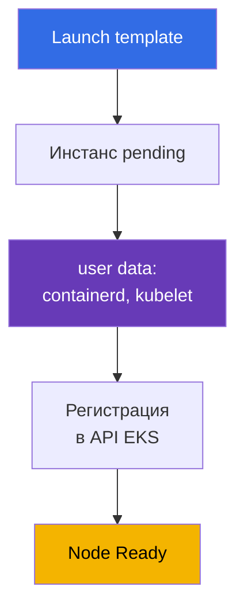
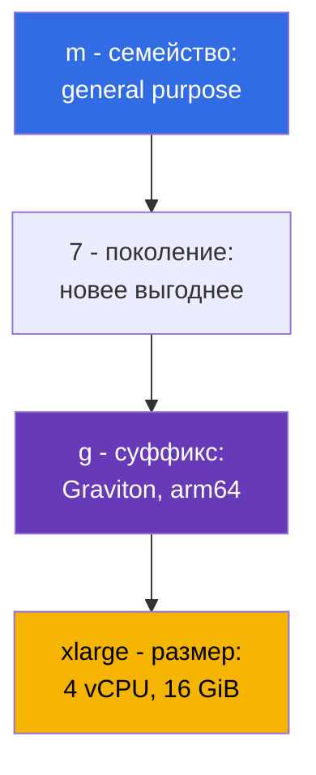
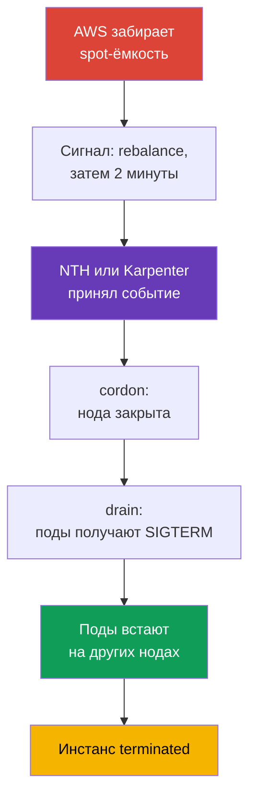

# Глава 0.4. EC2 и модели оплаты: типы инстансов, AMI, on-demand, spot, Savings Plans

> **Что дальше.** Аккаунт, регион и AZ понятны (глава 0.1), права выдаёт IAM (0.2), адреса
> живут в VPC (0.3). Осталось то, из чего собран data plane: виртуальная машина EC2. Нода
> EKS - это инстанс с конкретным типом, образом AMI, диском и ценником, и почти все решения
> о плотности, надёжности и стоимости кластера принимаются здесь. Разберём EC2 в объёме,
> нужном для нод, и сразу свяжем с ценой: on-demand, spot, Savings Plans, Graviton.

## 0.4.1. Инстанс EC2 как нода кластера

**Инстанс EC2** - виртуальная машина: тип (сколько vCPU и памяти), AMI (что загрузится),
подсеть и security group (глава 0.3), IAM instance profile (роль инстанса, глава 0.2) и диски.
Нода Kubernetes - такой инстанс, на котором при старте поднялись containerd и kubelet, а
kubelet зарегистрировался в API-сервере. Ключевое звено регистрации - **user data**: конфиг,
который передаётся инстансу при запуске и выполняется до старта kubelet; там имя кластера,
endpoint API-сервера, CA-сертификат и аргументы kubelet (labels, taints, `--max-pods`). В
AL2023 это cloud-init с секцией `NodeConfig`, в Bottlerocket - TOML (главы 10 и 45).



Жизненный цикл: `pending` -> `running` (тарифицируется) -> `stopped` (платите только за EBS)
-> `terminated` (безвозвратно). Для нод `stopped` не используют: ноду не ремонтируют, а
**заменяют**, поэтому данные на ней эфемерны, а смена AMI или типа - это пересоздание.

**IMDS (Instance Metadata Service)** - локальный endpoint `169.254.169.254`, где инстанс узнаёт
свой ID, регион, AZ, тип и получает **временные credentials своей IAM-роли**: оттуда их берут
kubelet, VPC CNI и aws-node. Обратная сторона - обычный под тоже может дотянуться до IMDS и
**забрать credentials роли ноды**, которой разрешено читать ECR и управлять ENI. Поэтому IMDSv2
обязателен, hop limit равен 1, а права подам выдают через IRSA или Pod Identity (главы 16-19).

```bash
# IMDSv2: сначала токен, потом запрос метаданных (v1 без токена уже отключают)
TOKEN=$(curl -sX PUT "http://169.254.169.254/latest/api/token" \
  -H "X-aws-ec2-metadata-token-ttl-seconds: 21600")
curl -s -H "X-aws-ec2-metadata-token: $TOKEN" \
  http://169.254.169.254/latest/meta-data/instance-id
# Требовать IMDSv2 и закрыть метаданные от подов
aws ec2 modify-instance-metadata-options --instance-id i-0123456789abcdef0 \
  --http-tokens required --http-put-response-hop-limit 1
```

## 0.4.2. Семейства и размеры: как читается t3.medium и m7g.xlarge

Имя типа - не бренд, а описание. `m7g.xlarge` разбирается по частям:



Размеры растут по прайсу почти линейно: `large`, `xlarge`, `2xlarge`, `4xlarge`, `8xlarge`, и
`2xlarge` вдвое дороже `xlarge` при вдвое больших ресурсах - поэтому выбор «два `xlarge` или
один `2xlarge`» это вопрос надёжности и плотности, а не цены (раздел 0.4.8). Суффиксы: `g` -
Graviton (arm64), `i` - Intel, `a` - AMD, `d` - локальный NVMe, `n` - усиленная сеть.

| Семейство | Класс | Соотношение | Где применяют в кластере |
|-----------|-------|-------------|--------------------------|
| `t3`, `t4g` | burstable | 1:2 / 1:4 | dev-кластеры и учёба, не prod-ноды |
| `m5`, `m6i`, `m7g` | general purpose | 1 vCPU : 4 GiB | ноды по умолчанию, системные аддоны |
| `c6i`, `c7g` | compute optimized | 1 vCPU : 2 GiB | CI-раннеры, обработка, кодеки |
| `r6i`, `r7g` | memory optimized | 1 vCPU : 8 GiB | JVM, кэши, аналитика |
| `i4i`, `im4gn` | storage optimized | локальный NVMe | Kafka, Elasticsearch, кэши на диске |
| `g5`, `p5` | accelerated | GPU | ML-инференс и обучение, свои taints |

**ARM против x86.** Graviton - это arm64, и тут две вещи. Первая: образы должны существовать под
arm64, иначе под падает с `exec format error`; публичные обычно multi-arch, свои собирают через
`docker buildx --platform linux/amd64,linux/arm64`. Вторая: смешанный кластер работает, но
нагрузки разводят по `kubernetes.io/arch` через nodeSelector или affinity.

**Ловушка T-серии.** `t3` и `t4g` - **burstable**: базово им положена доля vCPU (у `t3.medium`
это 20% на ядро), всё выше берётся из **CPU credits**, которые копятся в простое. Под нагрузкой
кредиты кончаются, инстанс тормозит до базового уровня (или доплачивается в режиме `unlimited`),
kubelet и CNI подвисают, нода флапает в `NotReady`, а причина не видна в `kubectl describe`.

## 0.4.3. Сколько подов влезает на инстанс

С VPC CNI (режим по умолчанию) **каждый под получает реальный IP из подсети VPC**, а адреса
выдаются через ENI - сетевые интерфейсы инстанса. Число ENI и число IP на ENI фиксированы для
типа, поэтому плотностью управляет размер инстанса: `max-pods = ENI * (IP на ENI - 1) + 2`.

| Тип | ENI | IP на ENI | Примерный max-pods |
|-----|-----|-----------|--------------------|
| `t3.small` | 3 | 4 | 11 |
| `m5.large` | 3 | 10 | 29 |
| `m5.4xlarge` | 8 | 30 | 234 |

На мелких инстансах потолок подов бьёт раньше, чем кончаются CPU и память, а системные поды
(aws-node, kube-proxy, CSI-драйверы, агент логов) занимают слоты на **каждой** ноде: на
`t3.small` остаётся 6-7 мест. Лимит поднимает prefix delegation (глава 7), плотность - глава 14.

```bash
# Сравнить плотность типов: ENI и число IP на интерфейс
aws ec2 describe-instance-types --instance-types t3.medium m5.xlarge m7g.2xlarge \
  --query 'InstanceTypes[].[InstanceType,NetworkInfo.MaximumNetworkInterfaces,
    NetworkInfo.Ipv4AddressesPerInterface]' --output table
```

## 0.4.4. AMI: образ, из которого поднимается нода

**AMI (Amazon Machine Image)** - шаблон диска, с которого стартует инстанс. Для нод не берут
«просто Linux»: AWS публикует **EKS-оптимизированные AMI** с containerd, kubelet нужной минорной
версии, CNI-плагином и bootstrap-логикой. Варианты: **Amazon Linux 2023** (обычный дистрибутив,
`dnf`, привычная отладка), **Bottlerocket** (минимальная ОС под контейнеры, read-only root,
обновление целым образом), **Windows** и устаревающий **AL2**. Разница между первыми двумя
чувствуется на дежурстве: в Bottlerocket нет ни привычной оболочки, ни пакетного менеджера, и
зайти на ноду по SSH, чтобы «посмотреть логи», не получится - отладка идёт через штатные
control- и admin-контейнеры или через SSM Session Manager (главы 10 и 45).

Главное свойство: **AMI привязана к минорной версии Kubernetes**. Образ для `1.33` не ставят в
кластер `1.34` - у kubelet ограничен разрыв версий с API-сервером, поэтому обновление кластера
включает обновление AMI. ID зависит от версии, региона, архитектуры и варианта и берётся из SSM:

```bash
# ID EKS-оптимизированного AL2023 для 1.33 (для Graviton - arm64 вместо x86_64,
# для Bottlerocket - /aws/service/bottlerocket/aws-k8s-1.33/x86_64/latest/image_id)
aws ssm get-parameter --region eu-central-1 \
  --name /aws/service/eks/optimized-ami/1.33/amazon-linux-2023/x86_64/standard/recommended/image_id \
  --query Parameter.Value --output text
```

AMI - такой же объект жизненного цикла, как версия кластера: AWS регулярно выпускает сборки с
патчами ядра и закрытыми CVE, и «нода полгода на старом образе» - не стабильность, а долг. В
managed node group обновление штатное, с rolling replacement (глава 10), порядок - глава 38.

## 0.4.5. Диски ноды: root-том EBS, gp3 и локальный NVMe

У ноды есть **root-том EBS** - сетевой блочный диск с ОС, образами контейнеров, слоями
containerd и эфемерным стореджем подов (`emptyDir`, логи). Размер и тип задаются в launch
template, и про них часто забывают: маленький том заполняется образами, kubelet включает
**disk pressure**, вытесняет поды и чистит кэш. Для нод берут `gp3`: IOPS и пропускная
способность настраиваются независимо от размера, и он дешевле `gp2`.

**Instance store** - локальные NVMe у типов с суффиксом `d` (`m6id`, `c6gd`) и у storage
optimized (`i4i`, `im4gn`). Быстрые и включены в цену инстанса, но **эфемерные**: данные
исчезают при замене инстанса, а на спот-нодах это регулярное событие. Годятся под кэш сборки и
scratch; постоянные данные - только EBS или EFS.

Важное следствие из главы 0.1: **том EBS живёт в одной AZ** и подключается только к инстансу
этой же зоны, поэтому под с PVC привязан к зоне своего тома, а если автоскейлер поднимет ноду в
другой AZ, под останется в `Pending`. Отсюда `WaitForFirstConsumer` и shared storage - глава 23.

## 0.4.6. Auto Scaling group и launch template

Ноды не создают по одной. Работают два объекта EC2:

- **Launch template** - версионируемый шаблон запуска: AMI, тип (или список типов), security
  groups, IAM instance profile, размер и тип root-тома, user data, настройки IMDS, теги.
- **Auto Scaling group (ASG)** - группа инстансов, которая держит заданное число машин (`min`,
  `desired`, `max`) по подсетям разных AZ, заменяет упавшие и смешивает on-demand и spot.

**Managed node group EKS - это ASG плюс launch template**, которыми управляет сервис EKS: он
создаёт их сам, проставляет теги, умеет drain при обновлении и знает про спот-прерывания. Отсюда
правило, экономящее часы отладки: **ASG managed node group не правят руками** - меняют параметры
node group или свою версию launch template. Варианты вычислений (managed, self-managed, Fargate,
Auto Mode) сравниваем в главе 9, кастомизацию bootstrap - в главе 10; Karpenter создаёт инстансы
напрямую, без ASG, и потому реагирует быстрее (главы 11 и 12).

```bash
# Границы масштабирования групп нод и содержимое последней версии шаблона запуска
aws autoscaling describe-auto-scaling-groups --query 'AutoScalingGroups[].[
  AutoScalingGroupName,MinSize,DesiredCapacity,MaxSize]'
aws ec2 describe-launch-template-versions --launch-template-id lt-0123456789abcdef0 \
  --versions '$Latest' --query 'LaunchTemplateVersions[].LaunchTemplateData'
```

Ещё один атрибут запуска, о котором стоит знать заранее, - **placement group**. По умолчанию
EC2 сам раскидывает ваши инстансы по разному железу, чтобы снизить коррелированные отказы, и в
большинстве случаев это то, что нужно. Вмешиваются, когда нагрузка либо очень чувствительна к
задержке между нодами, либо сама умеет реплицировать данные и хочет знать, что реплики стоят на
разных стойках. Платы за создание группы нет, стратегий четыре (есть ещё precision time под
точное время), и для кластеров интересны три:

| Стратегия | Что делает | Типичная нагрузка | Ограничение, о которое бьются |
|-----------|-----------|-------------------|-------------------------------|
| `cluster` | пакует инстансы рядом внутри одной AZ, минимальная задержка | HPC, распределённое обучение моделей | одна AZ на всю группу; смешивание типов снижает шанс найти ёмкость |
| `partition` | разные партиции не делят стойки, до 7 партиций на AZ | Cassandra, HDFS, HBase, Kafka | число инстансов ограничено только лимитами аккаунта |
| `spread` | каждый инстанс на отдельном железе | несколько критичных нод | жёстко **7 работающих инстансов на AZ** на группу |

Три ловушки, которые проявляются именно в кластере. Первая: `spread` плюс автомасштабирование -
восьмая нода в зоне просто не запустится, а Karpenter или ASG будут упираться в отказ, и по
симптому это выглядит как нехватка ёмкости. Вторая: если подходящего уникального железа нет,
запрос **падает**, а не встаёт в очередь, поэтому группу не делают обязательной для нод, без
которых кластер не живёт. Третья: `cluster` по определению держит все ноды в одной AZ, что
противоречит раскладке по трём зонам (глава 40), поэтому его берут под отдельный NodePool, а не
под весь кластер. И отдельно про spot: инстанс, настроенный на stop или hibernate при изъятии,
в placement group запустить нельзя (глава 13).

Задаётся это в launch template для self-managed нод и managed node groups. В EKS Auto Mode для
этого есть поле `placementGroupSelector` в `NodeClass`, и Karpenter тоже умеет запускать ноды в
placement group - подробности в главах 9 и 12.

## 0.4.7. Модели оплаты: on-demand, spot, Savings Plans, Graviton

**On-demand** - оплата за секунды работы по прайсу, без обязательств: база сравнения и дефолт.

**Spot** - свободные мощности со скидкой обычно 60-90%. Цена своя для каждого типа и AZ, а
инстанс могут **прервать**, когда мощность понадобилась AWS: приходит уведомление через IMDS и
EventBridge и даётся **две минуты**. Kubernetes переживает это спокойно, если нагрузки готовы:
NodeTerminationHandler или Karpenter ловят событие, помечают ноду `NoSchedule` и делают drain.
Разница в том, откуда именно берётся сигнал: с самой ноды через IMDS или централизованно, когда
EventBridge складывает события в очередь SQS, а контроллер её читает. Второй путь и есть
продакшен-вариант для Karpenter: он не зависит от живости конкретной ноды (главы 12 и 13).



Вся цепочка обязана уложиться в 120 секунд, и это не рекомендация, а физический дедлайн: по его
истечении инстанс исчезает независимо от того, закончились ли ваши поды. Поэтому на спот-нодах
PDB и корректная обработка SIGTERM в приложении - обязательная часть конфигурации (глава 40).

**Savings Plans** и **Reserved Instances** - скидка за обязательство тратить
фиксированную сумму (или держать конкретные инстансы) **1 или 3 года**. Планов Savings
два, и разница важна для гибрида EC2 + Fargate (главы 9 и 15). **Compute Savings Plans**
самый гибкий: скидка идёт на EC2, Fargate и Lambda независимо от семейства, размера,
региона и ОС, так что переезд с `m6i` на `m7g` или части нагрузки с нод на Fargate её не
ломает. **EC2 Instance Savings Plans** дают скидку глубже, но покрывают только EC2 и одно
семейство в одном регионе (например `m7g` в eu-central-1), гибкие внутри него по размеру,
AZ и ОС; на Fargate они не действуют. RI привязаны к типу и зоне и для нод берутся редко.
Обязательство считают **по нижней границе** потребления, пики закрывает спот. **Graviton**
- не модель оплаты, а отдельный источник экономии.

Для GPU под обучение и крупные ML-джобы есть **EC2 Capacity Blocks for ML**: бронь ёмкости
инстансов P-семейства и Trainium на будущую дату и на срок от суток до полугода, до восьми
недель вперёд, с гарантией доступности. Это резерв дефицитных ускорителей, а не скидка: на
такой брони поднимают ноды под конечное окно обучения, а не держат их постоянно (глава 9).

| Модель | Скидка | Риск | Для каких нод кластера |
|--------|--------|------|------------------------|
| **On-demand** | нет | нет | системные ноды, контроллеры, базы в кластере |
| **Spot** | 60-90% | прерывание за 2 минуты | stateless-сервисы, CI, batch, очереди |
| **Compute SP** | гибче | обязательство 1-3 года, EC2+Fargate+Lambda | предсказуемая база, гибрид |
| **EC2 Instance SP** | глубже | обязательство на семейство в регионе | стабильный профиль нод |
| **Reserved Instances** | 30-70% | привязка к типу и зоне | редкие профили нод |
| **Capacity Blocks** | резерв ёмкости | окно и дата брони | GPU и Trainium под обучение |
| **Graviton** | 15-40% | нужны arm64-образы | всё, что собирается multi-arch |

```bash
# Спот-цены по типам и зонам за последний час: основа диверсификации
aws ec2 describe-spot-price-history --product-descriptions "Linux/UNIX" \
  --instance-types m7g.xlarge m6i.xlarge c7g.xlarge \
  --start-time "$(date -u -d '1 hour ago' +%Y-%m-%dT%H:%M:%S)" \
  --query 'SpotPriceHistory[].[InstanceType,AvailabilityZone,SpotPrice]' --output table
# Рекомендация по Compute Savings Plans на год по факту потребления
aws ce get-savings-plans-purchase-recommendation --savings-plans-type COMPUTE_SP \
  --term-in-years ONE_YEAR --payment-option NO_UPFRONT --lookback-period-in-days SIXTY_DAYS
```

Типовой продакшн-микс: базовая ёмкость на on-demand под Savings Plans, всё эластичное - на споте
с широким списком типов, и по возможности на Graviton (главы 13 и 43).

## 0.4.8. Сайзинг нод: много мелких или несколько крупных

Одинаковый объём CPU и памяти набирается десятком `m7g.large` или парой `m7g.4xlarge`:

- **Взрывной радиус.** Потеря мелкой ноды не заметна, крупная уносит большой кусок нагрузок.
- **Overhead системных подов.** aws-node, kube-proxy, CSI-драйверы и агенты логов стоят ресурсов
  на **каждой** ноде: чем нод больше, тем меньше полезная доля.
- **Лимит подов.** На мелких инстансах вы упираетесь в max-pods, а CPU и память простаивают; под
  с запросом 8 GiB на `large` вообще не поместится.
- **Шаг масштабирования.** Мелкая нода поднимается быстрее и добавляет ёмкость небольшими
  порциями; крупная даёт грубый и дорогой шаг, зато меньше теряется на упаковке.

Разумная середина - ноды `xlarge` - `4xlarge`, по нескольку в AZ, профили разведены по NodePool.

Отдельно про спот: **однородный набор инстансов - главный враг спот-нод**. Если группа разрешает
только `m6i.2xlarge`, изъятие мощности этого типа в этой AZ выбивает все ноды сразу, и PDB не
поможет. Правильно - 10-20 совместимых типов разных семейств и поколений в трёх AZ: тогда
прерывания приходят по одной ноде и кластер их не замечает (глава 12).

Мало дать список типов - важно, **как из него выбирается пул**. `lowest-price` берёт самые
дешёвые пулы и потому прерывается чаще; `capacity-optimized` выбирает пулы с наибольшим запасом
мощности и минимизирует изъятия; `capacity-optimized-prioritized` делает то же, но best-effort
соблюдает заданный порядок приоритета типов (нужен launch template). Для нод берут
capacity-ориентированные стратегии, а не `lowest-price`, а Karpenter по умолчанию использует
`price-capacity-optimized`, балансируя цену и запас мощности (глава 13).

## 0.4.9. Как это применяют в продакшене

- **Два профиля нод.** Небольшая on-demand-группа под системные аддоны (CoreDNS, контроллеры,
  метрики) и спот-ёмкость под приложения: системное на споте даёт каскадные инциденты.
- **Разделение по семействам.** `m` для общего, `c` для CI и обработки, `r` для JVM и кэшей,
  GPU-нодам свои taints. Один универсальный тип на всё означает переплату.
- **Graviton по умолчанию.** Новые сервисы собирают multi-arch сразу, старые переводят по
  готовности образов: самая простая экономия без изменения архитектуры. ID образа берут из SSM,
  обновление AMI планируют вместе с обновлением кластера (главы 10 и 38), а покрытие Savings
  Plans пересматривают раз в квартал (глава 43).

## 0.4.10. Мини-глоссарий

- **Инстанс EC2** - виртуальная машина; для EKS это нода с containerd и kubelet.
- **User data** - конфиг, выполняемый при старте инстанса; в нём bootstrap ноды.
- **IMDS** - сервис метаданных на `169.254.169.254`; отдаёт данные инстанса и временные
  credentials IAM-роли. В проде только IMDSv2 с hop limit 1.
- **Тип инстанса** - `семейство + поколение + суффикс . размер`, например `m7g.xlarge`.
  **Graviton** - процессоры AWS на arm64 (суффикс `g`), требуют multi-arch образов.
- **Burstable (T-серия)** - базовая доля CPU плюс **CPU credits**; для prod-нод не годится.
  **max-pods** - предел подов на ноде, в VPC CNI зависит от числа ENI и IP на ENI.
- **AMI** - образ старта инстанса; AL2023 и Bottlerocket привязаны к минорной версии Kubernetes.
  **EBS / instance store** - сетевой том в одной AZ / эфемерный локальный NVMe.
- **Launch template / Auto Scaling group** - версионируемый шаблон запуска / группа инстансов с
  `min`, `desired`, `max` по подсетям AZ.
- **Placement group** - управление размещением инстансов: `cluster` (рядом, минимальная
  задержка, одна AZ), `partition` (разные стойки по партициям, до 7 на AZ), `spread` (каждый
  на своём железе, не больше 7 работающих на AZ).
- **On-demand / Spot** - оплата по факту / мощности со скидкой и прерыванием за две минуты.
  **Savings Plans / RI** - скидка 30-70% за обязательство на 1 или 3 года.
- **Compute SP / EC2 Instance SP** - гибкий план (EC2, Fargate, Lambda) / более глубокий, но
  на одно семейство в регионе. **Capacity Blocks** - бронь GPU/Trainium-ёмкости под обучение.
- **Стратегия спота** - как выбирается пул: `capacity-optimized(-prioritized)` против
  `lowest-price`; capacity-ориентированные реже прерываются.

## 0.4.11. Итоги главы

- Нода EKS - инстанс EC2: launch template задаёт AMI, тип, SG и user data, user data поднимает
  kubelet, kubelet регистрируется в кластере. Ноды одноразовые: их заменяют.
- IMDS выдаёт credentials роли ноды, поэтому IMDSv2 и hop limit 1 обязательны, а права подам
  дают через IRSA или Pod Identity (главы 16, 17, 19).
- Имя типа читается по частям: семейство, поколение, суффиксы (`g` - Graviton, `d` - локальный
  NVMe), размер; T-серия с CPU credits для prod-нод не подходит. Размер задаёт и число подов
  через ENI и IP: мелкие ноды упираются в max-pods раньше, чем в ресурсы (главы 6, 7, 14).
- AMI привязана к минорной версии Kubernetes, ID берут из SSM, обновление образа - часть
  жизненного цикла кластера (главы 10 и 38).
- Root-том gp3 надо сайзить, instance store эфемерен, том EBS живёт в одной AZ и привязывает под
  с PVC к зоне (глава 23). Managed node group = ASG + launch template под управлением EKS, и
  руками ASG не правят (главы 9 и 10).
- Экономика нод: on-demand как база под Savings Plans, спот с широкой диверсификацией типов для
  эластичной части, Graviton как множитель экономии (главы 13 и 43).

## 0.4.12. Как это пригодится в реальной работе

Разбор инцидентов с нодами идёт на уровне EC2: почему инстанс не стал нодой (user data, IAM,
SG), почему поды не помещаются (max-pods, а не CPU), почему нода ушла в `NotReady` (кончились
CPU credits или место на root-томе), почему разом исчезло полкластера (однородные спот-ноды).
Тот же уровень отвечает за деньги: семейство, Graviton, доля спота и покрытие Savings Plans.

## 0.4.13. Вопросы для самопроверки

1. Что должно произойти на инстансе, чтобы он стал нодой кластера, и где это описано?
2. Зачем kubelet нужен IMDS и почему hop limit 1 - это про безопасность?
3. Разберите `c7gd.2xlarge` по частям: что означает каждая?
4. Почему `t3.medium` - плохой выбор для prod-ноды?
5. У вас `m5.large`, поды в `Pending`, CPU и память свободны. Что проверить первым?
6. Почему ID EKS-оптимизированной AMI не хардкодят и откуда его берут?
7. Чем instance store отличается от root-тома EBS и что на нём можно держать?
8. Что такое managed node group в терминах EC2 и почему её ASG не правят руками?
9. Сколько времени даёт спот-прерывание и чем плоха группа спот-нод из одного типа инстанса?
10. Когда Savings Plans выгоднее спота и как их сочетают в одном кластере?

## Практика

Своих лаб у Части 0 нет: это фундамент под остальные главы. Практика начнётся в Части 1, когда
вы поднимете кластер EKS через Terragrunt, а ноды, спот и Karpenter будете отрабатывать в лабах
Части 2. Дальше - инструменты: aws cli, eksctl, terraform и terragrunt, helm и плагины.

---
[Оглавление](../README_RU.md) · [Глава 0.3](../00-3-vpc/ru.md) · [Глава 0.5](../00-5-tools/ru.md)
