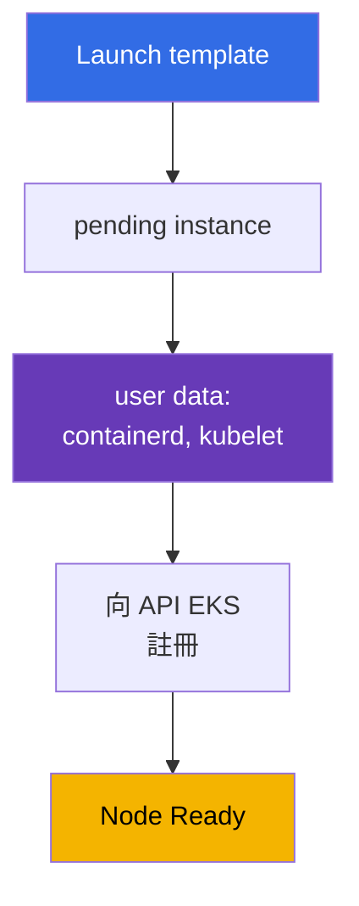
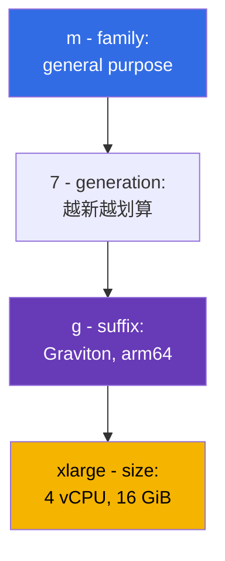
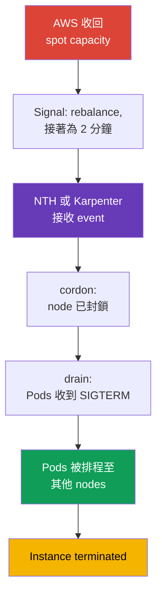

[Русская версия](ru.md) · [Eng version](en.md) · [Versión en español](es.md) · [Version française](fr.md) · [Deutsche Version](de.md) · [ქართული ვერსია](ge.md) · [日本語版](jp.md)
# 第 0.4 章. EC2 與計費模型：instance types、AMI、on-demand、spot、Savings Plans

> **接下來。** 你已了解 account、region 與 AZ（第 0.1 章），IAM 負責授權（第 0.2 章），addresses 位於 VPC（第 0.3 章）。接下來要看的是 data plane 的組成：EC2 virtual machine。EKS node 是具有特定 type、AMI、disk 與價格的 instance，cluster 的 density、reliability 與 cost 幾乎都在此決定。我們將介紹 nodes 所需範圍的 EC2，並立即連結至價格：on-demand、spot、Savings Plans、Graviton。

## 0.4.1. 作為 cluster node 的 EC2 instance

**EC2 instance** 是 virtual machine：type（vCPU 與 memory 的數量）、AMI（啟動的內容）、subnet 與 security group（第 0.3 章）、IAM instance profile（instance role，第 0.2 章）以及 disks。Kubernetes node 就是這樣的 instance，啟動時會執行 containerd 與 kubelet，而 kubelet 會向 API server 註冊。註冊的關鍵環節是 **user data**：instance 啟動時傳入並在 kubelet 啟動前執行的 config；其中包含 cluster name、API server endpoint、CA certificate 與 kubelet arguments（labels、taints、`--max-pods`）。在 AL2023 中，這是帶有 `NodeConfig` section 的 cloud-init；在 Bottlerocket 中則是 TOML（第 10 與第 45 章）。



生命週期：`pending` -> `running`（計費）-> `stopped`（只需支付 EBS）-> `terminated`（不可復原）。不會對 nodes 使用 `stopped`：node 不會修復，而是**替換**，所以其資料是 ephemeral，變更 AMI 或 type 就是重新建立。

**IMDS (Instance Metadata Service)** 是 local endpoint `169.254.169.254`，instance 可在此取得自身 ID、region、AZ、type 及其 **IAM role 的 temporary credentials**：kubelet、VPC CNI 與 aws-node 都從這裡取得它們。反面是一般 Pod 也可能連到 IMDS，並**取得 node role 的 credentials**，該 role 可讀取 ECR 與管理 ENI。因此 IMDSv2 是必要條件，hop limit 必須為 1，而 Pod permissions 應透過 IRSA 或 Pod Identity 授予（第 16-19 章）。

```bash
# IMDSv2：先取得 token，再要求 metadata（不含 token 的 v1 已停用）
TOKEN=$(curl -sX PUT "http://169.254.169.254/latest/api/token" \
  -H "X-aws-ec2-metadata-token-ttl-seconds: 21600")
curl -s -H "X-aws-ec2-metadata-token: $TOKEN" \
  http://169.254.169.254/latest/meta-data/instance-id
# 強制使用 IMDSv2，並禁止 Pods 存取 metadata
aws ec2 modify-instance-metadata-options --instance-id i-0123456789abcdef0 \
  --http-tokens required --http-put-response-hop-limit 1
```

## 0.4.2. Families 與 sizes：如何理解 t3.medium 與 m7g.xlarge

type 的名稱不是品牌，而是描述。`m7g.xlarge` 可分解為：



sizes 的價格幾乎線性成長：`large`、`xlarge`、`2xlarge`、`4xlarge`、`8xlarge`，而資源增加一倍的 `2xlarge` 比 `xlarge` 貴一倍。因此「兩個 `xlarge` 或一個 `2xlarge`」是 reliability 與 density 的問題，而不是價格問題（第 0.4.8 節）。suffixes：`g` 是 Graviton（arm64）、`i` 是 Intel、`a` 是 AMD、`d` 是 local NVMe、`n` 是增強網路。

| Family | Class | Ratio | 在 cluster 中的用途 |
|-----------|-------|-------------|--------------------------|
| `t3`, `t4g` | burstable | 1:2 / 1:4 | dev clusters 與學習，不作為 prod nodes |
| `m5`, `m6i`, `m7g` | general purpose | 1 vCPU : 4 GiB | default nodes、system add-ons |
| `c6i`, `c7g` | compute optimized | 1 vCPU : 2 GiB | CI runners、processing、codecs |
| `r6i`, `r7g` | memory optimized | 1 vCPU : 8 GiB | JVM、caches、analytics |
| `i4i`, `im4gn` | storage optimized | local NVMe | Kafka、Elasticsearch、disk caches |
| `g5`, `p5` | accelerated | GPU | ML inference 與 training、專用 taints |

**ARM 對 x86。** Graviton 是 arm64，此處有兩件事。第一，images 必須存在 arm64 版本，否則 Pod 會因 `exec format error` 失敗；public images 通常是 multi-arch，自己的 images 則用 `docker buildx --platform linux/amd64,linux/arm64` 建置。第二，mixed cluster 可以運作，但要透過 nodeSelector 或 affinity 依 `kubernetes.io/arch` 分配 workloads。

**T-series 的陷阱。** `t3` 與 `t4g` 都是 **burstable**：基本上只獲得一部分 vCPU（`t3.medium` 每個 core 是 20%），超出的部分取自在閒置時累積的 **CPU credits**。在負載下 credits 會耗盡，instance 降速至 basic level（或在 `unlimited` mode 額外付費），kubelet 與 CNI 停頓，node 在 `NotReady` 間反覆切換，但原因不會出現在 `kubectl describe`。

## 0.4.3. 一個 instance 可容納多少 Pods

使用 VPC CNI（default mode）時，**每個 Pod 都會從 VPC subnet 取得真實 IP**，addresses 透過 ENI（instance network interfaces）配置。每個 type 的 ENI 數量與每個 ENI 的 IP 數量皆固定，因此 instance size 決定 density：`max-pods = ENI * (IP per ENI - 1) + 2`。

| Type | ENI | 每個 ENI 的 IP | 約略 max-pods |
|-----|-----|-----------|--------------------|
| `t3.small` | 3 | 4 | 11 |
| `m5.large` | 3 | 10 | 29 |
| `m5.4xlarge` | 8 | 30 | 234 |

在小型 instances 上，Pod 上限會早於 CPU 和 memory 耗盡；system Pods（aws-node、kube-proxy、CSI drivers、logging agent）在**每個** node 都會占用 slots：`t3.small` 僅剩 6-7 個位置。prefix delegation（第 7 章）能提高上限，而第 14 章處理 density。

```bash
# 比較 types 的 density：ENI 與每個 interface 的 IP 數量
aws ec2 describe-instance-types --instance-types t3.medium m5.xlarge m7g.2xlarge \
  --query 'InstanceTypes[].[InstanceType,NetworkInfo.MaximumNetworkInterfaces,
    NetworkInfo.Ipv4AddressesPerInterface]' --output table
```

## 0.4.4. AMI：node 的啟動 image

**AMI (Amazon Machine Image)** 是 instance 啟動所使用的 disk template。nodes 不使用「一般 Linux」：AWS 發布含有 containerd、適合 minor version 的 kubelet、CNI plugin 與 bootstrap logic 的 **EKS-optimized AMI**。選項包括 **Amazon Linux 2023**（一般 distribution、`dnf`、熟悉的 debugging）、**Bottlerocket**（專為 containers 設計的最小化 OS、read-only root、以完整 image 更新）、**Windows** 與逐漸淘汰的 **AL2**。前兩者的差異會在值班時感受到：Bottlerocket 沒有熟悉的 shell 或 package manager，不能 SSH 登入 node 「查看 logs」；debugging 要經由標準的 control 與 admin containers，或 SSM Session Manager（第 10 與第 45 章）。

最重要的特性是：**AMI 綁定 Kubernetes minor version**。不會在 `1.34` cluster 安裝 `1.33` 的 image，因為 kubelet 與 API server 的 version gap 有限制，所以 cluster update 包含 AMI update。ID 取決於 version、region、architecture 與 variant，並從 SSM 取得：

```bash
# 1.33 的 EKS-optimized AL2023 ID（Graviton 使用 arm64 而非 x86_64，
# Bottlerocket 使用 /aws/service/bottlerocket/aws-k8s-1.33/x86_64/latest/image_id）
aws ssm get-parameter --region eu-central-1 \
  --name /aws/service/eks/optimized-ami/1.33/amazon-linux-2023/x86_64/standard/recommended/image_id \
  --query Parameter.Value --output text
```

AMI 與 cluster version 一樣是 lifecycle object：AWS 定期發行包含 kernel patches 與已修補 CVEs 的 builds，而「node 在舊 image 上停留半年」不是穩定性，而是 technical debt。managed node group 可進行標準 rolling replacement update（第 10 章），其順序見第 38 章。

## 0.4.5. Node disks：EBS root volume、gp3 與 local NVMe

node 有 **EBS root volume**，它是保存 OS、container images、containerd layers 及 Pod ephemeral storage（`emptyDir`、logs）的 network block disk。其 size 與 type 在 launch template 中設定，且常被遺忘：小 volume 被 images 填滿時，kubelet 會產生 **disk pressure**、evict Pods 並清理 cache。nodes 應使用 `gp3`：IOPS 與 throughput 可獨立於 size 設定，且比 `gp2` 便宜。

**Instance store** 是帶有 `d` suffix 的 types（`m6id`、`c6gd`）與 storage optimized types（`i4i`、`im4gn`）上的 local NVMe。它很快且包含在 instance price 中，但屬於**ephemeral**：instance 替換時資料消失，而 spot nodes 上這是常見事件。適合 build cache 與 scratch；persistent data 只能使用 EBS 或 EFS。

第 0.1 章的重要推論：**EBS volume 位於單一 AZ**，且只能連接該 zone 中的 instance。因此帶有 PVC 的 Pod 綁定其 volume 所在 zone；若 autoscaler 在其他 AZ 啟動 node，Pod 將保持 `Pending`。這就是 `WaitForFirstConsumer` 與 shared storage 的原因，第 23 章會介紹。

## 0.4.6. Auto Scaling group 與 launch template

nodes 不會逐一建立，而是使用兩個 EC2 objects：

- **Launch template** - versioned launch template：AMI、type（或 type list）、security groups、IAM instance profile、root volume size 與 type、user data、IMDS settings、tags。
- **Auto Scaling group (ASG)** - 依不同 AZ 的 subnets 維持指定數量（`min`、`desired`、`max`）instances 的 group，並替換故障 instances、混用 on-demand 與 spot。

**EKS managed node group 是 ASG 加上 launch template**，並由 EKS service 管理：它自行建立、設定 tags、能在 update 時執行 drain，並了解 spot interruptions。因此有一條可節省數小時 debugging 的規則：**不要手動修改 managed node group 的 ASG**，應變更 node group parameters 或自己的 launch template version。compute options（managed、self-managed、Fargate、Auto Mode）在第 9 章比較，bootstrap customization 在第 10 章；Karpenter 直接建立 instances、不使用 ASG，因此反應更快（第 11 與第 12 章）。

```bash
# Node group 的 scaling limits 與最新 launch template version 的內容
aws autoscaling describe-auto-scaling-groups --query 'AutoScalingGroups[].[
  AutoScalingGroupName,MinSize,DesiredCapacity,MaxSize]'
aws ec2 describe-launch-template-versions --launch-template-id lt-0123456789abcdef0 \
  --versions '$Latest' --query 'LaunchTemplateVersions[].LaunchTemplateData'
```

還有一項應及早了解的 launch attribute：**placement group**。預設 EC2 會將 instances 分散到不同 physical hardware，以降低 correlated failures，多數情況下這正是所需行為。只有 workload 對 nodes 間 latency 極敏感，或自身能 replication data 且希望確知 replicas 位於不同 racks 時，才需要干預。建立 group 沒有費用，有四種 strategies（另有用於精確 time 的 precision time），其中 clusters 關心三種：

| Strategy | 作用 | 典型 workload | 會遇到的限制 |
|-----------|-----------|-------------------|-------------------------------|
| `cluster` | 將 instances 集中在同一 AZ，最低 latency | HPC、distributed model training | 整個 group 僅一個 AZ；混合 types 降低找到 capacity 的機率 |
| `partition` | 不同 partitions 不共用 racks，每 AZ 最多 7 partitions | Cassandra、HDFS、HBase、Kafka | instances 的數量僅受 account limits 限制 |
| `spread` | 每個 instance 使用不同 hardware | 少量 critical nodes | 每 group 每 AZ 僅**7 個 running instances** |

三個特別會在 cluster 出現的陷阱。第一，`spread` 加 autoscaling：該 zone 的第八個 node 根本不會啟動，Karpenter 或 ASG 將不斷遇到 rejection，而症狀看似 capacity shortage。第二，沒有適用的 unique hardware 時，request 會**失敗**而非排隊，因此不應讓缺少就會使 cluster 無法運作的 nodes 強制使用此 group。第三，`cluster` 定義上將所有 nodes 保留於一個 AZ，這與三個 zones 的 distribution 相違背（第 40 章），因此它適用於單獨的 NodePool，而非整個 cluster。spot 另有一點：設定為在 reclamation 時 stop 或 hibernate 的 instance，不能在 placement group 中啟動（第 13 章）。

這項設定會在 self-managed nodes 與 managed node groups 的 launch template 中設定。EKS Auto Mode 在 `NodeClass` 中有 `placementGroupSelector` field，而 Karpenter 也能在 placement group 中啟動 nodes，詳情見第 9 與第 12 章。

## 0.4.7. 計費模型：on-demand、spot、Savings Plans、Graviton

**On-demand** 是按 price list 依運行秒數計費，沒有 commitment：它是比較基準與 default。

**Spot** 是通常有 60-90% discount 的閒置 capacity。每個 type 與 AZ 有自己的價格，而 AWS 需要 capacity 時可**中斷** instance：通知會經由 IMDS 與 EventBridge 發出，並給予**兩分鐘**時間。只要 workloads 已準備好，Kubernetes 可平穩處理：NodeTerminationHandler 或 Karpenter 會擷取 event、將 node 標記為 `NoSchedule` 並執行 drain。差異在於 signal 的來源：由 node 自身的 IMDS 傳來，或由 EventBridge 集中將 events 放入 SQS queue、由 controller 讀取。第二種是 Karpenter 的 production option：它不依賴特定 node 仍然存活（第 12 與第 13 章）。



整條鏈必須在 120 秒內完成，這不是建議，而是物理 deadline：到期後 instance 會消失，無論 Pods 是否已結束。因此在 spot nodes 上，PDB 與 application 對 SIGTERM 的正確處理是 configuration 的必要部分（第 40 章）。

**Savings Plans** 與 **Reserved Instances** 是承諾支出固定金額（或維持特定 instances）**1 或 3 年**所獲得的 discount。Savings Plans 有兩種，其差異對 EC2 + Fargate hybrid 很重要（第 9 與第 15 章）。**Compute Savings Plans** 最具彈性：discount 適用於 EC2、Fargate 與 Lambda，不受 family、size、region 與 OS 限制，因此從 `m6i` 遷移到 `m7g`，或將一部分 workload 從 nodes 遷移至 Fargate 都不會破壞它。**EC2 Instance Savings Plans** 提供更高 discount，但只涵蓋 EC2 及一個 region 中的一個 family（例如 eu-central-1 的 `m7g`）；其內可彈性調整 size、AZ 與 OS，但不適用於 Fargate。RI 綁定 type 與 zone，nodes 很少使用。commitment 應依 consumption 的**下限**計算，peaks 則由 spot 覆蓋。**Graviton** 不是計費模型，而是另一種 cost saving 來源。

對 GPU training 與大型 ML jobs，有 **EC2 Capacity Blocks for ML**：預訂未來日期開始、從一天到半年期間的 P-family 與 Trainium instance capacity，最早可提前八週，且保證可用性。這是稀缺 accelerators 的 reservation，而非 discount：nodes 只在有限 training window 啟動，不會永久維持（第 9 章）。

| Model | Discount | Risk | 適合的 cluster nodes |
|--------|------|------|------------------------|
| **On-demand** | 無 | 無 | system nodes、controllers、cluster 中的 databases |
| **Spot** | 60-90% | 兩分鐘後中斷 | stateless services、CI、batch、queues |
| **Compute SP** | 更有彈性 | 1-3 年 commitment，EC2+Fargate+Lambda | predictable base、hybrid |
| **EC2 Instance SP** | 更高 | region 內對 family 的 commitment | stable node profile |
| **Reserved Instances** | 30-70% | 綁定 type 與 zone | 罕見 node profiles |
| **Capacity Blocks** | capacity reservation | reservation window 與 date | 用於 training 的 GPU 與 Trainium |
| **Graviton** | 15-40% | 需要 arm64 images | 所有可建置 multi-arch 的項目 |

```bash
# 最近一小時各 type 與 zone 的 spot prices：diversification 的基礎
aws ec2 describe-spot-price-history --product-descriptions "Linux/UNIX" \
  --instance-types m7g.xlarge m6i.xlarge c7g.xlarge \
  --start-time "$(date -u -d '1 hour ago' +%Y-%m-%dT%H:%M:%S)" \
  --query 'SpotPriceHistory[].[InstanceType,AvailabilityZone,SpotPrice]' --output table
# 依實際 consumption 取得一年期 Compute Savings Plans recommendation
aws ce get-savings-plans-purchase-recommendation --savings-plans-type COMPUTE_SP \
  --term-in-years ONE_YEAR --payment-option NO_UPFRONT --lookback-period-in-days SIXTY_DAYS
```

典型 production mix：以 Savings Plans 覆蓋 on-demand base capacity，所有 elastic capacity 使用含有寬廣 type list 的 spot，並盡可能使用 Graviton（第 13 與第 43 章）。

## 0.4.8. Node sizing：許多小 nodes 或少數大 nodes

相同 CPU 與 memory 容量可由十個 `m7g.large` 或兩個 `m7g.4xlarge` 提供：

- **Blast radius。** 小 node 的遺失不明顯，大 node 會帶走大量 workloads。
- **System Pod overhead。** aws-node、kube-proxy、CSI drivers 與 logging agents 在**每個** node 都使用 resources：nodes 越多，可用比例越小。
- **Pod limit。** 小 instances 會先碰到 max-pods，而 CPU 與 memory 閒置；要求 8 GiB 的 Pod 甚至無法放入 `large`。
- **Scaling increment。** 小 node 啟動更快，並以較小 increments 增加 capacity；大 node 的 increment 粗大且昂貴，卻有較少 packing loss。

合理的中間值是每個 AZ 數個 `xlarge` 至 `4xlarge` nodes，並依 NodePool 分開 profiles。

spot 還有一點：**homogeneous instance set 是 spot nodes 最大的敵人**。若 group 只允許 `m6i.2xlarge`，該 AZ 中此 type 的 capacity 被收回時，所有 nodes 都會同時消失，PDB 也無法幫助。正確做法是在三個 AZ 中使用 10-20 個不同 families 與 generations、但彼此相容的 types：如此 interruptions 會逐 node 發生，cluster 不會注意到（第 12 章）。

僅提供 type list 還不夠，重要的是**如何從中選擇 pool**。`lowest-price` 會選擇最便宜的 pools，因此 interruptions 更頻繁；`capacity-optimized` 選擇 capacity reserve 最大的 pools，以降低 reclamations；`capacity-optimized-prioritized` 做同樣的事，但會以 best-effort 遵守 type priority order（需要 launch template）。nodes 應使用 capacity-oriented strategies，而非 `lowest-price`；Karpenter 預設使用 `price-capacity-optimized`，平衡價格與 capacity reserve（第 13 章）。

## 0.4.9. 在 production 中如何使用

- **兩種 node profiles。** 一個小型 on-demand group 用於 system add-ons（CoreDNS、controllers、metrics），spot capacity 用於 applications：將 system workloads 放在 spot 會導致 cascading incidents。
- **依 families 劃分。** `m` 用於 general workloads，`c` 用於 CI 與 processing，`r` 用於 JVM 與 caches，GPU nodes 有自己的 taints。使用一個 universal type 處理所有內容代表 overpayment。
- **預設使用 Graviton。** 新 services 立即建置 multi-arch，舊 services 則依 image readiness 遷移：這是不改變 architecture 的最簡單節省方式。image ID 由 SSM 取得，AMI update 與 cluster update 一起規劃（第 10 與第 38 章），Savings Plans coverage 則每季檢視一次（第 43 章）。

## 0.4.10. Mini glossary

- **EC2 instance** - virtual machine；在 EKS 中是執行 containerd 與 kubelet 的 node。
- **User data** - instance 啟動時執行的 config；其中包含 node bootstrap。
- **IMDS** - 位於 `169.254.169.254` 的 metadata service；提供 instance data 與 IAM role temporary credentials。production 僅使用 hop limit 為 1 的 IMDSv2。
- **Instance type** - `family + generation + suffix . size`，例如 `m7g.xlarge`。**Graviton** - AWS 的 arm64 processors（suffix `g`），需要 multi-arch images。
- **Burstable (T-series)** - basic CPU share 加上 **CPU credits**；不適合 prod nodes。**max-pods** - node 的 Pod 上限，在 VPC CNI 中取決於 ENI 數量及每個 ENI 的 IP 數量。
- **AMI** - instance boot image；AL2023 與 Bottlerocket 綁定 Kubernetes minor version。**EBS / instance store** - 單一 AZ 中的 network volume / ephemeral local NVMe。
- **Launch template / Auto Scaling group** - versioned launch template / 依 AZ subnets 維持 `min`、`desired`、`max` instances 的 group。
- **Placement group** - instance placement control：`cluster`（靠近、最低 latency、單一 AZ）、`partition`（依 partitions 使用不同 racks，每 AZ 最多 7 個）、`spread`（每個位於各自的 hardware，每 AZ 至多 7 個 running）。
- **On-demand / Spot** - 按使用量計費 / 有 discount、可在兩分鐘後中斷的 capacity。**Savings Plans / RI** - 承諾 1 或 3 年以取得 30-70% discount。
- **Compute SP / EC2 Instance SP** - flexible plan（EC2、Fargate、Lambda）/ 折扣較高但限於 region 中一個 family 的 plan。**Capacity Blocks** - 為 training 預訂 GPU/Trainium capacity。
- **Spot strategy** - pool 選擇方式：`capacity-optimized(-prioritized)` 相對於 `lowest-price`；capacity-oriented strategies 較少發生 interruptions。

## 0.4.11. 本章小結

- EKS node 是 EC2 instance：launch template 定義 AMI、type、SG 與 user data，user data 啟動 kubelet，kubelet 向 cluster 註冊。nodes 是一次性的，應予以替換。
- IMDS 提供 node role credentials，因此 IMDSv2 與 hop limit 1 為必要條件，而 Pod permissions 透過 IRSA 或 Pod Identity 授予（第 16、17、19 章）。
- type name 可分解為 family、generation、suffix（`g` 是 Graviton，`d` 是 local NVMe）與 size；具有 CPU credits 的 T-series 不適合 prod nodes。size 也透過 ENI 與 IP 決定 Pod 數量：小 nodes 會早於 resources 碰到 max-pods（第 6、7、14 章）。
- AMI 綁定 Kubernetes minor version，ID 從 SSM 取得，image update 是 cluster lifecycle 的一部分（第 10 與第 38 章）。
- gp3 root volume 必須正確 sizing，instance store 是 ephemeral，EBS volume 位於單一 AZ 並將帶 PVC 的 Pod 綁定該 zone（第 23 章）。managed node group = 由 EKS 管理的 ASG + launch template，且不應手動修改 ASG（第 9 與第 10 章）。
- Node economics：on-demand 作為 Savings Plans 下的 base，spot 以廣泛 diversified types 處理 elastic portion，Graviton 作為 cost multiplier（第 13 與第 43 章）。

## 0.4.12. 在實際工作中的用途

分析 node incidents 要從 EC2 層級著手：為何 instance 沒有成為 node（user data、IAM、SG）、為何 Pods 無法排入（max-pods 而非 CPU）、為何 node 進入 `NotReady`（CPU credits 或 root volume space 耗盡）、為何一半 cluster 同時消失（homogeneous spot nodes）。同一層級也決定費用：family、Graviton、spot share 與 Savings Plans coverage。

## 0.4.13. 自我檢測問題

1. instance 上必須發生什麼事才會成為 cluster node，且在哪裡描述？
2. kubelet 為何需要 IMDS，為何 hop limit 1 與 security 有關？
3. 將 `c7gd.2xlarge` 分解為各部分：每部分代表什麼？
4. 為何 `t3.medium` 是 prod node 的不良選擇？
5. 有一個 `m5.large`，Pods 處於 `Pending`，CPU 與 memory 可用。應首先檢查什麼？
6. 為何不 hardcode EKS-optimized AMI ID，應從哪裡取得它？
7. instance store 與 EBS root volume 有何不同，其中可以保存什麼？
8. 以 EC2 術語而言，什麼是 managed node group，為何不手動修改它的 ASG？
9. spot interruption 提供多少時間，且由單一 instance type 組成 spot node group 有何問題？
10. 何時 Savings Plans 比 spot 更有利，又如何在同一 cluster 中組合兩者？

## 實作

第 0 部分沒有自己的 labs：它是其他 chapters 的基礎。當你使用 Terragrunt 建立 EKS cluster 時，實作就會從第 1 部分開始；nodes、spot 與 Karpenter 將在第 2 部分的 labs 中練習。接下來是工具：aws cli、eksctl、terraform 與 terragrunt、helm 與 plugins。

---
[目錄](../README_TW.md) · [第 0.3 章](../00-3-vpc/tw.md) · [第 0.5 章](../00-5-tools/tw.md)
