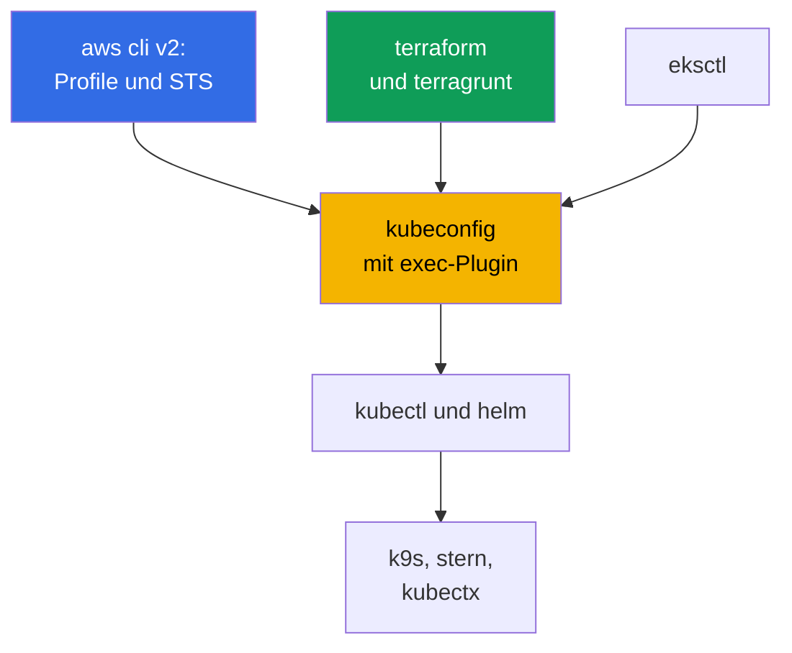
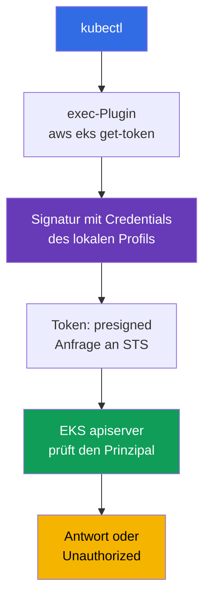
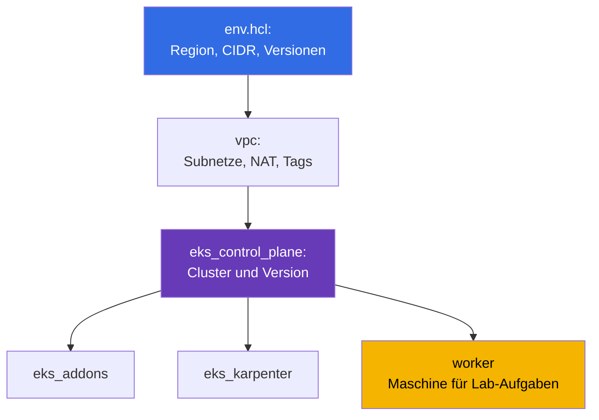

[Русская версия](ru.md) · [Eng version](en.md) · [Versión en español](es.md) · [Version française](fr.md) · [ქართული ვერსია](ge.md) · [繁體中文版](tw.md) · [日本語版](jp.md)
# Kapitel 0.5. Tools: aws cli, eksctl, terraform und terragrunt, helm, nützliche Plugins

> **Wie es weitergeht.** Hinter Ihnen liegen Konto und Abrechnung (Kapitel 0.1), IAM (0.2), VPC (0.3) und EC2 (0.4).
> Es bleibt, den Arbeitsplatz einzurichten: kubectl und helm kennen Sie, aber bei EKS kommt eine
> AWS-Schicht hinzu - aws-cli-Profile, ein exec-Plugin für das Token, IaC mit terraform und terragrunt,
> managed addons. Dieses Kapitel behandelt Tools und Gewohnheiten, keine neuen Kubernetes-Abstraktionen. Danach
> beginnt Teil 1: Was EKS übernimmt und was bei Ihnen bleibt (Kapitel 1), sowie der erste Cluster.

## 0.5.1. Die Tool-Schicht von EKS: Was zu kubectl hinzukommt

In einem kubeadm-Cluster war das Set kurz: kubectl, helm, SSH auf die Nodes. Bei EKS entsteht ein zweiter
Kreislauf: Die AWS-API erstellt den Cluster, IAM erteilt Zugriff, Nodes entstehen aus einem launch template, und
Systemkomponenten werden entweder als managed addon oder per Chart installiert.



Die zentrale Erkenntnis: **kubectl ist bei EKS nicht eigenständig**. Es authentifiziert sich nicht, wenn daneben
kein funktionierendes aws cli mit dem richtigen Profil vorhanden ist. Daraus entstehen fast alle "seltsamen" Zugriffsfehler.

## 0.5.2. aws cli v2: Profile, Region und der erste Befehl bei jedem Problem

Es wird als einzelnes Paket installiert (Archiv von der AWS-Website, `brew install awscli`, Paket der Distribution). Wichtig
ist nur eines: **v2, nicht v1** - dort gibt es `aws configure sso` und das aktuelle `eks get-token`. Die Konfiguration
liegt in `~/.aws/config` (Profile, Regionen, SSO) und `~/.aws/credentials` (Schlüssel, falls es überhaupt welche gibt).
Ein Profil ist ein benannter Satz von Zugriffsparametern, und davon gibt es immer mehrere: eines pro Konto und Rolle;
bei `prod` gibt es ein eigenes `role_arn` und `source_profile`.

Das Profil wird mit dem Flag `--profile` oder der Variablen `AWS_PROFILE` gewählt, die Region mit `--region` oder
`AWS_REGION`. Variablen sind praktischer: terraform, eksctl und helm-Provider sehen sie ebenfalls.
Langlebige Schlüssel werden nicht benötigt: IAM Identity Center stellt Zugriff über STS bereit (Kapitel 0.2),
die Einrichtung erfolgt einmalig, danach melden Sie sich im Browser an. API-Antworten sind riesig, und zwei Flags helfen:
`--query` mit einem JMESPath-Ausdruck und `--output table` für lesbare Ausgabe.

Profile umzuschalten und Sitzungen zu speichern ist mit Hilfsprogrammen bequemer als mit bloßen Variablen. `aws-vault`
hält Credentials im System-Keychain und startet einen Befehl in einer temporären Sitzung, ohne das Geheimnis in die
Umgebung zu legen: `aws-vault exec prod -- terraform apply`. `granted` (Befehl `assume`) schaltet schnell
SSO-Profile um und öffnet die Konsole des benötigten Kontos in einem eigenen Browser-Tab, wodurch die Verwirrung
"in welchem Konto bin ich gerade" entfällt.

```bash
export AWS_PROFILE=dev             # welches Profil verwendet werden soll
export AWS_REGION=eu-central-1     # Standardregion

# Der erste Befehl bei JEDEM Problem: Konto, Identity-ARN, userId
aws sts get-caller-identity

aws configure sso --profile prod   # einmalig: Start-URL, Konto, Rolle
aws sso login --profile prod       # jeden Morgen: temporäre Credentials für einige Stunden

aws eks describe-cluster --name demo \
  --query 'cluster.{name:name,status:status,version:version}' --output table

aws ec2 describe-subnets --filters "Name=tag:karpenter.sh/discovery,Values=demo" \
  --query 'Subnets[].[SubnetId,AvailabilityZone,CidrBlock]' --output table
```

## 0.5.3. kubeconfig für EKS: Wie kubectl ein Token erhält

kubeconfig wird mit einem einzigen Befehl geschrieben: Er fügt Cluster, Kontext und Benutzer hinzu, ohne
bestehende Einträge zu beschädigen.

```bash
# Das Minimum, plus Optionen: eigener Kontextname, separate Datei, festgelegtes Profil
aws eks update-kubeconfig --region eu-central-1 --name demo \
  --alias eks-demo --kubeconfig ~/.kube/eks-demo.yaml --profile prod
```

Danach folgt die EKS-Spezifik: In kubeconfig gibt es **weder ein Token noch ein Client-Zertifikat**. Stattdessen gibt es
einen Abschnitt `exec`, der `aws eks get-token --cluster-name demo` ausführt. Dieser signiert die
Anfrage mit den aktuellen Credentials, und der apiserver prüft die Signatur über IAM und erhält den Prinzipal,
der anschließend auf RBAC abgebildet wird.



Hier kann man sich leicht unnötige Befürchtungen ausdenken, daher klären wir den Ablauf. Das Plugin **fragt STS
nicht nach einem Token**: Es signiert lokal mit Ihren Credentials eine presigned-Anfrage an
`sts:GetCallerIdentity`, und diese signierte Anfrage ist das Token. Den Aufruf an STS führt bereits der
apiserver aus, wenn er das vorgelegte Token prüft. Zweitens: Das Plugin läuft nicht für jede HTTP-Anfrage -
es liefert ein Objekt `ExecCredential` mit dem Feld `status.expirationTimestamp`, und `client-go`
hält die erhaltenen Credentials bis zu diesem Zeitpunkt im Speicher des Prozesses. Daher stoßen ein langlebiges `k9s`,
`kubectl get -w` oder ein Skript in einer Schleife nicht an die Aufrufratenlimits der AWS-API. Der Cache lebt im
Rahmen des Prozesses: Jedes neue `kubectl` startet das Plugin erneut, aber dies ist eine lokale Signatur und kein
Netzwerkaufruf.

```bash
# Bis wann client-go das aktuelle Token wiederverwenden wird
aws eks get-token --cluster-name demo --query 'status.expirationTimestamp'
```

Eine Einschränkung zum Throttling gibt es dennoch, sie betrifft aber nicht das Token selbst: Wenn die Credentials des
Profils von SSO oder über `assume-role` kommen, ruft die CLI IAM Identity Center und STS tatsächlich auf.
Diese Antworten werden in `~/.aws/sso/cache` und `~/.aws/cli/cache` zwischengespeichert; sie "vorsichtshalber"
zu löschen ist ein sicherer Weg, einen Aufrufsturm auszulösen und `Throttling` zu erhalten.

- **In kubeconfig gibt es kein Geheimnis**, das Token ist kurzlebig, die Rechte bestimmen IAM plus RBAC.
- **Das Token hängt vom Profil ab.** Ändern Sie `AWS_PROFILE` - und derselbe Kontext greift mit
  einer anderen Identity auf den Cluster zu; das Flag `--profile` bei `update-kubeconfig` wird in `args`
  geschrieben und beseitigt diese Mehrdeutigkeit. Es wird viele Cluster geben, daher werden `kubectl config get-contexts` und
  `use-context` zur Gewohnheit (oder `kubectx` ersetzt sie).
- **`error: You must be logged in to the server (Unauthorized)`** betrifft meist nicht RBAC, sondern den
  Prinzipal: `aws sso login` ist abgelaufen, ein fremdes `AWS_PROFILE` ist exportiert, oder die Rolle wurde nicht
  zum Cluster hinzugefügt. Die Prüfungsreihenfolge: `aws sts get-caller-identity`, danach Access Entries (Kapitel 5).

## 0.5.4. eksctl: Ein ausgezeichneter Aufklärer, ein schlechter Besitzer von Produktion

`eksctl` ist die offizielle CLI für EKS. Mit einem Befehl erstellt es einen Cluster mit VPC, node group, Rollen
und OIDC-Provider. Intern sind das keine direkten API-Aufrufe, sondern die Generierung von CloudFormation.

```bash
eksctl create cluster --name demo --region eu-central-1 --version 1.34 \
  --nodegroup-name ng-default --node-type t3.medium --nodes 2 --managed

# Untersuchung eines beliebig erstellten Clusters
eksctl get cluster --region eu-central-1
eksctl get nodegroup --cluster demo --region eu-central-1
```

Es ist unersetzlich, um einen Cluster für einen Tag hochzufahren oder eine Übersicht über node groups und Add-ons zu
sehen. Für Produktion ist es ungeeignet: Die Befehle sind **imperativ** (der Zustand wird nicht im Repository beschrieben),
im Hintergrund läuft **eigenes CloudFormation**, das für Ihr terraform unsichtbar ist, und Änderungen außerhalb von IaC
verursachen **Drift**. Einen Cluster, der teilweise mit eksctl und teilweise mit terraform erstellt wurde, kann man fast
nicht sauber löschen. Die Regel des Kurses: **eksctl und die Konsole lesen, terraform schreibt** (Kapitel 4).

| Methode | Vorteile | Nachteile | Wann verwenden |
|--------|-------|--------|-----------------|
| AWS-Konsole | anschaulich, keine Vorbereitung | keine Reproduzierbarkeit | ansehen, ausprobieren |
| `eksctl` | Cluster mit einem Befehl | Imperativität, eigenes CFN | Lernen, ad hoc, Untersuchung |
| terraform + terragrunt | Code in git, Review | längerer Start, HCL erforderlich | alles, was lange lebt |

## 0.5.5. terraform: Warum der Cluster als Code beschrieben wird

Ein EKS-Cluster ist keine einzelne Ressource, sondern eine VPC mit Tags, Subnetze, IAM-Rollen, OIDC-Provider, node
groups, Add-ons, security groups. Man kann das manuell zusammenbauen, aber es in drei Umgebungen und nach einem Jahr
wiederholen - nein. Drei Dinge, die Sie vor dem ersten `apply` verstehen müssen:

- **State.** Die Zuordnung "Ressource im Code - Ressource in AWS" wird in einer State-Datei gespeichert. Für
  ein Team liegt sie remote mit Sperrung, damit nicht zwei Engineers gleichzeitig `apply` ausführen.
  Im Repository ist das Backend einmalig in `terraform/environments/terragrunt.hcl` definiert: ein S3-Bucket mit
  `encrypt = true`, eine DynamoDB-Tabelle für Sperren, der State-Schlüssel aus dem Stack-Pfad.
- **Provider.** `aws` erstellt AWS-Ressourcen, `kubernetes` und `helm` arbeiten innerhalb des bereits
  hochgefahrenen Clusters. Daraus ergibt sich das Henne-Ei-Problem: Der Provider `kubernetes` wird auf einen
  Cluster konfiguriert, der bei der Planung vielleicht noch nicht existiert, daher werden Cluster und dessen Inhalte auf
  getrennte Stacks verteilt.
- **Module.** Ein wiederverwendbarer Block mit Ein- und Ausgaben: eines für die VPC, eines für die control plane, eines
  für die node group. Die Labs des Kurses verwenden Module aus `terraform/modules`; die gewohnten Befehle lauten:
  `terraform init`, `plan`, `apply`, `destroy`.

## 0.5.6. terragrunt: Wie die Umgebungen dieses Kurses aufgebaut sind

Terragrunt ist ein schlanker Wrapper über terraform. Es beseitigt Copy-paste: ein gemeinsames Backend für alle
Stacks, Umgebungsparameter an einer Stelle, Abhängigkeiten zwischen Stacks, Start einer Stack-Gruppe mit einem
Befehl. Die Lab-Umgebungen sind so aufgebaut: Im Verzeichnis des Labs liegt `env.hcl` mit Parametern und ein
Unterverzeichnis pro Stack, jedes mit einem eigenen `terragrunt.hcl`.



Was tatsächlich in `env.hcl` von Lab 02 steht (Karpenter, Kapitel 12): `region = "eu-central-1"`,
`vpc_default_cidr = "10.10.0.0/16"`, `stack_name`, der Name der Umgebung `env_name` aus `stack_name` plus
`TF_VAR_USER_ID` und `TF_VAR_ENV_ID` (daher hat jeder Lernende eigene Ressourcennamen), die Karte
`subnets` mit zwei öffentlichen und vier privaten Subnetzen (zwei für EKS, zwei für RDS) mit den Tags
`kubernetes.io/role/elb`, `kubernetes.io/role/internal-elb` und `karpenter.sh/discovery`, der
NAT-Modus pro Subnetz (`DEFAULT`, `SINGLE`, `NONE`), `k8_version`, `node_type` (`ondemand` oder
`spot`), Instanztypen und eine Liste von Spot-Typen, `root_volume` auf `gp3`, gemeinsame `tags` zur
Kostenabrechnung. Neben den gezeigten gibt es die Stacks `ssh-keys` und `eks_fargate_system`. Die
Abhängigkeiten werden mit dem Block `dependency` beschrieben: `eks_control_plane` deklariert
`dependency "vpc"` und übernimmt aus dessen Ausgaben `vpc_id` und die Subnetzlisten; terragrunt erstellt
auf Basis dieser Blöcke den Startgraphen.

```bash
terragrunt run-all apply     # alle Stacks unter Berücksichtigung der Abhängigkeiten; destroy - in umgekehrter Reihenfolge
terragrunt run-all output    # Ausgaben aller Stacks sammeln
```

Separat zum Binary. Terragrunt funktioniert gleichermaßen mit terraform und **OpenTofu** - dem offenen
Fork, der oft gewählt wird, um nicht von der Lizenz abhängig zu sein. Die Module und `terragrunt.hcl` dieses
Kurses sind damit kompatibel; Sie müssen keinen Code ändern, sondern nur angeben, womit orchestriert wird:

```hcl
# terragrunt.hcl: womit genau plan und apply ausgeführt werden
terraform_binary = "tofu"
```

Dasselbe wird mit einer Umgebungsvariable eingestellt (`TERRAGRUNT_TFPATH`, in neueren Versionen `TG_TF_PATH`), was
in CI praktisch ist. Aktuelle Versionen von Terragrunt bevorzugen `tofu` selbst, wenn es vorhanden ist; daher wird
auf Maschinen, auf denen beide Binaries installiert sind, die Wahl ausdrücklich festgelegt - andernfalls kann der Plan
lokal und in der Pipeline mit verschiedenen Tools berechnet werden.

## 0.5.7. helm: Womit Controller installiert werden und wann ein managed addon besser ist

Helm kennen Sie, daher nur EKS-spezifisches. Per Charts wird fast die gesamte Plattformschicht installiert: AWS
Load Balancer Controller (Kapitel 26), Karpenter (12), external-dns und cert-manager (29),
kube-prometheus-stack (33), External Secrets (18), Fluent Bit (34). Ein Teil der AWS-Charts liegt in
`oci://public.ecr.aws`; die Logik ist dieselbe: explizite Version plus eigene `values.yaml` in git.

```bash
helm repo add eks https://aws.github.io/eks-charts && helm repo update

helm upgrade --install aws-load-balancer-controller eks/aws-load-balancer-controller \
  --namespace kube-system --version 1.13.0 \
  --set clusterName=demo --set serviceAccount.create=false \
  --set serviceAccount.name=aws-load-balancer-controller

helm get values aws-load-balancer-controller -n kube-system   # mit welchen values es installiert ist
```

Öffentliche Charts werden ohne Authentifizierung abgerufen, aber **eigene Plattform-Charts** eines Unternehmens liegen
gewöhnlich in privatem ECR, und helm muss sich dort getrennt von docker anmelden. Die Registry ist OCI, daher
funktioniert `helm registry login` mit demselben Token wie bei docker:

```bash
# Helm-Anmeldung bei privatem ECR; das Token lebt Stunden, in CI wird der Schritt vor install wiederholt
aws ecr get-login-password --region eu-central-1 \
  | helm registry login --username AWS --password-stdin \
    123456789012.dkr.ecr.eu-central-1.amazonaws.com

# Danach wird das Chart wie üblich installiert, aber über einen OCI-Link und mit expliziter Version
helm upgrade --install platform-base \
  oci://123456789012.dkr.ecr.eu-central-1.amazonaws.com/charts/platform-base \
  --version 2.4.1 -n platform -f values-prod.yaml
```

Der Benutzername lautet immer wörtlich `AWS`, und das Passwort ist ein temporäres Token. Daher gehört dies in der
Pipeline direkt vor die Installation und nicht als gespeichertes Geheimnis. Berechtigungen für pull erteilt dieselbe
IAM-Rolle wie für Images, und kontoübergreifenden Zugriff die Repository-Policy (Kapitel 20).

Zwei Gewohnheiten: **nie ohne `--version`** (sonst ändert sich der Cluster beim nächsten `upgrade` selbst) und
**values in einer Datei**, nicht in `--set` aus der bash-Historie von jemandem. Bei vielen Charts werden sie
deklarativ gehalten: `helmfile` beschreibt die Liste der Releases mit Versionen und Pfaden zu `values.yaml` in einer
`helmfile.yaml`, und `helmfile apply` bringt den Cluster auf diese Beschreibung - dasselbe Prinzip "Code in
git" wie bei terraform, nur für helm. Einige Komponenten (VPC CNI,
kube-proxy, CoreDNS, EBS CSI, Pod Identity Agent) bietet AWS als **managed addons** an:
AWS berechnet die Kompatibilität, die Aktualisierung erfolgt über die Cluster-API. Weniger Freiheit, weniger Arbeit.

| Kriterium | Managed addon | Helm-Chart |
|----------|---------------|-----------|
| Kompatibilität mit der Clusterversion | AWS prüft | Sie prüfen |
| Aktualisierung | EKS-API, sichtbar in IaC und Konsole | `helm upgrade` in Ihrer Pipeline |
| Flexibilität der values | eingeschränkt | vollständig |
| Wer bearbeitet den Vorfall | AWS Support hat Kontext | Sie |

Die Standardpraxis: Basiskomponenten - managed addons, alles Anwendungsbezogene und sich schnell
Entwickelnde (Karpenter, LB Controller, Observability) - helm. Die Grenze steht in Kapitel 37.

## 0.5.8. Nützliche Plugins und Hilfsprogramme

| Tool | Nutzen in einer Zeile |
|------------|----------------------|
| `kubectx` / `kubens` | Kontext und Namespace ohne Änderung der kubeconfig wechseln |
| `k9s` | Terminal-UI: Pods, Logs, Events, exec mit zwei Tastendrücken |
| `stern` | Logs sofort aus allen Pods nach Präfix oder Selektor |
| `krew` | kubectl-Plugin-Manager, über ihn wird alles Weitere installiert |
| `kubectl-neat` | entfernt Systemrauschen aus `get -o yaml` |
| `eks-node-viewer` | Karte der EKS-Nodes mit Auslastung und Kosten, nötig bei der Arbeit mit Karpenter |
| `kubectl-k8i` | Node-Tabelle mit Auslastung, Instanztyp, spot oder on-demand, Zone und NodePool |
| `jq` | Filterung von JSON aus aws cli, wenn `--query` unpraktisch wird |
| `yq` | derselbe Ansatz für YAML: Chart-values, Manifeste, kubeconfig |

```bash
kubectx eks-demo && kubens kube-system   # Kontext und Namespace
stern -n kube-system karpenter           # Logs aller Karpenter-Pods
aws eks describe-nodegroup --cluster-name demo --nodegroup-name ng-default | jq '.nodegroup'
```

Über Plugins sollte man gesondert sprechen, denn die Hälfte der täglichen Annehmlichkeiten lebt gerade dort.
Der Mechanismus ist einfach: **Jede ausführbare Datei mit dem Namen `kubectl-<name>` in `PATH` wird zur
Unteranweisung `kubectl <name>`**. Sie müssen diese nicht manuell installieren; dafür gibt es **krew** - einen
Plugin-Manager mit Index, Suche und Aktualisierung:

```bash
kubectl krew update                  # Plugin-Index aktualisieren
kubectl krew search                  # gesamter Katalog; oder nach Wort: krew search node
kubectl krew info k8i                # was es ist, Version, Homepage
kubectl krew install k8i             # installieren
kubectl krew list                    # was bereits installiert ist
kubectl krew upgrade                 # alle installierten aktualisieren
kubectl krew uninstall k8i           # entfernen

kubectl plugin list                  # Ansicht von kubectl: Was es in PATH sieht
```

Plugins gibt es nicht nur im Hauptindex: Ein eigener oder Unternehmensindex wird als zusätzlicher Index
angeschlossen, danach wird das Plugin mit Präfix installiert (`kubectl krew index add
<name> <git-url>`, danach `kubectl krew install <name>/<plugin>`). Bedenken Sie dabei, dass ein Plugin
eine fremde ausführbare Datei ist, die mit Ihren Rechten und Ihrer kubeconfig läuft: Für
Produktionsumgebungen wird die Plugin-Liste wie jede andere Abhängigkeit abgestimmt (Kapitel 20).

Ein speziell bei EKS nützliches Beispiel ist **`kubectl-k8i`**. Das standardmäßige `kubectl get nodes`
zeigt eine Node als abstrakte Maschine, bei EKS sind die Fragen jedoch meist andere: Ist sie spot oder
on-demand, welcher Instanztyp, in welcher Zone, aus welchem NodePool, wer hat sie erstellt (Karpenter,
Cluster Autoscaler oder Spot.io), und wie stark ist sie tatsächlich im Verhältnis zu requests und limits ausgelastet?
`k8i` sammelt dies in einer Tabelle mit Auslastungsprozenten und kann nach jedem dieser Merkmale filtern und sortieren,
Nodes nach taint gruppieren und mit der Unteranweisung `analyze` zeigen, welche Workloads genau auf den ausgewählten
Nodes laufen und wie stark deren limits von requests abweichen.

```bash
# Plugin: github.com/ViktorUJ/kubectl-k8i (in krew vorhanden oder Binary aus releases)
kubectl krew install k8i

kubectl k8i                                    # alle Nodes: Auslastung, Typ, Zone, Pool
kubectl k8i --filter ec2_type=spot             # nur spot-Nodes (Kapitel 13)
kubectl k8i --autoscaler karpenter --sort cpu_load=desc   # Karpenter-Nodes nach Auslastung
kubectl k8i --group-by taint                   # welche logischen Node-Gruppen existieren
kubectl k8i analyze --autoscaler karpenter --cpu-overcommit 100   # wer fünfmal weniger anfordert
```

Die usage-Werte kommen vom metrics-server: Ohne ihn sind die Auslastungsspalten null, requests und limits
bleiben dennoch sichtbar. Das ist in den Kapiteln 12 und 13 (NodePool, spot) und besonders in Kapitel 14
nützlich, wo gerade die Lücke zwischen requests, limits und tatsächlichem Verbrauch behandelt wird.

## 0.5.9. Hygiene der Arbeitsumgebung

- **Versionen werden festgelegt.** kubectl innerhalb einer Minor-Version zum Cluster, terraform und
  terragrunt werden im Repository gepinnt, Chart-Versionen stehen im Code: Andernfalls liefert `apply` unterschiedliche Ergebnisse.
- **Profile sind nach Konten isoliert.** Profilnamen entsprechen Umgebungen (`dev`, `stage`,
  `prod`), `prod` hat eigenes `role_arn` und MFA. Keine Profile `default`, die in Produktion führen.
  Langlebige Schlüssel gibt es gar nicht: `aws configure sso` plus `aws sso login`, die Lebensdauer beträgt Stunden
  (Kapitel 0.2). Ein Schlüssel `AKIA...` in `~/.aws/credentials` ist ein Vorfall, der nur auf seinen Zeitpunkt wartet.
- **Region und Konto werden vor einem destruktiven Befehl geprüft.** `aws sts get-caller-identity` und
  `kubectl config current-context` vor `run-all destroy` dauern fünf Sekunden, und die Hervorhebung des
  Kontos im shell-Prompt beseitigt die ganze Fehlerklasse "am falschen Ort gelöscht".
- **CLI-Hinweise sind aktiviert.** aws cli v2 hat einen eingebauten auto-prompt: Der Modus `on-partial`
  schlägt Unterbefehle und Parameter vor, greift aber nur ein, wenn der Befehl unvollständig ist oder die
  Validierung nicht bestanden hat. Im Bereitschaftsdienst spart das Zeit beim Erstellen langer `--query` und `--filters`.

```bash
aws configure set cli_auto_prompt on-partial   # Modi: on, on-partial, off
```

## 0.5.10. Wie dies in Produktion verwendet wird

- **Nur IaC erstellt den Cluster.** Ein Repository mit terraform oder terragrunt, Review im PR,
  Ausführung aus CI unter einer getrennten Rolle. Manuell in der Konsole - nur lesen.
- **Einheitliches Tool-Image.** Container oder devcontainer mit festgelegten Versionen von
  aws cli, kubectl, helm, terraform, terragrunt: Engineers und CI haben ein Set.
- **Zugriff über SSO und Rollen.** Die Rolle wird temporär erteilt, kubeconfig bezieht das Token über
  das exec-Plugin, ein Zugriffsverlust erfolgt im Identity Center und nicht durch Clusteränderung.
- **eksctl bleibt als Diagnose-Tool** für `get nodegroup` und `get addon`, aber Produktion wird
  nicht damit angefasst. Was als managed addon an AWS abgegeben werden kann, wird abgegeben; den Rest installieren
  Charts mit expliziten Versionen über GitOps (Kapitel 44).

## 0.5.11. Mini-Glossar

- **aws cli v2** - die Haupt-CLI für AWS; Konfiguration in `~/.aws/config`, Zugriff wird über
  `--profile` oder `AWS_PROFILE` ausgewählt. **Profil** - ein benannter Satz von Parametern: Region,
  Rolle, SSO. **`aws sts get-caller-identity`** - der Befehl "Wer bin ich?": Konto, ARN, userId.
  **`aws-vault`** - Speicherung von Credentials im Keychain und Ausführung von Befehlen in einer temporären Sitzung;
  **`granted`** (`assume`) - schnelles Umschalten von SSO-Profilen und Anmeldung an der Konsole.
- **exec-Plugin der kubeconfig** - der Abschnitt `exec`, der `aws eks get-token` aufruft; ein langlebiges
  Token befindet sich nicht in der Datei, und `client-go` cached die erhaltenen Credentials bis
  `status.expirationTimestamp`. **eksctl** - die offizielle CLI für EKS, arbeitet über
  CloudFormation und ist imperativ.
- **kubectl-Plugin** - eine Datei `kubectl-<name>` in `PATH`, verfügbar als `kubectl <name>`.
  **krew** - Plugin-Manager: Index, `search`, `install`, `upgrade`; unterstützt eigene
  Indizes. **`kubectl plugin list`** - was kubectl in `PATH` sieht.
- **State** - die terraform-State-Datei, für ein Team remote mit Sperrung gespeichert.
  **Provider** - ein terraform-Plugin (`aws`, `kubernetes`, `helm`).
- **terragrunt** - ein Wrapper über terraform: gemeinsames Backend, `env.hcl`, `dependency`, `run-all`,
  DRY-Module ohne Copy-paste. **OpenTofu** - offener Fork von terraform, kompatibel mit den Modulen des
  Kurses; wird über das Attribut `terraform_binary = "tofu"` ausgewählt. **Stack** - ein Verzeichnis mit einem
  `terragrunt.hcl`, das als Einheit angewendet wird. **helmfile** - deklarative Beschreibung einer Menge von
  helm-Releases mit Versionen und values in einer Datei. **Managed addon** - eine Clusterkomponente,
  deren Versionen und Aktualisierung EKS verwaltet.

## 0.5.12. Zusammenfassung des Kapitels

- aws cli v2 plus Profile und `AWS_REGION` - Grundlage für alles; `aws sts get-caller-identity` ist der erste
  Befehl bei einem unklaren Fehler, und `--query` sowie `--output table` machen API-Antworten lesbar.
- `aws eks update-kubeconfig` erstellt einen Kontext ohne Geheimnisse: Das Token bezieht `aws eks
  get-token`, daher bedeutet `Unauthorized` meist ein falsches Profil oder abgelaufenes SSO (Kapitel 5).
- eksctl ist gut für schnelle Cluster und Untersuchung, bringt aber eigenes CloudFormation mit und verursacht Drift;
  Produktion wird mit terraform und terragrunt beschrieben (Kapitel 4), terragrunt ergänzt `env.hcl`,
  die Aufteilung in Stacks und Abhängigkeiten zwischen ihnen: So sind die Labs des Kurses aufgebaut.
- Helm installiert Controller mit expliziten Versionen und values in git, Basiskomponenten werden häufiger als
  managed addons verwendet (Kapitel 37). Plugins und Hygiene der Umgebung (Versionsfixierung, isolierte Profile,
  Verzicht auf langlebige Schlüssel, Kontoprüfung vor `destroy`) sparen Zeit und Geld.

## 0.5.13. Wie dies in der realen Arbeit nützlich ist

Die Tool-Schicht bestimmt die Reaktionsgeschwindigkeit bei einem Vorfall. Wenn Nodes dem
Cluster nicht beitreten (Kapitel 45), wechseln Sie in einer Minute das Profil, sehen die node group über `eksctl get
nodegroup`, lesen Logs über `stern` und vergleichen Subnetz-Tags über `describe-subnets`.
Wenn eine Umgebung in einem anderen Konto wiederholt werden muss, ändern Sie `env.hcl` und führen `run-all` aus.

## 0.5.14. Fragen zur Selbstkontrolle

1. Worin unterscheiden sich `~/.aws/config` und `~/.aws/credentials`, und was bewirkt `AWS_PROFILE`?
2. Warum wird `aws sts get-caller-identity` bei einem Zugriffsproblem zuerst ausgeführt?
3. Was befindet sich bei EKS statt eines Tokens in kubeconfig und wie erhält kubectl Zugriff?
4. `kubectl` liefert `Unauthorized`. Welche drei Ursachen werden vor RBAC geprüft?
5. Wofür eignet sich eksctl und warum erstellt man damit keinen Produktionscluster?
6. Was bietet terragrunt zusätzlich zu terraform und wie hängen die Stacks `vpc` und `eks_control_plane` zusammen?
7. Wann wird eine Komponente besser als managed addon und wann als helm-Chart installiert?
8. Wie findet kubectl Plugins und wie hilft krew dabei? Mit welchen Befehlen sucht und aktualisiert man?
9. Warum beantwortet `kubectl get nodes` bei EKS nicht alle Fragen zu einer Node und was ergänzt `k8i`?

## Praxis

Teil 0 hat keine eigenen Labs, aber hier lässt sich gut nachvollziehen, wie die Labs des Kurses gestartet werden. Die Umgebungen
werden mit Makefile-Zielen im Stammverzeichnis des Repositorys bereitgestellt: Das Ziel kopiert das Lab-Verzeichnis in ein
Arbeitsverzeichnis und führt dort `terragrunt run-all` parallel nach Anzahl der Kerne aus. Die Lab-Nummer
wird mit der Variablen `TASK` übergeben, die Umgebungskennungen sind `USER_ID` und `ENV_ID` (sie gelangen in
`env_name`, daher kollidieren Ressourcen verschiedener Lernender nicht).

```bash
TASK=02 make run_eks_task          # Lab-Umgebung 02 bereitstellen (Karpenter, Kapitel 12)
make output_eks_task               # Stack-Ausgaben: Clusterparameter, Adresse der worker-Maschine
TASK=02 make delete_eks_task       # Umgebung entfernen, um nicht für NAT, Cluster und Nodes zu zahlen
TASK=02 make run_eks_task_clean    # Arbeitsverzeichnis bereinigen und erneut bereitstellen
```

Nach der Bereitstellung melden Sie sich an der worker-Maschine der Umgebung an, erhalten kubeconfig und arbeiten mit dem
gewohnten kubectl. Aufgaben werden mit dem Befehl `check_result` auf der worker-Maschine geprüft: Er startet eine
automatische Prüfung des Clusterzustands und meldet, ob die Aufgabe bestanden wurde oder nicht. Als Erstes sollten Sie
`aws sts get-caller-identity` und `kubectl config current-context` ausführen. Danach folgt Teil 1:
Was EKS genau übernimmt und warum eine verwaltete control plane nicht einen verwalteten Cluster bedeutet.

---
[Inhaltsverzeichnis](../README_DE.md) · [Kapitel 0.4](../00-4-ec2/de.md) · [Kapitel 1](../01/de.md)
